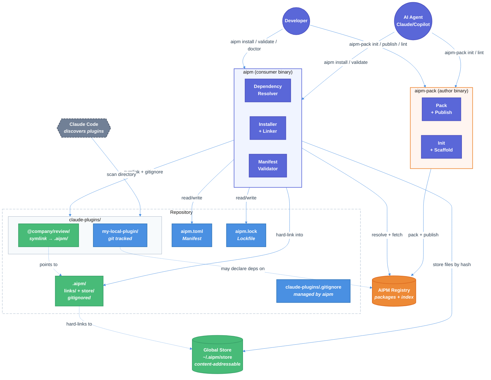

# AIPM (AI Plugin Manager) — Technical Design Document

| Document Metadata      | Details                         |
| ---------------------- | ------------------------------- |
| Author(s)              | selarkin                        |
| Status                 | Draft (WIP)                     |
| Team / Owner           | AI Dev Tooling                  |
| Created / Last Updated | 2026-03-09                      |

## 1. Executive Summary

AIPM is an AI-native package manager — like npm/Cargo but for AI plugin building blocks (skills, agents, MCP servers, hooks). It ships as **two separate Rust binaries**: `aipm` (read-only consumer: install, validate, doctor) and `aipm-pack` (author tooling: pack, publish, yank). This separation follows the security principle of least privilege — consumers who only install plugins never need the publish binary, reducing attack surface. Both binaries work across .NET, Python, Node.js, and Rust monorepos without requiring any specific runtime. AIPM introduces a content-addressable global store (pnpm-inspired), strict dependency isolation, and a workspace model that coexists with existing local plugin directories (e.g. `claude-plugins/`). Registry-installed plugins are symlinked into the local plugins directory so Claude Code discovers them naturally. The manifest format is TOML (`aipm.toml`) with a custom schema — chosen for human-editability, comment support, and AI-generation safety (no indentation traps, no escaping issues). Packages are transferred as `.aipm` archives (gzip-compressed tar with a defined internal layout).

**Test-first approach**: 19 cucumber-rs feature files with 220+ BDD scenarios have been written before any implementation. Implementation will proceed feature-by-feature, driven by these specifications.

## 2. Context and Motivation

### 2.1 Current State

There is no production-grade package manager for AI plugin primitives. Today:

- Claude Code plugins are directories of markdown, JSON, and scripts checked into repos
- Plugin components (skills, agents, hooks, MCP server configs) are copied between repos manually
- No versioning, no dependency resolution, no registry for discovery
- Repos maintain local plugin "marketplaces" (e.g. `claude-plugins/` directories) with no tooling for composition or reuse
- The only existing tool ([microsoft/apm](https://github.com/microsoft/apm)) is a Python prototype with no registry, no semver resolution, no integrity verification, and no storage deduplication (see [2.1.1](#211-prior-art-microsoftapm-agent-package-manager))

### 2.1.1 Prior Art: microsoft/apm

[microsoft/apm](https://github.com/microsoft/apm) (v0.7.7) is the only existing tool in this space — a Python CLI that manages AI agent primitives using YAML manifests and git repos as package sources. It validates the problem but lacks foundational infrastructure for production use:

- **No registry** — packages are git repos; "publishing" is `git push` with no immutability, no yank, no scoped namespaces
- **No semver resolution** — pins by git ref only; no `^1.0` ranges, no backtracking solver, no version unification
- **No integrity verification** — lockfile has commit SHAs but no file-level checksums; force-push attacks are undetected
- **No content-addressable store** — full git clones per project with no deduplication across repos
- **No dependency isolation** — everything in `apm_modules/` is accessible; phantom deps not prevented
- **No transfer format** — raw git repos, no deterministic archives, no file allowlist, no secrets exclusion
- **Python runtime required** — 13 pip dependencies; limits cross-stack adoption in .NET/Go/Rust repos
- **YAML manifest** — Norway problem, implicit type coercion, security CVEs
- **No offline mode, no `--locked` CI mode, no Windows junction support, no workspace protocol, no environment declarations, no `link` command**

Full 16-point analysis: [microsoft-apm-analysis.md](../research/docs/2026-03-10-microsoft-apm-analysis.md)

### 2.2 The Problem

| Priority | Problem | Impact |
|----------|---------|--------|
| **P0** | No package manager or registry for AI plugin primitives | Teams cannot discover, share, or version AI components across orgs |
| **P0** | No dependency resolution for AI component types | A skill that needs an MCP server requires manual setup; no transitive resolution |
| **P1** | No compositional reuse of plugin internals | Hooks, skills, MCP definitions are copy/pasted across plugins |
| **P1** | AI agents (Claude/Copilot) produce low-quality plugins by default | No validation, linting, or scaffolding guardrails |
| **P1** | No monorepo orchestrator integration | Plugin installs/validation don't fit into Rush, Turborepo, BuildXL, MSBuild workflows |
| **P1** | Cross-tech-stack portability | Plugins must work in .NET/C# monorepos where Node/TS isn't the default |
| **P1** | No environment dependency declarations | Plugins can't declare they need `git`, `docker`, or specific env vars |

## 3. Goals and Non-Goals

### 3.1 Functional Goals

**P0 — Core Package Manager**
- [ ] TOML-based manifest (`aipm.toml`) with custom schema, semver enforcement, and component declarations
- [ ] Registry model: publish, install, yank, search, scoped packages, alternative registries
- [ ] Content-addressable global store with hard-linked local working set (`.aipm/`)
- [ ] Strict dependency isolation: only declared dependencies are accessible
- [ ] Deterministic lockfile (`aipm.lock`) capturing exact tree structure and integrity hashes
- [ ] Dependency resolution: backtracking solver, version unification, conflict reporting
- [ ] Local + registry plugin coexistence: registry installs symlinked into `claude-plugins/` for Claude Code discovery
- [ ] Non-workspace single-package mode for simple repos

**P1 — Extended Capabilities**
- [ ] Workspace protocol (`workspace:^`) with auto-replacement on publish
- [ ] Catalogs for shared version ranges across workspace members
- [ ] Workspace filtering (`--filter`) by name, path, git-diff, dependency graph
- [ ] Compositional reuse: skills, agents, MCP servers, hooks as independently publishable packages
- [ ] ~~AI quality guardrails~~ → moved to P2 (see Non-Goals)
- [ ] Built-in dependency patching (`aipm patch`)
- [ ] Dependency overrides with path-scoped selectors
- [ ] Optional features system (additive unification)
- [ ] Environment dependency declarations: **hard requirements** for system tools (git, docker, node, python, bash, powershell), env vars, and platform constraints. Key enabler for cross-team adoption — allows teams using any scripting language to declare what their plugins need.
- [ ] Monorepo orchestrator integration (Rush, Turborepo, BuildXL, MSBuild)
- [ ] Cross-platform self-contained binary (linux-x64, linux-arm64, macos-x64, macos-arm64, windows-x64)

### 3.2 Non-Goals (Out of Scope)

- [ ] We will NOT build a web-based registry UI in this phase (CLI + API only)
- [ ] We will NOT implement a custom transport protocol (HTTPS + JSON API for registry)
- [ ] We will NOT manage MCP server runtime dependencies (npm packages, Python packages) — only reference them
- [ ] We will NOT fork or modify Claude Code's plugin discovery mechanism — we match it via symlinks
- [ ] We will NOT implement lint, quality scores, or machine-readable error guidance in this phase (P2). Basic structural validation happens at publish time; richer quality tooling is deferred.
- [ ] We will NOT support PDF export, GUI, or IDE extensions in this phase

## 4. Proposed Solution (High-Level Design)

### 4.1 System Architecture Diagram



### 4.2 Architectural Patterns

| Pattern | Application | Inspiration |
|---------|------------|-------------|
| Content-addressable storage | Global package store indexed by SHA-512 file hash | pnpm ([ref](../research/docs/2026-03-09-pnpm-core-principles.md)) |
| Symlink-based isolation | Only declared deps accessible; transitive deps hidden | pnpm strict mode |
| Backtracking constraint solver | Dependency resolution with highest-version-first heuristic | Cargo ([ref](../research/docs/2026-03-09-cargo-core-principles.md)) |
| Workspace-as-local-marketplace | `claude-plugins/` dir is the workspace; members = local plugins | pnpm workspaces |
| Convention-over-configuration | Standard directory layout, default `claude-plugins/` path | Cargo |
| Immutable archive | Published versions are permanent; yank but never delete | Cargo + npm post-left-pad ([ref](../research/docs/2026-03-09-npm-core-principles.md)) |

### 4.3 Compositional Reuse — Real-Life Example

Consider three teams at different levels of the org all working with Claude Code plugins:

**Published packages on the registry:**

| Package | Type | Contents | Author |
|---------|------|----------|--------|
| `@acme/pr-review-skill` | skill | SKILL.md for creating/reviewing pull requests | Platform team |
| `@acme/db-query-mcp` | mcp | MCP server definition for querying analytics databases | Platform team |
| `@acme/security-hooks` | hook | Pre-push hooks: secret scanning, branch protection checks | Security team |
| `@acme/ci-agent` | agent | Agent definition that orchestrates CI validation steps | Platform team |

**Team A (web-app)** — has a local plugin for their repo-specific workflows, plus pulls shared packages:

```
web-app/
  aipm.toml                              # workspace root
  claude-plugins/
    deploy-tools/                        # LOCAL plugin (git tracked, team-specific)
      aipm.toml
        # [package]
        # name = "deploy-tools"
        # type = "composite"
        #
        # [dependencies]
        # "@acme/pr-review-skill" = "^1.0"   ← reuses the shared PR skill
        # "@acme/db-query-mcp" = "^2.0"      ← reuses shared DB query MCP config
        # "@acme/security-hooks" = "^1.0"    ← reuses shared security hooks
        #
        # [components]
        # skills = ["skills/deploy/SKILL.md"]  ← their own deploy skill
        # agents = ["agents/release.md"]       ← their own release agent
      skills/
        deploy/SKILL.md                  # team-specific deployment skill
      agents/
        release.md                       # team-specific release agent
    @acme/
      pr-review-skill/                   # LINK → .aipm/links/... (gitignored)
      db-query-mcp/                      # LINK → .aipm/links/... (gitignored)
      security-hooks/                    # LINK → .aipm/links/... (gitignored)
```

**Team B (backend-api)** — different repo, different local plugin, same shared packages:

```
backend-api/
  aipm.toml
  claude-plugins/
    api-diagnostics/                     # LOCAL (their own)
      aipm.toml
        # [dependencies]
        # "@acme/db-query-mcp" = "^2.0"      ← same DB query MCP as Team A
        # "@acme/ci-agent" = "^1.0"          ← shared CI agent
      skills/
        diagnose/SKILL.md               # team-specific diagnostic skill
    @acme/
      db-query-mcp/                      # LINK (same package, resolved once globally)
      ci-agent/                          # LINK
```

**What's happening here:**

```mermaid
%%{init: {'theme':'base', 'themeVariables': { 'primaryColor':'#f8f9fa','primaryTextColor':'#2c3e50','primaryBorderColor':'#4a5568','lineColor':'#4a90e2','secondaryColor':'#ffffff','tertiaryColor':'#e9ecef'}}}%%

flowchart TB
    classDef registry fill:#ed8936,stroke:#dd6b20,stroke-width:2px,color:#ffffff,font-weight:600
    classDef local fill:#4a90e2,stroke:#357abd,stroke-width:2px,color:#ffffff,font-weight:600
    classDef shared fill:#48bb78,stroke:#38a169,stroke-width:2px,color:#ffffff,font-weight:600
    classDef team fill:#5a67d8,stroke:#4c51bf,stroke-width:2px,color:#ffffff,font-weight:600

    subgraph Registry["AIPM Registry"]
        PRSkill["@acme/pr-review-skill<br><i>skill</i>"]:::registry
        DBMCP["@acme/db-query-mcp<br><i>mcp</i>"]:::registry
        SecHooks["@acme/security-hooks<br><i>hook</i>"]:::registry
        CIAgent["@acme/ci-agent<br><i>agent</i>"]:::registry
    end

    subgraph TeamA["web-app repo"]
        direction TB
        DeployPlugin["deploy-tools<br><i>local composite plugin</i>"]:::local
        DeploySkill["skills/deploy/SKILL.md<br><i>team-specific</i>"]:::team
        ReleaseAgent["agents/release.md<br><i>team-specific</i>"]:::team
    end

    subgraph TeamB["backend-api repo"]
        direction TB
        DiagPlugin["api-diagnostics<br><i>local composite plugin</i>"]:::local
        DiagSkill["skills/diagnose/SKILL.md<br><i>team-specific</i>"]:::team
    end

    DeployPlugin -->|"depends on"| PRSkill
    DeployPlugin -->|"depends on"| DBMCP
    DeployPlugin -->|"depends on"| SecHooks
    DeployPlugin --- DeploySkill
    DeployPlugin --- ReleaseAgent

    DiagPlugin -->|"depends on"| DBMCP
    DiagPlugin -->|"depends on"| CIAgent
    DiagPlugin --- DiagSkill

    style Registry fill:#fff8f0,stroke:#ed8936,stroke-width:2px
    style TeamA fill:#f0f4ff,stroke:#4a90e2,stroke-width:2px
    style TeamB fill:#f0f4ff,stroke:#4a90e2,stroke-width:2px
```



**Key reuse patterns illustrated:**

1. **Skill reuse**: `@acme/pr-review-skill` is authored once by the platform team. Team A's `deploy-tools` plugin depends on it — Claude Code sees both the team-specific deploy skill AND the shared PR skill.

2. **MCP server sharing**: `@acme/db-query-mcp` is used by both Team A and Team B. The content-addressable store means the files exist once on disk. Each repo gets a directory link.

3. **Hook composition**: `@acme/security-hooks` provides pre-push hooks. Team A pulls them in as a dependency — the hooks activate alongside any team-specific hooks.

4. **Agent reuse**: `@acme/ci-agent` is a shared CI orchestration agent. Team B uses it directly; Team A has their own release agent instead.

5. **Local + registry composition**: Each team has their own local plugin (git-tracked, team-specific) that _depends on_ shared registry packages. The local plugin adds team-specific skills/agents while inheriting shared components.

6. **Cross-type dependencies**: A composite plugin can depend on a skill, an MCP server, a hook set, and an agent — all as first-class typed dependencies resolved together.

### 4.4 Key Components

| Component | Responsibility | Technology | Justification |
|-----------|---------------|------------|---------------|
| **aipm CLI** | Consumer commands: install, update, uninstall, validate, doctor, search, audit, list | Rust (clap) | Read-only binary for plugin consumers; no publish capability reduces attack surface |
| **aipm-pack CLI** | Author commands: init, pack, publish, yank, login/logout, export, generate-mcp-config | Rust (clap) | Separate binary for plugin authors; only needed by developers creating/publishing plugins |
| **Manifest parser** | Parse/validate `aipm.toml` | Rust (toml crate) | Same parser that powers Cargo; battle-tested ([ref](../research/docs/2026-03-09-manifest-format-comparison.md)) |
| **Dependency resolver** | Backtracking version solver | Rust (custom, inspired by pubgrub) | Must handle AI component types + standard semver |
| **Content store** | Global content-addressable file storage | Rust (filesystem, SHA-512) | Hard links for zero-copy installs |
| **Registry client** | HTTP client for registry API | Rust (reqwest) | Publish, fetch, search, auth |
| **Lockfile manager** | Deterministic lockfile read/write | Rust (custom TOML serializer) | Must capture full tree structure + integrity hashes |
| **Link manager** | Create/remove plugin directory links + gitignore management | Rust (std::os + junction crate) | Symlinks on macOS/Linux, junctions on Windows (no elevation). Bridges registry installs to Claude Code discovery. |
| **Quality linter** | Validate skills, agents, hooks against standards | Rust | P2 — deferred. Basic structural validation at publish time only. |
| **BDD test harness** | cucumber-rs feature tests | Rust (cucumber crate v0.22) | Test-first development; 205+ scenarios written |

## 5. Detailed Design

### 5.1 Manifest Format (`aipm.toml`)

Custom TOML schema. Rationale: TOML chosen over JSON (no comments, not human-editable — [PEP 518 formally rejected it](../research/docs/2026-03-09-manifest-format-comparison.md)), YAML (Norway problem: `3.10` → `3.1`, active security CVEs), and JSONC (fragmented specs, no C# parser). TOML validated by Python PEP 518 and Cargo ecosystems. AIPM will publish a JSON Schema via SchemaStore for IDE autocomplete via Taplo.

**Root workspace manifest:**

```toml
[workspace]
members = ["claude-plugins/*"]
plugins_dir = "claude-plugins"        # default; configurable

[workspace.dependencies]              # catalog (shared version ranges)
common-skill = { version = "^2.0" }

[dependencies]                        # direct registry installs
"@company/code-review" = "^1.0"

[overrides]                           # dependency overrides (pnpm-inspired)
"vulnerable-lib" = "^2.0.0"
"skill-a>common-util" = "=2.1.0"     # path-scoped

[install]
allowed_build_scripts = ["native-tool"]  # lifecycle script allowlist

[environment]
requires = ["git"]
aipm = ">=0.5.0"
```

**Plugin member manifest:**

```toml
[package]
name = "my-ci-tools"
version = "0.1.0"
description = "CI automation skills for my team"
type = "composite"                    # skill | agent | mcp | hook | composite

[dependencies]
shared-lint-skill = "^1.0"           # from registry
core-hooks = { workspace = "^" }     # workspace sibling
heavy-analyzer = { version = "^1.0", optional = true }

[features]
default = ["basic"]
basic = []
deep-analysis = ["dep:heavy-analyzer"]

[components]
skills = ["skills/lint/SKILL.md", "skills/format/SKILL.md"]
agents = ["agents/ci-runner.md"]
hooks = ["hooks/pre-push.json"]
mcp_servers = ["mcp/sqlite.json"]

[environment]
requires = ["docker"]

[environment.variables]
required = ["CI_TOKEN"]

```

### 5.2 Directory Layout

```
repo/
  aipm.toml                           # workspace root (always required)
  aipm.lock                           # single lockfile for everything
  claude-plugins/                     # plugins directory (configurable)
    my-local-plugin/                  # local plugin (git tracked)
      aipm.toml                       # member manifest
      skills/
        review/SKILL.md
      agents/
        reviewer.md
      hooks/
        pre-commit.json
    @company/                         # scope directory
      review-plugin/                  # symlink → .aipm/links/... (gitignored)
    .gitignore                        # managed by aipm
  .aipm/                              # gitignored entirely
    store/                            # local content-addressable cache
      ab/cd1234...                    # files indexed by SHA-512 prefix
    links/                            # assembled package directories
      @company/
        review-plugin/                # hard-linked from store
      shared-lint-skill/
  patches/                            # dependency patches (git tracked)
    shared-lint-skill@1.0.0.patch
```

### 5.3 Dependency Resolution Algorithm

Backtracking constraint solver inspired by Cargo and pubgrub ([ref](../research/docs/2026-03-09-cargo-core-principles.md)):

1. Build the dependency graph from root manifest + all workspace members
2. For each unresolved dependency, try the **highest compatible version** first
3. Attempt to **unify** with an already-activated version if semver-compatible (single version per semver-major where possible)
4. If two packages require semver-**incompatible** ranges of the same dependency (e.g. `^1.0` and `^2.0`), **both major versions coexist** in the graph (Cargo model)
5. If a conflict is found within the same major, **backtrack** and try the next candidate
6. Apply **overrides** before resolution (forced versions bypass normal solving)
7. Exclude **yanked** versions unless pinned in the lockfile
8. On success, generate `aipm.lock` with exact versions, integrity hashes, and tree structure

**Version coexistence (Cargo model, no peer dependencies)**: AIPM does not have peer dependencies. Instead, the resolver uses aggressive version unification: within the same semver-major, all consumers get one version. Across semver-major boundaries, multiple versions coexist in the graph. This eliminates the npm "peer dependency hell" problem entirely. Since AI plugins are markdown/JSON/config (not compiled code with type systems), coexisting major versions means both sets of files are available — consumers explicitly declare which major version they depend on.

**AI component type awareness**: The resolver understands that a skill can depend on an MCP server, which can depend on another skill. Component types are metadata — they don't affect resolution semantics, only validation (e.g., a hook package must contain valid hook JSON).

### 5.3.1 Lockfile Behavior (Cargo Model)

AIPM follows Cargo's enterprise-grade lockfile model: the lockfile update command never re-resolves existing pins unless explicitly told to.

| Command | Behavior |
|---------|----------|
| `aipm install` | If `aipm.lock` exists, uses locked versions. If manifest has changed (added/removed deps), does **minimal reconciliation**: resolves only new/changed entries, keeps all existing pins untouched. Never upgrades existing deps even if newer compatible versions exist. |
| `aipm install --locked` | **CI mode**. Fails immediately if `aipm.lock` doesn't match `aipm.toml`. Zero tolerance for drift. Equivalent to `npm ci` / `cargo build --locked`. |
| `aipm update [pkg]` | Explicitly pulls latest compatible versions. `aipm update skill-a` updates only `skill-a`. `aipm update` (no args) re-resolves everything to latest. This is the **only** command that upgrades locked versions. |

This separation ensures: (1) `aipm install` in CI is fast and deterministic, (2) developers control exactly when version upgrades happen, (3) lockfile drift is impossible unless you explicitly run `aipm update`.

### 5.4 Content-Addressable Store

Inspired by pnpm ([ref](../research/docs/2026-03-09-pnpm-core-principles.md)):

- **Global store**: `~/.aipm/store/` (configurable). Files indexed by SHA-512 hash with 2-char prefix directories for filesystem performance.
- **Project working set**: `.aipm/links/` in each repo. Contains assembled package directories with files **hard-linked** from the global store. Hard links require no elevation on any platform (same volume).
- **Directory links into plugins dir**: `claude-plugins/<package-name>` links to `.aipm/links/<package-name>`. Uses symlinks on macOS/Linux, directory junctions on Windows (no elevation required — see [5.5.1](#551-windows-linking-strategy)).
- **Deduplication**: Identical files across versions/packages stored exactly once. New version changing 1 of 100 files stores only 1 new file.

### 5.5 Install Flow

```
aipm install @company/code-review@^1.0
  │
  ├─ 1. Resolve: find highest compatible version (1.2.0)
  │     └─ resolve transitive deps recursively
  │
  ├─ 2. Fetch: download .aipm archives not in global store
  │     └─ verify SHA-512 integrity against registry index
  │
  ├─ 3. Store: extract files into global store by content hash
  │     └─ skip files already present (content-addressable dedup)
  │
  ├─ 4. Link: assemble .aipm/links/@company/code-review/
  │     └─ hard-link each file from global store
  │
  ├─ 5. Link into plugins dir: create claude-plugins/@company/code-review → .aipm/links/...
  │     ├─ macOS/Linux: symlink
  │     ├─ Windows: directory junction (no elevation required)
  │     └─ add @company/code-review to claude-plugins/.gitignore
  │
  ├─ 6. Manifest: add to [dependencies] in aipm.toml
  │
  └─ 7. Lock: update aipm.lock with exact versions + integrity hashes
```

### 5.5.1 Windows Linking Strategy

Windows symlinks require Developer Mode or Administrator elevation — neither can be assumed in enterprise environments (domain GPO can block Developer Mode entirely, WSUS blocks the Developer Mode package by default). AIPM follows the proven approach used by pnpm and rustup:

**Strategy: junctions on Windows, symlinks on macOS/Linux.**

| Link Type | Used For | Platform | Elevation Required |
|-----------|----------|----------|-------------------|
| **Directory junction** | `claude-plugins/foo → .aipm/links/foo` | Windows | **No** |
| **Symlink** | `claude-plugins/foo → .aipm/links/foo` | macOS, Linux | No |
| **Hard link** | Individual files: `.aipm/links/foo/SKILL.md → ~/.aipm/store/ab/cd12...` | All | No (same volume) |

**Why junctions work for AIPM**: Directory junctions have two limitations vs. symlinks — they require absolute paths and don't work across network volumes. Neither matters for AIPM: plugin links are always local (`claude-plugins/` → `.aipm/links/` within the same repo on the same volume) and AIPM controls the path resolution internally.

**Implementation** (Rust):

```
fn link_plugin_dir(source: &Path, target: &Path) -> Result<()> {
    #[cfg(unix)]
    std::os::unix::fs::symlink(source, target)?;

    #[cfg(windows)]
    junction::create(source, target)?;  // junction crate — no elevation needed

    Ok(())
}
```

**Precedent**:
- **pnpm**: Uses junctions on Windows for all `node_modules` directory links. The `symlink` config setting is explicitly ignored on Windows.
- **npm**: Uses `fs.symlink(from, to, 'junction')` on Windows — junctions, not true symlinks.
- **rustup**: Attempts symlinks first, falls back to junctions on `ERROR_PRIVILEGE_NOT_HELD` (code 1314).
- **Git for Windows**: Disables symlinks by default (`core.symlinks=false`), creates file copies instead.

**Developer setup required**: **None.** Junctions work out of the box on all NTFS volumes with no special permissions, no Developer Mode, no Group Policy changes.

### 5.6 Transfer Format (`.aipm` Archive)

Packages are transferred between authors, the registry, and consumers as `.aipm` archives. This is the output of `aipm-pack pack` and the input consumed by the registry and `aipm install`.

**Format**: gzip-compressed tar (`.tar.gz` internally, `.aipm` extension). Chosen over zip for streaming decompression and Unix metadata preservation. Same approach as npm (`.tgz`) and Cargo (`.crate` = `.tar.gz`).

**Internal layout**:

```
package-name-1.0.0.aipm
├── aipm.toml              # normalized manifest (workspace refs resolved, catalog refs expanded)
├── checksum.sha512        # SHA-512 digest of the archive contents (excluding this file)
├── skills/
│   └── review/SKILL.md
├── agents/
│   └── reviewer.md
├── hooks/
│   └── pre-commit.json
├── mcp/
│   └── sqlite.json
└── ...                    # only files matching [package.files] allowlist
```

**Key properties**:

| Property | Detail |
|----------|--------|
| **File allowlist** | Only files declared in `[package].files` (or matching default conventions) are included. Secrets, `.git/`, build artifacts excluded by default. |
| **Normalized manifest** | `workspace = "^"` refs replaced with real version ranges. `catalog:` refs expanded. The published `aipm.toml` is self-contained. |
| **Max archive size** | Configurable registry limit (default: 10 MB). `aipm-pack pack --dry-run` reports size before upload. |
| **Deterministic packing** | Files sorted alphabetically, timestamps zeroed, consistent compression level. Same source → same archive bytes → same checksum. |
| **Integrity** | Registry computes and stores SHA-512 of the archive. Lockfile records this hash. `aipm install` verifies before extracting. |

**Pack flow** (`aipm-pack pack`):

```
source directory
  │
  ├─ 1. Validate: aipm.toml is valid, required components exist
  │
  ├─ 2. Normalize: resolve workspace/catalog refs to concrete versions
  │
  ├─ 3. Filter: apply [package].files allowlist, exclude secrets/build artifacts
  │
  ├─ 4. Archive: tar + gzip with deterministic ordering and zeroed timestamps
  │
  ├─ 5. Checksum: compute SHA-512 of archive, embed in checksum.sha512
  │
  └─ 6. Output: package-name-1.0.0.aipm (ready for publish or manual distribution)
```

**Publish flow** (`aipm-pack publish`):

1. Run the pack flow above
2. Authenticate with registry (bearer token)
3. Upload `.aipm` archive via `PUT /api/v1/packages/{name}/{version}`
4. Registry verifies: name/version not already published, checksum matches, archive within size limit
5. Registry extracts and indexes the normalized `aipm.toml` for dependency resolution
6. Returns the published package URL

### 5.7 Lockfile Format (`aipm.lock`)

TOML format for consistency with the manifest. Captures:

```toml
[metadata]
lockfile_version = 1
generated_by = "aipm 0.1.0"

[[package]]
name = "@company/code-review"
version = "1.2.0"
source = "registry+https://registry.aipm.dev"
checksum = "sha512-abc123..."
dependencies = ["shared-lint-skill@^1.0"]

[[package]]
name = "shared-lint-skill"
version = "1.5.0"
source = "registry+https://registry.aipm.dev"
checksum = "sha512-def456..."
```

Design: locks exact versions AND integrity hashes (npm principle — [ref](../research/docs/2026-03-09-npm-core-principles.md)). See [5.3.1 Lockfile Behavior](#531-lockfile-behavior-cargo-model) for the Cargo-model install/update/locked semantics.

### 5.8 Local Development Overrides (`aipm link`)

`aipm link <path>` replaces a registry dependency's symlink with a symlink to a local directory. This enables rapid development iteration without publishing.

**Key properties**:
- Lives in the **consumer binary** (`aipm`, not `aipm-pack`) — it's a dev workflow tool
- Does **not** modify the lockfile or manifest — the override is local and ephemeral
- `aipm install --locked` removes all links and restores registry versions (CI-safe)
- `aipm unlink <pkg>` restores the original registry symlink
- `aipm list --linked` shows all active link overrides

This eliminates the main argument for combining install and publish into one binary: you can develop against a local version of a dependency without needing any publish capability.

### 5.9 Workspace Protocol and Catalogs

**Workspace protocol** (pnpm-inspired — [ref](../research/docs/2026-03-09-pnpm-core-principles.md)):

```toml
# In member aipm.toml
[dependencies]
core-hooks = { workspace = "^" }  # link to workspace sibling
```

On `aipm publish`, `workspace = "^"` is replaced with `"^2.3.0"` (actual version). On `aipm publish`, `workspace = "="` becomes `"=2.3.0"`.

**Catalogs** (pnpm-inspired):

```toml
# In root aipm.toml
[catalog]
common-skill = "^2.0.0"
lint-skill = "^1.5.0"

# In member aipm.toml
[dependencies]
common-skill = "catalog:"          # resolves to ^2.0.0 from root
```

Named catalogs supported via `[catalogs.stable]` / `[catalogs.next]` sections.

### 5.10 CLI Commands

AIPM ships as two separate binaries. `aipm` is the read-only consumer binary — safe for any developer or CI system. `aipm-pack` is the author binary — needed only by plugin creators who pack and publish. This split follows the principle of least privilege: consumers never need publish capabilities, and the smaller `aipm` binary has a reduced attack surface.

**`aipm` — Consumer binary (read-only operations)**

| Command | Description | Priority |
|---------|-------------|----------|
| `aipm install [pkg[@version]]` | Install dependencies (all or specific) | P0 |
| `aipm install --locked` | Deterministic install from lockfile | P0 |
| `aipm update [pkg]` | Update lockfile (all or specific) | P0 |
| `aipm uninstall <pkg>` | Remove a dependency | P0 |
| `aipm validate` | Validate manifest and components | P0 |
| `aipm search <query>` | Search registry | P1 |
| `aipm info <pkg>` | Display package details | P1 |
| `aipm list [--outdated]` | List installed packages | P1 |
| `aipm doctor` | Check environment requirements | P1 |
| `aipm patch <pkg@version>` | Start patching a dependency | P1 |
| `aipm patch-commit <dir>` | Commit a patch | P1 |
| `aipm vendor <pkg>` | Copy registry package locally | P1 |
| `aipm audit` | Security vulnerability check | P1 |
| `aipm link <path>` | Override a registry dep with a local directory for development | P0 |
| `aipm unlink <pkg>` | Remove a local dev override, restore registry version | P0 |
| `aipm build --filter <pattern>` | Filtered workspace commands | P1 |

**`aipm-pack` — Author binary (create + publish operations)**

| Command | Description | Priority |
|---------|-------------|----------|
| `aipm-pack init [--type <type>]` | Initialize a new plugin package | P0 |
| `aipm-pack pack [--dry-run]` | Create `.aipm` archive from package source | P0 |
| `aipm-pack publish [--dry-run]` | Pack and publish to registry | P0 |
| `aipm-pack yank <pkg@version>` | Yank a published version | P0 |
| `aipm-pack login` / `logout` | Registry authentication | P0 |
| `aipm-pack lint [--fix]` | Quality checks for AI components | P2 |

**Shared library**: Both binaries link against a shared `libaipm` Rust crate containing the manifest parser, resolver, store, and lockfile logic. Only the CLI entry points and command routing differ.

### 5.11 Security Model

| Layer | Mechanism | Inspiration |
|-------|-----------|-------------|
| **Binary separation** | `aipm` (consumer, read-only) and `aipm-pack` (author, publish) are separate binaries. Consumers never have publish capability. Reduces attack surface and prevents accidental/malicious publishes from CI systems that only need install. | Principle of least privilege |
| Integrity verification | SHA-512 checksums in lockfile, verified on install | npm SRI hashes ([ref](../research/docs/2026-03-09-npm-core-principles.md)) |
| Deterministic archives | `.aipm` archives are deterministic (sorted files, zeroed timestamps). Same source → same bytes → same hash. | Reproducible builds |
| Lifecycle script blocking | Dependencies' scripts blocked by default; explicit allowlist | pnpm v10 ([ref](../research/docs/2026-03-09-pnpm-core-principles.md)) |
| Immutable versions | Published versions can never be overwritten or deleted | Cargo ([ref](../research/docs/2026-03-09-cargo-core-principles.md)) |
| File allowlist on pack | Only declared files included in `.aipm` archive. Secrets, `.git/`, build artifacts excluded by default. Pre-publish secrets detection. | npm `files` field |
| Audit | `aipm audit` checks against advisory database | npm audit |
| Auth | API tokens with restricted permissions, stored in OS credential store. Only `aipm-pack` has login/publish commands. | npm token model |
| Phantom dep prevention | Strict isolation; undeclared deps are inaccessible | pnpm |

## 6. Alternatives Considered

| Decision | Selected | Alternative(s) | Rationale |
|----------|----------|----------------|-----------|
| **Manifest format** | TOML (`aipm.toml`) | JSON, JSONC, YAML | TOML: comments, human-editable, AI-safe generation, PEP 518 validated. JSON: no comments. YAML: Norway problem (`3.10`→`3.1`), security CVEs. JSONC: fragmented specs, no C# parser. ([ref](../research/docs/2026-03-09-manifest-format-comparison.md)) |
| **Store model** | Content-addressable global + local hard links | Copy-on-install (npm), virtual fs (Yarn PnP) | pnpm model proven: 70-80% disk savings, 4x faster clean install. Yarn PnP breaks too many tools. |
| **Plugin discovery** | Directory links into `claude-plugins/` (symlinks on macOS/Linux, junctions on Windows) | Separate discovery path, config-based, true symlinks everywhere | Cannot control Claude Code's scanning behavior. Directory links are the only approach that works without modifying Claude Code. Junctions on Windows require no elevation — proven by pnpm and npm. |
| **Registry install location** | `.aipm/` (gitignored) + symlinks | `node_modules/`-style flat dir, vendor-all | `.aipm/` is clean separation; symlinks bridge to Claude Code. Vendoring everything defeats the purpose of a package manager. |
| **Lockfile format** | TOML (`aipm.lock`) | JSON, YAML | Consistency with manifest; TOML is human-readable for debugging without the YAML pitfalls. |
| **Binary split** | Separate `aipm` (consumer) and `aipm-pack` (author) | Single binary with all commands | Least privilege: consumers don't need publish. Smaller install for CI. Prevents accidental publishes. Separate auth surface. Shared `libaipm` crate means no code duplication. |
| **Transfer format** | `.aipm` (gzip tar, `.tar.gz` internally) | Zip, OCI image, bare directory upload | Gzip tar: streaming decompression, Unix metadata, same as npm `.tgz` / Cargo `.crate`. Zip: no streaming. OCI: over-engineered for text+markdown plugins. |
| **Version coexistence** | Cargo model: unify within major, coexist across majors. No peer deps. | npm peer dependencies, single-version-per-package | Peer deps create "dependency hell" in npm. Cargo model is simpler, proven, eliminates a whole class of conflicts. AI plugins are config/markdown so coexisting majors are safe. |
| **Lockfile behavior** | Cargo model: `install` never upgrades, `update` explicitly pulls latest, `--locked` fails on drift | npm model (install can resolve), Yarn (auto-dedup on install) | Enterprise-grade determinism. Developers control exactly when upgrades happen. CI is fast and predictable with `--locked`. |
| **Implementation language** | Rust | Go, TypeScript, Python | Self-contained binary (P1 portability goal), no runtime deps on target machines, Cargo ecosystem for TOML/semver parsing. |
| **Dependency resolution** | Backtracking solver (Cargo-inspired) | SAT solver (advanced), simple greedy | Backtracking is proven in Cargo; SAT is over-engineered for current scale; greedy can't handle real-world conflicts. |

## 7. Cross-Cutting Concerns

### 7.1 Security and Privacy

- **Authentication**: Bearer token stored in OS credential store (not plaintext files)
- **Integrity**: SHA-512 checksums on every file in the content-addressable store; verified against lockfile on install
- **Lifecycle scripts**: Blocked from dependencies by default (pnpm v10 model). Explicit allowlist required in `[install].allowed_build_scripts`
- **Publishing**: Immutable versions (Cargo model). Scoped packages private by default (npm model)
- **Supply chain**: `aipm audit` against advisory database. Warn on install for known vulnerabilities.
- **No credential leakage**: `aipm publish` respects `files` allowlist; secrets detection in pre-publish validation

### 7.2 Observability

- **Verbose mode**: `aipm install --verbose` shows resolution decisions, fetch progress, link operations
- **Structured output**: `--json` flag for machine-readable output (CI/CD integration)
- **Lockfile diff**: Human-readable lockfile (TOML) enables meaningful `git diff` for dependency changes
- **Doctor command**: `aipm doctor` checks all environment requirements across installed packages

### 7.3 Performance

- **Content-addressable store**: File deduplication across projects and versions. Hard links instead of copies (near-instantaneous). Target: 70%+ disk savings over copy-based approach.
- **Parallel operations**: Concurrent resolution + fetch + link (pnpm three-stage model)
- **Side-effects cache**: Lifecycle script outputs cached in store; skip recompilation on subsequent installs
- **Workspace filtering**: `--filter '[origin/main]'` runs commands only on changed packages (CI optimization)
- **Offline mode**: `aipm install --offline` works from local cache when network is unavailable

## 8. Migration, Rollout, and Testing

### 8.1 Deployment Strategy

- [ ] **Phase 1**: Core CLI (init, validate, install from local, lockfile) — no registry needed
- [ ] **Phase 2**: Registry (publish, install from registry, yank, search) — requires registry service
- [ ] **Phase 3**: Workspace features (workspace protocol, catalogs, filtering) — builds on Phase 2
- [ ] **Phase 4**: P1 features (patching, portability, environment deps) — incremental additions

### 8.2 Adoption Path

1. Developer installs `aipm` binary (self-contained, no runtime deps)
2. In existing repo with `claude-plugins/`, runs `aipm init` at repo root → creates `aipm.toml` with `[workspace] members = ["claude-plugins/*"]`
3. Existing local plugins continue working unchanged (git-tracked directories)
4. Developer starts `aipm install`-ing shared plugins from registry → symlinked alongside local ones
5. Local plugins optionally add `aipm.toml` members to declare registry dependencies

### 8.3 Test Plan

**BDD tests (cucumber-rs)**: 19 feature files, 220+ scenarios covering all P0, P1, and P2 behavior. Test harness configured as:

```toml
[dev-dependencies]
cucumber = "0.22"
futures = "0.3"

[[test]]
name = "bdd"
harness = false
```

([ref](../research/docs/2026-03-09-cucumber-rs-conventions.md))

Feature file structure:

```
tests/
  features/
    manifest/          # init, validation, versioning (19 scenarios)
    registry/          # install, publish, yank, search, security, local+registry, link (72 scenarios)
    dependencies/      # resolution, lockfile, features, patching (41 scenarios)
    reuse/             # compositional reuse (9 scenarios)
    guardrails/        # quality linting (10 scenarios)
    monorepo/          # workspaces, orchestrators, filtering (28 scenarios)
    portability/       # cross-stack (10 scenarios)
    environment/       # env deps, doctor (10 scenarios)
  bdd.rs              # test harness entry point
```

**Implementation order**: P0 features first, driven by feature files. Each feature file becomes a work item. Steps are implemented as the corresponding Rust module is built.

## 9. Open Questions / Unresolved Issues

All open questions have been resolved:

- [x] ~~**Registry backend**~~: **RESOLVED** — API service. Each registry is a single base URL with scoped routing (`@org/*` → org registry). Standard bearer token auth per registry. Supports multiple registries (org-private, company-wide, public mirror with compliance scanning).
- [x] ~~**MCP server runtime dependencies**~~: **RESOLVED** — Declare only. `[environment]` declares requirements (e.g. `node >= 18`), `aipm doctor` warns if missing. AIPM does not manage other package managers' dependency trees.
- [x] ~~**Claude Code marketplace interop**~~: **RESOLVED** — No interop. AIPM and Claude Code marketplace are separate ecosystems. Revisit if/when Claude Code opens a marketplace API. `aipm-pack export` command removed.
- [x] ~~**Windows symlink permissions**~~: **RESOLVED** — Use directory junctions on Windows (no elevation required), true symlinks on macOS/Linux. Follows pnpm and rustup's proven approach. See [5.5.1 Windows Linking Strategy](#551-windows-linking-strategy).
- [x] ~~**Schema publication**~~: **RESOLVED** — Submit JSON Schema to SchemaStore.org as part of first public release. Editors (Taplo, VS Code) pick it up automatically.
- [x] ~~**Side-effects cache scope**~~: **RESOLVED** — Global. Cached in `~/.aipm/store/` alongside the content-addressable store (pnpm model). One cache shared across all projects.

## Appendix A: Research References

| Document | Key Content |
|----------|-------------|
| [npm-core-principles.md](../research/docs/2026-03-09-npm-core-principles.md) | Registry model, lockfile design, publish flow, security, workspaces |
| [cargo-core-principles.md](../research/docs/2026-03-09-cargo-core-principles.md) | TOML manifest, features system, resolution algorithm, yanking, immutability |
| [pnpm-core-principles.md](../research/docs/2026-03-09-pnpm-core-principles.md) | Content-addressable store, strict isolation, catalogs, filtering, patching |
| [cucumber-rs-conventions.md](../research/docs/2026-03-09-cucumber-rs-conventions.md) | Test harness setup, Gherkin syntax, project structure |
| [manifest-format-comparison.md](../research/docs/2026-03-09-manifest-format-comparison.md) | TOML vs JSON vs YAML: PEP 518 rationale, LLM accuracy data, parser availability |
| [aipm-cucumber-feature-spec.md](../research/docs/2026-03-09-aipm-cucumber-feature-spec.md) | Synthesis: feature inventory, architecture decisions, design principles |

## Appendix B: Feature File Inventory

19 files, 220+ scenarios. Full listing in [aipm-cucumber-feature-spec.md](../research/docs/2026-03-09-aipm-cucumber-feature-spec.md#feature-file-inventory).
