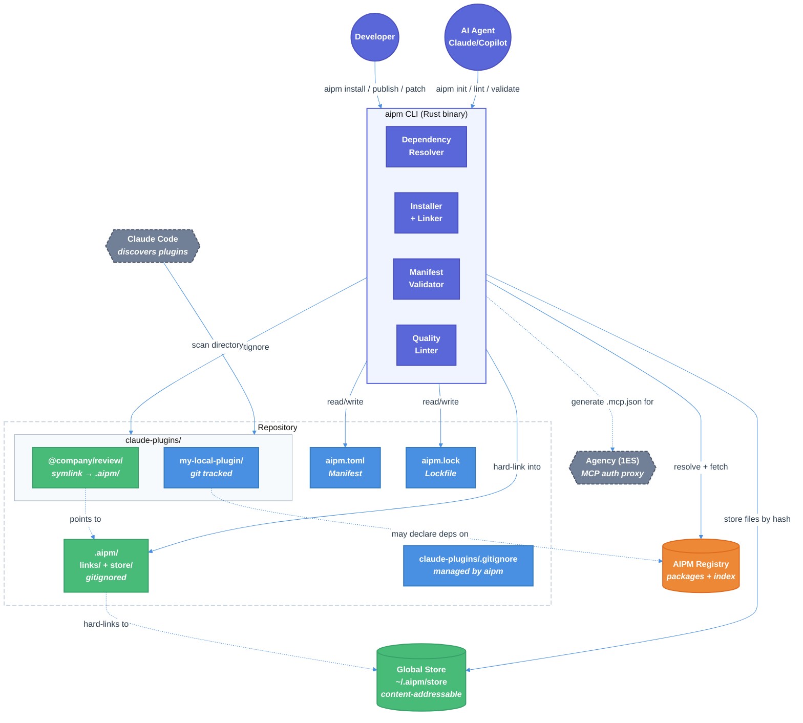

# AIPM (AI Plugin Manager) — Technical Design Document

| Document Metadata      | Details                         |
| ---------------------- | ------------------------------- |
| Author(s)              | selarkin                        |
| Status                 | Draft (WIP)                     |
| Team / Owner           | AI Dev Tooling                  |
| Created / Last Updated | 2026-03-09                      |

## 1. Executive Summary

AIPM is an AI-native package manager — like npm/Cargo but for AI plugin building blocks (skills, agents, MCP servers, hooks). It is built as a self-contained Rust binary that works across .NET, Python, Node.js, and Rust monorepos without requiring any specific runtime. AIPM introduces a content-addressable global store (pnpm-inspired), strict dependency isolation, and a workspace model that coexists with existing local plugin directories (e.g. `claude-plugins/`). Registry-installed plugins are symlinked into the local plugins directory so Claude Code discovers them naturally. The manifest format is TOML (`aipm.toml`) with a custom schema — chosen for human-editability, comment support, and AI-generation safety (no indentation traps, no escaping issues).

**Test-first approach**: 19 cucumber-rs feature files with 205+ BDD scenarios have been written before any implementation. Implementation will proceed feature-by-feature, driven by these specifications.

## 2. Context and Motivation

### 2.1 Current State

There is no package manager for AI plugin primitives. Today:

- Claude Code plugins are directories of markdown, JSON, and scripts checked into repos ([ref: agency-and-ai-orchestration.md](../research/docs/2026-03-09-agency-and-ai-orchestration.md))
- Plugin components (skills, agents, hooks, MCP server configs) are copied between repos manually
- No versioning, no dependency resolution, no registry for discovery
- Repos maintain local plugin "marketplaces" (e.g. `claude-plugins/` directories in ADO repos) with no tooling for composition or reuse
- Agency (Microsoft 1ES) provides MCP server auth wrapping but no dependency management

### 2.2 The Problem

| Priority | Problem | Impact |
|----------|---------|--------|
| **P0** | No package manager or registry for AI plugin primitives | Teams cannot discover, share, or version AI components across orgs |
| **P0** | No dependency resolution for AI component types | A skill that needs an MCP server requires manual setup; no transitive resolution |
| **P1** | No compositional reuse of plugin internals | Hooks, skills, MCP definitions are copy/pasted across plugins |
| **P1** | AI agents (Claude/Copilot) produce low-quality plugins by default | No validation, linting, or scaffolding guardrails |
| **P1** | No monorepo orchestrator integration | Plugin installs/validation don't fit into Rush, Turborepo, BuildXL, MSBuild workflows |
| **P1** | Agency integration requirement | AI dependency management must work with Agency's MCP auth proxy |
| **P1** | Cross-tech-stack portability | Plugins must work in .NET/C# monorepos where Node/TS isn't the default |
| **P1** | No environment dependency declarations | Plugins can't declare they need `git`, `docker`, or specific env vars |

## 3. Goals and Non-Goals

### 3.1 Functional Goals

**P0 — Core Package Manager**
- [ ] TOML-based manifest (`aipm.toml`) with custom schema, semver enforcement, and component declarations
- [ ] Registry model: publish, install, yank, search, scoped packages, alternative registries
- [ ] Content-addressable global store with hard-linked local working set (`.aipm/`)
- [ ] Strict dependency isolation: only declared dependencies are accessible
- [ ] Deterministic lockfile (`aipm.lock`) capturing exact tree structure and integrity hashes
- [ ] Dependency resolution: backtracking solver, version unification, conflict reporting
- [ ] Local + registry plugin coexistence: registry installs symlinked into `claude-plugins/` for Claude Code discovery
- [ ] Non-workspace single-package mode for simple repos

**P1 — Extended Capabilities**
- [ ] Workspace protocol (`workspace:^`) with auto-replacement on publish
- [ ] Catalogs for shared version ranges across workspace members
- [ ] Workspace filtering (`--filter`) by name, path, git-diff, dependency graph
- [ ] Compositional reuse: skills, agents, MCP servers, hooks as independently publishable packages
- [ ] AI quality guardrails: lint, quality scores, machine-readable errors, scaffolding
- [ ] Built-in dependency patching (`aipm patch`)
- [ ] Dependency overrides with path-scoped selectors
- [ ] Optional features system (additive unification)
- [ ] Environment dependency declarations (tools, env vars, platform constraints)
- [ ] Agency integration: generate `.mcp.json` for Agency-wrapped MCP servers
- [ ] Monorepo orchestrator integration (Rush, Turborepo, BuildXL, MSBuild)
- [ ] Cross-platform self-contained binary (linux-x64, linux-arm64, macos-x64, macos-arm64, windows-x64)

### 3.2 Non-Goals (Out of Scope)

- [ ] We will NOT build a web-based registry UI in this phase (CLI + API only)
- [ ] We will NOT implement a custom transport protocol (HTTPS + JSON API for registry)
- [ ] We will NOT manage MCP server runtime dependencies (npm packages, Python packages) — only reference them
- [ ] We will NOT fork or modify Claude Code's plugin discovery mechanism — we match it via symlinks
- [ ] We will NOT bundle or install Agency's `dev` CLI — only warn when it's missing
- [ ] We will NOT support PDF export, GUI, or IDE extensions in this phase

## 4. Proposed Solution (High-Level Design)

### 4.1 System Architecture Diagram



### 4.2 Architectural Patterns

| Pattern | Application | Inspiration |
|---------|------------|-------------|
| Content-addressable storage | Global package store indexed by SHA-512 file hash | pnpm ([ref](../research/docs/2026-03-09-pnpm-core-principles.md)) |
| Symlink-based isolation | Only declared deps accessible; transitive deps hidden | pnpm strict mode |
| Backtracking constraint solver | Dependency resolution with highest-version-first heuristic | Cargo ([ref](../research/docs/2026-03-09-cargo-core-principles.md)) |
| Workspace-as-local-marketplace | `claude-plugins/` dir is the workspace; members = local plugins | pnpm workspaces |
| Convention-over-configuration | Standard directory layout, default `claude-plugins/` path | Cargo |
| Immutable archive | Published versions are permanent; yank but never delete | Cargo + npm post-left-pad ([ref](../research/docs/2026-03-09-npm-core-principles.md)) |

### 4.3 Key Components

| Component | Responsibility | Technology | Justification |
|-----------|---------------|------------|---------------|
| **aipm CLI** | All user-facing commands | Rust (clap) | Self-contained binary, cross-platform, no runtime deps |
| **Manifest parser** | Parse/validate `aipm.toml` | Rust (toml crate) | Same parser that powers Cargo; battle-tested ([ref](../research/docs/2026-03-09-manifest-format-comparison.md)) |
| **Dependency resolver** | Backtracking version solver | Rust (custom, inspired by pubgrub) | Must handle AI component types + standard semver |
| **Content store** | Global content-addressable file storage | Rust (filesystem, SHA-512) | Hard links for zero-copy installs |
| **Registry client** | HTTP client for registry API | Rust (reqwest) | Publish, fetch, search, auth |
| **Lockfile manager** | Deterministic lockfile read/write | Rust (custom TOML serializer) | Must capture full tree structure + integrity hashes |
| **Symlink manager** | Create/remove plugin symlinks + gitignore management | Rust (std::os) | Bridges registry installs to Claude Code discovery |
| **Quality linter** | Validate skills, agents, hooks against standards | Rust | Enforces Agent Skills spec, frontmatter validation |
| **BDD test harness** | cucumber-rs feature tests | Rust (cucumber crate v0.22) | Test-first development; 205+ scenarios written |

## 5. Detailed Design

### 5.1 Manifest Format (`aipm.toml`)

Custom TOML schema. Rationale: TOML chosen over JSON (no comments, not human-editable — [PEP 518 formally rejected it](../research/docs/2026-03-09-manifest-format-comparison.md)), YAML (Norway problem: `3.10` → `3.1`, active security CVEs), and JSONC (fragmented specs, no C# parser). TOML validated by Python PEP 518 and Cargo ecosystems. AIPM will publish a JSON Schema via SchemaStore for IDE autocomplete via Taplo.

**Root workspace manifest:**

```toml
[workspace]
members = ["claude-plugins/*"]
plugins_dir = "claude-plugins"        # default; configurable

[workspace.dependencies]              # catalog (shared version ranges)
common-skill = { version = "^2.0" }

[dependencies]                        # direct registry installs
"@company/code-review" = "^1.0"

[overrides]                           # dependency overrides (pnpm-inspired)
"vulnerable-lib" = "^2.0.0"
"skill-a>common-util" = "=2.1.0"     # path-scoped

[install]
allowed_build_scripts = ["native-tool"]  # lifecycle script allowlist

[environment]
requires = ["git"]
aipm = ">=0.5.0"
```

**Plugin member manifest:**

```toml
[package]
name = "my-ci-tools"
version = "0.1.0"
description = "CI automation skills for ODSP"
type = "composite"                    # skill | agent | mcp | hook | composite

[dependencies]
shared-lint-skill = "^1.0"           # from registry
core-hooks = { workspace = "^" }     # workspace sibling
heavy-analyzer = { version = "^1.0", optional = true }

[features]
default = ["basic"]
basic = []
deep-analysis = ["dep:heavy-analyzer"]

[components]
skills = ["skills/lint/SKILL.md", "skills/format/SKILL.md"]
agents = ["agents/ci-runner.md"]
hooks = ["hooks/pre-push.json"]
mcp_servers = ["mcp/sqlite.json"]

[environment]
requires = ["docker"]

[environment.variables]
required = ["CI_TOKEN"]

[agency.mcp_servers.ado]              # Agency integration (P1)
organization = "onedrive"
```

### 5.2 Directory Layout

```
repo/
  aipm.toml                           # workspace root (always required)
  aipm.lock                           # single lockfile for everything
  claude-plugins/                     # plugins directory (configurable)
    my-local-plugin/                  # local plugin (git tracked)
      aipm.toml                       # member manifest
      skills/
        review/SKILL.md
      agents/
        reviewer.md
      hooks/
        pre-commit.json
    @company/                         # scope directory
      review-plugin/                  # symlink → .aipm/links/... (gitignored)
    .gitignore                        # managed by aipm
  .aipm/                              # gitignored entirely
    store/                            # local content-addressable cache
      ab/cd1234...                    # files indexed by SHA-512 prefix
    links/                            # assembled package directories
      @company/
        review-plugin/                # hard-linked from store
      shared-lint-skill/
  patches/                            # dependency patches (git tracked)
    shared-lint-skill@1.0.0.patch
```

### 5.3 Dependency Resolution Algorithm

Backtracking constraint solver inspired by Cargo and pubgrub ([ref](../research/docs/2026-03-09-cargo-core-principles.md)):

1. Build the dependency graph from root manifest + all workspace members
2. For each unresolved dependency, try the **highest compatible version** first
3. Attempt to **unify** with an already-activated version if semver-compatible (single version per semver-major where possible)
4. If a conflict is found, **backtrack** and try the next candidate
5. Apply **overrides** before resolution (forced versions bypass normal solving)
6. **Auto-install** missing non-optional peer dependencies
7. Exclude **yanked** versions unless pinned in the lockfile
8. On success, generate `aipm.lock` with exact versions, integrity hashes, and tree structure

**AI component type awareness**: The resolver understands that a skill can depend on an MCP server, which can depend on another skill. Component types are metadata — they don't affect resolution semantics, only validation (e.g., a hook package must contain valid hook JSON).

### 5.4 Content-Addressable Store

Inspired by pnpm ([ref](../research/docs/2026-03-09-pnpm-core-principles.md)):

- **Global store**: `~/.aipm/store/` (configurable). Files indexed by SHA-512 hash with 2-char prefix directories for filesystem performance.
- **Project working set**: `.aipm/links/` in each repo. Contains assembled package directories with files **hard-linked** from the global store.
- **Symlinks into plugins dir**: `claude-plugins/<package-name>` symlinks to `.aipm/links/<package-name>`.
- **Deduplication**: Identical files across versions/packages stored exactly once. New version changing 1 of 100 files stores only 1 new file.

### 5.5 Install Flow

```
aipm install @company/code-review@^1.0
  │
  ├─ 1. Resolve: find highest compatible version (1.2.0)
  │     └─ resolve transitive deps recursively
  │
  ├─ 2. Fetch: download archives not in global store
  │     └─ verify SHA-512 integrity against registry index
  │
  ├─ 3. Store: extract files into global store by content hash
  │     └─ skip files already present (content-addressable dedup)
  │
  ├─ 4. Link: assemble .aipm/links/@company/code-review/
  │     └─ hard-link each file from global store
  │
  ├─ 5. Symlink: create claude-plugins/@company/code-review → .aipm/links/...
  │     └─ add @company/code-review to claude-plugins/.gitignore
  │
  ├─ 6. Manifest: add to [dependencies] in aipm.toml
  │
  └─ 7. Lock: update aipm.lock with exact versions + integrity hashes
```

### 5.6 Lockfile Format (`aipm.lock`)

TOML format for consistency with the manifest. Captures:

```toml
[metadata]
lockfile_version = 1
generated_by = "aipm 0.1.0"

[[package]]
name = "@company/code-review"
version = "1.2.0"
source = "registry+https://registry.aipm.dev"
checksum = "sha512-abc123..."
dependencies = ["shared-lint-skill@^1.0"]

[[package]]
name = "shared-lint-skill"
version = "1.5.0"
source = "registry+https://registry.aipm.dev"
checksum = "sha512-def456..."
```

Design: locks exact versions AND integrity hashes (npm principle — [ref](../research/docs/2026-03-09-npm-core-principles.md)). `aipm install --locked` aborts if lockfile is out of date (mirrors `npm ci`).

### 5.7 Workspace Protocol and Catalogs

**Workspace protocol** (pnpm-inspired — [ref](../research/docs/2026-03-09-pnpm-core-principles.md)):

```toml
# In member aipm.toml
[dependencies]
core-hooks = { workspace = "^" }  # link to workspace sibling
```

On `aipm publish`, `workspace = "^"` is replaced with `"^2.3.0"` (actual version). On `aipm publish`, `workspace = "="` becomes `"=2.3.0"`.

**Catalogs** (pnpm-inspired):

```toml
# In root aipm.toml
[catalog]
common-skill = "^2.0.0"
lint-skill = "^1.5.0"

# In member aipm.toml
[dependencies]
common-skill = "catalog:"          # resolves to ^2.0.0 from root
```

Named catalogs supported via `[catalogs.stable]` / `[catalogs.next]` sections.

### 5.8 CLI Commands

| Command | Description | Priority |
|---------|-------------|----------|
| `aipm init [--type <type>]` | Initialize a new plugin package | P0 |
| `aipm install [pkg[@version]]` | Install dependencies (all or specific) | P0 |
| `aipm install --locked` | Deterministic install from lockfile | P0 |
| `aipm update [pkg]` | Update lockfile (all or specific) | P0 |
| `aipm uninstall <pkg>` | Remove a dependency | P0 |
| `aipm publish [--dry-run]` | Publish to registry | P0 |
| `aipm yank <pkg@version>` | Yank a published version | P0 |
| `aipm validate` | Validate manifest and components | P0 |
| `aipm login` / `aipm logout` | Registry authentication | P0 |
| `aipm lint [--fix]` | Quality checks for AI components | P1 |
| `aipm search <query>` | Search registry | P1 |
| `aipm info <pkg>` | Display package details | P1 |
| `aipm list [--outdated]` | List installed packages | P1 |
| `aipm doctor` | Check environment requirements | P1 |
| `aipm patch <pkg@version>` | Start patching a dependency | P1 |
| `aipm patch-commit <dir>` | Commit a patch | P1 |
| `aipm vendor <pkg>` | Copy registry package locally | P1 |
| `aipm audit` | Security vulnerability check | P1 |
| `aipm export --format <fmt>` | Export as Claude plugin / A2A agent card | P1 |
| `aipm generate-mcp-config` | Generate .mcp.json for Agency servers | P1 |
| `aipm build --filter <pattern>` | Filtered workspace commands | P1 |

### 5.9 Agency Integration (P1)

Agency is a Microsoft 1ES internal tool that wraps agent CLIs with Azure auth for MCP servers ([ref](../research/docs/2026-03-09-agency-and-ai-orchestration.md)).

AIPM's role:
1. **Declare** Agency MCP server requirements in `aipm.toml` under `[agency.mcp_servers.*]`
2. **Generate** valid `.mcp.json` files with `"command": "dev", "args": ["agency", "mcp", "<server>", ...flags]`
3. **Delegate** authentication entirely to Agency (never store Azure credentials)
4. **Deduplicate** when multiple packages require the same Agency MCP server
5. **Warn** when `dev` CLI or `az login` is not available

### 5.10 Security Model

| Layer | Mechanism | Inspiration |
|-------|-----------|-------------|
| Integrity verification | SHA-512 checksums in lockfile, verified on install | npm SRI hashes ([ref](../research/docs/2026-03-09-npm-core-principles.md)) |
| Lifecycle script blocking | Dependencies' scripts blocked by default; explicit allowlist | pnpm v10 ([ref](../research/docs/2026-03-09-pnpm-core-principles.md)) |
| Immutable versions | Published versions can never be overwritten or deleted | Cargo ([ref](../research/docs/2026-03-09-cargo-core-principles.md)) |
| Audit | `aipm audit` checks against advisory database | npm audit |
| Auth | API tokens with restricted permissions, stored securely | npm token model |
| Phantom dep prevention | Strict isolation; undeclared deps are inaccessible | pnpm |

## 6. Alternatives Considered

| Decision | Selected | Alternative(s) | Rationale |
|----------|----------|----------------|-----------|
| **Manifest format** | TOML (`aipm.toml`) | JSON, JSONC, YAML | TOML: comments, human-editable, AI-safe generation, PEP 518 validated. JSON: no comments. YAML: Norway problem (`3.10`→`3.1`), security CVEs. JSONC: fragmented specs, no C# parser. ([ref](../research/docs/2026-03-09-manifest-format-comparison.md)) |
| **Store model** | Content-addressable global + local hard links | Copy-on-install (npm), virtual fs (Yarn PnP) | pnpm model proven: 70-80% disk savings, 4x faster clean install. Yarn PnP breaks too many tools. |
| **Plugin discovery** | Symlink into `claude-plugins/` | Separate discovery path, config-based | Cannot control Claude Code's scanning behavior. Symlinks are the only approach that works without modifying Claude Code. |
| **Registry install location** | `.aipm/` (gitignored) + symlinks | `node_modules/`-style flat dir, vendor-all | `.aipm/` is clean separation; symlinks bridge to Claude Code. Vendoring everything defeats the purpose of a package manager. |
| **Lockfile format** | TOML (`aipm.lock`) | JSON, YAML | Consistency with manifest; TOML is human-readable for debugging without the YAML pitfalls. |
| **Implementation language** | Rust | Go, TypeScript, Python | Self-contained binary (P1 portability goal), no runtime deps on target machines, Cargo ecosystem for TOML/semver parsing. |
| **Dependency resolution** | Backtracking solver (Cargo-inspired) | SAT solver (advanced), simple greedy | Backtracking is proven in Cargo; SAT is over-engineered for current scale; greedy can't handle real-world conflicts. |

## 7. Cross-Cutting Concerns

### 7.1 Security and Privacy

- **Authentication**: Bearer token stored in OS credential store (not plaintext files)
- **Integrity**: SHA-512 checksums on every file in the content-addressable store; verified against lockfile on install
- **Lifecycle scripts**: Blocked from dependencies by default (pnpm v10 model). Explicit allowlist required in `[install].allowed_build_scripts`
- **Publishing**: Immutable versions (Cargo model). Scoped packages private by default (npm model)
- **Supply chain**: `aipm audit` against advisory database. Warn on install for known vulnerabilities.
- **No credential leakage**: `aipm publish` respects `files` allowlist; secrets detection in pre-publish validation

### 7.2 Observability

- **Verbose mode**: `aipm install --verbose` shows resolution decisions, fetch progress, link operations
- **Structured output**: `--json` flag for machine-readable output (CI/CD integration)
- **Lockfile diff**: Human-readable lockfile (TOML) enables meaningful `git diff` for dependency changes
- **Doctor command**: `aipm doctor` checks all environment requirements across installed packages

### 7.3 Performance

- **Content-addressable store**: File deduplication across projects and versions. Hard links instead of copies (near-instantaneous). Target: 70%+ disk savings over copy-based approach.
- **Parallel operations**: Concurrent resolution + fetch + link (pnpm three-stage model)
- **Side-effects cache**: Lifecycle script outputs cached in store; skip recompilation on subsequent installs
- **Workspace filtering**: `--filter '[origin/main]'` runs commands only on changed packages (CI optimization)
- **Offline mode**: `aipm install --offline` works from local cache when network is unavailable

## 8. Migration, Rollout, and Testing

### 8.1 Deployment Strategy

- [ ] **Phase 1**: Core CLI (init, validate, install from local, lockfile) — no registry needed
- [ ] **Phase 2**: Registry (publish, install from registry, yank, search) — requires registry service
- [ ] **Phase 3**: Workspace features (workspace protocol, catalogs, filtering) — builds on Phase 2
- [ ] **Phase 4**: P1 features (Agency, guardrails, patching, portability) — incremental additions

### 8.2 Adoption Path

1. Developer installs `aipm` binary (self-contained, no runtime deps)
2. In existing repo with `claude-plugins/`, runs `aipm init` at repo root → creates `aipm.toml` with `[workspace] members = ["claude-plugins/*"]`
3. Existing local plugins continue working unchanged (git-tracked directories)
4. Developer starts `aipm install`-ing shared plugins from registry → symlinked alongside local ones
5. Local plugins optionally add `aipm.toml` members to declare registry dependencies

### 8.3 Test Plan

**BDD tests (cucumber-rs)**: 19 feature files, 205+ scenarios covering all P0 and P1 behavior. Test harness configured as:

```toml
[dev-dependencies]
cucumber = "0.22"
futures = "0.3"

[[test]]
name = "bdd"
harness = false
```

([ref](../research/docs/2026-03-09-cucumber-rs-conventions.md))

Feature file structure:

```
tests/
  features/
    manifest/          # init, validation, versioning (19 scenarios)
    registry/          # install, publish, yank, search, security, local+registry (62 scenarios)
    dependencies/      # resolution, lockfile, features, patching (37 scenarios)
    agency/            # Agency MCP integration (13 scenarios)
    reuse/             # compositional reuse (9 scenarios)
    guardrails/        # quality linting (10 scenarios)
    monorepo/          # workspaces, orchestrators, filtering (28 scenarios)
    portability/       # cross-stack (10 scenarios)
    environment/       # env deps, doctor (10 scenarios)
  bdd.rs              # test harness entry point
```

**Implementation order**: P0 features first, driven by feature files. Each feature file becomes a work item. Steps are implemented as the corresponding Rust module is built.

## 9. Open Questions / Unresolved Issues

- [ ] **Registry backend**: Self-hosted API service? Crates.io-style git index? Azure DevOps Artifacts integration? Decision needed before Phase 2.
- [ ] **MCP server runtime dependencies**: Should aipm manage npm/Python deps that MCP servers need, or only declare them in `[environment]`?
- [ ] **Claude Code marketplace interop**: Should aipm packages be publishable as Claude Code marketplace plugins? What format translation is needed?
- [ ] **Agency `dev` CLI**: Only warn when missing, or provide a fallback mechanism?
- [ ] **Windows symlink permissions**: Windows requires developer mode or elevated permissions for symlinks. Fallback to directory junctions? Copy as last resort?
- [ ] **Schema publication**: When and where to publish the `aipm.toml` JSON Schema for SchemaStore/Taplo IDE integration?
- [ ] **Side-effects cache scope**: Cache lifecycle results globally (shared across repos) or per-project?

## Appendix A: Research References

| Document | Key Content |
|----------|-------------|
| [npm-core-principles.md](../research/docs/2026-03-09-npm-core-principles.md) | Registry model, lockfile design, publish flow, security, workspaces |
| [cargo-core-principles.md](../research/docs/2026-03-09-cargo-core-principles.md) | TOML manifest, features system, resolution algorithm, yanking, immutability |
| [pnpm-core-principles.md](../research/docs/2026-03-09-pnpm-core-principles.md) | Content-addressable store, strict isolation, catalogs, filtering, patching |
| [agency-and-ai-orchestration.md](../research/docs/2026-03-09-agency-and-ai-orchestration.md) | Agency CLI, MCP server config, auth delegation, Agent Skills spec |
| [cucumber-rs-conventions.md](../research/docs/2026-03-09-cucumber-rs-conventions.md) | Test harness setup, Gherkin syntax, project structure |
| [manifest-format-comparison.md](../research/docs/2026-03-09-manifest-format-comparison.md) | TOML vs JSON vs YAML: PEP 518 rationale, LLM accuracy data, parser availability |
| [aipm-cucumber-feature-spec.md](../research/docs/2026-03-09-aipm-cucumber-feature-spec.md) | Synthesis: feature inventory, architecture decisions, design principles |

## Appendix B: Feature File Inventory

19 files, 205+ scenarios. Full listing in [aipm-cucumber-feature-spec.md](../research/docs/2026-03-09-aipm-cucumber-feature-spec.md#feature-file-inventory).
