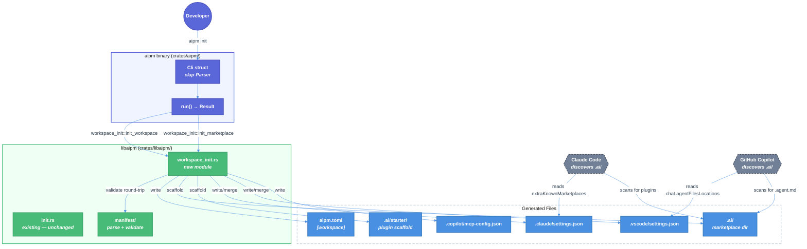

# `aipm init` — Workspace & Marketplace Scaffolding

| Document Metadata      | Details                                              |
| ---------------------- | ---------------------------------------------------- |
| Author(s)              | selarkin                                             |
| Status                 | Draft (WIP)                                          |
| Team / Owner           | AI Dev Tooling                                       |
| Created / Last Updated | 2026-03-16                                           |
| Research               | [research/docs/2026-03-16-aipm-init-workspace-marketplace.md](../research/docs/2026-03-16-aipm-init-workspace-marketplace.md) |

## 1. Executive Summary

This spec adds an `init` subcommand to the `aipm` consumer binary. Running `aipm init` scaffolds a repository for AI plugin management: it generates a workspace `aipm.toml` at the repo root, creates a `.ai/` directory as a tool-agnostic local marketplace with a starter plugin, and writes Claude Code and Copilot settings files that point to `.ai/` for plugin/agent discovery. The result is a zero-config onboarding experience — one command and the developer's repo is wired for both tool ecosystems.

## 2. Context and Motivation

### 2.1 Current State

The `aipm` binary currently has no subcommands — it prints its version and exits ([`crates/aipm/src/main.rs:1-6`](../crates/aipm/src/main.rs)). The only `init` command is on `aipm-pack` ([`crates/aipm-pack/src/main.rs:20-35`](../crates/aipm-pack/src/main.rs)), which scaffolds a single plugin `[package]` manifest for authors. There is no way to bootstrap a repository for plugin consumption.

The manifest schema already supports workspaces — the `Workspace` struct in [`types.rs:68-78`](../crates/libaipm/src/manifest/types.rs) defines `members`, `plugins_dir`, and `dependencies`, and round-trip parsing is proven by existing tests ([`mod.rs:105-134`](../crates/libaipm/src/manifest/mod.rs)). However, no code path generates a workspace manifest.

Reference: [Feature list — Feature 4, steps 6-7](../research/feature-list.json) documented workspace-level init but it was scoped out of the initial implementation.

### 2.2 The Problem

| Problem | Impact |
|---------|--------|
| No workspace bootstrapping command | Developers manually create `aipm.toml` with `[workspace]`, guess at the schema, get it wrong |
| No convention for where plugins live | Each repo invents its own directory — `claude-plugins/`, `ai-tools/`, `.claude/skills/` — fragmenting the ecosystem |
| No tool settings generation | After creating a plugin directory, developers must manually configure `.claude/settings.json` and `.vscode/settings.json` to point to it — a multi-step error-prone process |
| `aipm` binary is inert | The consumer binary does nothing yet; `init` is its natural first command |

## 3. Goals and Non-Goals

### 3.1 Functional Goals

- [ ] `aipm init --workspace` generates a valid `aipm.toml` with `[workspace]` section, `members = [".ai/*"]`, and `plugins_dir = ".ai"`
- [ ] `aipm init --marketplace` generates a `.ai/` directory with a starter plugin containing `aipm.toml`, `.claude-plugin/plugin.json`, `skills/hello/SKILL.md`, `agents/`, `hooks/`, and `.mcp.json`
- [ ] `aipm init --marketplace` generates `.claude/settings.json` with `extraKnownMarketplaces` pointing to `.ai/`
- [ ] `aipm init --marketplace` generates `.vscode/settings.json` with `chat.agentFilesLocations: [".ai"]`
- [ ] `aipm init --marketplace` generates `.copilot/mcp-config.json` stub
- [ ] `aipm init` (no flags) defaults to `--workspace --marketplace`
- [ ] Flags compose independently — `--workspace` alone skips marketplace, `--marketplace` alone skips workspace manifest
- [ ] Command is idempotent: errors if `aipm.toml` already exists (for `--workspace`), errors if `.ai/` already exists (for `--marketplace`)
- [ ] Existing `.claude/settings.json` and `.vscode/settings.json` are merged, not overwritten
- [ ] All generated files pass `cargo clippy --workspace -- -D warnings` and round-trip through `parse_and_validate`
- [ ] BDD scenarios in `tests/features/manifest/workspace-init.feature` pass

### 3.2 Non-Goals (Out of Scope)

- [ ] We will NOT add `install`, `validate`, `doctor`, or other consumer commands in this spec — only `init`
- [ ] We will NOT implement registry communication — `init` is fully offline
- [ ] We will NOT generate a lockfile (`aipm.lock`) — that's the install command's job
- [ ] We will NOT modify the `aipm-pack` binary — it keeps its existing `init` for plugin authoring
- [ ] We will NOT auto-enable the starter plugin in `.claude/settings.json` `enabledPlugins` — the user opts in explicitly
- [ ] We will NOT generate Copilot `.agent.md` files — we only configure discovery paths; actual agent files are the user's responsibility

## 4. Proposed Solution (High-Level Design)

### 4.1 System Architecture Diagram



### 4.2 Architectural Pattern

Convention-over-configuration scaffolding, following the same pattern as `aipm-pack init` ([`init.rs:57-97`](../crates/libaipm/src/init.rs)):

1. Check preconditions (idempotency guards)
2. Generate content from templates (string `format!`, not serde serialization)
3. Write files to disk
4. Validate generated output round-trips through the parser

The key addition is **multi-tool settings generation** — writing configuration for Claude Code and Copilot so they discover the `.ai/` marketplace without manual setup.

### 4.3 Key Components

| Component | Responsibility | Location | Justification |
|-----------|---------------|----------|---------------|
| `workspace_init` module | Workspace manifest + marketplace scaffolding | `crates/libaipm/src/workspace_init.rs` | Shared library for testability; follows existing `init.rs` pattern |
| `aipm` CLI | `init` subcommand with `--workspace`/`--marketplace` flags | `crates/aipm/src/main.rs` | Consumer binary gets its first real command |
| `workspace_init::Error` | Typed error enum | `crates/libaipm/src/workspace_init.rs` | Follows `init::Error` pattern with `thiserror` |
| JSON merge helper | Read existing JSON, insert keys, re-serialize | `crates/libaipm/src/workspace_init.rs` | Needed for `.claude/settings.json` and `.vscode/settings.json` merge behavior |

## 5. Detailed Design

### 5.1 CLI Interface

**Binary:** `aipm`

**Subcommand:** `init`

```
aipm init [--workspace] [--marketplace] [DIR]

Options:
  --workspace     Generate workspace manifest (aipm.toml with [workspace])
  --marketplace   Generate .ai/ local marketplace with tool settings
  DIR             Target directory (default: current directory)

If neither --workspace nor --marketplace is specified, both are implied.
```

**Exit codes:**
- `0` — success
- `1` — error (already initialized, I/O failure, etc.)

**Stdout on success:**
```
Initialized workspace in /path/to/dir
Created .ai/ marketplace with starter plugin
Configured Claude Code settings (.claude/settings.json)
Configured Copilot settings (.vscode/settings.json)
```

Each line printed only for the actions that were taken (e.g., `--workspace` alone prints only the first line).

### 5.2 Module: `crates/libaipm/src/workspace_init.rs`

#### 5.2.1 Public API

```rust
/// Options for workspace initialization.
pub struct Options<'a> {
    /// Target directory.
    pub dir: &'a Path,
    /// Generate workspace manifest.
    pub workspace: bool,
    /// Generate .ai/ marketplace + tool settings.
    pub marketplace: bool,
}

/// What was created — used for user feedback.
pub struct InitResult {
    pub workspace_created: bool,
    pub marketplace_created: bool,
    pub claude_settings_written: bool,
    pub vscode_settings_written: bool,
    pub copilot_config_written: bool,
}

/// Errors specific to workspace init.
#[derive(Debug, thiserror::Error)]
pub enum Error {
    #[error("already initialized: aipm.toml already exists in {}", .0.display())]
    WorkspaceAlreadyInitialized(PathBuf),

    #[error(".ai/ marketplace already exists in {}", .0.display())]
    MarketplaceAlreadyExists(PathBuf),

    #[error("I/O error: {0}")]
    Io(#[from] std::io::Error),

    #[error("JSON parse error in {path}: {source}")]
    JsonParse { path: PathBuf, source: serde_json::Error },
}

/// Initialize workspace and/or marketplace.
pub fn init(opts: &Options<'_>) -> Result<InitResult, Error>;
```

#### 5.2.2 Internal Functions

| Function | Purpose |
|----------|---------|
| `generate_workspace_manifest() -> String` | Returns the TOML string for `aipm.toml` with `[workspace]` |
| `generate_starter_manifest() -> String` | Returns the TOML string for `.ai/starter/aipm.toml` with `[package]` |
| `generate_plugin_json() -> String` | Returns the JSON string for `.claude-plugin/plugin.json` |
| `generate_skill_template() -> String` | Returns the markdown for `skills/hello/SKILL.md` |
| `generate_mcp_stub() -> String` | Returns `{"mcpServers": {}}` |
| `generate_gitignore() -> String` | Returns the `.ai/.gitignore` with managed markers |
| `scaffold_marketplace(dir: &Path) -> Result<(), Error>` | Creates the entire `.ai/` tree |
| `write_claude_settings(dir: &Path) -> Result<bool, Error>` | Creates or merges `.claude/settings.json` |
| `write_vscode_settings(dir: &Path) -> Result<bool, Error>` | Creates or merges `.vscode/settings.json` |
| `write_copilot_config(dir: &Path) -> Result<bool, Error>` | Creates `.copilot/mcp-config.json` if absent |
| `merge_json_key(path: &Path, key: &str, value: Value) -> Result<bool, Error>` | Generic JSON merge helper |

#### 5.2.3 Init Flow

```
init(opts)
  │
  ├─ if opts.workspace:
  │   ├─ Check aipm.toml does not exist → WorkspaceAlreadyInitialized
  │   ├─ generate_workspace_manifest()
  │   ├─ Write aipm.toml
  │   └─ Validate round-trip: parse_and_validate(content, None)
  │
  ├─ if opts.marketplace:
  │   ├─ Check .ai/ does not exist → MarketplaceAlreadyExists
  │   ├─ scaffold_marketplace(dir)
  │   │   ├─ create_dir_all(.ai/starter/.claude-plugin/)
  │   │   ├─ create_dir_all(.ai/starter/skills/hello/)
  │   │   ├─ create_dir_all(.ai/starter/agents/)
  │   │   ├─ create_dir_all(.ai/starter/hooks/)
  │   │   ├─ Write .ai/.gitignore
  │   │   ├─ Write .ai/starter/aipm.toml
  │   │   ├─ Write .ai/starter/.claude-plugin/plugin.json
  │   │   ├─ Write .ai/starter/skills/hello/SKILL.md
  │   │   ├─ Write .ai/starter/.mcp.json
  │   │   ├─ Write .ai/starter/agents/.gitkeep
  │   │   └─ Write .ai/starter/hooks/.gitkeep
  │   ├─ write_claude_settings(dir)
  │   ├─ write_vscode_settings(dir)
  │   └─ write_copilot_config(dir)
  │
  └─ Return InitResult
```

### 5.3 Generated File Contents

#### 5.3.1 `aipm.toml` (workspace manifest)

```toml
# AI Plugin Manager — Workspace Configuration
# Docs: https://github.com/thelarkinn/aipm

[workspace]
members = [".ai/*"]
plugins_dir = ".ai"

# Shared dependency versions for all workspace members.
# Members reference these via: dep = { workspace = "^" }
# [workspace.dependencies]

# Direct registry installs (available project-wide).
# [dependencies]

# Environment requirements for all plugins in this workspace.
# [environment]
# requires = ["git"]
```

Validation: the non-commented content must round-trip through `manifest::parse_and_validate()` with `base_dir = None`.

#### 5.3.2 `.ai/starter/aipm.toml` (member manifest)

```toml
[package]
name = "starter"
version = "0.1.0"
type = "composite"
edition = "2024"
description = "Starter plugin — customize or rename this directory"

# [dependencies]
# Add registry dependencies here, e.g.:
# shared-skill = "^1.0"

[components]
skills = ["skills/hello/SKILL.md"]
```

Validation: must round-trip through `manifest::parse_and_validate()` with `base_dir = Some(.ai/starter/)` (component paths exist).

#### 5.3.3 `.ai/starter/.claude-plugin/plugin.json`

```json
{
  "name": "starter",
  "version": "0.1.0",
  "description": "Starter plugin — customize or rename this directory"
}
```

#### 5.3.4 `.ai/starter/skills/hello/SKILL.md`

```markdown
---
description: A starter skill — describe what it does so Claude knows when to use it
---

# Hello Skill

This is a starter skill template. Customize the description in the frontmatter
above so your AI coding tool can auto-discover when to invoke this skill.

## Instructions

Replace this content with instructions for the AI agent when this skill is active.
```

#### 5.3.5 `.ai/starter/.mcp.json`

```json
{
  "mcpServers": {}
}
```

#### 5.3.6 `.ai/.gitignore`

```
# Managed by aipm — registry-installed plugins are symlinked here.
# Do not edit the section between the markers.
# === aipm managed start ===
# === aipm managed end ===
```

#### 5.3.7 `.claude/settings.json`

Created fresh (if absent):

```json
{
  "permissions": {},
  "enabledPlugins": [],
  "extraKnownMarketplaces": {
    "local": {
      "source": {
        "source": "local",
        "path": ".ai"
      }
    }
  }
}
```

Merged (if existing): insert `extraKnownMarketplaces.local` key into the existing JSON object. If `extraKnownMarketplaces` already has a `"local"` key, skip (don't overwrite).

Reference: [Claude Code marketplace registration](../research/docs/2026-03-16-claude-code-defaults.md)

#### 5.3.8 `.vscode/settings.json`

Created fresh (if absent):

```json
{
  "chat.agentFilesLocations": [".ai"]
}
```

Merged (if existing): if `chat.agentFilesLocations` exists and is an array, append `".ai"` if not already present. If the key doesn't exist, add it.

Reference: [Copilot agent discovery — chat.agentFilesLocations](../research/docs/2026-03-16-copilot-agent-discovery.md)

#### 5.3.9 `.copilot/mcp-config.json`

Created fresh (if absent):

```json
{
  "mcpServers": {}
}
```

If file already exists, skip entirely (no merge needed — the user has already configured their MCP servers).

### 5.4 JSON Merge Strategy

For `.claude/settings.json` and `.vscode/settings.json`, the merge algorithm is:

1. Read existing file as `serde_json::Value`
2. If parse fails, return `Error::JsonParse` (don't corrupt user's file)
3. Navigate to the target key path
4. If key already contains the value we'd insert, return `Ok(false)` (no-op)
5. Insert/update the key
6. Re-serialize with `serde_json::to_string_pretty` + trailing newline
7. Write back to disk
8. Return `Ok(true)` (modified)

This uses `serde_json` which is already a workspace dependency.

### 5.5 `aipm` Binary CLI Structure

The `aipm` binary at [`crates/aipm/src/main.rs`](../crates/aipm/src/main.rs) needs to be rewritten from a 6-line version printer to a clap-based CLI. Follow the exact pattern from [`crates/aipm-pack/src/main.rs`](../crates/aipm-pack/src/main.rs):

```rust
use std::io::Write;
use std::path::PathBuf;

use clap::{Parser, Subcommand};

#[derive(Parser)]
#[command(name = "aipm", version = libaipm::version(), about = "AI Plugin Manager — consumer CLI")]
struct Cli {
    #[command(subcommand)]
    command: Option<Commands>,
}

#[derive(Subcommand)]
enum Commands {
    /// Initialize a workspace for AI plugin management.
    Init {
        /// Generate a workspace manifest (aipm.toml with [workspace] section).
        #[arg(long)]
        workspace: bool,

        /// Generate a .ai/ local marketplace with tool settings.
        #[arg(long)]
        marketplace: bool,

        /// Directory to initialize (defaults to current directory).
        #[arg(default_value = ".")]
        dir: PathBuf,
    },
}

fn run() -> Result<(), Box<dyn std::error::Error>> {
    let cli = Cli::parse();

    match cli.command {
        Some(Commands::Init { workspace, marketplace, dir }) => {
            let dir = if dir.as_os_str() == "." { std::env::current_dir()? } else { dir };

            // If neither flag is set, default to both
            let (do_workspace, do_marketplace) = if !workspace && !marketplace {
                (true, true)
            } else {
                (workspace, marketplace)
            };

            let opts = libaipm::workspace_init::Options {
                dir: &dir,
                workspace: do_workspace,
                marketplace: do_marketplace,
            };

            let result = libaipm::workspace_init::init(&opts)?;

            let mut stdout = std::io::stdout();
            if result.workspace_created {
                let _ = writeln!(stdout, "Initialized workspace in {}", dir.display());
            }
            if result.marketplace_created {
                let _ = writeln!(stdout, "Created .ai/ marketplace with starter plugin");
            }
            if result.claude_settings_written {
                let _ = writeln!(stdout, "Configured Claude Code settings (.claude/settings.json)");
            }
            if result.vscode_settings_written {
                let _ = writeln!(stdout, "Configured Copilot settings (.vscode/settings.json)");
            }
            if result.copilot_config_written {
                let _ = writeln!(stdout, "Created Copilot CLI config (.copilot/mcp-config.json)");
            }
            Ok(())
        },
        None => {
            let mut stdout = std::io::stdout();
            let _ = writeln!(stdout, "aipm {}", libaipm::version());
            let _ = writeln!(stdout, "Use --help for usage information.");
            Ok(())
        },
    }
}

fn main() -> std::process::ExitCode {
    if let Err(e) = run() {
        let mut stderr = std::io::stderr();
        let _ = writeln!(stderr, "error: {e}");
        return std::process::ExitCode::FAILURE;
    }
    std::process::ExitCode::SUCCESS
}
```

### 5.6 Manifest Schema: `plugins_dir` Semantics Update

The `Workspace` struct ([`types.rs:68-78`](../crates/libaipm/src/manifest/types.rs)) already has `plugins_dir: Option<String>`. The generated workspace manifest sets `plugins_dir = ".ai"`. No schema changes are needed.

However, the original technical design ([`specs/2026-03-09-aipm-technical-design.md`](../specs/2026-03-09-aipm-technical-design.md)) assumed `plugins_dir = "claude-plugins"`. This spec establishes `.ai` as the new default convention. The `plugins_dir` field remains configurable — users can override it — but `aipm init` generates `.ai`.

## 6. Alternatives Considered

| Option | Pros | Cons | Reason for Rejection |
|--------|------|------|---------------------|
| **`claude-plugins/`** (original design) | Matches Claude Code convention; auto-discovered by Claude Code | Tool-specific name; Copilot requires config anyway; 15 chars; visible clutter in file explorer | Too Claude-specific for a tool-agnostic package manager. |
| **`.plugins/`** | Generic; hidden; obvious meaning | Doesn't convey AI focus; conflicts with other ecosystems (e.g., WordPress) | Too generic — `.ai/` is more descriptive. |
| **No marketplace scaffolding** — only generate `aipm.toml` | Simpler implementation | User must manually create plugin directories, settings files, and figure out the convention | Defeats the "one command" onboarding goal. |
| **Interactive prompt** for `aipm init` | User chooses options; educational | Breaks scriptability; AI agents can't answer prompts; complicates testing | `--workspace` and `--marketplace` flags are better for both humans and agents. |
| **Merge into `aipm-pack init`** | One init command for everything | Violates binary separation (consumer vs. author); confusing UX | The two init commands serve different users with different needs. |

## 7. Cross-Cutting Concerns

### 7.1 Security and Privacy

- **No secrets generated**: `aipm init` writes only scaffold files (TOML, JSON, Markdown). No tokens, keys, or credentials.
- **No network access**: Fully offline. No registry calls, no telemetry.
- **File permissions**: Uses default filesystem permissions. No `chmod` or elevation.
- **Path traversal**: All generated paths are relative to the target directory. No `..` components.

### 7.2 Observability Strategy

- **Stdout**: Each generated file/directory is reported on stdout (one line per action).
- **Stderr**: Errors printed with `error:` prefix.
- **Exit code**: 0 for success, 1 for failure.
- **No logging framework**: `init` is simple enough that structured logging is unnecessary. Future commands (`install`, `validate`) will use `tracing`.

### 7.3 Cross-Platform

- **Windows**: `create_dir_all` handles backslash normalization. JSON/TOML content uses forward slashes.
- **Hidden directories**: `.ai/`, `.claude/`, `.vscode/`, `.copilot/` are hidden on Unix (dotfile convention). On Windows they're visible by default — this is acceptable and consistent with how `.git/`, `.vscode/`, and `.github/` work.
- **Line endings**: All generated files use Unix line endings (`\n`) per `rustfmt.toml` convention.

## 8. Migration, Rollout, and Testing

### 8.1 Deployment Strategy

This is a new command on an unreleased binary. No migration needed. The `aipm` binary ships with the `init` subcommand from the start.

### 8.2 Test Plan

#### Unit Tests (in `workspace_init.rs`)

| Test | What it verifies |
|------|-----------------|
| `workspace_manifest_round_trips` | `generate_workspace_manifest()` output parses through `parse_and_validate()` |
| `starter_manifest_round_trips` | `generate_starter_manifest()` output parses through `parse_and_validate()` |
| `init_workspace_creates_manifest` | `init()` with `workspace=true` creates `aipm.toml` with `[workspace]` section |
| `init_marketplace_creates_tree` | `init()` with `marketplace=true` creates `.ai/starter/` with all expected files |
| `init_workspace_rejects_existing` | `init()` errors if `aipm.toml` already exists |
| `init_marketplace_rejects_existing` | `init()` errors if `.ai/` already exists |
| `init_both_creates_everything` | `init()` with both flags creates workspace + marketplace + settings |
| `init_default_implies_both` | `init()` with `workspace=false, marketplace=false` creates both |
| `claude_settings_created_fresh` | `write_claude_settings()` creates file with `extraKnownMarketplaces` |
| `claude_settings_merge_existing` | `write_claude_settings()` preserves existing keys and adds marketplace |
| `claude_settings_skip_if_present` | `write_claude_settings()` skips if `extraKnownMarketplaces.local` exists |
| `vscode_settings_created_fresh` | `write_vscode_settings()` creates file with `chat.agentFilesLocations` |
| `vscode_settings_merge_existing` | `write_vscode_settings()` appends `.ai` to existing array |
| `vscode_settings_skip_duplicate` | `write_vscode_settings()` skips if `.ai` already in array |
| `copilot_config_created_fresh` | `write_copilot_config()` creates `mcp-config.json` stub |
| `copilot_config_skip_existing` | `write_copilot_config()` does not overwrite existing file |
| `gitignore_has_managed_markers` | `.ai/.gitignore` contains `aipm managed start` and `aipm managed end` |
| `plugin_json_is_valid` | `.claude-plugin/plugin.json` is valid JSON with name, version, description |
| `skill_template_has_frontmatter` | `skills/hello/SKILL.md` contains `description:` in YAML frontmatter |

#### E2E Tests (in `crates/aipm/tests/init_e2e.rs`)

Follow the pattern from [`crates/aipm-pack/tests/init_e2e.rs`](../crates/aipm-pack/tests/init_e2e.rs): use `assert_cmd::Command::cargo_bin("aipm")` + `tempfile::TempDir` + `predicates`.

| Test | What it verifies |
|------|-----------------|
| `init_default_creates_workspace_and_marketplace` | `aipm init` (no flags) in temp dir → `aipm.toml` + `.ai/starter/` + settings files |
| `init_workspace_only` | `aipm init --workspace` → `aipm.toml` exists, `.ai/` does not |
| `init_marketplace_only` | `aipm init --marketplace` → `.ai/` exists, `aipm.toml` does not |
| `init_rejects_existing_workspace` | `aipm init --workspace` with existing `aipm.toml` → exit 1 + "already initialized" |
| `init_rejects_existing_marketplace` | `aipm init --marketplace` with existing `.ai/` → exit 1 + "already exists" |
| `init_help_shows_usage` | `aipm init --help` → contains "Initialize" |
| `init_no_subcommand_shows_version` | `aipm` (no args) → shows version |
| `init_claude_settings_generated` | After `aipm init --marketplace` → `.claude/settings.json` contains `extraKnownMarketplaces` |
| `init_vscode_settings_generated` | After `aipm init --marketplace` → `.vscode/settings.json` contains `chat.agentFilesLocations` |
| `init_copilot_config_generated` | After `aipm init --marketplace` → `.copilot/mcp-config.json` exists |
| `init_starter_manifest_valid_toml` | After init → `.ai/starter/aipm.toml` is parseable TOML with correct fields |
| `init_generated_workspace_manifest_valid` | After init → `aipm.toml` passes validation round-trip |

#### BDD Scenarios

Already written in [`tests/features/manifest/workspace-init.feature`](../tests/features/manifest/workspace-init.feature) — 17 scenarios covering workspace init, marketplace scaffolding, tool settings generation, merge behavior, and composability.

Step implementations will be added to [`crates/libaipm/tests/bdd.rs`](../crates/libaipm/tests/bdd.rs) following the existing `AipmWorld` + `run_command` pattern.

## 9. Open Questions / Unresolved Issues

- [ ] **Merge strategy edge cases**: What if `.claude/settings.json` contains invalid JSON? Current recommendation: return `Error::JsonParse` and don't modify. The user fixes their file.
- [ ] **Should `.ai/` contain a `README.md`** explaining the directory's purpose? Pro: helps developers who encounter it. Con: one more generated file. Leaning yes.
- [ ] **Should the workspace manifest include a commented `[catalog]` section?** Catalogs are P1 but showing it educates users. Leaning yes.
- [ ] **`chat.plugins.marketplaces` for Copilot**: The research shows `["file:///.ai"]` can register a local marketplace. Should we add this alongside `chat.agentFilesLocations`? The plugin system is still in preview. Leaning no — revisit when stable.
