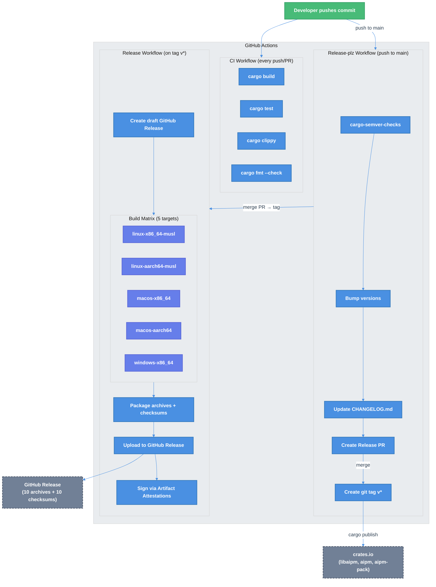

# CI/CD & Cross-Platform Release Automation

| Document Metadata      | Details                                              |
| ---------------------- | ---------------------------------------------------- |
| Author(s)              | selarkin                                             |
| Status                 | Draft (WIP)                                          |
| Team / Owner           | AI Dev Tooling                                       |
| Created / Last Updated | 2026-03-17                                           |
| Research               | [research/docs/2026-03-16-rust-cross-platform-release-distribution.md](../research/docs/2026-03-16-rust-cross-platform-release-distribution.md) |

## 1. Executive Summary

This spec adds CI/CD infrastructure to the `aipm` repository using **GitHub Actions**: continuous integration (build, test, clippy, fmt), version management (release-plz for changelog, tagging, and crates.io publishing), and cross-platform binary distribution (ripgrep-style 5-target build matrix → GitHub Releases). The release pipeline produces signed binaries for 5 targets (Linux x86_64/aarch64, macOS x86_64/aarch64, Windows x86_64), and release-plz publishes crates to the public crates.io registry.

## 2. Context and Motivation

### 2.1 Current State

The repository has **zero CI/CD infrastructure** ([research/docs/2026-03-16-rust-cross-platform-release-distribution.md, "Architecture Documentation"](../research/docs/2026-03-16-rust-cross-platform-release-distribution.md)):

- No `.github/` directory — no workflows of any kind
- No release profiles (`[profile.release]` or `[profile.dist]`)
- No `CHANGELOG.md` or `RELEASES.md`
- No shell scripts, Makefile, justfile, or task runner
- No `build.rs` in any crate — no shell completion or man page generation
- Build commands exist only as prose in `CLAUDE.md`

The workspace produces two binaries (`aipm`, `aipm-pack`) and one library (`libaipm`), all at lockstep version `0.1.0`. The repository is at `github.com/thelarkinn/aipm` under MIT license.

Existing test infrastructure is substantial: 54+ unit tests, 25 E2E tests (assert_cmd), 20 BDD feature files (cucumber-rs), with strict clippy lints (`deny` on `all`, `pedantic`, `perf`; `forbid` on `unsafe_code`).

### 2.2 The Problem

| Problem | Impact |
|---------|--------|
| No CI — PRs are not validated | Broken code can land on `main`; lint regressions go unnoticed |
| No release process | Publishing requires manual steps across crates.io, GitHub Releases, and multiple platforms |
| No cross-platform binaries | Users must compile from source via `cargo install`, which requires a Rust toolchain and takes minutes |
| No changelog | Contributors and users have no way to understand what changed between versions |
| No artifact signing | Supply chain integrity is unverifiable |

## 3. Goals and Non-Goals

### 3.1 Functional Goals

**CI Workflow (`.github/workflows/ci.yml`):**
- [ ] Runs on every push to `main` and every pull request
- [ ] Executes `cargo build --workspace`, `cargo test --workspace`, `cargo clippy --workspace -- -D warnings`, `cargo fmt --check` — matching the commands in `CLAUDE.md`
- [ ] Caches Cargo dependencies via `Swatinem/rust-cache`
- [ ] Uses `dtolnay/rust-toolchain@stable` for pinned toolchain

**Release-plz Workflow (`.github/workflows/release-plz.yml`):**
- [ ] Runs on push to `main`; creates a release PR with version bumps and CHANGELOG.md updates
- [ ] Uses conventional commits + git-cliff for changelog formatting
- [ ] Runs `cargo-semver-checks` to detect breaking API changes in `libaipm`
- [ ] Creates git tags (e.g., `v0.2.0`) when the release PR is merged
- [ ] Publishes crates to crates.io via `cargo publish` (using `CARGO_REGISTRY_TOKEN`)
- [ ] Does NOT create GitHub Releases (delegated to the release workflow)

**Release Workflow (`.github/workflows/release.yml`):**
- [ ] Triggers on git tags matching `v[0-9]+.[0-9]+.[0-9]+`
- [ ] Builds binaries for 5 targets using ripgrep's three-job pipeline pattern
- [ ] Produces per-binary archives: `aipm-{VERSION}-{TARGET}.{ext}` and `aipm-pack-{VERSION}-{TARGET}.{ext}`
- [ ] Generates SHA256 checksums per archive
- [ ] Creates a GitHub Release with all artifacts
- [ ] Signs artifacts via GitHub Artifact Attestations (Sigstore/SLSA L2)
- [ ] Supports `workflow_dispatch` for manual re-runs

**Configuration Files:**
- [ ] `release-plz.toml` — release-plz settings (version bump, changelog, crates.io publish)
- [ ] `cliff.toml` — git-cliff changelog template
- [ ] `[profile.release]` in workspace `Cargo.toml` — optimized release profile (LTO, strip, codegen-units=1)

### 3.2 Non-Goals (Out of Scope)

- [ ] Homebrew tap creation — deferred until project is public with users
- [ ] Scoop bucket — deferred
- [ ] WinGet publishing — deferred
- [ ] npm wrapper package — deferred
- [ ] MSI/pkg installers — deferred
- [ ] Shell completion generation (`clap_complete`) — separate spec
- [ ] Man page generation (`clap_mangen`) — separate spec
- [ ] cargo-binstall metadata in `Cargo.toml` — deferred (cargo-dist artifacts are auto-discoverable)
- [ ] Windows ARM64 target (`aarch64-pc-windows-msvc`) — limited CI runner support
- [ ] Self-updater (`axoupdater`) — deferred
- [ ] Docker image publishing — not applicable for a CLI tool

## 4. Proposed Solution (High-Level Design)

### 4.1 System Architecture Diagram



### 4.2 Architectural Pattern

**GitHub Actions for CI, release, and crates.io publishing**

Ripgrep's three-job pipeline:

1. **`create-release`** — validates tag, creates a draft GitHub Release, outputs the version string
2. **`build-release`** — matrix job across 5 targets; compiles, packages, uploads archives + checksums

Combined flow:

```
push to main → release-plz PR → merge → git tag v* + cargo publish → crates.io
  └─→ GitHub Actions: ripgrep-style build matrix → GitHub Release (binaries)
```

### 4.3 Key Components

| Component | Responsibility | Technology | Justification |
|-----------|---------------|------------|---------------|
| CI workflow | PR validation | GitHub Actions | Standard for open-source repos |
| release-plz | Version bump, changelog, tagging, crates.io publish | `release-plz/action@v0.5` | CI-first, zero-config, semver-checks built-in ([research §4.1](../research/docs/2026-03-16-rust-cross-platform-release-distribution.md)) |
| git-cliff | Changelog formatting | `cliff.toml` config | Integrates natively with release-plz ([research §4.5](../research/docs/2026-03-16-rust-cross-platform-release-distribution.md)) |
| Release workflow | Cross-platform binary builds | GitHub Actions matrix | Ripgrep pattern; no extra tooling dependency |
| `cross` | Linux cross-compilation | Docker-based, pinned version | Standard for musl targets ([research §2](../research/docs/2026-03-16-rust-cross-platform-release-distribution.md)) |
| Artifact Attestations | Build provenance / SLSA L2 | `actions/attest-build-provenance@v2` | Supply chain security baseline ([research §5](../research/docs/2026-03-16-rust-cross-platform-release-distribution.md)) |

## 5. Detailed Design

### 5.1 File Tree (New Files)

```
.github/
  workflows/
    ci.yml                    # CI: build, test, clippy, fmt
    release-plz.yml           # Version management (changelog, tags, crates.io publish)
    release.yml               # Cross-platform binary release → GitHub Releases
Cargo.toml                    # Modified: add [profile.release], update reqwest features
release-plz.toml              # release-plz configuration
cliff.toml                    # git-cliff changelog template
CHANGELOG.md                  # Auto-generated by release-plz (initially empty)
```

### 5.2 CI Workflow — `.github/workflows/ci.yml`

```yaml
name: CI

on:
  push:
    branches: [main]
  pull_request:

env:
  CARGO_INCREMENTAL: 0
  CARGO_NET_RETRY: 10
  RUST_BACKTRACE: short

jobs:
  ci:
    name: Build & Test
    runs-on: ubuntu-latest
    steps:
      - uses: actions/checkout@v4

      - uses: dtolnay/rust-toolchain@stable
        with:
          components: clippy, rustfmt

      - uses: Swatinem/rust-cache@v2

      - name: Build
        run: cargo build --workspace

      - name: Test
        run: cargo test --workspace

      - name: Clippy
        run: cargo clippy --workspace -- -D warnings

      - name: Format
        run: cargo fmt --check
```

**Design decisions:**
- Single job (not parallel) — the workspace is small and total build time is under 5 minutes. Parallel jobs add cold-cache overhead.
- `ubuntu-latest` only — CI validates correctness, not cross-platform compilation. The release workflow handles that.
- No Windows/macOS CI matrix — the `junction` crate is a dependency but unused in code currently; cross-platform CI can be added when platform-specific code paths exist.

### 5.3 Release-plz Workflow — `.github/workflows/release-plz.yml`

```yaml
name: Release-plz

on:
  push:
    branches: [main]

permissions:
  contents: write
  pull-requests: write

jobs:
  release-plz-pr:
    name: Create Release PR
    runs-on: ubuntu-latest
    concurrency:
      group: release-plz-${{ github.ref }}
      cancel-in-progress: false
    steps:
      - uses: actions/checkout@v4
        with:
          fetch-depth: 0
          persist-credentials: false

      - uses: dtolnay/rust-toolchain@stable

      - uses: release-plz/action@v0.5
        with:
          command: release-pr
        env:
          GITHUB_TOKEN: ${{ secrets.GITHUB_TOKEN }}

  release-plz-release:
    name: Tag Release & Publish
    runs-on: ubuntu-latest
    permissions:
      contents: write
      pull-requests: read
    steps:
      - uses: actions/checkout@v4
        with:
          fetch-depth: 0
          token: ${{ secrets.RELEASE_PLZ_TOKEN }}  # PAT — tags pushed via PAT trigger release.yml

      - uses: dtolnay/rust-toolchain@stable

      - uses: release-plz/action@v0.5
        with:
          command: release
        env:
          GITHUB_TOKEN: ${{ secrets.RELEASE_PLZ_TOKEN }}  # PAT for tag creation
          CARGO_REGISTRY_TOKEN: ${{ secrets.CARGO_REGISTRY_TOKEN }}  # crates.io publish token
```

**Design decisions:**
- Two separate jobs (`release-pr` and `release`): the `release-pr` job creates/updates the release PR on every push to `main`. The `release` job creates git tags and publishes to crates.io when the release PR is merged. This is the pattern from release-plz docs.
- **`RELEASE_PLZ_TOKEN` (fine-grained PAT)** is used in the `release` job instead of `GITHUB_TOKEN`. This is required because tags pushed via `GITHUB_TOKEN` do not trigger other workflows (GitHub security restriction). See §5.11 for full explanation and setup.
- **`CARGO_REGISTRY_TOKEN`** — crates.io API token for publishing. release-plz handles dependency-order publishing (`libaipm` → `aipm` → `aipm-pack`).
- `fetch-depth: 0` — release-plz needs full git history for changelog generation.
- The `release-pr` job still uses the default `GITHUB_TOKEN` — creating PRs doesn't need to trigger other workflows.

### 5.4 Release-plz Configuration — `release-plz.toml`

```toml
[workspace]
# Use git-cliff for changelog formatting
changelog_config = "cliff.toml"

# Update CHANGELOG.md in release PRs
changelog_update = true

# Create git tags when releasing
git_tag_enable = true

# Do NOT create GitHub Releases — the release.yml workflow handles that
git_release_enable = false

# Run cargo-semver-checks to detect breaking changes in libaipm
semver_check = true

# Label release PRs for easy filtering
pr_labels = ["release"]

# Require clean working directory
allow_dirty = false
publish_allow_dirty = false
```

**Key settings:**
- `git_release_enable = false` — release-plz creates the git tag, but the release workflow (§5.5) handles building binaries and creating the GitHub Release.
- release-plz publishes to crates.io via `cargo publish` using the `CARGO_REGISTRY_TOKEN` secret. It handles dependency-order publishing (`libaipm` → `aipm` → `aipm-pack`) automatically.

### 5.5 Release Workflow — `.github/workflows/release.yml`

This follows **ripgrep's three-job pipeline** pattern ([research §2, "Pattern A: Ripgrep"](../research/docs/2026-03-16-rust-cross-platform-release-distribution.md)).

```yaml
name: Release

on:
  push:
    tags:
      - 'v[0-9]+.[0-9]+.[0-9]+'
  workflow_dispatch:

permissions:
  contents: write
  id-token: write          # Required for artifact attestations
  attestations: write      # Required for artifact attestations

env:
  CARGO_INCREMENTAL: 0
  CARGO_NET_RETRY: 10
  RUST_BACKTRACE: short
  CROSS_VERSION: v0.2.5   # Pin cross version (ripgrep pattern)

jobs:
  # ─── Job 1: Create Draft Release ──────────────────────────
  create-release:
    name: Create Release
    runs-on: ubuntu-latest
    outputs:
      version: ${{ steps.version.outputs.version }}
    steps:
      - uses: actions/checkout@v4

      - name: Extract version from tag
        id: version
        run: echo "version=${GITHUB_REF_NAME#v}" >> "$GITHUB_OUTPUT"

      - name: Create draft GitHub Release
        env:
          GH_TOKEN: ${{ secrets.GITHUB_TOKEN }}
        run: gh release create "$GITHUB_REF_NAME" --draft --title "$GITHUB_REF_NAME" --generate-notes

  # ─── Job 2: Build Matrix ──────────────────────────────────
  build-release:
    name: Build ${{ matrix.target }}
    needs: create-release
    strategy:
      fail-fast: false
      matrix:
        include:
          # Linux x86_64 — musl for static binary
          - target: x86_64-unknown-linux-musl
            os: ubuntu-latest
            cross: true
            archive: tar.gz

          # Linux aarch64 — musl for static binary
          - target: aarch64-unknown-linux-musl
            os: ubuntu-latest
            cross: true
            archive: tar.gz

          # macOS x86_64 (Intel)
          - target: x86_64-apple-darwin
            os: macos-latest
            cross: false
            archive: tar.gz

          # macOS aarch64 (Apple Silicon)
          - target: aarch64-apple-darwin
            os: macos-latest
            cross: false
            archive: tar.gz

          # Windows x86_64
          - target: x86_64-pc-windows-msvc
            os: windows-latest
            cross: false
            archive: zip
    runs-on: ${{ matrix.os }}
    steps:
      - uses: actions/checkout@v4

      - uses: dtolnay/rust-toolchain@stable
        with:
          targets: ${{ matrix.target }}

      - uses: Swatinem/rust-cache@v2
        with:
          key: ${{ matrix.target }}

      # Install cross for Linux targets
      - name: Install cross
        if: matrix.cross
        shell: bash
        run: |
          curl -fsSL "https://github.com/cross-rs/cross/releases/download/${CROSS_VERSION}/cross-x86_64-unknown-linux-musl.tar.gz" \
            | tar xz -C "$HOME/.cargo/bin"

      # Build all workspace binaries
      - name: Build
        shell: bash
        run: |
          BUILD_CMD="${{ matrix.cross && 'cross' || 'cargo' }}"
          $BUILD_CMD build --workspace --release --locked --target "${{ matrix.target }}"

      # Package archives for each binary
      - name: Package
        id: package
        shell: bash
        run: |
          VERSION="${{ needs.create-release.outputs.version }}"
          TARGET="${{ matrix.target }}"
          EXT="${{ matrix.archive }}"

          for BIN in aipm aipm-pack; do
            STAGING="${BIN}-${VERSION}-${TARGET}"
            mkdir -p "$STAGING"

            # Copy binary
            if [ "${{ matrix.archive }}" = "zip" ]; then
              cp "target/${TARGET}/release/${BIN}.exe" "$STAGING/"
            else
              cp "target/${TARGET}/release/${BIN}" "$STAGING/"
            fi

            # Copy docs
            cp README.md LICENSE "$STAGING/" 2>/dev/null || true

            # Create archive
            ARCHIVE="${STAGING}.${EXT}"
            if [ "$EXT" = "zip" ]; then
              7z a "$ARCHIVE" "$STAGING"
            else
              tar czf "$ARCHIVE" "$STAGING"
            fi

            # SHA256 checksum
            if command -v shasum > /dev/null 2>&1; then
              shasum -a 256 "$ARCHIVE" > "$ARCHIVE.sha256"
            else
              sha256sum "$ARCHIVE" > "$ARCHIVE.sha256"
            fi
          done

      # Upload to GitHub Release
      - name: Upload artifacts
        shell: bash
        env:
          GH_TOKEN: ${{ secrets.GITHUB_TOKEN }}
        run: |
          VERSION="${{ needs.create-release.outputs.version }}"
          TARGET="${{ matrix.target }}"
          EXT="${{ matrix.archive }}"
          for BIN in aipm aipm-pack; do
            ARCHIVE="${BIN}-${VERSION}-${TARGET}.${EXT}"
            gh release upload "$GITHUB_REF_NAME" "$ARCHIVE" "$ARCHIVE.sha256"
          done

      # Sign artifacts
      - name: Attest build provenance
        if: matrix.archive == 'tar.gz'
        uses: actions/attest-build-provenance@v2
        with:
          subject-path: |
            aipm-${{ needs.create-release.outputs.version }}-${{ matrix.target }}.${{ matrix.archive }}
            aipm-pack-${{ needs.create-release.outputs.version }}-${{ matrix.target }}.${{ matrix.archive }}

      - name: Attest build provenance (Windows)
        if: matrix.archive == 'zip'
        uses: actions/attest-build-provenance@v2
        with:
          subject-path: |
            aipm-${{ needs.create-release.outputs.version }}-${{ matrix.target }}.${{ matrix.archive }}
            aipm-pack-${{ needs.create-release.outputs.version }}-${{ matrix.target }}.${{ matrix.archive }}
```

**Design decisions (following ripgrep):**

| Decision | Choice | Rationale |
|----------|--------|-----------|
| Linux libc | `musl` | Static binaries with no glibc dependency; standard for ripgrep, bat, fd, zoxide |
| Cross tool | `cross` pinned to v0.2.5 | Ripgrep pins this exact version; avoids breaking changes in cross-rs |
| Cross installation | Direct binary download | Faster than `cargo install cross`; matches ripgrep pattern |
| Tag format | `v{semver}` | Convention used by bat, fd, zoxide; release-plz creates these |
| Archive naming | `{binary}-{version}-{target}.{ext}` | Ripgrep's convention, compatible with cargo-binstall auto-discovery |
| Archive format | `.tar.gz` Unix / `.zip` Windows | Universal convention across all surveyed Rust CLIs |
| Checksums | Per-file `.sha256` | Ripgrep, bat, fd pattern; simpler than aggregate file |
| Release type | Draft | Allows manual review before publishing (can be changed to auto-publish later) |
| Fail strategy | `fail-fast: false` | One platform failure shouldn't cancel other builds |
| Attestations | GitHub Artifact Attestations | SLSA L2 provenance; supply chain security |

### 5.6 Git-cliff Configuration — `cliff.toml`

```toml
[changelog]
header = """
# Changelog

All notable changes to this project will be documented in this file.
"""
body = """

  https://github.com/thelarkinn/aipm



## [{{ version | trim_start_matches(pat="v") }}] - {{ timestamp | date(format="%Y-%m-%d") }}

## [Unreleased]



### {{ group | upper_first }}

- {{ commit.message | upper_first | trim }} ({{ commit.id | truncate(length=7, end="") }})


"""
trim = true

[git]
conventional_commits = true
filter_unconventional = true
split_commits = false
commit_parsers = [
  { message = "^feat", group = "Features" },
  { message = "^fix", group = "Bug Fixes" },
  { message = "^doc", group = "Documentation" },
  { message = "^perf", group = "Performance" },
  { message = "^refactor", group = "Refactoring" },
  { message = "^style", group = "Style" },
  { message = "^test", group = "Testing" },
  { message = "^chore", group = "Miscellaneous" },
  { message = "^ci", group = "CI/CD" },
  { message = "^build", group = "Build" },
]
protect_breaking_commits = false
filter_commits = false
tag_pattern = "v[0-9].*"
sort_commits = "oldest"
```

### 5.7 Release Profile — Addition to `Cargo.toml`

Add after the existing `[workspace.lints.clippy]` section:

```toml
# =============================================================================
# RELEASE PROFILE
# =============================================================================

[profile.release]
opt-level = 3
lto = "thin"
codegen-units = 1
strip = "symbols"
```

The release workflow uses `cargo build --release` (the standard `--release` flag), which reads from `target/{TARGET}/release/`. No custom profile name needed.

**Design decisions:**
- `lto = "thin"` not `"fat"` — thin LTO gives 90% of the binary size reduction at much faster compile times. Ripgrep uses fat LTO, but their binary is smaller; aipm links reqwest (HTTP + TLS) which makes fat LTO build times prohibitive.
- `strip = "symbols"` — removes debug symbols from release binaries, reducing size by 50-70%.
- `codegen-units = 1` — maximizes optimization at the cost of longer compile time (acceptable for CI releases).
- Applied directly to `[profile.release]` — the build matrix uses `--release`, so optimizations apply automatically. Local `cargo build --release` also gets these, but developers typically use `cargo build` (debug) for day-to-day work, so this doesn't affect local iteration speed.

### 5.8 CHANGELOG.md

Created as an empty template; release-plz populates it on first release:

```markdown
# Changelog

All notable changes to this project will be documented in this file.
```

### 5.9 Artifact Inventory Per Release

Each release produces 20 files (2 binaries × 5 targets × 2 files each):

| Archive | Checksum |
|---------|----------|
| `aipm-{VER}-x86_64-unknown-linux-musl.tar.gz` | `...tar.gz.sha256` |
| `aipm-{VER}-aarch64-unknown-linux-musl.tar.gz` | `...tar.gz.sha256` |
| `aipm-{VER}-x86_64-apple-darwin.tar.gz` | `...tar.gz.sha256` |
| `aipm-{VER}-aarch64-apple-darwin.tar.gz` | `...tar.gz.sha256` |
| `aipm-{VER}-x86_64-pc-windows-msvc.zip` | `...zip.sha256` |
| `aipm-pack-{VER}-x86_64-unknown-linux-musl.tar.gz` | `...tar.gz.sha256` |
| `aipm-pack-{VER}-aarch64-unknown-linux-musl.tar.gz` | `...tar.gz.sha256` |
| `aipm-pack-{VER}-x86_64-apple-darwin.tar.gz` | `...tar.gz.sha256` |
| `aipm-pack-{VER}-aarch64-apple-darwin.tar.gz` | `...tar.gz.sha256` |
| `aipm-pack-{VER}-x86_64-pc-windows-msvc.zip` | `...zip.sha256` |

Archive contents follow ripgrep's convention:
```
aipm-0.2.0-x86_64-unknown-linux-musl/
  aipm            # (or aipm.exe on Windows)
  README.md
  LICENSE
```

### 5.10 reqwest TLS Backend — Change to `Cargo.toml`

The `reqwest` crate defaults to `native-tls`, which links against OpenSSL. On musl-based static Linux builds, OpenSSL is not available (and statically linking it is fragile). The fix is to switch to `rustls-tls`, a pure-Rust TLS implementation that compiles cleanly under musl.

**Change in workspace `Cargo.toml`:**

```diff
-reqwest = { version = "0.12", features = ["json"] }
+reqwest = { version = "0.12", default-features = false, features = ["json", "rustls-tls"] }
```

**What this does:**
- `default-features = false` — disables the default `native-tls` feature (which pulls in OpenSSL)
- `rustls-tls` — enables the `rustls` TLS backend with webpki roots (Mozilla's CA bundle compiled in)
- This works on all platforms (Linux, macOS, Windows) — not just musl. `rustls` is the standard choice for cross-compiled Rust binaries.

**Impact:**
- No code changes needed — `reqwest` API is identical regardless of TLS backend
- Binary size is slightly larger (~300KB for bundled CA roots) but eliminates the OpenSSL system dependency
- All existing tests continue to pass — TLS backend is transparent to application code

### 5.11 GITHUB_TOKEN Limitation & Fine-Grained PAT

#### The Problem

GitHub has a deliberate security restriction: **workflows triggered by `GITHUB_TOKEN` cannot trigger other workflows**. This prevents infinite workflow loops (workflow A triggers workflow B triggers workflow A...).

In our pipeline, this creates a specific problem:

```
release-plz.yml (runs on push to main)
  → uses GITHUB_TOKEN to create a git tag (v0.2.0)
  → pushes the tag to the repo
  → release.yml (triggers on tag v*) ... DOES NOT FIRE ❌
```

The tag push made by `GITHUB_TOKEN` is silently ignored by GitHub Actions. The release workflow never runs.

#### The Solution: Fine-Grained Personal Access Token (PAT)

Replace `GITHUB_TOKEN` in the release-plz `release` job with a fine-grained PAT stored as a repository secret. Tags pushed via a PAT **do** trigger other workflows.

**Step-by-step setup:**

1. **Create a fine-grained PAT** at https://github.com/settings/personal-access-tokens/new:
   - Token name: `release-plz-aipm`
   - Expiration: 1 year (set a calendar reminder to rotate)
   - Repository access: "Only select repositories" → select `thelarkinn/aipm`

   - Permissions:
     - **Contents**: Read and write (needed to push tags)
     - **Pull requests**: Read and write (needed to create release PRs)
     - **Workflows**: Read and write (needed to trigger the release workflow)

2. **Add the PAT as a repository secret:**
   - Go to `github.com/thelarkinn/aipm/settings/secrets/actions`

   - Click "New repository secret"
   - Name: `RELEASE_PLZ_TOKEN`
   - Value: paste the PAT

3. **Update the release-plz workflow** to use the PAT for the release job:

```yaml
  release-plz-release:
    name: Release
    runs-on: ubuntu-latest
    permissions:
      contents: write
      pull-requests: read
    steps:
      - uses: actions/checkout@v4
        with:
          fetch-depth: 0
          token: ${{ secrets.RELEASE_PLZ_TOKEN }}  # PAT for tag push

      - uses: dtolnay/rust-toolchain@stable

      - uses: release-plz/action@v0.5
        with:
          command: release
        env:
          GITHUB_TOKEN: ${{ secrets.RELEASE_PLZ_TOKEN }}  # PAT here too
          CARGO_REGISTRY_TOKEN: ${{ secrets.CARGO_REGISTRY_TOKEN }}
```

**Key changes from the original §5.3 workflow:**
- `actions/checkout` uses `token: ${{ secrets.RELEASE_PLZ_TOKEN }}` — this configures git to push using the PAT
- `GITHUB_TOKEN` env var is set to the PAT — release-plz uses this for API calls (tag creation, release PR)
- The `release-plz-pr` job can still use the default `GITHUB_TOKEN` — creating PRs doesn't need to trigger workflows

**Security notes:**
- The PAT should be scoped to the single repository (`thelarkinn/aipm`)
- Fine-grained PATs (not classic PATs) are recommended
- Set a 1-year expiration and rotate.

#### Alternative: Separate Tag-Push Workflow

If creating a PAT is not feasible (org policy), an alternative is to split the release into two manual steps:

1. release-plz publishes to crates.io and bumps versions (no tag)
2. A maintainer manually pushes the tag: `git tag v0.2.0 && git push --tags`

This loses full automation but avoids the PAT requirement. **Not recommended** for the standard flow.


## 6. Alternatives Considered

| Option | Pros | Cons | Reason for Rejection |
|--------|------|------|---------------------|
| **cargo-dist (all-in-one)** | Single tool for CI + build + installers; auto-generates workflow | Opaque generated CI (hard to customize); workspace feature unification issues ([cargo-dist#1740](https://github.com/axodotdev/cargo-dist/issues/1740)); adds a tool dependency | We want explicit control over the build matrix (ripgrep pattern). cargo-dist can be adopted later for installer generation. |
| **cargo-release (manual CLI)** | Simple, dry-run by default, hook support | No CI automation; requires developer to run locally; no changelog generation | We want fully automated CI-driven releases, not manual developer workflows. |
| **release-please (Google)** | Widely used, language-agnostic | Requires `.release-please-manifest.json` + `release-please-config.json`; no Rust-specific features (no semver-checks); designed for monorepos with many languages | release-plz is Rust-native, zero-config, and includes cargo-semver-checks. |
| **Manual GitHub Actions + tag push** | Full control, no dependencies | Version bumping, changelog, tagging all manual; error-prone | Doesn't scale; every release is a multi-step manual process. |
| **`houseabsolute/actions-rust-cross`** | Convenient Action wrapper for cross | Abstracts away cross setup; less explicit than ripgrep's approach | Ripgrep's direct `cross` installation is simpler and more transparent. |

## 7. Cross-Cutting Concerns

### 7.1 Security and Privacy

- **Artifact Attestations**: All release binaries are attested via `actions/attest-build-provenance@v2`, providing SLSA Level 2 provenance backed by Sigstore. Users verify with `gh attestation verify ./aipm --owner thelarkinn`.
- **Action pinning**: All third-party actions should be pinned by SHA hash (not tag) before merging to `main`. Draft uses tags for readability.
- **Secret management**: `RELEASE_PLZ_TOKEN` (GitHub fine-grained PAT) and `CARGO_REGISTRY_TOKEN` (crates.io API token) are the repository secrets. `GITHUB_TOKEN` is auto-provided with minimal scoped permissions.
- **Supply chain**: `--locked` flag ensures `Cargo.lock` is respected during CI builds — no dependency resolution surprises.
- **Platform-specific dependencies**: The `junction` crate (Windows-only) is gated by `cfg(windows)` in `Cargo.toml` and is automatically excluded from non-Windows builds by Cargo's target evaluation.

### 7.2 Observability

- **CI status badges**: Add to `README.md` after workflows are live.
- **Release PR labels**: `release` label for filtering in GitHub.
- **Workflow logs**: GitHub Actions provides full build logs; `RUST_BACKTRACE=short` enabled for debugging.

### 7.3 Scalability

- **Build time**: Expected ~10 minutes per platform × 5 platforms in parallel = ~10 minutes total wall time.
- **Cache**: `Swatinem/rust-cache` keyed by target triple avoids cross-target cache pollution.
- **Adding targets**: New targets are added by appending to the matrix `include` array — no workflow restructuring needed.
- **Adding binaries**: If new binary crates are added to the workspace, the packaging step's `for BIN in aipm aipm-pack` loop needs updating.

## 8. Migration, Rollout, and Testing

### 8.1 Deployment Strategy

- [ ] **Phase 1**: Land CI workflow (`ci.yml`) — immediate value, blocks nothing
- [ ] **Phase 2**: Land release-plz workflow + config (`release-plz.yml`, `release-plz.toml`, `cliff.toml`, `CHANGELOG.md`) — release-plz starts creating PRs on next push to `main` (version bump + changelog only, no publish)
- [ ] **Phase 3**: Land release workflow (`release.yml`, `[profile.release]`) — active on next tag push for binary distribution
- [ ] **Phase 4**: Merge first release PR created by release-plz → triggers GitHub Actions release + crates.io publish end-to-end

### 8.2 Secrets Required

| Secret / Connection | Where | Purpose | Setup |
|---------------------|-------|---------|-------|
| `RELEASE_PLZ_TOKEN` | GitHub repo → Settings → Secrets | Fine-grained PAT for release-plz tag push (triggers release workflow) | See §5.11 |
| `CARGO_REGISTRY_TOKEN` | GitHub repo → Settings → Secrets | crates.io API token for publishing | Generate at https://crates.io/settings/tokens |
| `GITHUB_TOKEN` | GitHub (auto-provided) | CI checks, PR status, artifact upload, attestations | No setup needed |

`RELEASE_PLZ_TOKEN` and `CARGO_REGISTRY_TOKEN` must be configured before Phase 2.

### 8.3 Test Plan

**CI workflow validation:**
- [ ] Push to a feature branch → CI runs and passes all 4 checks
- [ ] Open a PR → CI status check appears
- [ ] Introduce a clippy warning → CI fails (regression test)

**Release-plz validation:**
- [ ] Push a `feat:` commit to `main` → release-plz creates a release PR with version bump and CHANGELOG.md update
- [ ] Push a `fix:` commit → release-plz updates the existing release PR
- [ ] Merge the release PR → release-plz creates a git tag (does NOT publish to crates.io)
- [ ] Verify CHANGELOG.md contains the expected entries

**crates.io publishing validation:**
- [ ] Verify crates appear on crates.io: `cargo search aipm`
- [ ] Verify dependency ordering: `libaipm` published before `aipm` and `aipm-pack`

**Release workflow validation:**
- [ ] Tag push (`v0.2.0`) → release workflow triggers
- [ ] All 5 matrix builds succeed
- [ ] Draft GitHub Release contains 20 files (10 archives + 10 checksums)
- [ ] Download and run each binary on its target platform
- [ ] Verify checksums: `shasum -a 256 -c aipm-0.2.0-x86_64-apple-darwin.tar.gz.sha256`
- [ ] Verify attestation: `gh attestation verify ./aipm --owner thelarkinn`
- [ ] `workflow_dispatch` manual trigger works

**Conventional commit adoption:**
- [ ] Existing commit history does not break release-plz (it handles non-conventional commits gracefully)
- [ ] Document commit conventions in `CONTRIBUTING.md` or `CLAUDE.md`

### 8.4 Crate Name Reservation

Crate names on crates.io are first-come-first-served. Reserve names early:

1. Generate a crates.io API token at https://crates.io/settings/tokens
2. Add as `CARGO_REGISTRY_TOKEN` repository secret
3. Merge the first release PR → release-plz publishes `libaipm` → `aipm` → `aipm-pack`
4. Verify: `cargo search aipm`

**Important:** If the names are already taken, you'd need to pick alternative names or contact the crates.io team.

Verify at:
- https://crates.io/crates/aipm
- https://crates.io/crates/aipm-pack
- https://crates.io/crates/libaipm

## 9. Open Questions / Unresolved Issues

- [x] **`CARGO_REGISTRY_TOKEN` access**: **RESOLVED** — crates.io API token stored as repository secret. release-plz uses it for `cargo publish`.
- [x] **musl + reqwest compatibility**: **RESOLVED** — Switch `reqwest` to `rustls-tls` backend. See §5.10.
- [x] **`profile.dist` vs release workflow**: **RESOLVED** — Use the standard `--release` profile with optimizations applied directly to `[profile.release]`. See §5.7.
- [x] **Release-plz token scope**: **RESOLVED** — A fine-grained PAT is required. See §5.11 and §8.2 for setup instructions.
- [x] **crates.io publishing method**: **RESOLVED** — release-plz handles `cargo publish` directly via GitHub Actions. See §5.3.
- [ ] **Draft vs auto-publish**: Should the GitHub Release be created as draft (requires manual publish) or automatically published? Draft is safer for initial rollout but adds a manual step.
- [ ] **Conventional commit enforcement**: Should we add a `commitlint` or `conform` check to CI that rejects non-conventional commit messages? Or just let release-plz handle whatever commits land?
- [ ] **Binary stripping on macOS**: macOS binaries may need `strip -x` post-build if `strip = "symbols"` in the profile isn't sufficient. Ripgrep handles this in its workflow.
