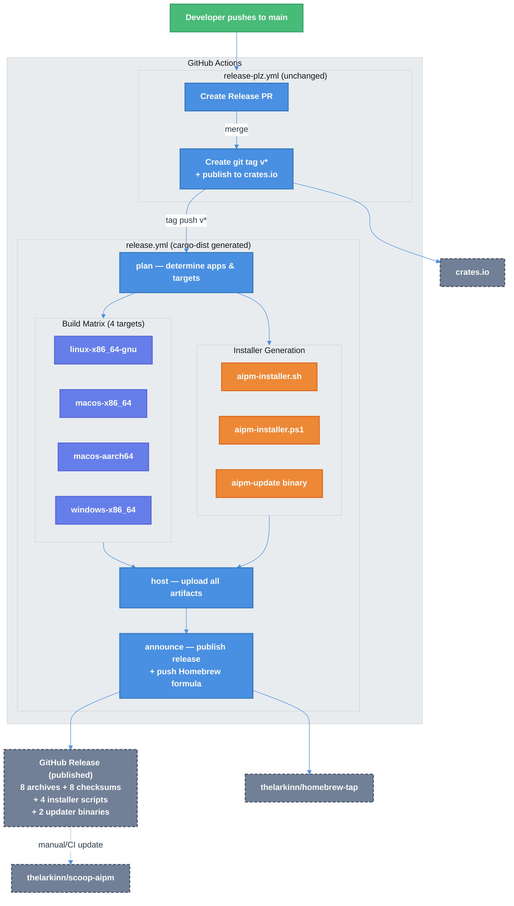

# cargo-dist Migration: Installers, GitHub Releases & Distribution Channels

| Document Metadata      | Details                                              |
| ---------------------- | ---------------------------------------------------- |
| Author(s)              | selarkin                                             |
| Status                 | Draft (WIP)                                          |
| Team / Owner           | AI Dev Tooling                                       |
| Created / Last Updated | 2026-03-19                                           |
| Research               | [research/docs/2026-03-19-cargo-dist-installer-github-releases.md](../research/docs/2026-03-19-cargo-dist-installer-github-releases.md) |
| Supersedes             | [specs/2026-03-16-ci-cd-release-automation.md](2026-03-16-ci-cd-release-automation.md) §5.5 (release.yml only — CI and release-plz sections remain valid) |

## 1. Executive Summary

This spec replaces the current hand-rolled `release.yml` with a **cargo-dist** generated workflow to gain automatic shell/PowerShell installer scripts, Homebrew tap integration, self-updater support, and published (non-draft) GitHub Releases. The build matrix is simplified from 5 targets to 4 (dropping `aarch64-unknown-linux-musl`, switching Linux to `gnu`). Additional distribution channels include `cargo-binstall` metadata and a Scoop bucket for Windows. The existing `release-plz.yml` and `release-plz.toml` remain unchanged — cargo-dist triggers on the same git tags release-plz already creates.

## 2. Context and Motivation

### 2.1 Current State

The repository has a working release pipeline implemented per [specs/2026-03-16-ci-cd-release-automation.md](2026-03-16-ci-cd-release-automation.md):

- **`ci.yml`** — Build, test, clippy, fmt on every push/PR ([.github/workflows/ci.yml](https://github.com/TheLarkInn/aipm/blob/5296793/.github/workflows/ci.yml))
- **`release-plz.yml`** — Creates release PRs, publishes to crates.io, creates git tags using `RELEASE_PLZ_TOKEN` PAT ([.github/workflows/release-plz.yml](https://github.com/TheLarkInn/aipm/blob/5296793/.github/workflows/release-plz.yml))
- **`release.yml`** — Tag-triggered 5-target build matrix, creates **draft** GitHub Releases, uploads archives + SHA256 checksums, attests build provenance ([.github/workflows/release.yml](https://github.com/TheLarkInn/aipm/blob/5296793/.github/workflows/release.yml))
- **`release-plz.toml`** — `git_tag_enable = true`, `git_release_enable = false` ([release-plz.toml](https://github.com/TheLarkInn/aipm/blob/5296793/release-plz.toml))

### 2.2 The Problem

| Problem | Impact |
|---------|--------|
| Draft releases are never published | Binaries are built and uploaded but invisible to users — the `gh release create --draft` at [release.yml:37](https://github.com/TheLarkInn/aipm/blob/5296793/.github/workflows/release.yml#L37) is never followed by `--draft=false` |
| No installer scripts | Users must manually download the correct archive, extract it, and add the binary to PATH |
| No Homebrew support | macOS/Linux users cannot `brew install aipm` |
| No self-updater | Users must manually check for and install updates |
| No Scoop support | Windows users cannot `scoop install aipm` |
| Hand-rolled workflow maintenance | The 148-line `release.yml` requires manual updates for every new target, binary, or packaging change |

## 3. Goals and Non-Goals

### 3.1 Functional Goals

**cargo-dist setup:**
- [ ] Initialize cargo-dist with `dist-workspace.toml` configuration
- [ ] Add `[profile.dist]` inheriting from existing `[profile.release]`
- [ ] Replace hand-rolled `release.yml` with cargo-dist generated workflow
- [ ] Trigger on same `v[0-9]+.[0-9]+.[0-9]+` tags that release-plz creates

**Build matrix (4 targets):**
- [ ] `x86_64-unknown-linux-gnu` (switched from musl — dynamically linked, simpler cargo-dist integration)
- [ ] `x86_64-apple-darwin` (Intel Mac)
- [ ] `aarch64-apple-darwin` (Apple Silicon)
- [ ] `x86_64-pc-windows-msvc` (Windows)

**Installer scripts:**
- [ ] Shell installer (`aipm-installer.sh`) — `curl --proto '=https' --tlsv1.2 -LsSf .../aipm-installer.sh | sh`
- [ ] PowerShell installer (`aipm-installer.ps1`) — `irm .../aipm-installer.ps1 | iex`
- [ ] Both scripts uploaded as GitHub Release assets alongside platform archives

**Homebrew tap:**
- [ ] Create `thelarkinn/homebrew-tap` repository
- [ ] cargo-dist auto-generates and pushes formula on release
- [ ] Users install via `brew install thelarkinn/tap/aipm`

**Self-updater:**
- [ ] `install-updater = true` in cargo-dist config
- [ ] Generates `aipm-update` binary alongside `aipm` in release archives
- [ ] Users can update via the updater binary

**GitHub Releases:**
- [ ] Releases are published (not draft) — cargo-dist handles the create → upload → publish lifecycle
- [ ] Build provenance attested via GitHub Artifact Attestations

**cargo-binstall metadata:**
- [ ] Add `[package.metadata.binstall]` to `crates/aipm/Cargo.toml` and `crates/aipm-pack/Cargo.toml`
- [ ] Enables `cargo binstall aipm` to download pre-built binaries from GitHub Releases

**Scoop bucket:**
- [ ] Create `thelarkinn/scoop-aipm` repository with JSON manifests
- [ ] Update manifests on each release (manual or CI-driven)
- [ ] Users install via `scoop bucket add aipm https://github.com/thelarkinn/scoop-aipm && scoop install aipm`

### 3.2 Non-Goals (Out of Scope)

- [ ] Modifying `release-plz.yml` or `release-plz.toml` — they remain unchanged
- [ ] Modifying `ci.yml` — unrelated to release distribution
- [ ] musl Linux targets — dropped in favor of gnu for simpler cargo-dist integration
- [ ] `aarch64-unknown-linux` (ARM64 Linux) — dropped to simplify adoption; can be added later
- [ ] Windows ARM64 (`aarch64-pc-windows-msvc`) — limited runner support
- [ ] npm wrapper package — deferred
- [ ] MSI/pkg native installers — deferred
- [ ] WinGet publishing — deferred
- [ ] Docker/container image publishing — not applicable
- [ ] GitHub Packages integration — not relevant for CLI binary distribution ([research §8](../research/docs/2026-03-19-cargo-dist-installer-github-releases.md))

## 4. Proposed Solution (High-Level Design)

### 4.1 System Architecture Diagram



### 4.2 Architectural Pattern

**cargo-dist replaces the hand-rolled release.yml** with a generated four-stage workflow:

1. **`plan`** — Reads the tag, determines which apps to build, generates a manifest
2. **`build`** — Matrix job across 4 targets; compiles, packages archives, generates installers
3. **`host`** — Creates GitHub Release, uploads all artifacts
4. **`announce`** — Publishes the release (removes draft), pushes Homebrew formula

This replaces the current two-job pattern (`create-release` → `build-release`) and eliminates the draft-never-published gap.

### 4.3 Key Components

| Component | Responsibility | Technology | Justification |
|-----------|---------------|------------|---------------|
| cargo-dist | Build, package, install, release | `dist-workspace.toml` + generated workflow | All-in-one; generates installers and Homebrew; used by major Rust CLIs ([research §3](../research/docs/2026-03-19-cargo-dist-installer-github-releases.md)) |
| release-plz | Version bump, changelog, tagging, crates.io | Existing `release-plz.yml` | Already working; `git_release_enable = false` is the correct cargo-dist integration config |
| Homebrew tap | macOS/Linux package manager | `thelarkinn/homebrew-tap` repo | cargo-dist auto-generates and pushes formula |
| Scoop bucket | Windows package manager | `thelarkinn/scoop-aipm` repo | Manual JSON manifests; popular Windows channel |
| cargo-binstall | Pre-built binary discovery | `[package.metadata.binstall]` in Cargo.toml | Enables `cargo binstall aipm` without compiling |

## 5. Detailed Design

### 5.1 File Changes Overview

```
NEW FILES:
  dist-workspace.toml                           # cargo-dist configuration
  .github/workflows/release.yml                 # cargo-dist generated (replaces current)

MODIFIED FILES:
  Cargo.toml                                    # Add [profile.dist]
  crates/aipm/Cargo.toml                        # Add [package.metadata.binstall]
  crates/aipm-pack/Cargo.toml                   # Add [package.metadata.binstall]

EXTERNAL (new GitHub repos):
  thelarkinn/homebrew-tap                       # Homebrew formula repo
  thelarkinn/scoop-aipm                         # Scoop bucket repo

UNCHANGED:
  .github/workflows/ci.yml
  .github/workflows/release-plz.yml
  release-plz.toml
  cliff.toml
```

### 5.2 cargo-dist Configuration — `dist-workspace.toml`

```toml
[workspace]
members = ["cargo:."]

[dist]
# Pin cargo-dist version for reproducible CI
cargo-dist-version = "0.31.0"

# Generate GitHub Actions workflow
ci = "github"

# Installer scripts: shell (Unix), powershell (Windows)
installers = ["shell", "powershell"]

# Build targets (4 platforms)
targets = [
  "x86_64-unknown-linux-gnu",
  "x86_64-apple-darwin",
  "aarch64-apple-darwin",
  "x86_64-pc-windows-msvc",
]

# No Homebrew — skipped per decision

# Only run planning on PRs (not full builds)
pr-run-mode = "plan"

# Install to ~/.cargo/bin (standard Rust convention)
install-path = "CARGO_HOME"

# Enable self-updater binary (axoupdater)
install-updater = true

# Enable GitHub Artifact Attestations (matches current release.yml behavior)
github-attestations = true

# Enable manual workflow_dispatch trigger (matches current release.yml)
dispatch-releases = true

# Archive formats
unix-archive = ".tar.xz"
windows-archive = ".zip"

# SHA256 checksums per archive
checksum = "sha256"
```

**Design decisions:**

| Decision | Choice | Rationale |
|----------|--------|-----------|
| Config format | `dist-workspace.toml` (standalone) | Cleaner than `[workspace.metadata.dist]` in Cargo.toml; preferred in cargo-dist v0.20+ ([research §5](../research/docs/2026-03-19-cargo-dist-installer-github-releases.md)) |
| Linux target | `x86_64-unknown-linux-gnu` | Simpler cargo-dist integration; musl requires `allow-dirty` workarounds. glibc is available on virtually all modern Linux distros. |
| `aarch64-linux` | Dropped | Not natively supported by cargo-dist. Can be added later with `allow-dirty = ["ci"]`. |
| Archive format | `.tar.xz` | cargo-dist default; ~30% smaller than `.tar.gz`. Change from current `.tar.gz`. |
| `pr-run-mode` | `"plan"` | Only runs planning on PRs (fast, no build). Use `"upload"` later if pre-release validation is desired. |
| `install-updater` | `true` | Generates a self-update binary so users can stay current without manual downloads. |

### 5.3 Profile Addition — `Cargo.toml`

Add after the existing `[profile.release]` section:

```toml
# =============================================================================
# DIST PROFILE — used by cargo-dist for distribution builds
# Inherits all settings from [profile.release] above
# =============================================================================

[profile.dist]
inherits = "release"
```

The `[profile.dist]` inherits from the existing `[profile.release]` (which already has `opt-level = 3`, `lto = "thin"`, `codegen-units = 1`, `strip = "symbols"`). cargo-dist uses `--profile dist` instead of `--release`, so this profile is what gets applied during CI builds.

### 5.4 cargo-binstall Metadata — Binary Crate Cargo.toml Files

**`crates/aipm/Cargo.toml`** — add at the end:

```toml
[package.metadata.binstall]
pkg-url = "{ repo }/releases/download/v{ version }/{ name }-{ target }-v{ version }.{ archive-format }"
bin-dir = "{ name }-v{ version }-{ target }/{ bin }{ binary-ext }"
pkg-fmt = "txz"

[package.metadata.binstall.overrides.x86_64-pc-windows-msvc]
pkg-fmt = "zip"
```

**`crates/aipm-pack/Cargo.toml`** — identical section.

**Note:** The exact `pkg-url` and `bin-dir` templates depend on cargo-dist's archive naming convention. After running `dist init` and inspecting the first release's artifact names, these templates may need adjustment. cargo-dist artifacts are also auto-discoverable by cargo-binstall, so this metadata is a fallback for explicit control.

### 5.5 Generated Workflow — `.github/workflows/release.yml`

cargo-dist generates this workflow via `dist init` or `dist generate`. The generated file is ~200-400 lines and handles:

1. **`plan` job** — Runs `cargo dist plan`, outputs a manifest of what to build
2. **`build-*` jobs** — One per target platform, runs `cargo dist build`, uploads artifacts
3. **`host` job** — Creates the GitHub Release, uploads all artifacts from build jobs
4. **`announce` job** — Publishes the release (draft → published), runs publish-jobs (Homebrew)

The workflow triggers on:
```yaml
on:
  push:
    tags:
      - '**[0-9]+.[0-9]+.[0-9]+*'   # cargo-dist's default tag pattern
  workflow_dispatch:                   # manual trigger (dispatch-releases = true)
```

**This file should not be hand-edited.** To customize, use `dist-workspace.toml` options and re-run `dist generate`. If hand-edits are unavoidable (e.g., adding musl targets later), set `allow-dirty = ["ci"]` in the config.

### 5.6 Homebrew Tap Setup — `thelarkinn/homebrew-tap`

**Prerequisites:**
1. Create a new GitHub repository: `thelarkinn/homebrew-tap`
2. Create a fine-grained PAT (`HOMEBREW_TAP_TOKEN`) with:
   - Repository access: `thelarkinn/homebrew-tap`
   - Permissions: Contents (Read and write)
3. Add `HOMEBREW_TAP_TOKEN` as a repository secret in `thelarkinn/aipm`

cargo-dist generates and pushes the formula automatically during the `announce` job. The formula includes platform detection (macOS Intel vs ARM, Linux x86_64) and SHA256 verification.

Users install via:
```bash
brew install thelarkinn/tap/aipm
brew install thelarkinn/tap/aipm-pack
```

### 5.7 Scoop Bucket Setup — `thelarkinn/scoop-aipm`

Create a new GitHub repository `thelarkinn/scoop-aipm` with two manifest files:

**`aipm.json`:**
```json
{
    "version": "0.1.0",
    "description": "AI Plugin Manager — consumer CLI for installing and managing AI plugins",
    "homepage": "https://github.com/thelarkinn/aipm",
    "license": "MIT",
    "architecture": {
        "64bit": {
            "url": "https://github.com/thelarkinn/aipm/releases/download/v0.1.0/aipm-x86_64-pc-windows-msvc.zip",
            "hash": "SHA256_HASH",
            "bin": "aipm.exe"
        }
    },
    "checkver": "github",
    "autoupdate": {
        "architecture": {
            "64bit": {
                "url": "https://github.com/thelarkinn/aipm/releases/download/v$version/aipm-x86_64-pc-windows-msvc.zip"
            }
        }
    }
}
```

**`aipm-pack.json`:** — identical structure with `aipm-pack` substituted.

**Note:** The `url` pattern depends on cargo-dist's archive naming. Adjust after the first release. The `autoupdate` section with `"checkver": "github"` allows Scoop's auto-update bot to detect new releases.

Scoop manifests must be updated on each release. Options:
- **Manual**: Update version and hash after each release
- **Automated**: Add a CI job that updates the Scoop repo after cargo-dist publishes (future enhancement)

Users install via:
```powershell
scoop bucket add aipm https://github.com/thelarkinn/scoop-aipm
scoop install aipm
scoop install aipm-pack
```

### 5.8 Artifact Inventory Per Release

Each release produces artifacts for 2 binaries × 4 targets, plus installers and updaters:

**Platform Archives (8 archives + 8 checksums):**

| Archive | Checksum |
|---------|----------|
| `aipm-{VER}-x86_64-unknown-linux-gnu.tar.xz` | `.tar.xz.sha256` |
| `aipm-{VER}-x86_64-apple-darwin.tar.xz` | `.tar.xz.sha256` |
| `aipm-{VER}-aarch64-apple-darwin.tar.xz` | `.tar.xz.sha256` |
| `aipm-{VER}-x86_64-pc-windows-msvc.zip` | `.zip.sha256` |
| `aipm-pack-{VER}-x86_64-unknown-linux-gnu.tar.xz` | `.tar.xz.sha256` |
| `aipm-pack-{VER}-x86_64-apple-darwin.tar.xz` | `.tar.xz.sha256` |
| `aipm-pack-{VER}-aarch64-apple-darwin.tar.xz` | `.tar.xz.sha256` |
| `aipm-pack-{VER}-x86_64-pc-windows-msvc.zip` | `.zip.sha256` |

**Installer Scripts (4 files):**

| Installer | Platform | User Command |
|-----------|----------|-------------|
| `aipm-installer.sh` | Linux/macOS | `curl --proto '=https' --tlsv1.2 -LsSf https://github.com/thelarkinn/aipm/releases/latest/download/aipm-installer.sh \| sh` |
| `aipm-installer.ps1` | Windows | `powershell -ExecutionPolicy Bypass -c "irm https://github.com/thelarkinn/aipm/releases/latest/download/aipm-installer.ps1 \| iex"` |
| `aipm-pack-installer.sh` | Linux/macOS | Same pattern with `aipm-pack-installer.sh` |
| `aipm-pack-installer.ps1` | Windows | Same pattern with `aipm-pack-installer.ps1` |

**Updater Binaries:** Included inside each platform archive alongside the main binary when `install-updater = true`.

**Total release assets:** ~20+ files (8 archives + 8 checksums + 4 installer scripts + source tarball)

### 5.9 Secrets Required

| Secret | Where | Purpose | Setup |
|--------|-------|---------|-------|
| `RELEASE_PLZ_TOKEN` | `thelarkinn/aipm` repo secrets | PAT for release-plz tag push | **Already configured** |
| `CARGO_REGISTRY_TOKEN` | `thelarkinn/aipm` repo secrets | crates.io publish | **Already configured** |
| `GITHUB_TOKEN` | Auto-provided | CI, artifact upload, attestations | No setup needed |

## 6. Alternatives Considered

| Option | Pros | Cons | Reason for Rejection |
|--------|------|------|---------------------|
| **Keep hand-rolled release.yml + add finalize job** | Minimal change; just add `gh release edit --draft=false` | No installer scripts, no Homebrew, no self-updater; ongoing maintenance burden | Doesn't solve the core problem of easy user installation |
| **Hand-write installer scripts** | Full control over install behavior | Significant maintenance; platform detection is tricky; no Homebrew/Scoop integration | cargo-dist generates battle-tested installers used by many Rust projects |
| **Keep musl Linux targets** | Fully static binaries (no glibc dependency) | cargo-dist doesn't natively support musl; requires `allow-dirty = ["ci"]` and hand-editing the generated workflow | Added complexity not worth it for the current user base; gnu works on all modern distros |
| **Keep aarch64-linux target** | ARM server support (Graviton, RPi) | Same musl/cross-compilation gap; requires `allow-dirty` workaround | Can be added later when demand exists |
| **Use .tar.gz instead of .tar.xz** | More universal compatibility | Larger archives; fighting cargo-dist's defaults | .tar.xz is widely supported and cargo-dist's default |

## 7. Cross-Cutting Concerns

### 7.1 Security and Privacy

- **Artifact Attestations**: Preserved via `github-attestations = true` in cargo-dist config. Users verify with `gh attestation verify ./aipm --owner thelarkinn`.
- **Installer script integrity**: Shell/PowerShell installers embed SHA256 checksums and verify archives before extraction.
- **Homebrew formula**: SHA256 hashes are embedded in the formula; Homebrew verifies on install.
- **PAT management**: `HOMEBREW_TAP_TOKEN` is a new secret scoped to only `thelarkinn/homebrew-tap` with minimal permissions.
- **Supply chain**: cargo-dist's generated workflow pins its own version via `cargo-dist-version`. Action versions should be pinned by SHA hash before production use.

### 7.2 Observability

- **Release status**: GitHub Releases page shows published releases (no more invisible drafts).
- **cargo-dist plan output**: The `plan` job outputs a machine-readable manifest; useful for debugging release issues.
- **Homebrew formula updates**: Visible as commits to `thelarkinn/homebrew-tap`.

### 7.3 Scalability

- **Adding targets**: Add to the `targets` array in `dist-workspace.toml` and re-run `dist generate`. No workflow editing needed (unless musl/cross targets).
- **Adding binaries**: New binary crates in the workspace are auto-discovered by cargo-dist.
- **Adding installers**: Add to the `installers` array (e.g., `"npm"`, `"msi"`) and re-run `dist generate`.

## 8. Migration, Rollout, and Testing

### 8.1 Deployment Strategy

- [ ] **Phase 1 — cargo-dist init**: Run `cargo dist init` in the workspace. Creates `dist-workspace.toml`, adds `[profile.dist]` to `Cargo.toml`, generates `.github/workflows/release.yml`. Commit all generated files.
- [ ] **Phase 2 — External repos**: Create `thelarkinn/homebrew-tap` and `thelarkinn/scoop-aipm` repos. Add `HOMEBREW_TAP_TOKEN` secret.
- [ ] **Phase 3 — cargo-binstall metadata**: Add `[package.metadata.binstall]` to both binary crate `Cargo.toml` files.
- [ ] **Phase 4 — Test release**: Either push a test tag (`v0.1.1`) or use `workflow_dispatch` to trigger a release. Verify all artifacts, installers, and Homebrew formula.
- [ ] **Phase 5 — Scoop manifests**: After first successful release, create Scoop manifests with correct URLs and hashes.

### 8.2 Test Plan

**cargo-dist plan validation:**
- [ ] Run `cargo dist plan` locally — verify it lists both `aipm` and `aipm-pack` as apps
- [ ] Verify `libaipm` is not listed (no binaries)
- [ ] Verify 4 target triples are listed

**Release workflow validation:**
- [ ] Tag push triggers cargo-dist workflow
- [ ] All 4 platform builds succeed
- [ ] GitHub Release is **published** (not draft)
- [ ] Release contains all expected archives, checksums, and installer scripts (see §5.8)

**Installer script validation:**
- [ ] Shell installer works on macOS (both Intel and ARM)
- [ ] Shell installer works on Linux x86_64
- [ ] PowerShell installer works on Windows
- [ ] All installers add binary to PATH correctly
- [ ] Running the installer a second time updates/reinstalls cleanly

**Self-updater validation:**
- [ ] Archive contains updater binary alongside main binary
- [ ] Updater detects current version and checks for newer release

**Homebrew validation:**
- [ ] Formula is pushed to `thelarkinn/homebrew-tap` after release
- [ ] `brew install thelarkinn/tap/aipm` succeeds on macOS
- [ ] Installed binary runs correctly (`aipm --version`)

**Scoop validation:**
- [ ] `scoop bucket add aipm https://github.com/thelarkinn/scoop-aipm` succeeds
- [ ] `scoop install aipm` downloads and installs the correct binary
- [ ] `aipm --version` outputs the expected version

**cargo-binstall validation:**
- [ ] `cargo binstall aipm` downloads the pre-built binary instead of compiling
- [ ] Correct platform binary is selected

**Attestation validation:**
- [ ] `gh attestation verify ./aipm --owner thelarkinn` succeeds for downloaded binaries

## 9. Open Questions / Unresolved Issues

- [x] **cargo-binstall URL template**: **RESOLVED** — Skip explicit `[package.metadata.binstall]` metadata. Rely on cargo-dist's auto-discovery by cargo-binstall. Add explicit metadata only if auto-discovery fails after first release.
- [x] **Scoop support**: **RESOLVED** — Skipped. No external repos to create/maintain right now.
- [x] **Homebrew support**: **RESOLVED** — Skipped. No external repos to create/maintain right now.
- [x] **reqwest TLS backend**: **RESOLVED** — Keep `rustls-tls`. No change needed. Works everywhere, no OpenSSL build dependency.
- [ ] **Conventional commit enforcement**: Separate from this spec but relevant — should CI reject non-conventional commits? release-plz + git-cliff work best with conventional commits.
