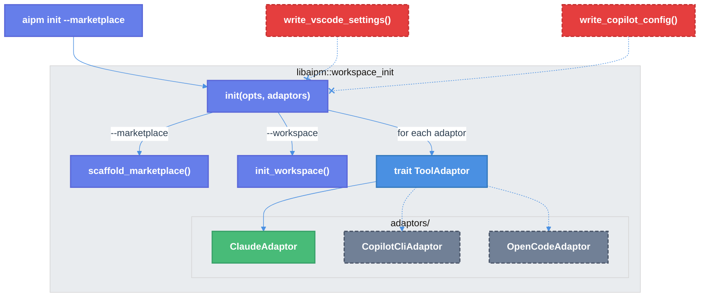

# Init Tool Adaptor Refactor

| Document Metadata      | Details                                              |
| ---------------------- | ---------------------------------------------------- |
| Author(s)              | selarkin                                             |
| Status                 | Draft (WIP)                                          |
| Team / Owner           | AI Dev Tooling                                       |
| Created / Last Updated | 2026-03-19                                           |
| Research               | [research/docs/2026-03-19-init-tool-adaptor-refactor.md](../research/docs/2026-03-19-init-tool-adaptor-refactor.md) |

## 1. Executive Summary

This spec refactors `aipm init` to remove hard-coded VS Code and Copilot CLI settings, extract tool-specific logic into a composable `ToolAdaptor` trait, and change the default `aipm init` behavior to marketplace-only. The `.vscode/settings.json` and `.copilot/mcp-config.json` generation is deleted entirely. The existing Claude Code settings logic moves into a `ClaudeAdaptor` struct implementing the new trait. The `workspace_init` module is restructured from a single file into a directory with `mod.rs` + `adaptors/claude.rs`, making it trivial to add future adaptors (copilot-cli, opencode) without touching existing code.

## 2. Context and Motivation

### 2.1 Current State

`workspace_init.rs` (674 lines) hard-codes three tool integrations directly in the `init()` function ([research §1](../research/docs/2026-03-19-init-tool-adaptor-refactor.md)):

```
init()
 ├── scaffold_marketplace()          # .ai/ directory tree
 ├── write_claude_settings()         # .claude/settings.json
 ├── write_vscode_settings()         # .vscode/settings.json
 └── write_copilot_config()          # .copilot/mcp-config.json
```

`aipm init` with no flags defaults to `--workspace --marketplace`, creating both `aipm.toml` and `.ai/` plus all three tool configs.

### 2.2 The Problem

| Problem | Impact |
|---------|--------|
| VS Code and Copilot integrations are premature | These tool integrations are not ready; shipping them creates files users don't expect |
| Tool settings are hard-coded in `init()` | Adding a new tool (opencode, Cursor) requires modifying the core init function |
| Default `aipm init` creates `aipm.toml` | The workspace manifest story is not mature enough to be the default |
| No composability | Cannot mix-and-match tool integrations; they're all-or-nothing |

## 3. Goals and Non-Goals

### 3.1 Functional Goals

- [ ] Delete all `.vscode/settings.json` generation code and tests
- [ ] Delete all `.copilot/mcp-config.json` generation code and tests
- [ ] Delete `InitAction::VscodeSettingsWritten` and `InitAction::CopilotConfigWritten` enum variants
- [ ] Create a `ToolAdaptor` trait with `name()` and `apply()` methods
- [ ] Create `ClaudeAdaptor` implementing the trait, wrapping existing `write_claude_settings()` + `merge_claude_settings()` logic
- [ ] Restructure `workspace_init.rs` into `workspace_init/mod.rs` + `workspace_init/adaptors/claude.rs`
- [ ] Change `init()` to accept a slice of adaptors instead of hard-coding tool calls
- [ ] Replace `InitAction::ClaudeSettingsWritten` with generic `InitAction::ToolConfigured(String)`
- [ ] Change default `aipm init` (no flags) from `--workspace --marketplace` to `--marketplace` only
- [ ] Update CLI output in `main.rs` to handle the new `InitAction::ToolConfigured` variant
- [ ] Delete BDD scenarios for VS Code and Copilot tool settings
- [ ] All existing `cargo build/test/clippy/fmt` must pass

### 3.2 Non-Goals (Out of Scope)

- [ ] Copilot CLI adaptor — deferred until copilot integration is revisited
- [ ] OpenCode adaptor — future work
- [ ] `--tool` CLI flag for selective adaptor application — not needed yet (all registered adaptors always apply)
- [ ] Plugin install story — tabled until marketplace init is stable
- [ ] Changes to `scaffold_marketplace()` or core `.ai/` directory structure
- [ ] Changes to `aipm.toml` workspace manifest format or generation

## 4. Proposed Solution (High-Level Design)

### 4.1 Architecture Diagram



### 4.2 Architectural Pattern

**Strategy Pattern** — each `ToolAdaptor` is a strategy that encapsulates tool-specific settings logic. The `init()` function iterates over a collection of strategies, applying each one. New tools are added by implementing the trait and registering the adaptor.

### 4.3 Key Components

| Component | Responsibility | Location | Status |
|-----------|---------------|----------|--------|
| `ToolAdaptor` trait | Defines interface for tool integrations | `workspace_init/mod.rs` | New |
| `ClaudeAdaptor` | Creates/merges `.claude/settings.json` | `workspace_init/adaptors/claude.rs` | New (logic moved from `write_claude_settings`) |
| `init()` | Orchestrates marketplace scaffolding + adaptor application | `workspace_init/mod.rs` | Modified |
| `scaffold_marketplace()` | Creates `.ai/` directory tree | `workspace_init/mod.rs` | Unchanged |
| `init_workspace()` | Creates `aipm.toml` | `workspace_init/mod.rs` | Unchanged |

## 5. Detailed Design

### 5.1 Module Structure

```
crates/libaipm/src/
  workspace_init/
    mod.rs                    # init(), scaffold_marketplace(), ToolAdaptor trait, Options, InitResult
    adaptors/
      mod.rs                  # pub mod claude; pub fn default_adaptors()
      claude.rs               # ClaudeAdaptor struct + impl ToolAdaptor
```

### 5.2 `ToolAdaptor` Trait — `workspace_init/mod.rs`

```rust
use std::path::Path;

/// An adaptor integrates aipm's .ai/ marketplace with a specific AI coding tool.
///
/// Each adaptor is responsible for writing or merging tool-specific configuration
/// files that point the tool at the `.ai/` marketplace directory.
pub trait ToolAdaptor {
    /// Human-readable name for user-facing output (e.g., "Claude Code").
    fn name(&self) -> &str;

    /// Apply tool-specific settings to the workspace directory.
    ///
    /// Returns `true` if files were written or modified, `false` if the tool
    /// was already configured and no changes were needed.
    fn apply(&self, dir: &Path) -> Result<bool, Error>;
}
```

### 5.3 `ClaudeAdaptor` — `workspace_init/adaptors/claude.rs`

```rust
use std::io::Write;
use std::path::Path;

use crate::workspace_init::{Error, ToolAdaptor};

/// Configures Claude Code to discover the `.ai/` local marketplace.
///
/// Creates or merges `.claude/settings.json` with an `extraKnownMarketplaces`
/// entry pointing to `.ai/`.
pub struct ClaudeAdaptor;

impl ToolAdaptor for ClaudeAdaptor {
    fn name(&self) -> &str {
        "Claude Code"
    }

    fn apply(&self, dir: &Path) -> Result<bool, Error> {
        // Existing write_claude_settings() + merge_claude_settings() logic
        // moved here verbatim
    }
}
```

The body of `apply()` is the existing `write_claude_settings()` function (lines 247-273) which delegates to `merge_claude_settings()` (lines 275-321) when the file already exists. These move as private methods or inline logic within the `apply()` method.

### 5.4 Default Adaptors — `workspace_init/adaptors/mod.rs`

```rust
pub mod claude;

use super::ToolAdaptor;
use claude::ClaudeAdaptor;

/// Returns the default set of tool adaptors to apply during init.
///
/// Currently only includes Claude Code. Future adaptors (Copilot CLI,
/// OpenCode, etc.) are added here.
pub fn default_adaptors() -> Vec<Box<dyn ToolAdaptor>> {
    vec![Box::new(ClaudeAdaptor)]
}
```

### 5.5 Updated `init()` — `workspace_init/mod.rs`

```rust
pub fn init(opts: &Options<'_>, adaptors: &[Box<dyn ToolAdaptor>]) -> Result<InitResult, Error> {
    let mut actions = Vec::new();

    if opts.workspace {
        init_workspace(opts.dir)?;
        actions.push(InitAction::WorkspaceCreated);
    }

    if opts.marketplace {
        scaffold_marketplace(opts.dir)?;
        actions.push(InitAction::MarketplaceCreated);

        for adaptor in adaptors {
            if adaptor.apply(opts.dir)? {
                actions.push(InitAction::ToolConfigured(adaptor.name().to_string()));
            }
        }
    }

    Ok(InitResult { actions })
}
```

### 5.6 Updated `InitAction` Enum

```rust
#[derive(Debug, Clone, PartialEq, Eq)]
pub enum InitAction {
    /// The workspace manifest (`aipm.toml`) was created.
    WorkspaceCreated,
    /// The `.ai/` marketplace directory was scaffolded.
    MarketplaceCreated,
    /// A tool-specific configuration was written or merged.
    /// The string is the human-readable tool name (e.g., "Claude Code").
    ToolConfigured(String),
}
```

Note: `InitAction` loses `Copy` since it now contains a `String`. The `Clone` derive remains.

### 5.7 Updated CLI — `crates/aipm/src/main.rs`

```rust
// Default behavior: marketplace only (no --workspace)
let (do_workspace, do_marketplace) =
    if !workspace && !marketplace { (false, true) } else { (workspace, marketplace) };

let adaptors = libaipm::workspace_init::adaptors::default_adaptors();

let opts = libaipm::workspace_init::Options {
    dir: &dir,
    workspace: do_workspace,
    marketplace: do_marketplace,
};

let result = libaipm::workspace_init::init(&opts, &adaptors)?;

let mut stdout = std::io::stdout();
for action in &result.actions {
    let msg = match action {
        libaipm::workspace_init::InitAction::WorkspaceCreated => {
            format!("Initialized workspace in {}", dir.display())
        },
        libaipm::workspace_init::InitAction::MarketplaceCreated => {
            "Created .ai/ marketplace with starter plugin".to_string()
        },
        libaipm::workspace_init::InitAction::ToolConfigured(name) => {
            format!("Configured {name} settings")
        },
    };
    let _ = writeln!(stdout, "{msg}");
}
```

### 5.8 Code Deletions

**From `workspace_init.rs` (moving to `workspace_init/mod.rs`):**

| What | Lines | Action |
|------|-------|--------|
| `InitAction::ClaudeSettingsWritten` | 30 | Replace with `ToolConfigured(String)` |
| `InitAction::VscodeSettingsWritten` | 32 | Delete |
| `InitAction::CopilotConfigWritten` | 34 | Delete |
| `write_claude_settings()` | 247-273 | Move to `ClaudeAdaptor::apply()` |
| `merge_claude_settings()` | 275-321 | Move to `adaptors/claude.rs` as private fn |
| `write_vscode_settings()` | 325-337 | Delete |
| `merge_vscode_settings()` | 339-375 | Delete |
| `write_copilot_config()` | 377-390 | Delete |

**Tests to delete:**

| Test | Lines |
|------|-------|
| `vscode_settings_created_fresh` | 570-580 |
| `vscode_settings_merge_existing` | 583-596 |
| `vscode_settings_skip_duplicate` | 599-612 |
| `copilot_config_created_fresh` | 615-622 |
| `copilot_config_skip_existing` | 625-634 |

**Tests to move to `adaptors/claude.rs`:**

| Test | Lines |
|------|-------|
| `claude_settings_created_fresh` | 521-531 |
| `claude_settings_merge_existing` | 534-552 |
| `claude_settings_skip_if_present` | 555-567 |

**BDD scenarios to delete** from `tests/features/manifest/workspace-init.feature`:

| Scenario | Lines |
|----------|-------|
| "Copilot VS Code settings point to .ai/ for agent discovery" | 109-114 |
| "Copilot CLI MCP config stub is created" | 116-119 |
| "Existing VS Code settings are merged not overwritten" | 127-132 |

**BDD scenarios to keep:**

| Scenario | Lines |
|----------|-------|
| "Claude Code settings point to .ai/ as local marketplace" | 102-107 |
| "Existing Claude settings are not overwritten" | 121-125 |

### 5.9 Updated BDD: Default Init Behavior

The existing scenario "Default init with no flags creates both workspace and marketplace" (lines 84-92) needs updating:

**Before:**
```gherkin
Scenario: Default init with no flags creates both workspace and marketplace
  Given an empty directory "my-project"
  When the user runs "aipm init" in "my-project"
  Then a file "aipm.toml" is created in "my-project"
  And the manifest contains a "[workspace]" section
  And the following directories exist in "my-project":
    | directory      |
    | .ai/           |
    | .ai/starter/   |
```

**After:**
```gherkin
Scenario: Default init with no flags creates marketplace only
  Given an empty directory "my-project"
  When the user runs "aipm init" in "my-project"
  Then the following directories exist in "my-project":
    | directory      |
    | .ai/           |
    | .ai/starter/   |
  And there is no file "aipm.toml" in "my-project"
```

## 6. Alternatives Considered

| Option | Pros | Cons | Reason for Rejection |
|--------|------|------|---------------------|
| **Keep tool settings hard-coded, just delete vscode/copilot** | Minimal change, fast to implement | Adding future tools still requires modifying `init()` | Doesn't solve the extensibility problem |
| **Config file listing active adaptors** | Users control which tools get configured | Over-engineering; only one adaptor exists; adds config parsing complexity | YAGNI — the adaptor list is code, not config |
| **`--tool` flag on CLI** | Explicit user control | Unnecessary friction when there's only one adaptor; users don't know/care about adaptor names | Can be added later when multiple adaptors exist |
| **Trait with `detect()` method for auto-detection** | Only configures tools the user actually has | Magic behavior; harder to test; `.claude/` might not exist yet | Explicit > implicit; all registered adaptors always run |

## 7. Cross-Cutting Concerns

### 7.1 Backwards Compatibility

- **`aipm init` default change**: Users who relied on `aipm init` creating `aipm.toml` must now use `aipm init --workspace`. This is a breaking change to CLI behavior but not to any library API.
- **No `.vscode/` or `.copilot/` creation**: Users who expected these files from `aipm init --marketplace` will no longer get them. Since this feature hasn't been released to users yet (pre-1.0), this is acceptable.

### 7.2 Testing

- Existing Claude settings tests (3 unit tests) move to `adaptors/claude.rs` with minimal modification
- `init_both_creates_everything` test updates to reflect `init()` now taking an adaptors parameter
- `init_marketplace_creates_tree` test no longer asserts vscode/copilot files
- BDD scenarios updated per §5.8 and §5.9

## 8. Migration, Rollout, and Testing

### 8.1 Deployment Strategy

- [ ] **Phase 1**: Restructure `workspace_init.rs` into `workspace_init/` module directory. No logic changes — just move code. Verify tests pass.
- [ ] **Phase 2**: Create `ToolAdaptor` trait and `ClaudeAdaptor`. Move Claude settings logic. Delete vscode/copilot code.
- [ ] **Phase 3**: Update `init()` signature to accept adaptors. Update CLI caller.
- [ ] **Phase 4**: Change default `aipm init` to marketplace-only. Update BDD scenarios.
- [ ] **Phase 5**: Run full `cargo build/test/clippy/fmt` suite.

### 8.2 Test Plan

**Unit tests (in `adaptors/claude.rs`):**
- [ ] `claude_settings_created_fresh` — fresh `.claude/settings.json` with `extraKnownMarketplaces`
- [ ] `claude_settings_merge_existing` — merges into existing settings preserving other keys
- [ ] `claude_settings_skip_if_present` — no-op if marketplace entry already exists

**Unit tests (in `workspace_init/mod.rs`):**
- [ ] `init_marketplace_creates_tree` — `.ai/` tree created, no vscode/copilot files
- [ ] `init_both_creates_everything` — workspace + marketplace with adaptors
- [ ] `init_with_no_adaptors` — marketplace scaffolding works with empty adaptor list
- [ ] `init_workspace_only` — only `aipm.toml`, no `.ai/` or tool settings
- [ ] Existing tests for manifests, gitignore, plugin.json, skill template — unchanged

**BDD scenarios:**
- [ ] Default init creates marketplace only (no `aipm.toml`)
- [ ] `--workspace` flag creates `aipm.toml`
- [ ] Claude Code settings are created
- [ ] Existing Claude settings are merged, not overwritten
- [ ] No vscode/copilot scenarios

## 9. Open Questions / Unresolved Issues

- [x] **Module structure**: **RESOLVED** — Submodule: `workspace_init/mod.rs` + `adaptors/claude.rs`
- [x] **Default init behavior**: **RESOLVED** — Marketplace only. `--workspace` required for `aipm.toml`.
- [x] **Adaptor selection**: **RESOLVED** — Always apply all registered adaptors.
- [ ] **`InitAction` losing `Copy`**: `ToolConfigured(String)` makes `InitAction` non-`Copy`. The current code uses `Copy` in a few places (the `actions.contains()` assertions in tests). These need updating to use references or `Clone`. Verify no downstream impact.
