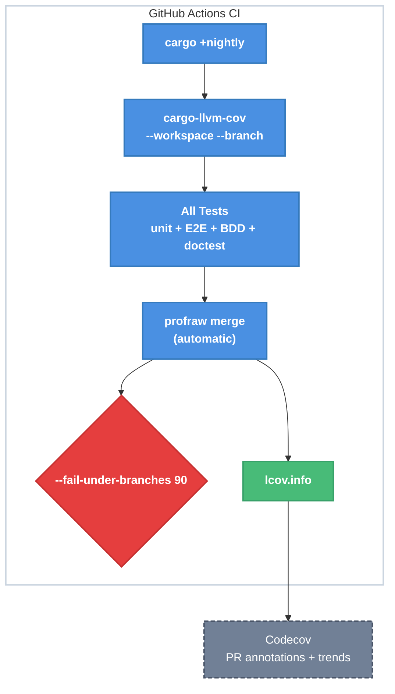

# Strict Branch Coverage as a Correctness Gate

| Document Metadata      | Details                                           |
| ---------------------- | ------------------------------------------------- |
| Author(s)              | selarkin                                          |
| Status                 | Draft (WIP)                                       |
| Team / Owner           | selarkin                                          |
| Created / Last Updated | 2026-03-22                                        |
| Research               | `research/docs/2026-03-22-rust-code-coverage-implementation.md` |

## 1. Executive Summary

This spec introduces mandatory 90% branch coverage enforcement for the aipm workspace, treating coverage as a **correctness gate for agentic code generation**, not a reporting metric. Code generated by LLMs must prove that all decision points (if/else, match arms, `?` operator, short-circuit operators) are exercised by tests. Implementation uses `cargo-llvm-cov` with Rust nightly (coverage job only), collects unified coverage across unit tests, E2E tests, and BDD/cucumber-rs tests, enforces the threshold both locally (post-build) and in CI, and reports to Codecov for PR annotations and trend tracking.

## 2. Context and Motivation

### 2.1 Current State

- **Architecture**: Workspace with 3 crates (`aipm`, `aipm-pack`, `libaipm`). Thin binary crates delegate to `libaipm`.
- **Tests**: 92 unit tests, 18 aipm E2E tests, 15 aipm-pack E2E tests, 3 enabled BDD feature files via cucumber-rs. Total: 125 `#[test]` functions + BDD scenarios.
- **CI**: Single workflow (`.github/workflows/ci.yml`) runs `cargo build`, `cargo test`, `cargo clippy`, `cargo fmt`. No coverage tooling. No Node.js (5 E2E tests silently skip).
- **Lints**: Strict clippy configuration denies `unwrap_used`, `expect_used`, `panic`, `todo`, `print_stdout`, `print_stderr`, `unsafe`, `dbg_macro`, `exit`. Forces explicit error handling that creates measurable branches.
- **Coverage**: Zero. No tooling, no thresholds, no reporting.

### 2.2 The Problem

- **Agentic risk**: LLMs generate code that compiles and passes happy-path tests but leaves error branches untested. Line coverage cannot detect this — a single line with `if/else` shows 100% line coverage if either branch runs.
- **No feedback loop**: There is no mechanism to tell the LLM "your generated code has untested paths" before it pushes to a PR.
- **Silent test gaps**: 5 E2E tests (scaffold-plugin Node.js bridge) skip silently in CI because Node.js isn't installed.

## 3. Goals and Non-Goals

### 3.1 Functional Goals

- [ ] **G1**: Enforce 90% branch coverage across the entire workspace, gating CI and local push workflows
- [ ] **G2**: Collect unified coverage from all test types: unit tests, E2E tests (assert_cmd), BDD tests (cucumber-rs), and doctests
- [ ] **G3**: Add a `coverage` job to `.github/workflows/ci.yml` using `cargo-llvm-cov` with nightly Rust
- [ ] **G4**: Install Node.js >= 22.6 in CI so all E2E tests run (no silent skips)
- [ ] **G5**: Upload coverage to Codecov with PR annotations, patch coverage enforcement (90%), and trend tracking
- [ ] **G6**: Add a `codecov.yml` configuration file to the repository root
- [ ] **G7**: Provide local developer commands for coverage checking (text, HTML, lcov for editor gutters)
- [ ] **G8**: Add `coverage/` and `lcov.info` to `.gitignore`
- [ ] **G9**: Document coverage commands in `CLAUDE.md` so LLM agents run coverage before pushing

### 3.2 Non-Goals (Out of Scope)

- [ ] We will NOT migrate the build/test/clippy/fmt CI job to nightly. Only the coverage job uses nightly.
- [ ] We will NOT implement mutation testing (cargo-mutants) in this iteration.
- [ ] We will NOT add per-crate coverage thresholds — one workspace-wide 90% branch threshold.
- [ ] We will NOT create a custom coverage dashboard. Codecov provides this.
- [ ] We will NOT change any existing test code or production code. This spec is infrastructure-only.

## 4. Proposed Solution (High-Level Design)

### 4.1 System Architecture



### 4.2 Architectural Pattern

**Two-toolchain pattern**: The existing CI job stays on stable Rust for build/test/clippy/fmt. A separate `coverage` job uses nightly Rust exclusively for coverage instrumentation. This isolates the nightly dependency to a non-compilation concern.

### 4.3 Key Components

| Component | Responsibility | Technology | Justification |
|-----------|---------------|------------|---------------|
| `cargo-llvm-cov` | Coverage collection + threshold enforcement | Rust nightly + LLVM InstrProf | Only cross-platform tool with branch coverage and `--fail-under-branches` |
| Codecov | PR annotations, trend graphs, patch coverage | Cloud service | Industry standard; free for open source; no self-hosting |
| `codecov.yml` | Coverage policy configuration | YAML config | Enforces 90% on both project and patch (new code in PRs) |
| Node.js 22 in CI | Enables scaffold E2E tests | `actions/setup-node@v4` | 5 tests silently skip without it |

## 5. Detailed Design

### 5.1 New File: `.github/workflows/ci.yml` (Modified)

Add a `coverage` job alongside the existing `ci` job. The existing job is unchanged.

```yaml
  coverage:
    name: Coverage (90% branch gate)
    runs-on: ubuntu-latest
    steps:
      - uses: actions/checkout@v4

      - uses: dtolnay/rust-toolchain@nightly
        with:
          components: llvm-tools-preview

      - uses: actions/setup-node@v4
        with:
          node-version: '22'

      - uses: taiki-e/install-action@cargo-llvm-cov

      - uses: Swatinem/rust-cache@v2

      - name: Clean coverage artifacts
        run: cargo llvm-cov clean --workspace

      - name: Run all tests with branch coverage
        run: cargo llvm-cov --no-report --workspace --branch

      - name: Run doctests with branch coverage
        run: cargo llvm-cov --no-report --doc

      - name: Generate lcov report
        run: cargo llvm-cov report --doctests --branch --lcov --output-path lcov.info

      - name: Enforce 90% branch coverage
        run: cargo llvm-cov report --doctests --branch --fail-under-branches 90

      - name: Upload to Codecov
        if: always()
        uses: codecov/codecov-action@v5
        with:
          files: lcov.info
          token: ${{ secrets.CODECOV_TOKEN }}
          fail_ci_if_error: true
```

**Why `--no-report` then `report`**: This pattern accumulates `.profraw` files from multiple test runs (workspace tests + doctests) and then generates a single merged report. Running `cargo llvm-cov --workspace --branch` in one shot would miss doctest coverage.

**Why `if: always()` on Codecov upload**: Even if the threshold gate fails, we still want to upload the report so the PR shows exactly what's uncovered.

### 5.2 New File: `codecov.yml`

```yaml
coverage:
  status:
    project:
      default:
        target: 90%
        threshold: 1%
    patch:
      default:
        target: 90%
  precision: 2
  round: down
ignore:
  - "tests/"
  - "crates/*/tests/"
  - "research/"
  - "specs/"
```

- **project.target: 90%** — mirrors the `--fail-under-branches 90` hard gate
- **patch.target: 90%** — new code in PRs must also be 90% covered (prevents coverage erosion even if the overall is above 90%)
- **ignore** — test code, research, and specs don't count toward coverage

### 5.3 Modified File: `.gitignore`

Append:
```
# Coverage artifacts
coverage/
lcov.info
*.profraw
*.profdata
```

### 5.4 Modified File: `CLAUDE.md`

Add a new section after `## Build Commands`:

```markdown
## Coverage Commands (MANDATORY before pushing)

Coverage uses nightly Rust for branch-level instrumentation. The coverage check
is a **correctness gate** — LLM-generated code must hit 90% branch coverage.

```bash
# Check branch coverage (MUST pass before pushing)
cargo +nightly llvm-cov --workspace --branch --fail-under-branches 90

# HTML report (visual inspection)
cargo +nightly llvm-cov --workspace --branch --html --open

# lcov for VS Code Coverage Gutters extension
cargo +nightly llvm-cov --workspace --branch --lcov --output-path lcov.info
```

All coverage commands require the nightly toolchain and llvm-tools-preview:
```bash
rustup toolchain install nightly
rustup component add llvm-tools-preview --toolchain nightly
cargo install cargo-llvm-cov
```
```

### 5.5 Node.js in CI

Add `actions/setup-node@v4` with `node-version: '22'` to the `coverage` job. This ensures the 5 scaffold E2E tests gated behind `has_node_with_strip_types()` in `crates/aipm/tests/init_e2e.rs:224` actually execute and contribute coverage data.

**Note**: The existing `ci` job does NOT get Node.js. Those 5 tests will continue to silently skip in the build/test job. Only the coverage job needs full test execution. If desired, Node.js can be added to `ci` as well, but that is out of scope for this spec.

### 5.6 Environment Variables

The coverage job sets:
- `CARGO_INCREMENTAL: 0` — required for accurate coverage (incremental compilation can produce incorrect profraw data)
- `CARGO_TERM_COLOR: always` — readable CI output

These are already set in the existing `ci` job (`CARGO_INCREMENTAL: 0`).

## 6. Alternatives Considered

| Option | Pros | Cons | Reason for Rejection |
|--------|------|------|---------------------|
| **Line coverage only (stable)** | No nightly dependency; simpler | Misses the core failure mode: LLMs test happy path, skip error branches | Branch coverage is the whole point for agentic correctness |
| **tarpaulin** | No LLVM dependency; simpler setup | Linux x86_64 only; no Windows support; no branch coverage | Not viable for Windows dev workflow; missing key feature |
| **grcov** | Multi-language; Mozilla-backed | More complex setup; no `--fail-under-*` flags; requires manual profdata merge | cargo-llvm-cov is simpler and has built-in threshold enforcement |
| **Ratcheting threshold** | Gradual adoption; less upfront work | Delays the correctness signal; LLM keeps generating undertested code during ramp | Defeats the purpose of a correctness gate |
| **Coverage in existing `ci` job** | One fewer job; simpler workflow | Mixes stable (build/clippy) with nightly (coverage); longer CI time on the critical path | Two-toolchain isolation is cleaner; coverage can run in parallel |
| **Local-only (no Codecov)** | No external service dependency | No PR annotations; no trend data; no patch coverage enforcement | Codecov PR annotations are critical for showing the LLM exactly which lines are uncovered |

## 7. Cross-Cutting Concerns

### 7.1 Security and Privacy

- **Codecov token**: Stored as `CODECOV_TOKEN` GitHub secret. Required for private repos; optional for public (aipm is public).
- **No code leaves the repo**: Only `lcov.info` (line/branch hit counts, no source code) is uploaded to Codecov.

### 7.2 Observability Strategy

- **Codecov dashboard**: Coverage trends over time, per-PR annotations
- **CI job output**: `cargo llvm-cov report --text` prints summary table to CI logs
- **Local HTML reports**: `cargo +nightly llvm-cov --workspace --branch --html --open`

### 7.3 Performance Impact

- **CI time**: Coverage job rebuilds all crates with instrumentation (~2-3x slower than normal build). Runs in parallel with the existing `ci` job, so it does not increase wall-clock PR time unless it's the slower of the two.
- **Local time**: `cargo +nightly llvm-cov --workspace --branch` takes ~2-3x a normal `cargo test`. Developers should run it before pushing, not after every edit.
- **Caching**: `Swatinem/rust-cache@v2` caches the nightly build artifacts. Subsequent runs only rebuild changed crates.

## 8. Migration, Rollout, and Testing

### 8.1 Deployment Strategy

- [ ] **Phase 1**: Install tooling locally, measure current baseline with `cargo +nightly llvm-cov --workspace --branch`. If below 90%, add tests to reach 90% before merging the CI change.
- [ ] **Phase 2**: Add `coverage` job to `ci.yml`, `codecov.yml`, `.gitignore` updates, `CLAUDE.md` updates. Merge as a single PR.
- [ ] **Phase 3**: Verify Codecov integration works — check PR annotations appear on the next PR after merge.

### 8.2 Test Plan

- **Verification**: After adding the coverage job, open a test PR and verify:
  - [ ] Coverage job runs and reports branch coverage percentage
  - [ ] `--fail-under-branches 90` passes (or fails with a clear message showing the gap)
  - [ ] `lcov.info` is generated and uploaded to Codecov
  - [ ] Codecov posts a PR comment with coverage summary
  - [ ] Codecov annotates uncovered lines in the diff
  - [ ] All 5 Node.js scaffold tests execute (not skip) in the coverage job
  - [ ] The existing `ci` job is unaffected (still uses stable Rust)

## 9. Implementation Checklist

Files to create or modify:

| File | Action | Description |
|------|--------|-------------|
| `.github/workflows/ci.yml` | Modify | Add `coverage` job with nightly + cargo-llvm-cov + Node.js |
| `codecov.yml` | Create | Coverage policy: 90% project + 90% patch |
| `.gitignore` | Modify | Add `coverage/`, `lcov.info`, `*.profraw`, `*.profdata` |
| `CLAUDE.md` | Modify | Add coverage commands section for LLM agents |

No production code or test code changes are in scope. If the current baseline is below 90%, additional tests must be written in a prerequisite PR before this spec can be merged.

## 10. Open Questions / Unresolved Issues

- [ ] **Baseline measurement**: What is the current branch coverage? Must be measured before Phase 1. If significantly below 90%, a separate "add tests" PR is needed first.
- [ ] **CODECOV_TOKEN**: Is the repo already registered on Codecov? If not, sign up at codecov.io and add the token as a GitHub secret. For public repos, the token may be optional.
- [ ] **Nightly pinning**: Should the coverage job pin a specific nightly date (`nightly-2026-03-20`) to avoid breakage from nightly regressions? Trade-off: stability vs getting latest branch coverage fixes.
