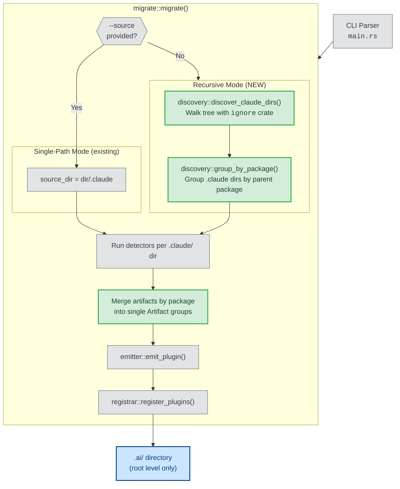

# Recursive `.claude/` Discovery for `aipm migrate`

| Document Metadata      | Details                                                                                                                                                     |
| ---------------------- | ----------------------------------------------------------------------------------------------------------------------------------------------------------- |
| Author(s)              | selarkin                                                                                                                                                    |
| Status                 | Draft (WIP)                                                                                                                                                 |
| Team / Owner           | AI Dev Tooling                                                                                                                                              |
| Created / Last Updated | 2026-03-23                                                                                                                                                  |
| Research               | [research/docs/2026-03-23-recursive-claude-discovery-parallel-migrate.md](../research/docs/2026-03-23-recursive-claude-discovery-parallel-migrate.md)       |
| Prior Spec             | [specs/2026-03-23-aipm-migrate-command.md](./2026-03-23-aipm-migrate-command.md)                                                                            |

## 1. Executive Summary

This spec extends `aipm migrate` with recursive `.claude/` directory discovery. Today, the command scans exactly one `.claude/` folder at the project root. In monorepos and multi-package repositories, `.claude/` configurations exist at multiple depths (e.g., `packages/auth/.claude/skills/deploy/`). This change makes recursive scanning the **default behavior** (when `--source` is not passed), walks the entire repo tree respecting `.gitignore`, merges all components found under a single package sub-path's `.claude/` folder into **one plugin named after that package**, and emits everything to the **root-level `.ai/` directory**. A `--max-depth` flag is provided for performance tuning but defaults to unlimited depth.

## 2. Context and Motivation

### 2.1 Current State

The `aipm migrate` command ([`crates/libaipm/src/migrate/mod.rs:158-215`](../crates/libaipm/src/migrate/mod.rs)) computes a single source directory from `opts.dir.join(opts.source)` and runs detectors against it once:

```
CLI: aipm migrate [--source .claude] [dir]
  └─ source_dir = dir/.claude  (single path, no recursion)
       └─ SkillDetector + CommandDetector scan that one directory
            └─ Each skill/command becomes its own plugin in .ai/
```

> **Research ref:** The orchestrator resolves exactly one source path ([research, §1](../research/docs/2026-03-23-recursive-claude-discovery-parallel-migrate.md#1-current-source-directory-resolution)). There is no `--recursive` flag, no multi-directory support, and no glob expansion.

### 2.2 The Problem

| Problem | Impact |
|---------|--------|
| Only scans root-level `.claude/` | Monorepo sub-packages (e.g., `packages/auth/.claude/`) are invisible to migrate |
| Each skill becomes its own plugin | In a monorepo with 5 packages × 3 skills = 15 individual plugins, when logically there should be 5 package-scoped plugins |
| No depth control | Users cannot limit scan depth for performance in very deep trees |
| No `.gitignore` awareness | If scanning were added naively, `node_modules/`, `target/`, `.git/` would be traversed |

### 2.3 Example: Before vs After

**Monorepo layout:**
```
my-monorepo/
├── .ai/                           ← marketplace (already initialized)
├── .claude/                       ← root-level .claude
│   └── skills/lint-all/SKILL.md
├── packages/
│   ├── auth/
│   │   └── .claude/
│   │       ├── skills/deploy/SKILL.md
│   │       └── commands/review.md
│   └── api/
│       └── .claude/
│           └── skills/deploy/SKILL.md
└── .gitignore
```

**Current behavior (`aipm migrate`):** Only discovers `lint-all` from the root `.claude/`. Packages are invisible.

**New behavior (`aipm migrate`):** Recursively discovers all three `.claude/` directories. Produces:
```
.ai/
├── lint-all/                      ← root .claude skills keep their original name
│   └── skills/lint-all/SKILL.md
├── auth/                          ← named after the "auth" package
│   ├── skills/deploy/SKILL.md
│   ├── skills/review/SKILL.md     ← command migrated as skill
│   └── aipm.toml                  ← type = "composite" (multiple components)
└── api/                           ← named after the "api" package
    ├── skills/deploy/SKILL.md
    └── aipm.toml
```

## 3. Goals and Non-Goals

### 3.1 Functional Goals

- [ ] When `--source` is **not** provided, `aipm migrate` recursively walks the project tree to discover all `.claude/` directories
- [ ] When `--source` is explicitly provided (e.g., `--source .claude`), behavior is **unchanged** — scans only `dir/.claude` (backward compatible)
- [ ] All components (skills, commands, etc.) found under a single package sub-path's `.claude/` folder are merged into **one plugin named after that package directory**
- [ ] Components found under the **root** `.claude/` (no parent package) retain the current behavior: each artifact becomes its own plugin
- [ ] All discovered plugins are emitted to the **root-level `.ai/` directory** — never to a sub-package `.ai/`
- [ ] `--max-depth <n>` flag limits directory traversal depth (default: unlimited)
- [ ] Discovery respects `.gitignore` rules out of the box (via the `ignore` crate)
- [ ] `--dry-run` works with recursive discovery and shows all discovered `.claude/` directories and their planned plugin mappings
- [ ] Name conflicts between packages (e.g., two packages both named `api`) are resolved with the existing rename-counter mechanism
- [ ] The `ignore` crate is added as a workspace dependency for gitignore-aware directory walking
- [ ] Detection is parallelized across discovered `.claude/` directories (detectors are stateless and read-only)
- [ ] The `Fs` trait gains `Send + Sync` supertraits to enable thread-safe sharing across parallel detection; test mocks switch from `RefCell` to `Mutex`
- [ ] Emission is parallelized where possible — plugin names are pre-resolved sequentially, then file writes are parallelized via `rayon`
- [ ] `rayon` is added as a workspace dependency for data-parallel detection and emission

### 3.2 Non-Goals (Out of Scope)

- [ ] We will NOT support custom ignore patterns beyond `.gitignore` (no `--exclude` flag)
- [ ] We will NOT scan non-`.claude` source folders (e.g., `.github/`, `.copilot/`)
- [ ] We will NOT create per-sub-package `.ai/` directories — all output goes to root `.ai/`
- [ ] We will NOT implement the monorepo workspace member resolution from `orchestration.feature` — this spec only covers migration discovery

## 4. Proposed Solution (High-Level Design)

### 4.1 Architecture



### 4.2 Key Design Decisions

**Decision 1: Recursive by default (no `--source`) — explicit `--source` preserves old behavior.**

The `--source` flag currently defaults to `".claude"`. We change this: the default becomes `None` (recursive mode). When the user explicitly passes `--source .claude`, we fall back to the current single-directory behavior. This means existing scripts using `aipm migrate --source .claude` are unaffected.

> **Research ref:** Open question §5 — "Should this be `--recursive` (opt-in), or should recursive be the default?" We choose recursive-by-default because the common case is "migrate everything" and explicit `--source` covers the single-directory case.

**Decision 2: Package-scoped plugin naming — all components under one `.claude/` become one plugin.**

When a `.claude/` directory is found at `packages/auth/.claude/`, the **immediate parent directory name** (`auth`) becomes the plugin name. All skills, commands, and future artifact types under that `.claude/` are merged into a single plugin at `.ai/auth/`. If the `.claude/` is at the project root (`./`), components retain the current behavior where each artifact is its own plugin.

> **Rationale:** A package is a logical grouping. Having `packages/auth/.claude/skills/deploy/` and `packages/auth/.claude/commands/review.md` produce two separate plugins (`deploy` and `review`) would be confusing. A single `auth` plugin with both components is the natural mapping.

**Decision 3: Root `.ai/` is the only target.**

All plugins go to the root `.ai/` directory. Sub-packages do not get their own `.ai/` folders. This aligns with the existing marketplace model where `.ai/` is the single source of truth.

> **Research ref:** Open question §2 — "Should all discovered skills go to the root `.ai/`?" Yes. The `.claude/settings.json` `extraKnownMarketplaces` points to `.ai/` and Claude Code discovers plugins from there ([claude-code-defaults research](../research/docs/2026-03-16-claude-code-defaults.md)).

**Decision 4: Unlimited depth by default, with `--max-depth` escape hatch.**

The `ignore` crate supports `max_depth()`. We default to no limit but expose `--max-depth <n>` for users in extremely deep trees.

**Decision 5: `.gitignore` only — no custom exclude patterns.**

The `ignore` crate respects `.gitignore`, `.git/info/exclude`, and nested `.gitignore` files by default. This is sufficient for v1. Custom `--exclude` patterns can be added later.

**Decision 6: Parallel detection and emission via `rayon`.**

Detection is embarrassingly parallel — detectors are stateless unit structs and read-only against the filesystem. Once the `Fs` trait has `Send + Sync` bounds, each discovered `.claude/` directory can be scanned concurrently via `rayon::par_iter()`. Emission requires a sequential name-resolution pass (the rename counter and `known_names` set are ordering-dependent), but the actual file writes can then be parallelized since each plugin writes to its own directory.

> **Research ref:** The research document identifies detection as freely parallelizable and emission as "partially" parallelizable if names are pre-resolved ([research, §Parallelization Zones](../research/docs/2026-03-23-recursive-claude-discovery-parallel-migrate.md#parallelization-zones)). The `Fs` trait's `Real` implementation is already `Send + Sync` (unit struct); only the trait definition and test mocks need updating ([research, §4](../research/docs/2026-03-23-recursive-claude-discovery-parallel-migrate.md#4-fs-trait-no-sendsync-bounds)).

### 4.3 Key Components

| Component | Responsibility | Location | Status |
| --- | --- | --- | --- |
| `discovery` module | Walk repo tree, find `.claude/` dirs, group by package | `crates/libaipm/src/migrate/discovery.rs` | **New** |
| `Options` struct | Add `max_depth` field, change `source` to `Option<&str>` | `crates/libaipm/src/migrate/mod.rs` | **Modified** |
| `migrate()` orchestrator | Branch on recursive vs single-path mode, parallel detect+emit | `crates/libaipm/src/migrate/mod.rs` | **Modified** |
| `Fs` trait | Add `Send + Sync` supertraits | `crates/libaipm/src/fs.rs` | **Modified** |
| CLI `Migrate` command | Add `--max-depth`, change `--source` default | `crates/aipm/src/main.rs` | **Modified** |
| `emitter` | Accept merged artifact groups, emit as single plugin | `crates/libaipm/src/migrate/emitter.rs` | **Modified** |
| `dry_run` | Show discovered dirs and package→plugin mappings | `crates/libaipm/src/migrate/dry_run.rs` | **Modified** |

## 5. Detailed Design

### 5.1 New Module: `discovery.rs`

**File:** `crates/libaipm/src/migrate/discovery.rs`

This module contains the recursive directory walker that finds all `.claude/` directories in the project tree.

#### 5.1.1 `DiscoveredSource` Struct

```rust
/// A discovered `.claude/` directory and its package context.
pub struct DiscoveredSource {
    /// Absolute path to the `.claude/` directory.
    pub claude_dir: PathBuf,
    /// The package name derived from the parent directory.
    /// `None` if the `.claude/` dir is at the project root.
    pub package_name: Option<String>,
    /// Relative path from project root to the parent of `.claude/`.
    /// Empty for root-level `.claude/`.
    pub relative_path: PathBuf,
}
```

#### 5.1.2 `discover_claude_dirs()` Function

```rust
/// Walk the project tree and find all `.claude/` directories.
///
/// Uses the `ignore` crate for gitignore-aware traversal.
/// Skips the `.ai/` directory itself to avoid scanning marketplace plugins.
///
/// # Arguments
/// * `project_root` — The project root directory to scan from
/// * `max_depth` — Optional maximum traversal depth (None = unlimited)
///
/// # Returns
/// A sorted `Vec<DiscoveredSource>` (sorted by path for deterministic output).
pub fn discover_claude_dirs(
    project_root: &Path,
    max_depth: Option<usize>,
) -> Result<Vec<DiscoveredSource>, Error>
```

**Implementation notes:**
- Uses `ignore::WalkBuilder::new(project_root)` with `.hidden(false)` (must find `.claude/` which is a hidden dir)
- Sets `.max_depth(max_depth)` if provided
- Filters for directory entries named `.claude`
- Skips any `.claude/` found inside `.ai/` (to avoid scanning the marketplace itself)
- For each found `.claude/` dir, derives the `package_name`:
  - If path is `{project_root}/.claude` → `package_name = None` (root)
  - If path is `{project_root}/some/path/pkg/.claude` → `package_name = Some("pkg")` (immediate parent dir name)
- Results sorted by `claude_dir` path for deterministic ordering

#### 5.1.3 `.gitignore` Handling

The `ignore` crate handles this natively:
- Reads `.gitignore` at every directory level
- Reads `.git/info/exclude`
- Reads global gitignore (`core.excludesFile`)
- `node_modules/`, `target/`, `vendor/` etc. are excluded if in `.gitignore` (as they typically are)
- The `.git/` directory itself is always excluded by the `ignore` crate

No custom exclusion logic is needed.

### 5.2 Modified: `Options` Struct

**File:** `crates/libaipm/src/migrate/mod.rs`

```rust
/// Options for the migrate command.
pub struct Options<'a> {
    /// Project root directory.
    pub dir: &'a Path,
    /// Source folder name (e.g., ".claude").
    /// When `None`, recursive discovery is used.
    /// When `Some`, only that single directory under `dir` is scanned (legacy behavior).
    pub source: Option<&'a str>,
    /// Whether to run in dry-run mode (report only, no writes).
    pub dry_run: bool,
    /// Maximum directory traversal depth for recursive discovery.
    /// `None` means unlimited. Ignored when `source` is `Some`.
    pub max_depth: Option<usize>,
}
```

### 5.3 Modified: `Fs` Trait — Add `Send + Sync` Bounds

**File:** `crates/libaipm/src/fs.rs`

```rust
/// Abstraction over filesystem operations.
/// `Send + Sync` enables sharing across threads for parallel detection.
pub trait Fs: Send + Sync {
    fn exists(&self, path: &Path) -> bool;
    fn create_dir_all(&self, path: &Path) -> std::io::Result<()>;
    fn write_file(&self, path: &Path, content: &[u8]) -> std::io::Result<()>;
    fn read_to_string(&self, path: &Path) -> std::io::Result<String>;
    fn read_dir(&self, path: &Path) -> std::io::Result<Vec<DirEntry>>;
}
```

The `Real` implementation is a unit struct and already auto-derives `Send + Sync` — no changes needed there.

**Test mock changes:** All `MockFs` implementations across the test suite must switch interior mutability from `RefCell` to `Mutex` (or `parking_lot::Mutex`). For example:

```rust
struct MockFs {
    exists: HashSet<PathBuf>,
    dirs: HashMap<PathBuf, Vec<DirEntry>>,
    files: HashMap<PathBuf, String>,
    written: Mutex<HashMap<PathBuf, Vec<u8>>>,  // was RefCell
}
```

`Mutex` is `Sync`, satisfying the new trait bounds. The lock contention is negligible in tests since they run single-threaded per test function. Each test mock's `write_file` and any other `&self` method that mutates state must use `.lock()` instead of `.borrow_mut()`.

> **Research ref:** The `Real` implementation already satisfies `Send + Sync` since it's a unit struct; test mocks using `RefCell` (which is `!Sync`) are the only obstacle ([research, §4](../research/docs/2026-03-23-recursive-claude-discovery-parallel-migrate.md#4-fs-trait-no-sendsync-bounds)).

### 5.4 Modified: `migrate()` Orchestrator

**File:** `crates/libaipm/src/migrate/mod.rs`

The `migrate()` function gains a branch at the top:

```
fn migrate(opts, fs) -> Result<Outcome, Error>:
    1. Validate .ai/ exists (unchanged)
    2. if opts.source is Some(source):
         // LEGACY single-path mode (unchanged behavior)
         source_dir = opts.dir.join(source)
         validate source_dir exists
         detectors = match source { ".claude" => claude_detectors(), ... }
         artifacts = run detectors on source_dir
         // Each artifact becomes its own plugin (existing behavior)
         emit each artifact individually
    3. if opts.source is None:
         // RECURSIVE mode (new)
         discovered = discovery::discover_claude_dirs(opts.dir, opts.max_depth)?
         if discovered is empty:
             return Ok(Outcome { actions: [] })  // nothing to migrate

         // PARALLEL DETECTION: run detectors across discovered dirs concurrently
         plugin_plans = discovered.par_iter().flat_map(|src| {
             detectors = claude_detectors()
             artifacts = run detectors on src.claude_dir

             if src.package_name is Some(pkg_name):
                 vec![PluginPlan { name: pkg_name, artifacts, is_package_scoped: true }]
             else:
                 artifacts.map(|a| PluginPlan { name: a.name, artifacts: [a], is_package_scoped: false })
         }).collect()

         // SEQUENTIAL NAME RESOLUTION: resolve rename conflicts (ordering-dependent)
         resolved_plans = sequentially resolve names for plugin_plans
             using existing_plugins + rename_counter

         // PARALLEL EMISSION: write plugin directories concurrently
         actions = resolved_plans.par_iter().flat_map(|plan| {
             emit plan to .ai/ using fs
         }).collect()

    4. Register all in marketplace.json (unchanged, single batch call)
```

**Parallelism strategy:**
- **Detection** (`par_iter` over discovered dirs): Each `DiscoveredSource` is independently scanned by stateless detectors using `&dyn Fs` (now `Send + Sync`). Results are collected into `Vec<PluginPlan>`.
- **Name resolution** (sequential): The rename counter and `known_names` set create ordering dependencies. This is a fast in-memory pass — not a bottleneck.
- **Emission** (`par_iter` over resolved plans): Each plugin writes to its own unique directory under `.ai/`. No shared mutable state between plugins. File writes via `&dyn Fs` are thread-safe.
- **Registration** (sequential, single call): `register_plugins()` does one read-modify-write on `marketplace.json` — unchanged.

### 5.4 Package-Scoped Plugin Merging

When artifacts from a sub-package's `.claude/` are merged into a single plugin, the emitter needs to handle a **group** of artifacts rather than a single artifact.

#### 5.4.1 New Struct: `PluginPlan`

```rust
/// A planned plugin to emit, which may contain artifacts from multiple detectors.
pub struct PluginPlan {
    /// The plugin name (package name or individual artifact name).
    pub name: String,
    /// All artifacts to include in this plugin.
    pub artifacts: Vec<Artifact>,
    /// Whether this was merged from a package (true) or is a single artifact (false).
    pub is_package_scoped: bool,
}
```

#### 5.4.2 Plugin Merging Logic

For a package-scoped plugin (e.g., `auth`):
1. All skills from `packages/auth/.claude/skills/` are placed under `.ai/auth/skills/`
2. All commands from `packages/auth/.claude/commands/` are converted to skills under `.ai/auth/skills/`
3. The `aipm.toml` lists all component files in `[components]`
4. If there are multiple component types, `type = "composite"`; if only skills, `type = "skill"`
5. Hooks from all artifacts are merged into a single `hooks/hooks.json`
6. The `plugin.json` `name` field is the package name

For root-level artifacts (no package), behavior is unchanged — each artifact becomes its own plugin.

### 5.5 Modified: CLI Interface

**File:** `crates/aipm/src/main.rs`

```rust
/// Migrate AI tool configurations into marketplace plugins.
Migrate {
    /// Preview migration without writing files (generates report).
    #[arg(long)]
    dry_run: bool,

    /// Source folder to scan (e.g., ".claude").
    /// When omitted, recursively discovers all .claude/ directories.
    #[arg(long)]
    source: Option<String>,

    /// Maximum directory depth for recursive discovery.
    /// Ignored when --source is provided.
    #[arg(long)]
    max_depth: Option<usize>,

    /// Project directory.
    #[arg(default_value = ".")]
    dir: PathBuf,
}
```

**Key change:** `--source` no longer has a `default_value`. When absent, `source` is `None` → recursive mode.

**Backward compatibility:** Users running `aipm migrate --source .claude` get the exact same behavior as before. Users running plain `aipm migrate` get the new recursive behavior.

### 5.6 Modified: Emitter

**File:** `crates/libaipm/src/migrate/emitter.rs`

A new function for emitting a package-scoped plugin:

```rust
/// Emit a package-scoped plugin containing multiple artifacts.
///
/// All artifacts are placed under a single plugin directory named `plugin_name`.
/// Skills retain their original names as subdirectories under `skills/`.
/// Commands are converted to skills.
///
/// # Returns
/// The final plugin name and actions taken.
pub fn emit_package_plugin<S: BuildHasher>(
    plugin_name: &str,
    artifacts: &[Artifact],
    ai_dir: &Path,
    existing_names: &HashSet<String, S>,
    rename_counter: &mut u32,
    fs: &dyn Fs,
) -> Result<(String, Vec<Action>), Error>
```

This function:
1. Resolves the plugin name (applying rename if conflicting with existing)
2. Creates `.ai/<plugin_name>/` directory structure
3. For each artifact, copies files into the plugin under `skills/<artifact.name>/`
4. Merges all hooks into one `hooks/hooks.json`
5. Generates a single `aipm.toml` with all component paths listed in `[components]`
6. Generates `.claude-plugin/plugin.json`

### 5.7 Modified: Dry-Run Report

**File:** `crates/libaipm/src/migrate/dry_run.rs`

The dry-run report gains a new "Discovery" section when in recursive mode:

```markdown
# aipm migrate — Dry Run Report

## Discovery
Scanned project tree recursively. Found 3 `.claude/` directories:

| Location | Package Name | Skills | Commands |
|----------|-------------|--------|----------|
| `./.claude` | (root) | 1 | 0 |
| `./packages/auth/.claude` | auth | 1 | 1 |
| `./packages/api/.claude` | api | 1 | 0 |

## Planned Plugins

### Plugin: `lint-all` (from root .claude)
- Type: skill
- Components: skills/lint-all/SKILL.md

### Plugin: `auth` (from packages/auth)
- Type: composite
- Components:
  - skills/deploy/SKILL.md
  - skills/review/SKILL.md (converted from command)

### Plugin: `api` (from packages/api)
- Type: skill
- Components: skills/deploy/SKILL.md

## Name Conflicts
(none)
```

### 5.8 New Dependencies: `ignore` and `rayon` Crates

**File:** `Cargo.toml` (workspace root)

```toml
[workspace.dependencies]
# ...existing...
ignore = "0.4"
rayon = "1"
```

**File:** `crates/libaipm/Cargo.toml`

```toml
[dependencies]
ignore = { workspace = true }
rayon = { workspace = true }
```

> **Research ref:** The `ignore` crate from the ripgrep ecosystem provides gitignore-aware parallel directory walking out of the box, with configurable `hidden()`, `max_depth()`, `follow_links()`, and `threads()` ([research, §9](../research/docs/2026-03-23-recursive-claude-discovery-parallel-migrate.md#9-external-crate-options-for-recursive-scanning)). The `rayon` crate provides `par_iter()` for data-parallel detection and emission over collected `Vec`s ([research, §9](../research/docs/2026-03-23-recursive-claude-discovery-parallel-migrate.md#9-external-crate-options-for-recursive-scanning)).

### 5.9 Error Handling

New error variant for the `Error` enum:

```rust
/// Discovery failed during recursive directory walking.
#[error("failed to discover .claude directories: {0}")]
DiscoveryFailed(String),
```

The discovery function translates `ignore` crate errors into this variant.

### 5.10 Data Flow Summary

```
aipm migrate (no --source)
  │
  ├─ discovery::discover_claude_dirs(project_root, max_depth)
  │   └─ ignore::WalkBuilder → finds: [./.claude, packages/auth/.claude, packages/api/.claude]
  │
  ├─ PARALLEL DETECTION (rayon::par_iter over discovered dirs):
  │   ├─ Thread 1: ./.claude (root, package_name=None):
  │   │   ├─ SkillDetector → [Artifact{name:"lint-all"}]
  │   │   ├─ CommandDetector → []
  │   │   └─ Plan: [PluginPlan{name:"lint-all", artifacts:[...], is_package_scoped:false}]
  │   │
  │   ├─ Thread 2: packages/auth/.claude (package_name=Some("auth")):
  │   │   ├─ SkillDetector → [Artifact{name:"deploy"}]
  │   │   ├─ CommandDetector → [Artifact{name:"review"}]
  │   │   └─ Plan: [PluginPlan{name:"auth", artifacts:[deploy,review], is_package_scoped:true}]
  │   │
  │   └─ Thread 3: packages/api/.claude (package_name=Some("api")):
  │       ├─ SkillDetector → [Artifact{name:"deploy"}]
  │       └─ Plan: [PluginPlan{name:"api", artifacts:[deploy], is_package_scoped:true}]
  │
  ├─ SEQUENTIAL NAME RESOLUTION:
  │   └─ Conflict resolution: no conflicts (auth, api, lint-all are unique)
  │       → resolved_plans with final names assigned
  │
  ├─ PARALLEL EMISSION (rayon::par_iter over resolved plans):
  │   ├─ Thread 1: emit_plugin("lint-all", [lint-all artifact]) → .ai/lint-all/
  │   ├─ Thread 2: emit_package_plugin("auth", [deploy, review]) → .ai/auth/
  │   └─ Thread 3: emit_package_plugin("api", [deploy]) → .ai/api/
  │
  └─ SEQUENTIAL: register_plugins(["lint-all", "auth", "api"])
```

## 6. Alternatives Considered

| Option | Pros | Cons | Reason for Rejection |
| --- | --- | --- | --- |
| **A: `--recursive` opt-in flag** | Zero risk to existing users; explicit control | Extra flag for the common case; recursive is what most monorepo users want | Makes the common case verbose. `--source` already serves as the explicit single-dir escape hatch. |
| **B: Each artifact is its own plugin (no package grouping)** | Simpler implementation; no merge logic | 5 packages × 3 skills = 15 plugins; clutters `.ai/`; loses the package boundary meaning | Violates the user's mental model that a package is a cohesive unit. |
| **C: Emit to sub-package `.ai/` directories** | Each package owns its plugins; more decentralized | Breaks the single-marketplace model; Claude Code only reads one `extraKnownMarketplaces` path per config; complicates registration | The existing `.ai/` model is root-centric. Changing this is a larger architecture shift. |
| **D: Use path prefix for naming (e.g., `packages-auth-deploy`)** | Globally unique names without rename counter | Long names; deep nesting produces unwieldy names | Package name is more natural. Conflicts can be resolved by the rename counter in rare cases. |
| **E: Serial-only (no parallelism)** | Simpler implementation; no `Send + Sync` bound changes or `rayon` dependency | Leaves performance on the table for large monorepos; does not exercise the thread-safety path | The `Fs` trait needs `Send + Sync` eventually regardless; better to do it now and validate the parallel architecture. `rayon` is a lightweight, well-tested dependency. |

## 7. Cross-Cutting Concerns

### 7.1 Backward Compatibility

| Scenario | Before | After |
| --- | --- | --- |
| `aipm migrate` (no flags) | Scans `./.claude` only | Recursively scans all `.claude/` dirs **[CHANGED]** |
| `aipm migrate --source .claude` | Scans `./.claude` only | Scans `./.claude` only **[UNCHANGED]** |
| `aipm migrate --source .claude dir/` | Scans `dir/.claude` only | Scans `dir/.claude` only **[UNCHANGED]** |
| `aipm migrate --dry-run` | Report for root `.claude` | Report with discovery section **[CHANGED]** |

The `--source` flag is the migration path for scripts relying on old behavior. This is a **minor breaking change** for bare `aipm migrate` invocations, but the result is strictly additive — it discovers everything the old behavior discovered, plus more.

### 7.2 Edge Cases

| Edge Case | Handling |
| --- | --- |
| No `.claude/` directories found anywhere | Return `Outcome { actions: [] }` — no error, just nothing to migrate |
| `.claude/` found inside `.ai/` (e.g., `.ai/starter/.claude/`) | Excluded from discovery (skip any path under `.ai/`) |
| `.claude/` found inside `node_modules/` or `target/` | Excluded by `.gitignore` rules (if gitignored) |
| Two packages with the same name (e.g., `packages/auth/.claude` and `libs/auth/.claude`) | Second `auth` gets renamed to `auth-renamed-1` via existing rename counter |
| Deeply nested `.claude/` (e.g., `a/b/c/d/.claude`) | Package name = `d` (immediate parent). `--max-depth` can limit if too deep. |
| Symlinked `.claude/` directory | `ignore` crate does not follow symlinks by default (`follow_links(false)`). This is the safe default. |
| Root `.claude/` has no skills or commands | No plugin emitted for root (empty artifacts are not emitted) |
| Package `.claude/` has only commands, no skills | Single plugin emitted with type `"skill"` (commands are converted to skills) |

### 7.3 Performance

For a monorepo with 100 packages, each with a `.claude/` directory:
- **Discovery phase:** Single pass with `ignore` crate. Efficient directory walking with early `.gitignore` pruning. Expected <100ms.
- **Detection phase (parallel):** 100 dirs × 2 detectors = 200 `read_dir` + `read_to_string` calls. With `rayon` parallelism across available cores, expected <100ms on a modern machine (vs ~500ms serial). I/O-bound but benefits from OS readahead across parallel reads.
- **Name resolution (sequential):** In-memory string operations over ~100 names. Negligible (<1ms).
- **Emit phase (parallel):** 100 plugins × ~5 file writes each = ~500 writes. Each plugin writes to its own directory — no contention. With `rayon`, expected <200ms (vs ~1s serial).
- **Registration (sequential):** Single `marketplace.json` read-modify-write. <10ms.
- **Total:** Well under 1 second for large monorepos with parallelism enabled.

## 8. Migration, Rollout, and Testing

### 8.1 Deployment Strategy

This is a CLI tool distributed as a binary. No phased rollout — ships in the next release. Users who want old behavior use `--source .claude`.

### 8.2 Test Plan

#### Unit Tests (`crates/libaipm/src/migrate/discovery.rs`)

- [ ] `discover_claude_dirs` finds `.claude/` at root level
- [ ] `discover_claude_dirs` finds `.claude/` in nested packages
- [ ] `discover_claude_dirs` assigns correct `package_name` (immediate parent dir)
- [ ] `discover_claude_dirs` returns `None` package_name for root `.claude/`
- [ ] `discover_claude_dirs` respects `max_depth` — does not find deeper dirs when limited
- [ ] `discover_claude_dirs` excludes `.claude/` directories under `.ai/`
- [ ] `discover_claude_dirs` returns empty vec when no `.claude/` dirs exist
- [ ] `discover_claude_dirs` returns sorted results (deterministic ordering)
- [ ] Discovery with `.gitignore` excluding a package skips that package's `.claude/`

#### Unit Tests (`crates/libaipm/src/fs.rs`)

- [ ] `Fs` trait compiles with `Send + Sync` bounds
- [ ] `Real` struct satisfies `Send + Sync` (compile-time check)
- [ ] `MockFs` with `Mutex` satisfies `Send + Sync` (compile-time check)
- [ ] `MockFs::write_file` correctly uses `Mutex` locking instead of `RefCell`

#### Unit Tests (`crates/libaipm/src/migrate/mod.rs`)

- [ ] `migrate` with `source: None` calls discovery and merges by package
- [ ] `migrate` with `source: Some(".claude")` uses legacy single-path behavior
- [ ] `migrate` with recursive discovery handles empty results gracefully
- [ ] Root `.claude/` artifacts become individual plugins (not merged)
- [ ] Sub-package `.claude/` artifacts become one plugin named after the package
- [ ] Duplicate package names trigger rename counter
- [ ] Parallel detection produces same results as serial detection (deterministic ordering)

#### Unit Tests (`crates/libaipm/src/migrate/emitter.rs`)

- [ ] `emit_package_plugin` creates correct directory structure with multiple skills
- [ ] `emit_package_plugin` merges hooks from multiple artifacts
- [ ] `emit_package_plugin` generates `aipm.toml` with all component paths
- [ ] `emit_package_plugin` sets `type = "composite"` when multiple component types exist
- [ ] `emit_package_plugin` handles converted commands alongside skills

#### BDD Feature Tests (`tests/features/manifest/migrate.feature`)

- [ ] Scenario: Recursive discovery finds `.claude/` in sub-packages
- [ ] Scenario: Package-scoped plugin merges skills and commands
- [ ] Scenario: Explicit `--source` uses legacy single-path behavior
- [ ] Scenario: `--max-depth 1` limits discovery to root `.claude/` only
- [ ] Scenario: Dry-run report shows discovered directories and planned plugins
- [ ] Scenario: Duplicate package names trigger rename
- [ ] Scenario: `.gitignore`d directories are skipped during discovery

#### Coverage

All new code must meet the 89% branch coverage threshold per CLAUDE.md.

## 9. Open Questions / Unresolved Issues

- [ ] **Root `.claude/` grouping:** Should root-level artifacts be merged into a single plugin (e.g., named after the repo)? Current spec keeps them as individual plugins for backward compatibility, but a `--group-root <name>` flag could be added later.
- [ ] **Mixed source types in future:** When agents, MCPs, and hooks detectors are added, a package with skills + agents + MCPs should produce a single `composite` plugin. The `PluginPlan` struct is designed for this — no structural change needed when new detectors arrive.
- [ ] **`ignore` crate version pinning:** The `ignore` crate is part of the ripgrep ecosystem and is well-maintained. Pin to `0.4.x` and monitor for breaking changes.

## Appendix A: File Change Summary

| File | Change Type | Description |
| --- | --- | --- |
| `Cargo.toml` | Modified | Add `ignore` and `rayon` to workspace dependencies |
| `crates/libaipm/Cargo.toml` | Modified | Add `ignore = { workspace = true }`, `rayon = { workspace = true }` |
| `crates/libaipm/src/fs.rs` | Modified | Add `Send + Sync` supertraits to `Fs` trait |
| `crates/libaipm/src/migrate/mod.rs` | Modified | Branch on `source` Option, add `PluginPlan`, update `Options`, parallel detect+emit via `rayon` |
| `crates/libaipm/src/migrate/discovery.rs` | **New** | `discover_claude_dirs()`, `DiscoveredSource` struct |
| `crates/libaipm/src/migrate/emitter.rs` | Modified | Add `emit_package_plugin()` function |
| `crates/libaipm/src/migrate/dry_run.rs` | Modified | Add discovery section to report |
| `crates/aipm/src/main.rs` | Modified | Change `--source` to `Option`, add `--max-depth` |
| `tests/features/manifest/migrate.feature` | Modified | Add recursive discovery scenarios |
| All test files with `MockFs` | Modified | Switch `RefCell` → `Mutex` for `Send + Sync` compliance |
