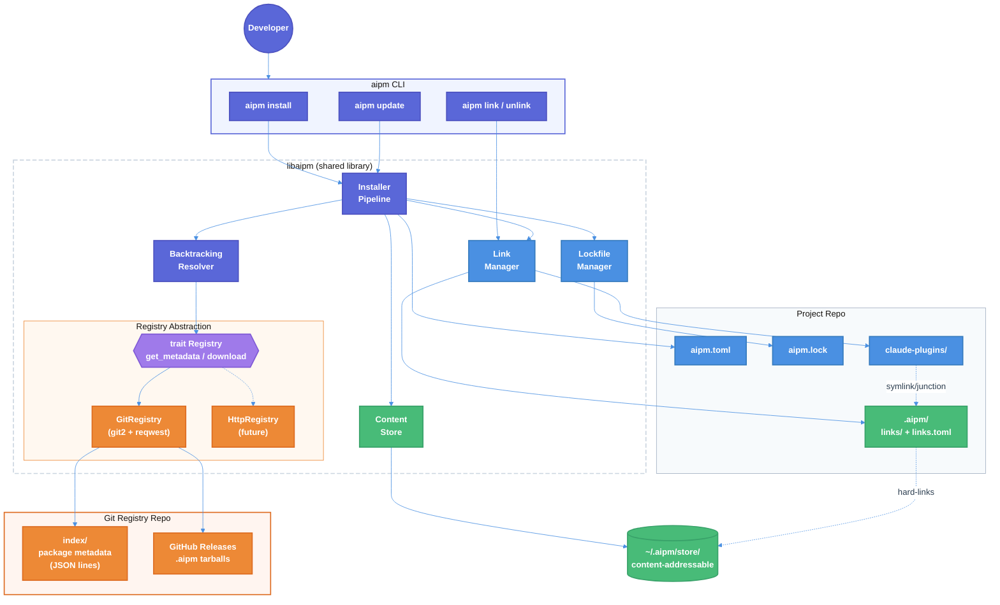

# AIPM Install, Update, Link, and Lockfile — Technical Design Document

| Document Metadata      | Details                                     |
| ---------------------- | ------------------------------------------- |
| Author(s)              | Sean Larkin                                 |
| Status                 | Draft (WIP)                                 |
| Team / Owner           | AI Dev Tooling                              |
| Created / Last Updated | 2026-03-26                                  |

## 1. Executive Summary

This spec defines the implementation of AIPM's core package management pipeline: `aipm install`, `aipm update`, `aipm link`/`aipm unlink`, and deterministic lockfile generation (`aipm.lock`). The registry backend is a **git-first** model — a central git repository serves as the package index (Cargo-style), with tarballs hosted as GitHub Release assets. A `trait Registry` abstraction enables future pivot to an HTTP API backend without changing any consumer code. The implementation adds ~6 new modules to `libaipm` (resolver, lockfile, store, installer, linker, registry) covering 83 BDD scenarios (77 P0 + 6 P1). The bottom-up build order — store → lockfile → registry → resolver → linker → installer → CLI — ensures each layer is independently testable.

## 2. Context and Motivation

### 2.1 Current State

The AIPM codebase has ~7,500 lines of Rust across 33 source files implementing manifest parsing, validation, workspace initialization, and migration ([research ref](../research/docs/2026-03-26-install-update-link-lockfile-implementation.md)). The `aipm` consumer binary has `init` and `migrate` commands. The `aipm-pack` author binary has `init` only.

**What exists:**
- Full `aipm.toml` manifest parsing with `DependencySpec`, `DetailedDependency`, workspace protocol, catalogs, overrides, features ([`manifest/types.rs`](../crates/libaipm/src/manifest/types.rs))
- Semver `Version` and `Requirement` wrappers with `select_best()` for highest-version selection ([`version.rs`](../crates/libaipm/src/version.rs))
- Filesystem abstraction trait `Fs` with 5 methods — `exists`, `create_dir_all`, `write_file`, `read_to_string`, `read_dir` ([`fs.rs`](../crates/libaipm/src/fs.rs))
- Workspace dependencies declared but unused: `sha2`, `flate2`, `tar`, `junction`, `reqwest`
- 83 BDD scenarios in 6 feature files specifying exact behavioral requirements

**What's missing (0 lines each):**
- Dependency resolver (backtracking solver)
- Lockfile manager (`aipm.lock` read/write)
- Content-addressable store (SHA-512 hashing, hard-linking)
- Package installer (fetch → store → link pipeline)
- Link manager (symlinks, junctions, gitignore)
- Registry client (package metadata + download)

### 2.2 The Problem

| Priority | Problem | Impact |
|----------|---------|--------|
| **P0** | Cannot install packages from any source | The core value proposition of a package manager is non-functional |
| **P0** | No lockfile means non-deterministic builds | CI/CD cannot guarantee reproducible installs |
| **P0** | No dependency resolution | Transitive dependencies, version conflicts, and unification are unsupported |
| **P0** | No local dev override (link) | Plugin developers cannot iterate without publishing |
| **P0** | No registry exists | No way to share packages between repos or teams |

## 3. Goals and Non-Goals

### 3.1 Functional Goals

- [ ] `aipm install [pkg[@version]]` — install all manifest deps or add a specific package
- [ ] `aipm install --locked` — CI mode, fail on lockfile-manifest drift
- [ ] `aipm update [pkg]` — re-resolve to latest compatible versions
- [ ] `aipm link <path>` — override a registry dep with a local directory
- [ ] `aipm unlink <pkg>` — restore registry version
- [ ] `aipm list --linked` — show active link overrides
- [ ] Deterministic `aipm.lock` with exact versions + SHA-512 integrity hashes
- [ ] Content-addressable global store at `~/.aipm/store/` with hard-linked working copies
- [ ] Backtracking dependency resolver with version unification (Cargo model)
- [ ] Dependency overrides (`[overrides]`) — global and path-scoped
- [ ] Optional features system (`[features]`, `dep:`, additive unification)
- [ ] Git-based registry with `trait Registry` for backend pivotability
- [ ] Symlinks on macOS/Linux, directory junctions on Windows
- [ ] Automatic gitignore management for registry-installed packages
- [ ] Cross-volume hard link fallback to copy with warning

### 3.2 Non-Goals (Out of Scope)

- [ ] We will NOT implement `aipm-pack publish` / `aipm-pack pack` in this spec (separate spec)
- [ ] We will NOT build an HTTP API registry service (git-first, trait enables future pivot)
- [ ] We will NOT implement `aipm audit`, `aipm doctor`, `aipm search`, `aipm vendor`, `aipm patch`
- [ ] We will NOT implement lifecycle script execution or side-effects cache (4 BDD scenarios deferred)
- [ ] We will NOT implement workspace filtering (`--filter`) or monorepo orchestration
- [ ] We will NOT implement offline mode (`--offline`) in this phase

## 4. Proposed Solution (High-Level Design)

### 4.1 System Architecture Diagram



### 4.2 Architectural Pattern

**Trait-based registry abstraction** — the core design decision enabling registry pivotability:

```rust
/// Abstraction over package registry backends.
/// Implement this trait for git-based, HTTP API, or local registries.
pub trait Registry: Send + Sync {
    /// Get all available versions and metadata for a package.
    fn get_metadata(&self, name: &str) -> Result<PackageMetadata, RegistryError>;

    /// Download the .aipm tarball for a specific version.
    fn download(&self, name: &str, version: &Version) -> Result<Vec<u8>, RegistryError>;
}
```

The initial implementation is `GitRegistry` (git2 for index, reqwest/blocking for tarball downloads). A future `HttpRegistry` implements the same trait against an API service. The resolver, installer, and lockfile manager are generic over `dyn Registry` — swapping backends is a one-line config change.

### 4.3 Key Components

| Component | Responsibility | Technology | Justification |
|-----------|---------------|------------|---------------|
| **Content Store** | SHA-512 hashing, global store, hard-linking, cross-volume fallback | `sha2`, `std::fs::hard_link` | pnpm-proven model; 70%+ disk savings ([ref](../research/docs/2026-03-09-pnpm-core-principles.md)) |
| **Lockfile Manager** | Read/write `aipm.lock`, minimal reconciliation, drift detection | `toml` + `serde` | Cargo-model determinism ([ref](../research/docs/2026-03-09-cargo-core-principles.md)) |
| **Registry (trait)** | Abstract package source — metadata + download | `trait Registry` | Enables git-first with future HTTP API pivot |
| **Git Registry** | Git-based index + GitHub Release tarballs | `git2`, `reqwest` (blocking) | Zero-infrastructure startup; works with any git host |
| **Resolver** | Backtracking constraint solver with version unification | Custom (Cargo-inspired) | Tailored to AIPM's override/feature/workspace semantics |
| **Linker** | Symlinks/junctions, hard-links, gitignore management, link state | `junction` (Windows), `std::os::unix::fs` | Cross-platform Claude Code discovery ([ref](../research/docs/2026-03-09-pnpm-core-principles.md)) |
| **Installer** | Orchestrate resolve → fetch → store → link → lockfile pipeline | All above | End-to-end command handler |
| **Manifest Editor** | Comment-preserving `aipm.toml` modification | `toml_edit` | `aipm install <pkg>` must add deps without destroying formatting |

## 5. Detailed Design

### 5.1 Git-Based Registry Model

#### 5.1.1 Index Repository Layout

The registry is a git repository containing package metadata as JSON-lines files, organized by a 2-character prefix sharding scheme (inspired by Cargo's crate index):

```
aipm-registry/
  config.json               # registry metadata
  1/                        # 1-char package names
    a                       # (unlikely but supported)
  2/                        # 2-char package names
    ab
  3/                        # 3-char package names
    a/
      abc
  co/                       # 4+ char: first 2 chars / next 2 chars
    de/
      code-review           # JSON lines file
  @c/                       # scoped: @scope first 2 / scope next 2
    om/
      @company/
        review-plugin       # JSON lines file
```

**`config.json`** at the repo root:

```json
{
  "dl": "https://github.com/{org}/aipm-registry/releases/download/{name}-{version}/{name}-{version}.aipm",
  "api": null
}
```

The `dl` field is a URL template for tarball downloads. `{name}` and `{version}` are substituted at download time. The `api` field is `null` for git-only registries; future HTTP registries set this to the API base URL.

#### 5.1.2 Index Entry Format

Each package has one file in the index. Each line is a self-contained JSON object representing one published version:

```json
{"name":"code-review","vers":"1.2.0","deps":[{"name":"lint-skill","req":"^1.0","features":[],"optional":false,"default_features":true}],"cksum":"sha512-abc123def456...","features":{"default":["basic"],"basic":[],"deep":["dep:heavy-analyzer"]},"yanked":false}
```

**Fields:**

| Field | Type | Description |
|-------|------|-------------|
| `name` | string | Package name (including `@scope/` if scoped) |
| `vers` | string | Exact semver version |
| `deps` | array | Dependencies with `name`, `req` (version requirement), `features`, `optional`, `default_features` |
| `cksum` | string | SHA-512 checksum of the `.aipm` tarball (SRI format) |
| `features` | object | Feature flag definitions (`{feature_name: [activations]}`) |
| `yanked` | bool | Whether this version is yanked |

#### 5.1.3 Tarball Storage

Package tarballs (`.aipm` archives) are stored as GitHub Release assets. The release tag follows the convention `{name}-{version}` (e.g., `code-review-1.2.0`). The asset name is `{name}-{version}.aipm`.

**Download flow:**
1. Read the `dl` template from `config.json`
2. Substitute `{name}` and `{version}`
3. `reqwest::blocking::get(url)` to download
4. Verify SHA-512 against the index entry's `cksum`
5. Extract to content-addressable store

#### 5.1.4 Registry Configuration

```toml
# In root aipm.toml or ~/.aipm/config.toml
[registries.default]
index = "https://github.com/org/aipm-registry.git"

[registries.internal]
index = "https://github.com/mycompany/aipm-internal.git"

# Scope routing
[registries.scopes]
"@mycompany" = "internal"
```

Scoped packages (`@mycompany/foo`) are routed to the registry named in `[registries.scopes]`. All other packages go to `default`.

#### 5.1.5 Registry Trait

```rust
/// Package version metadata from the registry index.
#[derive(Debug, Clone, Serialize, Deserialize)]
pub struct VersionEntry {
    pub name: String,
    pub vers: String,
    pub deps: Vec<DepEntry>,
    pub cksum: String,
    pub features: BTreeMap<String, Vec<String>>,
    pub yanked: bool,
}

#[derive(Debug, Clone, Serialize, Deserialize)]
pub struct DepEntry {
    pub name: String,
    pub req: String,
    pub features: Vec<String>,
    pub optional: bool,
    pub default_features: bool,
}

/// All published versions for a package.
#[derive(Debug)]
pub struct PackageMetadata {
    pub name: String,
    pub versions: Vec<VersionEntry>,
}

/// Abstraction over registry backends.
pub trait Registry: Send + Sync {
    /// Fetch metadata for a package (all versions).
    fn get_metadata(&self, name: &str) -> Result<PackageMetadata, RegistryError>;

    /// Download the .aipm tarball for a specific package@version.
    fn download(&self, name: &str, version: &Version) -> Result<Vec<u8>, RegistryError>;
}
```

**`GitRegistry` implementation:**
- Clones (or fetches) the index repo to `~/.aipm/registry-cache/{hash}/` using `git2`
- Reads the appropriate index file for the package name
- Parses each JSON line into a `VersionEntry`
- Downloads tarballs via `reqwest::blocking` from the `dl` template URL

**Future `HttpRegistry` implementation:**
- `GET /api/v1/packages/{name}` for metadata
- `GET /api/v1/packages/{name}/{version}/download` for tarball
- Same `Registry` trait, different transport

### 5.2 Content-Addressable Store

#### 5.2.1 Global Store Layout

```
~/.aipm/
  store/                    # content-addressable file storage
    ab/                     # 2-char prefix of SHA-512 hex
      cd1234567890...       # full SHA-512 hex (remaining chars)
    ef/
      0123456789ab...
  registry-cache/           # cloned index repos
    {hash}/                 # SHA-256 of registry URL
      index/
        ...
  config.toml               # global config (store path, default registry)
```

#### 5.2.2 Store Operations

```rust
pub struct ContentStore {
    store_path: PathBuf,  // ~/.aipm/store/
}

impl ContentStore {
    /// Store a file by its content hash. Returns the hash.
    /// If the file already exists (same hash), this is a no-op.
    pub fn store_file(&self, content: &[u8]) -> Result<String, StoreError>;

    /// Retrieve a file's path by hash. Returns None if not present.
    pub fn get_path(&self, hash: &str) -> Option<PathBuf>;

    /// Check if content exists in the store.
    pub fn has_content(&self, hash: &str) -> bool;

    /// Hard-link a stored file to a target path.
    /// Falls back to copy with a warning if hard-link fails (cross-volume).
    pub fn link_to(&self, hash: &str, target: &Path) -> Result<(), StoreError>;

    /// Store all files from an extracted .aipm archive.
    /// Returns a map of relative_path -> content_hash.
    pub fn store_package(&self, extracted_dir: &Path) -> Result<BTreeMap<PathBuf, String>, StoreError>;
}
```

**SHA-512 hashing:** Each file is hashed individually (not the archive). This enables per-file dedup: if version 1.0.1 changes 1 of 100 files, only 1 new file is stored.

**Cross-volume fallback:** `std::fs::hard_link()` returns `io::ErrorKind::CrossesDevices` (EXDEV) when source and target are on different volumes. On this error, fall back to `std::fs::copy()` and emit a warning via `tracing::warn!`.

**Concurrency:** Use `fs2::FileExt::lock_exclusive()` on a `~/.aipm/store/.lock` file for store-wide operations. Content-addressable writes are inherently idempotent (same hash = same content), so the lock is primarily for non-atomic multi-file operations and lockfile writes.

### 5.3 Lockfile Format (`aipm.lock`)

```toml
# This file is automatically generated by aipm.
# It records the exact dependency tree for deterministic installs.
# See https://github.com/TheLarkInn/aipm for details.

[metadata]
lockfile_version = 1
generated_by = "aipm 0.10.0"

[[package]]
name = "code-review"
version = "1.2.0"
source = "git+https://github.com/org/aipm-registry.git"
checksum = "sha512-abc123def456..."
dependencies = ["lint-skill ^1.0"]

[[package]]
name = "lint-skill"
version = "1.5.0"
source = "git+https://github.com/org/aipm-registry.git"
checksum = "sha512-789ghi012jkl..."
dependencies = []

[[package]]
name = "core-hooks"
version = "0.3.0"
source = "workspace"
checksum = ""
dependencies = []
```

**Source types:**
- `git+{index_url}` — package from a git-based registry
- `http+{api_url}` — package from an HTTP API registry (future)
- `workspace` — workspace member (local, no checksum)
- `path+{absolute_path}` — path dependency (local, no checksum)

#### 5.3.1 Lockfile Types

```rust
#[derive(Debug, Serialize, Deserialize)]
pub struct Lockfile {
    pub metadata: LockfileMetadata,
    #[serde(rename = "package", default)]
    pub packages: Vec<LockedPackage>,
}

#[derive(Debug, Serialize, Deserialize)]
pub struct LockfileMetadata {
    pub lockfile_version: u32,
    pub generated_by: String,
}

#[derive(Debug, Clone, Serialize, Deserialize)]
pub struct LockedPackage {
    pub name: String,
    pub version: String,
    pub source: String,
    pub checksum: String,
    #[serde(default)]
    pub dependencies: Vec<String>,
}
```

#### 5.3.2 Lockfile Behavior (Cargo Model)

| Command | Behavior |
|---------|----------|
| `aipm install` (no lockfile) | Full resolution, create `aipm.lock` |
| `aipm install` (lockfile exists, manifest unchanged) | Install from lockfile, no resolution |
| `aipm install` (lockfile exists, manifest changed) | **Minimal reconciliation**: resolve only added/changed deps, keep existing pins |
| `aipm install --locked` | Fail if lockfile doesn't match manifest. Zero network resolution. |
| `aipm update [pkg]` | Re-resolve to latest compatible. If `pkg` given, only update that dep. |

**Reconciliation algorithm:**
1. Parse current lockfile and current manifest
2. Diff the dependency sets: identify added, removed, and changed deps
3. For removed deps: prune from lockfile (and their exclusive transitive deps)
4. For added/changed deps: resolve only those entries using the registry
5. Existing pinned deps are carried forward untouched (never upgraded)
6. Write new lockfile

### 5.4 Dependency Resolver

#### 5.4.1 Algorithm

Custom backtracking constraint solver (Cargo-inspired, [ref](../research/docs/2026-03-09-cargo-core-principles.md)):

```
fn resolve(root_deps, registry, lockfile_pins) -> Result<Resolution, ConflictError>:
    activated = {}            # name -> (version, activated_by)

    # 1. Apply overrides (forced versions bypass solver)
    apply_overrides(root_manifest.overrides, &mut root_deps)

    # 2. Seed with lockfile pins (for existing deps being carried forward)
    for pin in lockfile_pins:
        activated[pin.name] = pin.version

    # 3. Resolve each unresolved dependency
    queue = root_deps.clone()
    while let Some(dep) = queue.pop():
        if dep.name in activated:
            # Check compatibility with already-activated version
            if dep.req.matches(activated[dep.name]):
                continue  # compatible, unified
            elif different_major(dep.req, activated[dep.name]):
                # Cargo model: cross-major coexistence
                activate_additional_major(dep)
            else:
                # Same-major conflict → backtrack
                backtrack()

        # Try candidates from highest to lowest
        candidates = registry.get_metadata(dep.name)
            .filter(|v| !v.yanked || lockfile_pins.contains(v))
            .filter(|v| dep.req.matches(v))
            .sort_descending()

        for candidate in candidates:
            activated[dep.name] = candidate.version
            # Recursively resolve candidate's dependencies
            queue.extend(candidate.deps)
            if resolve_succeeds():
                break
            else:
                backtrack()

        if no_candidate_found:
            return Err(ConflictError { ... })

    return Resolution { activated }
```

#### 5.4.2 Override Application

Overrides from `[overrides]` are applied **before** resolution:

```toml
[overrides]
"vulnerable-lib" = "^2.0.0"           # global: force all refs to ^2.0
"skill-a>common-util" = "=2.1.0"     # scoped: only under skill-a
"broken-lib" = "aipm:fixed-lib@^1.0" # replacement: swap package entirely
```

- **Global override**: Replace the version requirement everywhere in the graph
- **Scoped override** (`parent>child`): Replace only when the dep is a child of the named parent
- **Replacement** (`aipm:other@version`): Swap the package name entirely

#### 5.4.3 Features System

Features are additive across the dependency graph ([`features.feature`](../tests/features/dependencies/features.feature)):

1. Each package declares features in `[features]` table
2. A `default` feature is enabled unless consumer sets `default-features = false`
3. Features from all consumers are **unioned**: if A enables `json` and B enables `xml`, the package gets both
4. `dep:heavy-analyzer` syntax makes an optional dependency conditional on a feature
5. Feature-conditional components (`[components.feature.advanced-review]`) include additional files when the feature is active

The resolver tracks the feature set for each activated package and re-evaluates when new features are added (features may activate optional deps, requiring additional resolution).

#### 5.4.4 Resolver Types

```rust
/// The output of dependency resolution.
#[derive(Debug)]
pub struct Resolution {
    /// All resolved packages with exact versions.
    pub packages: Vec<ResolvedPackage>,
}

#[derive(Debug, Clone)]
pub struct ResolvedPackage {
    pub name: String,
    pub version: Version,
    pub source: PackageSource,
    pub checksum: String,
    pub dependencies: Vec<String>,
    pub features: BTreeSet<String>,
}

#[derive(Debug, Clone)]
pub enum PackageSource {
    Registry { index_url: String },
    Workspace,
    Path { path: PathBuf },
}
```

### 5.5 Link Manager

#### 5.5.1 Three-Tier Linking

```
~/.aipm/store/ab/cd12...       (content-addressable files)
        │
        │ hard-link (or copy if cross-volume)
        ▼
.aipm/links/code-review/       (assembled package directory)
  ├── aipm.toml
  ├── skills/review/SKILL.md
  └── agents/reviewer.md
        │
        │ symlink (macOS/Linux) or junction (Windows)
        ▼
claude-plugins/code-review/    (Claude Code discovery point)
```

#### 5.5.2 Directory Link Implementation

```rust
/// Create a directory link from source to target.
/// Uses symlinks on Unix, directory junctions on Windows.
pub fn create_directory_link(source: &Path, target: &Path) -> Result<(), LinkError> {
    #[cfg(unix)]
    {
        std::os::unix::fs::symlink(source, target)?;
    }
    #[cfg(windows)]
    {
        junction::create(source, target)?;
    }
    Ok(())
}
```

#### 5.5.3 Gitignore Management

Managed section in `{plugins_dir}/.gitignore`:

```
# Managed by aipm — do not edit between markers
# === aipm managed start ===
code-review
@company/review-plugin
@company/
# === aipm managed end ===
```

**Operations:**
- `add_gitignore_entry(plugins_dir, package_name)` — insert between markers, create file if absent
- `remove_gitignore_entry(plugins_dir, package_name)` — remove from managed section
- Manual entries outside the markers are preserved

**Scoped packages:** For `@company/review-plugin`, add both `@company/review-plugin` and `@company/` (the scope directory).

#### 5.5.4 Link State (`.aipm/links.toml`)

```toml
# Managed by aipm — tracks active dev link overrides
[[link]]
name = "code-review-skill"
path = "/work/code-review-skill"
linked_at = "2026-03-26T14:30:00Z"
```

- `aipm link <path>` adds an entry
- `aipm unlink <pkg>` removes it
- `aipm install --locked` clears all entries and restores registry links
- `aipm list --linked` reads this file

### 5.6 Installer Pipeline

The installer orchestrates the full install/update flow:

```
aipm install @company/code-review@^1.0
  │
  ├─ 1. Load manifest (aipm.toml) and lockfile (aipm.lock, if exists)
  │
  ├─ 2. If --locked: validate lockfile matches manifest, fail on drift
  │
  ├─ 3. If adding a new package: add to manifest via toml_edit
  │
  ├─ 4. Resolve dependencies:
  │     ├─ If lockfile exists and manifest unchanged: use locked versions
  │     ├─ If lockfile exists and manifest changed: minimal reconciliation
  │     └─ If no lockfile: full resolution
  │
  ├─ 5. Fetch: download .aipm tarballs not in global store
  │     └─ registry.download(name, version) → verify checksum → store
  │
  ├─ 6. Store: extract files into global store by content hash
  │     └─ content_store.store_package(extracted_dir)
  │
  ├─ 7. Assemble: create .aipm/links/{pkg}/ with hard-links from store
  │     └─ content_store.link_to(hash, target) for each file
  │
  ├─ 8. Link into plugins dir: create directory link + update .gitignore
  │     └─ linker.link_package(pkg_name, source, plugins_dir)
  │
  ├─ 9. If --locked: remove all dev link overrides (warn per override)
  │
  └─ 10. Write lockfile: aipm.lock with exact versions + checksums
```

### 5.7 CLI Commands

#### `aipm install [pkg[@version]] [--locked]`

```rust
#[derive(clap::Args)]
pub struct InstallArgs {
    /// Package to install (e.g., "code-review", "@org/tool@^1.0")
    pub package: Option<String>,

    /// CI mode: fail if lockfile doesn't match manifest
    #[arg(long)]
    pub locked: bool,

    /// Use a specific registry
    #[arg(long)]
    pub registry: Option<String>,
}
```

#### `aipm update [pkg]`

```rust
#[derive(clap::Args)]
pub struct UpdateArgs {
    /// Package to update (omit to update all)
    pub package: Option<String>,
}
```

#### `aipm link <path>`

```rust
#[derive(clap::Args)]
pub struct LinkArgs {
    /// Path to local package directory
    pub path: PathBuf,
}
```

#### `aipm unlink <pkg>`

```rust
#[derive(clap::Args)]
pub struct UnlinkArgs {
    /// Package name to unlink
    pub package: String,
}
```

### 5.8 Filesystem Trait Extensions

The existing `Fs` trait ([`fs.rs`](../crates/libaipm/src/fs.rs)) needs additional methods for install/link operations:

```rust
pub trait Fs: Send + Sync {
    // ... existing 5 methods ...

    /// Remove a file.
    fn remove_file(&self, path: &Path) -> std::io::Result<()>;

    /// Remove a directory and all contents.
    fn remove_dir_all(&self, path: &Path) -> std::io::Result<()>;

    /// Create a hard link from source to target.
    fn hard_link(&self, source: &Path, target: &Path) -> std::io::Result<()>;

    /// Copy a file from source to target.
    fn copy_file(&self, source: &Path, target: &Path) -> std::io::Result<()>;

    /// Create a symlink (Unix) or directory junction (Windows).
    fn symlink_dir(&self, source: &Path, target: &Path) -> std::io::Result<()>;

    /// Read a symlink target.
    fn read_link(&self, path: &Path) -> std::io::Result<PathBuf>;

    /// Check if a path is a symlink or junction.
    fn is_symlink(&self, path: &Path) -> bool;

    /// Atomically write a file (write to temp, then rename).
    fn atomic_write(&self, path: &Path, content: &[u8]) -> std::io::Result<()>;
}
```

### 5.9 New Dependencies

| Crate | Version | Purpose | Added To |
|-------|---------|---------|----------|
| `git2` | 0.19 | libgit2 bindings for cloning/fetching index repo | `libaipm` |
| `reqwest` | 0.12 (+`blocking`, `json`, `rustls-tls`) | HTTP downloads for tarballs | `libaipm` |
| `toml_edit` | 0.22 | Comment-preserving manifest editing | `libaipm` |
| `fs2` | 0.4 | Advisory file locking for concurrent store access | `libaipm` |

`reqwest` moves from `aipm-pack`-only to `libaipm` (shared library) since both consumer and author need HTTP. The `blocking` feature avoids needing an async runtime.

## 6. Alternatives Considered

| Decision | Selected | Alternative(s) | Rationale |
|----------|----------|----------------|-----------|
| **Registry backend** | Git repo + GitHub Releases | HTTP API service, Local-only, Hybrid | Git-first: zero infrastructure, any git host works. Trait abstraction enables HTTP pivot later. |
| **Git access** | `git2` crate (libgit2) | Shell out to `git` CLI, Pure HTTP (sparse) | In-process, no external dependency. CLI approach requires git on PATH. |
| **HTTP client** | `reqwest` with `blocking` feature | `ureq` (pure sync), `reqwest` + `tokio` | Blocking matches sync codebase. No async runtime complexity. `reqwest` is battle-tested. |
| **Tarball storage** | GitHub Releases | Git LFS, Separate HTTP file server | Releases: zero infrastructure, works with standard git hosts. LFS has bandwidth limits. Separate server adds ops burden. |
| **Resolver** | Custom backtracking solver | `pubgrub` crate, Simple greedy | Custom: full control over AIPM-specific semantics (overrides, features, workspace protocol, AI component types). |
| **TOML editing** | `toml_edit` | Round-trip serde, Append-only | `toml_edit` preserves comments and formatting. Industry standard (cargo-edit, taplo). |
| **Cross-volume fallback** | Copy with warning | Error out, Project-local store | Copy is transparent to users. Warning encourages fixing the config. |
| **Concurrent access** | `fs2` file locking | No locking, Process-level lock | CAS writes are idempotent but lockfile writes need coordination. `fs2` is Cargo's approach. |
| **Link state** | `.aipm/links.toml` | Infer from symlinks, Both | Dedicated file: instant `list --linked`, explicit state, no readlink ambiguity. |

## 7. Cross-Cutting Concerns

### 7.1 Security and Privacy

- **Integrity:** SHA-512 checksums on every tarball. Verified before extraction. Lockfile records hashes.
- **Supply chain:** Yanked versions excluded from new resolutions. Lockfile pins honored even for yanked versions.
- **No credential leakage:** Registry index is public git. Tarballs are public GitHub Release assets. No auth tokens needed for reads in the initial model.
- **Lifecycle scripts:** Blocked by default. `[install].allowed_build_scripts` allowlist required. (Execution deferred to future spec; blocking is in scope.)
- **Binary separation:** `aipm` (consumer) has no publish capability. Only `aipm-pack` can push to the registry.

### 7.2 Observability

- **Structured logging:** `tracing` for all operations. `--verbose` flag enables debug-level output.
- **Progress reporting:** Fetch and extraction operations log progress. (Full progress bars with `indicatif` deferred.)
- **Lockfile diff:** TOML format enables meaningful `git diff` for dependency changes.
- **Error reporting:** Resolver conflicts produce detailed reports naming the conflicting package and both incompatible requirements.

### 7.3 Performance

- **Content dedup:** Per-file SHA-512 hashing means unchanged files across versions are stored once. Hard links are metadata-only operations.
- **Lockfile-first install:** When lockfile matches manifest, no resolution needed — direct fetch + link.
- **Parallel extraction:** `rayon` for extracting/linking multiple packages concurrently.
- **Index caching:** Git registry index is cloned once, then `git fetch` for updates. Index files are small (JSON lines).

## 8. Migration, Rollout, and Testing

### 8.1 Implementation Phases

- [ ] **Phase 1: Content Store + Hash Utilities** — `store/` module. Store files by SHA-512, retrieve, verify. Hard-link with cross-volume fallback. Unit tests with tempdir. `fs2` locking.
- [ ] **Phase 2: Lockfile Read/Write** — `lockfile/` module. Parse/emit `aipm.lock` TOML. Lockfile types with `Serialize`/`Deserialize`. Reconciliation logic (diff manifest vs lockfile). Unit tests.
- [ ] **Phase 3: Registry Trait + Git Backend** — `registry/` module. `trait Registry` definition. `GitRegistry` with `git2` for index cloning/fetching, `reqwest/blocking` for tarball downloads. Index file parsing (JSON lines). Integration tests with a test git repo.
- [ ] **Phase 4: Dependency Resolver** — `resolver/` module. Backtracking constraint solver. Version unification within major. Cross-major coexistence. Override application. Features system (additive unification, optional deps). Uses `Registry` trait + `Version` utilities. BDD scenarios from `resolution.feature` and `features.feature`.
- [ ] **Phase 5: Linker + Gitignore** — `linker/` module. Symlink/junction creation. Hard-link assembly from store to `.aipm/links/`. Gitignore managed section. Link state tracking (`.aipm/links.toml`). Fs trait extensions. BDD scenarios from `link.feature` and `local-and-registry.feature`.
- [ ] **Phase 6: Installer Pipeline + CLI** — `installer/` module. Orchestrates resolve → fetch → store → link → lockfile. CLI commands: `install`, `update`. Manifest editing via `toml_edit`. BDD scenarios from `install.feature` and `lockfile.feature`.
- [ ] **Phase 7: Link/Unlink CLI** — Wire up `aipm link`, `aipm unlink`, `aipm list --linked` commands. Link state management. `--locked` override removal.

### 8.2 Test Plan

**BDD Tests (83 scenarios):**

| Feature File | Scenarios | Phase |
|-------------|-----------|-------|
| `dependencies/resolution.feature` | 13 (P0) | Phase 4 |
| `dependencies/features.feature` | 6 (P1) | Phase 4 |
| `dependencies/lockfile.feature` | 12 (P0) | Phase 6 |
| `registry/install.feature` | 23 (P0) | Phase 6 |
| `registry/link.feature` | 10 (P0) | Phase 7 |
| `registry/local-and-registry.feature` | 19 (P0) | Phase 5–6 |

**Deferred BDD scenarios (4):** Side-effects cache scenarios from `install.feature` (lifecycle script execution/caching) — blocked until lifecycle script spec.

**Unit tests:** Each module has isolated unit tests using mock `Fs` and mock `Registry` implementations.

**Integration tests:** End-to-end tests in `crates/aipm/tests/` using `assert_cmd` + `tempfile`, similar to existing `init_e2e.rs` and `migrate_e2e.rs`.

**Coverage gate:** 89% branch coverage required (matches existing CI gate in `CLAUDE.md`).

### 8.3 Module File Structure

```
crates/libaipm/src/
  lib.rs                      # add: pub mod store, lockfile, registry, resolver, linker, installer
  store/
    mod.rs                    # ContentStore public API
    hash.rs                   # SHA-512 hashing utilities
    layout.rs                 # Store directory layout (2-char prefix)
    error.rs                  # StoreError
  lockfile/
    mod.rs                    # Lockfile public API: read, write, validate
    types.rs                  # Lockfile, LockfileMetadata, LockedPackage
    reconcile.rs              # Diff manifest vs lockfile, minimal reconciliation
    error.rs                  # LockfileError
  registry/
    mod.rs                    # trait Registry + PackageMetadata, VersionEntry types
    git.rs                    # GitRegistry implementation (git2 + reqwest)
    config.rs                 # Registry configuration parsing
    error.rs                  # RegistryError
  resolver/
    mod.rs                    # resolve() public API
    graph.rs                  # Dependency graph construction
    solver.rs                 # Backtracking solver core loop
    features.rs               # Feature unification and optional dep activation
    overrides.rs              # Override application (global, scoped, replacement)
    error.rs                  # ConflictError with detailed reporting
  linker/
    mod.rs                    # Linker public API: link_package, unlink_package
    directory_link.rs         # Symlink (Unix) / junction (Windows) helpers
    hard_link.rs              # Hard-link from store to .aipm/links/
    gitignore.rs              # Managed gitignore section read/write
    link_state.rs             # .aipm/links.toml management
    error.rs                  # LinkError
  installer/
    mod.rs                    # install(), update() public API
    pipeline.rs               # Orchestration: resolve → fetch → store → link → lockfile
    manifest_editor.rs        # toml_edit-based manifest modification
    error.rs                  # InstallerError
```

## 9. Open Questions / Unresolved Issues

All major questions have been resolved through the design prompting process. Remaining items:

- [ ] **Git host compatibility**: The `dl` URL template assumes GitHub Releases. GitLab and Bitbucket have different release asset URL patterns. Should the template be configurable per-registry, or should we add host-specific URL generators?
- [ ] **Index update frequency**: How often should `git fetch` be called on the index cache? On every `aipm install`, or with a staleness check (e.g., fetch if >5 minutes old)?
- [ ] **Large index performance**: For registries with thousands of packages, will the full git clone approach scale? Cargo moved to sparse protocol for this reason. At what scale do we add sparse HTTP index support?
- [ ] **Workspace member resolution**: When a workspace member declares `workspace = "^"`, the resolver needs to resolve this to the actual version of the sibling package. The exact algorithm for finding workspace members (glob expansion of `[workspace].members`) needs detailed design during Phase 4.
