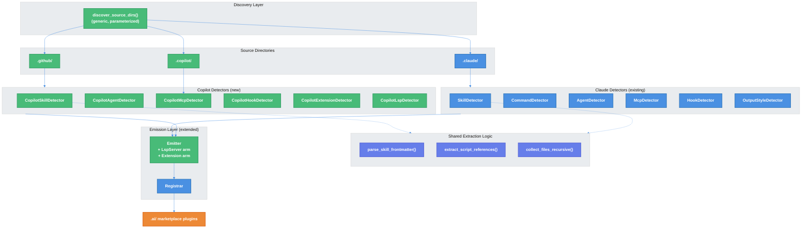

# Copilot CLI Migrate Adapter — Technical Design Document

| Document Metadata      | Details                          |
| ---------------------- | -------------------------------- |
| Author(s)              | Sean Larkin                      |
| Status                 | Draft (WIP)                      |
| Team / Owner           | AIPM Core                        |
| Created / Last Updated | 2026-03-28 / 2026-03-28         |

## 1. Executive Summary

AIPM's `aipm migrate` command currently only supports migrating Claude Code configurations (`.claude/`) into `.ai/` marketplace plugins. This RFC proposes adding a **Copilot CLI adapter** so that projects using GitHub Copilot CLI can also migrate their skills, agents, MCP servers, hooks, and extensions into the unified `.ai/` plugin format. The implementation adds 6 new Copilot-specific detectors, refactors discovery into a generic parameterized function, and removes the source-type gating so all detector sets run automatically. This enables AIPM to serve as a true cross-tool package manager — any project with Copilot CLI customizations can convert them to portable `.ai/` plugins with a single command.

**Research basis**: [research/docs/2026-03-28-copilot-cli-migrate-adapter.md](../research/docs/2026-03-28-copilot-cli-migrate-adapter.md), [research/docs/2026-03-28-copilot-cli-source-code-analysis.md](../research/docs/2026-03-28-copilot-cli-source-code-analysis.md)

---

## 2. Context and Motivation

### 2.1 Current State

The migrate pipeline ([`crates/libaipm/src/migrate/mod.rs`](../crates/libaipm/src/migrate/mod.rs)) scans a source directory using a set of detectors, emits plugin directories under `.ai/`, and registers them in `marketplace.json`. The pipeline has three layers:

1. **Discovery** — `discover_claude_dirs()` walks the project tree looking for `.claude/` directories ([`discovery.rs`](../crates/libaipm/src/migrate/discovery.rs))
2. **Detection** — `claude_detectors()` returns 6 detectors (Skill, Command, Agent, MCP, Hook, OutputStyle) ([`detector.rs:22-32`](../crates/libaipm/src/migrate/detector.rs#L22-L32))
3. **Emission** — Converts artifacts to plugin directories with `plugin.json` and component files ([`emitter.rs`](../crates/libaipm/src/migrate/emitter.rs))

The source-type dispatch is hard-coded at [`mod.rs:264-267`](../crates/libaipm/src/migrate/mod.rs#L264-L267):

```rust
let detectors = match source {
    ".claude" => detector::claude_detectors(),
    other => return Err(Error::UnsupportedSource(other.to_string())),
};
```

### 2.2 The Problem

- **User Impact**: Copilot CLI users cannot use `aipm migrate` at all. The command rejects any `--source` value other than `.claude`.
- **Business Impact**: AIPM positions itself as a cross-tool package manager. Supporting only Claude Code limits adoption and contradicts the value proposition documented in [research/docs/2026-03-10-microsoft-apm-analysis.md](../research/docs/2026-03-10-microsoft-apm-analysis.md).
- **Technical Gap**: The `Detector` trait, `Artifact` types, and emission pipeline are already tool-agnostic — only the hard-coded dispatch and Claude-specific discovery prevent multi-tool support.

---

## 3. Goals and Non-Goals

### 3.1 Functional Goals

- [ ] `aipm migrate` detects and migrates Copilot CLI skills from `.github/skills/`
- [ ] `aipm migrate` detects and migrates Copilot CLI agents from `.github/agents/` (both `.md` and `.agent.md`, with `.agent.md` precedence dedup)
- [ ] `aipm migrate` detects and migrates Copilot CLI MCP servers from `.copilot/mcp-config.json` and `.mcp.json`
- [ ] `aipm migrate` detects and migrates Copilot CLI hooks from standalone `hooks.json` files, with legacy event name normalization
- [ ] `aipm migrate` detects and migrates Copilot CLI extensions from `.github/extensions/`
- [ ] `aipm migrate` detects and migrates Copilot CLI LSP configs from `lsp.json` / `.github/lsp.json`
- [ ] All detectors (Claude + Copilot) run automatically regardless of `--source` path
- [ ] Recursive discovery finds both `.claude/` and `.github/` directories in one walk
- [ ] New `ArtifactKind::LspServer` and `ArtifactKind::Extension` variants with emitter support
- [ ] Branch coverage >= 89% for all new code

### 3.2 Non-Goals (Out of Scope)

- [ ] **ToolAdaptor for `aipm init`** — Writing Copilot CLI config during `aipm init` is a separate spec
- [ ] **`aipm lint` rules for Copilot** — Lint validation is tracked separately in [research/tickets/2026-03-28-110-aipm-lint.md](../research/tickets/2026-03-28-110-aipm-lint.md)
- [ ] **MCP transport normalization** — `"local"` and `"stdio"` are both valid; pass through as-is
- [ ] **ArtifactMetadata schema expansion** — Extra Copilot fields stored in `raw_content`, no new struct fields
- [ ] **Copilot Extensions system prompt injection** — Extensions are child processes; we detect and migrate config files only, not runtime behavior
- [ ] **`outputStyles` for Copilot** — Undocumented and unclear if functional; deferred

---

## 4. Proposed Solution (High-Level Design)

### 4.1 System Architecture Diagram



### 4.2 Architectural Pattern

**Strategy Pattern with Factory Dispatch.** Each source type provides a factory function returning a `Vec<Box<dyn Detector>>`. The orchestrator runs all detector sets against the appropriate source directories. This mirrors the existing `claude_detectors()` pattern documented in [research/docs/2026-03-28-copilot-cli-migrate-adapter.md, Section 7](../research/docs/2026-03-28-copilot-cli-migrate-adapter.md).

**Key architectural decision**: The `--source` flag is treated as a plain path, not a tool identifier. All registered detector sets run against the provided path. The dispatch logic no longer gates on directory name — per design review decision #7.

### 4.3 Key Components

| Component | Responsibility | New/Modified | Justification |
|-----------|---------------|-------------|---------------|
| `discover_source_dirs()` | Generic directory discovery | **New** (replaces `discover_claude_dirs`) | Decision #6: parameterized discovery for `.claude/` and `.github/` in one walk |
| `copilot_detectors()` | Factory returning 6 Copilot detectors | **New** | Mirrors `claude_detectors()` pattern |
| `CopilotSkillDetector` | Thin wrapper delegating to shared skill parsing | **New** | Decision #1: shared logic, Copilot-specific wrapper |
| `CopilotAgentDetector` | Scans `.agent.md` and `.md` with dedup | **New** | Decision #7: both extensions, `.agent.md` precedence |
| `CopilotMcpDetector` | Reads `.copilot/mcp-config.json`, `.mcp.json` | **New** | Multiple locations, pass-through transport |
| `CopilotHookDetector` | Reads standalone `hooks.json` with event name normalization | **New** | Decision #8: normalize legacy names |
| `CopilotExtensionDetector` | Scans `.github/extensions/` | **New** | Decision #9: include extensions |
| `CopilotLspDetector` | Reads `lsp.json` / `.github/lsp.json` | **New** | Decision #4: future-proofing |
| `ArtifactKind` enum | Add `LspServer` and `Extension` variants | **Modified** | Required by new detectors |
| `emitter.rs` | Add match arms for new `ArtifactKind` variants | **Modified** | Emit plugin dirs for LSP and Extension artifacts |
| `mod.rs` dispatch | Remove source-name gating, run all detectors | **Modified** | Decision #7: `--source` is just a path |

---

## 5. Detailed Design

### 5.1 Discovery Refactor

**Current**: `discover_claude_dirs()` in [`discovery.rs`](../crates/libaipm/src/migrate/discovery.rs) hard-codes `.claude` as the target directory name.

**Proposed**: Replace with a generic `discover_source_dirs()` that accepts a slice of directory name patterns.

```rust
/// A discovered source directory and its package context.
#[derive(Debug, Clone)]
pub struct DiscoveredSource {
    /// Absolute path to the source directory (e.g., `.claude/` or `.github/`).
    pub source_dir: PathBuf,
    /// Which source type this is (e.g., ".claude", ".github").
    pub source_type: String,
    /// The package name derived from the parent directory.
    pub package_name: Option<String>,
    /// Relative path from project root to the parent of the source dir.
    pub relative_path: PathBuf,
}

/// Walk the project tree and find all source directories matching the given patterns.
pub fn discover_source_dirs(
    project_root: &Path,
    patterns: &[&str],        // e.g., &[".claude", ".github"]
    max_depth: Option<usize>,
) -> Result<Vec<DiscoveredSource>, Error> { ... }
```

The existing `discover_claude_dirs()` becomes a thin wrapper or is deprecated. The `DiscoveredSource` struct gains a `source_type` field so the orchestrator knows which detector set to dispatch.

**Rename note**: The existing `claude_dir` field becomes `source_dir` to be generic. This is a breaking change to the internal API — update all call sites.

### 5.2 Detector Dispatch Refactor

**Current** ([`mod.rs:264-267`](../crates/libaipm/src/migrate/mod.rs#L264-L267)):
```rust
let detectors = match source {
    ".claude" => detector::claude_detectors(),
    other => return Err(Error::UnsupportedSource(other.to_string())),
};
```

**Proposed**: Run all registered detector sets against the source directory. The detectors themselves are responsible for gracefully returning empty results when their target files don't exist (they already do this).

```rust
/// Returns all registered detector sets for a given source type.
fn detectors_for_source(source_type: &str) -> Vec<Box<dyn Detector>> {
    match source_type {
        ".claude" => detector::claude_detectors(),
        ".github" => detector::copilot_detectors(),
        _ => Vec::new(),  // Unknown source type: no detectors, no error
    }
}
```

For the `--source` path mode (explicit path), run **both** detector sets against the provided path — detectors that find no matching files return empty vectors harmlessly.

For recursive mode, the `source_type` from `DiscoveredSource` determines which detectors to use.

**Error message update** ([`mod.rs:172-174`](../crates/libaipm/src/migrate/mod.rs#L172-L174)):
```
"unsupported source type '{0}' — supported sources: .claude, .github"
```

### 5.3 New `ArtifactKind` Variants

Add two new variants to [`ArtifactKind`](../crates/libaipm/src/migrate/mod.rs#L22-L35):

```rust
pub enum ArtifactKind {
    Skill,
    Command,
    Agent,
    McpServer,
    Hook,
    OutputStyle,
    LspServer,    // NEW
    Extension,    // NEW
}
```

Update `to_type_string()`:
```rust
Self::LspServer => "lsp",
Self::Extension => "composite",  // extensions bundle as composite plugins
```

### 5.4 Shared Skill Logic Extraction

Extract common functions from `skill_detector.rs` into a shared module so both `SkillDetector` and `CopilotSkillDetector` can use them:

**New module**: `crates/libaipm/src/migrate/skill_common.rs`

```rust
/// Parse YAML frontmatter from a SKILL.md file.
/// Used by both Claude and Copilot skill detectors.
pub fn parse_skill_frontmatter(content: &str, path: &Path) -> Result<ArtifactMetadata, Error> { ... }

/// Collect all files recursively within a directory.
pub fn collect_files_recursive(dir: &Path, base: &Path, fs: &dyn Fs) -> Result<Vec<PathBuf>, Error> { ... }

/// Extract script references from SKILL.md body content.
/// `variable_prefix` controls which variable to search for
/// (e.g., "${CLAUDE_SKILL_DIR}/" or "${SKILL_DIR}/").
pub fn extract_script_references(content: &str, variable_prefix: &str) -> Vec<PathBuf> { ... }
```

The existing `SkillDetector` calls these with `variable_prefix = "${CLAUDE_SKILL_DIR}/"`. The `CopilotSkillDetector` calls them with `variable_prefix = "${SKILL_DIR}/"` (or both, to be safe).

### 5.5 CopilotSkillDetector

**Module**: `crates/libaipm/src/migrate/copilot_skill_detector.rs`

- **Scan directory**: `<source_dir>/skills/` (where `source_dir` = `.github/`)
- **File pattern**: subdirectories containing `SKILL.md`
- **Behavior**: Identical to `SkillDetector` except uses a broader script variable search
- **Output**: `ArtifactKind::Skill`

Delegates to `skill_common::parse_skill_frontmatter()`, `skill_common::collect_files_recursive()`, and `skill_common::extract_script_references()`.

### 5.6 CopilotAgentDetector

**Module**: `crates/libaipm/src/migrate/copilot_agent_detector.rs`

- **Scan directory**: `<source_dir>/agents/`
- **File pattern**: `*.md` AND `*.agent.md` — per [source code analysis, Section 2](../research/docs/2026-03-28-copilot-cli-source-code-analysis.md): both extensions are accepted
- **Dedup logic**: When both `foo.md` and `foo.agent.md` exist, `.agent.md` takes precedence. Name derivation strips both suffixes: `name.replace(/(\.agent)?\.md$/, "")`
- **Frontmatter parsing**: Extracts `name` and `description` (same as existing `AgentDetector`). All other fields (`tools`, `model`, `target`, `user-invocable`, `mcp-servers`, `github`) preserved in `raw_content`
- **Name derivation**: Strip `.agent.md` or `.md` suffix from filename
- **Output**: `ArtifactKind::Agent`

```rust
pub struct CopilotAgentDetector;

impl Detector for CopilotAgentDetector {
    fn name(&self) -> &'static str { "copilot-agent" }

    fn detect(&self, source_dir: &Path, fs: &dyn Fs) -> Result<Vec<Artifact>, Error> {
        let agents_dir = source_dir.join("agents");
        if !fs.exists(&agents_dir) { return Ok(Vec::new()); }

        let entries = fs.read_dir(&agents_dir)?;
        let mut by_name: HashMap<String, (PathBuf, String)> = HashMap::new();

        for entry in entries {
            if entry.is_dir { continue; }
            if !entry.name.ends_with(".md") { continue; }

            let is_agent_md = entry.name.ends_with(".agent.md");
            let stem = if is_agent_md {
                entry.name.strip_suffix(".agent.md")
            } else {
                entry.name.strip_suffix(".md")
            };
            let Some(name) = stem else { continue };

            // .agent.md takes precedence
            if is_agent_md || !by_name.contains_key(name) {
                by_name.insert(
                    name.to_string(),
                    (agents_dir.join(&entry.name), entry.name.clone()),
                );
            }
        }

        // Build artifacts from deduplicated map
        // ...
    }
}
```

### 5.7 CopilotMcpDetector

**Module**: `crates/libaipm/src/migrate/copilot_mcp_detector.rs`

- **Scan files** (checked in order, first found wins):
  1. `<project_root>/.copilot/mcp-config.json`
  2. `<project_root>/.mcp.json`
- **JSON key**: `mcpServers` (same as Claude)
- **Transport**: Pass through as-is — both `"local"` and `"stdio"` are valid per [source code analysis, Section 3](../research/docs/2026-03-28-copilot-cli-source-code-analysis.md)
- **Project root derivation**: `source_dir.parent()` (same pattern as existing `McpDetector`)
- **Output**: `ArtifactKind::McpServer`
- **Difference from `McpDetector`**: Checks `.copilot/mcp-config.json` first, then falls back to `.mcp.json`. The existing `McpDetector` only checks `.mcp.json`.

**Note**: When both Claude and Copilot detectors run against the same project, `.mcp.json` could be detected twice. The emission layer's name-conflict resolution (rename counter) handles this — or we can skip `.mcp.json` in `CopilotMcpDetector` if the Claude `McpDetector` already found it. Simpler: `CopilotMcpDetector` checks `.copilot/mcp-config.json` only; `.mcp.json` is already handled by the existing `McpDetector`.

### 5.8 CopilotHookDetector

**Module**: `crates/libaipm/src/migrate/copilot_hook_detector.rs`

- **Scan files**:
  1. `<source_dir>/hooks.json` (standalone)
  2. `<source_dir>/hooks/hooks.json` (subdirectory)
- **Format**: JSON object with hook event keys
- **Event name normalization**: Legacy names normalized to canonical names at parse time:

  | Legacy Name | Canonical Name |
  |-------------|---------------|
  | `SessionStart` | `sessionStart` |
  | `SessionEnd` | `sessionEnd` |
  | `UserPromptSubmit` | `userPromptSubmitted` |
  | `PreToolUse` | `preToolUse` |
  | `PostToolUse` | `postToolUse` |
  | `PostToolUseFailure` / `ErrorOccurred` | `errorOccurred` |
  | `Stop` | `agentStop` |
  | `SubagentStop` | `subagentStop` |
  | `PreCompact` | `preCompact` |

  Source: [source code analysis, Section 5](../research/docs/2026-03-28-copilot-cli-source-code-analysis.md)

- **Output**: `ArtifactKind::Hook`
- **Script reference extraction**: Reuse the existing `extract_hook_script_references()` logic from [`hook_detector.rs:63-105`](../crates/libaipm/src/migrate/hook_detector.rs#L63-L105)

### 5.9 CopilotExtensionDetector

**Module**: `crates/libaipm/src/migrate/copilot_extension_detector.rs`

- **Scan directory**: `<source_dir>/extensions/`
- **Discovery**: Each subdirectory is an extension. Read any manifest/config file present.
- **Output**: `ArtifactKind::Extension`
- **Metadata**: Name from directory name, description if a manifest provides one, `raw_content` stores any config files found.

Per [source code analysis, Section 8](../research/docs/2026-03-28-copilot-cli-source-code-analysis.md), extensions are discovered from `.github/extensions/` and run as child processes with statuses like `"running"`, `"disabled"`, `"failed"`, `"starting"`.

### 5.10 CopilotLspDetector

**Module**: `crates/libaipm/src/migrate/copilot_lsp_detector.rs`

- **Scan files**:
  1. `<source_dir>/lsp.json`
  2. `<project_root>/.github/lsp.json`
- **Format**: JSON with LSP server definitions
- **Output**: `ArtifactKind::LspServer`
- **Note**: Schema-only in Copilot v1.0.12 (no runtime support), but implemented for future-proofing per design review decision #4.

### 5.11 Emitter Updates

Add match arms in [`emitter.rs`](../crates/libaipm/src/migrate/emitter.rs) for the new `ArtifactKind` variants. Three dispatch sites need updating plus `plugin.json` generation:

**`emit_plugin()` match** ([`emitter.rs:63-84`](../crates/libaipm/src/migrate/emitter.rs#L63-L84)):
```rust
ArtifactKind::LspServer => {
    emit_lsp_config(artifact, &plugin_dir, fs)?;
},
ArtifactKind::Extension => {
    emit_extension_files(artifact, &plugin_dir, fs)?;
},
```

**`emit_lsp_config()`**: Write `lsp.json` into the plugin directory root. Pass through `raw_content`.

**`emit_extension_files()`**: Copy extension directory contents into the plugin directory under `extensions/<name>/`.

**`plugin.json` generation**: Add `"type": "lsp"` and `"type": "composite"` (for extensions) support.

### 5.12 Module Registration

Add new `pub mod` declarations in [`mod.rs`](../crates/libaipm/src/migrate/mod.rs):

```rust
pub mod copilot_agent_detector;
pub mod copilot_extension_detector;
pub mod copilot_hook_detector;
pub mod copilot_lsp_detector;
pub mod copilot_mcp_detector;
pub mod copilot_skill_detector;
pub mod skill_common;
```

### 5.13 Factory Function

Add to [`detector.rs`](../crates/libaipm/src/migrate/detector.rs):

```rust
/// Returns the default set of detectors for `.github/` (Copilot CLI) source.
pub fn copilot_detectors() -> Vec<Box<dyn Detector>> {
    vec![
        Box::new(super::copilot_skill_detector::CopilotSkillDetector),
        Box::new(super::copilot_agent_detector::CopilotAgentDetector),
        Box::new(super::copilot_mcp_detector::CopilotMcpDetector),
        Box::new(super::copilot_hook_detector::CopilotHookDetector),
        Box::new(super::copilot_extension_detector::CopilotExtensionDetector),
        Box::new(super::copilot_lsp_detector::CopilotLspDetector),
    ]
}
```

---

## 6. Alternatives Considered

| Option | Pros | Cons | Reason for Rejection |
|--------|------|------|---------------------|
| **A: Parameterized detectors** — Make existing detectors configurable (agent extension, MCP transport name) | DRY; fewer files | Bloats clean single-purpose detectors with conditional logic; violates SRP | Each detector is a focused unit struct today. Conditionals would make them harder to test and reason about. |
| **B: Reuse SkillDetector directly** — Put `SkillDetector` in both factory functions | Zero code duplication | Cannot handle script variable name differences; Copilot may diverge further | Agent Skills spec doesn't mandate a variable name. Thin wrapper costs little and future-proofs. |
| **C: Single unified detector set** — One factory that detects everything | Simpler dispatch | Must handle format differences inline; can't skip Claude-only detectors for `.github/` sources | Mixing concerns. OutputStyle has no Copilot equivalent; Commands are Claude-specific. |
| **D: Skip LSP detector** — No runtime support in Copilot v1.0.12 | Less code to write and maintain | If Copilot ships LSP support, we need a follow-up | Owner decided to future-proof (decision #4). Detector is small. |

---

## 7. Cross-Cutting Concerns

### 7.1 Compatibility Matrix

Per [research/docs/2026-03-28-copilot-cli-migrate-adapter.md, Section: Format Compatibility Matrix](../research/docs/2026-03-28-copilot-cli-migrate-adapter.md):

| Feature | Claude Code | Copilot CLI | Adapter Handling |
|---------|------------|-------------|-----------------|
| Skill file (`SKILL.md`) | Identical | Identical | Shared logic via `skill_common` |
| Agent file extension | `.md` | `.md` + `.agent.md` | Copilot detector handles both with dedup |
| MCP transport type | `"stdio"` | `"local"` or `"stdio"` | Pass through as-is |
| MCP config location | `.mcp.json` | `.copilot/mcp-config.json` | Copilot detector checks Copilot-specific path only |
| Hooks source | `settings.json` `hooks` key | standalone `hooks.json` | Separate detector reads standalone files |
| Hook event names | camelCase | mixed legacy + canonical | Normalize to canonical |
| Extensions | N/A | `.github/extensions/` | New `ArtifactKind::Extension` |
| LSP config | N/A | `lsp.json` (schema only) | New `ArtifactKind::LspServer` |

### 7.2 Lint Policy Compliance

Per `CLAUDE.md` rules:
- No `#[allow(...)]` or `.unwrap()` — all new code uses `?`, `if let`, `match`, and `Result` combinators
- No `println!()` — migration output goes through the `Action` enum
- All new detectors follow the existing pattern of returning `Ok(Vec::new())` when target files don't exist

### 7.3 Duplicate Detection

When both `.claude/` and `.github/` exist in the same project, both detector sets run. Potential duplicates:
- `.mcp.json` is read by both `McpDetector` (Claude) and potentially `CopilotMcpDetector`. **Mitigation**: `CopilotMcpDetector` only reads `.copilot/mcp-config.json`, not `.mcp.json`.
- Skills with identical names across `.claude/skills/` and `.github/skills/`. **Mitigation**: Existing rename-counter logic in `emitter::resolve_plugin_name()` handles name conflicts.

---

## 8. Migration, Rollout, and Testing

### 8.1 Implementation Phases

- [ ] **Phase 1: Foundation** — Add `ArtifactKind::LspServer` and `ArtifactKind::Extension` variants, update all match sites in emitter. Extract `skill_common.rs`. Refactor `discover_source_dirs()`.
- [ ] **Phase 2: Detectors** — Implement all 6 Copilot detectors with unit tests.
- [ ] **Phase 3: Integration** — Add `copilot_detectors()` factory. Refactor dispatch to remove source-name gating. Wire up recursive discovery.
- [ ] **Phase 4: Testing & Coverage** — Integration tests, dry-run tests, coverage gate (>= 89% branch).

### 8.2 Test Plan

**Unit Tests** (per detector, following existing patterns with `MockFs`):

| Detector | Test Cases |
|----------|-----------|
| `CopilotSkillDetector` | detect skill, empty dir, no skills dir, shared logic delegation |
| `CopilotAgentDetector` | `.agent.md` only, `.md` only, both with dedup, no frontmatter (filename fallback), malformed frontmatter, `description` required warning |
| `CopilotMcpDetector` | `.copilot/mcp-config.json` found, not found, malformed JSON, empty `mcpServers`, `"local"` transport pass-through |
| `CopilotHookDetector` | standalone `hooks.json`, `hooks/hooks.json`, legacy event name normalization, script reference extraction |
| `CopilotExtensionDetector` | extension dir with subdirs, empty dir, no extensions dir |
| `CopilotLspDetector` | `lsp.json` found, not found, malformed JSON |
| `discover_source_dirs()` | finds both `.claude/` and `.github/`, respects max_depth, excludes `.ai/`, sorted results |

**Integration Tests** (end-to-end migrate flow):
- Mixed project with both `.claude/` and `.github/` directories
- Dry-run report includes Copilot artifacts
- Name conflict resolution between Claude and Copilot artifacts
- Recursive discovery with nested `.github/` directories

**Coverage**: All new code must pass `cargo +nightly llvm-cov` with >= 89% branch coverage per `CLAUDE.md`.

---

## 9. Open Questions / Unresolved Issues

All critical design questions were resolved via interactive review (see [research/docs/2026-03-28-copilot-cli-migrate-adapter.md, Open Questions (Resolved)](../research/docs/2026-03-28-copilot-cli-migrate-adapter.md)). Remaining minor items:

- [ ] **Skill script variable name**: Does Copilot use `${SKILL_DIR}/` or another prefix? The `CopilotSkillDetector` should search for both `${SKILL_DIR}/` and `${CLAUDE_SKILL_DIR}/` until confirmed. Low risk — affects only script reference extraction, not core migration.
- [ ] **Extension manifest format**: The exact structure of extension config files in `.github/extensions/` needs verification against a real Copilot CLI project. The detector should be lenient (read any JSON/YAML files found).
- [ ] **`exclusive` component paths**: The `{ paths, exclusive }` form in plugin manifests is undocumented. `raw_content` passthrough preserves it, but lint rules may need awareness later.
