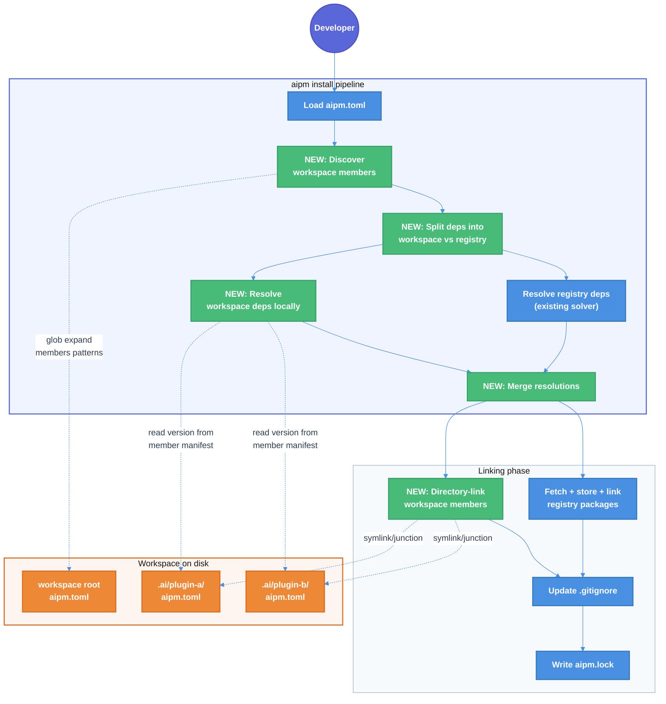

# AIPM Workspace Dependency Linking — Technical Design Document

| Document Metadata      | Details                                     |
| ---------------------- | ------------------------------------------- |
| Author(s)              | selarkin                                    |
| Status                 | Draft (WIP)                                 |
| Team / Owner           | AI Dev Tooling                              |
| Created / Last Updated | 2026-03-28                                  |

## 1. Executive Summary

This spec adds workspace dependency linking to `aipm install`. Today, when a workspace member declares `plugin-b = { workspace = "*" }`, the install pipeline ignores the `workspace` field, treats the dep as `"*"`, and sends it to the registry — where it fails. This spec implements the full lifecycle: discover workspace members via glob expansion, resolve workspace deps to local member versions, create directory links (symlinks/junctions) into the plugins directory, and record them in the lockfile with `source = "workspace"`. The workspace protocol is simplified to a single form: `workspace = "*"` (the `"^"` and `"="` variants are removed). This unblocks intra-workspace plugin composition — the fundamental workflow for monorepo-based AI plugin development.

**Issue:** [TheLarkInn/aipm#129](https://github.com/TheLarkInn/aipm/issues/129)

**Research:** [`research/tickets/2026-03-28-129-workspace-dependencies-linking.md`](../research/tickets/2026-03-28-129-workspace-dependencies-linking.md)

## 2. Context and Motivation

### 2.1 Current State

The install pipeline ([`installer/pipeline.rs`](../crates/libaipm/src/installer/pipeline.rs)) resolves all dependencies uniformly through a registry-backed backtracking solver. The manifest schema already supports workspace references via `DetailedDependency.workspace: Option<String>` ([`manifest/types.rs:96`](../crates/libaipm/src/manifest/types.rs)), and the resolver has a `Source::Workspace` enum variant ([`resolver/mod.rs:64`](../crates/libaipm/src/resolver/mod.rs)). The lockfile encodes workspace sources as `"workspace"` and round-trips correctly ([`pipeline.rs:439`](../crates/libaipm/src/installer/pipeline.rs), [`pipeline.rs:313`](../crates/libaipm/src/installer/pipeline.rs)). The `aipm link` command ([`main.rs:341-384`](../crates/aipm/src/main.rs)) demonstrates the local-directory linking pattern using `directory_link::create()`.

**What exists (ready scaffolding):**
- `DetailedDependency.workspace` field — parsed and validated
- `Source::Workspace` enum variant — declared, never produced by the solver
- Lockfile `"workspace"` encoding — serializes and deserializes correctly
- `directory_link::create()` — links arbitrary local directories via symlink/junction
- `Workspace.members` field — stores glob patterns, never expanded
- BDD scenarios — 4 workspace protocol scenarios in [`orchestration.feature:104-134`](../tests/features/monorepo/orchestration.feature)
- Workspace init template — references `dep = { workspace = "^" }` in comments

**What's missing (0 lines each):**
- Workspace member discovery (glob expansion of `[workspace].members`)
- Workspace root discovery (walk-up from member directory)
- Workspace dep detection in `manifest_to_resolver_deps()`
- Pre-solver resolution of workspace deps to local versions
- Directory linking for workspace packages in the install loop
- Validation that workspace dep names match actual members

### 2.2 The Problem

| Priority | Problem | Impact |
|----------|---------|--------|
| **P0** | Workspace deps (`workspace = "*"`) produce no linking | Plugins cannot reference sibling plugins in the same workspace |
| **P0** | Workspace deps fall through to registry as `"*"` | Install fails or produces incorrect results |
| **P1** | No workspace member discovery | Cannot map dep names to local directories |
| **P1** | Three protocol variants (`^`, `=`, `*`) add complexity with no install-time distinction | All three link locally; the distinction only matters at publish time, which is out of scope |

## 3. Goals and Non-Goals

### 3.1 Functional Goals

- [ ] `workspace = "*"` deps resolve to the local member's directory and version during `aipm install`
- [ ] Workspace deps are linked via directory link (symlink/junction) into the plugins dir — no registry download, no content store
- [ ] Workspace deps are recorded in `aipm.lock` with `source = "workspace"` and the member's current version
- [ ] Workspace member discovery expands `[workspace].members` glob patterns to find member directories
- [ ] Workspace root discovery walks up the filesystem from a member directory to find the `[workspace]` manifest
- [ ] Transitive workspace deps are resolved recursively (if A depends on B and B depends on C, all workspace)
- [ ] Workspace deps are always re-resolved (never carried forward from lockfile) to reflect local changes
- [ ] `aipm link` overrides take priority over workspace resolution
- [ ] Only `workspace = "*"` is accepted — `"^"` and `"="` are rejected with a validation error
- [ ] Workspace deps are added to the managed `.gitignore` section

### 3.2 Non-Goals (Out of Scope)

- [ ] We will NOT implement publish-time replacement of `workspace = "*"` with concrete versions (separate spec, `aipm-pack publish`)
- [ ] We will NOT implement workspace filtering (`--filter`) or monorepo orchestration commands
- [ ] We will NOT implement `[workspace.dependencies]` catalog resolution (where members inherit version ranges from the workspace root) — that is a separate feature
- [ ] We will NOT implement `workspace = true` (boolean syntax) — only `workspace = "*"` (string)
- [ ] We will NOT implement workspace dep version constraint enforcement (e.g., warning if member versions are incompatible)
- [ ] We will NOT change the `aipm update` command to handle workspace deps differently

## 4. Proposed Solution (High-Level Design)

### 4.1 System Architecture Diagram



### 4.2 Architectural Pattern

**Pre-solver extraction** — workspace dependencies are identified and resolved before the registry solver runs. This avoids modifying the solver's core algorithm and keeps workspace logic isolated in the installer pipeline. The two resolution paths (workspace and registry) produce the same `Resolved` struct and are merged into a single `Resolution` for the lockfile and linking phases.

This follows the same pattern as lockfile pins: workspace deps are "pre-activated" entries that the solver does not need to touch. Registry deps flow through the existing backtracking solver unchanged.

### 4.3 Key Components

| Component | Responsibility | Technology | Justification |
|-----------|---------------|------------|---------------|
| **Workspace Discovery** | Expand `[workspace].members` globs to member dirs, build name→path map | `glob` crate | Precise pattern matching, matches Cargo behavior ([ref](../research/docs/2026-03-09-cargo-core-principles.md)) |
| **Workspace Root Finder** | Walk up filesystem from CWD to find manifest with `[workspace]` | `std::path` | Standard approach; Cargo, pnpm, npm all do this ([ref](../research/docs/2026-03-09-pnpm-core-principles.md)) |
| **Workspace Resolver** | Resolve workspace deps to local versions, produce `Resolved` with `Source::Workspace` | Manifest loading | Simple: read member's `aipm.toml`, extract `[package].version` |
| **Dep Splitter** | Partition manifest deps into workspace vs registry before resolution | `DetailedDependency.workspace` check | Clean separation, no solver modification needed |

## 5. Detailed Design

### 5.1 Workspace Protocol Simplification

**Before (three variants):** `workspace = "^"`, `workspace = "="`, `workspace = "*"`

**After (single variant):** `workspace = "*"` only

The three variants only differed in their publish-time replacement behavior (caret range, exact, or bare version). At install time, all three link to the local member identically. Since publish is out of scope, the complexity is unjustified. The validator will reject `"^"` and `"="` with a clear error message pointing to `"*"`.

**Validation change** in [`manifest/validate.rs`](../crates/libaipm/src/manifest/validate.rs):

```rust
// In validate_dependencies():
DependencySpec::Detailed(d) => {
    if let Some(ref ws) = d.workspace {
        if ws != "*" {
            errors.push(Error::InvalidWorkspaceProtocol {
                dependency: name.clone(),
                protocol: ws.clone(),
            });
        }
        continue;
    }
    d.version.as_deref()
},
```

**`is_valid_version_req` change** (line 55-58):

```rust
fn is_valid_version_req(req: &str) -> bool {
    // Only "*" is valid for workspace protocol (used in [workspace.dependencies])
    if req == "*" {
        return true;
    }
    // Remove acceptance of "^" and "=" as standalone symbols
    // ...
}
```

**New error variant** in [`manifest/error.rs`](../crates/libaipm/src/manifest/error.rs):

```rust
InvalidWorkspaceProtocol {
    dependency: String,
    protocol: String,
},
// Display: "invalid workspace protocol '{protocol}' for dependency '{dependency}' — only workspace = \"*\" is supported"
```

**BDD scenario updates** in [`orchestration.feature`](../tests/features/monorepo/orchestration.feature): The three publish-time scenarios (lines 117-134) referencing `"^"`, `"="`, and `"*"` protocols should be updated — the `"^"` and `"="` scenarios become validation error tests, and only `"*"` remains as the valid protocol.

### 5.2 Workspace Root Discovery

A new public function in `libaipm` that walks up the filesystem to find a manifest containing a `[workspace]` section.

**Module:** `crates/libaipm/src/workspace/mod.rs` (new module)

```rust
/// Walk up from `start_dir` looking for an `aipm.toml` with a `[workspace]` section.
///
/// Returns the path to the workspace root directory (parent of the manifest),
/// or `None` if no workspace root is found before reaching the filesystem root.
pub fn find_workspace_root(start_dir: &Path) -> Option<PathBuf> {
    let mut current = start_dir.to_path_buf();
    loop {
        let manifest_path = current.join("aipm.toml");
        if manifest_path.exists() {
            if let Ok(content) = std::fs::read_to_string(&manifest_path) {
                if let Ok(manifest) = toml::from_str::<manifest::types::Manifest>(&content) {
                    if manifest.workspace.is_some() {
                        return Some(current);
                    }
                }
            }
        }
        if !current.pop() {
            return None;
        }
    }
}
```

**Called from:** The CLI's `cmd_install()` in `main.rs`, before constructing `InstallConfig`. If the current directory has no `[workspace]` in its `aipm.toml`, walk up to find the workspace root and use that as the install context.

### 5.3 Workspace Member Discovery

A new function that expands the `[workspace].members` glob patterns and loads each member's manifest to build a name→path map.

**Module:** `crates/libaipm/src/workspace/mod.rs`

**New dependency:** Add `glob = "0.3"` to `[workspace.dependencies]` in the root `Cargo.toml` and to `[dependencies]` in `crates/libaipm/Cargo.toml`.

```rust
/// A discovered workspace member.
#[derive(Debug, Clone)]
pub struct WorkspaceMember {
    /// Package name from the member's `[package].name`.
    pub name: String,
    /// Absolute path to the member directory.
    pub path: PathBuf,
    /// Version from the member's `[package].version`.
    pub version: String,
    /// The member's parsed manifest (for transitive workspace dep detection).
    pub manifest: manifest::types::Manifest,
}

/// Discover all workspace members by expanding glob patterns.
///
/// Reads each member's `aipm.toml` to extract name and version.
/// Returns a map of package_name → WorkspaceMember.
///
/// # Errors
///
/// Returns an error if:
/// - A glob pattern is invalid
/// - A matched directory has no `aipm.toml`
/// - A member manifest has no `[package]` section
/// - Two members declare the same package name
pub fn discover_members(
    workspace_root: &Path,
    member_patterns: &[String],
) -> Result<BTreeMap<String, WorkspaceMember>, Error> {
    let mut members = BTreeMap::new();

    for pattern in member_patterns {
        let full_pattern = workspace_root.join(pattern);
        let pattern_str = full_pattern.to_string_lossy();
        let entries = glob::glob(&pattern_str)
            .map_err(|e| Error::Discovery(format!("invalid glob pattern '{pattern}': {e}")))?;

        for entry in entries {
            let dir = entry
                .map_err(|e| Error::Discovery(format!("glob error: {e}")))?;

            if !dir.is_dir() {
                continue;
            }

            let manifest_path = dir.join("aipm.toml");
            if !manifest_path.exists() {
                continue; // skip non-plugin directories
            }

            let content = std::fs::read_to_string(&manifest_path)
                .map_err(|e| Error::Discovery(format!(
                    "failed to read {}: {e}", manifest_path.display()
                )))?;

            let manifest = manifest::parse_and_validate(&content, Some(&dir))
                .map_err(|e| Error::Discovery(format!(
                    "invalid manifest at {}: {e}", manifest_path.display()
                )))?;

            let package = manifest.package.as_ref()
                .ok_or_else(|| Error::Discovery(format!(
                    "member at {} has no [package] section", dir.display()
                )))?;

            let name = package.name.clone();
            let version = package.version.clone();

            if let Some(existing) = members.get(&name) {
                return Err(Error::Discovery(format!(
                    "duplicate workspace member name '{}': found at {} and {}",
                    name, existing.path.display(), dir.display()
                )));
            }

            members.insert(name.clone(), WorkspaceMember {
                name,
                path: dir,
                version,
                manifest,
            });
        }
    }

    Ok(members)
}
```

### 5.4 Dependency Splitting

Modify `manifest_to_resolver_deps()` in [`installer/pipeline.rs`](../crates/libaipm/src/installer/pipeline.rs) to partition dependencies into workspace and registry sets.

**Current code** (lines 216-243) treats all deps uniformly. **New code** splits them:

```rust
/// Partition manifest dependencies into workspace deps and registry deps.
///
/// Workspace deps have `workspace = "*"` set. Registry deps are everything else.
fn split_dependencies(
    manifest: &manifest::types::Manifest,
) -> (Vec<(String, DependencySpec)>, Vec<resolver::Dependency>) {
    let Some(ref deps) = manifest.dependencies else {
        return (Vec::new(), Vec::new());
    };

    let mut workspace_deps = Vec::new();
    let mut registry_deps = Vec::new();

    for (name, spec) in deps {
        match spec {
            manifest::types::DependencySpec::Detailed(d) if d.workspace.is_some() => {
                workspace_deps.push((name.clone(), spec.clone()));
            },
            _ => {
                // Existing conversion logic for registry deps
                let (req, features, default_features) = match spec {
                    manifest::types::DependencySpec::Simple(v) => (v.clone(), Vec::new(), true),
                    manifest::types::DependencySpec::Detailed(d) => {
                        let version = d.version.clone().unwrap_or_else(|| "*".to_string());
                        let feats = d.features.clone().unwrap_or_default();
                        let df = d.default_features.unwrap_or(true);
                        (version, feats, df)
                    },
                };
                registry_deps.push(resolver::Dependency {
                    name: name.clone(),
                    req,
                    source: "root".to_string(),
                    features,
                    default_features,
                });
            },
        }
    }

    (workspace_deps, registry_deps)
}
```

### 5.5 Workspace Dependency Resolution

Workspace deps bypass the registry solver entirely. For each workspace dep, we read the member's version from its manifest and produce a `Resolved` entry with `Source::Workspace`.

**New function** in `installer/pipeline.rs`:

```rust
/// Resolve workspace dependencies to local member versions.
///
/// For each workspace dep, looks up the member in the discovery map,
/// reads its version, and produces a `Resolved` with `Source::Workspace`.
///
/// Transitive workspace deps are resolved recursively: if member A depends
/// on member B (via workspace = "*"), B is also resolved as a workspace dep.
fn resolve_workspace_deps(
    workspace_dep_names: &[(String, manifest::types::DependencySpec)],
    members: &BTreeMap<String, workspace::WorkspaceMember>,
    link_overrides: &BTreeSet<String>,
) -> Result<Vec<resolver::Resolved>, Error> {
    let mut resolved = Vec::new();
    let mut visited = BTreeSet::new();
    let mut queue: Vec<String> = workspace_dep_names.iter().map(|(n, _)| n.clone()).collect();

    while let Some(name) = queue.pop() {
        if visited.contains(&name) {
            continue;
        }
        visited.insert(name.clone());

        // aipm link overrides skip workspace resolution
        if link_overrides.contains(&name) {
            continue;
        }

        let member = members.get(&name).ok_or_else(|| {
            Error::Resolution(format!(
                "workspace dependency '{name}' not found in workspace members"
            ))
        })?;

        // Collect transitive workspace deps from this member
        if let Some(ref deps) = member.manifest.dependencies {
            for (dep_name, dep_spec) in deps {
                if let manifest::types::DependencySpec::Detailed(d) = dep_spec {
                    if d.workspace.is_some() && !visited.contains(dep_name) {
                        queue.push(dep_name.clone());
                    }
                }
            }
        }

        // Collect non-workspace transitive deps as dependency strings
        let transitive_deps: Vec<String> = member.manifest.dependencies
            .as_ref()
            .map(|deps| {
                deps.iter()
                    .filter_map(|(dep_name, spec)| {
                        let req = match spec {
                            manifest::types::DependencySpec::Simple(v) => v.clone(),
                            manifest::types::DependencySpec::Detailed(d) => {
                                if d.workspace.is_some() {
                                    return Some(format!("{dep_name} *"));
                                }
                                d.version.clone().unwrap_or_else(|| "*".to_string())
                            },
                        };
                        Some(format!("{dep_name} {req}"))
                    })
                    .collect()
            })
            .unwrap_or_default();

        let version = crate::version::Version::parse(&member.version)
            .map_err(|e| Error::Resolution(format!(
                "invalid version '{}' for workspace member '{}': {e}",
                member.version, name
            )))?;

        resolved.push(resolver::Resolved {
            name: name.clone(),
            version,
            source: resolver::Source::Workspace,
            checksum: String::new(), // workspace deps have no checksum
            dependencies: transitive_deps,
            features: BTreeSet::new(),
        });
    }

    Ok(resolved)
}
```

### 5.6 Modified Install Pipeline

The `install()` function in [`pipeline.rs:73`](../crates/libaipm/src/installer/pipeline.rs) gains a new parameter for the workspace context and a modified flow.

**New `InstallConfig` field:**

```rust
pub struct InstallConfig {
    // ... existing fields ...

    /// Path to the workspace root directory (if in a workspace).
    /// Used for workspace member discovery and root walk-up.
    pub workspace_root: Option<PathBuf>,
}
```

**Modified `install()` flow:**

```
aipm install
  |
  +-- 1. Load manifest (existing)
  +-- 2. If adding a package, update manifest (existing)
  +-- 3. Load lockfile (existing)
  +-- 4. If --locked, validate (existing)
  |
  +-- 5. NEW: Discover workspace context
  |     +-- Find workspace root (walk up if needed)
  |     +-- Expand [workspace].members globs
  |     +-- Build name → WorkspaceMember map
  |
  +-- 6. NEW: Split deps into workspace vs registry
  |
  +-- 7. NEW: Load aipm link overrides from .aipm/links.toml
  |     +-- Any dep with an active link override skips workspace resolution
  |
  +-- 8. NEW: Resolve workspace deps (local version lookup + transitive)
  |
  +-- 9. Resolve registry deps (existing solver, unchanged)
  |
  +-- 10. NEW: Merge workspace + registry resolutions
  |
  +-- 11. For each resolved package:
  |     +-- If Source::Workspace:
  |     |     +-- NEW: directory_link::create(member_path, plugins_dir/name)
  |     |     +-- gitignore::add_entry()
  |     +-- If Source::Registry:
  |     |     +-- Fetch tarball (existing)
  |     |     +-- Store contents (existing)
  |     |     +-- link_package() (existing three-tier pipeline)
  |     |     +-- gitignore::add_entry() (existing)
  |
  +-- 12. Handle removals (existing)
  +-- 13. If --locked, clear dev links (existing)
  +-- 14. Write lockfile (existing — already handles Source::Workspace)
```

**Key change in the fetch-store-link loop** (lines 139-180): Add a source check before the registry download:

```rust
for resolved in &resolution.packages {
    let pkg_name = &resolved.name;

    match &resolved.source {
        resolver::Source::Workspace => {
            // Workspace deps: direct directory link, no tarball
            let member = members.get(pkg_name).ok_or_else(|| {
                Error::Resolution(format!("workspace member '{pkg_name}' not found"))
            })?;
            let link_target = config.plugins_dir.join(pkg_name);
            linker::directory_link::create(&member.path, &link_target)
                .map_err(|e| Error::Io(std::io::Error::other(e.to_string())))?;

            linker::gitignore::add_entry(&config.gitignore_path, pkg_name)
                .map_err(|e| Error::Io(std::io::Error::other(e.to_string())))?;

            installed += 1;
        },
        resolver::Source::Registry { .. } => {
            // Existing registry fetch-store-link logic (unchanged)
            // ...
        },
        resolver::Source::Path { .. } => {
            // Path deps — not yet implemented, future spec
        },
    }
}
```

### 5.7 Lockfile Behavior for Workspace Deps

Workspace deps are recorded in the lockfile with `source = "workspace"`, empty checksum, and the member's current version:

```toml
[[package]]
name = "plugin-b"
version = "0.1.0"
source = "workspace"
checksum = ""
dependencies = []
```

**Reconciliation change:** During `lockfile::reconcile::reconcile()`, workspace packages (identified by `source == "workspace"`) are excluded from the carried-forward set. They are always re-resolved to pick up local changes (version bumps, new transitive deps). This means workspace deps are treated as if they are always "changed" during reconciliation.

```rust
// In reconcile.rs — modified carried_forward logic:
let carried_forward: Vec<Package> = lockfile.packages.iter()
    .filter(|pkg| {
        manifest_deps.contains(&pkg.name)
            && pkg.source != "workspace"  // NEW: never carry forward workspace deps
    })
    .cloned()
    .collect();
```

### 5.8 `aipm link` Override Priority

When a package has both a workspace dep reference and an active `aipm link` override (recorded in `.aipm/links.toml`), the link override wins. The workspace resolver checks the link state file before resolving each dep:

1. Load link overrides from `.aipm/links.toml` via `link_state::list()`
2. Build a `BTreeSet<String>` of overridden package names
3. In `resolve_workspace_deps()`, skip any dep whose name is in the override set
4. The existing `aipm link` symlink/junction in the plugins dir is left untouched

This matches the existing behavior where `aipm link` creates a direct symlink that persists across installs (until `aipm unlink` or `--locked` mode).

### 5.9 New Module Structure

```
crates/libaipm/src/
  workspace/            # NEW module
    mod.rs              # find_workspace_root(), discover_members(), WorkspaceMember
    error.rs            # workspace-specific error types
  installer/
    pipeline.rs         # modified: split_dependencies(), resolve_workspace_deps(),
                        #           source-aware install loop
  manifest/
    validate.rs         # modified: reject workspace = "^" and "="
    error.rs            # modified: new InvalidWorkspaceProtocol variant
  lockfile/
    reconcile.rs        # modified: exclude workspace packages from carried_forward
  lib.rs                # modified: add `pub mod workspace;`
```

### 5.10 Error Handling

| Error | When | Message |
|-------|------|---------|
| `InvalidWorkspaceProtocol` | `workspace = "^"` or `workspace = "="` in manifest | `invalid workspace protocol '{proto}' for dependency '{dep}' — only workspace = "*" is supported` |
| `WorkspaceMemberNotFound` | `workspace = "*"` references a name not found in members | `workspace dependency '{name}' not found in workspace members — available members: {list}` |
| `DuplicateMemberName` | Two member directories declare the same `[package].name` | `duplicate workspace member name '{name}': found at {path1} and {path2}` |
| `NoWorkspaceRoot` | Member has `workspace = "*"` deps but no workspace root found | `workspace dependency '{name}' requires a workspace root — no aipm.toml with [workspace] found in parent directories` |
| `InvalidMemberManifest` | Member's `aipm.toml` fails validation | `invalid manifest at {path}: {reason}` |
| `InvalidMemberVersion` | Member's `[package].version` is not valid semver | `invalid version '{version}' for workspace member '{name}': {reason}` |

## 6. Alternatives Considered

| Option | Pros | Cons | Reason for Rejection |
|--------|------|------|---------------------|
| **A: Modify the solver to handle workspace deps** | Single resolution path | Couples workspace logic into the backtracking solver; harder to test; solver needs registry for all deps | Complexity in the solver is the wrong place for local-only resolution |
| **B: Pre-solver extraction (Selected)** | Clean separation; solver unchanged; workspace logic isolated | Two resolution paths to merge | **Selected:** Simpler, testable, no solver changes needed |
| **C: Treat workspace deps as path deps** | Reuses existing `Source::Path` | Conflates two distinct concepts (workspace members vs arbitrary paths); lockfile encoding differs | Workspace and path deps have different semantics (workspace implies membership, root discovery, version from manifest) |
| **D: Keep three workspace protocols** | Matches pnpm exactly | All three are identical at install time; publish is out of scope; extra validation and error surface for no benefit | Simplified to `"*"` only to reduce complexity |
| **E: Use `ignore` crate for member discovery** | Already a dependency | `ignore` is for gitignore-aware walks, not glob expansion; member patterns are explicit globs, not directory walks | `glob` crate is the right tool for expanding explicit patterns |

## 7. Cross-Cutting Concerns

### 7.1 Platform Behavior

Workspace directory links use the same platform-specific primitives as `aipm link`:
- **Unix:** `std::os::unix::fs::symlink()`
- **Windows:** `junction::create()` (directory junctions — no admin privileges required)

Both are already implemented in [`linker/directory_link.rs:80-89`](../crates/libaipm/src/linker/directory_link.rs).

### 7.2 Circular Dependency Detection

If member A depends on member B and B depends on A (both via `workspace = "*"`), the `resolve_workspace_deps()` function will detect this naturally via the `visited` set — B will already be in `visited` when encountered as a transitive dep of A, so it will be skipped. No special cycle detection is needed beyond the existing `visited` guard.

### 7.3 Interaction with `--locked` Mode

In `--locked` mode:
- Workspace deps in the lockfile are validated against the manifest (existing `validate_matches_manifest()` checks dep names)
- Resolution is built from the lockfile directly (`build_resolution_from_lockfile()` already handles `source = "workspace"`)
- The workspace linking step still runs (reading member paths from the discovery map)
- Dev link overrides are cleared (existing behavior)

### 7.4 Observability

Logging via `tracing`:
- `tracing::info!` when discovering workspace members (count and names)
- `tracing::info!` when resolving a workspace dep (name, version, path)
- `tracing::debug!` when skipping a workspace dep due to `aipm link` override
- `tracing::warn!` when a workspace member directory matches a glob but has no `aipm.toml`

## 8. Migration, Rollout, and Testing

### 8.1 Breaking Change: Workspace Protocol Simplification

Existing manifests using `workspace = "^"` or `workspace = "="` will fail validation with a clear error message. Since these never worked (issue #129 — they were parsed but produced no linking), the real-world impact is zero. The error message directs users to change to `workspace = "*"`.

### 8.2 Test Plan

**Unit tests** (in `crates/libaipm/src/workspace/mod.rs`):
- `find_workspace_root` — finds root when starting from a member dir
- `find_workspace_root` — returns `None` at filesystem root
- `discover_members` — expands single glob, multiple globs
- `discover_members` — skips non-directory matches
- `discover_members` — skips directories without `aipm.toml`
- `discover_members` — errors on duplicate member names
- `discover_members` — errors on members without `[package]` section

**Unit tests** (in `crates/libaipm/src/installer/pipeline.rs`):
- `split_dependencies` — correctly partitions workspace vs registry deps
- `resolve_workspace_deps` — resolves direct workspace deps
- `resolve_workspace_deps` — resolves transitive workspace deps
- `resolve_workspace_deps` — skips link-overridden packages
- `resolve_workspace_deps` — errors on unknown workspace member
- `resolve_workspace_deps` — handles circular deps without infinite loop
- Install loop — workspace deps get directory links, not tarball downloads
- Install loop — workspace deps appear in lockfile with `source = "workspace"`

**Unit tests** (in `crates/libaipm/src/manifest/validate.rs`):
- `workspace = "*"` is accepted
- `workspace = "^"` is rejected with `InvalidWorkspaceProtocol`
- `workspace = "="` is rejected with `InvalidWorkspaceProtocol`

**Unit tests** (in `crates/libaipm/src/lockfile/reconcile.rs`):
- Workspace packages are excluded from carried-forward set
- Workspace packages are always listed in `needs_resolution`

**BDD scenarios** (in `tests/features/`):
- Update existing scenarios in `orchestration.feature` to use `workspace = "*"` only
- Add validation error scenarios for rejected protocols

### 8.3 Coverage Gate

All new code must meet the existing 89% branch coverage threshold. Coverage commands from `CLAUDE.md` apply:

```bash
cargo +nightly llvm-cov clean --workspace
cargo +nightly llvm-cov --no-report --workspace --branch
cargo +nightly llvm-cov --no-report --doc
cargo +nightly llvm-cov report --doctests --branch \
  --ignore-filename-regex '(tests/|research/|specs/|wizard_tty\.rs)'
```

## 9. Open Questions / Unresolved Issues

All open questions from the research phase have been resolved:

| Question | Resolution |
|----------|-----------|
| Workspace syntax | `workspace = "*"` only — `"^"` and `"="` rejected |
| Root discovery | Walk up filesystem |
| Transitive deps | Yes, resolved recursively |
| Lockfile reconciliation | Always re-resolve workspace deps |
| `aipm link` priority | Link overrides win |
| Member discovery | `glob` crate for pattern expansion |

**Remaining questions for future specs:**

- [ ] How should `aipm-pack publish` replace `workspace = "*"` with a concrete version? (Deferred to publish spec)
- [ ] Should `[workspace.dependencies]` catalog resolution use the same workspace discovery infrastructure? (Likely yes, but separate feature)
- [ ] Should `aipm update` have special behavior for workspace deps? (Currently: workspace deps are always re-resolved, so `update` is effectively a no-op for them)
