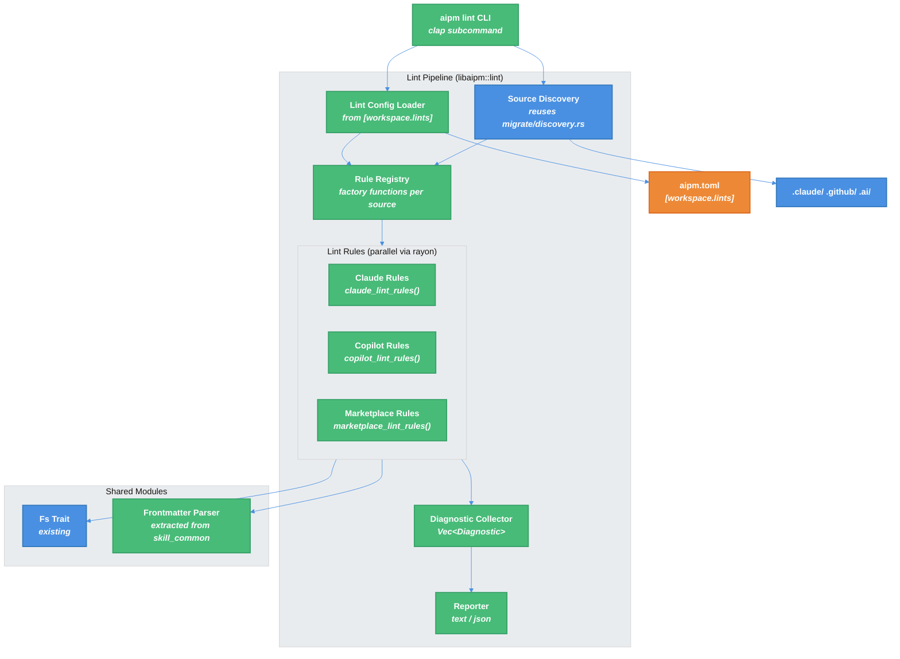

# `aipm lint` Command — Technical Design Document

| Document Metadata      | Details                          |
| ---------------------- | -------------------------------- |
| Author(s)              | Sean Larkin                      |
| Status                 | Draft (WIP)                      |
| Team / Owner           | AIPM Core                        |
| Created / Last Updated | 2026-03-31 / 2026-03-31         |

## 1. Executive Summary

This RFC proposes adding an `aipm lint` command that validates AI plugin configurations across tool-specific source directories (`.claude/`, `.github/`) and the `.ai/` marketplace. The linting system reuses the adapter architecture from `aipm migrate` — each source type gets its own set of lint rules behind a `LintRule` trait, with auto-discovery and optional `--source` filtering. **Twelve rules** ship in v1: the original 7 (frontmatter validation, broken paths, hook event validation, misplaced features, oversized skills) plus 5 cross-tool compatibility rules derived from binary analysis of both Claude Code CLI v2.1.87 and Copilot CLI v1.0.12 (name length/charset limits, description length, shell validation, legacy hook event names). Hook event validation is **tool-aware per adapter** — Claude Code recognizes 27 events (PascalCase), Copilot CLI recognizes 10 events (camelCase). Configuration lives in `[workspace.lints]` in `aipm.toml` (Cargo-style) with per-rule severity overrides and ignore patterns. Output is human-readable by default with `--format=json` for CI. Exit code is non-zero only on errors, not warnings. A shared frontmatter parser is extracted from the existing migrate detectors as part of this work.

**Research basis**:
- [research/docs/2026-03-31-110-aipm-lint-architecture-research.md](../research/docs/2026-03-31-110-aipm-lint-architecture-research.md) — Codebase architecture research
- [research/docs/2026-03-31-cli-binary-frontmatter-hook-analysis.md](../research/docs/2026-03-31-cli-binary-frontmatter-hook-analysis.md) — **Ground-truth binary analysis** of Claude Code and Copilot CLI parsers, hook events, and validation
- [research/tickets/2026-03-28-110-aipm-lint.md](../research/tickets/2026-03-28-110-aipm-lint.md) — Earlier lint research

---

## 2. Context and Motivation

### 2.1 Current State

AIPM manages AI plugins across tool ecosystems. The `aipm migrate` command scans `.claude/` and `.github/` directories using 12 detector implementations behind a `Detector` trait ([`crates/libaipm/src/migrate/detector.rs:9-20`](../crates/libaipm/src/migrate/detector.rs#L9-L20)). The pipeline discovers source directories, runs detectors in parallel via `rayon`, and emits structured plugins into `.ai/`.

Existing validation is scattered across modules:
- **Manifest validation** ([`manifest/validate.rs:76-197`](../crates/libaipm/src/manifest/validate.rs#L76-L197)) — accumulates errors via `Vec<Error>` -> `Error::Multiple`
- **Security verdicts** ([`linker/security.rs:20-26`](../crates/libaipm/src/linker/security.rs#L20-L26)) — binary `ScriptVerdict::Allowed/Blocked`
- **Migration diagnostics** ([`migrate/mod.rs:133-187`](../crates/libaipm/src/migrate/mod.rs#L133-L187)) — `Action::Skipped`/`Action::Renamed` variants
- **Lockfile drift** ([`lockfile/mod.rs:81-120`](../crates/libaipm/src/lockfile/mod.rs#L81-L120)) — `validate_matches_manifest()`

There is no unified linting system, no severity enum, no rule IDs, no diagnostic type, and no configurable rule suppression.

### 2.2 The Problem

- **User Impact**: Plugin authors have no way to validate their plugins before sharing. Missing frontmatter, broken script references, and invalid hook events are only discovered at runtime.
- **Ecosystem Impact**: Without quality gates, the `.ai/` marketplace accumulates inconsistent and broken plugins. Issue #110 identifies specific conventions that should be enforced.
- **Cross-tool Impact**: Plugins migrated from `.claude/`, `.github/`, or `.vscode/` may carry tool-specific quirks. Lint validates the converted output meets marketplace conventions.

### 2.3 BDD Specification

The existing BDD feature file ([`tests/features/guardrails/quality.feature`](../tests/features/guardrails/quality.feature)) specifies lint behavior including rules, severities, publish gating, auto-fix, and quality scoring. This spec implements the "Lint command catches common quality issues" rule group (lines 23-49). Publish gating, `--fix`, and quality scoring are deferred to future specs.

---

## 3. Goals and Non-Goals

### 3.1 Functional Goals

- [ ] `aipm lint` discovers and lints all known source directories (`.claude/`, `.github/`, `.ai/`) automatically
- [ ] `aipm lint --source .claude` filters to a specific source type
- [ ] Lint rules are adapter-based: each source type (`.claude`, `.github`, `.vscode`) has its own rule set via factory functions
- [ ] Hook event validation is tool-aware: Claude adapter validates 26 PascalCase events, Copilot adapter validates 10 camelCase events
- [ ] Twelve rules ship in v1 (see Section 5.3): 7 original + 5 cross-tool compatibility rules from binary analysis
- [ ] Diagnostics include hierarchical rule IDs (`skill/missing-description`, `hook/unknown-event`)
- [ ] Two severity levels: `error` and `warning`
- [ ] Exit code 0 for warnings-only, exit code 1 for any errors
- [ ] `[workspace.lints]` section in `aipm.toml` supports per-rule severity overrides and per-rule ignore patterns
- [ ] `[workspace.lints.ignore]` supports global path-based ignore patterns (glob)
- [ ] Human-readable terminal output by default; `--format=json` for CI/tooling
- [ ] Shared frontmatter parser extracted from migrate detectors, used by both migrate and lint
- [ ] All lint rules accept `&dyn Fs` for testable mock-based testing
- [ ] Branch coverage >= 89% for all new code

### 3.2 Non-Goals (Out of Scope)

- [ ] **`aipm-pack lint`** — Author CLI integration deferred; `aipm lint` only in v1
- [ ] **`--fix` auto-fix mode** — Deferred to v2 (BDD spec lines 61-65)
- [ ] **Publish gate** — `aipm-pack publish` lint enforcement deferred (BDD spec lines 54-58)
- [ ] **Quality score** — Scoring computation deferred (BDD spec lines 67-87)
- [ ] **LSP server** — Issue #110 mentions LSP for VS Code; deferred entirely as a separate effort
- [ ] **Structured error guidance** — Machine-readable error codes ship, but documentation links and fix suggestions deferred
- [ ] **`.vscode/` adapter** — The architecture supports it, but no rules are implemented for `.vscode/` in v1

---

## 4. Proposed Solution (High-Level Design)

### 4.1 System Architecture Diagram



### 4.2 Architectural Pattern

The lint system adopts the same **Strategy + Abstract Factory** pattern as `aipm migrate`:

| Migrate Concept | Lint Equivalent |
|----------------|-----------------|
| `Detector` trait | `LintRule` trait |
| `Artifact` struct | `Diagnostic` struct |
| `ArtifactKind` enum | `RuleId` (hierarchical string) |
| `claude_detectors()` | `claude_lint_rules()` |
| `copilot_detectors()` | `copilot_lint_rules()` |
| `detectors_for_source()` | `rules_for_source()` |
| `rayon::par_iter()` detection | `rayon::par_iter()` rule execution |
| `Error::Multiple` | `Vec<Diagnostic>` accumulation |
| `&dyn Fs` injection | `&dyn Fs` injection (same) |

Additionally, a new `marketplace_lint_rules()` factory provides rules that validate `.ai/` plugins (broken paths, frontmatter in marketplace plugins).

### 4.3 Key Components

| Component | Responsibility | Location | Justification |
|-----------|---------------|----------|---------------|
| `LintRule` trait | Core rule interface | `libaipm::lint::rule` | Mirrors `Detector` trait pattern |
| `Diagnostic` struct | Lint finding with severity, ID, span | `libaipm::lint::diagnostic` | Unified diagnostic type |
| `Severity` enum | Error / Warning | `libaipm::lint::diagnostic` | Two levels per BDD spec |
| `LintConfig` struct | Parsed `[workspace.lints]` | `libaipm::lint::config` | Per-rule overrides + ignore patterns |
| Rule factory functions | Rule set per source type | `libaipm::lint::rules::*` | Adapter pattern for multi-tool |
| `Reporter` trait | Output formatting | `libaipm::lint::reporter` | Text vs JSON output modes |
| Shared frontmatter parser | Extracted from `skill_common` | `libaipm::frontmatter` | Reused by migrate + lint |
| `cmd_lint()` handler | CLI entry point | `crates/aipm/src/main.rs` | Standard command pattern |

---

## 5. Detailed Design

### 5.1 CLI Interface

**Command:** `aipm lint [OPTIONS] [dir]`

| Flag / Arg | Type | Default | Description |
|------------|------|---------|-------------|
| `[dir]` | `Option<PathBuf>` | `.` | Directory to lint |
| `--source` | `Option<String>` | `None` (auto-discover all) | Filter to a specific source type: `.claude`, `.github`, `.ai` |
| `--format` | `Option<String>` | `text` | Output format: `text` or `json` |
| `--max-depth` | `Option<usize>` | `None` | Maximum directory traversal depth |

**Exit codes:**
- `0` — No errors (warnings are acceptable)
- `1` — One or more errors found

**Example usage:**

```bash
# Lint everything in current directory
aipm lint

# Lint only .claude/ source
aipm lint --source .claude

# JSON output for CI
aipm lint --format json

# Lint a specific project
aipm lint /path/to/project
```

**Clap definition** (added to `Commands` enum in `crates/aipm/src/main.rs`):

```rust
/// Lint AI plugin configurations for quality issues
Lint {
    /// Directory to lint
    #[arg(default_value = ".")]
    dir: String,

    /// Filter to a specific source type (.claude, .github, .ai)
    #[arg(long)]
    source: Option<String>,

    /// Output format: text or json
    #[arg(long, default_value = "text")]
    format: String,

    /// Maximum directory traversal depth
    #[arg(long)]
    max_depth: Option<usize>,
},
```

### 5.2 Core Data Types

#### `Diagnostic` struct

```rust
pub struct Diagnostic {
    /// Hierarchical rule ID (e.g., "skill/missing-description")
    pub rule_id: String,
    /// Severity level
    pub severity: Severity,
    /// Human-readable message
    pub message: String,
    /// File path where the issue was found
    pub file_path: PathBuf,
    /// Optional line number (1-based)
    pub line: Option<usize>,
    /// Source type that produced this diagnostic
    pub source_type: String,
}
```

#### `Severity` enum

```rust
#[derive(Clone, Copy, PartialEq, Eq, PartialOrd, Ord)]
pub enum Severity {
    Warning,
    Error,
}
```

#### `LintRule` trait

```rust
pub trait LintRule: Send + Sync {
    /// Unique hierarchical ID (e.g., "skill/missing-description")
    fn id(&self) -> &'static str;

    /// Human-readable rule name
    fn name(&self) -> &'static str;

    /// Default severity when not overridden by config
    fn default_severity(&self) -> Severity;

    /// Run the rule against a source directory
    fn check(
        &self,
        source_dir: &Path,
        fs: &dyn Fs,
    ) -> Result<Vec<Diagnostic>, Error>;
}
```

This mirrors the `Detector` trait shape: each rule is a zero-sized unit struct, takes `source_dir` + `&dyn Fs`, returns a vec of findings.

#### `LintConfig` struct

```rust
pub struct LintConfig {
    /// Global ignore paths (from [workspace.lints.ignore].paths)
    pub ignore_paths: Vec<String>,
    /// Per-rule overrides
    pub rule_overrides: BTreeMap<String, RuleOverride>,
}

pub enum RuleOverride {
    /// Simple level override: "skill/missing-description" = "error"
    Level(Severity),
    /// Detailed override with level and per-rule ignores
    Detailed {
        level: Severity,
        ignore: Vec<String>,
    },
}
```

#### `LintOutcome` struct

```rust
pub struct LintOutcome {
    /// All diagnostics found
    pub diagnostics: Vec<Diagnostic>,
    /// Number of errors
    pub error_count: usize,
    /// Number of warnings
    pub warning_count: usize,
    /// Sources that were scanned
    pub sources_scanned: Vec<String>,
}
```

### 5.3 V1 Rule Set

Twelve rules organized by adapter. Rule definitions are informed by **ground-truth binary analysis** of Claude Code CLI v2.1.87 and Copilot CLI v1.0.12 ([research/docs/2026-03-31-cli-binary-frontmatter-hook-analysis.md](../research/docs/2026-03-31-cli-binary-frontmatter-hook-analysis.md)).

#### Source Rules (`.claude/` and `.github/` adapters)

| Rule ID | Severity | Description | Adapter |
|---------|----------|-------------|---------|
| `source/misplaced-features` | warning | Plugin features (skills, commands, hooks, LSP, output styles) found inside `.claude/` or `.github/` subfolders that should be in the `.ai/` marketplace | claude, copilot |

#### Marketplace Rules (`.ai/` adapter)

| Rule ID | Default Severity | Description | Source |
|---------|-----------------|-------------|--------|
| `skill/missing-name` | warning | SKILL.md missing `name` field in YAML frontmatter | BDD spec |
| `skill/missing-description` | warning | SKILL.md missing `description` field in YAML frontmatter | BDD spec |
| `skill/oversized` | warning | SKILL.md exceeds 15,000 characters (Copilot CLI `SKILL_CHAR_BUDGET`) | Binary analysis |
| `skill/name-too-long` | warning | Skill name exceeds 64 characters (Copilot CLI Zod schema limit) | Binary analysis |
| `skill/name-invalid-chars` | warning | Skill name doesn't match `/^[a-zA-Z0-9][a-zA-Z0-9._\- ]*$/` (Copilot CLI Zod schema) | Binary analysis |
| `skill/description-too-long` | warning | Skill description exceeds 1024 characters (Copilot CLI Zod schema limit) | Binary analysis |
| `skill/invalid-shell` | error | `shell` frontmatter field is not `bash` or `powershell` (Claude Code validated values) | Binary analysis |
| `agent/missing-tools` | warning | Agent markdown missing `tools` frontmatter declaration | BDD spec |
| `hook/unknown-event` | error | Hook config references an event name not valid for the target tool (tool-aware) | Binary analysis |
| `hook/legacy-event-name` | warning | Hook uses PascalCase event name that Copilot normalizes to camelCase | Binary analysis |
| `plugin/broken-paths` | error | Markdown file references in a plugin contain broken `${CLAUDE_SKILL_DIR}/` or other relative paths | Issue #110 |

#### Rule Details

**`source/misplaced-features`** — Scans source directories (`.claude/`, `.github/`) for plugin artifacts (skills, commands, agents, hooks, output styles, MCP, LSP, extensions). If any are found and a `.ai/` marketplace directory exists, reports them as candidates for migration. Supports `[workspace.lints.ignore]` paths to exclude known exceptions.

**`skill/missing-name`** and **`skill/missing-description`** — Uses the shared frontmatter parser to check SKILL.md files in `.ai/<plugin>/skills/`. Reports with file path and line 1 (frontmatter section). Note: Copilot CLI auto-generates a description from the first 3 non-empty body lines if absent, but the auto-generated text is often poor quality — the warning is still valuable.

**`skill/oversized`** — Checks SKILL.md character count against 15,000 characters, which is the Copilot CLI's `SKILL_CHAR_BUDGET` default. This is a concrete, verifiable threshold derived from binary analysis (previous spec used an estimated 5000 tokens ≈ 20000 chars).

**`skill/name-too-long`** — Checks if the `name` frontmatter field exceeds 64 characters. Derived from Copilot CLI's Zod schema validation: `z.string().max(64)`. Claude Code does not enforce a length limit, but names over 64 chars will fail in Copilot.

**`skill/name-invalid-chars`** — Validates the `name` field matches `/^[a-zA-Z0-9][a-zA-Z0-9._\- ]*$/`. Derived from Copilot CLI's Zod schema. Copilot replaces spaces with hyphens post-parse. Claude Code is more permissive.

**`skill/description-too-long`** — Checks if the `description` field exceeds 1024 characters. Derived from Copilot CLI's Zod schema: `z.string().max(1024)`.

**`skill/invalid-shell`** — Checks the `shell` frontmatter field against the validated values `["bash", "powershell"]`. Derived from Claude Code CLI binary analysis: invalid values silently fall back to bash with a warning. This rule surfaces the issue at lint time.

**`agent/missing-tools`** — Parses agent markdown frontmatter in `.ai/<plugin>/agents/`. Checks for presence of `tools` field. Copilot's built-in agents all declare `tools` (e.g., `["*"]`).

**`hook/unknown-event`** — **Tool-aware validation.** Parses `hooks/hooks.json` and validates event keys against the tool-specific event list. The rule checks which tool the hook file belongs to (based on adapter context) and validates against that tool's known events.

**Claude Code valid events (26, PascalCase):**
`PreToolUse`, `PostToolUse`, `PostToolUseFailure`, `Notification`, `SessionStart`, `Stop`, `StopFailure`, `SubagentStart`, `SubagentStop`, `PreCompact`, `PostCompact`, `SessionEnd`, `PermissionRequest`, `Setup`, `TeammateIdle`, `TaskCreated`, `TaskCompleted`, `UserPromptSubmit`, `ToolError`, `Elicitation`, `ElicitationResult`, `ConfigChange`, `InstructionsLoaded`, `WorktreeCreate`, `WorktreeRemove`, `CwdChanged`, `FileChanged`

**Copilot CLI valid events (10, camelCase):**
`sessionStart`, `sessionEnd`, `userPromptSubmitted`, `preToolUse`, `postToolUse`, `errorOccurred`, `agentStop`, `subagentStop`, `subagentStart`, `preCompact`

Event lists are **hard-coded and updated per aipm release**. Source: binary analysis of installed CLI versions.

**`hook/legacy-event-name`** — Warns when PascalCase event names are used that Copilot CLI normalizes to camelCase. This helps plugin authors use the canonical form. Legacy mapping:

| Legacy (PascalCase) | Canonical (camelCase) |
|---------------------|----------------------|
| `SessionStart` | `sessionStart` |
| `SessionEnd` | `sessionEnd` |
| `UserPromptSubmit` | `userPromptSubmitted` |
| `PreToolUse` | `preToolUse` |
| `PostToolUse` | `postToolUse` |
| `PostToolUseFailure` | `errorOccurred` |
| `ErrorOccurred` | `errorOccurred` |
| `Stop` | `agentStop` |
| `SubagentStop` | `subagentStop` |
| `PreCompact` | `preCompact` |

**`plugin/broken-paths`** — Scans all markdown files in `.ai/<plugin>/`. Extracts `${CLAUDE_SKILL_DIR}/` and `${SKILL_DIR}/` references. Resolves them relative to the skill directory and checks existence via `Fs::exists()`. Also validates that `[components]` paths in `aipm.toml` (if present) point to existing files.

### 5.4 Rule Factory Functions

```rust
/// Rules for validating .claude/ source directories
pub fn claude_lint_rules() -> Vec<Box<dyn LintRule>> {
    vec![
        Box::new(MisplacedFeaturesRule { source_type: ".claude" }),
    ]
}

/// Rules for validating .github/ source directories
pub fn copilot_lint_rules() -> Vec<Box<dyn LintRule>> {
    vec![
        Box::new(MisplacedFeaturesRule { source_type: ".github" }),
    ]
}

/// Rules for validating .ai/ marketplace plugins
/// Includes cross-tool compatibility rules derived from binary analysis
pub fn marketplace_lint_rules() -> Vec<Box<dyn LintRule>> {
    vec![
        // Core rules (from BDD spec + issue #110)
        Box::new(SkillMissingNameRule),
        Box::new(SkillMissingDescriptionRule),
        Box::new(SkillOversizedRule),            // 15,000 char threshold (Copilot SKILL_CHAR_BUDGET)
        Box::new(AgentMissingToolsRule),
        Box::new(HookUnknownEventRule),          // Tool-aware: 26 Claude events, 10 Copilot events
        Box::new(BrokenPathsRule),
        // Cross-tool compatibility rules (from binary analysis)
        Box::new(SkillNameTooLongRule),          // Copilot: max 64 chars
        Box::new(SkillNameInvalidCharsRule),     // Copilot: /^[a-zA-Z0-9][a-zA-Z0-9._\- ]*$/
        Box::new(SkillDescriptionTooLongRule),   // Copilot: max 1024 chars
        Box::new(SkillInvalidShellRule),         // Claude Code: ["bash", "powershell"]
        Box::new(HookLegacyEventNameRule),       // Copilot: PascalCase -> camelCase normalization
    ]
}

/// Dispatch: source type -> rule set
pub fn rules_for_source(source: &str) -> Vec<Box<dyn LintRule>> {
    match source {
        ".claude" => claude_lint_rules(),
        ".github" => copilot_lint_rules(),
        ".ai" => marketplace_lint_rules(),
        _ => vec![],
    }
}
```

### 5.5 Lint Pipeline Flow

```
1. CLI: parse args, resolve dir
              |
2. Load LintConfig from aipm.toml [workspace.lints]
              |
3. Discover source dirs (reuse migrate/discovery.rs)
   - Auto-discover: [".claude", ".github"] + always include ".ai"
   - Optional --source filter
              |
4. For each discovered source (parallel via rayon):
   a. rules_for_source(source_type)
   b. Filter rules by config (remove "allow"ed rules)
   c. Apply severity overrides from config
   d. For each rule:
      - Check global ignore paths
      - Check per-rule ignore paths
      - rule.check(source_dir, fs)
      - Collect Vec<Diagnostic>
              |
5. Merge all diagnostics, sort by file path
              |
6. Apply config overrides to diagnostic severities
              |
7. Format output (text or json)
              |
8. Return LintOutcome { diagnostics, error_count, warning_count }
              |
9. Exit code: 1 if error_count > 0, else 0
```

### 5.6 Configuration Schema

The `[workspace.lints]` section in `aipm.toml`:

```toml
[workspace.lints]
# Simple severity override (string value)
"hook/unknown-event" = "error"

# Detailed override with per-rule ignore paths (inline table)
"skill/missing-description" = { level = "warn", ignore = ["examples/**"] }

# Suppress a rule entirely
"skill/oversized" = "allow"

# Global ignore paths (all rules skip these)
[workspace.lints.ignore]
paths = ["vendor/**", ".ai/legacy-*/**"]
```

**Override resolution order:**
1. If rule is `"allow"` in config -> skip entirely
2. If rule has a `level` override -> use that severity
3. Otherwise -> use rule's `default_severity()`

**Ignore path matching:**
1. Global `[workspace.lints.ignore].paths` applies to all rules
2. Per-rule `ignore` field applies only to that rule
3. Paths are glob-matched relative to the workspace root
4. A file matching any ignore pattern is excluded from that rule's checks

**Serde types for parsing:**

```rust
#[derive(Deserialize)]
pub struct WorkspaceLints {
    #[serde(flatten)]
    pub rules: BTreeMap<String, LintRuleValue>,
    pub ignore: Option<LintIgnore>,
}

#[derive(Deserialize)]
#[serde(untagged)]
pub enum LintRuleValue {
    /// "skill/missing-description" = "error"
    Simple(String),
    /// "skill/missing-description" = { level = "warn", ignore = ["..."] }
    Detailed { level: String, ignore: Option<Vec<String>> },
}

#[derive(Deserialize)]
pub struct LintIgnore {
    pub paths: Vec<String>,
}
```

### 5.7 Output Formats

#### Human-readable (default `--format=text`)

Modeled after clippy/rustc output:

```
warning[skill/missing-description]: SKILL.md missing required field: description
  --> .ai/my-plugin/skills/default/SKILL.md:1
  |
  = help: add a "description" field to the YAML frontmatter

error[hook/unknown-event]: unknown hook event: InvalidEvent
  --> .ai/my-plugin/hooks/hooks.json:5
  |
  = help: valid events: PreToolUse, PostToolUse, Notification, ...

warning: 1 warning emitted
error: 1 error emitted
```

Summary line at the end: `"X error(s), Y warning(s) emitted"` or `"no issues found"`.

#### JSON (`--format=json`)

```json
{
  "diagnostics": [
    {
      "rule_id": "skill/missing-description",
      "severity": "warning",
      "message": "SKILL.md missing required field: description",
      "file_path": ".ai/my-plugin/skills/default/SKILL.md",
      "line": 1,
      "source_type": ".ai"
    }
  ],
  "summary": {
    "errors": 1,
    "warnings": 1,
    "sources_scanned": [".claude", ".ai"]
  }
}
```

### 5.8 Shared Frontmatter Parser

Extracted from `migrate/skill_common.rs` into a new module at `libaipm::frontmatter`.

```rust
pub struct Frontmatter {
    /// Raw key-value pairs from the frontmatter block
    pub fields: BTreeMap<String, String>,
    /// Line number where frontmatter starts (the opening ---)
    pub start_line: usize,
    /// Line number where frontmatter ends (the closing ---)
    pub end_line: usize,
    /// The body content after the frontmatter
    pub body: String,
}

/// Parse YAML frontmatter from a markdown string.
/// Returns None if no frontmatter block is found.
pub fn parse(content: &str) -> Option<Frontmatter> { ... }
```

The existing `skill_common::parse_skill_frontmatter()` is refactored to delegate to this shared parser. The migrate detectors continue to work unchanged, but now lint rules can also use `frontmatter::parse()` directly.

### 5.9 Module Structure

```
crates/libaipm/src/
├── frontmatter.rs                    # NEW: shared frontmatter parser
├── lint/
│   ├── mod.rs                        # NEW: lint() entry point, LintOutcome
│   ├── rule.rs                       # NEW: LintRule trait
│   ├── diagnostic.rs                 # NEW: Diagnostic, Severity
│   ├── config.rs                     # NEW: LintConfig, parsing [workspace.lints]
│   ├── reporter.rs                   # NEW: TextReporter, JsonReporter
│   └── rules/
│       ├── mod.rs                    # NEW: factory functions, rules_for_source()
│       ├── misplaced_features.rs     # NEW: source/misplaced-features
│       ├── skill_missing_name.rs     # NEW: skill/missing-name
│       ├── skill_missing_desc.rs     # NEW: skill/missing-description
│       ├── skill_oversized.rs        # NEW: skill/oversized (15,000 char threshold)
│       ├── skill_name_too_long.rs    # NEW: skill/name-too-long (Copilot 64 char limit)
│       ├── skill_name_invalid.rs     # NEW: skill/name-invalid-chars (Copilot regex)
│       ├── skill_desc_too_long.rs    # NEW: skill/description-too-long (Copilot 1024 limit)
│       ├── skill_invalid_shell.rs    # NEW: skill/invalid-shell (Claude bash/powershell)
│       ├── agent_missing_tools.rs    # NEW: agent/missing-tools
│       ├── hook_unknown_event.rs     # NEW: hook/unknown-event (tool-aware, 26+10 events)
│       ├── hook_legacy_event.rs      # NEW: hook/legacy-event-name (PascalCase -> camelCase)
│       ├── broken_paths.rs           # NEW: plugin/broken-paths
│       └── known_events.rs           # NEW: hard-coded event lists per tool (updated per release)
├── migrate/
│   ├── skill_common.rs              # MODIFIED: delegates to frontmatter.rs
│   └── ...                          # existing, unchanged
└── lib.rs                           # MODIFIED: add `pub mod frontmatter;` and `pub mod lint;`
```

CLI changes:

```
crates/aipm/src/
└── main.rs                          # MODIFIED: add Lint variant + cmd_lint() handler
```

---

## 6. Alternatives Considered

| Option | Pros | Cons | Reason for Rejection |
|--------|------|------|---------------------|
| **A: Reuse `Detector` trait directly** | No new trait, maximum code reuse | Detectors return `Artifact`, not diagnostics; semantics don't match | Lint findings are diagnostics with severity, not artifacts to emit. The shapes diverge. |
| **B: Plugin-based rule system** | Rules can be added/removed at runtime via config | Over-engineered for v1; no external rule authors yet | Issue #110 says "all out of box rules for now." Dynamic plugin loading is premature. |
| **C: External linter (standalone binary)** | Decoupled from aipm, could be used by other tools | Duplicates filesystem abstraction, config parsing, frontmatter parsing | The shared `libaipm` infrastructure is the whole point. |
| **D: `LintRule` trait (Selected)** | Clean separation, matches `Detector` pattern, extensible | New trait to maintain alongside `Detector` | **Selected**: The trait-per-purpose approach is established in the codebase and provides the cleanest API. |

---

## 7. Cross-Cutting Concerns

### 7.1 Security and Privacy

- **Path traversal**: The `is_safe_path_segment()` check from `migrate/emitter.rs` is reused to validate paths before filesystem access.
- **No network access**: `aipm lint` is fully offline. No data is sent externally.
- **No file writes**: Lint is read-only. The `Fs` trait's write methods are never called.

### 7.2 Observability Strategy

- **Tracing**: Use `tracing::debug!` for per-rule execution timing and `tracing::info!` for discovery results.
- **Summary output**: Final line always reports counts: `"X error(s), Y warning(s) emitted"`.

### 7.3 Performance

- **Parallel rule execution**: Rules within each source type run via `rayon::par_iter()`, matching migrate's parallelism model.
- **Lazy file reading**: Rules only read files they need to check (no upfront full-directory scan).
- **Ignore fast-path**: Global ignore paths are checked before entering a rule, avoiding unnecessary filesystem operations.

---

## 8. Migration, Rollout, and Testing

### 8.1 Implementation Order

1. **Extract shared frontmatter parser** — Move `skill_common::parse_skill_frontmatter()` logic into `libaipm::frontmatter`. Update all 6 migrate detectors that parse frontmatter to delegate to the shared module. Verify all existing tests pass.

2. **Core lint infrastructure** — `LintRule` trait, `Diagnostic`, `Severity`, `LintConfig`, `LintOutcome`. Config parsing for `[workspace.lints]`.

3. **Reporters** — `TextReporter` and `JsonReporter` implementing human-readable and JSON output.

4. **Marketplace rules (core)** — The 7 original rules: `skill/missing-name`, `skill/missing-description`, `skill/oversized` (15,000 chars), `agent/missing-tools`, `hook/unknown-event` (tool-aware with `known_events.rs`), `plugin/broken-paths`.

5. **Marketplace rules (cross-tool)** — The 5 rules from binary analysis: `skill/name-too-long`, `skill/name-invalid-chars`, `skill/description-too-long`, `skill/invalid-shell`, `hook/legacy-event-name`.

6. **Source rules** — `source/misplaced-features` for `.claude/` and `.github/` adapters.

7. **CLI integration** — `Lint` variant in `Commands` enum, `cmd_lint()` handler, discovery integration.

8. **BDD step definitions** — Wire up the cucumber-rs steps for `quality.feature` lint scenarios (lines 25-49).

### 8.2 Test Plan

**Unit tests** (in-module `#[cfg(test)]`):

| Area | Tests |
|------|-------|
| `frontmatter::parse` | Valid frontmatter, missing closing `---`, no frontmatter, empty content, multi-line values |
| `LintConfig` parsing | Simple overrides, detailed overrides with ignore, `"allow"` suppression, empty config, invalid severity string |
| Each rule | Happy path (no findings), finding produced, multiple findings, ignore paths respected |
| `Severity` ordering | `Warning < Error` |
| `TextReporter` | Format matches expected output, summary line |
| `JsonReporter` | Valid JSON, correct structure |

**Integration tests** (in `tests/`):

| Test | Description |
|------|-------------|
| `aipm lint` on clean workspace | No findings, exit 0, "no issues found" |
| `aipm lint` on workspace with issues | Correct diagnostics, exit 1 for errors |
| `aipm lint --source .claude` | Only source rules run, marketplace rules skipped |
| `aipm lint --format json` | Valid JSON output |
| Config overrides | `"allow"` suppresses rule, severity override applied |
| Global ignore paths | Files in ignored directories produce no diagnostics |
| Per-rule ignore paths | Files in per-rule ignored paths produce no diagnostics for that rule |

**BDD tests** (cucumber-rs steps for `quality.feature`):

- Scenario: "Lint detects missing required SKILL.md frontmatter" (line 25)
- Scenario: "Lint detects oversized SKILL.md" (line 30)
- Scenario: "Lint detects agent without tools declaration" (line 35)
- Scenario: "Lint validates hook event names" (line 40)
- Scenario: "Lint passes for a well-formed plugin" (line 46)

**Coverage gate**: All new code must hit >= 89% branch coverage per `CLAUDE.md` policy.

---

## 9. Open Questions / Unresolved Issues

### Resolved by Binary Analysis

- [x] ~~**Token counting precision**~~: Resolved — using Copilot's concrete `SKILL_CHAR_BUDGET` of 15,000 characters instead of estimated tokens.
- [x] ~~**Hook event list maintenance**~~: Resolved — hard-coded per aipm release, updated by re-running binary analysis on new CLI versions. Event lists stored in `known_events.rs`.
- [x] ~~**Hook event count**~~: Resolved — Claude Code has 26 events (not 22), Copilot has 10 events. Validation is tool-aware per adapter.

### Still Open

- [ ] **`.vscode/` adapter**: Issue #110 mentions `.opencode` as another target. Should the spec explicitly reserve rule IDs for these, or let them be added organically?

- [ ] **`source/misplaced-features` behavior when no `.ai/` exists**: If a project has `.claude/skills/` but no `.ai/` marketplace, should this rule still fire (suggesting they run `aipm init` + `aipm migrate`), or should it only fire when `.ai/` exists?

- [ ] **Frontmatter parser scope**: The current `skill_common.rs` parser handles multi-line values (like `hooks:` blocks with indented continuation lines). Claude Code uses a YAML parser (regex `_h8 = /^---\s*\n([\s\S]*?)---\s*\n?/`), Copilot uses the `yaml` npm package. Should our shared parser use a proper YAML library (e.g., `serde_yaml`) or keep the simple line-by-line approach?

- [ ] **Binary analysis automation**: Should we create a script or CI job that periodically re-runs the binary analysis (`strings` on Claude Code, source reading on Copilot) to detect new events/fields and flag when `known_events.rs` needs updating?

- [ ] **Copilot `command` field deprecation**: Copilot's hook schema treats `command` as legacy (copies to `bash`/`powershell` if undefined). Should we add a `hook/legacy-command-field` warning for this?

---

## Appendix A: Full Rule ID Registry

| Rule ID | Default | Category | Description | Source |
|---------|---------|----------|-------------|--------|
| `source/misplaced-features` | warning | source | Plugin features found in tool-specific dirs instead of marketplace | Issue #110 |
| `skill/missing-name` | warning | marketplace | SKILL.md missing `name` frontmatter field | BDD spec |
| `skill/missing-description` | warning | marketplace | SKILL.md missing `description` frontmatter field | BDD spec |
| `skill/oversized` | warning | marketplace | SKILL.md exceeds 15,000 characters (Copilot `SKILL_CHAR_BUDGET`) | Binary analysis |
| `skill/name-too-long` | warning | cross-tool | Skill name exceeds 64 characters (Copilot Zod limit) | Binary analysis |
| `skill/name-invalid-chars` | warning | cross-tool | Skill name doesn't match `/^[a-zA-Z0-9][a-zA-Z0-9._\- ]*$/` | Binary analysis |
| `skill/description-too-long` | warning | cross-tool | Description exceeds 1024 characters (Copilot Zod limit) | Binary analysis |
| `skill/invalid-shell` | error | cross-tool | `shell` field not `bash` or `powershell` (Claude Code validation) | Binary analysis |
| `agent/missing-tools` | warning | marketplace | Agent markdown missing `tools` frontmatter | BDD spec |
| `hook/unknown-event` | error | marketplace | Hook references event not valid for target tool (tool-aware) | Binary analysis |
| `hook/legacy-event-name` | warning | cross-tool | PascalCase event that Copilot normalizes to camelCase | Binary analysis |
| `plugin/broken-paths` | error | marketplace | Broken file references in plugin | Issue #110 |

## Appendix B: Lint Config Examples

**Minimal (defaults):**

```toml
# No [workspace.lints] section needed — all rules use defaults
```

**Custom overrides:**

```toml
[workspace.lints]
# Promote missing description to error (block CI)
"skill/missing-description" = "error"

# Suppress oversized warnings for this project
"skill/oversized" = "allow"

# Custom ignore for broken paths rule
"plugin/broken-paths" = { level = "error", ignore = ["examples/**"] }

[workspace.lints.ignore]
paths = ["vendor/**", ".ai/deprecated-*/**"]
```

## Appendix C: Research References

- [research/docs/2026-03-31-110-aipm-lint-architecture-research.md](../research/docs/2026-03-31-110-aipm-lint-architecture-research.md) — Comprehensive architecture research for this spec
- [research/docs/2026-03-31-cli-binary-frontmatter-hook-analysis.md](../research/docs/2026-03-31-cli-binary-frontmatter-hook-analysis.md) — **Ground-truth binary analysis** of Claude Code v2.1.87 and Copilot CLI v1.0.12 (frontmatter fields, hook events, validation logic, Zod schemas)
- [research/tickets/2026-03-28-110-aipm-lint.md](../research/tickets/2026-03-28-110-aipm-lint.md) — Earlier lint research with BDD analysis
- [research/docs/2026-03-23-aipm-migrate-command.md](../research/docs/2026-03-23-aipm-migrate-command.md) — Migrate detector architecture
- [research/docs/2026-03-28-copilot-cli-migrate-adapter.md](../research/docs/2026-03-28-copilot-cli-migrate-adapter.md) — Multi-tool adapter pattern
- [research/docs/2026-03-24-claude-code-hooks-settings-styles.md](../research/docs/2026-03-24-claude-code-hooks-settings-styles.md) — Hook event list and settings format
- [research/docs/2026-03-19-init-tool-adaptor-refactor.md](../research/docs/2026-03-19-init-tool-adaptor-refactor.md) — ToolAdaptor trait pattern
- [GitHub Issue #110](https://github.com/TheLarkInn/aipm/issues/110) — Original feature request
