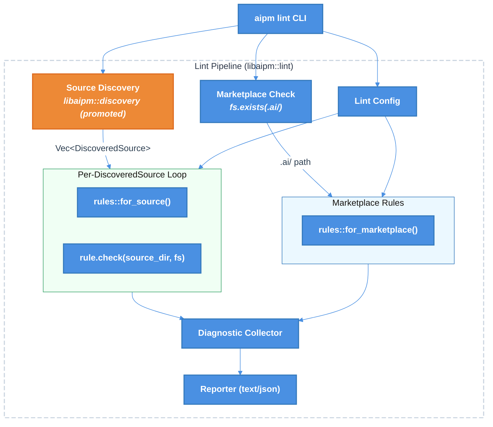

# `aipm lint` Recursive Discovery -- Technical Design Document

| Document Metadata      | Details                          |
| ---------------------- | -------------------------------- |
| Author(s)              | selarkin                         |
| Status                 | Draft (WIP)                      |
| Team / Owner           | AIPM Core                        |
| Created / Last Updated | 2026-04-02 / 2026-04-02         |

## 1. Executive Summary

This spec proposes integrating the recursive `.claude/` and `.github/` directory discovery model from `aipm migrate` into the `aipm lint` pipeline, so that the `source/misplaced-features` rule (and all future source rules) finds misplaced plugin features in **all** source directories throughout a monorepo, not just the project root. The discovery module (`migrate/discovery.rs`) is promoted to a shared top-level module (`libaipm::discovery`), and the lint pipeline replaces its flat `fs.exists()` checks with a call to `discover_source_dirs()` for `.claude`/`.github` patterns. The `.ai/` marketplace remains a flat root-level check.

**Research basis:**
- [research/tickets/2026-04-02-187-misplaced-features-recursive-discovery.md](../research/tickets/2026-04-02-187-misplaced-features-recursive-discovery.md) -- Issue #187 research
- [specs/2026-03-31-aipm-lint-command.md](2026-03-31-aipm-lint-command.md) -- Original lint spec (architecture diagram shows "Source Discovery: reuses migrate/discovery.rs")
- [research/docs/2026-03-23-recursive-claude-discovery-parallel-migrate.md](../research/docs/2026-03-23-recursive-claude-discovery-parallel-migrate.md) -- Foundational recursive discovery research

---

## 2. Context and Motivation

### 2.1 Current State

The lint pipeline in [`lint/mod.rs:47-63`](../crates/libaipm/src/lint/mod.rs#L47-L63) performs flat, root-only source detection:

```rust
if fs.exists(&opts.dir.join(".claude")) { found.push(".claude"); }
if fs.exists(&opts.dir.join(".github")) { found.push(".github"); }
if fs.exists(&opts.dir.join(".ai"))     { found.push(".ai"); }
```

It then runs each source type's rules against a single directory: `opts.dir.join(source_type)`.

Meanwhile, the migrate pipeline in [`migrate/mod.rs:455`](../crates/libaipm/src/migrate/mod.rs#L455) uses `discover_source_dirs()` to recursively walk the project tree with gitignore-aware traversal, finding all `.claude/` and `.github/` directories at any depth.

### 2.2 The Problem

- **User Impact:** In monorepo projects with nested `.claude/` directories (e.g., `packages/auth/.claude/skills/`), `aipm lint` silently misses misplaced features. Users get a false "no issues found" when problems exist.
- **Inconsistency:** `aipm migrate` finds these nested directories and processes them, but `aipm lint` does not. Running `aipm lint` before `aipm migrate` should surface the same set of source directories.
- **Original Design Intent:** The lint spec's architecture diagram ([line 92](../specs/2026-03-31-aipm-lint-command.md)) explicitly shows "Source Discovery: reuses migrate/discovery.rs", confirming recursive discovery was always intended but not shipped in v1.

---

## 3. Goals and Non-Goals

### 3.1 Functional Goals

- [ ] `aipm lint` discovers `.claude/` and `.github/` directories recursively throughout the project tree using the same `discover_source_dirs()` algorithm as `aipm migrate`
- [ ] All source rules (`.claude`/`.github` adapters) run against every discovered source directory, not just root
- [ ] The `.ai/` marketplace remains a flat root-level check (no recursive discovery)
- [ ] `--source .claude` filters recursive discovery to only `.claude/` directories
- [ ] `--source .github` filters recursive discovery to only `.github/` directories
- [ ] `--source .ai` skips recursive discovery and lints `.ai/` at root only
- [ ] `--max-depth` is wired through to `discover_source_dirs()` for `.claude`/`.github` scanning
- [ ] The `discovery` module is promoted from `migrate::discovery` to a top-level `libaipm::discovery` module, with its own error type
- [ ] Diagnostics from nested source directories include the full path (e.g., `packages/auth/.claude/skills/`) via the existing `Diagnostic.file_path` field
- [ ] Branch coverage >= 89% for all new and modified code

### 3.2 Non-Goals (Out of Scope)

- [ ] Changing the `Rule` trait signature -- rules already accept any `source_dir: &Path`
- [ ] Modifying the `MisplacedFeatures` rule implementation -- the rule itself is correct; only the calling code needs to change
- [ ] Adding new lint rules -- this is purely an infrastructure change to how existing rules are invoked
- [ ] Parallelizing lint rule execution via `rayon` -- this is a future optimization (rules are already `Send + Sync`)
- [ ] Recursive discovery for `.ai/` marketplace -- it only exists at project root

---

## 4. Proposed Solution (High-Level Design)

### 4.1 System Architecture Diagram



### 4.2 Architectural Pattern

The change follows the exact same **Discovery -> Per-Source Processing** pattern already established by `migrate_recursive()`. Discovery (real FS via `ignore` crate) produces a list of `DiscoveredSource` paths, then each path is handed to `&dyn Fs`-based rules for inspection. This is a proven pattern in the codebase.

### 4.3 Key Components

| Component | Responsibility | Location | Change Type |
|-----------|---------------|----------|-------------|
| `discovery` module | Recursive gitignore-aware directory walking | `libaipm::discovery` (promoted from `migrate::discovery`) | **Move + new error type** |
| `lint()` function | Pipeline orchestration | `libaipm::lint::mod` | **Modified** to call discovery |
| `lint::Error` | Lint error variants | `libaipm::lint::mod` | **Add** `DiscoveryFailed` variant |
| `MisplacedFeatures` rule | Check for feature dirs in source dirs | `libaipm::lint::rules::misplaced_features` | **No changes** |
| `Rule` trait | Lint rule interface | `libaipm::lint::rule` | **No changes** |
| `cmd_lint()` | CLI handler | `crates/aipm/src/main.rs` | **Modified** `--source` validation |
| `migrate` module | Uses discovery for migration | `libaipm::migrate::mod` | **Updated** imports |

---

## 5. Detailed Design

### 5.1 Promote Discovery to Shared Module

**Current location:** `crates/libaipm/src/migrate/discovery.rs`
**New location:** `crates/libaipm/src/discovery.rs`

The module's only dependency on `migrate` is `use super::Error` for the `Error::DiscoveryFailed` variant. Promoting it requires:

1. Create `crates/libaipm/src/discovery.rs` with the contents of `migrate/discovery.rs`
2. Define a self-contained error type in the new module:

```rust
/// Errors from directory discovery.
#[derive(Debug, thiserror::Error)]
pub enum Error {
    /// A walk entry produced an I/O error.
    #[error("discovery walk failed: {0}")]
    WalkFailed(String),
}
```

3. Update `lib.rs` to add `pub mod discovery;`
4. Update `migrate/mod.rs` to re-export or alias:
   - Replace `pub mod discovery;` with `pub use crate::discovery;` (or update all internal references)
   - Remove the `DiscoveryFailed` variant from `migrate::Error` if no longer needed there, OR keep it and have migrate map `discovery::Error` -> `migrate::Error::DiscoveryFailed`
5. Update `migrate/dry_run.rs` import: `use crate::discovery::DiscoveredSource;`

The `DiscoveredSource` struct and `discover_source_dirs()` / `discover_claude_dirs()` functions move as-is. No API changes.

### 5.2 Modified Lint Pipeline (`lint/mod.rs`)

The `lint()` function changes from flat `fs.exists()` checks to a two-phase approach:

**Phase 1: Recursive discovery for `.claude`/`.github`**

```rust
// Determine which source patterns to discover
let source_patterns: Vec<&str> = match opts.source.as_deref() {
    Some(".ai") => vec![],  // .ai/ is flat-only, skip discovery
    Some(src) => vec![src],  // --source .claude or --source .github
    None => vec![".claude", ".github"],  // auto-discover both
};

// Run recursive discovery for source directories
let discovered = if source_patterns.is_empty() {
    Vec::new()
} else {
    crate::discovery::discover_source_dirs(&opts.dir, &source_patterns, opts.max_depth)?
};

// Run source rules against each discovered directory
for src in &discovered {
    sources_scanned.push(src.source_type.clone());
    let all_rules = rules::for_source(&src.source_type);
    for rule in &all_rules {
        if opts.config.is_suppressed(rule.id()) { continue; }
        let rule_diagnostics = rule.check(&src.source_dir, fs)?;
        // ... apply severity overrides, ignore patterns, collect
    }
}
```

**Phase 2: Flat marketplace check (unchanged)**

```rust
// .ai/ marketplace: always flat, root-level check
let check_marketplace = match opts.source.as_deref() {
    Some(".ai") => true,
    Some(_) => false,  // --source .claude or .github, skip .ai
    None => fs.exists(&opts.dir.join(".ai")),  // auto-discover
};

if check_marketplace {
    sources_scanned.push(".ai".to_string());
    let scan_dir = opts.dir.join(".ai");
    let all_rules = rules::for_marketplace();
    for rule in &all_rules {
        // ... same rule execution as before
    }
}
```

### 5.3 Error Type Bridge

Add a `DiscoveryFailed` variant to `lint::Error`:

```rust
/// Errors that can occur during linting.
#[derive(Debug, thiserror::Error)]
pub enum Error {
    // ... existing variants ...

    /// Discovery failed during recursive directory walking.
    #[error("discovery failed: {0}")]
    DiscoveryFailed(String),
}

impl From<crate::discovery::Error> for Error {
    fn from(e: crate::discovery::Error) -> Self {
        Self::DiscoveryFailed(e.to_string())
    }
}
```

This allows the `?` operator to propagate discovery errors naturally in `lint()`.

### 5.4 CLI `--source` Validation (`main.rs`)

The existing `cmd_lint()` validation checks that the source directory exists at the project root:

```rust
// Current: checks dir.join(src).exists()
let source_dir = dir.join(src);
if !source_dir.exists() {
    return Err(format!("source directory '{}' not found in {}", src, dir.display()).into());
}
```

For `.claude`/`.github`, this check becomes overly strict with recursive discovery -- a monorepo might not have `.claude/` at root but might have `packages/auth/.claude/`. The validation should change:

- **For `.ai`**: Keep the existing root-level existence check (marketplace is always at root).
- **For `.claude`/`.github`**: Remove the root-level existence check. Let discovery run and report "no sources found" if nothing is discovered. Alternatively, run discovery and check the result.

```rust
if let Some(ref src) = source {
    if !SUPPORTED_SOURCES.contains(&src.as_str()) {
        return Err(format!("unsupported source '{src}'; valid sources: .claude, .github, .ai").into());
    }
    // For .ai, validate root existence. For .claude/.github, discovery handles it.
    if src == ".ai" {
        let source_dir = dir.join(src);
        if !source_dir.exists() {
            return Err(format!("source directory '{}' not found in {}", src, dir.display()).into());
        }
    }
}
```

### 5.5 Deduplication of `sources_scanned`

With recursive discovery, multiple `.claude/` directories will be found (e.g., root `.claude/` and `packages/auth/.claude/`). The `sources_scanned` field in `Outcome` currently stores source type strings. After this change, it should either:

- **Option A:** Store unique source type strings (deduplicate). The field stays `Vec<String>` and contains `[".claude", ".ai"]`.
- **Option B:** Store one entry per discovered source with path context, changing the type.

**Recommended: Option A** -- deduplicate source type strings. The field is used for reporting ("scanned: .claude, .ai") and doesn't need per-directory granularity. The diagnostics themselves carry the full path.

### 5.6 File Structure After Changes

```
crates/libaipm/src/
├── discovery.rs          # MOVED from migrate/discovery.rs
├── lib.rs                # ADD: pub mod discovery;
├── lint/
│   ├── mod.rs            # MODIFIED: use discovery for .claude/.github
│   ├── diagnostic.rs     # unchanged
│   ├── config.rs         # unchanged
│   ├── reporter.rs       # unchanged
│   ├── rule.rs           # unchanged
│   └── rules/
│       ├── mod.rs         # unchanged
│       ├── misplaced_features.rs  # unchanged
│       └── ...            # unchanged
├── migrate/
│   ├── mod.rs            # MODIFIED: use crate::discovery instead of local
│   ├── dry_run.rs        # MODIFIED: use crate::discovery::DiscoveredSource
│   └── ...               # unchanged
└── ...
```

---

## 6. Alternatives Considered

| Option | Pros | Cons | Reason for Rejection |
|--------|------|------|---------------------|
| **A: Keep discovery in migrate, import from lint** | No file moves, minimal diff | Creates a lint -> migrate dependency; semantically wrong for a shared utility | Lint should not depend on migrate internals |
| **B: Duplicate discovery logic in lint** | No shared module needed | Code duplication, two implementations to maintain, divergence risk | Violates DRY; the issue specifically requests using "the same algorithm" |
| **C: Promote to shared module (Selected)** | Clean dependency graph, single source of truth, matches original design intent | Larger diff (file move + import updates) | **Selected:** The original lint spec intended this. Discovery is not migrate-specific. |
| **D: Add recursive walk to `Fs` trait** | Full mockability for discovery | Major trait change, complex mock implementation, `ignore` crate integration awkward behind trait | Over-engineered; the existing real-FS-discovery -> mockable-rules pattern works well |

---

## 7. Cross-Cutting Concerns

### 7.1 Backwards Compatibility

- **CLI behavior:** `aipm lint` with no flags now discovers more source directories than before. This is additive -- it may produce new warnings that were previously missed, but cannot remove existing ones.
- **Exit codes:** If newly-discovered nested directories have misplaced features, the exit code may change from 0 to 0 (warnings) or 0 to 1 (if configured as errors). This is correct behavior.
- **`--source .claude` validation:** Relaxing the root-existence check is a behavior change. Previously, `aipm lint --source .claude` in a monorepo without root `.claude/` would error. Now it would succeed (possibly with no findings if no nested `.claude/` dirs exist either).

### 7.2 Performance

- **Discovery overhead:** `discover_source_dirs()` uses the `ignore` crate which is highly optimized for large repos (respects `.gitignore`, skips `node_modules/` etc.). The overhead is negligible for typical projects.
- **`--max-depth`:** Already supported by `discover_source_dirs()` and already in the `lint::Options` struct. This spec wires them together.
- **No parallelism in v1:** Rules run sequentially per discovered source. The `Rule` trait already requires `Send + Sync`, so `rayon::par_iter()` can be added later without trait changes.

---

## 8. Migration, Rollout, and Testing

### 8.1 Implementation Order

1. **Promote discovery module** -- Move `migrate/discovery.rs` to `discovery.rs`, define `discovery::Error`, update `lib.rs`, update migrate imports. Verify `cargo build --workspace` and `cargo test --workspace` pass.
2. **Add `DiscoveryFailed` to `lint::Error`** -- Add the variant and `From<discovery::Error>` impl. Pure additive, no behavior change.
3. **Modify `lint()` pipeline** -- Replace flat `fs.exists()` checks with `discover_source_dirs()` for `.claude`/`.github`. Keep `.ai/` flat. Wire `max_depth` through.
4. **Update `cmd_lint()` CLI validation** -- Relax `--source` existence check for `.claude`/`.github`.
5. **Add tests** -- Unit tests for the modified `lint()` function, E2E tests for monorepo layouts.

### 8.2 Test Plan

#### Unit Tests (in `lint/mod.rs`)

- `lint_discovers_nested_claude_dirs` -- Create a tempdir with `packages/auth/.claude/skills/` and `.ai/`, verify `misplaced-features` fires for the nested dir.
- `lint_discovers_nested_github_dirs` -- Same for `.github/`.
- `lint_source_filter_claude_only` -- `--source .claude` with both `.claude/` and `.github/` nested dirs, verify only `.claude` diagnostics.
- `lint_source_filter_ai_skips_discovery` -- `--source .ai` does not run discovery.
- `lint_max_depth_limits_discovery` -- `--max-depth 1` only finds root source dirs.
- `lint_no_sources_found_succeeds` -- Empty project with no source dirs returns empty outcome.
- `lint_deduplicates_sources_scanned` -- Multiple `.claude/` dirs produce a single `".claude"` entry in `sources_scanned`.

#### E2E Tests (in `crates/aipm/tests/lint_e2e.rs`)

- `lint_monorepo_finds_nested_misplaced_features` -- Create a tempdir monorepo with nested `.claude/skills/` and `.ai/`, run `aipm lint`, verify diagnostics reference the nested path.
- `lint_source_claude_no_root_dir_succeeds_with_nested` -- `aipm lint --source .claude` in a monorepo where `.claude/` only exists nested (not at root).
- `lint_max_depth_cli_flag` -- `aipm lint --max-depth 1` only finds root-level source dirs.

#### Existing Tests

- All existing `discovery.rs` tests move with the module and continue to pass unchanged.
- All existing `misplaced_features.rs` unit tests continue to pass unchanged (the rule itself is not modified).
- Existing `lint_e2e.rs` tests continue to pass (root-level directories are still discovered).

---

## 9. Open Questions / Unresolved Issues

All open questions from the [research document](../research/tickets/2026-04-02-187-misplaced-features-recursive-discovery.md) have been resolved:

| Question | Resolution |
|----------|-----------|
| Should recursive discovery apply to all source rules or only misplaced-features? | **All source rules** -- discovery at pipeline level |
| Should discovery be gated to `.claude`/`.github` only? | **Yes** -- `.ai/` stays flat |
| How to bridge error types? | **Promote discovery to shared module** with own error type |
| Should `--source` work with recursive discovery? | **Yes** -- filters discovered results |

### Remaining Minor Decisions

- [ ] **`migrate::Error::DiscoveryFailed` cleanup**: After promoting the module, should `migrate::Error::DiscoveryFailed` be removed and replaced with a `From<discovery::Error>` impl, or kept for backwards compatibility? Recommend: replace with `From` impl for consistency.
- [ ] **`sources_scanned` reporting**: Should the text/JSON reporter mention the count of discovered directories (e.g., "scanned 3 .claude/ directories, 1 .ai/ marketplace")? Nice-to-have but not blocking.
