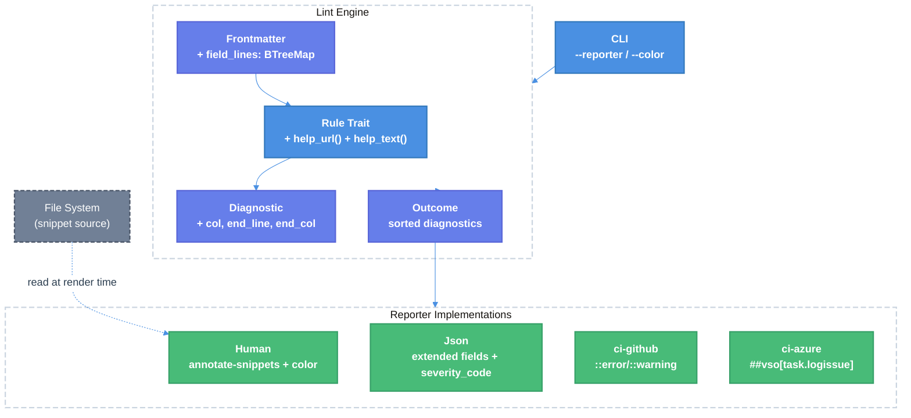

# Lint Display UX — Technical Design Document

| Document Metadata      | Details                                                    |
| ---------------------- | ---------------------------------------------------------- |
| Author(s)              | Sean Larkin                                                |
| Status                 | Draft (WIP)                                                |
| Team / Owner           | AIPM Core                                                  |
| Created / Last Updated | 2026-04-03 / 2026-04-03                                   |
| Related                | [GitHub Issue #198](https://github.com/TheLarkInn/aipm/issues/198), [Lint Command Spec](./2026-03-31-aipm-lint-command.md), [Lint DX Guide](./2026-03-31-aipm-lint-developer-experience.md) |

---

## 1. Executive Summary

This RFC upgrades `aipm lint` from plain-text output to a rich, multi-format diagnostic experience. The current `Text` reporter has no color, no source snippets, no help links, no column data, and no CI-native formats. This spec adds: (1) ANSI-colored per-diagnostic output with `annotate-snippets`-rendered source context, (2) extended `Diagnostic` struct with full range fields (`col`, `end_line`, `end_col`), (3) `help_url()` and `help_text()` on the `Rule` trait, (4) per-field line tracking in `Frontmatter`, (5) four reporter backends (`human`, `json`, `ci-github`, `ci-azure`), and (6) a `--reporter` flag replacing the current `--format` flag plus a `--color=never|auto|always` flag. These changes bring `aipm lint` to parity with clippy, ESLint, and Biome in diagnostic quality.

**Research basis**: [research/tickets/2026-04-03-198-lint-display-ux.md](../research/tickets/2026-04-03-198-lint-display-ux.md)

---

## 2. Context and Motivation

### 2.1 Current State

`aipm lint` v0.16.1 produces clippy-styled plain text with no ANSI color, no source code snippets, no help text, no rule documentation links, and no column-level precision. The `Diagnostic` struct carries only `line: Option<usize>` — no column, no end range. The `Frontmatter` parser tracks block boundaries (`start_line`/`end_line`) but not per-field positions, so rules hardcode `line: Some(1)` even when the offending field could be precisely located.

Two reporters exist:
- **`Text`** — human-readable, clippy-style, **no color, no grouping, no snippets** ([`reporter.rs:17-52`](../crates/libaipm/src/lint/reporter.rs#L17-L52))
- **`Json`** — hand-built JSON with diagnostics array + summary, **no column, no help_url** ([`reporter.rs:54-100`](../crates/libaipm/src/lint/reporter.rs#L54-L100))

CLI selection is a simple `match` on `--format` string with no validation — unknown values silently fall back to text ([`main.rs:549-556`](../crates/aipm/src/main.rs#L549-L556)).

**Current output:**
```
warning[skill/oversized]: SKILL.md exceeds 15000 character limit (19497 chars)
  --> .ai/<plugin>/skills/perf-anti-patterns/SKILL.md:1
  |
```

No color. No snippet. No help text. No rule link. Line 1 is hardcoded.

### 2.2 The Problem

- **User Impact**: Developers see bare diagnostic text with no visual hierarchy — all severities look identical. No source context means jumping to the file manually for every issue.
- **CI Impact**: No GitHub Actions or Azure DevOps annotation format means lint results don't appear as inline PR comments.
- **Tooling Impact**: JSON output lacks column data and help URLs, making LSP adapter integration incomplete.
- **DX Impact**: No help text or documentation links means users must guess how to fix issues.

### 2.3 Prior Art

The [lint DX guide spec](./2026-03-31-aipm-lint-developer-experience.md) already shows `= help:` lines in example output (Section 2) that are not yet implemented. The [lint command spec](./2026-03-31-aipm-lint-command.md) Section 3.2 explicitly listed "documentation links and fix suggestions" as a v1 non-goal. Issue #198 promotes this to active work.

Research ref: [research §1.4](../research/tickets/2026-04-03-198-lint-display-ux.md) — current `write_diagnostic` output format.

---

## 3. Goals and Non-Goals

### 3.1 Functional Goals

- [ ] `Diagnostic` struct extended with `col: Option<usize>`, `end_line: Option<usize>`, `end_col: Option<usize>`
- [ ] `Rule` trait extended with `help_url(&self) -> Option<&'static str>` and `help_text(&self) -> Option<&'static str>` (default `None`)
- [ ] `Frontmatter` parser tracks per-field line numbers (1-based) in a `BTreeMap<String, usize>`
- [ ] **`human` reporter**: ANSI-colored, per-diagnostic rustc-style blocks with `annotate-snippets` source context, help text, and rule documentation links
- [ ] **`json` reporter**: extended with `col`, `end_line`, `end_col`, `help_url`, `help_text`, and `severity_code` (numeric LSP-compatible)
- [ ] **`ci-github` reporter**: GitHub Actions `::error`/`::warning` annotation format
- [ ] **`ci-azure` reporter**: Azure DevOps `##vso[task.logissue]` annotation format
- [ ] `--reporter` flag (values: `human`, `json`, `ci-github`, `ci-azure`) replaces `--format`
- [ ] `--format` kept as a hidden deprecated alias for `--reporter`
- [ ] `--color=never|auto|always` flag on the `lint` subcommand
- [ ] Color auto-detection: disable when stdout is not a TTY, `NO_COLOR` is set, or `CLICOLOR=0`
- [ ] Directory-level diagnostics (`source/misplaced-features`) render as normal blocks with no snippet section
- [ ] Diagnostics sorted by file path, then by line number within the same file
- [ ] All existing rules updated to provide accurate line numbers using Frontmatter field positions where applicable
- [ ] `broken_paths` rule exposes its already-computed column position via the new `col` field
- [ ] All 12 rules implement `help_url()` pointing to GitHub repo docs
- [ ] Branch coverage >= 89% for all new code

### 3.2 Non-Goals (Out of Scope)

- [ ] LSP server — out of scope per [lint command spec §3.2](./2026-03-31-aipm-lint-command.md). The enriched `json` reporter enables LSP adapter integration without a dedicated server.
- [ ] `--fix` auto-fix mode — deferred to v2
- [ ] SARIF output format — deferred; `ci-github` annotations cover the primary CI use case
- [ ] `aipm.toml` color configuration — color is CLI flag + env var only, matching ecosystem convention
- [ ] Web/HTML reporter — deferred to v2
- [ ] Auto-detection of CI environment (e.g., `GITHUB_ACTIONS` env var) to switch reporter format — explicit `--reporter` flag required
- [ ] Custom/pluggable reporter system — the four built-in reporters cover all v1 use cases
- [ ] `aipm-pack lint` integration

---

## 4. Proposed Solution (High-Level Design)

### 4.1 System Architecture Diagram



### 4.2 Architectural Pattern

Per-diagnostic rustc-style rendering. Each diagnostic is a self-contained block with file location, source snippet (when available), and help annotations. This matches the model `aipm lint` already mimics from clippy, and is appropriate given the low diagnostic density per file typical in AI plugin linting.

Research ref: [research §3.2](../research/tickets/2026-04-03-198-lint-display-ux.md) — rustc per-diagnostic model rationale.

### 4.3 Key Components

| Component | Responsibility | Technology | Justification |
|---|---|---|---|
| `Diagnostic` struct | Carries range + metadata for each finding | Rust struct (existing, extended) | Central data model; adding `col`/`end_*` fields enables all downstream reporters |
| `Rule` trait | Declares rule metadata including help_url/help_text | Rust trait (existing, extended) | Default method impls mean zero breakage for existing rules |
| `Frontmatter` parser | Tracks per-field line positions | Rust (existing, extended) | Enables precise snippets for skill frontmatter rules |
| `Human` reporter | Colored, snippet-rich terminal output | `annotate-snippets` + `anstyle` | Exact rustc output format; `anstyle` already transitive via `clap` |
| `Json` reporter | Extended machine-readable output | Hand-built JSON (existing) | Adding fields to existing reporter; no new deps needed |
| `ci-github` reporter | GitHub Actions inline annotations | Plain text `::error`/`::warning` | Zero-dependency, renders as PR annotations |
| `ci-azure` reporter | Azure DevOps inline annotations | Plain text `##vso[task.logissue]` | Zero-dependency, renders as pipeline annotations |
| Color detection | TTY/NO_COLOR/CLICOLOR/--color flag | `anstyle-query` (transitive via clap) | Standard color detection stack used by clap itself |

---

## 5. Detailed Design

### 5.1 `Diagnostic` Struct Changes

**File**: `crates/libaipm/src/lint/diagnostic.rs`

```rust
#[derive(Debug, Clone)]
pub struct Diagnostic {
    pub rule_id: String,
    pub severity: Severity,
    pub message: String,
    pub file_path: PathBuf,
    pub line: Option<usize>,        // 1-based, existing
    pub col: Option<usize>,         // NEW: 1-based column
    pub end_line: Option<usize>,    // NEW: 1-based end line
    pub end_col: Option<usize>,     // NEW: 1-based end column
    pub source_type: String,
}
```

All new fields default to `None`. Existing rule call sites gain `col: None, end_line: None, end_col: None` — purely additive.

### 5.2 `Rule` Trait Changes

**File**: `crates/libaipm/src/lint/rule.rs`

```rust
pub trait Rule: Send + Sync {
    fn id(&self) -> &'static str;
    fn name(&self) -> &'static str;
    fn default_severity(&self) -> Severity;
    fn help_url(&self) -> Option<&'static str> { None }    // NEW
    fn help_text(&self) -> Option<&'static str> { None }   // NEW
    fn check(&self, source_dir: &Path, fs: &dyn Fs) -> Result<Vec<Diagnostic>, super::Error>;
}
```

Default impls return `None` — existing rules compile unchanged. Each rule then opts in by overriding with a `Some(...)` return.

**Help URL pattern**: `https://github.com/TheLarkInn/aipm/blob/main/docs/rules/{rule_id}.md`

Example for `skill/missing-description`:
```rust
fn help_url(&self) -> Option<&'static str> {
    Some("https://github.com/TheLarkInn/aipm/blob/main/docs/rules/skill/missing-description.md")
}

fn help_text(&self) -> Option<&'static str> {
    Some("add a \"description\" field to the YAML frontmatter")
}
```

### 5.3 `Frontmatter` Per-Field Line Tracking

**File**: `crates/libaipm/src/frontmatter.rs`

```rust
#[derive(Debug, Clone)]
pub struct Frontmatter {
    pub fields: BTreeMap<String, String>,
    pub field_lines: BTreeMap<String, usize>,  // NEW: field key → 1-based line number
    pub start_line: usize,
    pub end_line: usize,
    pub body: String,
}
```

During the existing line-by-line parse loop (which already iterates YAML lines to extract key-value pairs), store the 1-based line number of each key encountered. The line number is `start_line + 1 + line_index_within_yaml_block` (accounting for the opening `---` delimiter).

Rules can then look up `frontmatter.field_lines.get("name")` to get the precise line for the `name:` field, enabling accurate `Diagnostic.line` values instead of hardcoded `Some(1)`.

### 5.4 Diagnostic Sorting

**File**: `crates/libaipm/src/lint/mod.rs`

Current: sorted by `file_path` only. Change to:

```rust
all_diagnostics.sort_by(|a, b| {
    a.file_path.cmp(&b.file_path)
        .then_with(|| a.line.cmp(&b.line))
        .then_with(|| a.col.cmp(&b.col))
});
```

### 5.5 Reporter Trait

The `Reporter` trait interface stays unchanged:

```rust
pub trait Reporter {
    fn report(&self, outcome: &Outcome, writer: &mut dyn Write) -> std::io::Result<()>;
}
```

The `Human` reporter additionally needs filesystem access to read source files for snippets. Two options:

**Option A — Pass `&dyn Fs` via a field on the `Human` struct:**
```rust
pub struct Human<'a> {
    pub fs: &'a dyn Fs,
    pub color: ColorChoice,
    pub base_dir: PathBuf,
}
```

This is the recommended approach. The `Reporter` trait stays clean, and `Human` carries its dependencies as struct fields.

**Option B — Extend the `Reporter` trait signature.** Rejected because it forces all reporters to accept `Fs` even when they don't need it.

### 5.6 `Human` Reporter

**New file**: `crates/libaipm/src/lint/reporter/human.rs` (or inline in `reporter.rs`)

Renders each diagnostic as a rustc-style block using `annotate-snippets`:

```
warning[skill/missing-description]: SKILL.md missing required field: description
  --> .ai/my-plugin/skills/default/SKILL.md:2
   |
 1 | ---
 2 | name: my-skill
 3 | ---
   |
   = help: add a "description" field to the YAML frontmatter
   = help: https://github.com/TheLarkInn/aipm/blob/main/docs/rules/skill/missing-description.md
```

**Color assignments** (matching rustc convention per [research §2.1, Appendix B](../research/tickets/2026-04-03-198-lint-display-ux.md)):

| Element | Color |
|---|---|
| `error:` label | Bold red |
| `warning:` label | Bold yellow |
| Rule ID `[skill/missing-description]` | Bold |
| `-->` arrow | Bold blue |
| Line numbers | Bold blue |
| `\|` gutter separator | Bold blue |
| Underline carets `^^^` | Same as severity color |
| `= help:` label | Bold cyan |
| Source code text | Default terminal color |

**Color detection** (matching [research §2.1](../research/tickets/2026-04-03-198-lint-display-ux.md) decision tree):

```
--color=never?    → no color
--color=always?   → force color
NO_COLOR set?     → no color
CLICOLOR=0?       → no color
is_atty(stdout)?  NO → no color
otherwise         → color enabled
```

**Snippet rendering**:
1. Reporter reads the file at `diagnostic.file_path` via `&dyn Fs` at render time
2. Constructs an `annotate-snippets` `Snippet` with the source text, the diagnostic line, and column range (if available)
3. If `line` is `None` (directory-level diagnostic), no snippet is rendered — only the `-->` path line and help annotations

**Directory-level diagnostics** (`source/misplaced-features`):
```
warning[source/misplaced-features]: skill found in .claude/ instead of .ai/
  --> .clone/skills/code-review/
   |
   = help: run "aipm migrate" to move this into the marketplace
```

**Summary line** (after all diagnostics):
```
error: 1 error, 3 warnings emitted
```

### 5.7 `Json` Reporter (Extended)

**File**: `crates/libaipm/src/lint/reporter.rs` (existing `Json` impl)

Each diagnostic object gains new fields:

```json
{
  "rule_id": "skill/missing-description",
  "severity": "warning",
  "severity_code": 2,
  "message": "SKILL.md missing required field: description",
  "file_path": ".ai/my-plugin/skills/default/SKILL.md",
  "line": 2,
  "col": null,
  "end_line": null,
  "end_col": null,
  "help_url": "https://github.com/TheLarkInn/aipm/blob/main/docs/rules/skill/missing-description.md",
  "help_text": "add a \"description\" field to the YAML frontmatter",
  "source_type": ".ai"
}
```

**`severity_code` mapping** (LSP-compatible):
- `"error"` → `1`
- `"warning"` → `2`

New fields `col`, `end_line`, `end_col` emit as `null` when `None`.

### 5.8 `ci-github` Reporter

**New file**: `crates/libaipm/src/lint/reporter/ci_github.rs` (or inline)

Emits GitHub Actions annotation commands to stdout:

```
::error file=.ai/plugin/skills/SKILL.md,line=1,col=1::skill/missing-description: SKILL.md missing required field: description
::warning file=.ai/plugin/skills/SKILL.md,line=1,col=1::skill/oversized: SKILL.md exceeds 15000 chars
```

Format per [GitHub Actions docs](https://docs.github.com/en/actions/using-workflows/workflow-commands-for-github-actions#setting-an-error-message):
```
::{severity} file={file_path},line={line},col={col}::{rule_id}: {message}
```

- `line` defaults to `1` if `None`
- `col` defaults to `1` if `None`
- No color, no snippets — GitHub renders these as inline PR annotations

### 5.9 `ci-azure` Reporter

**New file**: `crates/libaipm/src/lint/reporter/ci_azure.rs` (or inline)

Emits Azure DevOps logging commands:

```
##vso[task.logissue type=error;sourcepath=.ai/plugin/skills/SKILL.md;linenumber=1;columnnumber=1]skill/missing-description: SKILL.md missing required field: description
##vso[task.logissue type=warning;sourcepath=.ai/plugin/skills/SKILL.md;linenumber=1;columnnumber=1]skill/oversized: SKILL.md exceeds 15000 chars
```

Format per [Azure DevOps docs](https://learn.microsoft.com/en-us/azure/devops/pipelines/scripts/logging-commands):
```
##vso[task.logissue type={severity};sourcepath={file_path};linenumber={line};columnnumber={col}]{rule_id}: {message}
```

- `linenumber` defaults to `1` if `None`
- `columnnumber` defaults to `1` if `None`

### 5.10 CLI Changes

**File**: `crates/aipm/src/main.rs`

```rust
Lint {
    #[arg(default_value = ".")]
    dir: PathBuf,

    #[arg(long)]
    source: Option<String>,

    /// Output format (human, json, ci-github, ci-azure)
    #[arg(long, default_value = "human", value_parser = ["human", "json", "ci-github", "ci-azure"])]
    reporter: String,

    /// Deprecated alias for --reporter
    #[arg(long, hide = true)]
    format: Option<String>,

    /// Color output (never, auto, always)
    #[arg(long, default_value = "auto", value_parser = ["never", "auto", "always"])]
    color: String,

    #[arg(long)]
    max_depth: Option<usize>,
}
```

Dispatch logic:
```rust
// --format is a deprecated alias for --reporter
let effective_reporter = format.as_deref().unwrap_or(&reporter);

let color_choice = match color.as_str() {
    "never"  => ColorChoice::Never,
    "always" => ColorChoice::Always,
    _        => /* auto-detect TTY + NO_COLOR + CLICOLOR */,
};

match effective_reporter {
    "json"      => Json.report(&outcome, &mut stdout)?,
    "ci-github" => CiGitHub.report(&outcome, &mut stdout)?,
    "ci-azure"  => CiAzure.report(&outcome, &mut stdout)?,
    _           => Human { fs: &real_fs, color: color_choice, base_dir: dir.clone() }
                       .report(&outcome, &mut stdout)?,
}
```

### 5.11 Per-Rule Updates

Every rule gains `help_url()` and `help_text()` overrides, and rules that currently hardcode `line: Some(1)` are updated to use `Frontmatter.field_lines` where applicable.

| Rule | Line Change | Col Change | help_text |
|---|---|---|---|
| `skill/missing-name` | `frontmatter.start_line` (field absent → point to block start) | `None` | `"add a \"name\" field to the YAML frontmatter"` |
| `skill/missing-description` | `frontmatter.start_line` | `None` | `"add a \"description\" field to the YAML frontmatter"` |
| `skill/oversized` | `Some(1)` (whole-file) | `None` | `"reduce file size below 15000 characters"` |
| `skill/name-too-long` | `field_lines.get("name")` | `None` | `"shorten the name to ≤60 characters"` |
| `skill/name-invalid-chars` | `field_lines.get("name")` | `None` | `"use only alphanumeric, hyphen, underscore characters"` |
| `skill/description-too-long` | `field_lines.get("description")` | `None` | `"shorten the description to ≤200 characters"` |
| `skill/invalid-shell` | `field_lines.get("shell")` | `None` | `"use a supported shell value"` |
| `agent/missing-tools` | `frontmatter.start_line` | `None` | `"add a \"tools\" field listing required tools"` |
| `hook/unknown-event` | existing line (keep) | `None` | `"use a valid hook event name"` |
| `hook/legacy-event-name` | search raw JSON for key line | `None` | `"rename to the PascalCase event name"` |
| `plugin/broken-paths` | existing computed line (keep) | **`Some(pos + 1)`** — expose the already-computed byte offset | `"fix or remove the broken file reference"` |
| `source/misplaced-features` | `None` (directory-level, keep) | `None` | `"run \"aipm migrate\" to move into .ai/"` |

### 5.12 New Dependencies

| Crate | Purpose | Version |
|---|---|---|
| `annotate-snippets` | Rustc-style snippet rendering with color | Latest stable |
| `anstyle` | ANSI style types (likely already transitive via `clap`) | Match `clap` transitive version |
| `anstyle-query` | TTY / NO_COLOR / CLICOLOR detection (likely already transitive via `clap`) | Match `clap` transitive version |

Check if `anstyle` and `anstyle-query` are already in the dependency tree via `clap` before adding explicit deps. If transitive, re-export or use directly — no new `Cargo.toml` entry needed.

---

## 6. Alternatives Considered

| Option | Pros | Cons | Reason for Rejection |
|---|---|---|---|
| ESLint-style file-grouped output | Compact when many diagnostics per file | Less self-contained per diagnostic; harder to add snippets | Low diagnostic density per file in aipm makes per-diagnostic blocks more useful |
| `ariadne` for snippet rendering | Prettier output with box-drawing characters | Non-standard look; heavier dependency | `annotate-snippets` matches the clippy output aipm already models after |
| `miette` for diagnostics | High-level derive macros, ergonomic | Designed for application errors, not lint output; opinionated | Would require restructuring the entire diagnostic pipeline |
| Color config in `aipm.toml` | Teams can enforce no-color across the project | No major lint tool does this; `NO_COLOR` env var covers the use case | Follow ecosystem convention: CLI flags + env vars only |
| `Span` struct instead of flat fields | Cleaner API, groups related range fields | Bigger refactor; `line` must remain separate for non-rangeable rules | Flat `Option` fields are simpler and backward-compatible |
| SARIF output for CI | Industry standard, richer metadata | Complex schema, heavy to implement | `::error`/`##vso` annotations are zero-dependency and sufficient for v1 |
| Auto-detect `GITHUB_ACTIONS` env var | Matches OxLint/Biome behavior | Magic behavior; harder to reason about in CI pipelines | Explicit `--reporter ci-github` is predictable; auto-detect deferred |

---

## 7. Cross-Cutting Concerns

### 7.1 Backward Compatibility

- `--format` is kept as a hidden deprecated alias for `--reporter`. Existing CI scripts using `--format json` continue to work.
- The `Json` reporter output is a strict superset of the current format — new fields are added, none removed or renamed. Consumers parsing only `rule_id`, `severity`, `message`, `file_path`, `line` are unaffected.
- The default reporter changes from `text` to `human` — the output is richer but structurally similar (same `severity[rule_id]: message` header pattern). Scripts parsing the text output should use `--reporter json` instead.

### 7.2 Observability

The `--reporter` flag integrates with the existing verbosity system ([verbosity spec](./2026-04-03-verbosity-levels.md)). Reporter output goes to stdout; `tracing` infrastructure logs go to stderr. These remain independent.

### 7.3 LSP Compatibility

The extended `Json` reporter output maps directly to LSP `Diagnostic` fields:

| JSON field | LSP field | Conversion |
|---|---|---|
| `line` | `range.start.line` | Subtract 1 (1-based → 0-based) |
| `col` | `range.start.character` | Subtract 1 if present, else 0 |
| `end_line` | `range.end.line` | Subtract 1 if present, else same as start |
| `end_col` | `range.end.character` | Subtract 1 if present, else 0 |
| `severity_code` | `severity` | Direct (1=Error, 2=Warning) |
| `rule_id` | `code` | Direct |
| `help_url` | `codeDescription.href` | Direct |
| `message` | `message` | Direct |
| — | `source` | Hardcode `"aipm"` in adapter |

No dedicated LSP server needed — a generic adapter (e.g., `efm-langserver`, `none-ls`) can invoke `aipm lint --reporter json` and translate.

---

## 8. Migration, Rollout, and Testing

### 8.1 Deployment Strategy

This is a single release. All changes ship together in one version bump since they are tightly coupled (Diagnostic struct changes flow through rules → reporters).

- [ ] Phase 1: Extend `Diagnostic`, `Rule` trait, `Frontmatter` — all existing tests updated
- [ ] Phase 2: Implement `Human` reporter with `annotate-snippets`
- [ ] Phase 3: Extend `Json` reporter with new fields
- [ ] Phase 4: Implement `ci-github` and `ci-azure` reporters
- [ ] Phase 5: Update CLI flags (`--reporter`, `--color`, deprecate `--format`)
- [ ] Phase 6: Update all 12 rules with `help_url()`, `help_text()`, and accurate line numbers
- [ ] Phase 7: Add rule documentation markdown files to `docs/rules/`

### 8.2 Test Plan

- **Unit Tests (reporter)**:
  - `Human` reporter produces expected colored output (test with `--color=always` and compare against snapshot)
  - `Human` reporter produces no ANSI codes when `--color=never`
  - `Json` reporter includes all new fields (`col`, `end_line`, `end_col`, `help_url`, `help_text`, `severity_code`)
  - `ci-github` reporter produces valid `::error`/`::warning` format
  - `ci-azure` reporter produces valid `##vso[task.logissue]` format
  - Directory-level diagnostics render without snippets in all reporters

- **Unit Tests (Frontmatter)**:
  - `field_lines` correctly maps field names to 1-based line numbers
  - Multi-line field values track the starting line
  - Empty frontmatter produces empty `field_lines`

- **Unit Tests (Diagnostic)**:
  - Sorting by file_path → line → col produces expected order
  - `col: None` sorts before `col: Some(_)` for same file+line

- **Unit Tests (rules)**:
  - Each rule's `help_url()` returns a non-empty `Some`
  - Each rule's `help_text()` returns a non-empty `Some`
  - Rules using `field_lines` report accurate line numbers (not hardcoded `1`)
  - `broken_paths` populates `col` from its computed byte offset

- **Integration Tests**:
  - End-to-end `aipm lint --reporter json` output is valid JSON with all fields
  - End-to-end `aipm lint --reporter ci-github` output matches expected annotation format
  - `--format json` (deprecated alias) produces identical output to `--reporter json`
  - `--color=never` + `human` reporter produces no ANSI escape sequences in output

- **Coverage**: Branch coverage >= 89% for all new and modified code

---

## 9. Open Questions / Unresolved Issues

All questions from the [research document](../research/tickets/2026-04-03-198-lint-display-ux.md) have been resolved through the design wizard. No remaining open questions.

**Resolved decisions summary**:

| Question | Decision |
|---|---|
| Color in `aipm.toml`? | No — CLI `--color` + `NO_COLOR` env only |
| Grouping model? | Per-diagnostic rustc style |
| Diagnostic range fields? | Full range: `col`, `end_line`, `end_col` |
| Snippet crate? | `annotate-snippets` |
| Reporter formats? | `human`, `json`, `ci-github`, `ci-azure` |
| CI auto-detect? | No — explicit `--reporter` flag only |
| Flag name? | `--reporter` (primary), `--format` (hidden deprecated alias) |
| Rule trait changes? | `help_url()` + `help_text()` with default `None` |
| Frontmatter tracking? | Per-field line positions in `BTreeMap<String, usize>` |
| Directory diagnostics? | Same block format, no snippet |
| JSON severity? | Both string + numeric `severity_code` |
| Help URL pattern? | GitHub repo docs links |
| Snippet sourcing? | Reporter reads file at render time |
| ADO format? | `##vso[task.logissue]` commands |
