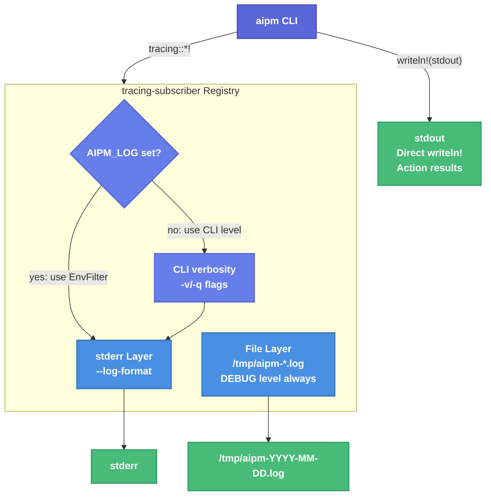

# Verbosity Levels for aipm — Technical Design Document

| Document Metadata      | Details                                      |
| ---------------------- | -------------------------------------------- |
| Author(s)              | Sean Larkin                                  |
| Status                 | Draft (WIP)                                  |
| Team / Owner           | aipm                                         |
| Created / Last Updated | 2026-04-03                                   |
| Issue                  | https://github.com/TheLarkInn/aipm/issues/189 |

## 1. Executive Summary

aipm has ~30 `tracing::info!/warn!/debug!` call sites in `libaipm` and declares `tracing` + `tracing-subscriber` as workspace dependencies — but **no subscriber is ever initialized**, so all diagnostic output is silently discarded. Additionally, ~12 silent fallback paths swallow errors with zero feedback. This spec activates the existing tracing infrastructure by adding a layered subscriber: stderr output controlled by `-v`/`-q` flags (default: Warn), an always-on rotated file log in `/tmp`, support for `--log-format` (text/json), and an `AIPM_LOG` env var for fine-grained override. The result is a CLI that is silent by default, informative when asked, and debuggable after the fact.

## 2. Context and Motivation

### 2.1 Current State

**Output channels** ([research §1.2](../research/docs/2026-04-02-189-verbosity-levels-research.md)):

```
stdout  ──  writeln!(stdout, ...) ── action results ("Installed 3 packages")
stderr  ──  writeln!(stderr, ...) ── ad-hoc errors/warnings (3 locations)
tracing ──  tracing::info!/warn!/debug! ── 30+ call sites ── NO SUBSCRIBER ── /dev/null
```

All user-facing output uses `let _ = writeln!(stdout/stderr, ...)` in `crates/aipm/src/main.rs`. The lint subsystem has a structured `Reporter` trait (`libaipm/src/lint/reporter.rs`) supporting text and JSON — the most mature output abstraction in the codebase.

**Dependencies already declared** (`Cargo.toml:72-73`):
```toml
tracing = "0.1"
tracing-subscriber = "0.3"
```

Both `crates/aipm/Cargo.toml` and `crates/libaipm/Cargo.toml` reference these.

### 2.2 The Problem

- **User impact**: When things go wrong (hard-link fallback, unparseable manifest, glob pattern errors), the CLI is completely silent. Users have no way to diagnose issues without reading source code.
- **Developer impact**: The 30+ existing `tracing::*!` calls represent invested instrumentation effort that produces zero runtime value.
- **Agentic impact**: LLM agents operating aipm cannot react to warnings because none are emitted. There is no structured output mode for machine consumption of diagnostics.

**Silent fallback locations** ([research §1.3](../research/docs/2026-04-02-189-verbosity-levels-research.md)):

| File | What happens silently |
|------|----------------------|
| `main.rs:205-215` | `resolve_plugins_dir` falls back to `.ai` |
| `main.rs:552-619` | `load_lint_config` uses `Config::default()` on parse failure |
| `workspace/mod.rs:32-49` | `find_workspace_root` skips unparseable manifests |
| `installer/pipeline.rs:638-646` | `build_pins` skips packages with bad versions |
| `lint/mod.rs:22-31` | `is_ignored` skips invalid glob patterns |
| `lint/rules/scan.rs:32-131` | scan functions skip unreadable dirs/files |
| `store/mod.rs:160-186` | `link_to` falls back from hard-link to copy |
| `migrate/copilot_extension_detector.rs:60-79` | tries 9 config filenames silently |
| `migrate/emitter.rs:618-626` | skips files that fail to read |
| `migrate/cleanup.rs:64-71` | skips directories that fail to read |
| `fs.rs:201-205` | atomic write backup cleanup silently discards errors |

## 3. Goals and Non-Goals

### 3.1 Functional Goals

- [ ] Initialize a `tracing-subscriber` in `aipm`'s `main()` that activates all existing tracing call sites
- [ ] Add `-v`/`-vv`/`-vvv`/`-q`/`-qq` flags to the `aipm` CLI via `clap-verbosity-flag`
- [ ] Default verbosity: **Warn** (show warnings + errors on stderr; no flags needed)
- [ ] Add an always-on file log at `/tmp/aipm-YYYY-MM-DD.log` with daily rotation, 7-day retention
- [ ] Support `--log-format=text|json` flag controlling both stderr and file output format (default: text)
- [ ] Support `AIPM_LOG` environment variable for fine-grained level override (e.g., `AIPM_LOG=libaipm::installer=debug`)
- [ ] Add `tracing::debug!`/`tracing::warn!` calls to all silent fallback locations listed in §2.2
- [ ] Define error code convention (`AIPM-W001`/`AIPM-E001`) and doc URL pattern for future use
- [ ] Maintain current stdout behavior — action results remain as direct `writeln!` to stdout
- [ ] Meet 89% branch coverage on new code

### 3.2 Non-Goals (Out of Scope)

- [ ] **NOT** adding verbosity to `aipm-pack` (can be done in a follow-up)
- [ ] **NOT** assigning error codes to every existing tracing call site (convention only; codes added incrementally)
- [ ] **NOT** routing user-facing action results (stdout) through tracing
- [ ] **NOT** changing exit code semantics (0 = success, 1 = error)
- [ ] **NOT** adding color/ANSI formatting to stderr output (follow-up)
- [ ] **NOT** building error documentation pages (just defining the URL pattern)

## 4. Proposed Solution (High-Level Design)

### 4.1 Output Architecture



### 4.2 Architectural Pattern

**Layered subscriber** — `tracing-subscriber`'s `Registry` with two independent layers, each with its own filter:

1. **stderr layer**: Filtered by CLI verbosity flags (or `AIPM_LOG` env var if set). Supports text and JSON formatters via `--log-format`.
2. **file layer**: Always active at DEBUG level. Daily rotation via `tracing-appender`. Text format (human-readable for post-mortem).

User-facing action results remain as direct `writeln!(stdout, ...)` — **not** routed through tracing. This preserves the clean separation between program output (stdout) and diagnostics (stderr).

### 4.3 Key Components

| Component | Responsibility | Technology | Justification |
|---|---|---|---|
| `libaipm::logging` module | `init_logging(verbosity, log_format)` function | `tracing-subscriber`, `tracing-appender` | Centralizes subscriber setup; `libaipm` is already a dependency of both binaries |
| `clap-verbosity-flag` | `-v`/`-q` flag parsing on `Cli` struct | `clap-verbosity-flag` crate (with `tracing` feature) | Drop-in clap derive integration, well-maintained by the clap org |
| `tracing-appender` | Daily-rotated file appender | `tracing-appender` crate | Handles rotation/retention without custom code |
| `AIPM_LOG` env var | Fine-grained level override | `tracing-subscriber::EnvFilter` | Standard pattern (cf. `CARGO_LOG`, `RUST_LOG`) |

## 5. Detailed Design

### 5.1 New Dependencies

Add to `Cargo.toml` workspace dependencies:

```toml
[workspace.dependencies]
# existing
tracing = "0.1"
tracing-subscriber = { version = "0.3", features = ["env-filter", "json"] }
# new
tracing-appender = "0.2"
clap-verbosity-flag = { version = "3", default-features = false, features = ["tracing"] }
```

Add to `crates/aipm/Cargo.toml`:
```toml
clap-verbosity-flag = { workspace = true }
```

Add to `crates/libaipm/Cargo.toml`:
```toml
tracing-subscriber = { workspace = true }
tracing-appender = { workspace = true }
```

### 5.2 CLI Flag Changes

**File**: `crates/aipm/src/main.rs`

Update the `Cli` struct to add verbosity and log format:

```rust
use clap_verbosity_flag::{Verbosity, WarnLevel};

#[derive(Parser)]
#[command(name = "aipm", version = libaipm::version(), about = "AI Plugin Manager — consumer CLI")]
struct Cli {
    #[command(subcommand)]
    command: Option<Commands>,

    /// Increase verbosity (-v info, -vv debug, -vvv trace)
    #[command(flatten)]
    verbose: Verbosity<WarnLevel>,

    /// Log output format for diagnostics on stderr and file log
    #[arg(long, default_value = "text", value_parser = ["text", "json"])]
    log_format: String,
}
```

This gives the following flag mapping (via `clap-verbosity-flag` with `WarnLevel` default):

| Flags | tracing Level |
|---|---|
| `-qq` | OFF |
| `-q` | ERROR |
| *(none)* | **WARN** |
| `-v` | INFO |
| `-vv` | DEBUG |
| `-vvv` | TRACE |

### 5.3 Logging Module

**New file**: `crates/libaipm/src/logging.rs`

```rust
use tracing_subscriber::{
    filter::LevelFilter,
    fmt,
    layer::SubscriberExt,
    util::SubscriberInitExt,
    Layer,
    EnvFilter,
};
use tracing_appender::rolling::{RollingFileAppender, Rotation};

/// Log output format.
pub enum LogFormat {
    Text,
    Json,
}

/// Initialize the global tracing subscriber.
///
/// - `verbosity`: the level filter derived from CLI -v/-q flags
/// - `format`: text or JSON output on stderr
///
/// Two layers are created:
/// 1. stderr — filtered by `AIPM_LOG` env var (if set) or `verbosity` flag
/// 2. /tmp file — always at DEBUG, daily rotation, 7-day retention, text format
pub fn init(verbosity: LevelFilter, format: LogFormat) -> Result<(), Box<dyn std::error::Error>> {
    // File layer: always DEBUG, daily rotation, 7 days
    let file_appender = RollingFileAppender::builder()
        .rotation(Rotation::DAILY)
        .filename_prefix("aipm")
        .filename_suffix("log")
        .max_log_files(7)
        .build(std::env::temp_dir())?;

    let file_layer = fmt::layer()
        .with_writer(file_appender)
        .with_ansi(false)
        .with_target(true)
        .with_filter(LevelFilter::DEBUG);

    // Stderr layer: AIPM_LOG env var takes precedence over CLI flags
    let stderr_filter = if std::env::var("AIPM_LOG").is_ok() {
        EnvFilter::from_env("AIPM_LOG")
    } else {
        EnvFilter::from(verbosity.to_string())
    };

    // Build the subscriber based on format choice
    match format {
        LogFormat::Text => {
            let stderr_layer = fmt::layer()
                .with_writer(std::io::stderr)
                .with_target(true)
                .with_filter(stderr_filter);

            tracing_subscriber::registry()
                .with(stderr_layer)
                .with(file_layer)
                .init();
        }
        LogFormat::Json => {
            let stderr_layer = fmt::layer()
                .json()
                .with_writer(std::io::stderr)
                .with_target(true)
                .with_file(true)
                .with_line_number(true)
                .with_filter(stderr_filter);

            tracing_subscriber::registry()
                .with(stderr_layer)
                .with(file_layer)
                .init();
        }
    }

    Ok(())
}
```

**Update**: `crates/libaipm/src/lib.rs` — add `pub mod logging;`

### 5.4 Wiring in main()

**File**: `crates/aipm/src/main.rs`

```rust
fn run() -> Result<(), Box<dyn std::error::Error>> {
    let cli = Cli::parse();

    // Initialize logging from CLI flags
    let verbosity = cli.verbose.tracing_level_filter();
    let format = match cli.log_format.as_str() {
        "json" => libaipm::logging::LogFormat::Json,
        _ => libaipm::logging::LogFormat::Text,
    };
    libaipm::logging::init(verbosity, format)?;

    match cli.command {
        // ... existing dispatch unchanged ...
    }
}
```

### 5.5 Instrumenting Silent Fallbacks

Add tracing calls to all silent fallback locations identified in §2.2. Examples:

**`main.rs:205-215` — `resolve_plugins_dir`**:
```rust
fn resolve_plugins_dir(dir: &Path) -> PathBuf {
    let manifest_path = dir.join("aipm.toml");
    match libaipm::manifest::load(&manifest_path) {
        Ok(manifest) => {
            if let Some(ws) = manifest.workspace {
                if let Some(pd) = ws.plugins_dir {
                    return dir.join(pd);
                }
            }
            tracing::debug!(path = %manifest_path.display(), "manifest has no plugins_dir, using .ai");
        }
        Err(e) => {
            tracing::debug!(path = %manifest_path.display(), error = %e, "could not load manifest, using .ai");
        }
    }
    dir.join(".ai")
}
```

**`store/mod.rs:160-186` — hard-link fallback** (already has a silent `tracing::warn!` that will now be visible):
```rust
tracing::warn!(
    source = %src.display(),
    dest = %dest.display(),
    "hard-link failed, falling back to copy"
);
```

**`lint/mod.rs:22-31` — invalid glob pattern**:
```rust
tracing::warn!(pattern = %pat, error = %e, "ignoring invalid glob pattern in ignore list");
```

The full list of locations to instrument is in §2.2. Each should use the appropriate level:

| Level | When to use |
|---|---|
| `warn!` | Recoverable issues the user might care about (fallbacks, skipped files, invalid patterns) |
| `debug!` | Implementation details useful for debugging (file resolution paths, config loading decisions) |
| `trace!` | Wire-level detail (individual file hashes, semver comparisons) |

### 5.6 Error Code Convention

Define the namespace for future use. Error/warning codes follow the pattern:

```
AIPM-{severity}{number}
```

- **Severity prefix**: `E` = error, `W` = warning, `I` = info
- **Number**: 3-digit, zero-padded, assigned sequentially
- **Documentation URL pattern**: `https://aipm.dev/docs/diagnostics/{code}` (e.g., `https://aipm.dev/docs/diagnostics/W001`)

Example usage in tracing calls (to be added incrementally, not required in this spec):

```rust
tracing::warn!(
    code = "AIPM-W001",
    doc = "https://aipm.dev/docs/diagnostics/W001",
    "hard-link failed, falling back to copy"
);
```

This convention is **defined but not enforced** in this spec. Existing tracing call sites are not required to have codes. New call sites added as part of this work may optionally include them.

### 5.7 Level Assignment Reference

From [research §6.2](../research/docs/2026-04-02-189-verbosity-levels-research.md):

| Level | Purpose | aipm Examples |
|---|---|---|
| **ERROR** | Unrecoverable failures (exit code 1) | "failed to resolve package 'foo': registry unreachable" |
| **WARN** | Recoverable issues (exit code 0) | "hard-link failed, falling back to copy", "invalid glob in ignore list" |
| **INFO** | High-level operation progress | "installing package foo@1.2.0", "3 packages linked" |
| **DEBUG** | Implementation details | "resolving dependency tree", "checking hash for abc123" |
| **TRACE** | Wire-level detail | "HTTP GET registry.aipm.dev/...", "comparing semver ^1.2 vs 1.3.0" |

## 6. Alternatives Considered

| Option | Pros | Cons | Decision |
|---|---|---|---|
| `log` + `env_logger` | Simpler API | No structured data, not already in codebase, would require replacing 30+ call sites | **Rejected**: tracing already in use |
| Hand-rolled `-v` flag | No new dependency | More code to maintain, easy to get wrong | **Rejected**: `clap-verbosity-flag` is well-maintained and trivial |
| Route action results through tracing | Unified output | `-q` would suppress install summaries; mixes program output with diagnostics | **Rejected**: separate channels is cleaner |
| JSON-only file log | Better for agents | Harder for humans doing post-mortem | **Rejected**: text default, JSON via `--log-format` |
| `RUST_LOG` instead of `AIPM_LOG` | Standard Rust convention | Conflicts with other tools' tracing output in the same process | **Rejected**: tool-specific env var is safer |

## 7. Cross-Cutting Concerns

### 7.1 Lint Compatibility

The project denies `println!`/`eprintln!` via Clippy lints. `tracing-subscriber` writes through `std::io::Write`, **not** `println!` — fully compatible ([research §2.2](../research/docs/2026-04-02-189-verbosity-levels-research.md)).

### 7.2 Performance

- `tracing` with no subscriber has ~1ns overhead per call site (already measured by tokio team)
- With the subscriber active, the file appender uses `tracing-appender`'s non-blocking writer internally
- No measurable impact on CLI latency for a tool that runs file I/O operations

### 7.3 Testing

- **Unit tests**: The `logging::init` function should be tested in isolation to verify subscriber creation does not panic
- **Integration tests**: Use `assert_cmd` to verify:
  - Default run (no flags): stderr is empty for clean operations
  - `-v`: stderr shows INFO-level messages
  - `-q`: stderr suppresses warnings
  - `--log-format=json`: stderr output is valid JSON
  - `AIPM_LOG=trace`: overrides CLI flags
- **File log tests**: Verify `/tmp/aipm-*.log` is created after a run
- **Coverage**: All new code must meet the 89% branch coverage gate

### 7.4 Backwards Compatibility

- **No breaking changes**: stdout output is unchanged. New flags are additive.
- **Default behavior is identical**: With no flags, the only difference is that warnings (previously silent) now appear on stderr. This is a strict improvement — users who relied on silent behavior can use `-q`.

## 8. Rollout and Testing

### 8.1 Implementation Phases

- [ ] **Phase 1**: Add dependencies (`clap-verbosity-flag`, `tracing-appender`), update `tracing-subscriber` features
- [ ] **Phase 2**: Create `libaipm::logging` module with `init()` function
- [ ] **Phase 3**: Wire `Cli` struct with verbosity flag and `--log-format`, call `logging::init()` in `run()`
- [ ] **Phase 4**: Add `tracing::debug!/warn!` calls to all silent fallback locations (§2.2)
- [ ] **Phase 5**: Tests (unit + integration) and coverage verification

### 8.2 Test Plan

- **Unit tests**: `logging::init` with various `LevelFilter` values and `LogFormat` variants
- **Integration tests** (`tests/` or `assert_cmd`):
  - `aipm --help` still works (smoke test)
  - `aipm -v install ...` shows INFO-level tracing on stderr
  - `aipm -q install ...` suppresses warnings on stderr
  - `aipm --log-format=json install ...` produces valid JSON on stderr
  - `AIPM_LOG=debug aipm install ...` overrides default warn level
  - File log exists in temp dir after any operation
- **Regression**: All existing tests continue to pass (tracing subscriber initialization should not affect test behavior since tests can initialize their own subscriber or use the default no-op)

## 9. Open Questions / Resolved

| # | Question | Resolution |
|---|---|---|
| 1 | Action results through tracing? | **No** — keep `writeln!(stdout)` separate from tracing (stderr) |
| 2 | Default verbosity? | **Warn** |
| 3 | Error codes scope? | **Convention only** — define namespace, don't require on all call sites |
| 4 | `/tmp` log format? | **Configurable** — text default, `--log-format` flag for json |
| 5 | Log retention? | **7 days**, daily rotation |
| 6 | `aipm-pack`? | **Deferred** to follow-up |
| 7 | `AIPM_LOG` env var? | **Yes**, overrides CLI flags via `EnvFilter` |
| 8 | `clap-verbosity-flag`? | **Yes**, add as dependency |
| 9 | `tracing-appender`? | **Yes**, add as dependency |
| 10 | `init_logging()` location? | **`libaipm::logging`** module |

### Remaining Open Items

- [ ] Should the file log also respect `--log-format=json`, or always use text? (Current spec: always text for file, `--log-format` controls stderr only — revisit if agents need to parse file logs)
- [ ] Exact `AIPM_LOG` parsing behavior when both env var and `-v` are provided (current spec: env var wins entirely)
