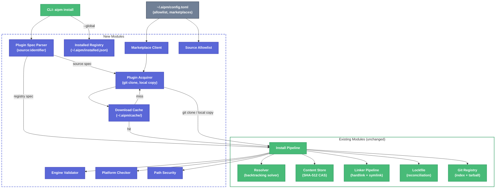

# Plugin Acquisition & Lifecycle Feature Parity — Technical Design Document

| Document Metadata      | Details                                |
| ---------------------- | -------------------------------------- |
| Author(s)              | selarkin                               |
| Status                 | Draft (WIP)                            |
| Team / Owner           | aipm                                   |
| Created / Last Updated | 2026-04-06                             |

## 1. Executive Summary

This RFC proposes adding **12 new capabilities** to aipm's plugin system to reach feature parity with a other tools. The additions cover: a download cache with TTL policies, multi-source plugin acquisition (GitHub, generic git, local, marketplace), a global installed plugin registry with engine scoping, plugin spec parsing (`source:identifier` format), engine validation, platform compatibility checking, path security validation, source redirects, a configurable source allowlist, and marketplace manifest support. These features are implemented using shallow git clones with system credential helpers (no vendor-specific APIs), TOML manifests (consistent with aipm conventions), and a new `~/.aipm/cache/` directory for download caching. The existing registry-based `name@version` format is preserved alongside the new source formats.

**Research basis:** [`research/docs/2026-04-06-plugin-system-feature-parity-analysis.md`](../research/docs/2026-04-06-plugin-system-feature-parity-analysis.md)

## 2. Context and Motivation

### 2.1 Current State

aipm's plugin system is a registry-backed package manager with:
- **Backtracking constraint solver** for semver-based dependency resolution (`crates/libaipm/src/resolver/`)
- **Content-addressable store** with SHA-512 hashing (`crates/libaipm/src/store/`)
- **Three-tier linking pipeline**: CAS -> hard-links -> directory symlinks/junctions (`crates/libaipm/src/linker/`)
- **Lockfile reconciliation** with `--locked` CI mode (`crates/libaipm/src/lockfile/`)
- **Workspace monorepo support** with transitive member resolution
- **Feature flags & dependency overrides** (global, scoped, replacement)
- **Git-based registry** with HTTP tarball downloads (`crates/libaipm/src/registry/git.rs`)

Packages are specified as `name@version` and resolved from a centralized registry index. There is no support for acquiring plugins directly from git repositories, local paths, or marketplace manifests.

### 2.2 The Problem

- **No direct git source support**: Users cannot install plugins directly from GitHub or other git hosts without first publishing to a registry.
- **No download cache**: Every `aipm install` re-downloads all non-local packages. No TTL-based freshness or offline mode.
- **No global install**: Every project must declare all plugins. No user-level default plugins.
- **No marketplace support**: Cannot browse or install from curated plugin collections.
- **No engine validation**: Plugins may be installed for engines they don't support, causing runtime failures.
- **No platform checking**: Plugins declare platform requirements but the runtime never checks them.
- **No source trust**: Any git source is trusted. No allowlist for CI environments.

## 3. Goals and Non-Goals

### 3.1 Functional Goals

- [ ] **G1**: Download cache with 5 policies (Auto, CacheOnly, SkipCache, ForceRefresh, CacheNoRefresh) + GC + per-entry TTL
- [ ] **G2**: Multi-source plugin spec parsing: `local:`, `github:`, `git:`, `market:` prefixes alongside existing `name@version`
- [ ] **G3**: Plugin acquisition from git repositories via shallow clone with system credential helper auth
- [ ] **G4**: Local plugin acquisition via filesystem copy with validation
- [ ] **G5**: Marketplace plugin acquisition from TOML-based marketplace manifests
- [ ] **G6**: Global installed plugin registry at `~/.aipm/installed.json` with engine scoping
- [ ] **G7**: Engine validation: `engines` field in `aipm.toml`, validate `aipm.toml` presence then fall back to engine-specific marker files
- [ ] **G8**: Platform compatibility checking at install time
- [ ] **G9**: Plugin path security validation (traversal, URL-encoded, absolute path rejection)
- [ ] **G10**: Source redirect support (1-level deep via `[package.source]` in `aipm.toml`)
- [ ] **G11**: Configurable source allowlist in `~/.aipm/config.toml` with CI enforcement
- [ ] **G12**: Git/local/marketplace source types in `aipm.toml` `[dependencies]` section

### 3.2 Non-Goals (Out of Scope)

- [ ] **No ADO Git-specific API integration** — All git hosts use the same shallow clone + credential helper path.
- [ ] **No built-in marketplace presets** — Marketplaces are user-configured only.
- [ ] **No new `PluginManager` struct** — Acquisition logic extends the existing install pipeline.
- [ ] **No separate acquisition crate** — All code lives in `crates/libaipm/`.
- [ ] **No vendor-specific download APIs** (GitHub Contents API, etc.) — Shallow git clone is the universal acquisition method.
- [ ] **No `git archive` support** — Not universally supported by git hosts.
- [ ] **No npm/pip source types** — Only git, local, and marketplace sources.

## 4. Proposed Solution (High-Level Design)

### 4.1 System Architecture



### 4.2 Architectural Pattern

- **Dual-path acquisition**: Registry packages flow through the existing `registry -> resolver -> store -> linker` pipeline. Source-based packages flow through `spec parser -> acquirer -> cache -> pipeline` then rejoin at the store/linker stage.
- **Cache-aside pattern**: The download cache sits alongside the CAS store. Cache handles freshness (TTL/policies); store handles content deduplication. They are independent modules.
- **Credential delegation**: All git authentication is delegated to the system's git credential helper. No auth logic in aipm.

### 4.3 Key Components

| Component | Responsibility | Module Path | Justification |
|---|---|---|---|
| Plugin Spec Parser | Parse `source:identifier` and `name@version` formats | `crates/libaipm/src/spec/` | Clean separation from manifest parsing |
| Download Cache | TTL-based caching with 5 policies, GC, per-entry TTL | `crates/libaipm/src/cache/` | Separate from CAS store (different purpose) |
| Plugin Acquirer | Shallow git clone, local copy, marketplace fetch | `crates/libaipm/src/acquirer/` | Replaces direct API calls with universal git approach |
| Installed Registry | Global plugin persistence with engine scoping | `crates/libaipm/src/installed/` | Distinct from project-level manifest |
| Engine Validator | Validate `aipm.toml` + engine marker files | `crates/libaipm/src/engine/` | Post-acquisition validation |
| Platform Checker | Runtime OS detection + compatibility check | `crates/libaipm/src/platform/` | Activates existing `environment.platforms` field |
| Path Security | Validated path type, traversal detection | `crates/libaipm/src/path_security/` | Security boundary for all path inputs |
| Marketplace Client | Parse marketplace TOML, resolve plugin entries | `crates/libaipm/src/marketplace/` | Marketplace-specific logic |
| Source Allowlist | Configurable trusted source patterns | `crates/libaipm/src/security/` | CI/CD enforcement |

## 5. Detailed Design

### 5.1 Plugin Spec Parser (`crates/libaipm/src/spec/`)

**Format:** Both formats coexist. The parser detects format by presence of a colon prefix.

```rust
/// Parsed plugin specification.
pub enum PluginSpec {
    /// Registry package: `name@version` or `name` (any version)
    Registry { name: String, version_req: Option<String> },
    /// Local filesystem: `local:./path/to/plugin`
    Local(ValidatedPath),
    /// Git repository: `git:https://github.com/org/repo:path/to/plugin@ref`
    ///                  `github:org/repo:path/to/plugin@ref` (sugar for git:)
    Git(GitPluginSource),
    /// Marketplace: `market:plugin-name@marketplace-location#ref`
    Marketplace(MarketplacePluginSource),
}
```

**Detection logic:**
1. If input contains `:` and the part before `:` is a known source type → parse as source spec
2. Known source types: `local`, `git`, `github`, `market`, `marketplace`, `mp`
3. Source type prefix is **case-insensitive**
4. Otherwise → parse as `name@version` registry spec
5. `github:` is sugar that expands to `git:https://github.com/{owner}/{repo}`

**Serde support:** `PluginSpec` implements `Serialize`/`Deserialize` via its `Display`/`FromStr` representations.

**Canonical key:** `canonical_key()` strips the `@ref` suffix for identity comparison. Two specs with the same canonical key but different refs are version-conflicting.

**Tests to implement (~35):**
- Parse each source type (local absolute/relative, git fully-qualified/no-ref, github, marketplace)
- Case-insensitive source prefix
- Invalid format (no colon, unknown source, empty identifier)
- Canonicalization (local path resolution)
- Display roundtrip
- Folder name derivation per source type
- Duplicate folder name detection (case-insensitive)
- Canonical key extraction (strips ref)

### 5.2 Download Cache (`crates/libaipm/src/cache/`)

**Location:** `~/.aipm/cache/`

**Structure:**
```
~/.aipm/cache/
  cache_index.json    # JSON index (locked during updates)
  entries/
    <uuid1>/         # Cached plugin content
    <uuid2>/
    ...
```

```rust
pub enum CachePolicy {
    /// Use cache if fresh (within TTL), otherwise fetch. Default.
    Auto,
    /// Only use cache; fail if not present.
    CacheOnly,
    /// Always fetch; never read or write cache.
    SkipCache,
    /// Always fetch and update cache.
    ForceRefresh,
    /// Use cache if present (ignore TTL), otherwise fetch and cache.
    CacheNoRefresh,
}

pub struct DownloadCache {
    root: PathBuf,
    policy: CachePolicy,
    ttl: Duration,
    gc_days: u64,
}
```

**Cache index entry:**
```rust
struct CacheEntry {
    spec: String,           // Cache key (plugin spec string)
    dir_name: String,       // UUID directory name under entries/
    fetched_at: u64,        // Unix timestamp
    last_accessed: u64,     // Unix timestamp
    installed: bool,        // GC-exempt if true
    ttl_secs: Option<u64>,  // Per-entry TTL override
}
```

**Operations:**
- `get(spec_key) -> Result<Option<PathBuf>>` — Check cache per policy
- `put(spec_key, source_dir, ttl_secs) -> Result<PathBuf>` — Store in cache
- `copy_to_session(spec_key, dest_dir, folder_name) -> Result<PathBuf>` — Copy to session
- `mark_installed(spec_key, installed) -> Result<()>` — Toggle GC exemption
- `set_entry_ttl(spec_key, ttl_secs) -> Result<()>` — Update per-entry TTL
- `gc() -> Result<()>` — Remove stale entries and unreferenced directories
- `with_policy(policy) -> Self` — Clone with different policy (shared root)

**File locking:** The cache index is read-modify-written under an OS-level exclusive lock on the index file itself. Uses the same `LockedFile` pattern — open the data file, acquire lock, read, modify, write, release on drop.

**Constants:**
- Default TTL: 24 hours (`86_400` seconds)
- Default GC threshold: 30 days
- Max plugin files: 500 (safety limit)

**Tests to implement (~18):**
- Policy roundtrip (serialize/parse all 5 variants)
- Cache miss returns None
- Put and get with content verification
- SkipCache always misses
- CacheOnly errors on miss
- ForceRefresh always misses even after put
- Stale entry (TTL=0) returns None
- Installed flag does not bypass TTL
- Copy to session with content verification
- UUID directory names are unique
- GC removes old entries
- Put replaces old entry directory
- GC removes unreferenced directories
- GC preserves recent unreferenced directories
- GC preserves installed entries
- Per-entry TTL overrides global
- `with_policy()` shares root directory
- `set_entry_ttl()` updates/clears stored TTL

### 5.3 Plugin Acquirer (`crates/libaipm/src/acquirer/`)

**Acquisition methods:**

#### 5.3.1 Local Source
```rust
pub fn acquire_local(path: &ValidatedPath, dest_dir: &Path) -> Result<PathBuf, AcquireError>
```
- Verify source directory exists and is a directory
- Copy contents to `dest_dir/<folder_name>/` using `fs_extra::dir::copy`
- Validate plugin structure (see 5.6)

#### 5.3.2 Git Source
```rust
pub fn acquire_git(source: &GitPluginSource, dest_dir: &Path) -> Result<PathBuf, AcquireError>
```
1. Check source allowlist (see 5.9)
2. Create temp directory
3. Run `git clone --depth=1 --branch <ref> <url> <temp_dir>` (omit `--branch` if no ref)
4. Auth is handled by the system git credential helper — aipm does not manage credentials
5. If `path` is specified, copy just that subdirectory to `dest_dir/<folder_name>/`; otherwise copy the entire clone
6. Delete the temp clone directory
7. Validate plugin structure (see 5.6)

**Error handling:**
- Clone failure → `AcquireError::GitClone { url, ref_, source }`
- Path not found in clone → `AcquireError::PathNotFound { path, git_ref }`
- Empty plugin directory → `AcquireError::EmptyPluginDirectory { path }`
- Too many files (>500) → `AcquireError::TooManyFiles { count, limit }`

#### 5.3.3 Source Redirect
After initial acquisition, check for `[package.source]` in the acquired plugin's `aipm.toml`:
```toml
[package.source]
type = "git"
url = "https://github.com/org/repo.git"
path = "plugins/my-plugin"   # optional subdirectory
```
If present:
1. Parse the redirect into a `GitPluginSource`
2. Delete the stub plugin directory
3. Re-acquire from the redirect target (max 1 redirect, no further redirects)

#### 5.3.4 Marketplace Source
See section 5.8.

### 5.4 Global Installed Registry (`crates/libaipm/src/installed/`)

**Location:** `~/.aipm/installed.json`

```rust
pub struct InstalledRegistry {
    pub plugins: Vec<InstalledPlugin>,
}

pub struct InstalledPlugin {
    pub spec: String,                        // Plugin spec string
    pub engines: Vec<String>,                // Empty = all engines
    pub cache_policy: Option<CachePolicy>,   // Per-plugin override
    pub cache_ttl_secs: Option<u64>,         // Per-plugin TTL
}
```

**CLI commands:**
```
aipm install --global <spec>              # Install for all engines
aipm install --global --engine claude <spec>  # Install for Claude only
aipm uninstall --global <spec>            # Full uninstall
aipm uninstall --global --engine claude <spec>  # Remove Claude only
aipm list --global                        # List globally installed plugins
```

**Install semantics:**
- New plugin → add entry
- Existing plugin + new engines → additive merge (deduplicate, case-insensitive)
- Existing plugin + empty engines → reset to "all engines"
- **Name conflict detection**: Case-insensitive folder name comparison across plugins on overlapping engines. Different specs with the same folder name and overlapping engines → error.

**Uninstall semantics:**
- Remove specific engine(s) from a plugin
- If "all engines" (`engines: []`), expand to explicit list first, then remove specified engines
- If no engines remain after removal → full uninstall (remove entry)

**Spec resolution:** `resolve_spec(identifier, engine_filter)`:
- If identifier contains `:` or `@` → treat as full spec, exact match
- Otherwise → folder name shorthand (case-insensitive)
- If ambiguous (multiple matches) and engine filter provided → narrow by engine
- If still ambiguous → error with list of candidates

**File locking:** Read-modify-write under file lock (same pattern as cache index).

**Tests to implement (~35):**
- Install new plugin
- Additive engine merge
- Empty engines resets to all
- Additive deduplicates
- Specific engine when already "all" is noop
- Uninstall existing / missing
- Uninstall engine from explicit list / from all / last engine removes plugin / missing plugin
- `applies_to()` for all engines / specific engine
- `plugins_for_engine()` filtering
- Serialization roundtrip
- Name conflict (same name, all engines = error)
- Name conflict allowed (non-overlapping engines)
- Name conflict (adding engine causes overlap)
- Name conflict (all vs specific)
- No conflict (same spec reinstall)
- No conflict (different names)
- Name conflict (case-insensitive)
- Resolve spec by exact match / folder name / ambiguous / disambiguated by engine / not found
- `engines_overlap()` variants
- Cache policy stored / updated / preserved / serialization roundtrip
- TTL stored with non-auto policy

### 5.5 Engine Validation (`crates/libaipm/src/engine/`)

```rust
pub enum PluginEngine {
    Claude,
    Copilot,
}

impl PluginEngine {
    /// Marker paths for this engine.
    pub fn marker_paths(&self) -> &'static [&'static str] {
        match self {
            PluginEngine::Claude => &[".claude-plugin/plugin.json"],
            PluginEngine::Copilot => &[
                "plugin.json",
                ".github/plugin/plugin.json",
                ".claude-plugin/plugin.json",
            ],
        }
    }

    /// Marketplace manifest path for this engine.
    pub fn marketplace_manifest_path(&self) -> &'static str {
        match self {
            PluginEngine::Claude => ".claude-plugin/marketplace.json",
            PluginEngine::Copilot => ".github/plugin/marketplace.json",
        }
    }
}
```

**Validation strategy (two-tier):**
1. **Primary**: Check for `aipm.toml` at plugin root. If present, read `engines` field and compare.
2. **Fallback**: If no `aipm.toml`, check engine-specific marker files. At least one marker must exist.

```rust
pub fn validate_plugin(plugin_dir: &Path, engine: PluginEngine) -> Result<(), ValidationError>
```

**`engines` field in `aipm.toml`:**
```toml
[package]
name = "my-plugin"
version = "1.0.0"
engines = ["claude", "copilot"]  # optional; omit for all engines
```

**Tests to implement (~8):**
- Valid plugin with `aipm.toml` and matching engine
- Valid plugin with `aipm.toml` and `engines` omitted (universal)
- Invalid: `aipm.toml` declares engines that don't include target
- Fallback: no `aipm.toml`, valid marker files
- Fallback: no `aipm.toml`, missing all markers
- Remote/async validation (callback-based)
- Human-readable error messages

### 5.6 Platform Compatibility (`crates/libaipm/src/platform/`)

```rust
pub fn current_platforms() -> Vec<Platform> { ... }

pub enum PlatformCompatibility {
    Universal,
    Compatible,
    Incompatible { declared: Vec<Platform>, current: Vec<Platform> },
}

pub fn check_platform_compatibility(manifest: &Manifest) -> PlatformCompatibility { ... }
```

Reads `environment.platforms` from the existing `Manifest` type. No new manifest fields needed — this activates the existing field.

**Tests to implement (~7):**
- Current platform detection
- Exactly one platform returned
- Universal when None/empty
- Compatible when current OS in list
- Incompatible when different OS
- Unknown platform = incompatible

### 5.7 Path Security (`crates/libaipm/src/path_security/`)

```rust
pub struct ValidatedPath(String);

impl ValidatedPath {
    pub fn new(path: impl AsRef<str>) -> Result<Self, PathValidationError> { ... }
    pub fn folder_name(&self) -> &str { ... }
}
```

**Validation rules:**
1. Non-empty
2. No `..` path components
3. No URL-encoded traversal (`%2e%2e`)
4. No absolute paths (Unix `/`, Windows `C:\`, UNC `\\`)
5. No null bytes

**Tests to implement (~11):**
- Empty path rejected
- Traversal at start / middle / URL-encoded
- Absolute path (Unix / Windows)
- Valid paths (simple, nested, deeply nested, dashes, underscores, dots)
- Construction + display + folder name extraction

### 5.8 Marketplace Client (`crates/libaipm/src/marketplace/`)

**Marketplace manifest format:** TOML file at engine-specific path within a marketplace repository.

```toml
# .claude-plugin/marketplace.toml (Claude)
# .github/plugin/marketplace.toml (Copilot)

[metadata]
plugin_root = "./plugins"  # optional base directory

[[plugins]]
name = "hello-skills"
source = "plugins/hello-skills-v1"  # relative path

[[plugins]]
name = "external-tool"
description = "An external plugin"
[plugins.source]
type = "git"
url = "https://github.com/org/repo.git"
path = "plugins/foo"
ref = "v2.0"
sha = "abc123def456..."
```

**Marketplace spec format:** `market:plugin-name@marketplace-location#ref`
- `@` separates plugin name from location
- `#ref` optionally pins the marketplace repo to a branch/tag/commit
- Location formats: `owner/repo` (GitHub short), `https://...` (full URL), `./path` (local)
- `#` in local paths is treated as literal (not a ref delimiter)

**Marketplace source types:**
- `RelativePath(String)` — path within the marketplace repo
- `Git { url, path, ref, sha }` — external git repository
- `Unsupported { source_type }` — npm, pip, etc. (descriptive error)

**Marketplace configuration:** User-defined in `~/.aipm/config.toml`:
```toml
[marketplaces]
community = "github.com/aipm-plugins/marketplace"
internal = "git.company.com/team/plugins"
```

**Tests to implement (~70):**
- Parse GitHub short format / URL / local paths
- Plugin name extraction / folder name
- Hash ref parsing / roundtrip / empty ref error
- Missing `@` / empty name / empty location errors
- Invalid URL types (gitlab, etc.)
- Whitespace handling
- Special characters in plugin names
- Multiple `@` symbols (username in URL)
- GitHub URL edge cases (missing repo, only domain, trailing slash)
- Local path `#` not treated as ref
- Windows drive letter paths
- Marketplace manifest parsing (basic, empty, invalid JSON, metadata/plugin_root)
- Source types (string, git object, url object, legacy aliases, unsupported)
- Source object edge cases (missing fields, empty strings)
- Mixed source types
- Source path normalization / traversal rejection

### 5.9 Source Allowlist (`crates/libaipm/src/security/`)

**Configuration:**
```toml
# ~/.aipm/config.toml
[security]
allowed_sources = [
    "github.com/my-org/*",
    "github.com/trusted-user/*",
    "git.company.com/*",
]
enforce_allowlist = false  # Set true in CI (or via AIPM_ENFORCE_ALLOWLIST=1)
```

**Behavior:**
- If `enforce_allowlist = true` or `AIPM_ENFORCE_ALLOWLIST=1` → reject sources not matching any pattern
- If `enforce_allowlist = false` (default) → warn but allow
- Pattern matching: glob-style with `*` wildcards, case-insensitive
- Local sources (`local:`) are always allowed
- Registry sources are always allowed (trust the registry)

**Tests to implement (~5):**
- Allowed source matches pattern
- Unknown source allowed when not enforced (warning only)
- Unknown source rejected when enforced
- Case-insensitive matching
- Local sources always allowed

### 5.10 Manifest Integration

**New dependency formats in `aipm.toml`:**

```toml
[dependencies]
# Existing registry format (unchanged)
my-package = "^1.0"

# Git source (new)
my-git-plugin = { git = "https://github.com/org/repo", path = "plugins/foo", ref = "main" }

# GitHub sugar (new)
my-gh-plugin = { github = "org/repo", path = "plugins/bar", ref = "v2.0" }

# Local source (new)
my-local-plugin = { path = "../my-plugin" }

# Marketplace source (new)
my-market-plugin = { marketplace = "community", name = "hello-skills", ref = "main" }
```

**Lockfile source format:**
```toml
[[package]]
name = "my-git-plugin"
version = "0.0.0"  # Git sources have no semver; use 0.0.0
source = "git+https://github.com/org/repo?path=plugins/foo&ref=main"
checksum = "sha512-..."
```

### 5.11 File Locking Pattern

New `LockedFile` utility (shared by cache and installed registry):

```rust
pub struct LockedFile { file: File }

impl LockedFile {
    pub fn open(path: &Path) -> Result<Self>;       // Open + exclusive lock
    pub fn read_content(&mut self) -> Result<String>; // Read all
    pub fn write_content(&mut self, content: &str) -> Result<()>; // Truncate + write
}
// Lock released on drop
```

Creates parent directories if needed. Locks the data file itself (not a separate `.lock` file).

## 6. Alternatives Considered

| Option | Pros | Cons | Reason for Rejection |
|---|---|---|---|
| **GitHub API for acquisition** | Faster for GitHub (file-level download) | Vendor-specific, needs separate auth per host | Shallow git clone is universal, auth delegated to credential helper |
| **ADO Git API support** | Parity with what other tools have proposed | Vendor lock-in, complex auth | Generic git + credential helper covers all hosts |
| **Built-in marketplace presets** | Better out-of-box experience | Hard-coded org names, maintenance burden | User-configured marketplaces are more flexible |
| **JSON marketplace manifest** | Compatible with what other tools have proposed | Inconsistent with aipm's TOML convention | TOML keeps the ecosystem consistent |
| **Sparse checkout for subdirectories** | Bandwidth-efficient | Requires git 2.25+, complex error handling | Clone + copy is simpler and universally compatible |
| **Separate acquisition crate** | Maximum modularity | Over-engineering for current scope | Extending the install pipeline is simpler |
| **Cache inside CAS store** | Single storage module | Mixes TTL semantics with content deduplication | Separate modules have clean responsibilities |

## 7. Cross-Cutting Concerns

### 7.1 Security and Privacy

- **Path traversal**: All plugin paths validated by `ValidatedPath` before filesystem operations. URL-encoded variants (`%2e%2e`) detected.
- **Source trust**: Configurable allowlist in `~/.aipm/config.toml`. CI enforcement via environment variable `AIPM_ENFORCE_ALLOWLIST=1`.
- **Credential safety**: No credentials stored by aipm. All git auth delegated to system credential helpers.
- **File permissions**: Temp directories created with 0o700 on Unix (owner-only access).

### 7.2 Observability

- **Logging**: All acquisition attempts logged with source type, duration, success/failure via `tracing`.
- **Cache hits/misses**: Logged at debug level with spec key.
- **GC results**: Logged at info level with count of removed entries.

### 7.3 Compatibility

- **Existing `name@version` format**: Fully preserved. No breaking changes to existing manifests or lockfiles.
- **Forward compatibility**: Unknown engine names preserved as `Unknown(String)`. Unknown platform values preserved. Unknown JSON/TOML keys in marketplace manifests silently ignored.
- **Cross-platform**: `LockedFile` uses `fs2::FileExt` for portable file locking. Directory links use symlinks on Unix, junctions on Windows (existing pattern).

## 8. Migration, Rollout, and Testing

### 8.1 Deployment Strategy

This is additive — no breaking changes. All new features are opt-in:
- Existing `name@version` dependencies continue to work unchanged
- New source types only activate when used in `aipm.toml` or CLI
- `--global` install is a new CLI flag
- Cache is transparent (Auto policy by default)

### 8.2 Test Plan

**Total new tests: ~180+** (matching other tools parity)

| Module | Unit Tests | Key Coverage Areas |
|---|---|---|
| Plugin Spec Parser | ~35 | All source types, edge cases, display roundtrip, canonical keys |
| Download Cache | ~18 | All 5 policies, GC, per-entry TTL, session copy, concurrent safety |
| Plugin Acquirer | ~12 | Local copy, git clone, source redirect, error cases |
| Installed Registry | ~35 | Install/uninstall, engine scoping, name conflicts, spec resolution |
| Engine Validator | ~8 | Two-tier validation, marker files, error messages |
| Platform Checker | ~7 | OS detection, compatibility results |
| Path Security | ~11 | Traversal, URL-encoded, absolute paths |
| Marketplace Client | ~70 | Spec parsing, manifest parsing, source types, edge cases |
| Source Allowlist | ~5 | Pattern matching, enforcement, local exemption |

**Integration tests:** Add to existing install pipeline tests:
- Acquire from local path + install
- Acquire from git (mock) + cache + install
- Global install + project install precedence
- Engine validation post-install

**BDD feature files to add:**
- `tests/features/registry/git-source.feature` — Git source acquisition scenarios
- `tests/features/registry/marketplace.feature` — Marketplace acquisition scenarios
- `tests/features/registry/global-install.feature` — Global install/uninstall scenarios
- `tests/features/registry/cache.feature` — Cache policy scenarios

## 9. Implementation Order

Recommended phased implementation (each phase is independently shippable):

| Phase | Modules | Estimated Tests | Depends On |
|---|---|---|---|
| **Phase 1: Foundation** | Path Security, File Locking (LockedFile), Platform Checker | ~18 | Nothing |
| **Phase 2: Cache** | Download Cache (all 5 policies, GC, TTL) | ~18 | Phase 1 (LockedFile) |
| **Phase 3: Spec Parser** | Plugin Spec Parser (all source types) | ~35 | Phase 1 (Path Security) |
| **Phase 4: Acquirer** | Local acquisition, Git acquisition, Source redirect | ~12 | Phase 1, 2, 3 |
| **Phase 5: Engine** | Engine Validator, `engines` field in manifest | ~8 | Phase 4 |
| **Phase 6: Installed Registry** | Global installed registry with engine scoping | ~35 | Phase 3, 5 |
| **Phase 7: Marketplace** | Marketplace manifest parsing, marketplace acquisition | ~70 | Phase 3, 4 |
| **Phase 8: Security** | Source allowlist, CI enforcement | ~5 | Phase 4 |
| **Phase 9: Integration** | Manifest `[dependencies]` integration, lockfile source format, BDD features | ~10+ | All |

## 10. Open Questions / Unresolved Issues

All open questions from the research document have been resolved through the wizard prompts:

- [x] **Cache architecture** → New module alongside store (resolved)
- [x] **Spec format** → Both `name@version` and `source:identifier` coexist (resolved)
- [x] **Git auth** → System credential helper (resolved)
- [x] **Engine model** → `engines` field in `aipm.toml` (resolved)
- [x] **Marketplace presets** → User-configured only (resolved)
- [x] **Global plugins** → `~/.aipm/installed.json` (resolved)
- [x] **Source trust** → Configurable allowlist in config (resolved)
- [x] **Acquisition method** → Shallow git clone for all hosts (resolved)
- [x] **Cache location** → `~/.aipm/cache/` (resolved)
- [x] **Validation strategy** → `aipm.toml` first, fall back to engine markers (resolved)
- [x] **Source redirects** → Yes, 1-level via `[package.source]` (resolved)
- [x] **Plugin manager** → Extend existing pipeline (resolved)
- [x] **Marketplace format** → TOML (resolved)
- [x] **Subdirectory extraction** → Clone then copy (resolved)
- [x] **Manifest source types** → Both manifest and CLI (resolved)
- [x] **Global + engine** → Optional `--engine` flag (resolved)

**No remaining open questions.** This spec is ready for implementation.
