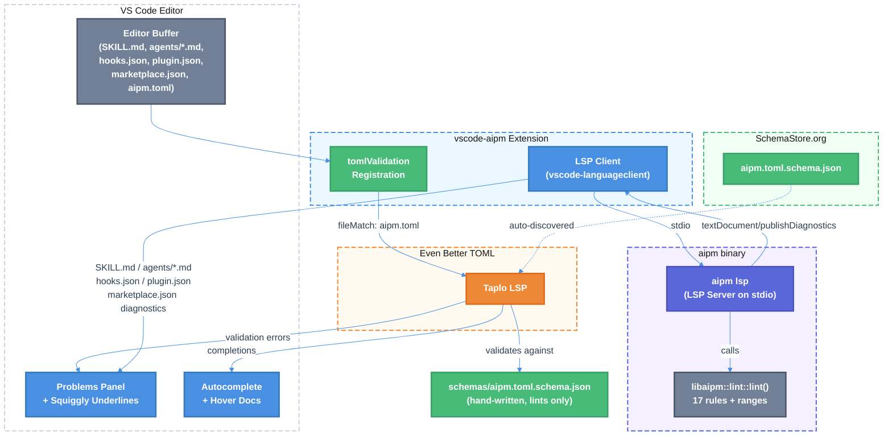

# VS Code Integration for `aipm lint` — Technical Design Document

| Document Metadata      | Details                                                    |
| ---------------------- | ---------------------------------------------------------- |
| Author(s)              | Sean Larkin                                                |
| Status                 | Draft (WIP)                                                |
| Team / Owner           | AIPM Core                                                  |
| Created / Last Updated | 2026-04-10 / 2026-04-10                                   |
| Related                | [GitHub Issue #377](https://github.com/TheLarkInn/aipm/issues/377), [Lint Command Spec](./2026-03-31-aipm-lint-command.md), [Lint Display UX Spec](./2026-04-03-lint-display-ux.md) |

---

## 1. Executive Summary

This RFC proposes full VS Code integration for `aipm lint` through four deliverables: (1) a hand-written JSON Schema covering only `[workspace.lints]` in `aipm.toml` — deliberately hiding other manifest sections from autocomplete, (2) a `vscode-aipm` VS Code extension that provides schema-driven validation/autocomplete for lint config via Taplo's `tomlValidation` contribution point AND surfaces `aipm lint` diagnostics as Problems panel entries with squiggly underlines, (3) populating `end_line`/`end_col` range fields in all lint rules that can produce them — enabling precise character-level highlighting instead of whole-line underlines, and (4) an `aipm lsp` subcommand implementing the Language Server Protocol for real-time diagnostic publishing, completions, and hover documentation. The schema is also submitted to SchemaStore.org for zero-install coverage across all editors with Taplo or Tombi.

**Research basis**: [research/docs/2026-04-10-377-vscode-support-aipm-lint.md](../research/docs/2026-04-10-377-vscode-support-aipm-lint.md)

---

## 2. Context and Motivation

### 2.1 Current State

`aipm lint` is a mature 17-rule linting system with config-driven severity overrides, ignore paths, and four output reporters (human, JSON, GitHub Actions, Azure DevOps). The `Diagnostic` struct ([`lint/diagnostic.rs:39-63`](../crates/libaipm/src/lint/diagnostic.rs#L39-L63)) carries `line`/`col`/`end_line`/`end_col` fields, but **`end_line` and `end_col` are always `None`** in all rule implementations. Only `plugin/broken-paths` populates `col`; all other rules either set `line: Some(field_line)` with `col: None` or `line: None` entirely.

The `aipm.toml` manifest is parsed via `toml::from_str::<Manifest>()` with `#[serde(deny_unknown_fields)]` ([`manifest/mod.rs:21`](../crates/libaipm/src/manifest/mod.rs#L21)), and the `[workspace.lints]` section is parsed separately via raw `toml::Value` navigation ([`main.rs:744-832`](../crates/aipm/src/main.rs#L744-L832)).

**No JSON Schema, VS Code extension, LSP server, `.taplo.toml` config, or SchemaStore submission exists today.** The technical design spec mentions a plan to "publish a JSON Schema via SchemaStore for IDE autocomplete via Taplo" ([`specs/2026-03-09-aipm-technical-design.md:310`](../specs/2026-03-09-aipm-technical-design.md#L310)), but no implementation has started.

### 2.2 The Problem

- **No IDE feedback**: Developers editing `aipm.toml` lint config get no autocomplete, no validation, and no error squiggles. Typos in rule IDs (e.g., `"skill/mising-name"`) silently become dead config.
- **No in-editor diagnostics**: When a developer creates a skill or opens a SKILL.md file with lint errors, those errors only surface when running `aipm lint` in the terminal. Other language ecosystems (TypeScript, Rust, Python/Ruff, ESLint) show problems inline as squiggly underlines the moment a file is opened or saved.
- **Imprecise ranges**: Even the JSON reporter emits `end_line: null` / `end_col: null` for every diagnostic, meaning any consumer would fall back to full-line highlighting rather than pinpointing the exact error span.
- **No standard schema**: Without a SchemaStore entry, no editor auto-discovers `aipm.toml` structure. Users must manually configure Taplo schema associations.

### 2.3 Why Now

The lint system has stabilized at 17 rules across 6 feature kinds with a well-defined config format. The `Diagnostic` struct already has range fields — they just need to be populated. The research ([`research/docs/2026-04-10-377-vscode-support-aipm-lint.md`](../research/docs/2026-04-10-377-vscode-support-aipm-lint.md)) confirms that Taplo's `tomlValidation` contribution point enables a declarative extension with minimal code, and that `libaipm::lint` is already decoupled from the CLI (filesystem-abstracted, structured output) — making an LSP wrapper straightforward.

---

## 3. Goals and Non-Goals

### 3.1 Functional Goals

- [ ] **G1**: Hand-written JSON Schema for `[workspace.lints]` in `aipm.toml` with autocomplete for all 17 rule IDs and severity/ignore config
- [ ] **G2**: SchemaStore.org submission so any Taplo/Tombi user gets validation and autocomplete with zero install
- [ ] **G3**: `vscode-aipm` VS Code extension that registers the schema via Taplo's `tomlValidation` contribution and publishes `aipm lint` diagnostics to the Problems panel
- [ ] **G4**: Populate `end_line`/`end_col` in frontmatter-based and line-scanning lint rules for precise error ranges
- [ ] **G5**: `aipm lsp` subcommand implementing LSP `textDocument/publishDiagnostics` for real-time inline diagnostics
- [ ] **G6**: LSP `textDocument/completion` for `aipm.toml` lint config (rule IDs, severity values)
- [ ] **G7**: LSP hover documentation for rule IDs showing rule name, default severity, and help URL

### 3.2 Non-Goals (Out of Scope)

- [ ] Schema coverage for `[package]`, `[workspace]`, `[dependencies]`, or any other `aipm.toml` section — deliberately hidden from autocomplete to limit feature exposure
- [ ] Auto-generated schema from Rust structs (e.g., `schemars` crate) — hand-written for precise control over what's exposed
- [ ] SARIF output format — deferred per the [Lint Display UX Spec](./2026-04-03-lint-display-ux.md)
- [ ] LSP features beyond diagnostics, completions, and hover (no go-to-definition, no code actions, no rename, no workspace symbols)
- [ ] Dependency resolution hints or cross-file reference validation in the LSP
- [ ] Support for editors other than VS Code (the schema + SchemaStore covers other editors; the extension is VS Code-specific)
- [ ] Custom TextMate grammar — `aipm.toml` is valid TOML; Taplo/Tombi provide syntax highlighting via standard `source.toml` scopes
- [ ] LSP support for component types not yet in the discovery system: `commands/*.md`, `.mcp.json`, `.lsp.json`, `output-styles/`, `scripts/`, `settings.json` — these require new `FeatureKind` variants and lint rules before VS Code integration adds value (see Section 5.1.4)

---

## 4. Proposed Solution (High-Level Design)

### 4.1 System Architecture Diagram



### 4.2 Architectural Pattern

Two complementary diagnostic channels:

1. **Schema-driven channel** (Taplo path): For `aipm.toml` lint config validation. The hand-written JSON Schema → Taplo LSP → VS Code diagnostics. Zero custom code; purely declarative.

2. **LSP-driven channel** (aipm lsp path): For all 6 plugin feature file types — `SKILL.md` (skills), `agents/<name>.md` (agents), `hooks/hooks.json` (hooks), `.ai/*/aipm.toml` (plugin manifests), `.ai/*/.claude-plugin/plugin.json` (plugin JSON), and `.ai/.claude-plugin/marketplace.json` (marketplace). The `aipm lsp` subcommand wraps `libaipm::lint::lint()` and publishes `textDocument/publishDiagnostics`. The VS Code extension connects via `vscode-languageclient`.

### 4.3 Key Components

| Component | Responsibility | Technology | Justification |
|---|---|---|---|
| `schemas/aipm.toml.schema.json` | JSON Schema for `[workspace.lints]` only | JSON Schema Draft 4 | Draft 4 for Taplo compatibility; hand-written for precise control over exposed surface |
| `vscode-aipm` extension | Registers schema, connects to LSP | TypeScript, `vscode-languageclient` | Standard VS Code extension API; Taplo `tomlValidation` for declarative schema binding |
| `aipm lsp` subcommand | LSP server for lint diagnostics | Rust, `tower-lsp` or `lsp-server` crate | Reuses `libaipm::lint` directly; `tower-lsp` for async-first LSP with minimal boilerplate |
| Range-populated rules | Precise `end_line`/`end_col` in diagnostics | Rust (existing rule implementations) | Enables character-level squiggly underlines instead of whole-line highlights |
| SchemaStore entry | Zero-install schema discovery | JSON catalog entry | Standard distribution; Taplo and Tombi auto-discover from SchemaStore |

### 4.4 Phased Delivery

| Phase | Deliverables | Dependencies |
|---|---|---|
| **Phase 1: Schema + Extension Shell** | Hand-written JSON Schema, `vscode-aipm` extension with `tomlValidation`, SchemaStore PR | None |
| **Phase 2: Range Population** | Populate `end_line`/`end_col` in frontmatter-based and line-scanning rules | None (can parallel Phase 1) |
| **Phase 3: LSP Server** | `aipm lsp` subcommand with `textDocument/publishDiagnostics`, `textDocument/completion`, `textDocument/hover` | Phase 2 (ranges needed for precise diagnostics) |
| **Phase 4: Extension LSP Client** | `vscode-aipm` connects to `aipm lsp` via stdio, activates on workspace detection | Phase 1 + Phase 3 |

---

## 5. Detailed Design

### 5.1 Feature File Inventory

The `discover_features()` function ([`discovery.rs:280`](../crates/libaipm/src/discovery.rs#L280)) classifies exactly 6 feature kinds by matching file names and parent directory names. The LSP server, VS Code extension document selector, and diagnostic publishing all operate against this fixed inventory.

#### 5.1.1 Feature Kind Reference

| Feature Kind | File Pattern | Source Contexts | Rules Applied |
|---|---|---|---|
| **Skill** | `skills/SKILL.md` (flat) or `skills/<name>/SKILL.md` (nested) | `.claude/`, `.github/`, `.ai/<plugin>/` | `skill/missing-name`, `skill/missing-description`, `skill/oversized`, `skill/name-too-long`, `skill/name-invalid-chars`, `skill/description-too-long`, `skill/invalid-shell`, `plugin/broken-paths` |
| **Agent** | `agents/<name>.md` — **any** `.md` file inside an `agents/` directory | `.claude/`, `.github/`, `.ai/<plugin>/` | `agent/missing-tools`, `source/misplaced-features` |
| **Hook** | `hooks/hooks.json` | `.claude/`, `.github/`, `.ai/<plugin>/` | `hook/unknown-event`, `hook/legacy-event-name`, `source/misplaced-features` |
| **Plugin** | `.ai/<plugin>/aipm.toml` — grandparent must be `.ai/` | `.ai/` only | `plugin/broken-paths` |
| **Marketplace** | `.ai/.claude-plugin/marketplace.json` | `.ai/` only | `marketplace/source-resolve`, `marketplace/plugin-field-mismatch`, `plugin/missing-registration`, `plugin/missing-manifest` |
| **PluginJson** | `.ai/<plugin>/.claude-plugin/plugin.json` | `.ai/` only | `plugin/required-fields` |

**Critical note on Agent files**: The discovery classifier matches `*.md` in `agents/`, not a fixed name like `AGENT.md`. Agent files can be named `reviewer.md`, `planner.md`, `coder.md`, etc. The VS Code extension `documentSelector` must use `**/agents/*.md`, not `**/AGENT.md`.

#### 5.1.2 LSP Highlight Target by Feature Kind

The precision of inline squiggly underlines depends on where the rule's diagnostic points:

| Feature Kind | Typical Diagnostic Target | Inline Squiggle? | Notes |
|---|---|---|---|
| **Skill** | Specific frontmatter field (e.g., `name: inv@lid!`) | Yes — after Phase 2 range work | `Frontmatter.field_lines` provides field-level positions |
| **Agent** | `tools` frontmatter field | Yes — after Phase 2 range work | Same frontmatter mechanism as Skill |
| **Hook** | Event string value in JSON | Yes — after Phase 2 range work | Line-scan to locate the event string |
| **Plugin** | `${CLAUDE_SKILL_DIR}/missing-file` path reference | Yes — already has `col`, needs `end_col` | `plugin/broken-paths` already tracks column |
| **Marketplace** | Directory missing — no source line | File-level only | Diagnostic points to the `.json` file, no inline range |
| **PluginJson** | Missing required JSON field | File-level only (JSON position tracking not yet implemented) | Future: parse JSON to find key positions |

#### 5.1.3 Source Context Directories

The walker recognizes three source directory types ([`discovery.rs:188-211`](../crates/libaipm/src/discovery.rs#L188-L211)):

| Source Context | Directory | Notes |
|---|---|---|
| `.claude` | `.claude/` | Claude Code tool-specific features |
| `.github` | `.github/` | GitHub Copilot tool-specific features |
| `.ai` | `.ai/<plugin>/` | Marketplace plugin features — canonical home |

#### 5.1.4 Feature Kinds Not Yet Supported

These component types appear in the `Components` manifest struct and/or the `source/misplaced-features` `FEATURE_DIRS` list but are **not yet a `FeatureKind`** in the discovery system — meaning no dedicated lint rules validate their content:

| Component | File Pattern | Status |
|---|---|---|
| **Commands** | `commands/*.md` | Tracked by `source/misplaced-features` rule. Described as "legacy skill format" in the manifest ([`manifest/types.rs:163`](../crates/libaipm/src/manifest/types.rs#L163)). No `FeatureKind::Command`, no content rules. |
| **MCP Servers** | `.mcp.json` | Referenced in `Components.mcp_servers`. Not discovered or linted. |
| **LSP Servers** | `.lsp.json` | Referenced in `Components.lsp_servers`. Not discovered or linted. |
| **Output Styles** | `output-styles/` | Directory tracked by `source/misplaced-features`. No content rules. |
| **Scripts** | `scripts/` | Referenced in `Components.scripts`. Not discovered or linted. |
| **Settings** | `settings.json` | Referenced in `Components.settings`. Not discovered or linted. |

These are **not included in the LSP document selector** for this release. Each would require a new `FeatureKind` variant, new lint rules, and range computation before VS Code integration makes sense.

---

### 5.2 JSON Schema for `[workspace.lints]`

**File**: `schemas/aipm.toml.schema.json`

The schema deliberately covers ONLY the `[workspace.lints]` section. All other top-level keys use `additionalProperties: true` to avoid validation errors and to suppress autocomplete for features we don't want to expose yet.

**Schema structure:**

```json
{
  "$schema": "http://json-schema.org/draft-04/schema#",
  "$id": "https://raw.githubusercontent.com/TheLarkInn/aipm/main/schemas/aipm.toml.schema.json",
  "title": "aipm.toml",
  "description": "Configuration file for the AI Package Manager (aipm)",
  "type": "object",
  "additionalProperties": true,
  "properties": {
    "workspace": {
      "type": "object",
      "additionalProperties": true,
      "properties": {
        "lints": {
          "type": "object",
          "description": "Lint rule configuration. Keys are rule IDs, values are severity overrides or detailed config.",
          "properties": {
            "ignore": {
              "type": "object",
              "description": "Global ignore configuration for lint rules.",
              "properties": {
                "paths": {
                  "type": "array",
                  "description": "Glob patterns for files/directories to exclude from all lint rules.",
                  "items": {
                    "type": "string",
                    "description": "Glob pattern (e.g., \"vendor/**\", \"third_party/**\")"
                  }
                }
              },
              "additionalProperties": false
            }
          },
          "patternProperties": {
            "^skill/missing-name$|^skill/missing-description$|^skill/oversized$|^skill/name-too-long$|^skill/name-invalid-chars$|^skill/description-too-long$|^skill/invalid-shell$|^plugin/broken-paths$|^agent/missing-tools$|^hook/unknown-event$|^hook/legacy-event-name$|^source/misplaced-features$|^marketplace/source-resolve$|^marketplace/plugin-field-mismatch$|^plugin/missing-registration$|^plugin/missing-manifest$|^plugin/required-fields$": {
              "oneOf": [
                {
                  "type": "string",
                  "enum": ["allow", "warn", "warning", "error", "deny"],
                  "description": "Simple severity override: 'allow' suppresses the rule, 'warn'/'warning' sets advisory, 'error'/'deny' sets blocking."
                },
                {
                  "type": "object",
                  "description": "Detailed rule override with severity and per-rule ignore paths.",
                  "properties": {
                    "level": {
                      "type": "string",
                      "enum": ["allow", "warn", "warning", "error", "deny"],
                      "description": "Severity level for this rule."
                    },
                    "ignore": {
                      "type": "array",
                      "description": "Glob patterns to exclude from this specific rule.",
                      "items": {
                        "type": "string"
                      }
                    }
                  },
                  "required": ["level"],
                  "additionalProperties": false
                }
              ]
            }
          },
          "additionalProperties": false
        }
      }
    }
  }
}
```

**Key design decisions:**

1. **`additionalProperties: true`** at the root and on `workspace` — allows `[package]`, `[dependencies]`, `[workspace.members]`, etc. to exist without validation errors or autocomplete suggestions. Only `[workspace.lints]` lights up.

2. **`additionalProperties: false`** on `lints` — catches typos in rule IDs. A mistyped `"skill/mising-name"` would produce a schema validation error in Taplo.

3. **`patternProperties` with explicit rule ID regex** — enumerates all 17 rule IDs so Taplo can offer autocomplete when typing inside `[workspace.lints]`. The regex is verbose but explicit; as rules are added, this list is updated.

4. **`oneOf` for rule values** — supports both simple string overrides (`"allow"`, `"error"`) and detailed objects (`{ level = "warn", ignore = ["legacy/**"] }`).

5. **JSON Schema Draft 4** — Taplo targets Draft 4 ([research](../research/docs/2026-04-10-377-vscode-support-aipm-lint.md#3-vs-code-extension-ecosystem-for-toml)). Avoid Draft 7+ features.

**Taplo extension fields** (`x-taplo`): Add `x-taplo` annotations for richer IDE behavior:

```json
{
  "x-taplo": {
    "initKeys": ["workspace.lints"]
  }
}
```

This prompts Taplo to auto-generate `[workspace.lints]` when a user starts typing in a new `aipm.toml`.

### 5.3 SchemaStore Submission

Submit a PR to [`SchemaStore/schemastore`](https://github.com/SchemaStore/schemastore) with:

1. **Schema file**: `src/schemas/json/aipm.toml.json` — the same schema from Section 5.1
2. **Catalog entry** in `src/api/json/catalog.json`:
   ```json
   {
     "name": "aipm.toml",
     "description": "AI Package Manager configuration",
     "fileMatch": ["aipm.toml"],
     "url": "https://json.schemastore.org/aipm.toml.json"
   }
   ```
3. **Positive test file**: `src/test/aipm.toml/valid.toml` — valid `aipm.toml` with lint config
4. **Negative test file**: `src/test/aipm.toml/invalid.toml` — `aipm.toml` with unknown rule ID

Once merged, Taplo and Tombi auto-discover the schema for any file named `aipm.toml`. This provides zero-install coverage for all editors.

### 5.4 Range Population in Lint Rules

Currently `end_line` and `end_col` are `None` in all 17 rules. Populating them enables precise character-level highlighting in VS Code (and the human reporter's `annotate-snippets` rendering).

#### 5.4.1 Range Sources by Rule Category

| Category | Rules | Range Source | Effort |
|---|---|---|---|
| **Frontmatter field rules** | `skill/missing-name`, `skill/missing-description`, `skill/name-too-long`, `skill/name-invalid-chars`, `skill/description-too-long`, `skill/invalid-shell`, `agent/missing-tools` | `Frontmatter.field_lines` gives the line; scan the line content for the value portion after `:` to compute `col`, `end_col` | Medium |
| **Frontmatter missing rules** | `skill/missing-name`, `skill/missing-description` (when field is absent) | Point to `Frontmatter.end_line` (the closing `---`); range is the entire delimiter line | Low |
| **Line-scanning rules** | `plugin/broken-paths` | Already has `col`; compute `end_col` as `col + matched_path.len()` | Low |
| **File-level rules** | `skill/oversized` | `line: 1, col: 1, end_line: 1, end_col: 1` (file-level marker) | Low |
| **JSON-based rules** | `hook/unknown-event`, `hook/legacy-event-name` | Parse JSON to find the key position; use line-by-line scanning to locate the event string | Medium |
| **Directory-level rules** | `source/misplaced-features`, `marketplace/*`, `plugin/missing-registration`, `plugin/missing-manifest`, `plugin/required-fields` | No source file to underline — `line: None` remains appropriate; VS Code shows these as file-level diagnostics | N/A |

#### 5.4.2 Frontmatter Range Computation

The `Frontmatter` struct ([`frontmatter.rs:14-26`](../crates/libaipm/src/frontmatter.rs#L14-L26)) already tracks:
- `field_lines: BTreeMap<String, usize>` — 1-based line number per field key
- `fields: BTreeMap<String, String>` — raw values per field key

To compute precise ranges for a field like `name: my-skill`:

```
Line content:  "name: my-skill"
               ^col=1          ^end_col=15
```

For **field-exists-but-invalid-value** rules (e.g., `skill/name-invalid-chars`):
- `line` = `field_lines["name"]`
- `col` = index of first char after `": "` + 1 (1-based)
- `end_line` = same line (frontmatter values are single-line for these fields)
- `end_col` = `col + value.len()`

For **field-missing** rules (e.g., `skill/missing-name` when `name` is absent):
- `line` = `end_line` (the closing `---` delimiter)
- `col` = `1`
- `end_line` = same
- `end_col` = `4` (length of `---`)

#### 5.4.3 Implementation: Shared Range Helper

Add a helper function to the frontmatter module or a shared lint utility:

```rust
/// Compute the 1-based (col, end_col) for a field's value on its line.
///
/// Given line content like `"name: my-skill"`, returns `(7, 15)` —
/// the column range of `"my-skill"`.
pub fn field_value_range(line_content: &str, key: &str) -> Option<(usize, usize)> {
    let prefix = format!("{}:", key);
    let after_colon = line_content.find(&prefix)
        .map(|i| i + prefix.len())?;
    let trimmed_start = line_content[after_colon..]
        .find(|c: char| !c.is_whitespace())
        .map(|i| after_colon + i)?;
    let value_len = line_content[trimmed_start..].trim_end().len();
    // 1-based columns
    Some((trimmed_start + 1, trimmed_start + value_len))
}
```

#### 5.4.4 `broken_paths` End Column

The `broken_paths` rule ([`rules/broken_paths.rs:79,134`](../crates/libaipm/src/lint/rules/broken_paths.rs)) already computes `col`. Adding `end_col`:

```rust
// Current: col: Some(col_offset + pos + 1)
// Add:     end_col: Some(col_offset + pos + 1 + matched_ref.len())
```

Where `matched_ref` is the `${CLAUDE_SKILL_DIR}/path` string that was matched.

#### 5.4.5 Hook Event Rules

For `hook/unknown-event` and `hook/legacy-event-name`, the rules currently set `line: None` when the event string is found. To add ranges:

1. Read the JSON content line-by-line
2. For each line, check if it contains the event string
3. Set `line` to the 1-based line number, `col` to the position of the event string, `end_col` to `col + event.len()`

This is a simple string scan — no JSON parser needed for position tracking.

### 5.5 `aipm lsp` Subcommand

#### 5.5.1 CLI Interface

```
aipm lsp [--stdio]
```

The LSP server communicates over stdio (standard for VS Code integration). The `--stdio` flag is the default and only transport initially (TCP/socket can be added later).

#### 5.5.2 LSP Crate Selection

**Recommended: `tower-lsp`** — async-first LSP framework built on `tower`. Provides:
- Async trait for handling LSP requests/notifications
- Built-in stdio transport
- JSON-RPC message framing
- Type-safe LSP types via `lsp-types` crate

Alternative: `lsp-server` (used by rust-analyzer) — synchronous, lower-level, more control but more boilerplate.

**New dependencies** (in `crates/aipm/Cargo.toml`):
```toml
tower-lsp = "0.20"
tokio = { version = "1", features = ["io-std", "macros", "rt-multi-thread"] }
```

`libaipm` gains no new dependencies — the LSP wrapper lives entirely in the `aipm` binary crate.

#### 5.5.3 Server Capabilities

The LSP server advertises these capabilities in `initialize`:

```json
{
  "capabilities": {
    "textDocumentSync": {
      "openClose": true,
      "change": 1,
      "save": { "includeText": false }
    },
    "completionProvider": {
      "triggerCharacters": ["\"", "/", "="],
      "resolveProvider": false
    },
    "hoverProvider": true,
    "diagnosticProvider": {
      "interFileDependencies": true,
      "workspaceDiagnostics": false
    }
  }
}
```

#### 5.5.4 Diagnostic Publishing Flow

```
1. Client sends textDocument/didOpen or textDocument/didSave
2. Server detects the workspace root (walks up to find aipm.toml)
3. Server loads lint config from aipm.toml [workspace.lints]
4. Server calls libaipm::lint::lint(Options { dir, config, .. })
5. Server converts Vec<Diagnostic> -> grouped by file_path
6. For each file with diagnostics:
   a. Convert Diagnostic to lsp_types::Diagnostic:
      - line/col/end_line/end_col -> Range (0-based for LSP)
      - severity -> DiagnosticSeverity::Error or Warning
      - rule_id -> code (NumberOrString::String)
      - help_url -> code_description.href
      - message -> message
      - source: "aipm"
   b. Publish via textDocument/publishDiagnostics
7. For files with no diagnostics, publish empty diagnostics (clears stale problems)
```

**Coordinate conversion**: LSP uses 0-based line/column; `Diagnostic` uses 1-based. The conversion:
```rust
fn to_lsp_range(d: &Diagnostic) -> lsp_types::Range {
    let start_line = d.line.unwrap_or(1).saturating_sub(1) as u32;
    let start_col = d.col.unwrap_or(1).saturating_sub(1) as u32;
    let end_line = d.end_line.unwrap_or_else(|| d.line.unwrap_or(1)).saturating_sub(1) as u32;
    let end_col = d.end_col.unwrap_or_else(|| {
        // If no end_col, highlight to end of line (use a large number; client clips)
        u32::MAX
    }).saturating_sub(1) as u32;
    lsp_types::Range {
        start: lsp_types::Position { line: start_line, character: start_col },
        end: lsp_types::Position { line: end_line, character: end_col },
    }
}
```

When `line` is `None` (directory-level diagnostics), the diagnostic maps to `Range { start: (0, 0), end: (0, 0) }` — VS Code displays this as a file-level diagnostic in the Problems panel without an inline squiggly.

#### 5.5.5 Completion Provider

Completions fire inside `aipm.toml` files within the `[workspace.lints]` section:

1. **Rule ID completions**: When the cursor is at a key position under `[workspace.lints]`, offer all 17 rule IDs with descriptions:
   ```
   "skill/missing-name"        # SKILL.md lacks name frontmatter
   "skill/missing-description"  # SKILL.md lacks description frontmatter
   "hook/unknown-event"         # Hook event not in known events list
   ...
   ```

2. **Severity value completions**: When the cursor is at a value position, offer `"allow"`, `"warn"`, `"error"`, `"deny"`, `"warning"`.

3. **Detailed object completions**: After typing `{`, offer `level` and `ignore` keys.

The completion provider uses the document text and cursor position to determine context (inside `[workspace.lints]`, at a key vs. value position). This is simple string-based context detection — no full TOML parser needed in the LSP.

#### 5.5.6 Hover Provider

When hovering over a rule ID string in `aipm.toml`, the LSP returns:

```markdown
**skill/missing-name** (Warning)

SKILL.md lacks `name` frontmatter field.

[Rule documentation](https://github.com/TheLarkInn/aipm/blob/main/docs/rules/skill-missing-name.md)
```

The hover data comes from the `Rule` trait's `name()`, `default_severity()`, `help_text()`, and `help_url()` methods. The LSP instantiates all rules at startup to build a lookup table.

#### 5.5.7 Workspace Detection

The LSP server finds the workspace root by walking up from the opened file's directory, looking for `aipm.toml`. This matches how `aipm lint` itself operates when given a directory.

For multi-root VS Code workspaces, the server handles each root independently — each root with an `aipm.toml` gets its own lint context.

### 5.6 VS Code Extension (`vscode-aipm`)

#### 5.6.1 Extension Structure

```
vscode-aipm/
  package.json          # Extension manifest
  src/
    extension.ts        # Activation, LSP client setup
  schemas/
    aipm.toml.schema.json  # Bundled JSON Schema (copy from schemas/)
  .vscodeignore
  tsconfig.json
```

#### 5.6.2 `package.json` Manifest

```json
{
  "name": "vscode-aipm",
  "displayName": "aipm — AI Package Manager",
  "description": "Lint diagnostics, autocomplete, and validation for aipm projects",
  "version": "0.1.0",
  "publisher": "thelarkin",
  "license": "MIT",
  "engines": { "vscode": "^1.85.0" },
  "categories": ["Linters", "Programming Languages"],
  "activationEvents": [
    "workspaceContains:**/aipm.toml"
  ],
  "extensionDependencies": [
    "tamasfe.even-better-toml"
  ],
  "main": "./out/extension.js",
  "contributes": {
    "tomlValidation": [{
      "fileMatch": "aipm.toml",
      "url": "./schemas/aipm.toml.schema.json"
    }],
    "configuration": {
      "title": "aipm",
      "properties": {
        "aipm.lint.enable": {
          "type": "boolean",
          "default": true,
          "description": "Enable aipm lint diagnostics"
        },
        "aipm.path": {
          "type": "string",
          "default": "aipm",
          "description": "Path to the aipm binary"
        }
      }
    }
  },
  "dependencies": {
    "vscode-languageclient": "^9.0.0"
  }
}
```

**Key points:**
- `activationEvents: ["workspaceContains:**/aipm.toml"]` — only activates when an `aipm.toml` exists in the workspace
- `extensionDependencies: ["tamasfe.even-better-toml"]` — ensures Taplo is installed for schema-driven `aipm.toml` validation
- `tomlValidation` contribution — declaratively registers the schema with Taplo
- `aipm.path` setting — allows users to specify a custom `aipm` binary location

#### 5.6.3 Extension Activation (`extension.ts`)

```typescript
import { workspace, ExtensionContext } from 'vscode';
import {
  LanguageClient,
  LanguageClientOptions,
  ServerOptions,
  TransportKind,
} from 'vscode-languageclient/node';

let client: LanguageClient;

export function activate(context: ExtensionContext) {
  const config = workspace.getConfiguration('aipm');
  if (!config.get<boolean>('lint.enable', true)) return;

  const aipmPath = config.get<string>('path', 'aipm');

  const serverOptions: ServerOptions = {
    command: aipmPath,
    args: ['lsp', '--stdio'],
    transport: TransportKind.stdio,
  };

  const clientOptions: LanguageClientOptions = {
    documentSelector: [
      // Skill files — flat layout (.claude/skills/SKILL.md)
      { scheme: 'file', pattern: '**/skills/SKILL.md' },
      // Skill files — nested layout (.claude/skills/default/SKILL.md)
      { scheme: 'file', pattern: '**/skills/*/SKILL.md' },
      // Agent files — any *.md inside an agents/ directory (NOT a fixed name like AGENT.md)
      { scheme: 'file', pattern: '**/agents/*.md' },
      // Hook config — hooks.json inside a hooks/ directory
      { scheme: 'file', pattern: '**/hooks/hooks.json' },
      // Plugin manifests — aipm.toml directly under .ai/<plugin>/  (grandparent = .ai/)
      { scheme: 'file', pattern: '**/.ai/*/aipm.toml' },
      // Plugin JSON manifests — .ai/<plugin>/.claude-plugin/plugin.json
      { scheme: 'file', pattern: '**/.claude-plugin/plugin.json' },
      // Marketplace manifest — .ai/.claude-plugin/marketplace.json
      { scheme: 'file', pattern: '**/.ai/.claude-plugin/marketplace.json' },
    ],
  };

  client = new LanguageClient(
    'aipm',
    'aipm Language Server',
    serverOptions,
    clientOptions,
  );

  client.start();
}

export function deactivate(): Thenable<void> | undefined {
  return client?.stop();
}
```

The extension spawns `aipm lsp --stdio` as a child process and connects via the standard `vscode-languageclient` library. The `documentSelector` covers all 6 feature kinds from the discovery schema (see Section 5.1.1) using the precise file-name and parent-directory patterns that match the classifier in [`discovery.rs:233`](../crates/libaipm/src/discovery.rs#L233). The agent pattern `**/agents/*.md` is intentionally broad — agent files can have any name (e.g., `reviewer.md`, `planner.md`), not a fixed `AGENT.md`.

#### 5.6.4 Diagnostic Flow (End-to-End)

The LSP publishes diagnostics for **all 6 feature kinds** whenever a matching document is opened or saved. Here is the complete flow:

```
1. Developer opens project containing aipm.toml
2. VS Code activates vscode-aipm extension (workspaceContains:**/aipm.toml trigger)
3. Extension spawns `aipm lsp --stdio` child process
4. LSP client sends initialize, initialized

--- On any document open/save matching the documentSelector ---

5. Developer opens one of:
     .ai/my-plugin/skills/default/SKILL.md      (Skill)
     .ai/my-plugin/agents/reviewer.md            (Agent — note: not AGENT.md)
     .claude/hooks/hooks.json                    (Hook)
     .ai/my-plugin/aipm.toml                     (Plugin manifest)
     .ai/my-plugin/.claude-plugin/plugin.json    (PluginJson)
     .ai/.claude-plugin/marketplace.json         (Marketplace)

6. VS Code sends textDocument/didOpen to LSP server

7. LSP server:
   a. Finds workspace root (walks up to find root aipm.toml)
   b. Loads [workspace.lints] config from root aipm.toml
   c. Calls libaipm::lint::lint() on the full workspace
   d. Groups all resulting diagnostics by file_path
   e. For each file with diagnostics:
      - Converts Diagnostic (1-based) -> lsp_types::Diagnostic (0-based)
      - Maps severity, rule_id as code, help_url as code_description.href
      - Sets range from line/col/end_line/end_col (falls back to full-line when end_* = None)
      - Sends textDocument/publishDiagnostics for that URI
   f. For files with no diagnostics, publishes empty [] to clear stale markers

8. VS Code renders per file kind:
   Skill/Agent:
     - Squiggly under exact frontmatter field (e.g., "name: inv@lid!")
     - Problems: "skill/name-invalid-chars: name contains invalid characters"
   Hook:
     - Squiggly under the unknown event string in hooks.json
     - Problems: "hook/unknown-event: unknown hook event 'PreToolUse'"
   Plugin (aipm.toml):
     - Squiggly under ${CLAUDE_SKILL_DIR}/broken-path reference
     - Problems: "plugin/broken-paths: path does not exist"
   PluginJson / Marketplace:
     - File-level Problems entry (no inline squiggle — directory/structural rules)
     - Problems: "plugin/required-fields: plugin.json missing required field: version"

9. Developer saves after fixing
10. textDocument/didSave triggers re-lint (full workspace re-run)
11. Diagnostics clear if resolved; new diagnostics appear if new issues introduced
```

**Two layers for `aipm.toml` files**: When the developer edits `[workspace.lints]` in `aipm.toml`, they get:
- **Taplo** validates the TOML against the JSON Schema (catches unknown rule IDs, wrong severity values)
- **aipm lsp** re-lints the workspace and can report if a suppressed rule ID no longer matches any known rule

---

## 6. Alternatives Considered

| Option | Pros | Cons | Reason for Rejection |
|---|---|---|---|
| **Auto-generated schema (schemars)** | Always in sync with Rust structs; less manual maintenance | Exposes ALL manifest fields (package, dependencies, etc.) which we deliberately want to hide; `x-taplo` annotations require manual post-processing anyway | User decision: only lint config should be surfaced; hand-written gives precise control |
| **Extension spawns `aipm lint --reporter json` (no LSP)** | Simpler; no new Rust dependencies; works immediately | No live diagnostics (only on save); no completions or hover; cold-start latency spawning process per save; harder to clear stale diagnostics | Suitable for v1 but lacks the real-time feel of a proper LSP; user requested LSP as a goal |
| **Fork Taplo (Pipelex approach)** | Full control over TOML parsing, custom semantic tokens, domain-specific language support | Massive engineering effort; maintenance burden of a full LSP fork; `aipm.toml` is standard TOML | Vastly overengineered; standard Taplo + JSON Schema covers TOML validation completely |
| **Custom TextMate grammar** | Could highlight `aipm.toml`-specific syntax differently | `aipm.toml` is standard TOML; Taplo already provides `source.toml` scopes; a custom grammar would conflict | No custom syntax to highlight; TOML grammar is sufficient |
| **Tombi instead of Taplo** | Newer, better schema-based sorting, active development | Smaller user base (Taplo has 5M+ installs); `tomlValidation` contribution point is Taplo-specific | Schema approach works with both via SchemaStore; extension declares Taplo as dependency since it has the contribution point API |
| **SARIF output + VS Code SARIF Viewer** | Standard format; VS Code extension exists | SARIF Viewer is read-only (no inline squiggles); complex schema; no live re-analysis | Doesn't provide the inline diagnostic experience we want |

---

## 7. Cross-Cutting Concerns

### 7.1 Performance

- **LSP startup**: `aipm lsp` should initialize in <100ms. The lint rule registry is constructed once at startup. Workspace root detection is a single directory walk.
- **Re-lint latency**: After `textDocument/didSave`, the full lint pass should complete in <500ms for typical projects (dozens of features). The single-pass discovery + rule dispatch is already optimized for this.
- **Debouncing**: The LSP server should debounce rapid save events (e.g., 300ms delay) to avoid redundant lint passes during batch saves.
- **Incremental linting**: Out of scope for v1. The full workspace is re-linted on every trigger. For large projects, file-level caching keyed on file mtime could be added later.

### 7.2 Error Handling

- **`aipm` binary not found**: The VS Code extension should detect if `aipm lsp` fails to start and show a notification: "aipm binary not found. Install aipm or set `aipm.path` in settings."
- **`aipm.toml` missing**: The LSP server should handle workspaces without `aipm.toml` gracefully — publish empty diagnostics, log a trace-level message.
- **Rule panics**: Since the codebase forbids `unsafe` and denies `unwrap`/`expect`/`panic!`, rule execution failures surface as `Result::Err`, which the LSP converts to a server-level log rather than a crash.

### 7.3 Testing Strategy

| Layer | Test Type | Description |
|---|---|---|
| JSON Schema | JSON Schema test suite | Positive/negative TOML fixtures validated against the schema (required for SchemaStore) |
| Range population | Unit tests per rule | Each modified rule gets tests asserting `end_line`/`end_col` values for known inputs |
| LSP server | Integration tests | Spawn `aipm lsp`, send LSP messages over stdio, assert diagnostic responses. Use `lsp-types` for message construction. |
| VS Code extension | E2E tests | VS Code extension testing framework (`@vscode/test-electron`); open a fixture workspace, verify Problems panel entries |
| Human reporter | Snapshot tests | Verify that populated ranges produce correct `annotate-snippets` output (existing reporter tests cover this path) |

### 7.4 Compatibility

- **VS Code version**: `^1.85.0` (required for current `vscode-languageclient` v9)
- **Taplo version**: The `tomlValidation` contribution point is available in all recent versions of Even Better TOML
- **`aipm` binary**: The extension requires `aipm` to be installed and accessible via PATH (or configured via `aipm.path`). The LSP subcommand requires the version that ships it.
- **Multi-root workspaces**: Each workspace root with an `aipm.toml` is treated independently

---

## 8. Migration, Rollout, and Testing

### 8.1 Deployment Strategy

- [ ] **Phase 1**: Ship the JSON Schema file in the `aipm` repository under `schemas/`. Submit SchemaStore PR. Users who already have Taplo get lint config validation immediately.
- [ ] **Phase 2**: Ship range population as part of a normal `aipm` release. This is purely additive — no breaking changes. Existing JSON reporter consumers see populated fields where they were previously `null`.
- [ ] **Phase 3**: Ship `aipm lsp` subcommand as part of a normal `aipm` release. The subcommand is opt-in (only used when explicitly invoked).
- [ ] **Phase 4**: Publish `vscode-aipm` to the VS Code Marketplace. This is the first user-facing change that requires active installation.

### 8.2 Rollback

- Schema: Revert the SchemaStore PR or remove the `tomlValidation` contribution. No user data at risk.
- LSP: The `aipm lsp` subcommand is additive. Remove the extension to stop using it.
- Range fields: Backward compatible — consumers already handle `null` values.

### 8.3 Test Plan

- **Unit Tests:**
  - [ ] JSON Schema: validate fixtures against schema using a JSON Schema validator
  - [ ] Range population: test each rule's `end_line`/`end_col` output for known inputs
  - [ ] LSP coordinate conversion: test 1-based to 0-based conversion edge cases (line 1, col 1, null values)
  - [ ] LSP workspace detection: test root-finding with nested directories

- **Integration Tests:**
  - [ ] LSP server — Skill: open a `SKILL.md` with invalid name chars, assert `publishDiagnostics` includes `skill/name-invalid-chars` with correct range
  - [ ] LSP server — Agent: open an `agents/reviewer.md` missing `tools` frontmatter, assert `agent/missing-tools` diagnostic
  - [ ] LSP server — Hook: open a `hooks/hooks.json` with unknown event, assert `hook/unknown-event` diagnostic with line/col pointing to the event string
  - [ ] LSP server — Plugin manifest: open a `.ai/plugin/aipm.toml` with a broken `${CLAUDE_SKILL_DIR}/` ref, assert `plugin/broken-paths` diagnostic with column
  - [ ] LSP server — PluginJson: open a `plugin.json` missing `version`, assert `plugin/required-fields` file-level diagnostic
  - [ ] LSP server — Marketplace: open `marketplace.json` with a missing source path, assert `marketplace/source-resolve` diagnostic
  - [ ] LSP server — Stale clearing: resolve all issues in a file, assert subsequent `publishDiagnostics` sends empty `[]` for that URI
  - [ ] LSP completions: send `textDocument/completion` at various cursor positions in `aipm.toml`, assert all 17 rule IDs and severity values appear
  - [ ] LSP hover: send `textDocument/hover` over a rule ID in `aipm.toml`, assert markdown content with rule name, severity, and help link

- **End-to-End Tests:**
  - [ ] VS Code extension: open a fixture project, verify Problems panel shows diagnostics for each of the 6 feature kinds
  - [ ] VS Code extension: save a `SKILL.md` after fixing an error, verify its diagnostics clear
  - [ ] VS Code extension: save an `agents/reviewer.md` after adding `tools` frontmatter, verify `agent/missing-tools` clears
  - [ ] VS Code extension: verify agent diagnostics activate for files named `reviewer.md` (not just `AGENT.md`)
  - [ ] VS Code extension: verify `aipm.toml` shows Taplo-powered autocomplete for `[workspace.lints]` rule IDs

---

## 9. Open Questions / Unresolved Issues

- [ ] **Rule documentation URLs**: The `help_url()` method on the `Rule` trait currently returns `None` for most rules. Should we create documentation pages at a canonical URL pattern (e.g., `https://aipm.dev/rules/skill-missing-name`) before shipping the LSP hover feature? Or use GitHub blob links as a temporary solution?
- [ ] **Debounce strategy**: Should the LSP debounce on `didChange` (every keystroke) or only lint on `didSave`? Linting on change provides faster feedback but increases CPU usage. Most linters (ESLint, Ruff) lint on change with debounce; simpler linters (clippy) only lint on save.
- [ ] **Extension bundling**: Should the VS Code extension bundle `esbuild` or `webpack` for a single-file output? Standard practice for VS Code extensions but adds build complexity.
- [ ] **`tower-lsp` vs `lsp-server`**: Both are viable. `tower-lsp` is async-first and more ergonomic; `lsp-server` is what rust-analyzer uses and is more battle-tested. Need to evaluate both against `aipm`'s async story (currently synchronous).
- [ ] **Diagnostic source deduplication**: When both Taplo (schema validation) and `aipm lsp` report diagnostics for `aipm.toml`, there could be overlapping errors (e.g., unknown rule ID flagged by both). Should the LSP skip `aipm.toml` diagnostics entirely (let Taplo handle it) or should it provide complementary semantic validation?
