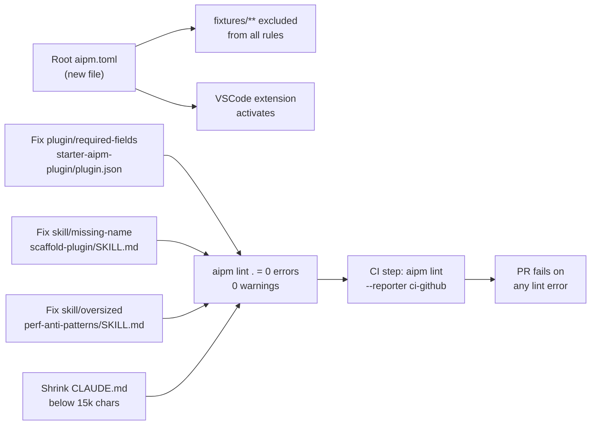

# Dogfood `aipm lint` in This Repository — Issue #426

| Document Metadata | Details |
| --- | --- |
| Author(s) | Sean Larkin |
| Status | Draft (WIP) |
| Team / Owner | aipm core |
| Created / Last Updated | 2026-04-12 |
| Related Issues | [#426](https://github.com/TheLarkInn/aipm/issues/426) |
| Research | [`research/tickets/2026-04-11-426-dogfood-aipm-lint.md`](../research/tickets/2026-04-11-426-dogfood-aipm-lint.md) |

---

## 1. Executive Summary

This spec establishes `aipm lint` as a first-class CI gate for this repository's own AI plugin integrations in `.ai/`. The repo currently has no root `aipm.toml`, no lint step in CI, and five live diagnostic violations in real plugin files. Adding a root `aipm.toml` with a fixture ignore pattern, fixing the five violations, and wiring `aipm lint --reporter ci-github` into the build pipeline will complete the dogfooding loop: the tool validates real-world plugins, the VSCode extension activates locally, and any future regression in `.ai/` fails the PR. Total impact: zero new infrastructure, one config file, four file edits, and one CI step.

---

## 2. Context and Motivation

### 2.1 Current State

The repository ships `aipm lint`, a 18-rule static analysis tool for AI plugin files. It has been used to validate third-party plugins but has never been run against this repo's own `.ai/` directory — the "eat your own dog food" step was deferred.

The live `.ai/` marketplace contains two plugins:

| Plugin | Contents |
|---|---|
| `starter-aipm-plugin` | 1 skill, 1 agent, 1 hook, 1 script |
| `aipm-atomic-plugin` | 7 agents, 3 skills, 7 commands |

Running `aipm lint .` at the current repo root produces **40 diagnostics**:

| Source | Errors | Warnings | Total |
|---|---|---|---|
| `fixtures/` (test data) | 17 | 18 | 35 |
| Real code (`.ai/`, `CLAUDE.md`) | 1 | 4 | **5** |
| **Total** | **18** | **22** | **40** |

The five real violations are:

| Severity | Rule | File |
|---|---|---|
| error | `plugin/required-fields` | `.ai/starter-aipm-plugin/.claude-plugin/plugin.json` |
| warning | `skill/missing-name` | `.ai/starter-aipm-plugin/skills/scaffold-plugin/SKILL.md` |
| warning | `skill/oversized` | `.ai/aipm-atomic-plugin/skills/perf-anti-patterns/SKILL.md` |
| warning | `source/misplaced-features` | `CLAUDE.md` |
| warning | `instructions/oversized` | `CLAUDE.md` |

There is currently **no root `aipm.toml`** and **no `aipm lint` step in CI**. The VSCode extension (`vscode-aipm`) only activates when `workspaceContains:**/aipm.toml` — so contributors working on `.ai/` files get no inline diagnostics.

See the [research document](../research/tickets/2026-04-11-426-dogfood-aipm-lint.md) for a full baseline analysis including the lint pipeline architecture, ignore pattern semantics, and CI integration details.

### 2.2 The Problem

- **Regression risk**: Without a CI gate, broken plugin files (missing fields, bad paths, oversized skills) can be merged undetected.
- **No IDE feedback**: Contributors editing `.ai/` files receive no inline diagnostics because the VSCode extension is dormant (no `aipm.toml`).
- **Existing violations**: The one error (`plugin/required-fields`) would currently cause `aipm lint` to exit non-zero and would immediately fail any CI gate we add, if left unfixed.
- **Fixture noise**: 35 of the 40 diagnostics come from `fixtures/` (intentionally malformed files used for integration tests). These must be excluded or the output is unusable.

---

## 3. Goals and Non-Goals

### 3.1 Functional Goals

- [ ] **G1** — A root `aipm.toml` exists with a global ignore pattern that excludes `**/fixtures/**` from all lint output.
- [ ] **G2** — `aipm lint .` produces zero errors and zero warnings against real plugin files (`.ai/` and `CLAUDE.md`), with no suppression overrides used.
- [ ] **G3** — `aipm lint . --reporter ci-github` runs as an inline CI step after `cargo build --bin aipm`, and fails the PR build on any lint error.
- [ ] **G4** — The VSCode extension activates automatically on this repository (achieved by G1 — the presence of `aipm.toml`).

### 3.2 Non-Goals

- [ ] We will **NOT** add `aipm.toml` package manifests to `starter-aipm-plugin` or `aipm-atomic-plugin` — that work is tracked separately and is not required for linting.
- [ ] We will **NOT** add `fixtures` to `SKIP_DIRS` in `discovery.rs` — the glob-based ignore in `aipm.toml` is the correct mechanism per the project's architecture. A code-level change is unnecessary for this repo's fixture count.
- [ ] We will **NOT** update documentation in `docs/` — the dogfooding work itself is the example; no additional guide updates are warranted.
- [ ] We will **NOT** create new lint rules as part of this ticket.

---

## 4. Proposed Solution (High-Level Design)

### 4.1 Deliverable Overview



### 4.2 Key Components

| Deliverable | Change Type | Files Affected |
|---|---|---|
| Root `aipm.toml` | New file | `aipm.toml` (repo root) |
| Fix `plugin/required-fields` | File edit | `.ai/starter-aipm-plugin/.claude-plugin/plugin.json` |
| Fix `skill/missing-name` | File edit | `.ai/starter-aipm-plugin/skills/scaffold-plugin/SKILL.md` |
| Fix `skill/oversized` | File edit | `.ai/aipm-atomic-plugin/skills/perf-anti-patterns/SKILL.md` |
| Fix `instructions/oversized` | File edit | `CLAUDE.md` |
| CI integration | Workflow edit | `.github/workflows/ci.yml` |

---

## 5. Detailed Design

### 5.1 Root `aipm.toml`

Create `aipm.toml` at the repository root. This file is intentionally minimal — it contains only lint workspace configuration, no package metadata.

```toml
[workspace.lints.ignore]
paths = ["**/fixtures/**"]
```

**Why only this?** The `Workspace` struct does not use `#[serde(deny_unknown_fields)]` ([`types.rs:88-99`](../crates/libaipm/src/manifest/types.rs)), so an `aipm.toml` with only `[workspace.lints.*]` keys passes typed deserialization cleanly. The `load_lint_config()` function ([`main.rs:748-845`](../crates/aipm/src/main.rs)) reads this section independently.

**Ignore pattern semantics**: The `is_ignored()` function ([`lint/mod.rs:23-41`](../crates/libaipm/src/lint/mod.rs)) matches glob patterns against the **full absolute path** of each diagnostic's `file_path`. The pattern `**/fixtures/**` correctly matches any path containing a `fixtures/` directory component at any depth (e.g., `/workspaces/aipm/fixtures/plugins/...`). A pattern without the leading `**/` would fail to match absolute paths.

**VSCode side effect**: The extension activates on `workspaceContains:**/aipm.toml` ([`package.json:11`](../vscode-aipm/package.json)). Adding this file is the only prerequisite for inline lint diagnostics in VS Code; no other extension configuration is needed.

### 5.2 Fix `plugin/required-fields` (Error)

**File**: `.ai/starter-aipm-plugin/.claude-plugin/plugin.json`

The `RequiredFields` rule ([`rules/plugin_required_fields.rs`](../crates/libaipm/src/lint/rules/plugin_required_fields.rs)) validates that `plugin.json` contains all mandatory top-level fields. The `aipm-atomic-plugin` already declares an `author` field; `starter-aipm-plugin` is missing it.

**Fix**: Add an `author` field to `starter-aipm-plugin/.claude-plugin/plugin.json` with an appropriate value matching the repo owner. The exact field schema accepted by `RequiredFields` should be confirmed by reading the rule implementation before editing.

This is the only **error**-severity diagnostic. Without this fix, the CI step would immediately exit non-zero on the first run.

### 5.3 Fix `skill/missing-name` (Warning)

**File**: `.ai/starter-aipm-plugin/skills/scaffold-plugin/SKILL.md`

The `MissingName` rule ([`rules/skill_missing_name.rs`](../crates/libaipm/src/lint/rules/skill_missing_name.rs)) checks for a `name` key in the SKILL.md YAML frontmatter.

**Fix**: Add a `name:` field to the frontmatter block at the top of `scaffold-plugin/SKILL.md`. The value should be a short, human-readable name for the skill (e.g., `Scaffold Plugin`).

### 5.4 Fix `skill/oversized` (Warning)

**File**: `.ai/aipm-atomic-plugin/skills/perf-anti-patterns/SKILL.md`

The `Oversized` rule ([`rules/skill_oversized.rs`](../crates/libaipm/src/lint/rules/skill_oversized.rs)) enforces a 15,000-character limit on SKILL.md files. The `perf-anti-patterns` skill is currently 20,036 chars — 5,036 chars over the limit.

**Fix strategy**: Reduce the skill's content to below 15,000 characters. Recommended approaches (in order of preference):

1. **Extract reference material** — Move the detailed anti-pattern descriptions into a `references/` subdirectory (as `prompt-engineer` already does) and replace them in SKILL.md with concise one-line summaries. The gate functions / detection logic in the main skill body can be kept, while verbose explanations move to reference files.
2. **Condense anti-pattern definitions** — Combine overlapping anti-patterns or shorten prose descriptions while preserving the key detection criteria.

The goal is to keep the skill's functional value while meeting the size constraint, not to arbitrarily truncate content. Read the current file content before deciding which approach fits better.

### 5.5 Fix `instructions/oversized` on `CLAUDE.md` (Warning)

**File**: `CLAUDE.md`

The `instructions/oversized` rule fires on CLAUDE.md because it exceeds the default 15,000-character limit (configured via `DEFAULT_MAX_CHARS = 15_000` in [`rules/instructions_oversized.rs`](../crates/libaipm/src/lint/rules/instructions_oversized.rs)).

**Fix strategy**: Reduce CLAUDE.md to below 15,000 characters. Recommended approaches:

1. **Trim the build commands section** — The `Build Commands` and `Coverage Commands` sections contain extensive shell command blocks. Consider linking to an external reference or condensing the coverage command block (which has four variants).
2. **Compress the agentic workflows table** — The `Why 45 minutes?` prose block under `Agentic Workflows` is verbose; a tighter 2-3 sentence summary would preserve the intent.
3. **Condense the spec template** — The existing spec template in `Agentic Workflows` or any embedded examples can be removed or shortened.

Do **not** move CLAUDE.md into `.ai/` — instruction files belong at the repo root and are not plugin features. The `source/misplaced-features` rule is not expected to fire on `FeatureKind::Instructions` files; if it does, that is a separate rule-behavior issue tracked independently.

> **Risk note**: The research baseline (commit `796ace8`) recorded a `source/misplaced-features` warning on `CLAUDE.md`. This may have been corrected in subsequent commits. Verify by running `aipm lint .` before and after adding `aipm.toml` to confirm the actual diagnostic count. If `source/misplaced-features` still fires on `CLAUDE.md`, that is a bug in the rule (instructions are not misplaced features) and should be filed as a separate issue — do **not** add a suppress override to `aipm.toml`.

### 5.6 CI Integration

**File**: `.github/workflows/ci.yml`

Add an inline lint step to the existing `ci` job, after the `cargo build --workspace` step (which already exists). The lint step reuses the just-built debug binary:

```yaml
- name: Lint AI plugins
  run: |
    cargo build --bin aipm
    ./target/debug/aipm lint . --reporter ci-github
```

**Rationale for inline step (not a separate job):**

- No artifact upload/download overhead
- The binary is already compiled by `cargo build --workspace` earlier in the job; `cargo build --bin aipm` will be a no-op if the workspace build already succeeded
- Keeps CI configuration simple

**Reporter choice**: `ci-github` emits `::error file=...,line=...,col=...::message` and `::warning` workflow commands, which GitHub Actions renders as inline PR annotations on the diff view. This is the format documented in [`docs/guides/lint.md:144-149`](../docs/guides/lint.md).

**Exit behavior**: `cmd_lint()` ([`main.rs:739-744`](../crates/aipm/src/main.rs)) returns an error string if `outcome.error_count > 0`. The CI step will exit non-zero on any `error`-severity diagnostic, failing the PR. Warning-severity diagnostics produce annotations but do not block the build.

---

## 6. Alternatives Considered

| Option | Pros | Cons | Decision |
|---|---|---|---|
| Suppress `plugin/required-fields` via `aipm.toml` | No plugin file changes needed | Hides a real defect in the live plugin | Rejected — fix the underlying issue |
| Override `skill/oversized` threshold to 25,000 chars | No skill file changes | The skill is genuinely too large for context; size limit exists for a reason | Rejected — fix the skill |
| Suppress `instructions/oversized` on `CLAUDE.md` | No CLAUDE.md changes | CLAUDE.md is growing and a size signal is valuable | Rejected — shrink CLAUDE.md instead |
| Add `fixtures` to `SKIP_DIRS` in `discovery.rs` | Pre-discovery exclusion, no wasted rule execution | Code change for a problem solvable with config; hardcodes a project-specific convention into the library | Rejected — use `aipm.toml` ignore pattern |
| Start CI in advisory mode (`continue-on-error: true`) | Lower risk on first merge | Defers accountability; the one existing error must be fixed anyway | Rejected — fix errors first, then gate hard |
| Add `aipm.toml` manifests to both plugins | Full dogfooding of the package manifest format | Those plugins predate `aipm.toml` adoption; out of scope for this ticket | Deferred to a separate issue |

---

## 7. Cross-Cutting Concerns

### 7.1 Fixture Exclusion Semantics

The ignore pattern `**/fixtures/**` is applied **post-rule-execution** in `apply_rule_diagnostics()` ([`lint/mod.rs:45-65`](../crates/libaipm/src/lint/mod.rs)). Rules still run against fixture files; only the resulting diagnostics are suppressed. For this repo's fixture count this is negligible overhead. Adding `fixtures` to `SKIP_DIRS` would be a performance optimization but is explicitly out of scope.

### 7.2 `source/misplaced-features` on Instruction Files

The `source/misplaced-features` rule fires in Phase 2 of `run_rules_for_feature()` ([`lint/mod.rs:95`](../crates/libaipm/src/lint/mod.rs)) for any feature not inside `.ai/`. Instruction files (`CLAUDE.md`, `AGENTS.md`, etc.) have `FeatureKind::Instructions` — they are not plugin features and should be exempt from this rule. If the rule fires on `CLAUDE.md`, the correct fix is to update `run_rules_for_feature()` to skip the misplaced-features check for `FeatureKind::Instructions`, not to add a suppress override to `aipm.toml`. This potential bug fix is tracked separately and is out of scope here.

### 7.3 `aipm.toml` Discovery

`load_lint_config()` ([`main.rs:748`](../crates/aipm/src/main.rs)) looks for `aipm.toml` in the **directory passed to `aipm lint`**, not via upward walk. Running `aipm lint .` from the repo root will find `aipm.toml` at the root. Running from a subdirectory will not. The CI step must always use `.` (repo root) to ensure the config is picked up.

### 7.4 VSCode Extension PATH

The VSCode extension launches `aipm lsp` using the binary at `aipm.path` (default `"aipm"`). For the extension to work locally, `aipm` must be on `PATH` (e.g., via `cargo install --path crates/aipm` or adding `target/debug` to PATH). This is a local dev setup concern, not a spec deliverable, but contributors should be aware.

---

## 8. Migration, Rollout, and Testing

### 8.1 Deployment Order

The five changes must be applied in this order to avoid introducing a broken CI step:

1. Fix the four plugin/instruction file violations (G2 prerequisite)
2. Add root `aipm.toml` (enables VSCode activation, verifies zero warnings locally)
3. Add CI lint step (only after step 1 and 2 are verified clean)

Alternatively, steps 1 and 2 can be combined in a single PR, with the CI step added in the same PR — as long as `aipm lint .` produces zero errors locally before the PR is opened.

### 8.2 Verification Checklist

Before merging:

- [ ] `aipm lint .` produces **0 errors, 0 warnings** (run from repo root with root `aipm.toml` present)
- [ ] `aipm lint . --reporter text` shows no fixture diagnostics
- [ ] `aipm lint fixtures/ --reporter text` still shows the expected fixture violations (ignore only applies at root config scope, not when targeting fixture dir directly — verify this behavior)
- [ ] The VSCode extension activates when opening the workspace (check the Output panel for `aipm lsp`)
- [ ] CI passes with the new lint step on a test PR

### 8.3 Test Plan

- **Manual**: Run `aipm lint .` before and after each file fix to confirm each diagnostic is resolved individually.
- **CI**: Open a draft PR with only the `aipm.toml` (before fixing violations) to confirm CI fails as expected, then add the fixes and confirm CI passes.
- **VSCode**: Open the workspace in VS Code with `vscode-aipm` installed. Confirm the extension activates and shows no diagnostics on `.ai/` files.

No new unit or integration tests are required — the changes being made are configuration and content edits, not logic changes.

---

## 9. Open Questions / Unresolved Issues

- [ ] **`source/misplaced-features` on `CLAUDE.md`**: Verify whether this warning still fires at the current HEAD. If it does, file a separate bug report rather than suppressing it in `aipm.toml`.
- [ ] **`cargo build --bin aipm` in CI**: Confirm whether `cargo build --workspace` (the existing step) already produces `target/debug/aipm`, making the additional `cargo build --bin aipm` a no-op. If so, the lint step can simply be `./target/debug/aipm lint . --reporter ci-github` with no extra build invocation.
- [ ] **`skill/oversized` refactor scope**: Confirm with the team whether the `references/` pattern (as used by `prompt-engineer`) is the preferred approach for large skills before restructuring `perf-anti-patterns`.
