# DRY Rust Architecture Refactor — Technical Design Document

| Document Metadata      | Details                          |
| ---------------------- | -------------------------------- |
| Author(s)              | Sean Larkin                      |
| Status                 | Draft (WIP)                      |
| Team / Owner           | AIPM Core                        |
| Created / Last Updated | 2026-04-13 / 2026-04-13         |

## 1. Executive Summary

This spec addresses the full set of DRY violations and Rust idiom inconsistencies identified in the [DRY architecture audit](../research/docs/2026-04-12-dry-rust-architecture-audit.md). The codebase has 10 distinct deduplication targets across manifest generation, file I/O, lint rules, wizard types, and name validation — all of which compound as issues [#363](https://github.com/TheLarkInn/aipm/issues/363) (aipm make), [#361](https://github.com/TheLarkInn/aipm/issues/361) (CLI scaffolding), and [#356](https://github.com/TheLarkInn/aipm/issues/356) (init/lint consistency) add new code paths.

The refactor introduces: (1) a `toml_edit`-based manifest builder replacing 4 independent TOML generation paths; (2) an extended `Fs` trait covering all filesystem-touching modules; (3) removal of the legacy `check()` lint path; (4) shared wizard types in `libaipm`; (5) standardized error handling with typed `CliError` enums; and (6) consolidation of plugin.json generation, name validation, marketplace.json, settings.json, frontmatter parsing, and lint rule boilerplate. Work is phased foundation-first across 4 phases.

---

## 2. Context and Motivation

### 2.1 Current State

The aipm workspace is structured as three crates:

```
crates/
  aipm/          — consumer CLI (init, install, update, link, uninstall, unlink, list, lint, migrate, lsp)
  aipm-pack/     — author CLI (init only)
  libaipm/       — core library (27 public modules, 95 source files)
```

The codebase has strong foundations: six well-designed domain traits (`Fs`, `Rule`, `Detector`, `ToolAdaptor`, `Registry`, `Reporter`), modern Rust iterator patterns, proper `thiserror`-based error handling, and strict lint enforcement via `Cargo.toml`. Branch coverage is at 89%+.

However, as documented in the [DRY audit](../research/docs/2026-04-12-dry-rust-architecture-audit.md), **organic growth has produced significant duplication** — particularly in the scaffolding, manifest generation, and lint layers that are the exact surfaces where #363/#361/#356 need to add code.

**Research basis:**
- [research/docs/2026-04-12-dry-rust-architecture-audit.md](../research/docs/2026-04-12-dry-rust-architecture-audit.md) — Primary audit (10 DRY violations, 5 Rust idiom findings)
- [research/docs/2026-03-24-aipm-toml-generation-in-init-and-migrate.md](../research/docs/2026-03-24-aipm-toml-generation-in-init-and-migrate.md) — Confirms B1 (4 TOML generation paths)
- [research/docs/2026-03-19-init-tool-adaptor-refactor.md](../research/docs/2026-03-19-init-tool-adaptor-refactor.md) — ToolAdaptor trait design
- [research/docs/2026-03-31-110-aipm-lint-architecture-research.md](../research/docs/2026-03-31-110-aipm-lint-architecture-research.md) — Lint two-tier architecture
- [research/docs/2026-03-20-scaffold-plugin-ts-missing-features.md](../research/docs/2026-03-20-scaffold-plugin-ts-missing-features.md) — TS scaffold duplication
- [research/docs/2026-04-06-plugin-system-feature-parity-analysis.md](../research/docs/2026-04-06-plugin-system-feature-parity-analysis.md) — Feature parity analysis

### 2.2 The Problem

**Duplication compounds feature cost.** Every new scaffolding operation (like `aipm make`) must choose which of 4 TOML generation paths, 2 plugin.json generators, 4 name validators, and 2 marketplace.json updaters to copy — or add yet another independent implementation. The [audit](../research/docs/2026-04-12-dry-rust-architecture-audit.md#b1-aipmtoml-manifest-generation--4-independent-approaches) documents this concretely:

| Duplicated concern | Independent copies | Risk if left unfixed |
|---|---|---|
| `aipm.toml` generation ([B1](../research/docs/2026-04-12-dry-rust-architecture-audit.md#b1-aipmtoml-manifest-generation--4-independent-approaches)) | 4 (format!, string literal, string literal, PluginToml+serde) | #363 adds a 5th |
| `plugin.json` generation ([B2](../research/docs/2026-04-12-dry-rust-architecture-audit.md#b2-pluginjson-generation--2-independent-implementations)) | 2 (minimal vs full) | #356 root cause — init path missing component fields |
| Package name validation ([B3](../research/docs/2026-04-12-dry-rust-architecture-audit.md#b3-packagename-validation--4-independent-implementations)) | 4 (diverged rules) | Make actions inherit wrong validator |
| `marketplace.json` RMW ([B4](../research/docs/2026-04-12-dry-rust-architecture-audit.md#b4-marketplacejson-read-modify-write--2-independent-implementations)) | 2 (Rust + TS) | #363 needs a 3rd |
| `settings.json` RMW ([B5](../research/docs/2026-04-12-dry-rust-architecture-audit.md#b5-claudesettingsjson-read-modify-write--2-independent-implementations)) | 2 (Rust + TS) | Overlapping field handling |
| Lint `check()`/`check_file()` ([B10](../research/docs/2026-04-12-dry-rust-architecture-audit.md#b10-lint-rule-boilerplate--8-patterns-of-internal-duplication)) | 18 rules × 2 methods | 300+ lines of boilerplate |
| `std::fs` bypassing `Fs` trait ([B11](../research/docs/2026-04-12-dry-rust-architecture-audit.md#b11-direct-stdfs-vs-fs-trait--inconsistent-filesystem-abstraction)) | 10 modules | Untestable file I/O |
| Wizard types ([B7](../research/docs/2026-04-12-dry-rust-architecture-audit.md#b7-wizardrs--wizard_ttyrs-pattern-duplicated-across-binaries)) | 2 binaries | Divergence as make adds interactive paths |
| Error handling ([C1](../research/docs/2026-04-12-dry-rust-architecture-audit.md#c1-error-handling--mostly-good-inconsistent-location)) | Mixed patterns | Box<dyn Error> erases types at CLI boundary |

**User impact** ([#356](https://github.com/TheLarkInn/aipm/issues/356)): Running `aipm lint` on a freshly-initialized workspace fails because `generate_plugin_json()` (workspace_init path) produces `{name, version, description, author}` while the lint rule `plugin/required-fields` expects component arrays. The root cause is B2 — two independent plugin.json generators with different field sets.

---

## 3. Goals and Non-Goals

### 3.1 Functional Goals

- [ ] **G1.** Consolidate all `aipm.toml` generation into a single `toml_edit`-based builder module (`manifest/builder.rs`) with full round-trip fidelity (comments, ordering preserved)
- [ ] **G2.** Unify `plugin.json` generation into a single function that accepts optional component arrays
- [ ] **G3.** Consolidate all 4 name/package validators into one canonical implementation in `manifest/validate.rs`
- [ ] **G4.** Provide a single Rust `marketplace.json` read-modify-write function usable from init, migrate, and future make contexts
- [ ] **G5.** Provide a single Rust `settings.json` read-modify-write function covering all field types
- [ ] **G6.** Extend the `Fs` trait to all filesystem-touching modules (10+ modules currently bypassing it)
- [ ] **G7.** Add `write_file_with_parents()` as a default method on the `Fs` trait, eliminating 6+ independent create-parent-then-write patterns
- [ ] **G8.** Remove the legacy `check()` path from the `Rule` trait; all 18 rules use `check_file()` only
- [ ] **G9.** Consolidate lint rule boilerplate: shared `locate_json_key()`, shared `diag()` helper, shared `check_file()` preamble
- [ ] **G10.** Move wizard types (`PromptStep`, `PromptKind`, `PromptAnswer`, `styled_render_config`) to `libaipm`
- [ ] **G11.** Unify YAML frontmatter parsing — `migrate/skill_common.rs` delegates to `frontmatter.rs`
- [ ] **G12.** Standardize error handling: dedicated `error.rs` for modules with 3+ variants, `#[from]` for 1:1 conversions, typed `CliError` enum in each binary
- [ ] **G13.** Consolidate "read JSON/TOML, default on missing" into a shared helper

### 3.2 Non-Goals (Out of Scope)

- [ ] **NG1.** Replacing the TypeScript scaffold script with Rust — deferred to [#361](https://github.com/TheLarkInn/aipm/issues/361). This spec creates the primitives that #361 will consume.
- [ ] **NG2.** Implementing `aipm make` — deferred to [#363](https://github.com/TheLarkInn/aipm/issues/363). This spec consolidates the operations that make will compose.
- [ ] **NG3.** Adding new lint rules or new engine adaptors. Only refactoring existing rules/adaptors.
- [ ] **NG4.** Changing the `Manifest` struct's deserialization behavior or TOML parsing.
- [ ] **NG5.** Extending `ToolAdaptor` to post-init operations (install, link, lint). Noted as a gap in the audit but out of scope.
- [ ] **NG6.** Removing `Fs` trait stubs (`remove_file`, `remove_dir_all`, etc.) — the audit noted these as a smell but they are not blocking.

---

## 4. Proposed Solution (High-Level Design)

### 4.1 System Architecture Diagram

```mermaid
%%{init: {'theme':'base', 'themeVariables': { 'primaryColor':'#f8f9fa','primaryTextColor':'#2c3e50','primaryBorderColor':'#4a5568','lineColor':'#4a90e2','secondaryColor':'#ffffff','tertiaryColor':'#e9ecef'}}}%%

flowchart TB
    classDef newModule fill:#48bb78,stroke:#38a169,stroke-width:2.5px,color:#ffffff,font-weight:600
    classDef refactored fill:#4a90e2,stroke:#357abd,stroke-width:2.5px,color:#ffffff,font-weight:600
    classDef removed fill:#e53e3e,stroke:#c53030,stroke-width:2.5px,color:#ffffff,font-weight:600
    classDef unchanged fill:#718096,stroke:#4a5568,stroke-width:2px,color:#ffffff

    subgraph Binaries["CLI Binaries"]
        aipm["aipm CLI<br><i>+ CliError enum</i>"]:::refactored
        aipmPack["aipm-pack CLI<br><i>+ CliError enum</i>"]:::refactored
    end

    subgraph LibAipm["libaipm (Core Library)"]
        subgraph NewModules["New / Consolidated Modules"]
            builder["manifest/builder.rs<br><i>toml_edit-based TOML gen</i>"]:::newModule
            pluginJson["generate/plugin_json.rs<br><i>unified plugin.json gen</i>"]:::newModule
            marketplaceRmw["generate/marketplace.rs<br><i>single RMW function</i>"]:::newModule
            settingsRmw["generate/settings.rs<br><i>single RMW function</i>"]:::newModule
            wizard["wizard.rs<br><i>shared wizard types</i>"]:::newModule
            jsonHelper["lint/rules/json_helpers<br><i>locate_json_key, diag</i>"]:::newModule
            fsHelpers["fs.rs<br><i>+ write_file_with_parents<br>+ read_or_default</i>"]:::refactored
        end

        subgraph Refactored["Refactored Modules"]
            validate["manifest/validate.rs<br><i>single canonical validator</i>"]:::refactored
            frontmatter["frontmatter.rs<br><i>canonical parser</i>"]:::refactored
            lintRule["lint/rule.rs<br><i>check_file() only</i>"]:::refactored
            initRs["init.rs<br><i>uses builder + validate</i>"]:::refactored
            wsInit["workspace_init/<br><i>uses builder + pluginJson<br>+ marketplaceRmw</i>"]:::refactored
            emitter["migrate/emitter.rs<br><i>uses builder + pluginJson</i>"]:::refactored
            registrar["migrate/registrar.rs<br><i>uses marketplaceRmw</i>"]:::refactored
            lockfile["lockfile/<br><i>uses &dyn Fs</i>"]:::refactored
            linker["linker/<br><i>uses &dyn Fs</i>"]:::refactored
            installer["installer/<br><i>uses &dyn Fs</i>"]:::refactored
            cache["cache.rs<br><i>whole-module exception</i>"]:::unchanged
        end

        subgraph Removed["Removed"]
            scanRs["lint/rules/scan.rs"]:::removed
            checkMethod["Rule::check()"]:::removed
            pluginToml["emitter::PluginToml<br>PluginPackage<br>PluginComponents"]:::removed
            skillCommon["migrate/skill_common.rs<br><i>frontmatter parser</i>"]:::removed
            dupValidators["init.rs::is_valid_*<br>wizard::validate_*"]:::removed
        end
    end

    aipm --> wizard
    aipmPack --> wizard
    aipm --> builder
    wsInit --> builder
    wsInit --> pluginJson
    wsInit --> marketplaceRmw
    wsInit --> settingsRmw
    emitter --> builder
    emitter --> pluginJson
    registrar --> marketplaceRmw
    initRs --> builder
    initRs --> validate

    style Binaries fill:#ffffff,stroke:#cbd5e0,stroke-width:2px
    style LibAipm fill:#ffffff,stroke:#cbd5e0,stroke-width:2px
    style NewModules fill:#f0fff4,stroke:#c6f6d5,stroke-width:1px
    style Refactored fill:#ebf8ff,stroke:#bee3f8,stroke-width:1px
    style Removed fill:#fff5f5,stroke:#fed7d7,stroke-width:1px
```



### 4.2 Architectural Pattern

**Consolidation via shared modules.** Each duplicated concern gets a single canonical implementation. Callers that previously had independent copies are refactored to call the shared version with appropriate parameters. No new traits are introduced (the existing trait hierarchy is sound); this is purely about collapsing implementations.

### 4.3 Key Components

| Component | Responsibility | Eliminates | Justification |
|---|---|---|---|
| `manifest/builder.rs` | All `aipm.toml` generation via `toml_edit::Document` | B1 (4 paths → 1) | `toml_edit` preserves comments and ordering; already a dep via `manifest_editor.rs` |
| `generate/plugin_json.rs` | Unified `plugin.json` generation with optional components | B2 (2 paths → 1) | Root cause of #356; components arg makes init and migrate paths identical |
| `generate/marketplace.rs` | Single `marketplace.json` read-modify-write | B4 (2 paths → 1) | Backbone of #363; dedup-check included |
| `generate/settings.rs` | Single `settings.json` read-modify-write | B5 (2 paths → 1) | Handles both `extraKnownMarketplaces` and `enabledPlugins` |
| `manifest/validate.rs` (extended) | Single canonical name/package validator | B3 (4 paths → 1) | Wizard validators delegate to canonical with char-set-only mode |
| `Fs` trait (extended) | `write_file_with_parents()`, `read_or_default<T>()`, `read_toml_or_default<T>()` + extended to 9 modules | B8, B9, B11 | Eliminates 6+ create-parent-write patterns; enables mock testing; `cache.rs` is a whole-module exception (uses `LockedFile`) |
| `lint/rule.rs` (simplified) | `check_file()` only; `check()` removed | B10 two-tier arch | ~300 lines of boilerplate removed; `scan.rs` deleted |
| `lint/rules/mod.rs` (helpers) | `locate_json_key()`, shared `diag()` | B10 helpers | 2 identical copies → 1; 4 private diag → 1 shared |
| `wizard.rs` in `libaipm` | Shared `PromptStep`, `PromptKind`, `PromptAnswer`, `styled_render_config` — gated behind `wizard` feature flag | B7 | Prevents divergence as make adds interactive paths; feature flag keeps `libaipm` lean for potential non-CLI consumers |
| `frontmatter.rs` (canonical) | Single YAML frontmatter parser | B6 | `skill_common.rs` parser deleted; delegates to canonical |
| `fs.rs` helpers | `read_or_default<T>()` (JSON) + `read_toml_or_default<T>()` (TOML) | B9 | Covers JSON and TOML "read or default" patterns; `cache.rs` excluded (whole-module exception) |
| `CliError` enums | Typed error enums in each binary | C1 CLI | Replaces `Box<dyn Error>` with structured errors and exit codes |

---

## 5. Detailed Design

### 5.1 Phase 1 — Foundation (Infrastructure)

Phase 1 establishes the shared primitives that all subsequent phases build on. No caller behavior changes yet.

#### 5.1.1 Extend the `Fs` Trait

**File:** `crates/libaipm/src/fs.rs`

Add a default method:

```rust
/// Creates parent directories and writes file content atomically.
fn write_file_with_parents(&self, path: &Path, content: &[u8]) -> io::Result<()> {
    if let Some(parent) = path.parent() {
        self.create_dir_all(parent)?;
    }
    self.write_file(path, content)
}
```

Add generic helpers for "read or default on NotFound" ([B9](../research/docs/2026-04-12-dry-rust-architecture-audit.md#b9-read-jsontoml-default-on-missing-pattern--4-locations)). Two variants — one for JSON, one for TOML — so callers use the method matching their serialization format without a format enum parameter:

```rust
/// Reads and JSON-deserializes a file, returning T::default() if the file does not exist.
fn read_or_default<T>(&self, path: &Path) -> Result<T, io::Error>
where
    T: Default + serde::de::DeserializeOwned,
{
    match self.read_to_string(path) {
        Ok(content) => serde_json::from_str(&content)
            .map_err(|e| io::Error::new(io::ErrorKind::InvalidData, e)),
        Err(e) if e.kind() == io::ErrorKind::NotFound => Ok(T::default()),
        Err(e) => Err(e),
    }
}

/// Reads and TOML-deserializes a file, returning T::default() if the file does not exist.
fn read_toml_or_default<T>(&self, path: &Path) -> Result<T, io::Error>
where
    T: Default + serde::de::DeserializeOwned,
{
    match self.read_to_string(path) {
        Ok(content) => toml::from_str(&content)
            .map_err(|e| io::Error::new(io::ErrorKind::InvalidData, e)),
        Err(e) if e.kind() == io::ErrorKind::NotFound => Ok(T::default()),
        Err(e) => Err(e),
    }
}
```

**Permanent exception — `locked_file.rs`:** This module uses `fs2::FileExt::lock_exclusive()` on a real `std::fs::File` handle that it must hold across `Seek` + `Read` + `Write` calls for the duration of the OS-level lock. The `Fs` trait abstracts path-based I/O only; it cannot provide a persistent file-descriptor handle. `locked_file.rs` stays on `std::fs` permanently. Note: `locked_file.rs` (OS locking) and `lockfile/mod.rs` (aipm.lock management) are **separate modules** — only the former is an exception.

**Permanent exception — `cache.rs`:** `cache.rs` uses `LockedFile` for its index read-modify-write operations and plain `std::fs` for other reads. Because the `LockedFile` dependency makes partial migration awkward and `cache.rs` has no direct test coverage gap that partial migration would fix, the entire module stays on `std::fs`. Revisit when `cache.rs` needs isolated unit testing.

**Refactor the following modules to accept `&dyn Fs`** instead of using `std::fs` directly ([B8](../research/docs/2026-04-12-dry-rust-architecture-audit.md#b8-create-parent-dir-then-write-pattern--6-independent-implementations), [B11](../research/docs/2026-04-12-dry-rust-architecture-audit.md#b11-direct-stdfs-vs-fs-trait--inconsistent-filesystem-abstraction)):

| Module | Current | After |
|---|---|---|
| `lockfile/mod.rs` | `std::fs::{read_to_string, write}` | `fs.read_to_string()`, `fs.write_file_with_parents()` |
| `linker/link_state.rs` | `std::fs::{read_to_string, write, create_dir_all}` | `fs.read_toml_or_default()`, `fs.write_file_with_parents()` |
| `linker/gitignore.rs` | `std::fs::{read_to_string, write, create_dir_all}` | `fs.read_to_string()`, `fs.write_file_with_parents()` |
| `installer/manifest_editor.rs` | `std::fs::{read_to_string, write}` | `fs.read_to_string()`, `fs.write_file()` |
| `installer/pipeline.rs` | `std::fs::read_to_string` | `fs.read_to_string()` |
| `workspace/mod.rs` | `std::fs::read_to_string` | `fs.read_to_string()` |
| `manifest/mod.rs` | `std::fs::read_to_string` | `fs.read_to_string()` |
| `aipm/src/main.rs` | `std::fs::read_to_string` for installed registry | `fs.read_or_default::<InstalledRegistry>(path)?` |

**Impact on function signatures:** Public functions in these modules gain an `fs: &dyn Fs` parameter. Callers in the CLI binaries pass `&fs::Real`. Existing tests can pass `&MockFs`.

#### 5.1.2 Create `manifest/builder.rs` — toml_edit-Based Manifest Builder

**New file:** `crates/libaipm/src/manifest/builder.rs`

This module replaces all 4 `aipm.toml` generation paths ([B1](../research/docs/2026-04-12-dry-rust-architecture-audit.md#b1-aipmtoml-manifest-generation--4-independent-approaches)) with `toml_edit::DocumentMut`-based builders that preserve comments and field ordering.

```rust
use toml_edit::{DocumentMut, Item, Table, value};

/// Options for building a plugin manifest ([package] section).
pub struct PluginManifestOpts<'a> {
    pub name: &'a str,
    pub version: &'a str,
    pub plugin_type: &'a str,
    /// Optional description line
    pub description: Option<&'a str>,
}

/// Options for building plugin [components] section.
pub struct PluginComponentsOpts<'a> {
    pub skills: &'a [&'a str],
    pub agents: &'a [&'a str],
    pub hooks: &'a [&'a str],
    pub mcp_servers: &'a [&'a str],
    pub output_styles: &'a [&'a str],
    pub lsp_servers: &'a [&'a str],
    pub extensions: &'a [&'a str],
}

/// Options for building a workspace manifest.
pub struct WorkspaceManifestOpts<'a> {
    pub members: &'a [&'a str],
    pub plugins_dir: &'a str,
    /// Comment block to prepend (e.g., "# aipm workspace manifest")
    pub header_comment: Option<&'a str>,
}

/// Build a plugin aipm.toml document.
pub fn build_plugin_manifest(
    opts: &PluginManifestOpts<'_>,
    components: Option<&PluginComponentsOpts<'_>>,
) -> DocumentMut { /* ... */ }

/// Build a workspace aipm.toml document.
pub fn build_workspace_manifest(opts: &WorkspaceManifestOpts<'_>) -> DocumentMut { /* ... */ }
```

**Callers to migrate:**

| Current location | Current approach | After |
|---|---|---|
| `init.rs:187` (`generate_manifest()`) | `format!()` string | `build_plugin_manifest()` |
| `workspace_init/mod.rs:275` (`generate_starter_manifest()`) | string literal | `build_plugin_manifest()` with components |
| `workspace_init/mod.rs:166` (`generate_workspace_manifest()`) | string literal | `build_workspace_manifest()` |
| `migrate/emitter.rs:1113` (`generate_plugin_manifest()`) | private `PluginToml` + `toml::to_string_pretty` | `build_plugin_manifest()` with components |
| `workspace_init/mod.rs:365` (embedded JS) | JavaScript template literal | Not migrated (deferred to #361) |

**Deleted after migration:**
- `migrate/emitter.rs` lines 1080–1110: `PluginToml`, `PluginPackage`, `PluginComponents` structs
- `init.rs:187–203`: `generate_manifest()` function
- `workspace_init/mod.rs:166–180`: `generate_workspace_manifest()` function
- `workspace_init/mod.rs:275–290`: `generate_starter_manifest()` function

#### 5.1.3 Consolidate Name Validation in `manifest/validate.rs`

**File:** `crates/libaipm/src/manifest/validate.rs`

The canonical validator at `validate.rs:14` (`is_valid_name` + `is_valid_segment`) becomes the single source of truth for all name validation ([B3](../research/docs/2026-04-12-dry-rust-architecture-audit.md#b3-packagename-validation--4-independent-implementations)).

Add a `ValidationMode` to support the wizard's less-strict requirements:

```rust
pub enum ValidationMode {
    /// Full validation: scoped names, first-char [a-z0-9], only hyphens.
    /// Used by library code (init, migrate, make).
    Strict,
    /// Character-set only: allows empty (caller provides default), no first-char rule.
    /// Used by interactive wizard prompts where partial input is expected.
    Interactive,
}

pub fn is_valid_name(name: &str, mode: ValidationMode) -> bool { /* ... */ }
```

**Deleted after migration:**
- `init.rs:99–128`: `is_valid_package_name()` + `is_valid_segment()` (duplicate of validate.rs)
- `aipm/wizard.rs:211`: `validate_marketplace_name()` — calls `validate::is_valid_name(_, Interactive)` instead
- `aipm-pack/wizard.rs:168`: `validate_package_name()` — calls `validate::is_valid_name(_, Interactive)` instead

#### 5.1.4 Standardize Error Handling Convention

**Convention (applied to all modules touched in this spec):**

1. **Dedicated `error.rs`** for modules with 3+ error variants. Modules with 1–2 variants may inline the enum.
2. **`#[from]`** for 1:1 error conversions (e.g., `io::Error` → `MyError::Io`). Explicit `.map_err()` only when adding context.
3. **Typed `CliError` enum** in each binary, replacing `Box<dyn std::error::Error>`.

**New file:** `crates/aipm/src/error.rs`

```rust
use thiserror::Error;

#[derive(Debug, Error)]
pub enum CliError {
    #[error(transparent)]
    Init(#[from] libaipm::workspace_init::Error),
    #[error(transparent)]
    Lint(#[from] libaipm::lint::LintError),
    #[error(transparent)]
    Migrate(#[from] libaipm::migrate::MigrateError),
    #[error(transparent)]
    Install(#[from] libaipm::installer::InstallError),
    #[error(transparent)]
    Link(#[from] libaipm::linker::LinkError),
    // ... one variant per library error type
    #[error(transparent)]
    Io(#[from] std::io::Error),
}
```

**New file:** `crates/aipm-pack/src/error.rs`

```rust
#[derive(Debug, Error)]
pub enum CliError {
    #[error(transparent)]
    Init(#[from] libaipm::init::InitError),
    #[error(transparent)]
    Io(#[from] std::io::Error),
}
```

**Migration:** The `run()` functions in both `main.rs` files change from `Result<(), Box<dyn std::error::Error>>` to `Result<(), CliError>`. The ~15 `.to_string()` + `io::Error::other()` conversions in `aipm/src/main.rs` are replaced with `?` propagation through `#[from]` conversions.

---

### 5.2 Phase 2 — Generation Consolidation

Phase 2 unifies all file generation paths using the Phase 1 infrastructure.

#### 5.2.1 Create `generate/` Module

**New directory:** `crates/libaipm/src/generate/`
**New files:** `mod.rs`, `plugin_json.rs`, `marketplace.rs`, `settings.rs`

This module centralizes all generated-file logic. It sits alongside `manifest/builder.rs` (which handles TOML specifically).

#### 5.2.2 Unified `plugin.json` Generation

**File:** `crates/libaipm/src/generate/plugin_json.rs`

Replaces both independent `plugin.json` generators ([B2](../research/docs/2026-04-12-dry-rust-architecture-audit.md#b2-pluginjson-generation--2-independent-implementations)):

```rust
pub struct PluginJsonOpts<'a> {
    pub name: &'a str,
    pub version: &'a str,
    pub description: &'a str,
    pub author_name: &'a str,
    pub author_email: &'a str,
}

pub struct PluginJsonComponents<'a> {
    pub skills: &'a [&'a str],
    pub agents: &'a [&'a str],
    pub mcp_servers: &'a [&'a str],
    pub hooks: &'a [&'a str],
    pub output_styles: &'a [&'a str],
    pub lsp_servers: &'a [&'a str],
    pub extensions: &'a [&'a str],
}

/// Generate plugin.json content as a JSON string.
/// When components is Some, component arrays are included in the output.
/// When None, component arrays are omitted (not empty — absent).
pub fn generate_plugin_json(
    opts: &PluginJsonOpts<'_>,
    components: Option<&PluginJsonComponents<'_>>,
) -> Result<String, serde_json::Error> { /* ... */ }
```

**This directly fixes [#356](https://github.com/TheLarkInn/aipm/issues/356):** The workspace_init path now calls `generate_plugin_json()` with `Some(components)` containing the starter plugin's skill and agent, so the generated `plugin.json` passes `plugin/required-fields` lint.

**Callers to migrate:**

| Current location | After |
|---|---|
| `workspace_init/mod.rs:294` (`generate_plugin_json()`) | `generate::plugin_json::generate_plugin_json(opts, Some(components))` |
| `migrate/emitter.rs:1183` (`generate_plugin_json_multi()`) | `generate::plugin_json::generate_plugin_json(opts, Some(components))` |

#### 5.2.3 Unified `marketplace.json` Read-Modify-Write

**File:** `crates/libaipm/src/generate/marketplace.rs`

Single function replacing the 2 independent implementations ([B4](../research/docs/2026-04-12-dry-rust-architecture-audit.md#b4-marketplacejson-read-modify-write--2-independent-implementations)):

```rust
pub struct PluginEntry<'a> {
    pub name: &'a str,
    pub version: &'a str,
    pub source: &'a str,
    pub description: Option<&'a str>,
}

/// Read marketplace.json, add or update a plugin entry (dedup by name), write back.
/// Creates the file with a default structure if it does not exist.
pub fn register_plugin(
    fs: &dyn Fs,
    marketplace_json_path: &Path,
    entry: &PluginEntry<'_>,
) -> Result<(), GenerateError> { /* ... */ }

/// Read marketplace.json, remove a plugin entry by name, write back.
pub fn unregister_plugin(
    fs: &dyn Fs,
    marketplace_json_path: &Path,
    plugin_name: &str,
) -> Result<(), GenerateError> { /* ... */ }
```

**Callers to migrate:**

| Current location | After |
|---|---|
| `migrate/registrar.rs:10` (`register_plugins()`) | Loop calling `generate::marketplace::register_plugin()` |
| `workspace_init/mod.rs:477` (`generate_marketplace_json()`) | `generate::marketplace::register_plugin()` for each starter plugin |
| `workspace_init/mod.rs:380` (generated TypeScript) | Not migrated (deferred to #361) |

#### 5.2.4 Unified `settings.json` Read-Modify-Write

**File:** `crates/libaipm/src/generate/settings.rs`

Consolidates the 2 independent implementations ([B5](../research/docs/2026-04-12-dry-rust-architecture-audit.md#b5-claudesettingsjson-read-modify-write--2-independent-implementations)):

```rust
/// Add a marketplace path to settings.json extraKnownMarketplaces.
pub fn add_known_marketplace(
    fs: &dyn Fs,
    settings_path: &Path,
    marketplace_path: &str,
) -> Result<(), GenerateError> { /* ... */ }

/// Enable a plugin in settings.json enabledPlugins.
pub fn enable_plugin(
    fs: &dyn Fs,
    settings_path: &Path,
    plugin_name: &str,
) -> Result<(), GenerateError> { /* ... */ }
```

**Callers to migrate:**

| Current location | After |
|---|---|
| `workspace_init/adaptors/claude.rs:61` | `generate::settings::add_known_marketplace()` + `enable_plugin()` |
| `workspace_init/mod.rs:407` (generated TypeScript) | Not migrated (deferred to #361) |

#### 5.2.5 Unify YAML Frontmatter Parsing

**File:** `crates/libaipm/src/frontmatter.rs` (existing, canonical)

The independent frontmatter parser in `migrate/skill_common.rs:13` ([B6](../research/docs/2026-04-12-dry-rust-architecture-audit.md#b6-yaml-frontmatter-parsing--2-independent-implementations)) is replaced. `skill_common.rs` either:
- Calls `frontmatter::parse()` and extracts the 4 fields it needs (`name`, `description`, `hooks`, `disable-model-invocation`), or
- Is deleted entirely if its callers can use `frontmatter::parse()` directly.

**Deleted:** `migrate/skill_common.rs` (or its parsing logic, retaining any non-parsing helpers).

---

### 5.3 Phase 3 — Lint Architecture Cleanup

Phase 3 completes the migration to the unified `check_file()` pipeline and removes boilerplate.

#### 5.3.1 Remove `check()` from the `Rule` Trait

**File:** `crates/libaipm/src/lint/rule.rs`

The `Rule` trait currently requires both `check()` and `check_file()`. After this change:

```rust
pub trait Rule: Send + Sync {
    fn id(&self) -> &str;
    fn description(&self) -> &str;
    fn check_file(
        &self,
        path: &Path,
        content: &str,
        source_type: SourceType,
        fs: &dyn Fs,
    ) -> Vec<Diagnostic>;
    // check() is REMOVED
}
```

**Pre-requisite verification:** Before removing `check()`, confirm that `discover_features()` in `discovery.rs` correctly classifies all files that the legacy `scan.rs` walk would find. This can be verified by running the existing test suite — if all tests pass with `check()` removed and `check_file()` as the sole dispatch path, the migration is complete.

**Deleted:**
- `lint/rules/scan.rs` — the file-scanning module used only by `check()`. The `scan_skills()`, `scan_agents()`, etc. functions are no longer needed.
- All `check()` implementations across 18 rule files
- The `check()` dispatch path in `lint/mod.rs`

**Impact:** ~300 lines of boilerplate removed across 18 rule files. The two-tier discovery architecture ([D](../research/docs/2026-04-12-dry-rust-architecture-audit.md#d-two-tier-discovery-architecture-lint-specific)) collapses to a single tier.

#### 5.3.2 Consolidate Lint Rule Helpers

**File:** `crates/libaipm/src/lint/rules/mod.rs`

Move shared helpers here:

```rust
/// Locate a JSON key in text and return its byte range.
/// Previously duplicated in hook_unknown_event.rs and hook_legacy_event.rs.
pub(crate) fn locate_json_key(content: &str, key: &str) -> Option<Range<usize>> { /* ... */ }

/// Create a diagnostic with a fixed rule_id. Replaces 4 private diag() helpers
/// in marketplace/plugin rules.
pub(crate) fn diag(
    rule_id: &str,
    message: String,
    path: &Path,
    range: Option<Range<usize>>,
    severity: Severity,
) -> Diagnostic { /* ... */ }
```

**Deleted from individual rule files:**
- `hook_unknown_event.rs:21` — `locate_json_key()` (identical copy)
- `hook_legacy_event.rs:15` — `locate_json_key()` (identical copy)
- 4 private `diag()` helpers in marketplace/plugin rules
- 1 legacy inline `MockFs` in `skill_missing_name.rs:125` (use shared `test_helpers::MockFs`)

#### 5.3.3 Reduce `check_file()` Preamble Boilerplate

The 7 skill rules share an identical preamble pattern:

```rust
fn check_file(&self, path: &Path, content: &str, source_type: SourceType, fs: &dyn Fs) -> Vec<Diagnostic> {
    if source_type != SourceType::Skill { return vec![]; }
    let skill = match frontmatter::parse(content) { ... };
    // rule-specific logic
}
```

Extract a helper:

```rust
/// Parse a skill file's frontmatter, returning None (empty diagnostics) if
/// the source_type doesn't match or parsing fails.
pub(crate) fn parse_skill_frontmatter(
    content: &str,
    source_type: SourceType,
) -> Option<Frontmatter> { /* ... */ }
```

Similar helpers for agent rules and hook rules.

---

### 5.4 Phase 4 — Remaining Cleanup

Phase 4 addresses the remaining DRY violations and Rust idiom inconsistencies.

#### 5.4.1 Move Wizard Types to `libaipm`

**New file:** `crates/libaipm/src/wizard.rs`

Move the shared types from both binaries:

```rust
/// A single prompt step in an interactive wizard.
pub struct PromptStep { /* ... */ }

/// The kind of prompt (text input, selection, confirmation, etc.).
pub enum PromptKind { /* ... */ }

/// The user's answer to a prompt step.
pub enum PromptAnswer { /* ... */ }

/// Styled render configuration for inquire prompts.
pub fn styled_render_config() -> RenderConfig<'static> { /* ... */ }
```

**Dependency change — feature flag:** `inquire` is added to `libaipm/Cargo.toml` behind a `wizard` feature flag. Both CLI binary `Cargo.toml` files enable it:

```toml
# crates/libaipm/Cargo.toml
[features]
wizard = ["dep:inquire"]

[dependencies]
inquire = { workspace = true, optional = true }
```

```toml
# crates/aipm/Cargo.toml and crates/aipm-pack/Cargo.toml
libaipm = { path = "../libaipm", features = ["wizard"] }
```

The `wizard` module and all its types are gated with `#[cfg(feature = "wizard")]`. This keeps `libaipm` usable as a pure library without terminal UI dependencies for any future non-CLI consumer (e.g., a library crate or server process that calls `libaipm` directly).

**Refactored:**
- `crates/aipm/src/wizard.rs` — imports `libaipm::wizard::*`, keeps only CLI-specific prompt sequences
- `crates/aipm-pack/src/wizard.rs` — imports `libaipm::wizard::*`, keeps only CLI-specific prompt sequences
- `crates/aipm/src/wizard_tty.rs` — unchanged (TTY-specific logic stays in binary)
- `crates/aipm-pack/src/wizard_tty.rs` — unchanged

**Deleted from binary wizard files:**
- `PromptStep`, `PromptKind`, `PromptAnswer` struct/enum definitions (both copies)
- `styled_render_config()` function (both copies)
- `validate_marketplace_name()` / `validate_package_name()` — replaced by calls to `manifest::validate::is_valid_name(_, Interactive)`

#### 5.4.2 Standardize Error Modules

Apply the convention from 5.1.4 to all modules touched during this spec. Specifically:

| Module | Current | After |
|---|---|---|
| `lint/mod.rs` | Inline `LintError` | Move to `lint/error.rs` (7+ variants) |
| `migrate/mod.rs` | Inline error | Move to `migrate/error.rs` if 3+ variants |
| `workspace_init/mod.rs` | Inline error | Move to `workspace_init/error.rs` if 3+ variants |
| `init.rs` | Inline error | Keep inline (likely 1–2 variants) |
| `cache.rs` | Inline error | Keep inline |
| All modules with `.map_err()` wrapping a single error type | Explicit `.map_err()` | `#[from]` conversion |

#### 5.4.3 Consolidate "Read or Default" Pattern

The B9 locations are addressed using the two `Fs` helper methods added in Phase 1 (5.1.1). `cache.rs` is a whole-module exception (see 5.1.1); its read-or-default pattern stays inline. `linker/gitignore.rs` uses a plain-text default — not JSON or TOML — and stays inline.

| Current location | Format | After |
|---|---|---|
| `main.rs:656` (`load_installed_registry`) | JSON | `fs.read_or_default::<InstalledRegistry>(path)?` |
| `cache.rs:376` (`read_index`) | JSON | **Exception** — stays on `std::fs` (whole-module exception; see 5.1.1) |
| `linker/link_state.rs:37` | TOML | `fs.read_toml_or_default::<State>(path)?` |
| `linker/gitignore.rs:90` | plain text | Keep as-is — plain-text default is not covered by the typed helpers |

---

## 6. Alternatives Considered

| Option | Pros | Cons | Reason for Rejection |
|---|---|---|---|
| **Derive `Serialize` on `Manifest`** instead of `toml_edit` | Simpler, one annotation | Loses comments, field ordering, empty-field behavior; doesn't handle workspace manifests with comment blocks | User preference for full round-trip fidelity; `toml_edit` already in dependency tree |
| **Free function** for `write_file_with_parents` | Smaller `Fs` trait surface | Requires importing helper everywhere; doesn't compose with `MockFs` as naturally | Default method on trait is more ergonomic and gets mock support for free |
| **`FsExt` extension trait** | Keeps core `Fs` minimal | Two traits to import; more complex for callers | Additional indirection not justified for 1–2 convenience methods |
| **Deprecate `check()` before removing** | Lower risk, gradual migration | Extends timeline; 18 rules still carry dead code through an intermediate release | All 18 rules already have `check_file()` implementations; existing tests validate parity |
| **`anyhow` in CLI binaries** | Standard Rust pattern, less boilerplate | Erases error types; can't match on error variants for exit codes | Typed `CliError` preserves structured error handling and enables future exit code mapping |
| **Keep wizard types in binaries** | Less coupling between library and binaries | Divergence guaranteed as `aipm make` adds interactive scaffold paths | Shared types prevent the exact divergence documented in [B7](../research/docs/2026-04-12-dry-rust-architecture-audit.md#b7-wizardrs--wizard_ttyrs-pattern-duplicated-across-binaries) |
| **`lint/rules/json_utils.rs`** as a separate file for JSON helpers | Cleaner separation | One more file for 2–3 functions; `mod.rs` already serves as the shared utilities location | `mod.rs` is the natural home; can extract later if helpers grow |
| **Direct `inquire` dep in `libaipm`** (no feature flag) | Simpler — no conditional compilation | Core library carries a terminal UI dep permanently | Feature flag preserves optionality for future non-CLI consumers at low cost |
| **Partial migration of `cache.rs`** (migrate plain `std::fs`, keep `LockedFile`) | `cache.rs` read/write becomes mockable | `LockedFile` interleaves with plain reads in same code paths; awkward split | Whole-module exception accepted: no test coverage gap that partial migration fixes today |
| **`read_or_default` with format enum** (one method for JSON + TOML) | Single method, no overloads | Format enum parameter is noisy at call sites; format is always known statically | Two typed methods (`read_or_default`, `read_toml_or_default`) are cleaner at call sites |
| **Keep `link_state.rs` inline** (no `read_toml_or_default` on `Fs`) | `link_state.rs` is already clean and tested | Pattern repeats if more TOML-with-default modules are added | Consistent trait-level helper is worth adding even for one current caller |

---

## 7. Cross-Cutting Concerns

### 7.1 Coverage Impact

The 89% branch coverage requirement (per CLAUDE.md) must be maintained throughout. Strategy:

- **Phase 1 (Fs extension):** Every module gaining `&dyn Fs` gets corresponding `MockFs`-based unit tests. The `write_file_with_parents()`, `read_or_default()`, and `read_toml_or_default()` methods get dedicated tests. `cache.rs` and `locked_file.rs` are whole-module exceptions — their existing tests remain unchanged.
- **Phase 2 (Generation consolidation):** Tests migrate from individual callers to the shared `generate/` module. Callers get integration-level tests verifying they call the shared function correctly.
- **Phase 3 (Lint cleanup):** Removing `check()` deletes ~300 lines of code and their tests. The `check_file()` tests cover the same logic. Net coverage should increase (less dead code in denominator).
- **Phase 4 (Wizard/errors):** Wizard types are data structures with minimal logic; tests are straightforward. `CliError` tests verify `From` conversions.

### 7.2 Migration Safety

- **No behavior changes in Phase 1.** Fs extension is additive; new methods are default implementations.
- **Snapshot testing for manifest output.** Before migrating any TOML generation path, capture the current output as a snapshot test. After migration to `toml_edit`, the snapshot must match (modulo intentional improvements like consistent formatting).
- **Lint parity check.** Before removing `check()`, run the full test suite to confirm `check_file()` produces identical diagnostics for all 18 rules.

### 7.3 Backward Compatibility

- **Public API changes:** Functions in `libaipm` that gain `&dyn Fs` parameters have breaking signatures. Since `libaipm` is not published as a standalone crate (only consumed by the two binaries in this workspace), this is acceptable.
- **CLI behavior:** No user-facing behavior changes except for #356 fix (starter plugin passes lint).
- **Generated files:** `aipm.toml` and `plugin.json` output may have minor formatting differences (e.g., consistent quoting, trailing newlines) due to `toml_edit` vs `format!()`. Snapshot tests ensure the content is semantically equivalent.

---

## 8. Migration, Rollout, and Testing

### 8.1 Implementation Order

| Phase | Scope | Depends on | Estimated files touched |
|---|---|---|---|
| **Phase 1** | Fs trait extension, `manifest/builder.rs`, name validator consolidation, error handling convention, `CliError` enums | — | ~25 files |
| **Phase 2** | `generate/` module (plugin.json, marketplace.json, settings.json), frontmatter unification | Phase 1 (Fs trait) | ~15 files |
| **Phase 3** | Remove `check()`, delete `scan.rs`, consolidate lint helpers | Phase 1 (Fs trait in lint tests) | ~25 files (18 rules + support) |
| **Phase 4** | Wizard types to libaipm, error module standardization, read-or-default consolidation | Phase 1 (Fs trait, CliError) | ~10 files |

### 8.2 Verification at Each Phase

Each phase must pass all 4 gates before proceeding:

```bash
cargo build --workspace
cargo test --workspace
cargo clippy --workspace -- -D warnings
cargo fmt --check
```

Plus the coverage gate:

```bash
cargo +nightly llvm-cov clean --workspace
cargo +nightly llvm-cov --no-report --workspace --branch
cargo +nightly llvm-cov --no-report --doc
cargo +nightly llvm-cov report --doctests --branch \
  --ignore-filename-regex '(tests/|research/|specs/|wizard_tty\.rs|lsp\.rs)'
# TOTAL branch ≥ 89%
```

### 8.3 Test Plan

- **Unit tests:** Each new module (`manifest/builder.rs`, `generate/plugin_json.rs`, `generate/marketplace.rs`, `generate/settings.rs`, `wizard.rs`) gets comprehensive unit tests covering:
  - Happy path with all fields
  - Optional fields absent
  - Edge cases (empty arrays, special characters in names, Unicode)
  - Error paths (invalid JSON, missing parent dirs)
- **Snapshot tests:** TOML and JSON output captured before migration; verified after migration.
- **Integration tests:** `aipm init` followed by `aipm lint` must produce zero diagnostics (verifies #356 fix).
- **Regression tests:** Existing cucumber-rs BDD features in `tests/features/` must continue to pass.
- **Mock tests:** All modules refactored to use `&dyn Fs` get at least one `MockFs`-based test verifying the filesystem interaction pattern.

---

## 9. Open Questions / Unresolved Issues

> All original open questions resolved. One verification item remains before Phase 3 can begin.

- [x] **`locked_file.rs` and file locking:** ~~Does `Fs` trait abstraction work with OS-level file locks?~~ **Resolved.** `locked_file.rs` uses `fs2::FileExt::lock_exclusive()` on a real `File` handle — confirmed permanent exception. `lockfile/mod.rs` (aipm.lock) is a separate module and CAN be migrated. `cache.rs` is a whole-module exception (uses `LockedFile` for its index RMW; partial migration not justified). See 5.1.1.
- [x] **`toml_edit` version:** ~~Verify `DocumentMut` support.~~ **Resolved.** Workspace pins `toml_edit = "0.22"` — `DocumentMut` is available. No dependency changes needed.
- [x] **`inquire` in `libaipm`:** ~~Should it be behind a feature flag?~~ **Resolved.** Yes — `wizard` feature flag in `libaipm`. Both CLI binaries enable it. See 5.4.1.
- [x] **Read-or-default TOML variant:** ~~How to handle TOML in `link_state.rs`?~~ **Resolved.** Add `read_toml_or_default<T>()` as a second default method on `Fs` alongside `read_or_default<T>()`. `link_state.rs` calls `fs.read_toml_or_default::<State>(path)?`. See 5.1.1 and 5.4.3.

- [ ] **Lint rule count after removal:** Confirm the exact number of rules implementing `check()` — the audit cites 18 but this must be verified against the current source before Phase 3 deletes them. Run: `grep -r "fn check(" crates/libaipm/src/lint/rules/` to get the authoritative count.
