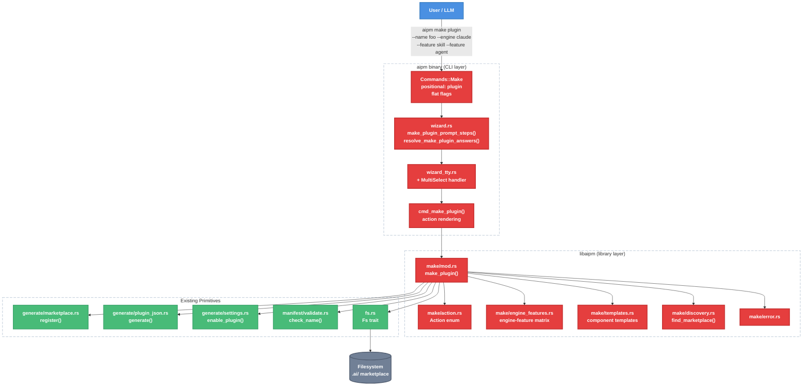

# `aipm make plugin` — Foundational Scaffolding Command

| Document Metadata      | Details                                                                 |
| ---------------------- | ----------------------------------------------------------------------- |
| Author(s)              | Sean Larkin                                                             |
| Status                 | Draft (WIP)                                                             |
| Team / Owner           | AIPM Core                                                               |
| Created / Last Updated | 2026-04-14                                                              |
| Issue                  | [#363](https://github.com/TheLarkInn/aipm/issues/363)                  |
| Related                | [#361](https://github.com/TheLarkInn/aipm/issues/361)                  |
| Research               | [research/tickets/2026-04-14-0363-aipm-make-foundational-api.md](../research/tickets/2026-04-14-0363-aipm-make-foundational-api.md) |

---

## 1. Executive Summary

This spec introduces the `aipm make plugin` command — a new CLI command that scaffolds AI plugins into `.ai/` marketplaces by composing the existing atomic CRUD primitives in libaipm (marketplace registration, plugin.json generation, settings mutation, filesystem scaffolding) into an ordered, idempotent action pipeline. The command features an interactive wizard (engine selection, feature multi-select) that is fully bypassable via flat flags, following the same two-layer wizard pattern as `aipm init`. A central `Action` enum is designed for shared use with future `lint --fix`. As part of this work, the starter plugin's TypeScript scaffold script (#361) is replaced by a bash script that calls `aipm make plugin`, eliminating the Node.js runtime dependency.

---

## 2. Context and Motivation

### 2.1 Current State

The `aipm` CLI has 10 commands (`init`, `install`, `update`, `uninstall`, `link`, `unlink`, `list`, `lint`, `migrate`, `lsp`). None of them create individual plugins inside an existing marketplace. The only way to scaffold a new plugin today is:

1. **`aipm init`** — creates the entire `.ai/` marketplace directory, optionally with a starter plugin. Not designed for adding plugins to an existing marketplace. ([research S-A6](../research/tickets/2026-04-14-0363-aipm-make-foundational-api.md))
2. **`aipm-pack init`** — creates a plugin package in the current directory for publishing. Designed for the authoring workflow, not the local marketplace workflow.
3. **Starter plugin's TypeScript script** — an 88-line TypeScript file (`scaffold-plugin.ts`) generated as a Rust string literal in `workspace_init/mod.rs:327-416`. Invoked by LLMs via `node --experimental-strip-types`. Creates directories, writes plugin.json, registers in marketplace.json, enables in settings.json. Requires Node.js >= 22.6.0. ([research S-Starter](../research/tickets/2026-04-14-0363-aipm-make-foundational-api.md))

All the atomic CRUD primitives needed to create plugins already exist in libaipm — they were consolidated during the DRY refactor (28 features, 4 phases, complete at `06bc32f`). What is missing is a CLI command that composes them. ([research S-A1 through S-A12](../research/tickets/2026-04-14-0363-aipm-make-foundational-api.md))

### 2.2 The Problem

| Problem | Impact |
|---|---|
| No CLI command to add a plugin to an existing marketplace | Users must manually create directories, write JSON, and register entries — error-prone and undiscoverable |
| Starter plugin depends on Node.js >= 22.6.0 with `--experimental-strip-types` | Runtime dependency for a core scaffolding operation; fails silently in environments without Node |
| TypeScript scaffold script duplicates logic already in Rust | Marketplace registration, settings mutation, and plugin.json generation are re-implemented in 88 lines of TS |
| No engine-aware feature filtering | Users can create plugins with features unsupported by their target engine (e.g., LSP servers for Claude) |
| Atomic primitives exist but lack a composition layer | `generate::marketplace::register()`, `generate::settings::enable_plugin()`, etc. have no callers outside workspace_init and migrate |

---

## 3. Goals and Non-Goals

### 3.1 Functional Goals

- [ ] **G1.** `aipm make plugin --name <name> --engine <engine> --feature <features>` creates a plugin in the nearest `.ai/` marketplace with engine-filtered features
- [ ] **G2.** Interactive wizard prompts for name, engine, and features when flags are omitted and stdin is a TTY
- [ ] **G3.** `MultiSelect` prompt kind added to shared wizard types (`libaipm::wizard`) for feature selection
- [ ] **G4.** Central `Action` enum designed for shared use with future `lint --fix`
- [ ] **G5.** All scaffolded output passes `aipm lint` with zero errors
- [ ] **G6.** Idempotent execution — re-running for an existing plugin logs what already exists and informs the user (not a silent no-op)
- [ ] **G7.** Starter plugin (#361) rewritten: TypeScript replaced by bash script calling `aipm make plugin`
- [ ] **G8.** On-disk `.ai/starter-aipm-plugin/` drift fixed as part of the starter plugin rewrite
- [ ] **G9.** Marketplace discovery walks up from cwd to find `.ai/` directory
- [ ] **G10.** `--engine copilot` accepted and scaffolds `.ai/` marketplace structure (no Copilot-specific settings file generation)
- [ ] **G11.** 89% branch coverage maintained across workspace

### 3.2 Non-Goals (Out of Scope)

- [ ] **NG1.** `lint --fix` integration — the shared `Action` type enables it, but wiring is deferred to a subsequent PR
- [ ] **NG2.** `aipm make extension --engine` — command surface is reserved via the positional argument pattern, but not implemented
- [ ] **NG3.** `aipm.toml` manifest generation in scaffolded plugins — no proprietary format yet
- [ ] **NG4.** Copilot settings adaptor — no `.github/copilot/settings.json` generation
- [ ] **NG5.** `aipm-pack` integration — pack uses its own `init` command
- [ ] **NG6.** Dry-run mode for `aipm make`

---

## 4. Proposed Solution (High-Level Design)

### 4.1 System Architecture Diagram



> Red-outlined boxes are new code. Green boxes are existing primitives that `aipm make` composes.

### 4.2 Architectural Pattern

**Action Accumulator** — the same pattern used by `workspace_init::init()` and `migrate::migrate()`:
1. Library function validates preconditions
2. Executes ordered filesystem operations via `&dyn Fs`
3. Accumulates `Vec<Action>` recording each completed step
4. Returns the action list as the sole result
5. CLI layer iterates actions and renders human-readable output

([research S-B](../research/tickets/2026-04-14-0363-aipm-make-foundational-api.md))

### 4.3 Key Components

| Component | Responsibility | Location | Change Type |
|---|---|---|---|
| `make/mod.rs` | Orchestrates `make_plugin()` pipeline | `crates/libaipm/src/make/mod.rs` | **New** |
| `make/action.rs` | Central `Action` enum | `crates/libaipm/src/make/action.rs` | **New** |
| `make/error.rs` | `Error` enum for make operations | `crates/libaipm/src/make/error.rs` | **New** |
| `make/engine_features.rs` | Engine-to-feature mapping matrix | `crates/libaipm/src/make/engine_features.rs` | **New** |
| `make/templates.rs` | Component template generators | `crates/libaipm/src/make/templates.rs` | **New** |
| `make/discovery.rs` | Walk-up marketplace finder | `crates/libaipm/src/make/discovery.rs` | **New** |
| `wizard.rs` (libaipm) | `MultiSelect` prompt kind + answer variant | `crates/libaipm/src/wizard.rs` | **Modified** |
| `wizard.rs` (aipm) | `make_plugin_prompt_steps()`, `resolve_make_plugin_answers()` | `crates/aipm/src/wizard.rs` | **Modified** |
| `wizard_tty.rs` | `MultiSelect` handler in `execute_prompts()` | `crates/aipm/src/wizard_tty.rs` | **Modified** |
| `main.rs` | `Commands::Make` variant, `cmd_make_plugin()`, dispatch | `crates/aipm/src/main.rs` | **Modified** |
| `error.rs` (aipm) | `Make` variant in `CliError` | `crates/aipm/src/error.rs` | **Modified** |
| `workspace_init/mod.rs` | Replace TS generator with bash, update SKILL.md | `crates/libaipm/src/workspace_init/mod.rs` | **Modified** |

---

## 5. Detailed Design

### 5.1 CLI Interface

**Command:** `aipm make plugin [OPTIONS]`

`plugin` is a **positional argument** on the `Make` variant — not a nested clap subcommand. This preserves the codebase convention of flat command structures while reserving the positional space for future values like `extension`.

```rust
/// Scaffold new project components
#[command(about = "Create new plugins and components")]
Make {
    /// What to create
    #[arg(value_parser = ["plugin"])]
    what: String,

    /// Plugin name
    #[arg(long)]
    name: Option<String>,

    /// Target engine: claude, copilot, both
    #[arg(long)]
    engine: Option<String>,

    /// AI features to include (repeatable): skill, agent, mcp, hook, output-style, lsp, extension
    #[arg(long)]
    feature: Vec<String>,

    /// Skip interactive prompts
    #[arg(short = 'y', long)]
    yes: bool,

    /// Working directory (start of walk-up search)
    #[arg(long, default_value = ".")]
    dir: PathBuf,
},
```

**Non-interactive mode (`-y`):**
- `--name` required — error if missing (no sensible default for plugin names)
- `--engine` defaults to `claude` if omitted
- `--feature` required — error if missing (explicit design decision: no guessing what features a plugin should have)

**Interactive mode (default when stdin is a TTY and `-y` not passed):**
- Missing flags trigger wizard prompts; provided flags skip their corresponding prompt

### 5.2 Wizard Design

#### 5.2.1 New Shared Wizard Types (`libaipm::wizard`)

**New `PromptKind` variant:**

```rust
pub enum PromptKind {
    Select { options: Vec<&'static str>, default_index: usize },
    Confirm { default: bool },
    Text { placeholder: String, validate: bool },
    // NEW
    MultiSelect {
        /// Option labels shown to the user.
        options: Vec<&'static str>,
        /// Per-option default selection state (true = pre-selected).
        defaults: Vec<bool>,
    },
}
```

**New `PromptAnswer` variant:**

```rust
pub enum PromptAnswer {
    Selected(usize),
    Bool(bool),
    Text(String),
    // NEW
    MultiSelected(Vec<usize>),  // indices of selected options
}
```

#### 5.2.2 Wizard Prompt Steps (`crates/aipm/src/wizard.rs`)

Three new functions following the existing two-layer pattern:

**`make_plugin_prompt_steps()`**

```rust
pub fn make_plugin_prompt_steps(
    flag_name: Option<&str>,
    flag_engine: Option<&str>,
    flag_features: &[String],
    engine_feature_labels: &[&'static str],  // filtered by resolved engine
    engine_feature_defaults: &[bool],
) -> Vec<PromptStep>
```

| Step | Kind | Condition to Show | Label | Help |
|---|---|---|---|---|
| Name | `Text` (validate=true) | `flag_name.is_none()` | `"Plugin name"` | `"Lowercase, hyphens allowed"` |
| Engine | `Select` | `flag_engine.is_none()` | `"Target engine"` | `"Which AI coding tool will this plugin target?"` |
| Features | `MultiSelect` | `flag_features.is_empty()` | `"AI features to include"` | `"Select the features for your plugin"` |

> **Two-phase dependency**: The feature options depend on the engine answer. When `--engine` is provided via flag, feature options are constructed at step-build time. When engine is prompted interactively, the wizard runs in two phases: resolve engine first, then build and execute the feature prompt. This matches how `workspace_init` already uses conditional logic — the marketplace name prompt depends on the setup mode answer. ([research S-Wizard](../research/tickets/2026-04-14-0363-aipm-make-foundational-api.md))

**Engine options (Select):**

| Index | Label |
|---|---|
| 0 | `"Claude Code"` (default) |
| 1 | `"Copilot CLI"` |
| 2 | `"Both"` |

**`resolve_make_plugin_answers()`**

```rust
pub fn resolve_make_plugin_answers(
    answers: &[PromptAnswer],
    flag_name: Option<&str>,
    flag_engine: Option<&str>,
    flag_features: &[String],
) -> (String, String, Vec<String>)
//   name,   engine, features
```

Walks the `answers` slice with an `idx` counter consuming answers only for prompts that were shown (same pattern as `resolve_workspace_answers()` at `wizard.rs:75`).

#### 5.2.3 TTY Layer (`crates/aipm/src/wizard_tty.rs`)

New handler in `execute_prompts()`:

```rust
PromptKind::MultiSelect { options, defaults } => {
    let mut prompt = inquire::MultiSelect::new(step.label, options.clone());
    // Set default selections
    let default_indices: Vec<usize> = defaults.iter()
        .enumerate()
        .filter_map(|(i, &d)| if d { Some(i) } else { None })
        .collect();
    prompt = prompt.with_default(&default_indices);
    if let Some(help) = step.help {
        prompt = prompt.with_help_message(help);
    }
    let selected = prompt.prompt()?;
    // Map selected labels back to indices
    let indices = selected.iter()
        .filter_map(|s| options.iter().position(|o| o == s))
        .collect();
    PromptAnswer::MultiSelected(indices)
}
```

New entry point for the make wizard:

```rust
pub fn resolve_make_plugin(
    interactive: bool,
    flag_name: Option<&str>,
    flag_engine: Option<&str>,
    flag_features: &[String],
) -> Result<(String, String, Vec<String>), Box<dyn std::error::Error>>
```

When interactive, this function runs in two phases:
1. Execute name + engine prompts, resolve engine answer
2. Compute engine-filtered feature options, execute feature prompt
3. Resolve all answers into `(name, engine, features)` tuple

When not interactive, validates that required flags are present and returns them directly.

### 5.3 Engine-to-Feature Mapping (`make/engine_features.rs`)

A static mapping from engines to available AI feature types. Derived from the implicit mapping in migrate detectors (`migrate/detector.rs:23-44`), but codified as an explicit, reusable data structure. ([research S-Engine](../research/tickets/2026-04-14-0363-aipm-make-foundational-api.md))

```rust
/// A feature that can be included in a plugin.
#[derive(Debug, Clone, Copy, PartialEq, Eq)]
pub enum Feature {
    Skill,
    Agent,
    Mcp,
    Hook,
    OutputStyle,
    Lsp,
    Extension,
}

impl Feature {
    /// CLI flag value (used in --feature).
    pub fn cli_name(&self) -> &'static str { /* "skill", "agent", ... */ }

    /// Human-readable label for wizard prompts.
    pub fn label(&self) -> &'static str { /* "Skills (prompt templates)", ... */ }

    /// Parse from CLI flag value.
    pub fn from_cli_name(s: &str) -> Option<Feature> { /* ... */ }
}
```

**Engine-feature matrix:**

| Feature | `claude` | `copilot` | `both` |
|---|---|---|---|
| `Skill` | yes | yes | yes |
| `Agent` | yes | yes | yes |
| `Mcp` | yes | yes | yes |
| `Hook` | yes | yes | yes |
| `OutputStyle` | yes | no | yes |
| `Lsp` | no | yes | yes |
| `Extension` | no | yes | yes |

```rust
/// Returns the features available for a given engine.
pub fn features_for_engine(engine: &str) -> Vec<Feature> { /* ... */ }

/// Validates that all requested features are supported by the engine.
pub fn validate_features(engine: &str, features: &[Feature]) -> Result<(), Vec<Feature>> { /* ... */ }
```

### 5.4 Marketplace Discovery (`make/discovery.rs`)

Walk-up search starting from the given directory, looking for `.ai/` with a `.claude-plugin/marketplace.json` inside:

```rust
/// Walk up from `start_dir` to find the nearest `.ai/` marketplace.
/// Returns the path to the `.ai/` directory.
pub fn find_marketplace(start_dir: &Path, fs: &dyn Fs) -> Result<PathBuf, Error> {
    // 1. Canonicalize start_dir
    // 2. Check start_dir/.ai/.claude-plugin/marketplace.json
    // 3. If not found, check parent directory
    // 4. Repeat until found or root reached
    // 5. Return Error::MarketplaceNotFound if exhausted
}
```

| Edge Case | Behavior |
|---|---|
| `.ai/` exists but no `marketplace.json` inside | Skip, continue walking up |
| Symlinked `.ai/` | Follow the symlink |
| Permission denied on parent | Stop and return `MarketplaceNotFound` |
| Root reached without finding `.ai/` | Return `Error::MarketplaceNotFound` with helpful message suggesting `aipm init` |

### 5.5 Central Action Enum (`make/action.rs`)

Designed for shared use with future `lint --fix`. Each variant captures what happened and where, enabling CLI rendering, programmatic inspection in tests, and future reuse. ([research S-Action](../research/tickets/2026-04-14-0363-aipm-make-foundational-api.md))

```rust
use std::path::PathBuf;

/// An atomic, idempotent scaffolding action.
/// Designed for shared use between `aipm make` and future `lint --fix`.
#[derive(Debug, Clone, PartialEq, Eq)]
pub enum Action {
    /// Created a new directory.
    DirectoryCreated { path: PathBuf },
    /// Directory already existed (idempotent skip).
    DirectoryAlreadyExists { path: PathBuf },

    /// Wrote a new file.
    FileWritten { path: PathBuf, description: String },
    /// File already existed (idempotent skip).
    FileAlreadyExists { path: PathBuf },

    /// Registered plugin in marketplace.json.
    PluginRegistered { name: String, marketplace_path: PathBuf },
    /// Plugin was already registered (idempotent skip).
    PluginAlreadyRegistered { name: String },

    /// Enabled plugin in engine settings.
    PluginEnabled { plugin_key: String, settings_path: PathBuf },
    /// Plugin was already enabled (idempotent skip).
    PluginAlreadyEnabled { plugin_key: String },

    /// Top-level summary: a complete plugin was created.
    PluginCreated { name: String, path: PathBuf, features: Vec<String>, engine: String },
}
```

### 5.6 Make Plugin Orchestrator (`make/mod.rs`)

```rust
pub struct MakePluginOpts<'a> {
    /// Resolved marketplace directory (.ai/).
    pub marketplace_dir: &'a Path,
    /// Plugin name (already validated).
    pub name: &'a str,
    /// Target engine: "claude", "copilot", or "both".
    pub engine: &'a str,
    /// Selected features (already validated against engine).
    pub features: &'a [Feature],
}

pub struct MakeResult {
    pub actions: Vec<Action>,
}

/// Scaffold a new plugin in the marketplace.
pub fn make_plugin(
    opts: &MakePluginOpts<'_>,
    fs: &dyn Fs,
) -> Result<MakeResult, Error>
```

**Execution sequence:**

```
make_plugin(opts, fs) -> Result<MakeResult, Error>
  1. let plugin_dir = marketplace_dir / name
  2. Guard: if plugin_dir exists:
       a. actions.push(DirectoryAlreadyExists { plugin_dir })
       b. return Ok(MakeResult { actions })  -- idempotent early return
  3. fs.create_dir_all(plugin_dir)
     actions.push(DirectoryCreated { plugin_dir })
  4. fs.create_dir_all(plugin_dir / ".claude-plugin")
     actions.push(DirectoryCreated { ... })
  5. For each feature in opts.features:
       a. Create feature-specific directory (e.g., skills/<name>/)
       b. Write feature-specific template file
       c. actions.push(DirectoryCreated { ... })
       d. actions.push(FileWritten { ... })
  6. Generate plugin.json with component paths for selected features
     fs.write_file(plugin_dir / ".claude-plugin/plugin.json", content)
     actions.push(FileWritten { path, description: "Plugin manifest" })
  7. Register in marketplace.json:
     generate::marketplace::register(fs, marketplace_json_path, &entry)
     actions.push(PluginRegistered { name, marketplace_path })
     -- or PluginAlreadyRegistered if register() was a no-op
  8. For each engine ("claude" and/or "copilot"):
     If engine == "claude":
       Read or create .claude/settings.json
       generate::settings::enable_plugin(&mut settings, plugin_key)
       generate::settings::write(fs, settings_path, &settings)
       actions.push(PluginEnabled { plugin_key, settings_path })
     If engine == "copilot":
       -- No-op for now (NG4). Reserve for future Copilot adaptor.
  9. actions.push(PluginCreated { name, path, features, engine })
  10. return Ok(MakeResult { actions })
```

### 5.7 Component Templates (`make/templates.rs`)

Minimal lint-passing templates. Each template includes exactly the frontmatter and structure needed to pass `aipm lint`.

| Feature | File Created | Template Content |
|---|---|---|
| `Skill` | `skills/<name>/SKILL.md` | Frontmatter: `name: <name>`, `description: "TODO: Describe <name>"`. Body: placeholder instructions. |
| `Agent` | `agents/<name>.md` | Frontmatter: `name: <name>`, `description: "TODO: Describe <name>"`, `tools: []`. Body: placeholder instructions. |
| `Mcp` | `.mcp.json` | `{"mcpServers": {}}` |
| `Hook` | `hooks/hooks.json` | `{"hooks": []}` |
| `OutputStyle` | `output-styles/<name>.md` | Frontmatter: `name: <name>`. Body: placeholder style definition. |
| `Lsp` | `.lsp.json` | `{"lspServers": {}}` |
| `Extension` | `extensions/.gitkeep` | Empty file (future-proofing, not implemented) |

**Lint compliance:** Each template is verified to pass the corresponding lint rules:
- Skills: `skill/missing-name`, `skill/missing-description`, `skill/name-too-long`, `skill/description-too-long`
- Plugins: `plugin/required-fields` (name, version, description in plugin.json)
- Hooks: `hook/legacy-event-name` (no legacy event names)

```rust
pub fn skill_template(name: &str) -> String { /* ... */ }
pub fn agent_template(name: &str) -> String { /* ... */ }
pub fn mcp_template() -> String { /* ... */ }
pub fn hook_template() -> String { /* ... */ }
pub fn output_style_template(name: &str) -> String { /* ... */ }
pub fn lsp_template() -> String { /* ... */ }
```

### 5.8 Error Types (`make/error.rs`)

```rust
#[derive(Debug, thiserror::Error)]
pub enum Error {
    #[error("marketplace not found (run `aipm init` first)")]
    MarketplaceNotFound,

    #[error("invalid plugin name: {0}")]
    InvalidName(String),

    #[error("feature {feature} is not supported by engine {engine}")]
    UnsupportedFeature { feature: String, engine: String },

    #[error("invalid engine: {0} (expected: claude, copilot, both)")]
    InvalidEngine(String),

    #[error("invalid feature: {0} (expected: skill, agent, mcp, hook, output-style, lsp, extension)")]
    InvalidFeature(String),

    #[error("missing required flag: --{0}")]
    MissingFlag(String),

    #[error(transparent)]
    Io(#[from] std::io::Error),

    #[error(transparent)]
    Json(#[from] serde_json::Error),
}
```

### 5.9 CLI Handler (`cmd_make_plugin()`)

Following the pattern of `cmd_init()` at `main.rs:329-376`:

```rust
fn cmd_make_plugin(
    name: Option<&str>,
    engine: Option<&str>,
    features: &[String],
    yes: bool,
    dir: PathBuf,
) -> Result<(), error::CliError> {
    let dir = resolve_dir(dir)?;
    let interactive = !yes && std::io::stdin().is_terminal();

    // 1. Resolve wizard values
    let (name, engine, features) = wizard_tty::resolve_make_plugin(
        interactive, name, engine, features,
    )?;

    // 2. Validate
    libaipm::manifest::validate::check_name(&name, ValidationMode::Strict)
        .map_err(|e| make::Error::InvalidName(e))?;

    let engine_str = &engine;
    let parsed_features: Vec<Feature> = features.iter()
        .map(|f| Feature::from_cli_name(f).ok_or_else(|| make::Error::InvalidFeature(f.clone())))
        .collect::<Result<_, _>>()?;

    make::engine_features::validate_features(engine_str, &parsed_features)
        .map_err(|unsupported| make::Error::UnsupportedFeature {
            feature: unsupported[0].cli_name().to_string(),
            engine: engine_str.to_string(),
        })?;

    // 3. Discover marketplace
    let marketplace_dir = make::discovery::find_marketplace(&dir, &libaipm::fs::Real)?;

    // 4. Execute
    let opts = make::MakePluginOpts {
        marketplace_dir: &marketplace_dir,
        name: &name,
        engine: engine_str,
        features: &parsed_features,
    };
    let result = make::make_plugin(&opts, &libaipm::fs::Real)?;

    // 5. Render actions
    let mut stdout = std::io::stdout();
    for action in &result.actions {
        match action {
            Action::DirectoryCreated { path } =>
                { let _ = writeln!(stdout, "  Created {}", path.display()); }
            Action::DirectoryAlreadyExists { path } =>
                { let _ = writeln!(stdout, "  (exists) {}", path.display()); }
            Action::FileWritten { path, description } =>
                { let _ = writeln!(stdout, "  Wrote {} ({})", path.display(), description); }
            Action::FileAlreadyExists { path } =>
                { let _ = writeln!(stdout, "  (exists) {}", path.display()); }
            Action::PluginRegistered { name, .. } =>
                { let _ = writeln!(stdout, "  Registered '{name}' in marketplace"); }
            Action::PluginAlreadyRegistered { name } =>
                { let _ = writeln!(stdout, "  (already registered) '{name}'"); }
            Action::PluginEnabled { plugin_key, .. } =>
                { let _ = writeln!(stdout, "  Enabled '{plugin_key}' in settings"); }
            Action::PluginAlreadyEnabled { plugin_key } =>
                { let _ = writeln!(stdout, "  (already enabled) '{plugin_key}'"); }
            Action::PluginCreated { name, features, engine, .. } =>
                { let _ = writeln!(stdout, "Created plugin '{name}' ({engine}) with features: {}",
                    features.join(", ")); }
        }
    }
    Ok(())
}
```

### 5.10 Starter Plugin Redesign (#361)

Three generator functions in `workspace_init/mod.rs` change:

#### `generate_scaffold_script()` (mod.rs:327-416) — TS to Bash

**Before (88-line TypeScript):** Node.js script with inline marketplace.json and settings.json manipulation.

**After (~5-line bash):**

```bash
#!/usr/bin/env bash
set -euo pipefail
# Scaffold a new AI plugin using the aipm CLI.
# Usage: bash scaffold-plugin.sh <plugin-name> [--engine claude|copilot|both]
aipm make plugin --name "${1:?Plugin name required}" --engine "${2:-claude}" -y
```

The file extension changes from `.ts` to `.sh`. The Rust function returns this as a string literal.

#### `generate_skill_template()` (mod.rs:299-324) — Updated SKILL.md

**Before:** Instructs LLM to run `node --experimental-strip-types .ai/starter-aipm-plugin/scripts/scaffold-plugin.ts <plugin-name>`.

**After:** Instructs LLM to run `aipm make plugin --name <name> --engine <engine> --feature <features>`. The SKILL.md body provides flag documentation and examples so the LLM can reason about which options to pass:

```markdown
---
name: scaffold-plugin
description: Scaffold a new AI plugin in the local marketplace using aipm make
---

# Scaffold Plugin

Create a new AI plugin by running the `aipm make plugin` command.

## Usage

Ask the user for:
1. A plugin name (lowercase, hyphens allowed)
2. Which engine to target (claude, copilot, or both)
3. Which features to include (skill, agent, mcp, hook, output-style, lsp, extension)

Then run:

```
aipm make plugin --name <plugin-name> --engine <engine> --feature <feature1> --feature <feature2> -y
```

After creation, report the generated file tree and suggest next steps:
- Edit the generated SKILL.md or agent definitions
- Run `aipm lint` to verify the plugin passes all rules
- Test the plugin by using it in your AI coding tool
```

#### `scaffold_marketplace()` (mod.rs:174-273) — File path update

Line 234-236 changes the written path from `scripts/scaffold-plugin.ts` to `scripts/scaffold-plugin.sh`.

The `generate_starter_manifest()` function updates the scripts component from `scripts/scaffold-plugin.ts` to `scripts/scaffold-plugin.sh`.

The `plugin.json` generation call updates any component paths that referenced `.ts` to `.sh`.

#### On-disk drift fix

The committed `.ai/starter-aipm-plugin/` is regenerated to match the Rust generator output:
- Marketplace name aligned (currently `"aipm-local-plugins"` on disk vs `"local-repo-plugins"` in generator)
- `plugin.json` component keys added (skills, agents, hooks paths)
- Author fields updated from `"TODO"` to match repo owner
- Script extension changed from `.ts` to `.sh`

### 5.11 `run()` Dispatch Addition

In `main.rs:938-1008`, add a match arm for `Commands::Make`:

```rust
Some(Commands::Make { what, name, engine, feature, yes, dir }) => {
    match what.as_str() {
        "plugin" => cmd_make_plugin(
            name.as_deref(),
            engine.as_deref(),
            &feature,
            yes,
            dir,
        ),
        _ => Err(error::CliError::Message(
            format!("unknown make target: {what}")
        )),
    }
}
```

### 5.12 `CliError` Addition

Add variant to `crates/aipm/src/error.rs`:

```rust
#[error(transparent)]
Make(#[from] libaipm::make::Error),
```

---

## 6. Alternatives Considered

| Option | Pros | Cons | Reason for Rejection |
|---|---|---|---|
| **A: Nested clap subcommands** (`aipm make plugin new`) | Clear hierarchy, each subcommand has its own args | No codebase precedent; all 10 existing commands use flat structure | Inconsistency with existing patterns. Positional arg achieves the same result. |
| **B: Flag-only** (`aipm make --type plugin --name foo`) | Everything is a `--flag`, maximally flat | Verbose; `--type` is redundant boilerplate on every invocation | Positional arg is more ergonomic for the common case. |
| **C: MultiSelect for engine** (check Claude, check Copilot) | More flexible for future engines | Overkill for 2 options; requires MultiSelect for a binary choice | Select with "Both" option is simpler UX. |
| **D: Default features with `-y`** (default to Skill) | Easier non-interactive use | Hides what gets created; users may not want a Skill | Error-on-missing forces intentionality. Users who want defaults can alias. |
| **E: Keep TypeScript scaffold** | No changes to starter plugin | Node.js runtime dependency; logic duplicated from Rust | Bash + `aipm make` eliminates the dependency and deduplication. |
| **F: Always use cwd for marketplace** | Simple implementation | Requires user to `cd` to project root | Walk-up discovery is more ergonomic (matches `git` behavior). |

---

## 7. Cross-Cutting Concerns

### 7.1 Lint Compliance

All scaffolded output must pass `aipm lint` with zero errors. This is verified by:
1. Template generators are snapshot-tested to produce lint-compliant content
2. An E2E test runs `aipm make plugin` followed by `aipm lint` and asserts zero diagnostics
3. The `plugin.json` generator (`generate/plugin_json.rs`) already produces compliant output — this is not new

### 7.2 Error Handling

| Operation | Error Strategy | Rationale |
|---|---|---|
| Name validation | `Error::InvalidName` — fail fast before any I/O | Names are structural; invalid names cause downstream failures |
| Feature validation | `Error::UnsupportedFeature` — fail fast | Clear message about engine/feature mismatch |
| Marketplace not found | `Error::MarketplaceNotFound` — suggest `aipm init` | Common first-run mistake; actionable error message |
| Filesystem I/O | `Error::Io` — propagated via `?` | Standard I/O error handling through `Fs` trait |
| Plugin already exists | Idempotent: return `AlreadyExists` actions, not an error | Design decision: inform the user, don't fail |

### 7.3 Idempotency

Every step in the pipeline checks preconditions:
- `fs.exists(plugin_dir)` before creating
- `generate::marketplace::register()` already skips if entry exists (returns `Ok(())`)
- `generate::settings::enable_plugin()` returns `false` if key exists

When `make_plugin()` encounters an existing plugin directory, it returns immediately with `DirectoryAlreadyExists` — no partial state, no cleanup needed. The CLI renders these "already exists" actions with an info prefix so the user knows what was skipped and why.

### 7.4 Verbosity

The `make` command respects the existing verbosity system (`-v`, `-vv`, `-q`, `-qq`). At default verbosity, only the final `PluginCreated` summary and any already-exists warnings are shown. At `-v`, all individual `DirectoryCreated`/`FileWritten` actions are shown. At `-q`, only errors.

---

## 8. Migration, Rollout, and Testing

### 8.1 Implementation Phases

| Phase | Scope | Depends on | Estimated files |
|---|---|---|---|
| **1: Core make module** | `make/action.rs`, `make/error.rs`, `make/engine_features.rs`, `make/templates.rs`, `make/discovery.rs`, `make/mod.rs`, `lib.rs` module registration | None | 7 new |
| **2: Wizard MultiSelect** | `libaipm::wizard` new variants, `aipm::wizard` prompt steps + resolver, `aipm::wizard_tty` handler | None (parallel with Phase 1) | 3 modified |
| **3: CLI integration** | `Commands::Make` variant, `cmd_make_plugin()`, `CliError::Make`, `run()` dispatch | Phase 1, Phase 2 | 2 modified |
| **4: Starter plugin redesign** | `workspace_init/mod.rs` generator updates, snapshot updates, on-disk `.ai/` regeneration | Phase 3 (need working `aipm make plugin`) | 2 modified + snapshots |
| **5: Tests and coverage** | Unit tests, E2E tests, BDD feature files, coverage verification | Phase 3, Phase 4 | ~10 new/modified |

### 8.2 Test Plan

#### 8.2.1 Unit Tests (`crates/libaipm/src/make/`)

| Test | Assertions |
|---|---|
| `make_plugin_creates_skill_plugin` | MockFs: verify directory structure, file contents, action list for `--feature skill` |
| `make_plugin_creates_composite` | MockFs: verify multiple feature directories for `--feature skill --feature agent --feature hook` |
| `make_plugin_idempotent` | MockFs: pre-create plugin dir, verify `DirectoryAlreadyExists` action returned |
| `make_plugin_registers_in_marketplace` | MockFs: verify marketplace.json updated with new entry |
| `make_plugin_enables_in_settings` | MockFs: verify `.claude/settings.json` updated with `enabledPlugins` key |
| `make_plugin_copilot_no_settings` | MockFs: verify no `.github/copilot/` files created for `--engine copilot` |
| `make_plugin_both_engines` | MockFs: verify Claude settings written, Copilot skipped, all features available |
| `engine_features_claude` | `features_for_engine("claude")` returns Skill, Agent, Mcp, Hook, OutputStyle |
| `engine_features_copilot` | `features_for_engine("copilot")` returns Skill, Agent, Mcp, Hook, Lsp, Extension |
| `engine_features_both` | `features_for_engine("both")` returns all 7 features |
| `validate_features_rejects_lsp_for_claude` | `validate_features("claude", &[Lsp])` returns `Err` |
| `find_marketplace_walks_up` | MockFs: `.ai/` two levels up, discovery finds it |
| `find_marketplace_not_found` | MockFs: no `.ai/` anywhere, returns `MarketplaceNotFound` |
| `templates_pass_lint` | Generate each template, run lint rules, assert zero diagnostics |

#### 8.2.2 Snapshot Tests

| Test | What is snapped |
|---|---|
| `skill_template_snapshot` | Output of `templates::skill_template("my-plugin")` |
| `agent_template_snapshot` | Output of `templates::agent_template("my-plugin")` |
| `mcp_template_snapshot` | Output of `templates::mcp_template()` |
| `hook_template_snapshot` | Output of `templates::hook_template()` |
| `output_style_template_snapshot` | Output of `templates::output_style_template("my-plugin")` |
| `lsp_template_snapshot` | Output of `templates::lsp_template()` |
| `scaffold_script_snapshot` | Updated bash script (replaces existing TS snapshot) |
| `skill_definition_snapshot` | Updated SKILL.md for starter plugin |

#### 8.2.3 Wizard Unit Tests (`crates/aipm/src/wizard.rs`)

| Test | Assertions |
|---|---|
| `make_plugin_steps_all_flags_set` | Returns empty vec (all prompts skipped) |
| `make_plugin_steps_no_flags` | Returns 3 steps: Text, Select, MultiSelect |
| `make_plugin_steps_name_only` | Returns 2 steps: Select, MultiSelect (name skipped) |
| `resolve_make_plugin_from_flags` | Flags passed through directly |
| `resolve_make_plugin_from_answers` | Answers mapped correctly for all 3 prompts |
| `resolve_make_plugin_claude_features` | Features filtered to Claude-only set |
| `resolve_make_plugin_copilot_features` | Features filtered to Copilot-only set |

#### 8.2.4 E2E Tests (`crates/aipm/tests/make_e2e.rs`)

| Test | Steps | Assertions |
|---|---|---|
| `make_plugin_skill_claude` | `aipm init -y` then `aipm make plugin --name foo --engine claude --feature skill -y` | `.ai/foo/` exists, `skills/foo/SKILL.md` has frontmatter, plugin.json valid, marketplace.json has entry, `.claude/settings.json` has `enabledPlugins` |
| `make_plugin_composite` | `aipm init -y` then `aipm make plugin --name bar --engine claude --feature skill --feature agent --feature hook -y` | All 3 feature directories created, plugin.json has all component paths |
| `make_plugin_copilot` | `aipm init -y` then `aipm make plugin --name baz --engine copilot --feature skill -y` | `.ai/baz/` created, no `.github/copilot/` files, marketplace.json entry exists |
| `make_plugin_both_engines` | `aipm init -y` then `aipm make plugin --name qux --engine both --feature skill --feature lsp -y` | Both features created, Claude settings updated |
| `make_plugin_idempotent` | Run `aipm make plugin ... -y` twice | Second run exits 0, stdout contains "exists" |
| `make_plugin_lint_clean` | `aipm init -y` then `aipm make plugin ... -y` then `aipm lint` | Zero lint diagnostics |
| `make_plugin_missing_name` | `aipm make plugin --engine claude --feature skill -y` | Non-zero exit, stderr contains "missing required flag: --name" |
| `make_plugin_missing_feature` | `aipm make plugin --name foo --engine claude -y` | Non-zero exit, stderr contains "missing required flag: --feature" |
| `make_plugin_invalid_feature_for_engine` | `aipm make plugin --name foo --engine claude --feature lsp -y` | Non-zero exit, stderr contains "not supported by engine" |
| `make_plugin_no_marketplace` | `aipm make plugin --name foo --engine claude --feature skill -y` (no prior init) | Non-zero exit, stderr contains "marketplace not found" |

#### 8.2.5 Updated Starter Plugin E2E Tests

The existing tests at `crates/aipm/tests/init_e2e.rs:255-311` are updated:

| Current Test | Change |
|---|---|
| `scaffold_script_registers_in_marketplace_json` | Invoke bash script instead of node; assert same marketplace.json result |
| `scaffold_script_enables_in_settings_json` | Invoke bash script; assert same settings.json result |
| `scaffold_script_creates_plugin_directory` | Invoke bash script; assert directory structure |

The `run_scaffold()` helper changes from `Command::new("node")` to `Command::new("bash")` (or `Command::new("aipm")` with make args).

#### 8.2.6 BDD Feature File (`tests/features/make.feature`)

```gherkin
Feature: aipm make plugin

  Scenario: Create a skill plugin for Claude
    Given an initialized workspace
    When I run aipm make plugin --name my-skill --engine claude --feature skill -y
    Then the plugin directory .ai/my-skill/ exists
    And .ai/my-skill/skills/my-skill/SKILL.md contains "name: my-skill"
    And .ai/.claude-plugin/marketplace.json contains "my-skill"
    And .claude/settings.json enabledPlugins contains "my-skill"
    And aipm lint reports zero errors

  Scenario: Create a composite plugin with multiple features
    Given an initialized workspace
    When I run aipm make plugin --name multi --engine claude --feature skill --feature agent --feature hook -y
    Then the plugin directory .ai/multi/ exists
    And .ai/multi/skills/multi/SKILL.md exists
    And .ai/multi/agents/multi.md exists
    And .ai/multi/hooks/hooks.json exists

  Scenario: Idempotent re-run
    Given an initialized workspace
    And I have already created plugin my-plugin
    When I run aipm make plugin --name my-plugin --engine claude --feature skill -y
    Then the exit code is 0
    And stdout contains "exists"

  Scenario: Missing feature flag in non-interactive mode
    Given an initialized workspace
    When I run aipm make plugin --name foo --engine claude -y
    Then the exit code is non-zero
    And stderr contains "missing required flag: --feature"

  Scenario: Unsupported feature for engine
    Given an initialized workspace
    When I run aipm make plugin --name foo --engine claude --feature lsp -y
    Then the exit code is non-zero
    And stderr contains "not supported by engine claude"
```

### 8.3 Verification Gates

All four must pass before merge (per CLAUDE.md):

```bash
cargo build --workspace
cargo test --workspace
cargo clippy --workspace -- -D warnings
cargo fmt --check
```

Coverage verification:

```bash
cargo +nightly llvm-cov clean --workspace
cargo +nightly llvm-cov --no-report --workspace --branch
cargo +nightly llvm-cov --no-report --doc
cargo +nightly llvm-cov report --doctests --branch \
  --ignore-filename-regex '(tests/|research/|specs/|wizard_tty\.rs|lsp\.rs)'
```

TOTAL branch column must show >= 89%.

---

## 9. Open Questions / Unresolved Issues

- [x] ~~Command surface: nested subcommands vs flat flags vs positional arg?~~ **Resolved.** Positional arg: `aipm make plugin --name foo`.
- [x] ~~Engine prompt widget: Select vs MultiSelect?~~ **Resolved.** Select with "Both" option.
- [x] ~~Marketplace discovery: walk-up vs cwd vs --dir?~~ **Resolved.** Walk up from cwd.
- [x] ~~Copilot adaptor scope?~~ **Resolved.** Accept `--engine copilot` but scaffold only (no Copilot settings).
- [x] ~~Template richness?~~ **Resolved.** Minimal lint-passing templates.
- [x] ~~On-disk drift fix?~~ **Resolved.** Fix in this PR.
- [x] ~~Default features with -y?~~ **Resolved.** Error if `--feature` missing.
- [x] ~~Action type unification with lint --fix?~~ **Resolved.** Shared Action enum designed for it; wiring deferred.
- [x] ~~Idempotency behavior?~~ **Resolved.** Log and inform (not silent no-op).
- [x] ~~Dry-run support?~~ **Resolved.** Not needed.
- [x] ~~Scope of lint --fix?~~ **Resolved.** Deferred to subsequent PR.
- [x] ~~`aipm make extension --engine` scope?~~ **Resolved.** Deferred; positional arg reserves the surface.
- [x] ~~Starter plugin TypeScript replacement?~~ **Resolved.** Bash script calling `aipm make plugin`.
- [ ] **Walk-up depth limit**: Should the marketplace walk-up search have a maximum depth (e.g., 10 levels) to avoid scanning all the way to `/`?
- [ ] **Starter plugin on-disk regeneration method**: Should the on-disk `.ai/` be regenerated by running `aipm init --force` (new flag), or manually updated to match the generator output?
