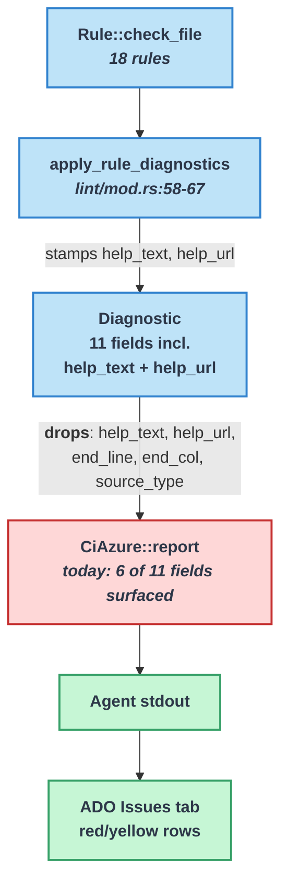
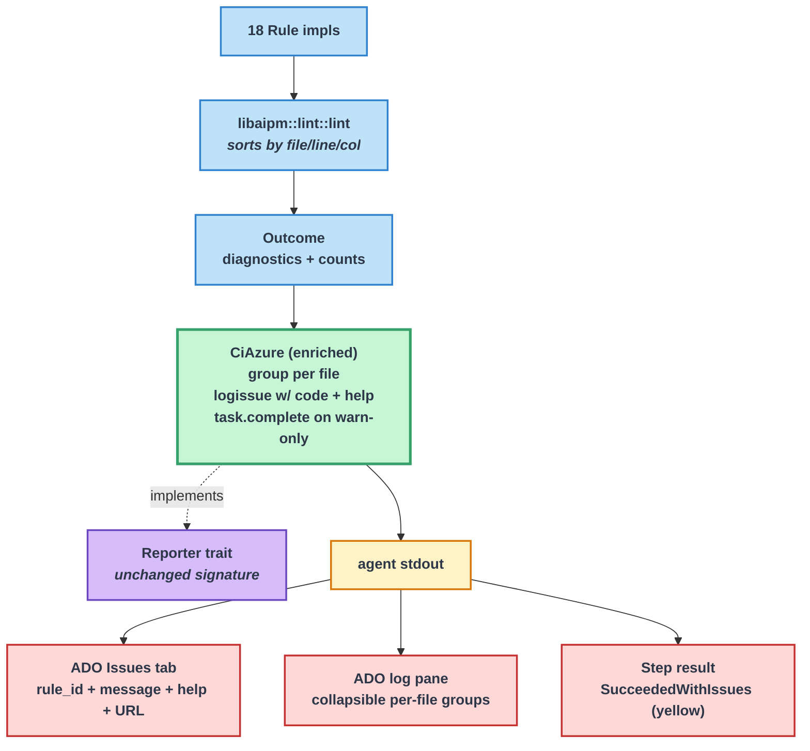

# Azure DevOps Lint Reporter — Enrichment for Developer Troubleshooting

| Document Metadata      | Details                                                                       |
| ---------------------- | ----------------------------------------------------------------------------- |
| Author(s)              | Sean Larkin                                                                   |
| Status                 | Draft (WIP)                                                                   |
| Team / Owner           | aipm                                                                          |
| Created / Last Updated | 2026-04-20 / 2026-04-20                                                       |
| Related Research       | [`research/docs/2026-04-20-azure-devops-lint-reporter-parity.md`](../research/docs/2026-04-20-azure-devops-lint-reporter-parity.md) |
| Supersedes             | n/a — enriches [`specs/2026-04-03-lint-display-ux.md`](./2026-04-03-lint-display-ux.md) §`ci-azure` |

## 1. Executive Summary

`aipm lint --reporter ci-azure` currently emits one bare `##vso[task.logissue]` line per diagnostic and drops five of the eleven `Diagnostic` fields, including `help_text` and `help_url`. Developers seeing a pipeline failure in the Azure DevOps Issues tab get the rule id, location, and message — but no fix guidance, no rule docs URL, no log structure, and no yellow-step signal for warnings-only runs. This spec enriches the existing `ci-azure` reporter in place so every piece of context the `Human` reporter prints to a terminal is also surfaced through the ADO pipeline protocol via `##vso[task.logissue]` (with `code=` + inline help), `##[group]` per-file wrapping, and `##vso[task.complete result=SucceededWithIssues;]` on warnings-only runs. Scope is deliberately bounded: stdout-only, no markdown summary / JSONL / SARIF artifacts — those are follow-up work.

## 2. Context and Motivation

### 2.1 Current State

The four lint reporters live in [`crates/libaipm/src/lint/reporter.rs`](../crates/libaipm/src/lint/reporter.rs) and are dispatched from [`crates/aipm/src/main.rs:761-779`](../crates/aipm/src/main.rs). `CiAzure` (lines 337–359) is a zero-sized struct whose entire implementation is:

```rust
for d in &outcome.diagnostics {
    writeln!(
        writer,
        "##vso[task.logissue type={severity};sourcepath={sourcepath};linenumber={line};columnnumber={col}]{rule_id}: {message}",
    )?;
}
```



### 2.2 The Problem

- **Developer impact:** When a build fails on the ADO Issues tab, the developer sees `skill/missing-description: SKILL.md missing required field: description` — no hint on how to fix it, no link to rule docs. To troubleshoot they must reproduce locally with `--reporter human` to see the `help:` footers. Every shipping rule populates `help_text` and `help_url`, but the reporter discards them.
- **Agent impact:** An AI agent reading the ADO log cannot distinguish per-file grouping, cannot read the rule documentation URL inline, and cannot tell a warnings-only run apart from a failure without correlating exit codes separately.
- **Step status impact:** Warnings cause green steps (exit 0). There is no yellow-step signal for "build succeeded but has actionable issues," so warnings get less visibility than they deserve.
- **Log navigation:** The raw log pane is a flat stream. With many diagnostics across many files, there's no way to collapse per-file sections.
- **Protocol under-use:** The current output ignores five natively-supported ADO surfaces: `code=` property, `##[group]` / `##[endgroup]`, `##[error]`/`##[warning]` formatting commands, `##vso[task.complete]`, and `##vso[task.setvariable]`. See research §6 for the full ADO protocol inventory.

## 3. Goals and Non-Goals

### 3.1 Functional Goals

- [ ] `CiAzure::report` surfaces `help_text` and `help_url` on every diagnostic that has them (all 18 shipping rules), concatenated into the `##vso[task.logissue]` message body.
- [ ] Every `##vso[task.logissue]` line sets `code=<rule_id>`, enabling MSBuild-style Issues-tab rendering.
- [ ] Diagnostics are wrapped in `##[group]aipm lint: <file_path>` / `##[endgroup]` sections, one group per unique `file_path` (diagnostics are already sorted by file_path at [`lint/mod.rs:156-161`](../crates/libaipm/src/lint/mod.rs)).
- [ ] When `outcome.warning_count > 0 && outcome.error_count == 0`, the reporter emits `##vso[task.complete result=SucceededWithIssues;]` so the ADO step renders yellow.
- [ ] Empty `Outcome` still produces zero bytes (no behavior change for clean runs).
- [ ] All new output is covered by Rust unit tests *and* full-output `insta` golden snapshots.
- [ ] The single `--reporter ci-azure` flag stays; no new CLI surface area, no deprecation, no legacy flag. The change is additive to the message body — the `##vso[task.logissue]` command prefix + properties retain identical shape.
- [ ] Degradation rules: if `help_text` is `None` and `help_url` is `None` on a specific diagnostic, the logissue message is identical to today. Surface only the pieces that exist.

### 3.2 Non-Goals (Out of Scope)

- [ ] **No markdown summary / `##vso[task.uploadsummary]`.** Researched and understood (research §6d) — deferred to a follow-up spec.
- [ ] **No JSONL / `##vso[task.uploadfile]` agent stream.** Deferred.
- [ ] **No SARIF 2.1.0 output or `CodeAnalysisLogs` artifact.** Deferred — separate spec would decide publisher.
- [ ] **No `##vso[task.setvariable]` output variables.** No downstream consumer in-repo today.
- [ ] **No PR-diff annotations via Pull Request Threads REST API.** `task.logissue` is build-scoped; annotations require GHAzDO or a custom REST call. Research §6f catalogs the options. Documented as future work.
- [ ] **No rule-side plumbing of `end_line` / `end_col`.** Research §10 showed 0 rules populate `end_line`. `##vso[task.logissue]` doesn't support endline/endcolumn anyway; this is a Human/JSON/LSP concern tracked by a separate spec.
- [ ] **No changes to `Reporter` trait signature.** Stays `fn report(&self, &Outcome, &mut dyn Write) -> std::io::Result<()>`.
- [ ] **No `Fs` / `base_dir` fields added to `CiAzure`.** Stays zero-sized; those only become necessary when multi-artifact emission lands. Deferring keeps the CLI dispatch at `main.rs:770` unchanged.
- [ ] **No changes to `CiGitHub`, `Human`, `Json`, `Text` reporters.** GitHub Actions has its own enrichment story (research §5) worth a separate spec.
- [ ] **No empirical verification of ADO Issues-tab rendering for edge cases** (e.g. whether `code=<rule_id>` renders, whether the help URL auto-linkifies in the message body). Verification happens after implementation in a real pipeline. Documented as an acceptance check, not a design prerequisite.

## 4. Proposed Solution (High-Level Design)

### 4.1 System Architecture Diagram



### 4.2 Architectural Pattern

**Pure enrichment** of the existing `CiAzure` reporter: same trait, same CLI flag, same zero-sized struct, same single-sink `Write` contract. The output format grows richer by adopting four additional `##vso` / `##[]` protocol elements Azure DevOps already parses — the change is at the byte level of the reporter's emitted stream, not the type system.

### 4.3 Key Components

| Component                        | Responsibility                                                         | Location                                                                                              | Notes                                                  |
| -------------------------------- | ---------------------------------------------------------------------- | ----------------------------------------------------------------------------------------------------- | ------------------------------------------------------ |
| `CiAzure::report`                | Emit `##[group]` + `##vso[task.logissue code=...]` + `##[endgroup]` + optional `task.complete`. | [`crates/libaipm/src/lint/reporter.rs:337-359`](../crates/libaipm/src/lint/reporter.rs)               | Rewritten; same struct shape (zero-sized).             |
| `format_azure_logissue_body` (new helper) | Build the `<rule_id>: <message>[ — <help_text>][ (see <help_url>)]` message suffix. | `crates/libaipm/src/lint/reporter.rs` (new free fn)                                                   | Pure function, small, exhaustively unit-tested.        |
| `escape_azure_log_command`       | Unchanged. Already handles `%`, `\r`, `\n`, `;`, `]`.                  | [`crates/libaipm/src/lint/reporter.rs:376-382`](../crates/libaipm/src/lint/reporter.rs)               | Applied to `sourcepath`, `code`, message body (rule_id + message + help_text + help_url segment). |
| `insta` dev-dep                  | Golden-output snapshot testing.                                        | `crates/libaipm/Cargo.toml` (`[dev-dependencies]`)                                                    | First use of `insta` in the workspace.                 |
| CLI dispatch                     | No change. Still `main.rs:770-772`.                                    | [`crates/aipm/src/main.rs:770-772`](../crates/aipm/src/main.rs)                                       | `libaipm::lint::reporter::CiAzure.report(...)`.        |

## 5. Detailed Design

### 5.1 Output Contract (byte-exact format)

The reporter's stdout stream, for a non-empty `Outcome`, is the concatenation of:

1. **Per-file group opener**, emitted once at the start of each run of diagnostics sharing the same `file_path` (diagnostics are pre-sorted by file_path at `lint/mod.rs:156-161`):

   ```
   ##[group]aipm lint: <file_path>\n
   ```

   `<file_path>` is `d.file_path.display().to_string()` **without** `escape_azure_log_command` applied (the `##[group]` formatting command is not a `##vso[...]` command and does not share the property-block escape rules — the value is rendered literally in the log pane).

2. **Per-diagnostic logissue**, exactly one per `Diagnostic`:

   ```
   ##vso[task.logissue type=<severity>;sourcepath=<file>;linenumber=<n>;columnnumber=<n>;code=<code>]<body>\n
   ```

   where:
   - `<severity>` — `error` if `d.severity == Severity::Error`, else `warning`.
   - `<file>` — `escape_azure_log_command(d.file_path.display().to_string())`.
   - `<n>` (linenumber) — `d.line.unwrap_or(1)` (unchanged from today).
   - `<n>` (columnnumber) — `d.col.unwrap_or(1)` (unchanged from today).
   - `<code>` — `escape_azure_log_command(d.rule_id)`.
   - `<body>` — produced by `format_azure_logissue_body` (see §5.3). Raw body is escaped once as a single string via `escape_azure_log_command`.

3. **Per-file group closer**, emitted after the last diagnostic for a file:

   ```
   ##[endgroup]\n
   ```

4. **Optional step-result tail**, emitted exactly once after the last `##[endgroup]` when `outcome.error_count == 0 && outcome.warning_count > 0`:

   ```
   ##vso[task.complete result=SucceededWithIssues;]\n
   ```

**Clean-run contract:** when `outcome.diagnostics.is_empty()`, the reporter writes zero bytes and returns `Ok(())`. No group, no task.complete, no summary line.

**Ordering invariants** (from `lint/mod.rs:156-161`):
- Diagnostics arrive sorted by `(file_path, line, col)`.
- Within a group, diagnostics are emitted in arrival order — ascending by line, then column.
- `task.complete` is always last.

### 5.2 Message Body Format

The `<body>` portion of a logissue (after `]`) is built by `format_azure_logissue_body` from `rule_id`, `message`, `help_text`, `help_url`. Four cases:

| `help_text` | `help_url` | Output body                                           |
| ----------- | ---------- | ----------------------------------------------------- |
| `Some`      | `Some`     | `<rule_id>: <message> — <help_text> (see <help_url>)` |
| `Some`      | `None`     | `<rule_id>: <message> — <help_text>`                  |
| `None`      | `Some`     | `<rule_id>: <message> (see <help_url>)`               |
| `None`      | `None`     | `<rule_id>: <message>` (identical to today)           |

Notes:
- The separator is an em-dash (U+2014), not a hyphen. This is a visual affordance — the log viewer renders it, the Issues tab renders it. `annotate-snippets` uses the same convention for help footers in Human.
- The parenthesized `(see <url>)` gets auto-linkified by the modern ADO log viewer. The Issues tab's rendering of URLs in message bodies is documented as an acceptance check (§8.3).
- There is **no** trimming, truncation, or line wrapping. `help_text` is emitted verbatim (after escape). In practice, shipping rules' `help_text` strings are < 100 chars each.
- Empty strings (`Some("")`) are treated the same as `Some(<text>)` — the separator is emitted. No rule emits empty help strings today; this is a defensive-by-omission choice, not a silent-filter.

### 5.3 Reference Rust Sketch

This is a reference, not normative — implementation may differ as long as the byte-exact output contract in §5.1–§5.2 is met and all CLAUDE.md lint rules are honored (no `unwrap`/`expect`/`println`, no `allow_attributes`, etc.).

```rust
impl Reporter for CiAzure {
    fn report(&self, outcome: &Outcome, writer: &mut dyn Write) -> std::io::Result<()> {
        if outcome.diagnostics.is_empty() {
            return Ok(());
        }

        let mut current_file: Option<&Path> = None;
        for d in &outcome.diagnostics {
            if current_file.map(Path::new) != Some(d.file_path.as_path()) {
                if current_file.is_some() {
                    writeln!(writer, "##[endgroup]")?;
                }
                writeln!(writer, "##[group]aipm lint: {}", d.file_path.display())?;
                current_file = Some(d.file_path.as_path());
            }

            let severity = match d.severity {
                Severity::Error => "error",
                Severity::Warning => "warning",
            };
            let line = d.line.unwrap_or(1);
            let col = d.col.unwrap_or(1);
            let sourcepath = escape_azure_log_command(&d.file_path.display().to_string());
            let code = escape_azure_log_command(&d.rule_id);
            let body = escape_azure_log_command(&format_azure_logissue_body(d));
            writeln!(
                writer,
                "##vso[task.logissue type={severity};sourcepath={sourcepath};linenumber={line};columnnumber={col};code={code}]{body}",
            )?;
        }

        if current_file.is_some() {
            writeln!(writer, "##[endgroup]")?;
        }

        if outcome.error_count == 0 && outcome.warning_count > 0 {
            writeln!(writer, "##vso[task.complete result=SucceededWithIssues;]")?;
        }

        Ok(())
    }
}

fn format_azure_logissue_body(d: &Diagnostic) -> String {
    let mut body = format!("{}: {}", d.rule_id, d.message);
    if let Some(ref help_text) = d.help_text {
        body.push_str(" — ");
        body.push_str(help_text);
    }
    if let Some(ref help_url) = d.help_url {
        body.push_str(" (see ");
        body.push_str(help_url);
        body.push(')');
    }
    body
}
```

**Rationale for escape placement:** `escape_azure_log_command` is applied to the **fully-composed body** (after formatting), not to the individual inputs, so sentinel collisions between the body's literal ` — ` / ` (see ` joiners and the inputs are impossible. The em-dash is `U+2014` (3 bytes UTF-8) — not on the escape table — so it passes through. The `(` `)` pair also passes through.

### 5.4 Example Output

For the `sample_outcome()` in the existing tests ([`reporter.rs:397-431`](../crates/libaipm/src/lint/reporter.rs)) — one warning on `SKILL.md:1` and one error on `hooks.json:5` — the new output is (newlines shown as `\n`):

```
##[group]aipm lint: .ai/my-plugin/hooks/hooks.json
##vso[task.logissue type=error;sourcepath=.ai/my-plugin/hooks/hooks.json;linenumber=5;columnnumber=1;code=hook/unknown-event]hook/unknown-event: unknown hook event: InvalidEvent
##[endgroup]
##[group]aipm lint: .ai/my-plugin/skills/default/SKILL.md
##vso[task.logissue type=warning;sourcepath=.ai/my-plugin/skills/default/SKILL.md;linenumber=1;columnnumber=1;code=skill/missing-description]skill/missing-description: SKILL.md missing required field: description
##[endgroup]
```

(The sample diagnostics in the existing unit-test fixture have `help_text: None` / `help_url: None`; a real Outcome from `lint()` has both populated by `apply_rule_diagnostics`.)

A real-world example with `help_text` + `help_url` (from the `misplaced_features` rule via production `lint()`):

```
##[group]aipm lint: .claude/skills/code-review/SKILL.md
##vso[task.logissue type=warning;sourcepath=.claude/skills/code-review/SKILL.md;linenumber=1;columnnumber=1;code=source/misplaced-features]source/misplaced-features: plugin feature found outside .ai/ marketplace: .claude/skills/code-review/SKILL.md — run "aipm migrate" to move into the .ai/ marketplace (see https://github.com/TheLarkInn/aipm/blob/main/docs/rules/source/misplaced-features.md)
##[endgroup]
##vso[task.complete result=SucceededWithIssues;]
```

### 5.5 Escape Edge Cases

The escape table in [`escape_azure_log_command`](../crates/libaipm/src/lint/reporter.rs) remains unchanged: `% → %AZP25`, `\r → %0D`, `\n → %0A`, `; → %3B`, `] → %5D`.

- **`help_url` with `;`** — e.g. `https://example.com/?a=1;b=2` becomes `https://example.com/?a=1%3Bb=2` in the body. Issue-tab auto-linkify may or may not preserve the semicolon; the log pane preserves the escaped form. Acceptable degradation.
- **`help_text` or `message` with `]`** — e.g. `see [docs]` becomes `see [docs%5D` in the body. Rule authors are discouraged from using `]` in help_text; if they do, the content survives (escaped) and the `##vso[...]` property block still parses.
- **`rule_id` with `/`** — unchanged from today; `/` is not in the escape table. Passes through.
- **Em-dash U+2014** — 3-byte UTF-8 sequence, not in escape table, passes through. ADO log viewer is UTF-8 throughout.

### 5.6 `Diagnostic` Field Coverage (after this spec)

| Field           | Before (today) | After (this spec)                                            |
| --------------- | -------------- | ------------------------------------------------------------ |
| `rule_id`       | Surfaced       | Surfaced (twice — `code=` property + body prefix)            |
| `severity`      | Surfaced       | Surfaced (`type=`)                                           |
| `message`       | Surfaced       | Surfaced (body)                                              |
| `file_path`     | Surfaced       | Surfaced (`sourcepath=` + group header)                      |
| `line`          | Surfaced       | Surfaced (`linenumber=`)                                     |
| `col`           | Surfaced       | Surfaced (`columnnumber=`)                                   |
| `end_line`      | **Dropped**    | **Dropped** — out of scope (no `task.logissue` support)      |
| `end_col`       | **Dropped**    | **Dropped** — out of scope (no `task.logissue` support)      |
| `source_type`   | **Dropped**    | **Dropped** — not used as a grouping key                     |
| `help_text`     | **Dropped**    | **Surfaced** (body suffix after `—`)                         |
| `help_url`      | **Dropped**    | **Surfaced** (body suffix as `(see <url>)`)                  |
| `Outcome.error_count`   | **Dropped** | **Read** (drives `task.complete` branch)                  |
| `Outcome.warning_count` | **Dropped** | **Read** (drives `task.complete` branch)                  |

### 5.7 No API / Data Model Changes

- `Diagnostic` struct: unchanged.
- `Outcome` struct: unchanged.
- `Severity` enum: unchanged.
- `Reporter` trait: unchanged.
- `CiAzure` struct: unchanged (stays zero-sized).
- CLI: unchanged. `--reporter ci-azure` stays. No new flags.

## 6. Alternatives Considered

Captured from the [research doc open questions](../research/docs/2026-04-20-azure-devops-lint-reporter-parity.md) and the wizard decisions that produced this spec.

| Option                                                          | Pros                                                                                 | Cons                                                                                            | Reason for Rejection                                                                                                                    |
| --------------------------------------------------------------- | ------------------------------------------------------------------------------------ | ----------------------------------------------------------------------------------------------- | --------------------------------------------------------------------------------------------------------------------------------------- |
| **A. Multi-artifact reporter** (logissue + `uploadsummary` markdown + `uploadfile` JSONL + SARIF to `CodeAnalysisLogs`) | Full agent-friendliness; summary on Extensions tab; machine-readable stream; Scans tab integration. | Requires `Fs` + temp paths on `CiAzure`; requires `Reporter` trait extension *or* CLI-side artifact writing. Larger blast radius, harder to validate. | Deferred to follow-up spec. This spec delivers the 80% win (help_text + help_url + grouping + yellow step) with zero structural change. |
| **B. Extend `Reporter` trait with `&ReportContext`**            | Cleaner multi-artifact future. Uniform across reporters.                             | Touches all four reporters + every test + CLI dispatch. No benefit if scope stays logissue-only. | Not needed for this scope.                                                                                                              |
| **C. Add `fs: &dyn Fs` + `base_dir: &Path` to `CiAzure` now**   | Pre-shapes struct for follow-up.                                                     | Unused fields; touches CLI dispatch at `main.rs:770-772` + every test; noise in this PR.        | Defer until actually needed.                                                                                                            |
| **D. Introduce `--reporter ci-azure-rich` alongside legacy**    | Opt-in. Existing byte-for-byte output preserved for anyone relying on it.            | Two code paths forever. No known users depend on current format (no in-repo ADO pipelines).     | Not worth the surface area. The core `##vso[task.logissue]` prefix + properties are unchanged; only the message body grows richer, which no `##vso` parser cares about. |
| **E. Put `help_text` on a separate `##[warning]<text>` line**   | Clean separation; Issues tab row stays short.                                        | Doubles log output. `##[warning]` creates a second row on the Issues tab for the same issue — duplicates. | Confusing UX.                                                                                                                           |
| **F. Put `help_url` in the `code=` property**                   | Single field for the link.                                                           | `code=` renders MSBuild-style with the rule id, not as a hyperlink. Empirically unverified.     | Placing both rule_id in `code=` and URL in body is the safer default.                                                                   |
| **G. Group by `source_type` (`.ai`, `.claude`, `.github`)**     | Higher-level structure.                                                              | ADO doesn't support nested groups; can't combine with per-file. Users know their files, not types. | Per-file is more developer-friendly.                                                                                                    |
| **H. Emit `##[section]aipm lint: no issues found` on clean runs** | Confirmation line in log.                                                            | Zero-byte output matches `CiGitHub` behavior. No user request for this.                         | Consistency with sibling reporters.                                                                                                     |
| **I. Reporter-emitted PR thread comments**                      | True inline PR annotations.                                                          | Network calls, auth, error handling inside a file-output reporter. Large scope creep.           | PR annotations are a separate concern — document as follow-up.                                                                          |
| **J. Rule-side `end_line` / `end_col` plumbing**                | Precise column-range carets in Human/LSP.                                            | 0 rules populate `end_line` today. `##vso[task.logissue]` has no endline/endcolumn. Orthogonal. | Separate spec.                                                                                                                          |
| **K. Hand-rolled constant-string tests (no `insta`)**           | No new dev-dep.                                                                      | Manual update on every intended change. Less durable.                                           | `insta review` is a better developer workflow and the dep is dev-only.                                                                  |
| **L. `expect-test` instead of `insta`**                         | Smaller dep.                                                                         | Less mature review tooling; no incremental acceptance UX.                                       | `insta` is industry-standard for Rust snapshots.                                                                                        |

## 7. Cross-Cutting Concerns

### 7.1 Security and Privacy

- **No network calls, no secrets.** The reporter remains pure text transformation over `Outcome`.
- **Escape soundness:** `escape_azure_log_command` is applied to the fully-formatted body, sourcepath, and `code` — the three places where untrusted content (rule id, rule message, help_text, help_url) could inject a `]` or `;` and break out of the property block or message. Covered by the existing test matrix plus new tests for `]` in `help_text` and `;` in `help_url`.
- **Log-injection risk:** None — all `Diagnostic` fields originate in-repo (rule code, marketplace manifests, aipm.toml, filesystem paths) and are authored by the developer. The existing escape rules are sufficient for the threat model.

### 7.2 Observability Strategy

- **Metrics:** None added. The reporter is synchronous and part of a short-lived CLI invocation.
- **Tracing:** Not applicable to a CLI reporter.
- **Logging:** The reporter's output *is* the observability surface — the richer output is itself the improvement.

### 7.3 Scalability and Capacity Planning

- **Output size:** Before: 1 line per diagnostic. After: ~1.2–1.3× output size (group opener + closer + slightly longer body per line, amortized). For a worst-case Outcome of 10k diagnostics this is ~500 KB → ~650 KB of stdout. Well within any ADO agent log limit.
- **CPU:** The only new work is `format_azure_logissue_body` (a handful of `format!` / `push_str` calls per diagnostic) and a file-path comparison per iteration to detect group boundaries. O(n) in diagnostics, no allocations beyond what the existing escape path already does.
- **No new dependencies at runtime.** `insta` is a `[dev-dependencies]` addition only.

## 8. Migration, Rollout, and Testing

### 8.1 Deployment Strategy

- **Phase 1 — Ship.** Single PR updating `CiAzure::report`, adding tests, adding `insta` to `[dev-dependencies]`, updating the two existing tests (`ci_azure_error_format`, `ci_azure_defaults_line_col`) to match new output.
- **Phase 2 — Acceptance (manual).** Author runs a sample ADO pipeline with intentional lint violations and verifies: (a) Issues tab rows show rule_id prefix + help URL; (b) per-file groups render collapsible; (c) warnings-only run renders yellow step. No in-repo dogfood pipeline exists today ([research §ctx](../research/docs/2026-04-20-azure-devops-lint-reporter-parity.md#historical-context-from-research-and-specs)) so this is an out-of-repo verification.
- **Phase 3 — Documentation.** Update any CI-integration notes in `docs/` to reflect the new format if such docs exist (none found in the research sweep).
- **No feature flag.** The output change is additive in the structural-parse sense; users depending on it get strictly more information. Per research, no in-repo ADO pipeline exists, so breakage risk is nil for this repo.

### 8.2 Data Migration Plan

Not applicable — no persisted data, no on-disk state.

### 8.3 Test Plan

#### Unit Tests (`crates/libaipm/src/lint/reporter.rs` `#[cfg(test)] mod tests`)

Replace / extend the existing CiAzure test block at [`reporter.rs:692-742`](../crates/libaipm/src/lint/reporter.rs):

- [ ] **`ci_azure_sample_outcome_snapshot`** — golden `insta` snapshot over `sample_outcome()`. The assertion target is a `String` of the full reporter output.
- [ ] **`ci_azure_with_help_text_and_url`** — snapshot over a fixture where both `help_text` and `help_url` are `Some`. Asserts the em-dash joiner + `(see <url>)` suffix.
- [ ] **`ci_azure_with_help_text_only`** — asserts no `(see ...)` suffix when `help_url` is `None`.
- [ ] **`ci_azure_with_help_url_only`** — asserts no ` — ` when `help_text` is `None`.
- [ ] **`ci_azure_with_neither`** — asserts body is identical to pre-spec format.
- [ ] **`ci_azure_group_per_file`** — fixture with two diagnostics on file A and one on file B. Asserts `##[group]A` / 2 logissue / `##[endgroup]` / `##[group]B` / 1 logissue / `##[endgroup]` ordering. (Verifies the file-change detection via `current_file`.)
- [ ] **`ci_azure_single_file_single_group`** — N diagnostics on one file emit exactly one `##[group]` and one `##[endgroup]`.
- [ ] **`ci_azure_task_complete_on_warnings_only`** — fixture with `error_count=0, warning_count=2`. Asserts trailing `##vso[task.complete result=SucceededWithIssues;]`.
- [ ] **`ci_azure_no_task_complete_on_errors`** — fixture with `error_count=1`. Asserts no `task.complete` line.
- [ ] **`ci_azure_no_task_complete_on_clean_run`** — empty Outcome. Asserts zero-byte output.
- [ ] **`ci_azure_empty_diagnostics`** — preserved from today. Asserts `output.is_empty()`.
- [ ] **`ci_azure_defaults_line_col`** — preserved from today; `None` line/col → `1`.
- [ ] **`ci_azure_code_property_present`** — asserts `code=<rule_id>` appears in every logissue line.
- [ ] **`ci_azure_escape_bracket_in_help_text`** — `help_text: Some("see [docs]")` → body contains `%5D`.
- [ ] **`ci_azure_escape_semicolon_in_help_url`** — `help_url: Some("https://x/?a=1;b=2")` → body contains `%3B`.
- [ ] **`ci_azure_escape_newline_in_message`** — `message: "line one\nline two"` → body contains `%0A`.
- [ ] **`ci_azure_rule_id_with_slashes_unchanged`** — `rule_id: "skill/missing-description"` → `code=skill/missing-description` unescaped.

#### Golden Snapshot Strategy (`insta`)

- Add `insta = { version = "...", features = ["yaml"] }` to `crates/libaipm/Cargo.toml` `[dev-dependencies]`. Exact version pinned at implementation time.
- Snapshots live in `crates/libaipm/src/lint/snapshots/` (default `insta` location).
- Review workflow: `cargo insta review` after intentional format changes. Covered in the PR's README diff if a CONTRIBUTING doc mentions test workflow.
- Snapshot format: plain text output (`assert_snapshot!`), one file per format variant (4 help-field combinations + multi-file + warnings-only + errors-only + empty).

#### Integration Tests

No new cucumber BDD scenarios. Rationale (per wizard decision, aligned with research §10): the existing `tests/features/guardrails/quality.feature` covers command-level behavior; Rust unit tests already assert exact byte output, and `insta` snapshots make regressions visible at review time. Adding BDD for reporter output would duplicate existing assertions.

#### Coverage Gate

This spec's changes must keep total branch coverage ≥ 89% per the repository's mandatory coverage gate (CLAUDE.md). New branches introduced:

- `if outcome.diagnostics.is_empty()` early return.
- `if current_file.map(...) != Some(...)` file-change detection + first-entry case.
- `if current_file.is_some()` final group closer.
- `if outcome.error_count == 0 && outcome.warning_count > 0` task.complete gate.
- Each of the 4 `help_text`/`help_url` combinations in `format_azure_logissue_body`.

All branches are covered by the test matrix above.

#### Lint & Build Gates

Per [CLAUDE.md](../CLAUDE.md):

- No new `#[allow(...)]`, `#[expect(...)]` attributes.
- No `unwrap`, `expect`, `panic`, `println!`, `eprintln!`, `dbg!`, `unsafe`, `std::process::exit`.
- `cargo build --workspace && cargo test --workspace && cargo clippy --workspace -- -D warnings && cargo fmt --check` all pass.

The reference sketch in §5.3 uses only `format!`, `push_str`, `writeln!`, `match`, and `Option::map` — all compliant.

## 9. Open Questions / Unresolved Issues

*Resolved during the wizard pass with the author on 2026-04-20 — listed here for audit traceability, not for blocking.*

### 9.1 Resolved (wizard decisions)

- [x] Scope → **logissue enrichment only** (A rejected, see §6).
- [x] Trait contract → **single-sink unchanged** (B rejected).
- [x] Fs access on CiAzure → **deferred** (C rejected).
- [x] Help placement → **inline: `<rule_id>: <message> — <help> (see <url>)`** (E rejected).
- [x] `code=` property → **`code=<rule_id>`**.
- [x] Per-file grouping → **yes, `##[group]aipm lint: <file>`** (G rejected).
- [x] Warnings-only step status → **yes, `##vso[task.complete result=SucceededWithIssues;]`**.
- [x] Clean-run output → **zero bytes** (H rejected).
- [x] PR annotations → **out of scope** (I rejected); documented as follow-up.
- [x] `end_line`/`end_col` rule plumbing → **out of scope** (J rejected); separate spec.
- [x] Test strategy → **unit tests + `insta` golden snapshots** (K, L rejected).
- [x] Rollout strategy → **replace `ci-azure` in place** (D rejected).

### 9.2 Unresolved (acceptance checks — verify during Phase 2)

- [ ] Does the ADO Issues tab auto-linkify the `(see <help_url>)` substring in the message body, or is the URL plain text? Undocumented upstream (research §6b). Outcome does not block the spec — plain text is acceptable fallback.
- [ ] How does the Issues tab render the `code=<rule_id>` property alongside the body text? MSBuild tradition is `warning <CODE>:` prefix but ESLint-formatter-azure-devops writes it on every line with `code=null` and reports the UI renders it reasonably. Verify visually.
- [ ] Does the `##[group]aipm lint: <file>` header appear as a collapsible section in both the new Pipelines UI and the Classic view? Classic view may not support it (research §6c notes nestability issues, not basic rendering).
- [ ] Do `##[group]` labels containing spaces + colons (`aipm lint: .ai/...`) render cleanly? Should be safe — `##[group]` takes free-form text.

### 9.3 Follow-Up Work (separate specs)

- [ ] **Multi-artifact ADO reporter** — `##vso[task.uploadsummary]` markdown + `##vso[task.uploadfile]` JSONL. Depends on `Reporter` trait extension or `Fs` access on CiAzure. Research §6d–e.
- [ ] **SARIF 2.1.0 reporter** — emit SARIF; document how pipeline authors publish to `CodeAnalysisLogs` Build Artifact. Research §6e.
- [ ] **PR thread annotations** — companion script or separate reporter mode. Research §6f.
- [ ] **`end_line` / `end_col` rule plumbing** — thread ranges through all 18 rules for Human/JSON/LSP benefit. Research §10.
- [ ] **GitHub Actions reporter enrichment** — `CiGitHub` has the same drop-set; a parallel spec could add `::group::` + `help_url` via `::notice` follow-up lines.
