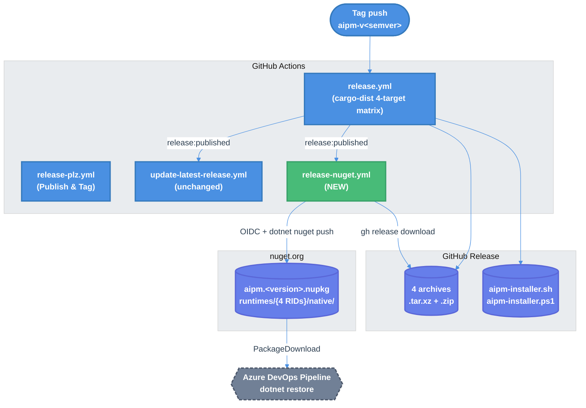

# aipm NuGet Publishing Pipeline — Technical Design Document / RFC

| Document Metadata      | Details                                                                        |
| ---------------------- | ------------------------------------------------------------------------------ |
| Author(s)              | Sean Larkin                                                                    |
| Status                 | Draft (WIP)                                                                    |
| Team / Owner           | aipm                                                                           |
| Created / Last Updated | 2026-04-22                                                                     |

## 1. Executive Summary

Today, `aipm` (a Rust CLI) is distributed via GitHub Releases (cargo-dist), Homebrew, shell/PowerShell installers, and crates.io. It is **not** available on nuget.org, which blocks adoption by Azure DevOps pipeline consumers who expect `dotnet restore` semantics for build-tool acquisition.

This RFC proposes adding one new GitHub Actions workflow (`release-nuget.yml`) plus one new `.nuspec` file (`packaging/aipm.nuspec`) that together fan-out the existing cargo-dist release archives into a multi-RID NuGet package and publish it to nuget.org via OIDC Trusted Publishing. The workflow fires on `release:published` after `release.yml` finishes, reusing already-built binaries for 4 RIDs (win-x64, linux-x64, osx-x64, osx-arm64). Zero changes to `release.yml`, `release-plz.yml`, `dist-workspace.toml`, or any Rust code. Estimated implementation: ~80 lines of YAML plus a 30-line nuspec.

Value: unblocks `aipm` adoption in Azure DevOps-based CI/CD (the stated target use case), adds a fourth first-class installation channel, and establishes a pattern the Rust community currently lacks (no widely-adopted Rust-CLI-to-NuGet example exists on nuget.org as of 2026-04).

## 2. Context and Motivation

### 2.1 Current State

**Architecture.** Release is a three-workflow pipeline that the user's CI/CD orchestrates on git push to main:

```text
commit to main
    |
    v
release-plz.yml (Release PR) -> opens PR with version bump + changelog
    |
    v
PR merged -> release-plz.yml (Publish & Tag) -> cargo publish + git tag aipm-v<semver>
    |
    v
release.yml (cargo-dist) -> builds 4-target matrix + creates GitHub Release
    |
    v
update-latest-release.yml -> updates "latest" GitHub Release with installer scripts
```

Four cross-compilation targets built by cargo-dist from [`dist-workspace.toml:15-20`](../dist-workspace.toml):

- `x86_64-unknown-linux-gnu`
- `x86_64-apple-darwin`
- `aarch64-apple-darwin`
- `x86_64-pc-windows-msvc`

Archive formats: `.tar.xz` on Unix, `.zip` on Windows ([`dist-workspace.toml:40-41`](../dist-workspace.toml)).
Tag pattern: `aipm-v<semver>` (per-crate tags from release-plz — confirmed by `.github/workflows/update-latest-release.yml:20`).
Binary name: `aipm` ([`crates/aipm/Cargo.toml:2`](../crates/aipm/Cargo.toml) + `crates/aipm/src/main.rs:18`).
Workspace version: lockstep `0.22.3` ([`Cargo.toml:10`](../Cargo.toml)).

**Limitations.** The current pipeline ships to:

- GitHub Releases (tarballs, zips, sha256 checksums)
- crates.io (via release-plz)
- Installer scripts (shell, PowerShell) hosted on GitHub Releases
- Homebrew tap (via cargo-dist) and npm (via cargo-dist), per [`specs/2026-03-19-cargo-dist-installers.md`](2026-03-19-cargo-dist-installers.md)

Not served: **Azure DevOps pipeline consumers who want `dotnet restore` semantics**. ADO pipelines running against self-hosted build agents, enterprise proxied networks, or Microsoft-internal codebases routinely have nuget.org allowlisted but not GitHub Releases. They expect build-time tools to come from NuGet packages restored into the global-packages folder, not from ad-hoc curl-bash installers.

### 2.2 The Problem

- **User Impact:** ADO pipeline authors cannot adopt `aipm` as a lint/scaffold/pack step without bespoke `curl | sh` install blocks and network-egress allowlisting. This is friction that kills adoption in regulated environments.
- **Business Impact:** `aipm` has prior ADO-specific integration work (see [`specs/2026-04-20-azure-devops-lint-reporter-enrichment.md`](2026-04-20-azure-devops-lint-reporter-enrichment.md) and [`research/docs/2026-04-20-azure-devops-lint-reporter-parity.md`](../research/docs/2026-04-20-azure-devops-lint-reporter-parity.md)) — the reporter speaks `##vso[...]` log commands and emits ADO-formatted annotations. Not being installable *via* NuGet in the pipeline it targets undermines that investment.
- **Technical Debt:** None specific to this work; the current pipeline is healthy. This is an additive feature.

## 3. Goals and Non-Goals

### 3.1 Functional Goals

- [ ] Publish `aipm` to nuget.org as a single package ID containing binaries for 4 RIDs (win-x64, linux-x64, osx-x64, osx-arm64).
- [ ] Version-match the `aipm-v<semver>` tag to the nupkg `<version>` field on every stable release.
- [ ] Authenticate via **NuGet Trusted Publishing (OIDC)** with `NUGET_API_KEY` as a documented fallback.
- [ ] Trigger automatically on `release:published`, gated by `startsWith(tag_name, 'aipm-v') && !prerelease`.
- [ ] Consumable by an Azure DevOps pipeline via `dotnet restore` against a `<PackageDownload Include="aipm" Version="[x.y.z]" />` project with zero service connection and zero secrets.
- [ ] Idempotent on workflow re-runs (`--skip-duplicate` on `dotnet nuget push`).

### 3.2 Non-Goals (Out of Scope)

- [ ] We will NOT ship a `dotnet tool`-type package (e.g., `aipm.Tool`) in v1. `dotnet tool install -g aipm` UX is explicitly deferred — see section 6.
- [ ] We will NOT ship RIDs for `linux-arm64`, `win-arm64`, or `linux-musl-x64` in v1. cargo-dist's matrix does not build these; expanding them is a separate spec.
- [ ] We will NOT ship an MSBuild `build/aipm.targets` file in v1 — consumers resolve the RID explicitly. Adding targets is a later enhancement.
- [ ] We will NOT modify `release.yml`, `release-plz.yml`, `dist-workspace.toml`, or any `crates/*/Cargo.toml`. This feature is purely additive.
- [ ] We will NOT publish pre-release tags (`aipm-v*-alpha.*`, `aipm-v*-beta.*`, `aipm-v*-rc.*`) to nuget.org. Pre-releases stay on GitHub Releases and crates.io.
- [ ] We will NOT ship to an ADO Artifacts private feed or GitHub Packages. Public nuget.org only.
- [ ] We will NOT author-sign the nupkg (no code-signing certificate). We rely on nuget.org's automatic repository signature.
- [ ] We will NOT emit `.snupkg` symbol packages. `[profile.release] strip = "symbols"` at [`Cargo.toml:185`](../Cargo.toml) ensures there are no debug symbols to ship, and symbol packages are known to break `--skip-duplicate` re-runs ([NuGet/Home#10475](https://github.com/NuGet/Home/issues/10475)).
- [ ] We will NOT reserve the `aipm*` package ID prefix on nuget.org in v1. `aipm` is 4 characters, which is borderline for reservation policy; we claim the ID by publishing first and defer prefix reservation until we ship satellite packages.

## 4. Proposed Solution (High-Level Design)

### 4.1 System Architecture Diagram



Green node is new; blue are unchanged.

### 4.2 Architectural Pattern

**Fan-out on release event.** The new workflow is a **listener** on the `release:published` event, not a builder. It consumes artifacts produced by `release.yml` and reshapes them into a NuGet package. This pattern mirrors the existing `update-latest-release.yml` (see [`.github/workflows/update-latest-release.yml:13-15`](../.github/workflows/update-latest-release.yml)) and avoids duplicating cross-compilation cost.

Benefits:
- No changes to the existing release pipeline — strictly additive.
- Reuses cargo-dist's cross-compilation; no second matrix.
- Decoupled failure domain: a broken nupkg publish doesn't block GitHub Release creation.
- Easy rollback: delete the workflow file.

### 4.3 Key Components

| Component                       | Responsibility                                                                 | Technology                      | Justification |
| ------------------------------- | ------------------------------------------------------------------------------ | ------------------------------- | ------------- |
| `packaging/aipm.nuspec` (new)  | Declares package metadata, file layout, license, repository URL                | NuGet nuspec XML                | Canonical format; `nuget pack <nuspec>` is the supported non-project-based packaging path per [cli-ref-pack docs](https://learn.microsoft.com/en-us/nuget/reference/cli-reference/cli-ref-pack) |
| `.github/workflows/release-nuget.yml` (new) | Downloads release archives, stages runtimes/ layout, packs, pushes to nuget.org | GitHub Actions + nuget.exe CLI  | Matches project convention (existing hand-written workflows use YAML directly, not gh-aw) |
| `NuGet/login@v1` (external action) | Exchanges GitHub OIDC token for a short-lived nuget.org API key                | OIDC / Trusted Publishing       | GA since 2025-09-22, eliminates long-lived secrets |
| `NUGET_USERNAME` (new secret)   | Public nuget.org profile handle (required by `NuGet/login@v1`)                 | GitHub repo secret              | Low-sensitivity; enables OIDC exchange |
| `NUGET_API_KEY` (new secret, fallback) | Long-lived API key scoped to `aipm*` glob                                      | GitHub repo secret              | Fallback path if OIDC rollout is incomplete for the account |

## 5. Detailed Design

### 5.1 Workflow Interface (release-nuget.yml)

**Trigger:** `release:published` with filter `startsWith(tag_name, 'aipm-v') && !event.release.prerelease`. This mirrors [`.github/workflows/update-latest-release.yml:20`](../.github/workflows/update-latest-release.yml) exactly.

**Required permissions:**
```yaml
permissions:
  contents: read       # gh release download
  id-token: write      # MANDATORY for NuGet Trusted Publishing (OIDC)
```

**Required inputs (secrets):**
| Secret              | Purpose                                                                  | Required |
|---------------------|--------------------------------------------------------------------------|----------|
| `NUGET_USERNAME`    | Public nuget.org profile handle, passed to `NuGet/login@v1`              | Yes      |
| `NUGET_API_KEY`     | Fallback long-lived API key used if OIDC login fails                    | Yes (v1)|
| `GITHUB_TOKEN`      | Implicit; used by `gh release download`                                  | Yes      |

**No inputs from user.** Version is derived from `github.event.release.tag_name` (strip `aipm-v` prefix). No `workflow_dispatch` in v1 (add later if needed for republish-in-place scenarios).

### 5.2 Package Layout

The package ID `aipm` resolves on nuget.org to the following unzipped .nupkg layout:

```text
aipm.<version>.nupkg
 - [Content_Types].xml           # OPC boilerplate (auto-generated by nuget pack)
 - _rels/.rels                   # OPC boilerplate
 - package/services/metadata/core-properties/<guid>.psmdcp
 - aipm.nuspec
 - docs/
    - README.md
 - LICENSE
 - runtimes/
    - win-x64/native/aipm.exe
    - linux-x64/native/aipm
    - osx-x64/native/aipm
    - osx-arm64/native/aipm
```

**Design decisions:**
- No `lib/`, no `ref/`, no `tools/`, no `build/`. The package has no managed assembly and no MSBuild integration in v1 — per the Round 2 "bare runtimes/" decision.
- No `<packageTypes>` element — defaults to `Dependency` (see [research doc section 1.6](../research/docs/2026-04-22-nuget-native-multi-rid-packaging.md)). This allows `dotnet restore` / `NuGetCommand@2 restore` to materialize the package without special handling.
- RIDs are the four **portable** RIDs from the [.NET RID catalog](https://learn.microsoft.com/en-us/dotnet/core/rid-catalog). No distro-specific or version-specific RIDs.

### 5.3 The nuspec (source file: `packaging/aipm.nuspec`)

```xml
<?xml version="1.0" encoding="utf-8"?>
<package xmlns="http://schemas.microsoft.com/packaging/2010/07/nuspec.xsd">
  <metadata>
    <id>aipm</id>
    <version>$version$</version>
    <authors>Sean Larkin</authors>
    <description>aipm - AI plugin manager. Manages AI plugins (Claude, Copilot, Cursor, etc.) across .claude / .github / .ai directories. Distributed as a native Rust CLI for Windows, macOS, and Linux.</description>
    <license type="expression">MIT</license>
    <projectUrl>https://github.com/TheLarkInn/aipm</projectUrl>
    <repository type="git"
                url="https://github.com/TheLarkInn/aipm.git"
                branch="main"
                commit="$commit$" />
    <readme>docs\README.md</readme>
    <tags>ai claude copilot plugin-manager cli rust native cross-platform azure-devops</tags>
    <copyright>Copyright (c) 2026 Sean Larkin</copyright>
  </metadata>
  <files>
    <file src="runtimes\**" target="runtimes" />
    <file src="README.md" target="docs\" />
    <file src="LICENSE" target="" />
  </files>
</package>
```

`$version$` and `$commit$` are replaced at pack time via `-Properties`.

### 5.4 The workflow (source file: `.github/workflows/release-nuget.yml`)

```yaml
name: Publish to NuGet

on:
  release:
    types: [published]

concurrency:
  group: release-nuget-${{ github.event.release.tag_name }}
  cancel-in-progress: false

jobs:
  publish:
    name: Pack & push aipm to nuget.org
    if: startsWith(github.event.release.tag_name, 'aipm-v') && !github.event.release.prerelease
    runs-on: ubuntu-latest
    permissions:
      contents: read
      id-token: write   # required for NuGet Trusted Publishing
    timeout-minutes: 20

    steps:
      - name: Checkout
        uses: actions/checkout@v4
        with:
          persist-credentials: false

      - name: Extract version from tag
        id: ver
        run: |
          TAG="${{ github.event.release.tag_name }}"
          VERSION="${TAG#aipm-v}"
          echo "version=$VERSION" >> "$GITHUB_OUTPUT"

      - name: Download release archives
        env:
          GH_TOKEN: ${{ github.token }}
        run: |
          mkdir -p archives
          gh release download "${{ github.event.release.tag_name }}" \
            --pattern 'aipm-*.tar.xz' \
            --pattern 'aipm-*.zip' \
            --dir archives \
            --repo "${{ github.repository }}"

      - name: Unpack into runtimes/<RID>/native layout
        run: |
          set -euo pipefail
          mkdir -p pkg/runtimes
          declare -A RID_MAP=(
            [x86_64-unknown-linux-gnu]=linux-x64
            [x86_64-apple-darwin]=osx-x64
            [aarch64-apple-darwin]=osx-arm64
            [x86_64-pc-windows-msvc]=win-x64
          )
          for triple in "${!RID_MAP[@]}"; do
            rid="${RID_MAP[$triple]}"
            mkdir -p "pkg/runtimes/$rid/native"
            if [[ "$triple" == *windows* ]]; then
              archive="archives/aipm-${triple}.zip"
              test -f "$archive" || { echo "::error::Missing $archive"; exit 1; }
              unzip -j "$archive" '*/aipm.exe' -d "pkg/runtimes/$rid/native/"
            else
              archive="archives/aipm-${triple}.tar.xz"
              test -f "$archive" || { echo "::error::Missing $archive"; exit 1; }
              mkdir -p /tmp/unpack-"$rid"
              tar -xf "$archive" --strip-components=1 -C /tmp/unpack-"$rid"
              install -m 755 /tmp/unpack-"$rid"/aipm "pkg/runtimes/$rid/native/aipm"
            fi
          done
          # Stage the readme and license alongside the runtimes/
          cp README.md LICENSE pkg/
          ls -la pkg/runtimes/*/native/

      - name: Set up .NET SDK
        uses: actions/setup-dotnet@v4
        with:
          dotnet-version: '8.x'

      - name: Set up NuGet CLI
        uses: nuget/setup-nuget@v2

      - name: Pack
        working-directory: pkg
        run: |
          nuget pack ../packaging/aipm.nuspec \
            -Version "${{ steps.ver.outputs.version }}" \
            -Properties "version=${{ steps.ver.outputs.version }};commit=${{ github.sha }}" \
            -NoDefaultExcludes \
            -NonInteractive \
            -OutputDirectory ../out

      - name: Inspect nupkg (sanity check)
        run: |
          ls -la out/
          unzip -l "out/aipm.${{ steps.ver.outputs.version }}.nupkg" | grep runtimes/

      - name: NuGet OIDC login (Trusted Publishing)
        id: nuget_login
        continue-on-error: true
        uses: NuGet/login@v1
        with:
          user: ${{ secrets.NUGET_USERNAME }}

      - name: Push to nuget.org (OIDC)
        if: steps.nuget_login.outcome == 'success'
        run: |
          dotnet nuget push out/*.nupkg \
            --api-key "${{ steps.nuget_login.outputs.NUGET_API_KEY }}" \
            --source https://api.nuget.org/v3/index.json \
            --skip-duplicate

      - name: Push to nuget.org (API-key fallback)
        if: steps.nuget_login.outcome != 'success'
        run: |
          echo "::warning::OIDC Trusted Publishing failed; falling back to NUGET_API_KEY secret"
          dotnet nuget push out/*.nupkg \
            --api-key "${{ secrets.NUGET_API_KEY }}" \
            --source https://api.nuget.org/v3/index.json \
            --skip-duplicate
```

**Notes:**
- `-NoDefaultExcludes` is required because nuget.exe excludes dotfiles by default, which could inadvertently drop files from `runtimes/`.
- `--skip-duplicate` makes re-runs idempotent (returns HTTP 409 as a warning, not an error).
- `continue-on-error: true` on the OIDC step + `if: steps.nuget_login.outcome == 'success'` on the push gives us the fallback behavior without a third-party action.
- `concurrency:` group prevents two simultaneous publishes for the same tag (rare, but possible if the workflow is manually retried).

### 5.5 State Management

**Stateful resources:**
- **nuget.org package feed.** Once a version is published, it cannot be deleted — only **unlisted** (hidden from search). Unlisted packages still resolve for consumers who pin to that version. This means our state machine for any given version is:

```text
NOT_PUBLISHED --[push]--> LISTED --[unlist via nuget.org UI]--> UNLISTED
```

No path from `UNLISTED` back to `NOT_PUBLISHED`. Implication: treat publishes as immutable; never reuse a version number.

- **GitHub Release tag.** Already managed by release-plz + cargo-dist; we do not mutate it.
- **nuget.org Trusted Publishing policy.** One-time setup on nuget.org, bound to `repo_owner=TheLarkInn, repo=aipm, workflow_file=release-nuget.yml`. Policy is immutable once fused (first successful publish).

**Concurrency model.** The `concurrency:` group on the tag ensures at most one publish attempt per tag runs at a time. `--skip-duplicate` handles the case where a retry happens after a successful push.

## 6. Alternatives Considered

| Option                                       | Pros                                                                 | Cons                                                                                        | Reason for Rejection                                                                           |
| -------------------------------------------- | -------------------------------------------------------------------- | ------------------------------------------------------------------------------------------- | ---------------------------------------------------------------------------------------------- |
| **A: Upstream NuGet support in cargo-dist**  | No hand-rolled YAML; maintainer-owned                                | cargo-dist v0.31.0 has zero NuGet support, zero open issues requesting it                    | Waiting on axodotdev's roadmap blocks v1. File feature request separately.                     |
| **B: `cargo-nuget` crate (KodrAus)**         | Rust-ecosystem tool; has `cross` subcommand for multi-target         | Targets cdylibs for P/Invoke, not CLI binaries. Dormant since 2017-11 (Rust 1.18, .NET 2.0). | Wrong target and unmaintained. Verified 2026-04-22.                                             |
| **C: `dotnet tool install -g aipm`**         | Familiar .NET UX; one-line install                                   | Requires .NET SDK at install time; requires managed entry point or .NET 10 AOT shim         | Scope mismatch — primary use case is ADO pipeline consumption, not developer-workstation install |
| **D: Per-RID package IDs (Esbuild pattern)** | Each package tiny; consumer picks matching RID                       | 4+ package IDs to manage; consumer UX is clunky                                              | Single-ID `aipm` is simpler and fits the 250 MB cap by an order of magnitude                   |
| **E: Self-contained matrix build in the NuGet workflow** | Independent of cargo-dist; could ship 7 RIDs day 1              | Duplicates cross-compilation cost (~10 min extra per release); two build paths              | Round 1 decision: ship 4 RIDs via fan-out. Revisit if ARM64-Linux/musl demand materializes.    |
| **F: Manual publish via local `nuget push`** | No CI complexity                                                     | Bus factor of 1; version drift risk; no audit trail                                          | Fails the "automatic CI/CD" requirement                                                        |
| **G: Publish to GitHub Packages NuGet feed** | Same GitHub ecosystem; no new account                                | ADO pipelines must authenticate to GitHub Packages (requires PAT), defeating "public feed" UX | Contradicts user-stated ADO-consumer scenario                                                  |
| **H (selected): Fan-out workflow on release:published** | Reuses cargo-dist artifacts; zero changes elsewhere; OIDC auth; decoupled failure | Bound to cargo-dist's target matrix; hand-rolled ~80-line workflow                           | **Selected:** smallest diff, lowest risk, matches existing `update-latest-release.yml` pattern |

## 7. Cross-Cutting Concerns

### 7.1 Security and Privacy

- **Authentication path.** NuGet Trusted Publishing (OIDC) is the primary path; the workflow requests a GitHub OIDC ID token (`id-token: write`), `NuGet/login@v1` exchanges it for a short-lived (~1h, single-use) nuget.org API key bound to a pre-configured policy. No long-lived secret is used.
- **Fallback authentication.** `NUGET_API_KEY` is a repository secret, scoped via nuget.org API-key glob to `aipm*`. Quarterly rotation recommended if the fallback path is ever exercised.
- **Policy binding.** The Trusted Publishing policy is configured on nuget.org with: `repo_owner=TheLarkInn`, `repo=aipm`, `workflow_file=release-nuget.yml`. This means a malicious fork, a renamed workflow, or a copied repo cannot publish. First successful publish fuses the policy to GitHub's immutable repo/owner IDs.
- **Fork safety.** Release events do not fire in forks (`release:published` is repo-scoped), and forks do not receive the `id-token` nor the `NUGET_*` secrets even if triggered. Tested by GitHub Actions' standard secret-masking behavior.
- **Package signing.** We do not author-sign. nuget.org repository-signs every package automatically on ingest; consumers validate the repo signature transitively.
- **Supply-chain attestation.** The existing `release.yml` already emits `actions/attest-build-provenance@v3` attestations for the underlying binaries ([`release.yml:151-154`](../.github/workflows/release.yml)). The NuGet package repackages those attested binaries; we do not emit a second attestation for the nupkg in v1. Future work: add `actions/attest-build-provenance@v3` at the nupkg level.
- **`id-token: write` scope.** Scoped to the `publish` job only; other jobs (if added later) don't inherit it.
- **Secret exposure.** `NUGET_USERNAME` is a public handle, low sensitivity. `NUGET_API_KEY` is masked in logs by GitHub Actions.
- **Threat model.**
  - Compromised GitHub token → limited blast radius; OIDC policy requires `repo=aipm`, `workflow_file=release-nuget.yml`.
  - Compromised NUGET_API_KEY → attacker could push malicious versions. Mitigation: glob-scope the key to `aipm*`, rotate quarterly, remove once OIDC is stable across all publishes.
  - Compromised nuget.org session → account-level compromise; out of scope for this spec.

### 7.2 Observability Strategy

- **Built-in GitHub Actions logs.** Each step streams to the GitHub UI; failures are visible in the Actions tab.
- **Notifications.** None new in v1. If GitHub Actions email/Slack notifications are already configured at the org level, they cover this workflow for free.
- **Unlikely, but worth noting:** nuget.org does not have a public webhook or ingest-status API. We trust `dotnet nuget push` exit code as the source of truth.
- **Post-publish verification (optional).** A follow-up step could `curl https://api.nuget.org/v3-flatcontainer/aipm/index.json` and assert the new version appears. Not in v1.
- **Alerting.** None configured. If a publish fails, the release still succeeds on GitHub and crates.io — this is a **detached failure domain** by design.

### 7.3 Scalability and Capacity Planning

- **Package size budget.** Four RIDs × ~5 MB per stripped binary = **~20 MB per nupkg**. Well under the nuget.org 250 MB cap ([NuGet.org FAQ](https://learn.microsoft.com/en-us/nuget/nuget-org/nuget-org-faq)). Headroom for 7 RIDs would still be ~35 MB.
- **Release cadence.** release-plz fires when `main` has conventional commits. Observed cadence: multiple releases per week, occasionally per day. Each release publishes one nupkg.
- **nuget.org rate limits.** Undocumented but generous; one push per release is nowhere near any threshold.
- **Workflow runtime.** Expected ~3-5 min end-to-end (checkout + gh release download + unpack + setup-dotnet + setup-nuget + pack + push). The `timeout-minutes: 20` gives a large safety margin.
- **GitHub Actions minute cost.** Single Ubuntu job, ~5 min per release — trivial against the free-tier budget for public repos.

## 8. Migration, Rollout, and Testing

### 8.1 Deployment Strategy

This is additive, not a migration. No existing behavior changes. Rollout:

- [ ] **Phase 0 (pre-merge):** Create nuget.org account for `TheLarkInn` if not already owned. Configure Trusted Publishing policy binding `repo_owner=TheLarkInn, repo=aipm, workflow_file=release-nuget.yml`. Generate a fallback API key scoped to `aipm*`, store as `NUGET_API_KEY` and `NUGET_USERNAME` in GitHub repo secrets.
- [ ] **Phase 1 (dry-run via `workflow_dispatch`):** Temporarily add `workflow_dispatch` to the trigger, add `--dry-run` equivalent by overriding the push step to `echo`, merge behind an inactive trigger, run manually on the tip of an existing release tag to verify pack succeeds and the nupkg structure is correct. Inspect locally.
- [ ] **Phase 2 (alpha publish):** Tag an `aipm-v0.22.4-alpha.1` release. Temporarily relax the `!prerelease` guard. Verify the package appears on nuget.org under a pre-release version. **Unlist** the alpha package immediately (it's for validation only). Restore the `!prerelease` guard.
- [ ] **Phase 3 (first stable):** Cut the next regular `aipm-v0.22.x` release. Verify publish to nuget.org. Verify ADO consumer pattern from `research/docs/2026-04-22-ado-pipeline-nuget-consume.md` section 5 resolves the package on a test pipeline.
- [ ] **Phase 4 (steady-state):** All subsequent releases publish automatically. Update [`README.md`](../README.md) installation section to add a "NuGet" row.

### 8.2 Data Migration Plan

No data to migrate. New package ID starts at the current workspace version (`0.22.3` or whatever the next `aipm-v*` tag is).

### 8.3 Test Plan

**Unit tests:** None applicable. The nuspec and workflow are configuration, not code.

**Integration tests:**

- [ ] **Nuspec validity.** `nuget pack` locally against a fixture `runtimes/` tree with dummy binaries. Verify `-Properties` substitution works for `$version$` and `$commit$`.
- [ ] **Layout assertion.** `unzip -l aipm.0.0.0.nupkg | grep runtimes/` in CI sanity-check step (already in the workflow). Fail the workflow if fewer than 4 runtimes/ entries.
- [ ] **Version derivation.** Test the `${TAG#aipm-v}` strip against tags like `aipm-v0.22.3`, `aipm-v1.0.0-beta.1` (the latter should be filtered out upstream by the `!prerelease` guard, but the stripper should still work).
- [ ] **Idempotency.** Re-run the workflow on the same release and confirm `--skip-duplicate` makes it a no-op with exit code 0.

**End-to-end tests:**

- [ ] **Consumer pipeline smoke test.** Create a disposable Azure DevOps project containing the ADO YAML from [`research/docs/2026-04-22-ado-pipeline-nuget-consume.md`](../research/docs/2026-04-22-ado-pipeline-nuget-consume.md) section 5. Run against each of the three Microsoft-hosted images (ubuntu-latest, windows-latest, macOS-latest). Verify `aipm --version` prints the expected version.
- [ ] **Restore-in-csproj smoke test.** Create a throwaway csproj in an external repo with `<PackageDownload Include="aipm" Version="[0.22.3]" />`, run `dotnet restore`, confirm the binary materializes at `~/.nuget/packages/aipm/0.22.3/runtimes/<RID>/native/aipm[.exe]`.
- [ ] **OIDC fallback path.** Intentionally break OIDC (e.g., by temporarily removing the Trusted Publishing policy on nuget.org) and verify the `NUGET_API_KEY` fallback step runs and succeeds. Restore the policy after.

**Security tests:**

- [ ] **Fork cannot publish.** Confirm that a fork of `TheLarkInn/aipm` cannot trigger the workflow with a malicious tag. (Release events don't fire on forks; documented upstream.)
- [ ] **Renamed workflow cannot publish.** Rename `release-nuget.yml` in a branch, observe the OIDC exchange fails because the filename no longer matches the policy binding.

## 9. Open Questions / Unresolved Issues

All nine original research-level questions have been resolved (see the decision table in the transcript of this spec's genesis). The remaining spec-level unknowns that block `Approved` status:

- [ ] **nuget.org account creation.** Does a `TheLarkInn` or `selarkin` nuget.org account already exist? If no, who creates it and when?
- [ ] **Trusted Publishing rollout status on the target account.** Is the "Trusted Publishing" tab visible on the account today, or do we need to request enrollment? Feeds the decision to rely on OIDC as primary vs. API-key as primary for v1.
- [ ] **`NUGET_API_KEY` scope glob on creation.** The fallback key should be scoped to package ID glob `aipm*` (not just `aipm`) to allow future satellite package IDs. Confirm the glob at key-creation time.
- [ ] **README update wording.** Who owns the doc change to add the NuGet row? In-scope for this spec or a follow-up PR?
- [ ] **Package icon asset.** The nuspec references `icon` in some variants but the v1 spec omits it. Decision: ship v1 without an icon (nuget.org shows a generic placeholder), add in v1.1 once an asset exists. If an icon exists already, point to its path.
- [ ] **Rollback procedure documentation.** Need a short runbook: "If we publish a broken version, the procedure is: (1) unlist on nuget.org immediately, (2) cut a patch release, (3) publish the patch." This could live in a new `RELEASING.md` or as a comment in `release-nuget.yml`.
- [ ] **GitHub Environments usage.** Round 1 decided against a manual gate, but we may still want a GitHub `release` Environment declared (without required reviewers) for audit-trail visibility on the Deployments tab. Optional; not a blocker.
- [ ] **Post-publish attestation for the nupkg.** cargo-dist attests the binaries; should we also attest the repacked nupkg? Pushing this to v2 unless a supply-chain-review stakeholder asks.

## Appendix A — Referenced Files

Existing files with GitHub permalinks at commit `5616fd4`:

- [`.github/workflows/release.yml`](https://github.com/TheLarkInn/aipm/blob/5616fd4db5d41b77df55686365308cf12701af2a/.github/workflows/release.yml) — cargo-dist release orchestration
- [`.github/workflows/release-plz.yml`](https://github.com/TheLarkInn/aipm/blob/5616fd4db5d41b77df55686365308cf12701af2a/.github/workflows/release-plz.yml) — crates.io + tag creation
- [`.github/workflows/update-latest-release.yml`](https://github.com/TheLarkInn/aipm/blob/5616fd4db5d41b77df55686365308cf12701af2a/.github/workflows/update-latest-release.yml) — pattern this spec mirrors
- [`.github/workflows/update-latest-release.yml:20`](https://github.com/TheLarkInn/aipm/blob/5616fd4db5d41b77df55686365308cf12701af2a/.github/workflows/update-latest-release.yml#L20) — the `startsWith(tag_name, 'aipm-v') && !prerelease` guard copied into the new workflow
- [`dist-workspace.toml:15-20`](https://github.com/TheLarkInn/aipm/blob/5616fd4db5d41b77df55686365308cf12701af2a/dist-workspace.toml#L15-L20) — the 4-target matrix this spec consumes
- [`Cargo.toml:10`](https://github.com/TheLarkInn/aipm/blob/5616fd4db5d41b77df55686365308cf12701af2a/Cargo.toml#L10) — workspace version (lockstep)
- [`Cargo.toml:185`](https://github.com/TheLarkInn/aipm/blob/5616fd4db5d41b77df55686365308cf12701af2a/Cargo.toml#L185) — `[profile.release] strip = "symbols"` justifying no .snupkg
- [`crates/aipm/Cargo.toml:2`](https://github.com/TheLarkInn/aipm/blob/5616fd4db5d41b77df55686365308cf12701af2a/crates/aipm/Cargo.toml#L2) — binary name `aipm`

New files to be created:

- `packaging/aipm.nuspec` — package metadata
- `.github/workflows/release-nuget.yml` — the publish workflow

## Appendix B — Research References

- [`research/docs/2026-04-22-nuget-publishing-pipeline.md`](../research/docs/2026-04-22-nuget-publishing-pipeline.md) — main synthesis
- [`research/docs/2026-04-22-nuget-native-multi-rid-packaging.md`](../research/docs/2026-04-22-nuget-native-multi-rid-packaging.md) — .nuspec schema, runtimes layout, package-type choice
- [`research/docs/2026-04-22-github-actions-nuget-publish.md`](../research/docs/2026-04-22-github-actions-nuget-publish.md) — Trusted Publishing (OIDC), cross-compilation alternatives, versioning
- [`research/docs/2026-04-22-ado-pipeline-nuget-consume.md`](../research/docs/2026-04-22-ado-pipeline-nuget-consume.md) — ADO YAML consumer pattern
- [`specs/2026-03-16-ci-cd-release-automation.md`](2026-03-16-ci-cd-release-automation.md) — original CI/CD spec (target matrix baseline)
- [`specs/2026-03-19-cargo-dist-installers.md`](2026-03-19-cargo-dist-installers.md) — cargo-dist adoption spec (current distribution channels)
- [`specs/2026-04-20-azure-devops-lint-reporter-enrichment.md`](2026-04-20-azure-devops-lint-reporter-enrichment.md) — prior ADO integration work
