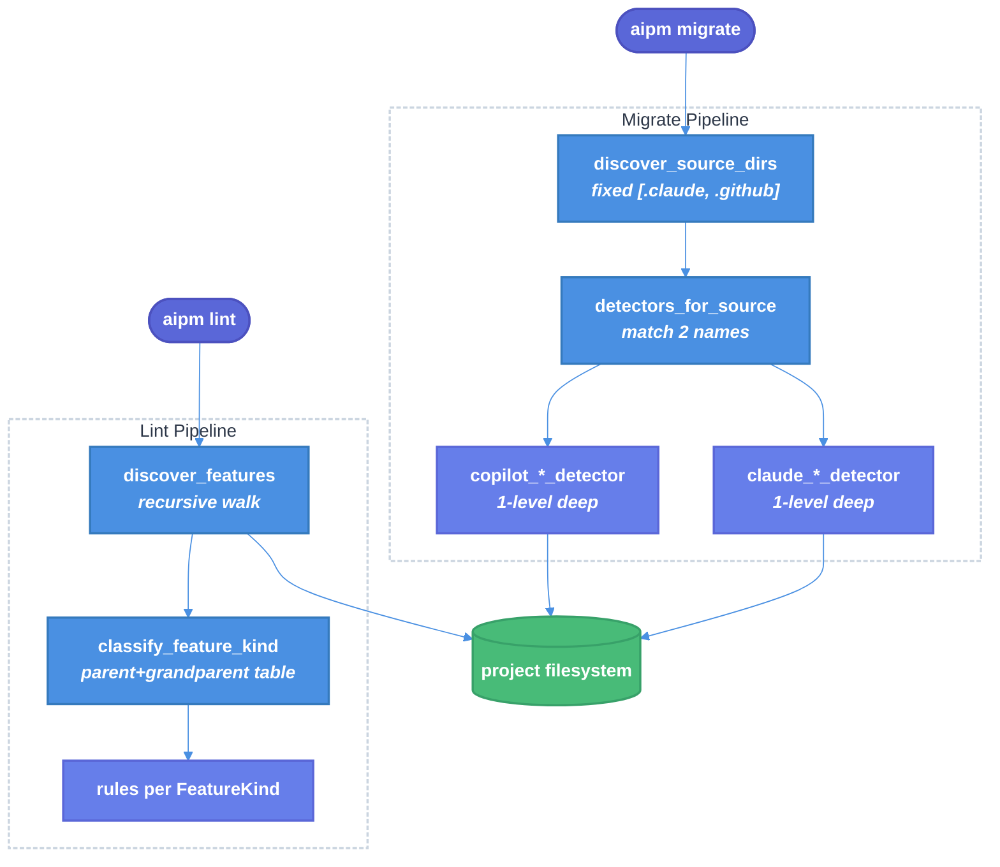
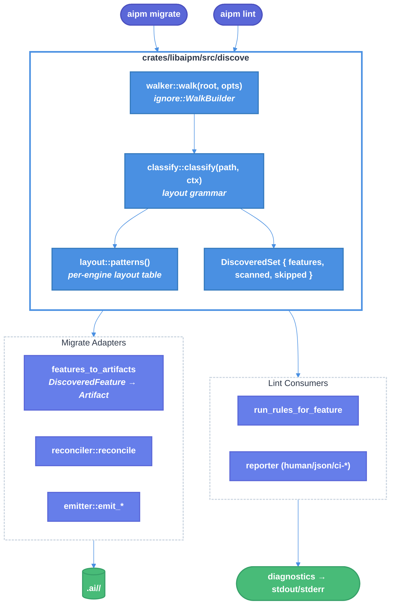

# Unified Feature Discovery: One Detection Module Shared by `aipm migrate` and `aipm lint`

| Document Metadata      | Details                                                                        |
| ---------------------- | ------------------------------------------------------------------------------ |
| Author(s)              | Sean Larkin                                                                    |
| Status                 | Draft (WIP)                                                                    |
| Team / Owner           | aipm core                                                                      |
| Created / Last Updated | 2026-05-01 / 2026-05-01                                                        |
| Tracking issue         | [#725](https://github.com/TheLarkInn/aipm/issues/725)                          |
| Related research       | [`research/docs/2026-05-01-github-copilot-skills-migrate-lint-silent-failure.md`](../research/docs/2026-05-01-github-copilot-skills-migrate-lint-silent-failure.md) |

## 1. Executive Summary

`aipm migrate` and `aipm lint` use two completely different and asymmetric file-discovery pipelines. Migrate uses a fixed engine-root list (`[".claude", ".github"]`) plus per-engine detectors that look exactly one directory level deep. Lint uses a recursive walker plus a hard-coded parent/grandparent classifier. Neither shares code with the other. Both silently produce zero output on layouts they don't recognize.

The result: customer issue [#725](https://github.com/TheLarkInn/aipm/issues/725) reports that a `.github/copilot/skills/<skill>/SKILL.md` tree (the natural layout when a user mirrors the `.claude/skills/<name>/SKILL.md` shape under a `copilot/` subdir) is invisible to **migrate** (the detector looks at `.github/copilot/SKILL.md`, not `.github/copilot/skills/<x>/SKILL.md`), and the accompanying `.github/copilot/copilot-instructions.md` is invisible to **lint** (the instruction-filename table lists `copilot.md` and the suffix check is `.instructions.md`; `copilot-instructions.md` matches neither).

This spec consolidates both pipelines onto a single shared discovery module under `crates/libaipm/src/discovery/`. One walker, one classifier, one `DiscoveredFeature` type. Migrate detectors become thin adapters that translate `DiscoveredFeature → Artifact`; lint rules consume `DiscoveredFeature` directly. Both commands print a scan summary by default. Skill detection switches from "exact parent/grandparent must be `skills`" to "any ancestor named `skills` (up to a known engine root) **or** parent is a known engine root", which makes all three documented Copilot skill layouts work consistently. Rollout is gated behind `AIPM_UNIFIED_DISCOVERY=1` for one release.

## 2. Context and Motivation

### 2.1 Current State

Two parallel discovery pipelines, neither of which knows about the other:



Concrete code anchors:
- Migrate's hard-coded engine roots: `crates/libaipm/src/migrate/mod.rs:399` — `&[".claude", ".github"]`.
- Migrate's detector dispatch: `crates/libaipm/src/migrate/detector.rs:47-53`.
- Migrate's Copilot skill detector (one level deep): `crates/libaipm/src/migrate/copilot_skill_detector.rs:23-69`.
- Lint's classifier: `crates/libaipm/src/discovery.rs:243-297`.
- Lint's silent-drop point: `crates/libaipm/src/discovery.rs:339`.
- Lint's `--source` allowlist: `crates/aipm/src/main.rs:720` (`SUPPORTED_SOURCES = &[".claude", ".github", ".ai"]`).

A prior spec partially addressed this asymmetry on the lint side ([`specs/2026-04-04-lint-unified-file-discovery.md`](2026-04-04-lint-unified-file-discovery.md), Status: **Draft (WIP)** but its implementation shipped — `discover_features` is the result). That work never extended to migrate.

### 2.2 The Problem

**User-visible problem (customer report [#725](https://github.com/TheLarkInn/aipm/issues/725))**: a project laid out as

```text
.github/copilot/
├── skills/
│   ├── skill-alpha/SKILL.md
│   ├── skill-beta/SKILL.md
│   └── skill-gamma/SKILL.md
└── copilot-instructions.md
```

is silently ignored by both `aipm migrate` and `aipm lint`. No diagnostic, no warning, exit code 0.

**Why it fails today** (per [`research/docs/2026-05-01-github-copilot-skills-migrate-lint-silent-failure.md`](../research/docs/2026-05-01-github-copilot-skills-migrate-lint-silent-failure.md)):

1. **Migrate misses the skills**: `CopilotSkillDetector` iterates `["skills", "copilot"]` as subdirs of `.github`. With `.github/copilot/` containing a `skills/` directory, the detector reads `skills_dir = .github/copilot`, finds an entry named `skills`, then checks `.github/copilot/skills/SKILL.md` (one level too shallow). The actual `SKILL.md` files are at `.github/copilot/skills/<name>/SKILL.md`, which the detector never visits.
2. **Lint misses the instructions file**: `INSTRUCTION_FILENAMES` at `crates/libaipm/src/discovery.rs:186` is `&["claude.md", "agents.md", "copilot.md", "instructions.md", "gemini.md"]`. The fallback suffix check is `.ends_with(".instructions.md")`. `copilot-instructions.md` (hyphen, no dot) matches neither.
3. **Both commands' "found nothing" path is silent by design**: `cmd_migrate` early-returns `Ok(())` with zero stdout when `actions` is empty (`crates/aipm/src/main.rs:957`); the `ci-github` and `ci-azure` lint reporters print literal nothing (`crates/libaipm/src/lint/reporter.rs:309-380`).

**Business and technical impact**:
- **Customer impact**: users with non-`./.claude/`-shaped projects get zero feedback from the tools that are supposed to find their AI features. They have no signal that a fix is needed or what to fix.
- **Code-quality impact**: ~1100 lines of detector code in `crates/libaipm/src/migrate/` duplicate logic that is conceptually identical to lint's `discover_features`. Adding a new feature kind or engine layout currently requires editing two modules in lockstep.
- **Test gap**: not a single integration test exercises the customer's layout. `crates/libaipm/tests/bdd.rs:759` writes `.github/copilot/<name>/SKILL.md` (without the `skills/` segment), which is the only Copilot layout exercised end-to-end.
- **Prior tickets**: [#187](https://github.com/TheLarkInn/aipm/issues/187), [#208](https://github.com/TheLarkInn/aipm/issues/208), [#123](https://github.com/TheLarkInn/aipm/issues/123) all describe variants of this silent-failure pattern. The unified-discovery spec [`specs/2026-04-04-lint-unified-file-discovery.md`](2026-04-04-lint-unified-file-discovery.md) addressed it on the lint side only.

## 3. Goals and Non-Goals

### 3.1 Functional Goals

- [ ] **G1**: Both `aipm migrate` and `aipm lint` discover `.github/copilot/skills/<name>/SKILL.md`, `.github/copilot/<name>/SKILL.md`, `.github/skills/<name>/SKILL.md`, and `.claude/skills/<name>/SKILL.md` from one shared module.
- [ ] **G2**: A single Rust module (`crates/libaipm/src/discovery/`) is the single source of truth for path-pattern recognition. Both commands import the same `discover()` function and the same `DiscoveredFeature` type.
- [ ] **G3**: Migrate's six Copilot detectors and six Claude detectors are rewritten as thin adapters that consume `&[DiscoveredFeature]` and emit `Artifact`. They no longer touch the filesystem.
- [ ] **G4**: Lint's `discover_features` is replaced by the shared `discover()`. Lint rules continue to dispatch by `FeatureKind` (no per-engine rule registry), but `DiscoveredFeature` carries an `Engine` field for rules that need it.
- [ ] **G5**: Both commands print a default scan summary: `"Scanned N directories in [.claude, .github]; matched M skills, K agents, …"`. Suppressible with `--quiet`.
- [ ] **G6**: Skill matching grammar changes from "parent or grandparent literally equals `skills`" to "any ancestor up to the engine root is named `skills`, OR the parent is a known engine root".
- [ ] **G7**: `INSTRUCTION_FILENAMES` recognition is extended to match `<engine>-instructions.md` (e.g. `copilot-instructions.md`, `claude-instructions.md`) in addition to today's `<engine>.md` and `*.instructions.md`.
- [ ] **G8**: Behavior is gated behind `AIPM_UNIFIED_DISCOVERY=1` for one release; default-on in the following release.
- [ ] **G9**: Branch coverage stays ≥ 89% (CLAUDE.md mandate). New tests cover layouts A, B, C from the research doc plus the customer's exact tree from #725.

### 3.2 Non-Goals (Out of Scope)

- [ ] **NG1**: No new engines. `.opencode/`, `.gemini/`, `.cursor/` (mentioned in [`research/tickets/2026-03-28-110-aipm-lint.md:75`](../research/tickets/2026-03-28-110-aipm-lint.md)) are **not** added. The shared module's API is engine-extensible, but a follow-up spec must add a new engine variant.
- [ ] **NG2**: No expansion of the `--source` allowlist. `aipm lint --source .github/copilot` continues to fail validation; users who want subtree filtering should use `--dir`. `SUPPORTED_SOURCES` stays `[".claude", ".github", ".ai"]`.
- [ ] **NG3**: No changes to lint rule keying. Rules remain registered per `FeatureKind`; engine awareness is exposed only through `DiscoveredFeature.engine`.
- [ ] **NG4**: No changes to `.ai/` artifact output paths or `aipm.toml` schema.
- [ ] **NG5**: No `aipm make` changes. `make/engine_features.rs` continues to drive scaffolding output independently of discovery.
- [ ] **NG6**: No removal of `.copilot/mcp-config.json` discovery (`crates/libaipm/src/migrate/copilot_mcp_detector.rs:27`). It stays as-is — it is a non-skill, non-`.github`-rooted path with its own contract.
- [ ] **NG7**: No new reporter formats. Scan summary uses existing reporters.

## 4. Proposed Solution (High-Level Design)

### 4.1 System Architecture Diagram



### 4.2 Architectural Pattern

**Single source of truth + thin command-side adapters**. The shared `discovery` module owns:

1. The walker (one `ignore::WalkBuilder` invocation, gitignore-aware, depth-limited).
2. The classifier (one path → `FeatureKind` decision).
3. The layout table (the canonical list of accepted layouts per engine).
4. The output type (`DiscoveredSet`).

Both commands consume `DiscoveredSet` and apply their own command-specific transformations:
- Migrate's adapters turn `DiscoveredFeature` into `Artifact` and feed the existing `reconciler` and `emitter`.
- Lint's `run_rules_for_feature` runs `FeatureKind`-keyed rules and feeds the existing reporter.

This is a textbook "extract common module" refactor with one extension: the layout table is **declarative** so adding a new layout is a one-line change in `discovery::layout` rather than edits across detectors and the classifier.

### 4.3 Key Components

| Component | Responsibility | Location | Justification |
|---|---|---|---|
| `discovery::walker` | Walk `project_root` once, gitignore-aware, with `SKIP_DIRS` filter | `crates/libaipm/src/discovery/walker.rs` | Replaces both lint's `WalkBuilder` setup and migrate's `discover_source_dirs` enumeration. One walk per command invocation. |
| `discovery::classify` | Map a `&Path` to `Option<DiscoveredFeature>` | `crates/libaipm/src/discovery/classify.rs` | Single classifier; replaces `classify_feature_kind` and the implicit "expected layout" baked into each migrate detector. |
| `discovery::layout` | Declarative table of `(engine, kind) → AcceptedLayouts` | `crates/libaipm/src/discovery/layout.rs` | The single place where supported layouts live. Touch one file to add a layout. |
| `discovery::scan_report` | Aggregated `DiscoveredSet { features, scanned_dirs, skipped }` | `crates/libaipm/src/discovery/scan_report.rs` | Replaces today's `Vec<DiscoveredFeature>` return; carries the data needed for the new scan summary. |
| `migrate::adapters` | `DiscoveredFeature → Artifact` translators (one per kind/engine) | `crates/libaipm/src/migrate/adapters/` | Preserves the artifact-emission shape so reconciler/emitter and existing tests don't need restructuring. |
| `lint::consume` | Convenience wrapper that calls `discovery::discover()` and feeds `run_rules_for_feature` | `crates/libaipm/src/lint/mod.rs` (changes) | Replaces today's call to the old `discover_features`. |
| `cli::scan_summary` | Format the default scan-summary line(s) | `crates/aipm/src/scan_summary.rs` (new) | Same code shared by both `cmd_lint` and `cmd_migrate`. |
| `AIPM_UNIFIED_DISCOVERY` | Env-var feature flag | `crates/libaipm/src/discovery/mod.rs` | Default-off for one release; flip in the next release. Cheap revert if customers hit edge cases. |

## 5. Detailed Design

### 5.1 New module layout

```
crates/libaipm/src/discovery/
├── mod.rs              // pub fn discover(root, opts) -> Result<DiscoveredSet, Error>; flag check; tracing
├── walker.rs           // ignore::WalkBuilder wrapper, SKIP_DIRS, max_depth
├── classify.rs         // path → Option<DiscoveredFeature> (calls into layout::)
├── layout.rs           // declarative per-(engine,kind) layout table; ancestor-walk matcher
├── instruction.rs      // INSTRUCTION_FILENAMES + the new `<engine>-instructions.md` regex
├── source.rs           // engine-root inference (walks ancestors to find first .claude/.github/.ai/.copilot)
├── scan_report.rs      // DiscoveredSet, ScanCounts, SkipReason
├── feature.rs          // DiscoveredFeature, Engine, Layout
└── tests/              // fixture-based tests; see §8.3
```

The existing `crates/libaipm/src/discovery.rs` is deleted and its callers updated. The existing `discovery::FeatureKind` and `DiscoveredFeature` move into `discovery::feature`. `discover_source_dirs` and `discover_claude_dirs` are removed (their only consumer is migrate, which switches to `discover()`).

### 5.2 Public API

```rust
// crates/libaipm/src/discovery/mod.rs

pub use feature::{DiscoveredFeature, Engine, FeatureKind, Layout};
pub use scan_report::{DiscoveredSet, ScanCounts, SkipReason};

#[derive(Debug, Default)]
pub struct DiscoverOptions {
    pub max_depth: Option<usize>,
    pub source_filter: Option<String>,   // ".claude" | ".github" | ".ai"
    pub follow_symlinks: bool,           // default false
}

pub fn discover(
    project_root: &Path,
    opts: &DiscoverOptions,
    fs: &dyn crate::fs::Fs,
) -> Result<DiscoveredSet, Error>;
```

```rust
// crates/libaipm/src/discovery/feature.rs

#[derive(Debug, Clone, Copy, PartialEq, Eq)]
pub enum Engine { Claude, Copilot, Ai }   // engine ROOT, not the same as crate::engine::Engine
                                          // (Ai is the marketplace root, not an authoring engine)

#[derive(Debug, Clone, Copy, PartialEq, Eq)]
pub enum Layout {
    /// .claude/skills/<name>/SKILL.md, .github/skills/<name>/SKILL.md
    Canonical,
    /// .github/copilot/<name>/SKILL.md
    CopilotSubroot,
    /// .github/copilot/skills/<name>/SKILL.md   <-- the customer's #725 layout
    CopilotSubrootWithSkills,
    /// .ai/<plugin>/.claude/skills/<name>/SKILL.md (nested)
    AiNested,
    /// .ai/<plugin>/skills/<name>/SKILL.md (post-migrate)
    AiPlugin,
}

#[derive(Debug, Clone, PartialEq, Eq)]
pub struct DiscoveredFeature {
    pub kind: FeatureKind,
    pub engine: Engine,
    pub layout: Layout,
    pub source_root: PathBuf,        // e.g. ".github" or ".claude" or ".ai"
    pub feature_dir: Option<PathBuf>, // for skills/agents; None for instruction files
    pub path: PathBuf,                // the actual file (SKILL.md, agent .md, hooks.json, etc.)
}
```

```rust
// crates/libaipm/src/discovery/scan_report.rs

#[derive(Debug, Default)]
pub struct DiscoveredSet {
    pub features: Vec<DiscoveredFeature>,
    pub scanned_dirs: Vec<PathBuf>,
    pub skipped: Vec<SkipReason>,
}

#[derive(Debug, Default, Clone, Copy)]
pub struct ScanCounts {
    pub skills: usize,
    pub agents: usize,
    pub hooks: usize,
    pub instructions: usize,
    pub plugins: usize,
    pub marketplaces: usize,
    pub plugin_jsons: usize,
}

#[derive(Debug, Clone)]
pub enum SkipReason {
    SkipDirByName { path: PathBuf, name: String },        // node_modules/, target/, …
    UnknownLayout { path: PathBuf, near_root: Option<PathBuf> },  // fired only if path looks "skill-like"
    InvalidUtf8 { path: PathBuf },
}

impl DiscoveredSet {
    pub fn counts(&self) -> ScanCounts { /* … */ }
    pub fn is_empty(&self) -> bool { self.features.is_empty() }
}
```

### 5.3 Layout grammar (the customer fix)

The classifier's job is: given a `&Path` and the inferred engine root, decide if it is a feature and what `Layout` variant matched. The grammar uses the **"any ancestor up to the engine root is named `skills` OR parent is a known engine root"** rule.

```rust
// crates/libaipm/src/discovery/classify.rs

pub fn classify(path: &Path, root: &Path, fs: &dyn Fs) -> Option<DiscoveredFeature> {
    let file_name = path.file_name()?.to_string_lossy();
    let (engine, source_root) = source::infer_engine_root(path, root)?;

    // Instruction files first (filename-only, ancestry-independent)
    if let Some(feat) = instruction::classify(&file_name, path, engine, &source_root) {
        return Some(feat);
    }

    match file_name.as_ref() {
        "SKILL.md"        => layout::match_skill(path, engine, &source_root),
        "hooks.json"      => layout::match_hook(path, engine, &source_root),
        "aipm.toml"       => layout::match_plugin(path, engine, &source_root),
        "marketplace.json"=> layout::match_marketplace(path, engine, &source_root),
        "plugin.json"     => layout::match_plugin_json(path, engine, &source_root),
        n if n.ends_with(".md") => layout::match_agent(path, engine, &source_root),
        _ => None,
    }
}
```

```rust
// crates/libaipm/src/discovery/layout.rs

pub fn match_skill(
    path: &Path,
    engine: Engine,
    source_root: &Path,
) -> Option<DiscoveredFeature> {
    // SKILL.md is at <skills_ancestor>/<name>/SKILL.md OR <skills_ancestor>/SKILL.md.
    // Walk ancestors from the file up toward source_root.
    let mut ancestors: Vec<&OsStr> = path
        .ancestors()
        .skip(1) // skip the file itself
        .take_while(|a| *a != source_root)
        .filter_map(|a| a.file_name())
        .collect();

    // Case A: any ancestor literally named "skills"
    if ancestors.iter().any(|n| n.to_string_lossy() == "skills") {
        return Some(DiscoveredFeature {
            kind: FeatureKind::Skill,
            engine,
            layout: pick_layout_for_skill(&ancestors, engine),
            source_root: source_root.to_path_buf(),
            feature_dir: path.parent().map(Path::to_path_buf),
            path: path.to_path_buf(),
        });
    }

    // Case B: parent is the engine root (e.g. .github/SKILL.md is rejected;
    //         .github/copilot/<name>/SKILL.md is accepted because grandparent is "copilot"
    //         which is a known sub-engine for Engine::Copilot)
    if engine == Engine::Copilot {
        let grand = ancestors.get(1).map(|n| n.to_string_lossy());
        if grand.as_deref() == Some("copilot") {
            return Some(DiscoveredFeature {
                kind: FeatureKind::Skill,
                engine,
                layout: Layout::CopilotSubroot,
                /* ... */
            });
        }
    }

    None
}

fn pick_layout_for_skill(ancestors: &[&OsStr], engine: Engine) -> Layout {
    // Detect which of the four canonical shapes matched, for telemetry/scan-summary.
    let names: Vec<String> = ancestors.iter().map(|n| n.to_string_lossy().into_owned()).collect();
    match names.as_slice() {
        // Customer's #725 layout: copilot/skills/<name>
        [_, s, c, ..] if s == "skills" && c == "copilot"   => Layout::CopilotSubrootWithSkills,
        // .github/copilot/<name>
        [_, c, ..]    if c == "copilot"                    => Layout::CopilotSubroot,
        // .ai/<plugin>/skills/<name> (post-migrate)
        [_, s, _plugin, ..] if s == "skills" && engine == Engine::Ai => Layout::AiPlugin,
        // .ai/<plugin>/.claude/skills/<name> (nested authoring)
        [_, s, dot, _plugin, ..] if s == "skills" && dot.starts_with('.') => Layout::AiNested,
        // Default: .claude/skills/<name> or .github/skills/<name>
        _ => Layout::Canonical,
    }
}
```

The four supported layouts (per Q2 = "Accept all three"; "all three" plus the canonical and `.ai`-nested ones already supported = five total `Layout` variants):

| Layout | Path shape | Used by |
|---|---|---|
| `Canonical` | `<root>/skills/<name>/SKILL.md` | `.claude/skills/`, `.github/skills/` |
| `CopilotSubroot` | `<root>/copilot/<name>/SKILL.md` | aipm's existing `CopilotSkillDetector` accommodation |
| `CopilotSubrootWithSkills` | `<root>/copilot/skills/<name>/SKILL.md` | **The fix for #725** |
| `AiNested` | `<root>/<plugin>/.claude/skills/<name>/SKILL.md` | post-migrate plugin tree |
| `AiPlugin` | `<root>/<plugin>/skills/<name>/SKILL.md` | flat `.ai/` plugin tree |

Layouts for `agents`, `hooks`, `plugin.json`, `marketplace.json`, and `aipm.toml` follow the same structure; see [`research/docs/2026-05-01-github-copilot-skills-migrate-lint-silent-failure.md`](../research/docs/2026-05-01-github-copilot-skills-migrate-lint-silent-failure.md#aipm-lint-discovery--silent-drop-in-classify_feature_kind) for today's table.

### 5.4 Instruction-file recognition (the `copilot-instructions.md` fix)

```rust
// crates/libaipm/src/discovery/instruction.rs

const INSTRUCTION_FILENAMES: &[&str] =
    &["claude.md", "agents.md", "copilot.md", "instructions.md", "gemini.md"];

// Matches: <prefix>.instructions.md  OR  <engine>-instructions.md
//   where <engine> ∈ { copilot, claude, agents, gemini }
//   case-insensitive
static ENGINE_INSTRUCTIONS_RE: Lazy<Regex> = Lazy::new(|| {
    Regex::new(r"^(?i)(copilot|claude|agents|gemini)-instructions\.md$").unwrap()
});

pub fn classify(file_name: &str, ...) -> Option<DiscoveredFeature> {
    let lower = file_name.to_ascii_lowercase();
    if INSTRUCTION_FILENAMES.contains(&lower.as_ref())
        || lower.ends_with(".instructions.md")
        || ENGINE_INSTRUCTIONS_RE.is_match(&lower)
    {
        return Some(DiscoveredFeature {
            kind: FeatureKind::Instructions,
            engine, // inferred from path
            layout: Layout::Canonical, // instructions don't have layout variants
            ...
        });
    }
    None
}
```

This recognizes the three filename shapes:
1. **Exact name** in the table: `claude.md`, `agents.md`, `copilot.md`, `instructions.md`, `gemini.md` (today's behavior).
2. **Suffix `.instructions.md`**: `my-thing.instructions.md` (today's behavior).
3. **`<engine>-instructions.md`** (new): `copilot-instructions.md`, `claude-instructions.md`. Closes the #725 gap.

### 5.5 Engine-root inference

```rust
// crates/libaipm/src/discovery/source.rs

pub fn infer_engine_root(path: &Path, project_root: &Path) -> Option<(Engine, PathBuf)> {
    // Walk from `path` upward toward `project_root`. The first ancestor whose name
    // matches a known engine root wins.
    for ancestor in path.ancestors() {
        if ancestor == project_root { break; }
        let name = ancestor.file_name()?.to_string_lossy();
        match name.as_ref() {
            ".claude" => return Some((Engine::Claude, ancestor.to_path_buf())),
            ".github" => return Some((Engine::Copilot, ancestor.to_path_buf())),
            ".ai"     => return Some((Engine::Ai, ancestor.to_path_buf())),
            _ => continue,
        }
    }
    None
}
```

This unifies what `classify_source_context` (`crates/libaipm/src/discovery.rs:192-222`) and `source_type_from_path` (`crates/libaipm/src/lint/rules/scan.rs:31-43`) do today. Both sites are deleted and replaced with calls to `infer_engine_root`.

### 5.6 Migrate adapter rewrite

Each of the twelve existing detector files is rewritten to consume `&[DiscoveredFeature]` instead of walking the FS:

```rust
// crates/libaipm/src/migrate/adapters/copilot_skill.rs (replaces copilot_skill_detector.rs)

use crate::discovery::{DiscoveredFeature, Engine, FeatureKind};

pub struct CopilotSkillAdapter;

impl Adapter for CopilotSkillAdapter {
    fn name(&self) -> &'static str { "copilot-skill" }

    fn applies_to(&self, feat: &DiscoveredFeature) -> bool {
        feat.engine == Engine::Copilot && feat.kind == FeatureKind::Skill
    }

    fn to_artifact(&self, feat: &DiscoveredFeature, fs: &dyn Fs) -> Result<Artifact, Error> {
        // Reuses skill_common::parse_frontmatter, collect_files_recursive,
        // extract_script_references — the *content* logic stays unchanged.
        // What changes: the path is given (feat.feature_dir / SKILL.md), not searched for.
    }
}
```

The `Detector::detect(source_dir, fs)` trait method is replaced by `Adapter::applies_to(&DiscoveredFeature)` + `Adapter::to_artifact(&DiscoveredFeature, fs)`. The orchestrator in `crates/libaipm/src/migrate/mod.rs` becomes:

```rust
// crates/libaipm/src/migrate/mod.rs (after refactor)

let discovered = crate::discovery::discover(dir, &opts.into(), fs)?;
let adapters = adapters::all();
let artifacts: Vec<Artifact> = discovered
    .features
    .iter()
    .flat_map(|feat| {
        adapters
            .iter()
            .find(|a| a.applies_to(feat))
            .map(|a| a.to_artifact(feat, fs))
    })
    .collect::<Result<_, _>>()?;
let plans = reconciler::reconcile(artifacts, /* ... */)?;
emit_and_register(plans, /* ... */)?;
```

Concretely deleted: `discover_source_dirs` (`crates/libaipm/src/discovery.rs:104-175`), `discover_claude_dirs` (line 85-90), `Detector::detect` trait method (`crates/libaipm/src/migrate/detector.rs`), all twelve `*_detector.rs` files' filesystem-walking bodies (their `skill_common`-based content logic is kept and moved into the adapter modules).

### 5.7 Lint integration

```rust
// crates/libaipm/src/lint/mod.rs (after refactor)

pub fn lint(opts: &Options, fs: &dyn Fs) -> Result<Outcome, Error> {
    let discovery_opts = crate::discovery::DiscoverOptions {
        max_depth: opts.max_depth,
        source_filter: opts.source.clone(),
        follow_symlinks: false,
    };
    let discovered = crate::discovery::discover(&opts.dir, &discovery_opts, fs)?;
    let ai_exists = fs.exists(&opts.dir.join(".ai"));

    let mut diagnostics = Vec::new();
    for feature in &discovered.features {
        diagnostics.extend(run_rules_for_feature(feature, /* config */, ai_exists));
    }

    Ok(Outcome {
        diagnostics,
        sources_scanned: discovered
            .features
            .iter()
            .map(|f| f.source_root.to_string_lossy().into_owned())
            .collect::<HashSet<_>>()
            .into_iter()
            .collect(),
        scan_counts: discovered.counts(),  // NEW
        scanned_dirs: discovered.scanned_dirs.clone(),  // NEW
        ..
    })
}
```

`run_rules_for_feature` keeps its current signature; rules continue to dispatch by `FeatureKind` (Q7 = "Stay per-FeatureKind"). Rules that need engine awareness (e.g. `skill_name_invalid`) read `feature.engine` directly.

### 5.8 Default scan-summary output

```rust
// crates/aipm/src/scan_summary.rs (new)

pub fn write_summary(
    out: &mut dyn Write,
    counts: ScanCounts,
    scanned_dirs: usize,
    sources: &[String],
) -> std::io::Result<()> {
    writeln!(
        out,
        "Scanned {} director{} in [{}]; matched {}",
        scanned_dirs,
        if scanned_dirs == 1 { "y" } else { "ies" },
        sources.join(", "),
        format_counts(counts),
    )
}

fn format_counts(c: ScanCounts) -> String {
    // "0 features" if total == 0; otherwise "M skills, K agents, …" omitting zero categories
}
```

`cmd_lint` (`crates/aipm/src/main.rs:708-788`) and `cmd_migrate` (`crates/aipm/src/main.rs:889-992`) both call `write_summary` before emitting per-action / per-diagnostic output, unless `--quiet` is given. The summary always prints, regardless of reporter, and goes to **stderr** so it doesn't pollute machine-parseable stdout (`json` reporter, etc.).

A user-facing example for issue #725's tree under the new behavior:

```text
$ aipm migrate
Scanned 7 directories in [.github]; matched 3 skills, 1 instructions
Migrated skill 'skill-alpha' from .github/copilot/skills/skill-alpha
Migrated skill 'skill-beta' from .github/copilot/skills/skill-beta
Migrated skill 'skill-gamma' from .github/copilot/skills/skill-gamma
Registered 'skill-alpha' in marketplace.json
…
```

```text
$ aipm lint
Scanned 7 directories in [.github]; matched 3 skills, 1 instructions
no issues found
```

Compare today's behavior on the same tree: zero stdout output from migrate, `"no issues found"` from lint with no indication that anything was scanned.

### 5.9 Feature flag

```rust
// crates/libaipm/src/discovery/mod.rs

pub fn discover(root: &Path, opts: &DiscoverOptions, fs: &dyn Fs) -> Result<DiscoveredSet, Error> {
    if std::env::var("AIPM_UNIFIED_DISCOVERY").as_deref() == Ok("1") {
        unified_discover(root, opts, fs)
    } else {
        legacy_compat::discover_features_compat(root, opts, fs)
    }
}
```

`legacy_compat::discover_features_compat` is a thin wrapper that calls today's `discover_features` for lint and (for migrate) replays the old detector path. This preserves bit-for-bit behavior in the default configuration during the soak release.

In the next release after rollout, the flag and `legacy_compat` are removed.

## 6. Alternatives Considered

| Option | Pros | Cons | Reason for Rejection |
|---|---|---|---|
| **A: Patch the migrate detector only** (fix `copilot_skill_detector.rs:27` to add `"skills/skills"` and recurse one more level) | Smallest diff. | Doesn't address lint's `copilot-instructions.md` gap. Doesn't fix the asymmetry. Continues two-pipeline drift. Doesn't help #187/#208. | Treats symptom, not cause. Customer issues will keep coming for every new layout. |
| **B: Keep two pipelines, share a single layout-pattern table** (Q4 option C) | Smaller blast radius than full unification. | Two walkers means two places to add a new engine root. The classifier and the detector walks would still drift. | The user explicitly asked for "literally the SAME logic in a shared module." Sharing only the table is a compromise that doesn't deliver on the directive. |
| **C: Per-(engine, FeatureKind) rule registry** (Q7 option B) | Explicit Copilot-only / Claude-only rule sets; no runtime branching. | Bigger registry rework; today's rules cleanly dispatch by `FeatureKind` only and engine concerns are minor (regex, char budget). | Not justified by current rule needs; risks YAGNI. `DiscoveredFeature.engine` covers the few rule sites that care. |
| **D: New top-level crate `aipm-discovery/`** (Q5 option B) | Reusable from external tools (e.g. third-party plugins). | Adds a Cargo crate boundary, an extra publish target, and forces the public API to stabilize sooner. No external consumer exists today. | YAGNI. `crates/libaipm/src/discovery/` keeps the same logical separation without the publish overhead. |
| **E: Single PR, no flag** (Q12 option B) | Faster shipping; no flag-cleanup follow-up. | Touches both commands' core path; any bug found post-merge is a hot revert. | The unification touches 100% of `aipm migrate` and `aipm lint` users. One release of soak time is cheap insurance. |
| **F: In scope: also add `.opencode` engine** (Q11 option C) | Proves the abstraction; addresses #110 long-tail. | Doubles the new-layout count and tests. Risks scope creep; binary analysis for `.opencode` is incomplete. | Better as a follow-up that exercises the now-extensible `Engine` enum. |

## 7. Cross-Cutting Concerns

### 7.1 Security and Privacy

- **No new attack surface**: the unified module reads files the existing pipelines already read. No network, no credentials, no exec.
- **Path traversal**: `infer_engine_root` only walks ancestors *toward* `project_root`. It cannot escape the project tree. The walker uses `ignore::WalkBuilder` which does not follow symlinks by default (`follow_symlinks: false` in `DiscoverOptions`).
- **Regex DoS**: `ENGINE_INSTRUCTIONS_RE` is a fixed-alternation regex with no backtracking risk. Compiled once via `Lazy`.
- **Existing lints stay enforced**: no `unwrap`/`expect`/`panic`/`println` per CLAUDE.md.

### 7.2 Observability Strategy

- **Tracing**: every layout-match decision emits `tracing::trace!(path = %p.display(), layout = ?l, engine = ?e)`. Skip decisions emit `tracing::debug!(reason = ?r)`. Surfaced via `RUST_LOG=aipm=debug`.
- **Counters**: `DiscoveredSet::counts` is the basis for both the scan-summary line (§5.8) and any future telemetry. Emitted to stderr by default.
- **Scan summary**: replaces the silent-failure mode with a one-line stderr signal regardless of reporter (G5).
- **No new alerts**: this is a CLI tool; observability is user-facing output and tracing only.

### 7.3 Scalability and Capacity Planning

- **Walks per command**: today migrate walks twice (`discover_source_dirs` + reconciler's full-tree walk). After the refactor, both commands walk **once** via `discovery::walker`. Net win.
- **Cost model**: the walker is `ignore::WalkBuilder` (gitignore-aware, parallelized internally). On a typical repo with `.git/`, `node_modules/`, `target/` excluded by `SKIP_DIRS`, walks complete in <100ms even for monorepos.
- **Memory**: `DiscoveredSet` stores `Vec<DiscoveredFeature>` (~200 bytes each) and `Vec<PathBuf>` for scanned dirs. For a 10k-file repo with ~50 features that's <50KB. No streaming required.
- **Bottleneck**: filesystem stat calls inside detectors today are the bottleneck; the new path with one walk + classifier removes redundant stats.

## 8. Migration, Rollout, and Testing

### 8.1 Deployment Strategy

- [ ] **Phase 1** (one PR, default-off): Land the new `discovery/` module, the migrate adapters, and the lint integration. Gate the new path behind `AIPM_UNIFIED_DISCOVERY=1`. Default behavior unchanged. Cut a release.
- [ ] **Phase 2** (post-soak, follow-up PR): Flip the default to on (`AIPM_UNIFIED_DISCOVERY` defaults to `1`). Cut a release. Document the change in CHANGELOG.
- [ ] **Phase 3** (one release later): Remove `legacy_compat` and the env-var check. Delete the old `discovery.rs` shim and the old `*_detector.rs` walking bodies. Cut a release.
- [ ] **Rollback plan**: any user hitting an edge case during Phase 2 unsets `AIPM_UNIFIED_DISCOVERY=0` to restore Phase-1-default behavior. The env-var check stays until Phase 3 specifically to enable this.

### 8.2 Data Migration Plan

No data migration. This refactor is read-side only:
- No on-disk format changes.
- No `.ai/marketplace.json` schema changes.
- No `aipm.toml` schema changes.

User-side: customers with the #725 layout (`.github/copilot/skills/<x>/SKILL.md`) **stop seeing silent no-ops** and start seeing migrate produce plugins / lint produce diagnostics. This is an intentional behavior change (the whole point of the spec).

### 8.3 Test Plan

#### Unit Tests

- **`discovery::layout::match_skill`** — table-driven tests covering all five `Layout` variants and the customer's #725 fixture exactly. One test per layout × engine combination.
- **`discovery::instruction::classify`** — covers `copilot-instructions.md`, `claude-instructions.md`, `my-thing.instructions.md`, `claude.md`, and rejection of `instructions-copilot.md` (wrong order), `random.md`.
- **`discovery::source::infer_engine_root`** — covers `.claude`, `.github`, `.ai`, nested `.ai/<plugin>/.claude/`, and the case where no engine root is found.
- **`discovery::walker`** — covers `SKIP_DIRS`, `max_depth`, `source_filter`, gitignore behavior, symlink non-follow.
- **`scan_report`** — counts aggregation, `is_empty`, `SkipReason` cases.
- **`migrate::adapters::*`** — each of the twelve adapters has a test that takes a `DiscoveredFeature` fixture and asserts the resulting `Artifact`. These replace the FS-walking unit tests in today's `*_detector.rs` files.

#### Integration Tests

- **`crates/libaipm/src/lint/mod.rs::tests`** — add tests for issue #725's exact tree:
  ```text
  .github/copilot/
  ├── skills/
  │   ├── skill-alpha/SKILL.md
  │   ├── skill-beta/SKILL.md
  │   └── skill-gamma/SKILL.md
  └── copilot-instructions.md
  ```
  Assert: 3 `Skill` features + 1 `Instructions` feature discovered, all engine = `Copilot`. Skill quality rules fire on each.
- **`crates/libaipm/src/migrate/mod.rs::tests`** — same fixture; assert 3 `Artifact { kind: Skill, … }` are emitted, plugin plans are produced, and `reconciler` + `emitter` write `.ai/<plugin>/skills/<name>/SKILL.md` correctly.
- **`crates/aipm/tests/lint_e2e.rs` and `crates/aipm/tests/migrate_e2e.rs`** — end-to-end CLI invocation against the #725 fixture. Assert exit code 0, stderr contains `"matched 3 skills, 1 instructions"`, stdout contains the per-skill action lines.

#### BDD (`tests/features/`)

- **`tests/features/manifest/migrate.feature`** — add a new `Rule: Copilot CLI nested skills layout (.github/copilot/skills/) is discovered` with two scenarios (single source, recursive) mirroring the existing `.github/copilot/` rule at line 187.
- **`tests/features/guardrails/quality.feature`** — add a scenario for `copilot-instructions.md` triggering the `instructions_oversized` rule when the file exceeds the configured budget.
- **`crates/libaipm/tests/bdd.rs`** — add a step `given_copilot_nested_skill_exists` that writes the #725 layout and a step `given_copilot_instructions_file_exists` that writes `.github/copilot/copilot-instructions.md`.

#### End-to-End Tests

- **`crates/aipm/tests/migrate_e2e.rs`** — confirm the existing `assert!(!dir.join(".github/copilot").exists(), ...)` check at line 140 still passes (we are not changing what `aipm make` writes; only what `aipm migrate` reads).
- **`crates/aipm/tests/scan_summary_e2e.rs`** (new) — invoke `aipm migrate` and `aipm lint` against three fixture trees: empty repo, canonical `.claude/skills/`-only repo, and the #725 tree. Assert the scan-summary line is correct in all three. Assert `--quiet` suppresses it.
- **Feature-flag toggle** — invoke each command twice (once with `AIPM_UNIFIED_DISCOVERY=0`, once with `=1`) and assert the legacy path matches today's behavior under `=0`.

#### Coverage Gate

Per [`CLAUDE.md`](../CLAUDE.md):

```bash
cargo +nightly llvm-cov clean --workspace
cargo +nightly llvm-cov --no-report --workspace --branch
cargo +nightly llvm-cov --no-report --doc
cargo +nightly llvm-cov report --doctests --branch \
  --ignore-filename-regex '(tests/|research/|specs/|wizard_tty\.rs|lsp\.rs)'
```

TOTAL branch column must show ≥ 89%. The new `discovery/` module specifically must hit 89%+ at the module level — no regression on coverage, plus full coverage of the customer's #725 layout end-to-end.

#### Lint / format / build gates

All four gates must pass with zero warnings before merge:

```bash
cargo build --workspace
cargo test --workspace
cargo clippy --workspace -- -D warnings
cargo fmt --check
```

## 9. Open Questions / Unresolved Issues

All blocking questions resolved during spec drafting (see conversation log 2026-05-01). Remaining non-blocking items:

- [ ] **Telemetry on `Layout` variants**: should the scan summary additionally break down skills by `Layout` (e.g. `"matched 3 skills (CopilotSubrootWithSkills)"`) to teach users which layout they're using, or is per-layout telemetry only via `RUST_LOG=aipm=debug`?
- [ ] **`SkipReason::UnknownLayout` heuristic**: when should the walker emit "this looked like a skill but didn't match"? Conservative trigger (filename `SKILL.md` outside any `skills/` ancestor and not under a known engine root) seems right but needs validation against real customer trees.
- [ ] **Adapter ordering**: when multiple adapters' `applies_to` returns `true` for the same `DiscoveredFeature` (e.g. a future adapter that handles both a kind and a sub-kind), what's the resolution strategy? Today there is one adapter per (engine, kind) so this can't happen, but the trait should specify behavior.
- [ ] **Should `aipm migrate --source .github` continue to imply Copilot?** Today it does (`detector.rs:50`). Under the unified module, `Engine::Copilot` is inferred from the `.github` ancestor name. Confirm no behavior change for explicit `--source` invocations.
- [ ] **Documentation update**: [`docs/guides/migrate.md:60-67`](../docs/guides/migrate.md) and [`docs/guides/migrating-existing-configs.md:46`](../docs/guides/migrating-existing-configs.md) describe today's accepted Copilot layouts. Update to include the `CopilotSubrootWithSkills` layout. Probably a one-paragraph diff per file.
- [ ] **CHANGELOG entry shape**: is this a SemVer-minor (new layout supported) or SemVer-patch (bug fix)? Issue #725 is filed as a bug; treating as patch is consistent.
