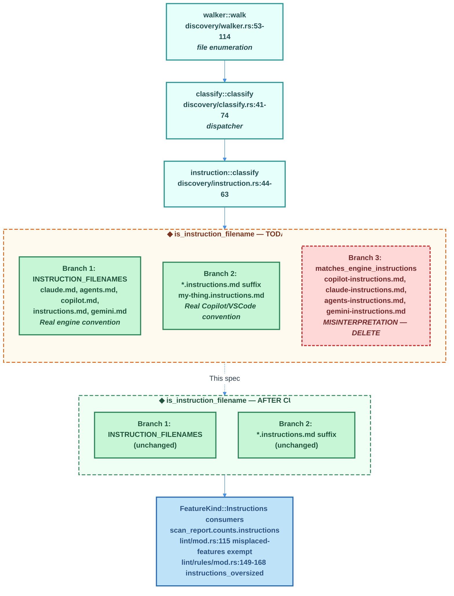

# Removal of the `<engine>-instructions.md` Classifier Branch from Unified Discovery

| Document Metadata      | Details                                                                                            |
| ---------------------- | -------------------------------------------------------------------------------------------------- |
| Author(s)              | Sean Larkin (selarkin@microsoft.com)                                                               |
| Status                 | **Implemented** — change shipped in [Unreleased] CHANGELOG; see `### Removed` entry |
| Team / Owner           | aipm core (libaipm/discovery, libaipm/lint)                                                        |
| Created / Last Updated | 2026-05-02 / 2026-05-05                                                                            |
| Primary Research       | [`research/docs/2026-05-02-engine-instructions-md-pattern-removal.md`](../research/docs/2026-05-02-engine-instructions-md-pattern-removal.md) |
| Supersedes (in part)   | [`specs/2026-05-01-unified-discovery-and-copilot-skill-detection.md`](2026-05-01-unified-discovery-and-copilot-skill-detection.md) — section 5.4 and goal G7 |
| Related Issue          | [#725](https://github.com/TheLarkInn/aipm/issues/725) (lint-side fix being withdrawn; migrate-side fix unaffected) |
| Git Commit at Authoring | `0f4e837c0e3ba30ad34827197fd54c0c6a9a7348` (`main`)                                              |

## 1. Executive Summary

The unified discovery pipeline currently recognises four filenames —
`copilot-instructions.md`, `claude-instructions.md`, `agents-instructions.md`,
and `gemini-instructions.md` — as instruction files via the
`ENGINE_INSTRUCTION_PREFIXES` constant in
[`crates/libaipm/src/discovery/instruction.rs:33`](https://github.com/TheLarkInn/aipm/blob/0f4e837c0e3ba30ad34827197fd54c0c6a9a7348/crates/libaipm/src/discovery/instruction.rs#L33).
Verification against each engine's official documentation (Anthropic Claude
Code, GitHub Copilot, Google Gemini CLI, AGENTS.md spec) confirms three of the
four names are invented — no engine reads them — and the fourth
(`copilot-instructions.md`) is real but only at exactly two paths
(`.github/copilot-instructions.md`, `$HOME/.copilot/copilot-instructions.md`),
neither of which the classifier checks. This spec proposes deleting the third
branch of `is_instruction_filename` along with all dependent tests, fixtures,
spec sections, changelog entries, and in-flight research notes — while
preserving the two legitimate branches (`INSTRUCTION_FILENAMES` exact-name
table and `*.instructions.md` suffix). The cut affects 1 implementation file,
5 test files, 2 spec files, 2 doc files, and 2 in-flight research files. No
data migration is required; rollback is a single revert. See
[research §1](../research/docs/2026-05-02-engine-instructions-md-pattern-removal.md#1-engine-documentation-verification-load-bearing-facts)
for the engine-doc citations and
[research §2-§7](../research/docs/2026-05-02-engine-instructions-md-pattern-removal.md#2-the-pattern-in-code)
for per-file blast radius.

## 2. Context and Motivation

### 2.1 Current State

The unified discovery instruction-classifier
([`crates/libaipm/src/discovery/instruction.rs`](https://github.com/TheLarkInn/aipm/blob/0f4e837c0e3ba30ad34827197fd54c0c6a9a7348/crates/libaipm/src/discovery/instruction.rs))
implements three OR'd branches inside `is_instruction_filename` at lines 66-70:

1. `INSTRUCTION_FILENAMES.contains(&file_name_lower)` — the table at line 29-30
   listing `claude.md`, `agents.md`, `copilot.md`, `instructions.md`,
   `gemini.md`. (Legitimate — these are real engine files.)
2. `file_name_lower.ends_with(".instructions.md")` — the VS Code / Copilot
   `<NAME>.instructions.md` convention. (Legitimate.)
3. `matches_engine_instructions(file_name_lower)` — accepts
   `<engine>-instructions.md` for `<engine> ∈ {copilot, claude, agents, gemini}`,
   from any source root the walker descends into. (Misinterpretation — see §2.2.)

A file matched by any branch produces a `DiscoveredFeature { kind:
FeatureKind::Instructions, … }`, which:

- Increments `counts.instructions` in `scan_report::counts`
  ([`scan_report.rs:83`](https://github.com/TheLarkInn/aipm/blob/0f4e837c0e3ba30ad34827197fd54c0c6a9a7348/crates/libaipm/src/discovery/scan_report.rs#L83)).
- Exempts the file from `source/misplaced-features` lint
  ([`lint/mod.rs:115`](https://github.com/TheLarkInn/aipm/blob/0f4e837c0e3ba30ad34827197fd54c0c6a9a7348/crates/libaipm/src/lint/mod.rs#L115)).
- Activates the `instructions/oversized` rule
  ([`lint/rules/mod.rs:149-168`](https://github.com/TheLarkInn/aipm/blob/0f4e837c0e3ba30ad34827197fd54c0c6a9a7348/crates/libaipm/src/lint/rules/mod.rs#L149-L168)).

The branch was added under
[`specs/2026-05-01-unified-discovery-and-copilot-skill-detection.md`](2026-05-01-unified-discovery-and-copilot-skill-detection.md)
goal G7 (line 109) and section 5.4 (lines 415-450), as the supposed lint-side
fix for issue #725.

### 2.2 The Problem

**The branch is based on a misreading of engine documentation.** Per
[research §1](../research/docs/2026-05-02-engine-instructions-md-pattern-removal.md#1-engine-documentation-verification-load-bearing-facts):

| Prefix | Real engine name | Real path(s) | Aipm classifier accepts at | Verdict |
|---|---|---|---|---|
| `claude-` | `CLAUDE.md` | `./CLAUDE.md`, `./.claude/CLAUDE.md`, `~/.claude/CLAUDE.md` | any source root, any nested path | Invented |
| `copilot-` | `copilot-instructions.md` | `./.github/copilot-instructions.md`, `$HOME/.copilot/copilot-instructions.md` | any source root, any nested path | Real but misplaced |
| `agents-` | `AGENTS.md` | repo root, per-package roots | any source root, any nested path | Invented |
| `gemini-` | `GEMINI.md` | `~/.gemini/GEMINI.md`, workspace walk | any source root, any nested path | Invented |

Cited sources:
[Claude memory docs](https://code.claude.com/docs/en/memory),
[GitHub Copilot repo instructions](https://docs.github.com/en/copilot/customizing-copilot/adding-repository-custom-instructions-for-github-copilot),
[GitHub Copilot CLI instructions](https://docs.github.com/en/copilot/how-tos/copilot-cli/customize-copilot/add-custom-instructions),
[Gemini CLI GEMINI.md docs](https://google-gemini.github.io/gemini-cli/docs/cli/gemini-md.html),
[AGENTS.md spec](https://agents.md/).

**User Impact:** The classifier produces false positives — it surfaces
oversized-file diagnostics for files that no engine reads, and counts them in
the scan summary, giving users (and `aipm migrate` consumers) a misleading
picture of which files participate in their AI workflow.

**Business Impact (project credibility):** aipm's value proposition is
"mirror real engine behavior to enforce real engine policy." Inventing
filenames undermines that contract.

**Technical Debt:** The spec, CHANGELOG, and in-flight research files all
codify the misinterpretation, so any future agent loop reading this corpus
will reach the same wrong conclusion. The fix needs to extend to the prose
artifacts, not just the code.

**Issue #725 status:** The migrate-side fix (skill detection at
`.github/copilot/skills/<name>/SKILL.md`) is real and correct and is NOT
affected by this spec. Only the lint-side claim from #725 is being withdrawn.

## 3. Goals and Non-Goals

### 3.1 Functional Goals

- [ ] **G1:** Delete the `ENGINE_INSTRUCTION_PREFIXES` constant and the
      `matches_engine_instructions` helper from
      [`discovery/instruction.rs`](https://github.com/TheLarkInn/aipm/blob/0f4e837c0e3ba30ad34827197fd54c0c6a9a7348/crates/libaipm/src/discovery/instruction.rs).
- [ ] **G2:** Reduce `is_instruction_filename` to two branches
      (`INSTRUCTION_FILENAMES` table + `*.instructions.md` suffix). The
      `INSTRUCTION_FILENAMES` constant and `*.instructions.md` matching MUST
      remain unchanged.
- [ ] **G3:** Delete every `Case C` unit test in `instruction.rs` (lines
      143-214) that asserts `<engine>-instructions.md` matches or that guards
      its negative cases. Edit the structural test
      `classify_returns_path_unchanged` at lines 218-228 to use a filename
      from `INSTRUCTION_FILENAMES` instead of `copilot-instructions.md`.
- [ ] **G4:** Update test fixtures in 5 sibling source files that bake the
      `.github/copilot/copilot-instructions.md` path into structural tests of
      the unified discovery pipeline:
      `discovery/{mod,classify,types,walker}.rs` and `lint/mod.rs`. Tests
      asserting only on the engine-prefix branch are deleted; tests covering
      the SKILL.md side of #725 retain their skills-related assertions.
- [ ] **G5:** Delete the BDD step `given_copilot_instructions_file_exists` at
      [`crates/libaipm/tests/bdd.rs:791-807`](https://github.com/TheLarkInn/aipm/blob/0f4e837c0e3ba30ad34827197fd54c0c6a9a7348/crates/libaipm/tests/bdd.rs#L791-L807),
      and the corresponding scenario at
      [`tests/features/guardrails/quality.feature:64-69`](https://github.com/TheLarkInn/aipm/blob/0f4e837c0e3ba30ad34827197fd54c0c6a9a7348/tests/features/guardrails/quality.feature#L64-L69).
- [ ] **G6:** Edit the e2e test
      [`crates/aipm/tests/issue_725_e2e.rs`](https://github.com/TheLarkInn/aipm/blob/0f4e837c0e3ba30ad34827197fd54c0c6a9a7348/crates/aipm/tests/issue_725_e2e.rs)
      so its fixture no longer writes `copilot-instructions.md` and its four
      tests no longer assert on `"1 instruction"` in the scan summary.
- [ ] **G7:** Withdraw goal G7 and section 5.4 from
      [`specs/2026-05-01-unified-discovery-and-copilot-skill-detection.md`](2026-05-01-unified-discovery-and-copilot-skill-detection.md).
      Edit lines 16, 76-83, 90, 109, 213, 415-450, 632, 685, 700, 709-710 per
      [research §4.1](../research/docs/2026-05-02-engine-instructions-md-pattern-removal.md#41-specs2026-05-01-unified-discovery-and-copilot-skill-detectionmd).
- [ ] **G8:** Remove the `aipm lint now recognises <engine>-instructions.md`
      bullet at
      [`CHANGELOG.md:10`](https://github.com/TheLarkInn/aipm/blob/0f4e837c0e3ba30ad34827197fd54c0c6a9a7348/CHANGELOG.md#L10).
      Add a corresponding `### Removed` entry under `## [Unreleased]` citing
      this spec.
- [ ] **G9:** Edit the misleading comment at
      [`docs/rules/source/misplaced-features.md:62`](https://github.com/TheLarkInn/aipm/blob/0f4e837c0e3ba30ad34827197fd54c0c6a9a7348/docs/rules/source/misplaced-features.md#L62)
      that incorrectly attributes `copilot-instructions.md` exemption to the
      `*.instructions.md` pattern. Replace the example with a real
      `*.instructions.md`-matching filename.
- [ ] **G10:** Reconcile in-flight research files
      [`research/feature-list.json`](https://github.com/TheLarkInn/aipm/blob/0f4e837c0e3ba30ad34827197fd54c0c6a9a7348/research/feature-list.json)
      and
      [`research/progress.txt`](https://github.com/TheLarkInn/aipm/blob/0f4e837c0e3ba30ad34827197fd54c0c6a9a7348/research/progress.txt)
      per
      [research §6](../research/docs/2026-05-02-engine-instructions-md-pattern-removal.md#6-in-flight-research-research) so a future agent loop reading the corpus does not re-introduce the
      family.
- [ ] **G11:** All four cargo quality gates from
      [`CLAUDE.md`](https://github.com/TheLarkInn/aipm/blob/0f4e837c0e3ba30ad34827197fd54c0c6a9a7348/CLAUDE.md)
      pass after the cut: `cargo build --workspace`, `cargo test --workspace`,
      `cargo clippy --workspace -- -D warnings`, `cargo fmt --check`. Branch
      coverage remains ≥ 89%.
- [ ] **G12:** Add a single regression test asserting that
      `.github/copilot/copilot-instructions.md` (the nested path Copilot does
      NOT read) is **not** classified as `Instructions` post-cut, citing this
      spec in a one-line comment so future loops cannot silently re-introduce
      the branch.

### 3.2 Non-Goals (Out of Scope)

- [ ] **N1:** We will NOT delete the `INSTRUCTION_FILENAMES` table or the
      `*.instructions.md` suffix branch. Both correspond to real engine
      conventions documented in
      [`research/docs/2026-03-28-copilot-cli-source-code-analysis.md`](../research/docs/2026-03-28-copilot-cli-source-code-analysis.md)
      and
      [`research/docs/2026-03-16-claude-code-defaults.md`](../research/docs/2026-03-16-claude-code-defaults.md).
- [ ] **N2:** We will NOT touch the migrate-side #725 fix (skill detection at
      `.github/copilot/skills/<name>/SKILL.md`). That fix is real and stays.
      All edits to spec/test fixtures preserve the SKILL.md assertions.
- [ ] **N3:** We will NOT add `copilot-instructions.md` (bare path) to
      `INSTRUCTION_FILENAMES` as part of this spec. That is a separate policy
      decision (see Open Question §9.1) — proposing it here would inflate
      scope and re-litigate the spec audit. If the team decides the bare path
      should be honored, a follow-up spec covers it.
- [ ] **N4:** We will NOT redesign the `Rule` trait or the dispatcher
      (`crates/libaipm/src/discovery/classify.rs`). The cut is local to the
      instruction classifier.
- [ ] **N5:** We will NOT rename `discovery_legacy` → anything, nor change
      the `AIPM_UNIFIED_DISCOVERY` env-var feature-flag gate. The unified
      pipeline is otherwise correct.
- [ ] **N6:** We will NOT delete or modify the
      `2026-05-01-unified-discovery-and-copilot-skill-detection.md` spec
      *file* — only the sections related to G7 / section 5.4 (per G7 of this
      spec). The SKILL.md sections of that spec stay verbatim.
- [ ] **N7:** We will NOT add LSP/editor-support for the new "narrower"
      classifier. Existing
      [`vscode-aipm/src/extension.ts`](https://github.com/TheLarkInn/aipm/blob/0f4e837c0e3ba30ad34827197fd54c0c6a9a7348/vscode-aipm/src/extension.ts)
      document selectors for `**/*.instructions.md` already cover the
      legitimate case.

## 4. Proposed Solution (High-Level Design)

### 4.1 System Architecture Diagram

The change is local to one branch in one classifier function. The diagram
below shows the data flow before and after, focusing on
`is_instruction_filename`.



### 4.2 Architectural Pattern

**Pattern:** Surgical removal — single branch, single helper, single constant
deleted from one classifier function. No new abstraction is introduced. The
remaining two branches were already independent of the deleted branch (no
shared state, no shared helpers — verified per
[research §2.1](../research/docs/2026-05-02-engine-instructions-md-pattern-removal.md#21-implementation-home--crateslibaipmsrcdiscoveryinstructionrs)),
so deletion is local and free of ripple effects within `instruction.rs`.

The downstream consumers (`scan_report::counts`, `lint/mod.rs:115`,
`lint/rules/mod.rs:149-168`) all switch on `FeatureKind::Instructions` and do
not care which branch produced the kind. After the cut, they continue to
function correctly for files matched by branches 1 or 2; files matched only
by branch 3 are silently skipped (the dispatcher's `tracing::debug!` at
[`discovery/mod.rs:93`](https://github.com/TheLarkInn/aipm/blob/0f4e837c0e3ba30ad34827197fd54c0c6a9a7348/crates/libaipm/src/discovery/mod.rs#L93)).

### 4.3 Key Components

| Component | Responsibility | Action | Justification |
| ---------------- | --------------- | ----- | --------- |
| `instruction::is_instruction_filename` | Filename-shape recognizer | **Edit** — drop branch 3 | Misinterpretation per research §1 |
| `ENGINE_INSTRUCTION_PREFIXES` const | Engine-prefix data | **Delete** | Sole consumer is the deleted branch |
| `matches_engine_instructions` helper | Engine-prefix matching | **Delete** | Sole caller is the deleted branch |
| `instruction.rs` Case-C tests (lines 143-214) | Asserts deleted branch | **Delete** | Cover the deleted branch |
| `classify_returns_path_unchanged` test (218-228) | Structural test | **Edit** to use a `INSTRUCTION_FILENAMES` filename | Behavior-of-`classify` not behavior-of-deleted-branch |
| 5 sibling source-file fixtures | Test fixture using `.github/copilot/copilot-instructions.md` | **Edit/delete** per §5.3 | Fixtures depend on deleted classification |
| `bdd.rs` step + `quality.feature` scenario | BDD coverage of deleted branch | **Delete** | Sole reason for the step's existence |
| `issue_725_e2e.rs` fixture + count assertions | E2E proof of "1 instruction" | **Edit** fixture + count strings | Behavior-of-skill-detection vs. behavior-of-deleted-branch |
| `2026-05-01-unified-discovery-...md` spec § G7 + 5.4 | Authoritative source of misinterpretation | **Edit** to withdraw | Otherwise future loops re-introduce |
| `CHANGELOG.md:10` bullet | Public claim of the deleted branch | **Delete + add Removed entry** | Keeps the changelog truthful |
| `docs/rules/source/misplaced-features.md:62` | Misleading inline example | **Edit** | Comment was always wrong |
| `feature-list.json` + `progress.txt` | In-flight research files | **Edit** per research §6 | Future-loop hygiene |

## 5. Detailed Design

### 5.1 API Interfaces

No public API change. The only `pub` items in `discovery/instruction.rs` are:

- `pub const INSTRUCTION_FILENAMES: &[&str]` — **kept unchanged**.
- `pub fn classify(file_name, path, engine, source_root) -> Option<DiscoveredFeature>`
  — signature **kept unchanged**; behavior narrows (returns `None` for
  `<engine>-instructions.md` filenames it previously matched).

`discovery/mod.rs:27` re-export `pub use instruction::classify as classify_instruction;` is verified unused outside this file (per research §2.1) but
is not part of this spec's deletion — leaving it preserves potential future
callers and removing it is unrelated cleanup.

The `pub` const `INSTRUCTION_FILENAMES` is exported but no out-of-crate
consumer is known. Verify with `grep -rn "INSTRUCTION_FILENAMES" --include="*.rs"`
before merge — if there are no external consumers, the existing `pub` is fine
to retain (we are not actively de-exporting in this spec).

### 5.2 Data Model / Schema

No schema change. The `DiscoveredFeature` struct shape, the `FeatureKind` enum
variants, and the `discovery::types::Engine` enum are all unchanged.

The downstream `ScanCounts` struct
([`scan_report.rs:15-25`](https://github.com/TheLarkInn/aipm/blob/0f4e837c0e3ba30ad34827197fd54c0c6a9a7348/crates/libaipm/src/discovery/scan_report.rs#L15-L25))
keeps its `instructions: usize` field. The field's value will simply be
smaller for projects that previously triggered the deleted branch.

The output format `"matched 3 skills, 1 instruction"` from `format_counts`
will collapse to `"matched 3 skills"` for the issue #725 fixture. Confirm
that `format_counts` handles `instructions == 0` cleanly (it should — verify
in `scan_report.rs::format_counts`); if it doesn't, that is a separate
defect that this spec exposes but does not fix.

### 5.3 Algorithms and State Management

#### 5.3.1 The cut in `instruction.rs`

The full diff intent (verbatim line references against commit
`0f4e837c0e3ba30ad34827197fd54c0c6a9a7348`):

**Delete:**
- Lines 11-13 (module-doc Case 3)
- Line 32 (doc comment `Engine prefixes accepted in the <engine>-instructions.md shape.`)
- Line 33 (`const ENGINE_INSTRUCTION_PREFIXES: &[&str] = &["copilot", "claude", "agents", "gemini"];`)
- Line 69 (the `|| matches_engine_instructions(file_name_lower)` disjunct)
- Lines 72-79 (`matches_engine_instructions` helper + its doc)
- Line 143 (test-section comment `// --- Case C: <engine>-instructions.md (the #725 fix) ---`)
- Lines 145-150 (`copilot_instructions_md_matches_issue_725`)
- Lines 152-155 (`claude_instructions_md_matches`)
- Lines 157-160 (`agents_instructions_md_matches`)
- Lines 162-165 (`gemini_instructions_md_matches`)
- Lines 167-171 (`engine_instructions_md_case_insensitive`)
- Lines 180-184 (`instructions_copilot_md_wrong_order_no_match`)
- Lines 186-191 (`unknown_engine_prefix_no_match`)
- Lines 193-197 (`copilot_tools_md_does_not_match`)
- Lines 199-203 (`copilot_instructions_md_with_extra_suffix_no_match`)
- Lines 210-214 (`just_dash_instructions_md_no_match`)

**Edit:**
- Lines 218-228 (`classify_returns_path_unchanged`): replace the path
  `/repo/.github/copilot/copilot-instructions.md` and the call
  `classify("copilot-instructions.md", ...)` with a `INSTRUCTION_FILENAMES`
  filename — recommend `CLAUDE.md` since the existing
  `classify_passes_engine_from_caller` test at lines 230-236 already uses
  `CLAUDE.md` and has a different structural assertion (engine echoing). To
  preserve test independence, use `instructions.md` or `agents.md` here.

**Add:**
- One regression test at the bottom of `mod tests` named
  `nested_copilot_instructions_md_not_classified` asserting
  `classify_with("copilot-instructions.md").is_none()` with a one-line
  comment: `// see specs/2026-05-02-engine-instructions-md-pattern-removal.md` (G12).

After the cut, `instruction.rs` shrinks from ~237 lines to ~140. The
two-branch `is_instruction_filename` becomes:

```rust
fn is_instruction_filename(file_name_lower: &str) -> bool {
    INSTRUCTION_FILENAMES.contains(&file_name_lower)
        || file_name_lower.ends_with(".instructions.md")
}
```

#### 5.3.2 State machine — none

There is no state to migrate. The classifier is pure (`fn` with `&str` /
`&Path` inputs and `Option<DiscoveredFeature>` output, no I/O). The cut
narrows the function's domain without affecting its codomain shape.

#### 5.3.3 Downstream behavior matrix (the contract change)

For each filename that previously triggered branch 3, document the post-cut
behavior:

| Filename | Path tested | Classifier today | Classifier after | Lint behavior change |
|---|---|---|---|---|
| `copilot-instructions.md` | any nested path under `.github/copilot/` | `Instructions` | `None` (skipped) | No `instructions/oversized`; not exempt from `source/misplaced-features` (but the path is not under `.ai/` so misplaced-features still doesn't fire) |
| `claude-instructions.md`, `agents-instructions.md`, `gemini-instructions.md` | anywhere | `Instructions` | `None` | Same as above |
| `CLAUDE.md`, `claude.md` | anywhere | `Instructions` (branch 1) | `Instructions` (branch 1) | **Unchanged** |
| `my-thing.instructions.md` | anywhere | `Instructions` (branch 2) | `Instructions` (branch 2) | **Unchanged** |
| `.github/copilot-instructions.md` (BARE — Copilot's real path) | `.github/` | `Instructions` (branch 3 — but path is correct) | `None` (skipped) | **Behavior regression for the one real path** — see Open Question §9.1 |

The behavior regression in the last row is the price of the surgical cut. It
is documented as Open Question §9.1; if the team decides the bare path
matters, a follow-up spec adds `copilot-instructions.md` to
`INSTRUCTION_FILENAMES` with engine-gating. That is intentionally out of
scope here per N3.

### 5.4 Test Plan (Per-File Detail)

#### 5.4.1 Unit tests in `crates/libaipm/src/`

| File | Lines | Action |
|---|---|---|
| `discovery/instruction.rs` | 143-214 | Delete all Case-C tests (per §5.3.1) |
| `discovery/instruction.rs` | 218-228 | Edit `classify_returns_path_unchanged` to use a non-engine-prefix filename |
| `discovery/instruction.rs` | (new at end of `mod tests`) | Add `nested_copilot_instructions_md_not_classified` regression test (G12) |
| `discovery/mod.rs` | 122-136 | Edit `discover_unified_finds_issue_725_tree` — drop the `copilot-instructions.md` write at line 128 and the related assertion |
| `discovery/mod.rs` | 149-164 | Delete `discover_finds_copilot_instructions_md` entirely |
| `discovery/walker.rs` | 209-223 | Edit `issue_725_tree_visible_to_walker` — drop the `copilot-instructions.md` write at line 216 and the assertion at line 222 (walker-level visibility test still covers SKILL.md paths) |
| `discovery/classify.rs` | 122-130 | Delete `copilot_instructions_md_classified_as_instructions` |
| `discovery/classify.rs` | 162-175 | Edit `issue_725_full_tree_dispatch` — drop the `copilot-instructions.md` line at 172, keep the SKILL.md assertions |
| `discovery/types.rs` | 169 | Edit `discovered_feature_clone_and_eq` — replace path string with any other path (the value is incidental) |
| `lint/mod.rs` | 1583-1628 | Edit `lint_unified_finds_issue_725_skills_and_instructions` — drop the `copilot-instructions.md` line in `write_issue_725_tree`; rename the test to drop `_and_instructions`; drop instruction-related assertions |
| `lint/mod.rs` | 1630-1644+ | Edit `lint_outcome_carries_scan_counts_and_dirs` — change the `instructions == 1` expectation to `instructions == 0` |

#### 5.4.2 BDD layer

| File | Lines | Action |
|---|---|---|
| `crates/libaipm/tests/bdd.rs` | 791-807 | Delete the `given_copilot_instructions_file_exists` step |
| `crates/libaipm/tests/bdd.rs` | 62, 118 | Verify `unified_discovery: bool` field has no other consumers; if none, delete |
| `tests/features/guardrails/quality.feature` | 51-54 | Edit comment block — keep the SKILL.md context, drop the `copilot-instructions.md` mention |
| `tests/features/guardrails/quality.feature` | 64-69 | Delete the `Lint flags oversized .github/copilot/copilot-instructions.md` scenario |

#### 5.4.3 E2E layer

| File | Lines | Action |
|---|---|---|
| `crates/aipm/tests/issue_725_e2e.rs` | 5 | Edit doc comment — drop instruction-file mention |
| `crates/aipm/tests/issue_725_e2e.rs` | 37 | Delete the tree-diagram line |
| `crates/aipm/tests/issue_725_e2e.rs` | 39-58 | Edit `build_issue_725_fixture` — drop lines 55-57 (the `copilot-instructions.md` write) |
| `crates/aipm/tests/issue_725_e2e.rs` | 78-81, 116-119, 175-178 | Edit three assertions on `"matched 3 skills, 1 instruction"` to expect `"matched 3 skills"` (verify `format_counts` rendering) |

#### 5.4.4 New regression test (G12)

Add one test in `discovery/instruction.rs::tests`:

```rust
#[test]
fn nested_copilot_instructions_md_not_classified() {
    // Regression guard: see specs/2026-05-02-engine-instructions-md-pattern-removal.md.
    // GitHub Copilot reads ONLY .github/copilot-instructions.md (bare path) and
    // $HOME/.copilot/copilot-instructions.md. Any nested path must NOT classify
    // as Instructions; reintroducing the engine-prefix branch would be a
    // semantic regression.
    assert!(classify_with("copilot-instructions.md").is_none());
    assert!(classify_with("claude-instructions.md").is_none());
    assert!(classify_with("agents-instructions.md").is_none());
    assert!(classify_with("gemini-instructions.md").is_none());
}
```

This is the only new test added by this spec. It is the explicit guard
against future agent-loop re-introduction of the deleted branch.

#### 5.4.5 Coverage gate (G11)

Per
[`CLAUDE.md`](https://github.com/TheLarkInn/aipm/blob/0f4e837c0e3ba30ad34827197fd54c0c6a9a7348/CLAUDE.md):

```bash
cargo +nightly llvm-cov clean --workspace
cargo +nightly llvm-cov --no-report --workspace --branch
cargo +nightly llvm-cov --no-report --doc
cargo +nightly llvm-cov report --doctests --branch \
  --ignore-filename-regex '(tests/|research/|specs/|wizard_tty\.rs|lsp\.rs)'
```

TOTAL branch column must remain ≥ 89%. Removing tested code (the deleted
branch) typically improves coverage ratios; the risk is that the deleted
*tests* covered branches in OTHER modules (unlikely, but verify the report).

## 6. Alternatives Considered

| Option | Pros | Cons | Reason for Rejection |
|---|---|---|---|
| **A: Leave the branch in place** | Zero churn; tests already pass; "more matches than fewer" feels safer | Aipm produces false-positive diagnostics for files no engine reads; CHANGELOG and spec lie about engine behavior; future agent loops compound the misreading | The whole point of the project is to mirror real engine behavior — leaving the branch makes the credibility problem permanent |
| **B: Narrow the branch to only `copilot-` and only at `.github/copilot-instructions.md` (bare path)** | Preserves the one real engine convention | Requires path-aware logic in the classifier (today it's name-only); adds new abstraction not supported by spec consensus; conflates two concerns (cut + new feature) | Re-implements a feature this spec is removing — better as a separate spec post-cut. See Open Question §9.1 |
| **C: Full delete (this spec)** | Honest contract with engines; future-loop-safe via the regression test in G12; minimal surface | Drops the one-real-path case (`.github/copilot-instructions.md` bare); requires editing the source spec, not just the code | Selected — see N3 for why the bare-path concern is intentionally separate |
| **D: Mark the branch deprecated, keep it for one release** | Soft-launch removal | aipm has no public API contract for which filenames classify as Instructions — there is nothing to deprecate; the deprecation period would just be technical debt | Deprecation is a tool for public API contracts, not internal classifier behavior |
| **E: Rewrite `Rule::check_file` to take `&Manifest` so the classifier can consult a real engine list** | Cleaner long-term architecture | Out of scope per N4; the engine-prefix family is invented regardless of how the rule signature looks | Conflates an architecture refactor (covered in `research/tickets/2026-05-01-510-aipm-toml-engines.md`) with a removal — wrong vehicle |

## 7. Cross-Cutting Concerns

### 7.1 Security and Privacy

No new attack surface. The classifier is pure (no I/O, no network, no
process spawn). Deleting a branch can never introduce a vulnerability the
branch did not already mitigate, and the deleted branch did not perform
sanitization or access control. Security review is not required.

### 7.2 Observability Strategy

No new metrics. The `tracing::debug!` at
[`discovery/mod.rs:93`](https://github.com/TheLarkInn/aipm/blob/0f4e837c0e3ba30ad34827197fd54c0c6a9a7348/crates/libaipm/src/discovery/mod.rs#L93)
will fire once per dropped file (for the four filenames). This is verbose
debug-level logging only; no log-flood concern.

The `ScanCounts.instructions` field continues to surface in the scan summary
output. After the cut, projects that relied on the deleted branch to populate
this count will report a smaller (correct) number. If a downstream consumer
parses this count programmatically, that's a contract change to communicate
in the CHANGELOG `### Changed` (or `### Removed`) section.

### 7.3 Scalability and Capacity Planning

Not applicable. The classifier runs in microseconds per file; deleting a
branch is a perf neutral-to-positive change (one fewer string comparison per
file walked).

## 8. Migration, Rollout, and Testing

### 8.1 Deployment Strategy

aipm is a CLI distributed as a Rust binary. There is no service to roll out,
no feature flag system to gate behind, no shadow mode. The change ships as
follows:

1. **Phase 1 — PR with full cut, all tests pass.** All 12 functional goals
   delivered in a single PR. Reviewers verify the cut is surgical (no edits
   to the legitimate branches), `cargo clippy --workspace -- -D warnings`
   passes, and branch coverage ≥ 89%.
2. **Phase 2 — Merge to `main`.** The `### Removed` CHANGELOG entry under
   `## [Unreleased]` carries the contract-change notice.
3. **Phase 3 — Next release.** When `## [Unreleased]` is promoted to a
   versioned heading, the `### Removed` becomes part of the release notes
   and propagates to consumers via standard release channels.

There is no rollback complexity — `git revert <commit>` restores the prior
behavior bit-for-bit.

### 8.2 Data Migration Plan

Not applicable. The classifier reads files; it does not write or persist
state. There is no backfill, no reconciliation, no legacy data to migrate.

The only "data" affected is in-flight research files (`feature-list.json`,
`progress.txt`) which G10 covers as in-spec edits. These files are
implementation logs, not schemas.

### 8.3 Test Plan

**Unit tests:**
- All edits and deletions per §5.4.1.
- New regression test per §5.4.4 (G12).

**BDD tests:**
- Delete the step + scenario per §5.4.2.
- All other BDD scenarios in `tests/features/` continue to pass unchanged.

**Integration / E2E tests:**
- Edits per §5.4.3 to `issue_725_e2e.rs`.
- All four tests in that file should still pass post-cut, asserting the
  legitimate skill-detection path.

**Quality gates (mandatory, from
[`CLAUDE.md`](https://github.com/TheLarkInn/aipm/blob/0f4e837c0e3ba30ad34827197fd54c0c6a9a7348/CLAUDE.md)):**
- `cargo build --workspace` — must succeed
- `cargo test --workspace` — must succeed (every test green)
- `cargo clippy --workspace -- -D warnings` — must succeed (zero warnings)
- `cargo fmt --check` — must succeed
- `cargo +nightly llvm-cov` per CLAUDE.md — TOTAL branch ≥ 89%

**Verification of the load-bearing regression guard:**
- After implementation, run `grep -rn "ENGINE_INSTRUCTION_PREFIXES\|matches_engine_instructions\|claude-instructions\|agents-instructions\|gemini-instructions" crates/`
  — should return zero hits in source code (test fixtures and the regression
  test itself excepted; the test's assertion strings are intentional).
- Run `grep -rn "engine.instructions" specs/2026-05-02-engine-instructions-md-pattern-removal.md`
  — verify this spec is the only place the term survives in `specs/`.

**Documentation diff verification:**
- The `## [Unreleased]` block in `CHANGELOG.md` should net out to:
  - Removed: the bullet at line 10
  - Added (under `### Removed`): a citation to this spec
- The `## [Unreleased] → ### Fixed` bullet at line 9 (skill detection — the
  legitimate part of #725) should remain unchanged.

## 9. Open Questions / Unresolved Issues

These are inherited from
[research §"Open Questions"](../research/docs/2026-05-02-engine-instructions-md-pattern-removal.md#open-questions)
and require resolution before this spec leaves Draft.

- [x] **9.1 Should `.github/copilot-instructions.md` (the bare path) be
      honored after the cut?** **RESOLVED 2026-05-04 (option b)** —
      `copilot-instructions.md` was added to `INSTRUCTION_FILENAMES` in
      response to Copilot reviewer feedback on PR
      [#762](https://github.com/TheLarkInn/aipm/pull/762). The classifier is
      filename-only (no engine-gating), so the file is recognized as an
      instruction file from any path the walker visits — but in practice the
      filename only appears under `.github/` (Copilot's documented path), so
      false positives are negligible. Non-goal **N3** is therefore relaxed
      for this PR; no follow-up spec is needed.
- [x] **9.2 Spec retraction style.** Should
      `2026-05-01-unified-discovery-and-copilot-skill-detection.md` be edited
      in place (delete G7 / section 5.4) or marked with a "Withdrawn"
      preamble that links to this spec? Editing in place loses the audit
      trail; preamble preserves it. → **Default: preamble at top of the spec
      + line-level edits per §6.1.4 of the research doc.**
      **RESOLVED 2026-05-05:** The preamble was added to `2026-05-01-unified-discovery-and-copilot-skill-detection.md` (see the "Partial withdrawal (2026-05-02)" block at the top of that spec).
- [ ] **9.3 Issue #725 status.** The migrate-side fix is shipped and correct;
      the lint-side claim is being withdrawn. Reopen the issue with a
      comment, post-merge update, or close-with-note? → **Default: post a
      comment on #725 linking to this spec, then close.** (No reopen — the
      customer-visible behavior is "skills found in `.github/copilot/skills/`",
      which works.)
- [x] **9.4 The misleading comment in
      `docs/rules/source/misplaced-features.md:62`** — replace with what?
      Pick a real `*.instructions.md`-matching example. → **Default:
      `code-review.instructions.md` or `frontend.instructions.md`** (the
      latter is already used as a fixture in
      [`lint/rules/instructions_oversized.rs:255`](https://github.com/TheLarkInn/aipm/blob/0f4e837c0e3ba30ad34827197fd54c0c6a9a7348/crates/libaipm/src/lint/rules/instructions_oversized.rs#L255)
      so it has docs-fidelity precedent).
      **RESOLVED 2026-05-05:** `docs/rules/source/misplaced-features.md` now shows `frontend.instructions.md` as the `*.instructions.md` example.
- [ ] **9.5 `format_counts` rendering for `instructions == 0`.** Verify in
      `crates/libaipm/src/discovery/scan_report.rs` that the function emits
      `"matched 3 skills"` (not `"matched 3 skills, 0 instructions"` and not
      a panic) when `counts.instructions == 0`. If it doesn't render
      cleanly, raise a separate ticket — do NOT bundle the fix into this
      spec.
- [ ] **9.6 Confirm no out-of-crate consumer of `INSTRUCTION_FILENAMES`.**
      The const is `pub`; if no external consumer exists, future work could
      narrow visibility to `pub(crate)`. Out of scope for this spec — note
      for follow-up.
