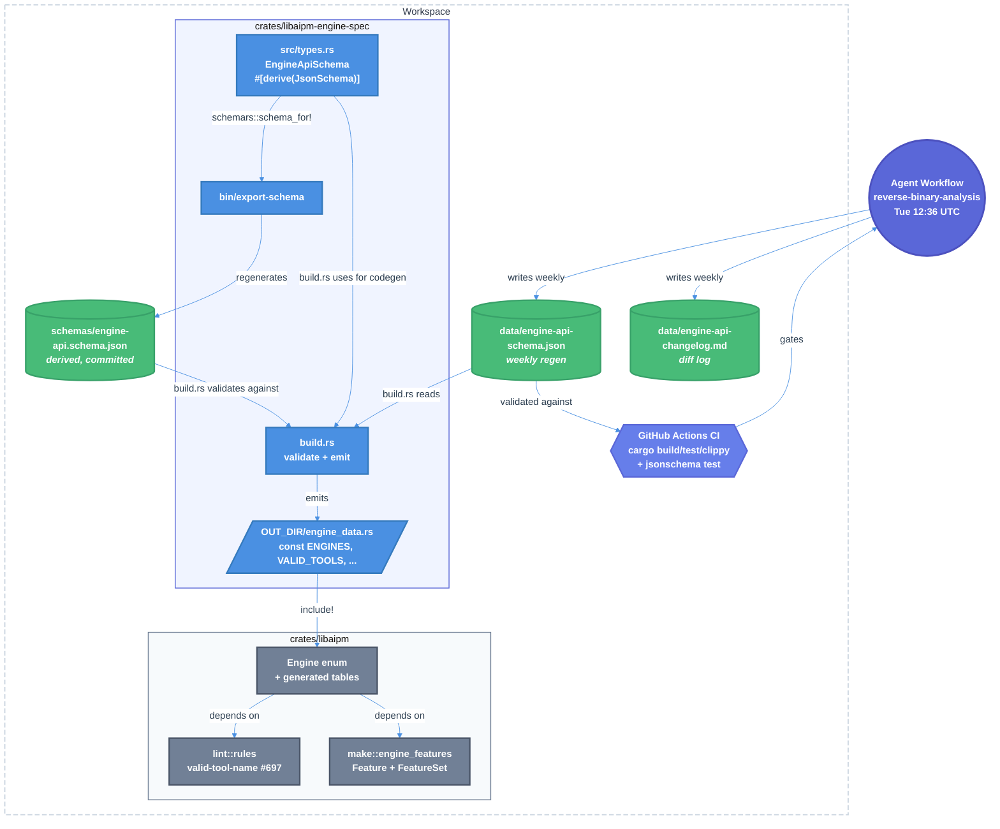

# Engine API Schema as Source of Truth — Technical Design Document / RFC

| Document Metadata      | Details                                                                        |
| ---------------------- | ------------------------------------------------------------------------------ |
| Author(s)              | Sean Larkin                                                                    |
| Status                 | Draft (WIP)                                                                    |
| Team / Owner           | aipm core (TheLarkInn/aipm)                                                    |
| Created / Last Updated | 2026-05-04 / 2026-05-04                                                        |
| Research Source        | [`research/docs/2026-05-04-engine-api-schema-source-of-truth.md`](../research/docs/2026-05-04-engine-api-schema-source-of-truth.md) |
| Related Issues         | [#697](https://github.com/TheLarkInn/aipm/issues/697) (`valid-tool-name` lint), [#510](https://github.com/TheLarkInn/aipm/issues/510) (`[engines]` block in `aipm.toml`), [#132](https://github.com/TheLarkInn/aipm/issues/132) (engine adaptor) |

## 1. Executive Summary

This RFC proposes turning the weekly-regenerated `engine-api-schema.json` artifact into the workspace's **canonical source of truth** for AI-engine API surfaces (`claude`, `copilot-cli`, future engines). Today, every fact the schema records — tool names, convention files, marker paths, manifest field constraints, hook events, feature support — is independently re-encoded by hand across `crates/libaipm` as inline `match` arms, `&[&str]` constants, and per-engine detector files; two divergent `Engine` enums coexist; and lint rule constants (e.g. `MAX_SKILL_NAME_LENGTH = 64`) duplicate facts the schema already publishes. Drift between binary reality and Rust code is silent.

The proposal: introduce a new `crates/libaipm-engine-spec/` crate whose **hand-written Rust types** are the canonical schema; `schemars` derives `schemas/engine-api.schema.json`; a `build.rs` validates the data file against that schema and emits **typed `&'static` const tables** (no runtime parse, no `LazyLock`, no `unwrap` — workspace lint policy clean by construction). All consumer subsystems (`engine.rs`, `discovery`, `lint/rules/known_events.rs`, `make/engine_features.rs`, scattered path literals, `valid-tool-name` lint #697) collapse onto generated tables in a single PR. CI gates the agentic regen PR via a `jsonschema` integration test; the agent's `safe-outputs.protected-paths` is widened to make `crates/`, `Cargo.*`, and `schemas/` system-enforced read-only from the agent.

## 2. Context and Motivation

### 2.1 Current State

- **Architecture**: a Copilot CLI–driven [GitHub Agentic Workflow](../.github/workflows/reverse-binary-analysis.md) runs every Tuesday 12:36 UTC (`cron: "36 12 * * 2"`), `npm install`s `@anthropic-ai/claude-code` and `@github/copilot`, reverse-engineers their entry-point JS, and rewrites `research/engine-api-schema.json` (currently 455 lines / ~32 KB) plus `research/engine-api-changelog.md`. PR #738 (`eb09ac0`, 2026-05-01) established the current baseline.
- **Consumers**: zero. Today the file is **read-only documentation**. No Rust code imports it. Three subsystems duplicate its facts:
  - [`crates/libaipm/src/engine.rs:13-21`](../crates/libaipm/src/engine.rs) — `Engine { Claude, Copilot }` with `const fn` `marker_paths`, `marketplace_manifest_path`, `name`, `all_names`.
  - [`crates/libaipm/src/discovery/types.rs:38-46`](../crates/libaipm/src/discovery/types.rs) — second `Engine { Claude, Copilot, Ai }` enum (3 variants, `Ai` for `.ai/` marketplace host).
  - [`crates/libaipm/src/make/engine_features.rs:95-101`](../crates/libaipm/src/make/engine_features.rs) — string-keyed `match engine { "claude" | "copilot" | "both" => ... }`.
- **Hand-maintained tool tables**: [`crates/libaipm/src/lint/rules/known_events.rs:10-69`](../crates/libaipm/src/lint/rules/known_events.rs) carries `CLAUDE_EVENTS`, `COPILOT_EVENTS`, `COPILOT_LEGACY_MAP` — its doc-comment names the source-of-truth research doc and instructs maintainers to "re-edit when binary analysis is re-run."
- **Hand-maintained limits**: `MAX_SKILL_NAME_LENGTH = 64` ([`skill_name_too_long.rs:13`](../crates/libaipm/src/lint/rules/skill_name_too_long.rs)), `MAX_DESCRIPTION_LENGTH = 1024` ([`skill_desc_too_long.rs:13`](../crates/libaipm/src/lint/rules/skill_desc_too_long.rs)), skill-name regex via byte iteration ([`skill_name_invalid.rs:13-24`](../crates/libaipm/src/lint/rules/skill_name_invalid.rs)) — all matching constraints already encoded in `engine-api-schema.json`'s `apis.copilot-cli.manifest_fields`.
- **Codegen infrastructure**: none. Workspace has zero `build.rs` files, zero `include_str!`, zero `phf` / `typify` / `schemars` / `lazy_static` / `once_cell` (only one stdlib `OnceLock` in [`lint/config.rs:64-69`](../crates/libaipm/src/lint/config.rs)). It is a "plain serde + stdlib" workspace.
- **valid-tool-name lint** (#697) does not exist yet. Its data dependency — `tool_compatibility.engine_exclusive_tools` — is already produced by the agent.

### 2.2 The Problem

- **User Impact** — silent bugs. Existing Rust says `Engine::Copilot.marketplace_manifest_path() = ".github/plugin/marketplace.toml"` ([`engine.rs:35-40`](../crates/libaipm/src/engine.rs)) but the binary-analysis schema reports `.github/plugin/marketplace.json`. Plugin authors hit confusing failure modes whenever Rust diverges from binary reality.
- **Maintenance Impact** — every weekly regen leaves a doc-only diff. The `2026-03-31-cli-binary-frontmatter-hook-analysis.md` research doc was the upstream source for `known_events.rs`; today maintainers must manually re-read schema diffs and edit Rust constants. The reverse-binary-analysis workflow eliminates the *discovery* of changes but not the *propagation*.
- **Technical Debt** — duplicated `Engine` enums, three different ways of expressing engine identity (typed/typed/string), 50+ unrelated sites repeating literals like `.claude-plugin`, `.github/plugin`, `marketplace.json`, `marketplace.toml`, `aipm.toml`. New engine support requires editing N files; adding `gemini` today is a multi-day refactor.
- **Engine Drift Risk** — `reverse-binary-analysis.md`'s output shape is described **only in prose inside the agent's prompt** (md:74–82, 196–203, 212–254); no JSON Schema or Rust type defines it. Silent shape drift on any regen is possible. The agent re-reads its own previous output to compute the diff (md:86–90), so once shape drift occurs the diff logic compounds the error.

## 3. Goals and Non-Goals

### 3.1 Functional Goals

- [ ] **G1** — `crates/libaipm-engine-spec/` exists, holds hand-written canonical Rust types (`EngineApiSchema`, `EngineSpec`, `ToolCall`, `HookEvent`, `Feature`, `EngineSet`, etc.) deriving `schemars::JsonSchema`.
- [ ] **G2** — `cargo run -p libaipm-engine-spec --bin export-schema` regenerates `schemas/engine-api.schema.json` from those types. Output is checked in.
- [ ] **G3** — `build.rs` in `libaipm-engine-spec` reads `crates/libaipm-engine-spec/data/engine-api-schema.json`, validates it against `schemas/engine-api.schema.json` using the `jsonschema` crate, and emits typed `pub const` tables to `OUT_DIR/engine_data.rs`.
- [ ] **G4** — Generated artifacts: `pub enum Engine` (one variant per schema engine, PascalCase from `name`), `pub struct EngineSet` (bitflags), `pub const ENGINES: &[EngineSpec]`, `pub static VALID_TOOLS: phf::Set<&'static str>`, `pub const TOOL_COMPATIBILITY: &[(&str, EngineSet)]`, `pub const HOOK_EVENTS_BY_ENGINE: &[(Engine, &[HookEvent])]`, `pub const FEATURES_BY_ENGINE: &[(Engine, FeatureSet)]`, `pub const META_SCHEMA_VERSION: &str`.
- [ ] **G5** — `libaipm` depends on `libaipm-engine-spec`. The two existing `Engine` enums ([`engine.rs:13-21`](../crates/libaipm/src/engine.rs), [`discovery/types.rs:38-46`](../crates/libaipm/src/discovery/types.rs)) are deleted; consumers re-route to the generated `Engine`. The `Ai` variant becomes a separate hand-written `MarketplaceHost` enum.
- [ ] **G6** — `crates/libaipm/src/lint/rules/known_events.rs` is deleted. Its three tables (`CLAUDE_EVENTS`, `COPILOT_EVENTS`, `COPILOT_LEGACY_MAP`) are replaced by `HOOK_EVENTS_BY_ENGINE` lookups. `is_valid_event` and `suggest_canonical` move to `libaipm-engine-spec` and consult generated tables.
- [ ] **G7** — `crates/libaipm/src/make/engine_features.rs` is rewritten: `Feature` enum + per-engine `FeatureSet` are generated; `features_for_engine(&str)` becomes `features_for_engine(Engine) -> FeatureSet`.
- [ ] **G8** — All hand-written length/regex constants (`MAX_SKILL_NAME_LENGTH = 64`, `MAX_DESCRIPTION_LENGTH = 1024`, skill-name byte regex) are replaced by lookups into the generated `manifest_fields` constraints table.
- [ ] **G9** — Scattered path literals (`.claude-plugin`, `.github/plugin`, `marketplace.json`, `marketplace.toml`, `aipm.toml`, `plugin.json`, etc.) at 50+ sites are replaced by `pub const` references into a centralized generated `paths` module.
- [ ] **G10** — A new lint rule `valid-tool-name` (issue #697) consults `TOOL_COMPATIBILITY` and warns when a plugin without an `[engines]` restriction in `aipm.toml` references an engine-exclusive tool.
- [ ] **G11** — `reverse-binary-analysis.md` is updated: data path moves to `crates/libaipm-engine-spec/data/engine-api-schema.json`; changelog moves to `crates/libaipm-engine-spec/data/engine-api-changelog.md`; agent prompt extended for new fields (`hook_events`, structured `manifest_fields`, `features`, `meta_schema_version`, `$schema`); prose fields renamed to `*_notes`; `safe-outputs.create_pull_request.protected-paths` widened. `.lock.yml` regenerated via `gh aw compile`.
- [ ] **G12** — CI integration test (`crates/libaipm-engine-spec/tests/schema_validation.rs`) loads the data file, validates against `schemas/engine-api.schema.json` via `jsonschema`, and is part of `cargo test --workspace`.
- [ ] **G13** — Workspace meets `cargo build/test/clippy/fmt` clean and ≥89% branch coverage post-merge.

### 3.2 Non-Goals (Out of Scope)

- [ ] **NG1** — We will NOT promote `detection_heuristics`, `discovery_algorithm`, `rules` from prose to structured records. They are renamed to `detection_notes` / `discovery_notes` / `rule_notes` and treated as documentation. Engine detection logic stays hand-written.
- [ ] **NG2** — We will NOT machine-parse the `suggestions` block. It is rendered into the agent's PR body for human review. No tracking issues are auto-opened.
- [ ] **NG3** — We will NOT introduce `typify`. `schemars` runs Rust → JSON Schema; the JSON Schema is a derived artifact, not a codegen input.
- [ ] **NG4** — We will NOT use `LazyLock`, `OnceLock`, `include_str!`, or runtime `serde_json::from_str` for engine data in production code. All tables are compile-time `&'static` const.
- [ ] **NG5** — We will NOT support `gemini` or any third engine in this PR. The schema and agent already accommodate it — adding a new engine becomes a follow-up that only edits the `engines` list at the agent prompt + commits a regen.
- [ ] **NG6** — We will NOT add an `aipm.toml` `[engines]` block in this PR. Issue #510's design depends on this PR's `Engine` enum being generated, but the runtime parsing/validation/CLI surface is a separate spec.
- [ ] **NG7** — We will NOT migrate the 13 per-engine detector files in `crates/libaipm/src/migrate/{agent,command,hook,mcp,skill,output_style}_detector.rs` and `copilot_*_detector.rs` to a generated registry. The generated `Engine` enum and centralized path constants reduce duplication; the per-detector dispatch logic stays as-is.
- [ ] **NG8** — We will NOT add WASM targets, VS Code language-service integration, or external publication of `libaipm-engine-spec`. The crate stays workspace-internal.
- [ ] **NG9** — Pre-PR validation in the workflow itself (running `cargo build` inside the agent sandbox before opening the PR) is out of scope. Standard CI on the PR is the gate.

## 4. Proposed Solution (High-Level Design)

### 4.1 System Architecture Diagram



### 4.2 Architectural Pattern

**Schemars-canonical-types + build.rs + typed-const-tables.**

This is the inverse of the typify pattern (JSON Schema → Rust): we use **Rust-as-canonical-types** (with `schemars` deriving the JSON Schema) because (a) we want type-checked compile-time consumers, (b) the agent rewrites the *data file*, not the meta-schema — so the meta-schema must be stable while the data file shifts, (c) `typify`'s default `with_struct_builder(true)` emits `.unwrap()` calls that violate the workspace `unwrap_in_result` lint.

The pattern breaks the Oxide/`oxide.rs` recipe in two places:
- **No runtime JSON parse**: instead of `include_str!` + `LazyLock<EngineApiSchema>`, the `build.rs` reads the data file at compile time and emits **fully-typed `pub const` tables**. This eliminates `unwrap_used` / `expect_used` / `panic` lint conflicts entirely.
- **No `phf::phf_set!` macro**: we use `phf_codegen::Set` from `build.rs` instead, because the macro form requires literal keys at the source line and we want the keys driven by data.

Reference patterns considered: [`chrono-tz`](https://github.com/chronotope/chrono-tz) (build-time tz tables), [`phf_codegen`](https://docs.rs/phf_codegen) (compile-time perfect hash), [`progenitor`](https://github.com/oxidecomputer/progenitor) (Oxide's OpenAPI codegen — same maintainers as `typify`).

### 4.3 Key Components

| Component                        | Responsibility                                                                                  | Technology Stack                                       | Justification                                                                                                                            |
| -------------------------------- | ----------------------------------------------------------------------------------------------- | ------------------------------------------------------ | ---------------------------------------------------------------------------------------------------------------------------------------- |
| `libaipm-engine-spec` crate      | Holds canonical types, `build.rs`, generated tables, schema-export bin                          | `serde`, `schemars` 1.x, `jsonschema` 0.46+, `phf` 0.13, `phf_codegen` 0.13, `prettyplease` 0.2 | Isolation: lint exceptions and rebuild churn contained; `libaipm` build times unaffected when only the data file changes.               |
| `data/engine-api-schema.json`    | Weekly-regenerated data file (canonical source of API truth)                                    | JSON                                                   | Co-located with the consuming crate; old `research/` location was misleading once it became a build input.                              |
| `schemas/engine-api.schema.json` | Generated meta-schema (defines the data file's shape)                                           | JSON Schema 2020-12                                    | Stable workspace-level URL for external tools (VS Code, agent prompt). Generated by `cargo run --bin export-schema`; checked in.        |
| `build.rs`                       | Validates data file against meta-schema; emits `engine_data.rs` to `OUT_DIR`                    | `serde_json`, `jsonschema`, `phf_codegen`              | Build-time validation surfaces drift as compile error, not runtime panic. `prettyplease` makes generated `.rs` reviewable in `cargo expand`. |
| `bin/export-schema`              | Reads `EngineApiSchema` Rust types, emits `schemas/engine-api.schema.json`                      | `schemars::schema_for!`, `serde_json`                  | Decouples schema generation from per-build codegen; only re-run when Rust types change.                                                  |
| Agent prompt (`reverse-binary-analysis.md`) | Tells the LLM what shape to emit; updated for new fields                              | GitHub Agentic Workflow / Markdown                     | The prompt is rewritten to point at the new path, request structured `manifest_fields`, emit `hook_events` + `features` + `meta_schema_version` + `$schema`. |
| CI integration test              | `jsonschema` validation of data file against committed meta-schema                              | `jsonschema` crate, standard `cargo test`              | Standard CI gates regen PR. No agent-sandbox toolchain dependency.                                                                       |

## 5. Detailed Design

### 5.1 Crate Layout

```
crates/libaipm-engine-spec/
├── Cargo.toml                         # name="libaipm-engine-spec"; runtime deps: serde, phf;
│                                      # build-deps: serde, serde_json, schemars, jsonschema,
│                                      # phf_codegen, prettyplease
├── build.rs                           # validate + emit OUT_DIR/engine_data.rs
├── data/
│   ├── engine-api-schema.json         # ← MOVED FROM research/engine-api-schema.json
│   └── engine-api-changelog.md        # ← MOVED FROM research/engine-api-changelog.md
├── src/
│   ├── lib.rs                         # pub use generated::*; pub use types::*;
│   ├── types.rs                       # EngineApiSchema, EngineSpec, ToolCall, HookEvent,
│   │                                  # Feature, FeatureSet, ManifestFieldSpec, EngineSet
│   │                                  # All #[derive(serde::Deserialize, serde::Serialize,
│   │                                  # schemars::JsonSchema, Debug, Clone, PartialEq, Eq)]
│   ├── helpers.rs                     # is_valid_event, suggest_canonical, valid_tool_name_check,
│   │                                  # engine_for_root_dir, etc. (all consult generated tables)
│   └── generated.rs                   # include!(concat!(env!("OUT_DIR"), "/engine_data.rs"));
├── bin/
│   └── export-schema.rs               # writes schemas/engine-api.schema.json from types
└── tests/
    ├── schema_validation.rs           # validates data/engine-api-schema.json against
    │                                  # schemas/engine-api.schema.json (CI gate)
    ├── schema_export_drift.rs         # asserts schemas/engine-api.schema.json matches what
    │                                  # export-schema would generate now (drift gate)
    └── generated_tables.rs            # smoke tests on ENGINES, VALID_TOOLS, TOOL_COMPATIBILITY
```

### 5.2 Canonical Rust Types (`src/types.rs`)

```rust
use serde::{Deserialize, Serialize};
use schemars::JsonSchema;

pub const META_SCHEMA_VERSION: &str = "1.0.0";

#[derive(Debug, Clone, PartialEq, Eq, Deserialize, Serialize, JsonSchema)]
#[serde(deny_unknown_fields)]
pub struct EngineApiSchemaFile {
    /// Self-referential pointer to the schema this file conforms to.
    #[serde(rename = "$schema")]
    pub schema_uri: String,
    pub meta_schema_version: String,
    pub generated_at: String, // ISO-8601
    pub engines: Vec<EngineBootstrap>,
    pub versions: std::collections::BTreeMap<String, String>,
    pub apis: std::collections::BTreeMap<String, EngineApi>,
    pub tool_compatibility: ToolCompatibility,
    pub suggestions: std::collections::BTreeMap<String, EngineSuggestions>,
}

#[derive(Debug, Clone, PartialEq, Eq, Deserialize, Serialize, JsonSchema)]
#[serde(deny_unknown_fields)]
pub struct EngineBootstrap {
    /// Engine identifier (e.g. "claude", "copilot-cli").
    pub name: String,
    /// Distribution channel ("npm", "github-release", ...).
    pub source: String,
    /// Package identifier in the source channel.
    pub package: String,
}

#[derive(Debug, Clone, PartialEq, Eq, Deserialize, Serialize, JsonSchema)]
#[serde(deny_unknown_fields)]
pub struct EngineApi {
    pub manifest_fields: Vec<ManifestFieldSpec>,
    #[serde(default)]
    pub manifest_search_paths: Vec<String>,
    pub settings_paths: Vec<String>,
    pub folder_conventions: Vec<String>,
    pub convention_files: Vec<ConventionFile>,
    #[serde(default)]
    pub skill_registration: serde_json::Value, // remains semi-structured per-engine
    #[serde(default)]
    pub lsp_config: serde_json::Value,
    #[serde(default)]
    pub mcp_config: serde_json::Value,
    #[serde(default)]
    pub output_styles: Vec<String>,
    pub size_limits: SizeLimits,
    /// Documentation only. Not consumed by Rust code.
    #[serde(default)]
    pub detection_notes: Vec<String>,
    /// Documentation only. Not consumed by Rust code.
    #[serde(default)]
    pub discovery_notes: Vec<String>,
    /// Documentation only. Not consumed by Rust code.
    #[serde(default)]
    pub rule_notes: Vec<String>,
    pub tool_calls: Vec<ToolCall>,
    pub hook_events: Vec<HookEvent>,
    #[serde(default)]
    pub agent_commands: Vec<String>,
    #[serde(default)]
    pub feature_flags: Vec<String>,
    pub features: Vec<FeatureSpec>,
}

#[derive(Debug, Clone, PartialEq, Eq, Deserialize, Serialize, JsonSchema)]
#[serde(deny_unknown_fields)]
pub struct ManifestFieldSpec {
    pub name: String,
    pub r#type: String,           // "string" | "number" | "boolean" | "array" | "object" | "url" | ...
    #[serde(default)]
    pub required: bool,
    #[serde(default)]
    pub constraints: Constraints,
    #[serde(default)]
    pub notes: Option<String>,
}

#[derive(Default, Debug, Clone, PartialEq, Eq, Deserialize, Serialize, JsonSchema)]
#[serde(deny_unknown_fields)]
pub struct Constraints {
    #[serde(default, skip_serializing_if = "Option::is_none")]
    pub max_length: Option<u32>,
    #[serde(default, skip_serializing_if = "Option::is_none")]
    pub min_length: Option<u32>,
    #[serde(default, skip_serializing_if = "Option::is_none")]
    pub regex: Option<String>,
    #[serde(default, skip_serializing_if = "Option::is_none")]
    pub default: Option<serde_json::Value>,
}

#[derive(Debug, Clone, PartialEq, Eq, Deserialize, Serialize, JsonSchema)]
#[serde(deny_unknown_fields)]
pub struct ConventionFile {
    pub filename: String,
    pub convention_paths: Vec<String>,
}

#[derive(Default, Debug, Clone, PartialEq, Eq, Deserialize, Serialize, JsonSchema)]
#[serde(deny_unknown_fields)]
pub struct SizeLimits {
    #[serde(default, skip_serializing_if = "std::collections::BTreeMap::is_empty")]
    #[serde(flatten)]
    pub numeric: std::collections::BTreeMap<String, u64>,
    #[serde(default, skip_serializing_if = "Option::is_none")]
    pub notes: Option<String>,
}

#[derive(Debug, Clone, PartialEq, Eq, Deserialize, Serialize, JsonSchema)]
#[serde(deny_unknown_fields)]
pub struct ToolCall {
    pub name: String,
    #[serde(default)]
    pub aliases: Vec<String>,
    #[serde(default)]
    pub deprecated: bool,
    #[serde(default)]
    pub notes: Option<String>,
}

#[derive(Debug, Clone, PartialEq, Eq, Deserialize, Serialize, JsonSchema)]
#[serde(deny_unknown_fields)]
pub struct HookEvent {
    pub name: String,
    #[serde(default)]
    pub aliases: Vec<String>,
    #[serde(default)]
    pub deprecated: bool,
    #[serde(default)]
    pub notes: Option<String>,
}

#[derive(Debug, Clone, PartialEq, Eq, Deserialize, Serialize, JsonSchema)]
#[serde(deny_unknown_fields)]
pub struct FeatureSpec {
    pub kind: FeatureKind,
    #[serde(default, skip_serializing_if = "Option::is_none")]
    pub manifest_field: Option<String>,
    #[serde(default, skip_serializing_if = "Option::is_none")]
    pub layout_hint: Option<String>,
    #[serde(default, skip_serializing_if = "Vec::is_empty")]
    pub capabilities: Vec<String>,
}

#[derive(Debug, Clone, Copy, PartialEq, Eq, Hash, Deserialize, Serialize, JsonSchema)]
#[serde(rename_all = "snake_case")]
pub enum FeatureKind {
    Skill, Agent, Mcp, Hook, OutputStyle, Lsp, Extension, Command,
}

#[derive(Debug, Clone, PartialEq, Eq, Deserialize, Serialize, JsonSchema)]
#[serde(deny_unknown_fields)]
pub struct ToolCompatibility {
    pub shared_tools: Vec<String>,
    pub engine_exclusive_tools:
        std::collections::BTreeMap<String, ToolSupport>,
}

#[derive(Debug, Clone, PartialEq, Eq, Deserialize, Serialize, JsonSchema)]
#[serde(deny_unknown_fields)]
pub struct ToolSupport {
    pub supported_by: Vec<String>,   // engine name strings
    pub unsupported_by: Vec<String>,
}

#[derive(Debug, Clone, PartialEq, Eq, Deserialize, Serialize, JsonSchema)]
#[serde(deny_unknown_fields)]
pub struct EngineSuggestions {
    #[serde(default)]
    pub adaptor_fixes: Vec<String>,
    #[serde(default)]
    pub test_cases: Vec<String>,
    #[serde(default)]
    pub behaviour_variants: Vec<String>,
}
```

### 5.3 Generated Tables (`OUT_DIR/engine_data.rs` — emitted by `build.rs`)

```rust
// Auto-generated. DO NOT EDIT.
use crate::types::*;

pub const META_SCHEMA_VERSION: &str = "1.0.0";

#[derive(Debug, Clone, Copy, PartialEq, Eq, Hash)]
pub enum Engine {
    Claude,
    CopilotCli,
}

impl Engine {
    pub const ALL: &'static [Engine] = &[Engine::Claude, Engine::CopilotCli];

    pub const fn name(self) -> &'static str {
        match self {
            Engine::Claude     => "claude",
            Engine::CopilotCli => "copilot-cli",
        }
    }

    pub fn from_name(name: &str) -> Option<Self> {
        match name {
            "claude"      => Some(Engine::Claude),
            "copilot-cli" => Some(Engine::CopilotCli),
            _ => None,
        }
    }
}

bitflags::bitflags! {
    pub struct EngineSet: u32 {
        const CLAUDE      = 0b0000_0001;
        const COPILOT_CLI = 0b0000_0010;
        const ALL         = Self::CLAUDE.bits() | Self::COPILOT_CLI.bits();
    }
}

pub const ENGINES: &[(Engine, EngineSpec)] = &[
    (Engine::Claude, EngineSpec {
        name: "claude",
        package: "@anthropic-ai/claude-code",
        version: "2.1.126",
        marker_paths: &[".claude-plugin/plugin.json", ".claude-plugin/plugin.toml"],
        marketplace_manifest_path: ".claude-plugin/marketplace.toml",
        manifest_search_paths: &[/* ... */],
        settings_paths: &[".claude/settings.json", ".claude/settings.local.json"],
        folder_conventions: &[".claude/", ".claude/skills/", "~/.claude/skills/"],
        convention_files: &[("CLAUDE.md", &[".", ".claude"])],
    }),
    (Engine::CopilotCli, EngineSpec {
        name: "copilot-cli",
        package: "@github/copilot",
        version: "1.0.40",
        marker_paths: &[/* ... */],
        marketplace_manifest_path: ".github/plugin/marketplace.json",  // FIX vs current Rust
        // ...
    }),
];

pub static VALID_TOOLS: phf::Set<&'static str> = /* phf_codegen output */;

pub const TOOL_COMPATIBILITY: &[(&str, EngineSet)] = &[
    ("Task",                EngineSet::CLAUDE),
    ("Edit",                EngineSet::CLAUDE),
    ("get_pull_request",    EngineSet::COPILOT_CLI),
    ("browser_navigate",    EngineSet::COPILOT_CLI),
    ("bash",                EngineSet::ALL),
    // ...
];

pub const HOOK_EVENTS_BY_ENGINE: &[(Engine, &[HookEventStatic])] = &[
    (Engine::Claude,     &[/* PreToolUse, PostToolUse, ... 27 entries */]),
    (Engine::CopilotCli, &[/* preToolUse, postToolUse, ... 10 entries */]),
];

pub const FEATURES_BY_ENGINE: &[(Engine, EngineFeatureSet)] = &[
    (Engine::Claude,     EngineFeatureSet { /* skill, agent, mcp, hook, output_style */ }),
    (Engine::CopilotCli, EngineFeatureSet { /* skill, agent, mcp, hook, output_style, lsp, extension */ }),
];

pub mod paths {
    pub const CLAUDE_PLUGIN_DIR:    &str = ".claude-plugin";
    pub const GITHUB_PLUGIN_DIR:    &str = ".github/plugin";
    pub const MARKETPLACE_JSON:     &str = "marketplace.json";
    pub const MARKETPLACE_TOML:     &str = "marketplace.toml";
    pub const PLUGIN_JSON:          &str = "plugin.json";
    pub const AIPM_TOML:            &str = "aipm.toml";
    pub const SETTINGS_JSON:        &str = "settings.json";
    pub const SETTINGS_LOCAL_JSON:  &str = "settings.local.json";
    pub const CLAUDE_DOT:           &str = ".claude";
    pub const GITHUB_DOT:           &str = ".github";
    pub const AI_DOT:               &str = ".ai";
}

pub mod constraints {
    pub const PLUGIN_NAME_MAX_LEN:        usize = 64;
    pub const DESCRIPTION_MAX_LEN:        usize = 1024;
    pub const POST_INSTALL_MSG_MAX_LEN:   usize = 2048;
    // ... derived from manifest_fields[].constraints
}
```

### 5.4 `build.rs` Outline

```rust
//! Build script for libaipm-engine-spec.
//! Validates data/engine-api-schema.json against schemas/engine-api.schema.json
//! and emits OUT_DIR/engine_data.rs.

fn main() -> Result<(), Box<dyn std::error::Error>> {
    // 1. Tell Cargo when to re-run.
    println!("cargo:rerun-if-changed=data/engine-api-schema.json");
    println!("cargo:rerun-if-changed=../../schemas/engine-api.schema.json");
    println!("cargo:rerun-if-changed=src/types.rs");
    println!("cargo:rerun-if-changed=build.rs");

    // 2. Read the meta-schema and the data file.
    let meta_schema_text = std::fs::read_to_string("../../schemas/engine-api.schema.json")?;
    let data_text        = std::fs::read_to_string("data/engine-api-schema.json")?;

    // 3. Validate data against meta-schema.
    let meta_schema: serde_json::Value = serde_json::from_str(&meta_schema_text)?;
    let data:        serde_json::Value = serde_json::from_str(&data_text)?;
    let validator = jsonschema::validator_for(&meta_schema)?;
    if let Err(e) = validator.validate(&data) {
        return Err(format!(
            "data/engine-api-schema.json fails meta-schema validation: {e}\n\
             If the meta-schema needs updating, edit src/types.rs and re-run \
             `cargo run -p libaipm-engine-spec --bin export-schema`."
        ).into());
    }

    // 4. Deserialize data into Rust types.
    let parsed: libaipm_engine_spec_types::EngineApiSchemaFile =
        serde_json::from_value(data)?;

    // 5. Verify meta_schema_version matches the const in src/types.rs.
    if parsed.meta_schema_version != types::META_SCHEMA_VERSION {
        return Err(format!(
            "meta_schema_version mismatch: data file says {} but src/types.rs says {}",
            parsed.meta_schema_version, types::META_SCHEMA_VERSION
        ).into());
    }

    // 6. Emit Rust source.
    let out_dir = std::env::var("OUT_DIR")?;
    let dest = std::path::Path::new(&out_dir).join("engine_data.rs");
    let tokens = emit::emit_engine_data(&parsed); // builds proc_macro2::TokenStream
    let formatted = prettyplease::unparse(&syn::parse2(tokens)?);
    std::fs::write(dest, formatted)?;

    // 7. phf_codegen for VALID_TOOLS as a side-output.
    let phf_path = std::path::Path::new(&out_dir).join("valid_tools.rs");
    let mut phf_writer = std::fs::File::create(&phf_path)?;
    let mut set = phf_codegen::Set::new();
    for engine_api in parsed.apis.values() {
        for tool in &engine_api.tool_calls {
            set.entry(&tool.name);
            for alias in &tool.aliases { set.entry(alias); }
        }
    }
    use std::io::Write;
    writeln!(
        phf_writer,
        "pub static VALID_TOOLS: phf::Set<&'static str> = {};",
        set.build()
    )?;
    Ok(())
}
```

> Note on lints: `build.rs` runs in its own crate context and is permitted to use `?` propagation throughout, returning `Result` from `main`. No `unwrap`/`expect`/`panic` is needed; the workspace lint policy is satisfied.

### 5.5 `bin/export-schema.rs`

```rust
//! Regenerates schemas/engine-api.schema.json from src/types.rs.
//! Run manually whenever Rust types change in a way that affects the on-the-wire shape.

fn main() -> Result<(), Box<dyn std::error::Error>> {
    let schema = schemars::schema_for!(libaipm_engine_spec::EngineApiSchemaFile);
    let json = serde_json::to_string_pretty(&schema)?;
    std::fs::write("../../schemas/engine-api.schema.json", json)?;
    Ok(())
}
```

### 5.6 The `valid-tool-name` Lint (Issue #697)

```rust
// crates/libaipm/src/lint/rules/valid_tool_name.rs (new file)

use libaipm_engine_spec::{TOOL_COMPATIBILITY, EngineSet};

pub struct ValidToolNameRule;

impl Rule for ValidToolNameRule {
    const ID: &'static str = "valid-tool-name";

    fn check(&self, ctx: &LintContext, plugin: &PluginManifest) -> Vec<Diagnostic> {
        // Engines declared in aipm.toml [engines]; empty means "no restriction".
        let declared: EngineSet = plugin.declared_engines();
        let mut diagnostics = Vec::new();
        for tool_name in plugin.referenced_tools() {
            let Some((_, support)) = TOOL_COMPATIBILITY
                .iter()
                .find(|(n, _)| *n == tool_name)
            else { continue; }; // tool isn't engine-exclusive — fine

            // If the tool is not supported by the union of declared engines,
            // and no engines are declared (declared == EngineSet::empty()),
            // emit a warning naming which engines DO support this tool.
            if declared.is_empty() {
                diagnostics.push(Diagnostic::warning(
                    Self::ID,
                    format!(
                        "Tool '{tool_name}' is exclusive to {:?}; \
                         consider declaring engines = {:?} in aipm.toml.",
                        support.iter().collect::<Vec<_>>(),
                        support.iter().map(Engine::name).collect::<Vec<_>>(),
                    ),
                ));
            } else if !declared.contains(*support) {
                // Declared engines don't all support this tool.
                diagnostics.push(Diagnostic::error(
                    Self::ID,
                    format!(
                        "Tool '{tool_name}' is not supported by all declared engines."
                    ),
                ));
            }
        }
        diagnostics
    }
}
```

### 5.7 Workflow Updates (`reverse-binary-analysis.md`)

| Change | Location | Description |
|---|---|---|
| Path: data file | md:63, :208, :278 | `research/engine-api-schema.json` → `crates/libaipm-engine-spec/data/engine-api-schema.json` |
| Path: changelog | md:65, :256, :278 | `research/engine-api-changelog.md` → `crates/libaipm-engine-spec/data/engine-api-changelog.md` |
| New protected paths | frontmatter `safe-outputs.create_pull_request.protected-paths` | Add `crates/**`, `Cargo.toml`, `Cargo.lock`, `schemas/**` |
| New required output: `$schema` | md:212–254 (schema-shape JSONC) | Top-level `"$schema": "schemas/engine-api.schema.json"` |
| New required output: `meta_schema_version` | same | Top-level `"meta_schema_version": "<version>"` — agent reads from prior file |
| Renamed fields | md:128–164 (extraction prompt) | `detection_heuristics` → `detection_notes`; `discovery_algorithm` → `discovery_notes`; `rules` → `rule_notes` |
| Promoted field | same | `manifest_fields` shape changes from `string[]` to `[{name, type, required, constraints: {max_length, min_length, regex, default}, notes}]` |
| New field | same | `hook_events: [{name, aliases, deprecated, notes}]` per engine |
| New field | same | `features: [{kind, manifest_field, layout_hint?, capabilities?}]` per engine |
| Recompile lock | n/a | After all `.md` edits, run `gh aw compile reverse-binary-analysis` and commit both files. Documented at [CLAUDE.md "Modifying workflow files"](../CLAUDE.md). |

### 5.8 Migration Map (Files Touched)

| File | Action | Reason |
|---|---|---|
| `crates/libaipm-engine-spec/` (new) | CREATE | Hosts canonical types, codegen, generated tables. |
| `schemas/engine-api.schema.json` (new) | CREATE | Generated meta-schema. |
| `crates/libaipm/Cargo.toml` | EDIT | Add `libaipm-engine-spec = { path = "../libaipm-engine-spec" }`. |
| `crates/libaipm/src/engine.rs` | DELETE the `Engine` enum + impls | Replaced by generated `Engine`. Re-export. |
| `crates/libaipm/src/discovery/types.rs` | DELETE the `Engine` enum (`Claude`, `Copilot`, `Ai`) | Replaced. `Ai` becomes hand-written `MarketplaceHost { Ai }` in `discovery/types.rs`. |
| `crates/libaipm/src/discovery/source.rs` | EDIT lines 37–54 | `match` arms reroute via `Engine::from_root_dir` + `MarketplaceHost::from_root_dir`. |
| `crates/libaipm/src/lint/rules/scan.rs` | EDIT lines 33–44 | Replace string-typed walker with `Engine` lookup. |
| `crates/libaipm/src/discovery_legacy.rs` | EDIT lines 48–71 | Reroute literal directory list to generated `paths::CLAUDE_DOT` etc. |
| `crates/libaipm/src/discovery/instruction.rs` | EDIT line 32–39 | `INSTRUCTION_FILENAMES` becomes `lazy aggregate of convention_files[].filename` via generated table. |
| `crates/libaipm/src/discovery/layout.rs` | EDIT line 52, :194, :227 | Replace literals with `paths::*`. |
| `crates/libaipm/src/lint/rules/known_events.rs` | DELETE FILE | Hook events fully generated. `is_valid_event`, `suggest_canonical` move to `libaipm-engine-spec::helpers`. |
| `crates/libaipm/src/lint/rules/hook_unknown_event.rs` | EDIT line 73 | Calls relocated helper. |
| `crates/libaipm/src/lint/rules/skill_name_too_long.rs` | EDIT | `MAX_SKILL_NAME_LENGTH` → `libaipm_engine_spec::constraints::PLUGIN_NAME_MAX_LEN`. |
| `crates/libaipm/src/lint/rules/skill_desc_too_long.rs` | EDIT | `MAX_DESCRIPTION_LENGTH` → `libaipm_engine_spec::constraints::DESCRIPTION_MAX_LEN`. |
| `crates/libaipm/src/lint/rules/skill_name_invalid.rs` | EDIT | Byte regex replaced by lookup against `manifest_fields[name].constraints.regex` (compiled once via `regex` or kept as const-fn validator using the schema's pattern string). |
| `crates/libaipm/src/lint/rules/valid_tool_name.rs` (new) | CREATE | Implements #697. Consults generated `TOOL_COMPATIBILITY`. |
| `crates/libaipm/src/lint/rules/mod.rs` | EDIT | Wire in `valid_tool_name`. |
| `crates/libaipm/src/lint/mod.rs` | EDIT line 30 | `RECOGNIZED_SOURCE_NAMES` → constructed from `paths::CLAUDE_DOT/GITHUB_DOT/AI_DOT`. |
| `crates/libaipm/src/manifest/types.rs` | EDIT line 66 | `engines: Option<Vec<String>>` becomes `engines: Option<EngineSet>` with custom serde. |
| `crates/libaipm/src/manifest/validate.rs` | EDIT lines 92–103, :118, :179 | Name regex sourced from generated `manifest_fields`. |
| `crates/libaipm/src/make/engine_features.rs` | DELETE-AND-REWRITE | `Feature` enum + `CLAUDE_FEATURES` / `COPILOT_FEATURES` → re-export of generated `FeatureKind` + `FEATURES_BY_ENGINE`. `features_for_engine(&str)` becomes `features_for_engine(Engine)`. |
| `crates/libaipm/src/migrate/adapters/{agent,hook,skill}.rs` | EDIT | `feat.engine == Engine::Copilot` etc. — type stays the same identifier, but now refers to generated enum. |
| `crates/libaipm/src/migrate/{agent,command,hook,mcp,skill,output_style}_detector.rs` + `copilot_*_detector.rs` | EDIT | Replace string literals (`.claude-plugin`, `.github/plugin`, etc.) with `paths::*`. |
| `crates/libaipm/src/installer/manifest_editor.rs` | EDIT | Same. |
| `crates/libaipm/src/init.rs` | EDIT lines 61, :286, :296 | `aipm.toml` literal → `paths::AIPM_TOML`. |
| `crates/libaipm/src/acquirer.rs`, `cache.rs`, etc. | EDIT (bulk) | All scattered path literals routed through `paths::*`. |
| `crates/aipm/src/wizard.rs:297` | EDIT | `ENGINE_OPTIONS` → `Engine::ALL.iter().map(\|e\| e.name())`. |
| `crates/aipm/src/main.rs:730, :1074-1077` | EDIT | `SUPPORTED_SOURCES`, engine-string `match` validators → use `Engine::from_name` and `paths`. |
| `crates/aipm/src/wizard_tty.rs:145` | EDIT | `match engine.as_str()` → typed `match`. |
| `research/engine-api-schema.json`, `research/engine-api-changelog.md` | DELETE | Moved to `crates/libaipm-engine-spec/data/`. |
| `.github/workflows/reverse-binary-analysis.md` | EDIT (per §5.7) | Path + field updates. |
| `.github/workflows/reverse-binary-analysis.lock.yml` | REGENERATE | `gh aw compile reverse-binary-analysis`. |
| `Cargo.toml` (workspace root) | EDIT | Add `crates/libaipm-engine-spec` to workspace members. Add `phf`, `phf_codegen`, `schemars`, `jsonschema`, `prettyplease`, `bitflags` to `workspace.dependencies` so members can pick up pinned versions. |

### 5.9 Algorithms and State Management

- **Schema validation flow** (build-time): meta-schema → `jsonschema::validator_for` → `validator.validate(&data)`. Failure aborts the build with a clear error message naming the failing JSON pointer.
- **Drift detection** (test-time): `tests/schema_export_drift.rs` runs `schema_for!(EngineApiSchemaFile)` in-test, compares against the committed `schemas/engine-api.schema.json` (semantic JSON compare, ignoring whitespace differences), and fails if they diverge. Forces regeneration when types change.
- **Engine identification**: `Engine::from_name(name: &str) -> Option<Engine>` for parsing `aipm.toml` `[engines]`. `Engine::name()` for serialization. `Engine::from_root_dir(name: &str)` for path-walker dispatch (`.claude` → `Engine::Claude`, `.github` → `Engine::CopilotCli`).
- **Multi-engine sets**: `EngineSet` is `bitflags`-derived. Operations: `EngineSet::CLAUDE | EngineSet::COPILOT_CLI`, `set.contains(other)`, `set.is_empty()`, `set.iter()`. Replaces all string-keyed `"both"` sentinels.
- **Tool compatibility lookup**: `TOOL_COMPATIBILITY.iter().find(|(n, _)| *n == tool_name)` is O(n) over ~107 entries. If profiling shows this dominates, switch to `phf::Map<&str, EngineSet>` in a follow-up.

## 6. Alternatives Considered

| Option                                                  | Pros                                                                 | Cons                                                                       | Reason for Rejection                                                                                                                                                                                            |
| ------------------------------------------------------- | -------------------------------------------------------------------- | -------------------------------------------------------------------------- | --------------------------------------------------------------------------------------------------------------------------------------------------------------------------------------------------------------- |
| Hand-author JSON Schema; `typify` → Rust types          | Schema is canonical; Rust types are derived                          | `typify` default `with_struct_builder(true)` emits `.unwrap()`; conflicts with workspace `unwrap_in_result` lint. JSON Schema is the agent's actual artifact, but Rust devs author Rust, not schemas. | The lint conflict is a hard blocker. Rust-canonical is the natural inversion: schemars derives the schema as a downstream artifact. (Q1)                                                                       |
| `LazyLock<EngineApiSchema>` + runtime parse via `include_str!` | Familiar pattern; `serde_json` does the work; well-documented        | Initializer can't `unwrap`/`panic` (CLAUDE.md). Forces `OnceLock::get_or_try_init` and `Result` plumbing through every reader. Runtime parse cost on every binary launch. | Build-time const tables eliminate every concern: no init failures, no plumbing, no runtime cost. (Q7)                                                                                                            |
| Add `build.rs` to existing `libaipm` crate              | One fewer crate to maintain                                          | All `libaipm` rebuilds churn on `build.rs`; no isolation for any lint exceptions; build-time validation surfaces cause `libaipm` build failures attributed to "engine spec issue" | Crate isolation is cheap to set up and pays off in build-time and review-clarity. (Q6)                                                                                                                          |
| Minimal scope: codegen drives only `valid-tool-name`    | Tiny PR; lowest blast radius                                         | Two `Engine` enums persist; `known_events.rs`, `make/engine_features.rs`, scattered literals stay duplicated. Source-of-truth claim is weak. | The whole point of this RFC is collapsing duplication; minimal scope leaves most of the work for "later" — and "later" rarely happens. (Q4, Q11)                                                                |
| Staged across multiple PRs                              | Each PR small and reviewable; coverage easy to maintain              | Coordination cost; intermediate states (Phase 1 has both new crate and old enum) are confusing for in-flight feature work | Decided against; aggressive single-PR matches author preference. Risk acknowledged in §7.3. (Q11)                                                                                                                |
| Schema-driven detection logic (promote `detection_heuristics`) | All engine knowledge in one structured place                         | Agent has to make discrete classifications; lossy for edge cases; agent prompt complexity rises sharply | Detection logic is small (~3 sites) and stable; promoting forces the agent into a fragile classifier role for limited payoff. Quarantined as `*_notes`. (Q3)                                                  |

## 7. Cross-Cutting Concerns

### 7.1 Security and Privacy

- **No new attack surface at runtime**: generated tables are baked into the binary; no JSON parsed from disk in production.
- **Build-time supply-chain**: `build.rs` reads `data/engine-api-schema.json` (committed) and `schemas/engine-api.schema.json` (committed). Both in-repo; same trust boundary as any source file.
- **Agent integrity**: extending `safe-outputs.create_pull_request.protected-paths` to include `crates/**`, `Cargo.toml`, `Cargo.lock`, `schemas/**` adds a system-enforced barrier. A prompt-injection or model error that tried to emit Rust diffs would be rejected by the gh-aw safe-output handler, not just by the prompt's instructions. (Q5a)
- **`jsonschema` crate**: pinned via Cargo; no remote schema fetches. `validator_for(&meta_schema)` operates against the local `serde_json::Value`.
- **PII**: none. Schema describes engine API surfaces, not user data.

### 7.2 Observability Strategy

- **Compile-time errors** are the primary observability channel: schema drift = build break with a `jsonschema` error message naming the failing JSON pointer.
- **CI test names**: `test schema_validation` (data conforms to meta-schema), `test schema_export_drift` (committed meta-schema matches what `schemars` would produce now), `test generated_tables` (tables non-empty, well-formed). All visible in standard `cargo test --workspace` output.
- **Workflow logs**: `reverse-binary-analysis.lock.yml` already prints `git diff --stat` for the data + changelog files (md:277–279). No new logging needed.
- **Metrics**: not applicable for a build-time pipeline.

### 7.3 Scalability and Capacity Planning

- **Build cost**: `build.rs` adds ~100ms to clean builds of `libaipm-engine-spec` (estimate: validate ~32 KB JSON + emit ~10 KB Rust). Negligible vs. existing compilation.
- **Generated code size**: ~4–6 KB compiled (107 tools × `EngineSet` × name strings + 37 hook events + path constants). Effectively free in any binary's rodata.
- **Scope of single-PR risk** (§3.1, §6): touching ~50+ sites in one PR is the largest blast-radius change in workspace history. Mitigations:
  - **Pre-flight via worktree**: build the change in a git worktree (`isolation: worktree` if delegated) so `main` stays clean during iteration.
  - **Coverage**: aim for the new crate to land at >89% on its own (small surface — types + helpers + drift tests), pulling the workspace average forward.
  - **Pre-merge inventory check**: list all 50+ touch sites in the PR description and grep CI output for any literal that should have been replaced (`.claude-plugin`, `marketplace.json`, etc.) outside the generated paths module.
- **New engine onboarding cost**: post-merge, adding `gemini` is a single agent regen — no Rust edits required (until Rust-only tweaks to `MarketplaceHost` are needed).

## 8. Migration, Rollout, and Testing

### 8.1 Deployment Strategy

- [ ] **Phase 0 (this PR)**: land `libaipm-engine-spec` + all consumer migrations + workflow updates atomically.
- [ ] **Phase 1 (post-merge follow-up)**: add `aipm.toml` `[engines]` block parsing (issue #510); use the generated `Engine::from_name` + `EngineSet`. Out of scope here.
- [ ] **Phase 2 (post-merge follow-up)**: VS Code extension consumes `schemas/engine-api.schema.json` for completion in `aipm.toml`.

There is no feature flag — generated code replaces hand-written code identifier-for-identifier, so behavior parity is the test.

### 8.2 Data Migration Plan

- **One-time data move**:
  - `git mv research/engine-api-schema.json crates/libaipm-engine-spec/data/engine-api-schema.json`
  - `git mv research/engine-api-changelog.md crates/libaipm-engine-spec/data/engine-api-changelog.md`
  - Add `meta_schema_version: "1.0.0"` and `$schema: "schemas/engine-api.schema.json"` to the moved JSON before commit.
  - Restructure `manifest_fields` from prose strings to structured records (one-time hand-edit; subsequent regens produce the new shape).
  - Rename `detection_heuristics`/`discovery_algorithm`/`rules` to `detection_notes`/`discovery_notes`/`rule_notes`.
  - Add `hook_events` and `features` arrays to each engine, populated by hand from the existing `known_events.rs` and `make/engine_features.rs`. Subsequent regens preserve them.
- **Backfill of historical schema snapshots**: not required. Git history preserves the pre-restructure `engine-api-schema.json` form. Old PRs reference `research/engine-api-schema.json` paths — fine, they're historical.
- **Verification**: a one-shot reconciliation script (`scripts/check-no-stray-literals.sh`) greps the workspace for `.claude-plugin`, `.github/plugin`, `marketplace.json`, `marketplace.toml`, `aipm.toml`, `plugin.json`, `CLAUDE.md`, `AGENTS.md`, `copilot-instructions.md`, `GEMINI.md` outside `crates/libaipm-engine-spec/` and the generated module. Used in PR review and added to CI as a soft gate.

### 8.3 Test Plan

#### Unit Tests

- `crates/libaipm-engine-spec/src/types.rs` — round-trip tests: `serde_json::to_string(&schema_for!(EngineApiSchemaFile))` parses; `Default` impls work; serde defaults populate empty arrays.
- `crates/libaipm-engine-spec/src/helpers.rs` — `is_valid_event(event, Engine)`, `suggest_canonical(event, Engine)`, `engine_for_root_dir(name)`, `valid_tool_name_check(tool, EngineSet)` — table-driven tests using known fixtures from current `known_events.rs` test cases (preserved as-is).
- `crates/libaipm/src/lint/rules/valid_tool_name.rs` (new) — at least 6 cases: undeclared engines + claude-only tool, undeclared + copilot-only tool, declared `[engines = ["claude"]]` + claude-only tool (clean), declared + cross-engine tool (clean), declared + foreign-engine tool (error), shared tool (always clean).

#### Integration Tests

- `crates/libaipm-engine-spec/tests/schema_validation.rs` — loads `data/engine-api-schema.json`, validates against `schemas/engine-api.schema.json` via `jsonschema`, asserts success. Runs in `cargo test --workspace`.
- `crates/libaipm-engine-spec/tests/schema_export_drift.rs` — runs `schema_for!(EngineApiSchemaFile)`, semantic-compares against committed `schemas/engine-api.schema.json`, fails if drift. Forces re-running `cargo run --bin export-schema` after Rust-type changes.
- `crates/libaipm-engine-spec/tests/generated_tables.rs` — asserts: `Engine::ALL.len() >= 2`, `VALID_TOOLS` non-empty, every entry in `TOOL_COMPATIBILITY` has at least one engine in its set, every entry in `HOOK_EVENTS_BY_ENGINE` has a non-empty event slice for known engines.
- `crates/libaipm/tests/engine_consumers.rs` (new) — sanity-checks that consumers (`engine.rs::validate_plugin`, `discovery::infer_engine_root`, lint rules) accept the same inputs they accepted before this PR. Snapshot-tests via `insta` if appropriate.

#### End-to-End Tests

- Existing `tests/features/registry/engine-validation.feature` — regression coverage for engine validation. May need fixture updates if engine string forms changed (`Claude` vs `claude`).
- Existing `tests/features/manifest/{init,migrate,validation,workspace-init}.feature` — regression for manifest paths post-`paths::*` rerouting.
- New scenario in `tests/features/lint/` — exercise `valid-tool-name` lint with multi-engine fixtures.

#### Coverage Target

- 89% workspace branch coverage maintained (CLAUDE.md). `OUT_DIR/engine_data.rs` is automatically excluded by `cargo llvm-cov` (treats `OUT_DIR` paths as build artifacts).
- Add `crates/libaipm-engine-spec/build.rs` and `bin/export-schema.rs` to the existing `--ignore-filename-regex` pattern in CLAUDE.md (build/export scripts aren't reachable from tests).
- `libaipm-engine-spec`'s own surface (`types.rs`, `helpers.rs`) targets ≥95% local coverage to compensate.

#### Lint and Formatting

- `cargo clippy --workspace -- -D warnings` clean.
- `cargo fmt --check` clean.
- `crates/libaipm-engine-spec` honors all CLAUDE.md prohibitions: no `unwrap`, no `expect`, no `panic`, no `println`, no `unsafe`, no `dbg`. `build.rs` returns `Result<(), Box<dyn Error>>` and uses `?` throughout. The integration tests are the only place `panic` is permitted (test-only paths are exempted by clippy.toml `tests/` carve-out).

## 9. Open Questions / Unresolved Issues

> All ten Open Questions from the [research document](../research/docs/2026-05-04-engine-api-schema-source-of-truth.md#open-questions) have been resolved during the spec walkthrough on 2026-05-04. The questions below are *new* unresolved items that require resolution before this RFC moves from Draft to In Review.

- [ ] **OQ-S1** — `schemars` 1.x default JSON Schema dialect is `2020-12`. Does `jsonschema` 0.46 fully support 2020-12, including `$dynamicRef` if `schemars` emits it? (External research suggests yes, but a smoke test is prudent before committing the architecture.)
- [ ] **OQ-S2** — How exactly does `serde(flatten)` interact with `schemars::JsonSchema` for the `SizeLimits` map field? If the generated schema doesn't faithfully describe additional numeric properties, swap to a fixed-key struct or a custom `JsonSchema` impl.
- [ ] **OQ-S3** — Workspace lint policy carve-out for the regex source pulled out of `manifest_fields[name].constraints.regex`: do we compile it once at startup (incurs a `LazyLock<Regex>` we said we'd avoid), or do we keep the byte-level validator hand-written and merely *cross-check* it against the schema's regex string in a test? Recommend the latter; needs confirmation.
- [ ] **OQ-S4** — `MarketplaceHost::Ai`'s call sites in `discovery/types.rs`, `discovery/source.rs`, `discovery_legacy.rs`, `lint/rules/scan.rs`, and `discovery/scan_report.rs:108-110` need a clear API. Is `MarketplaceHost` a sibling enum, or does `Engine` gain a method `marketplace_host() -> Option<MarketplaceHost>` that returns `None` for engines and `Some(Ai)` only for the `.ai/` root? The spec assumes sibling enum but the call sites haven't been audited.
- [ ] **OQ-S5** — `manifest_fields` for `claude` is currently empty (`[]`). The reverse-binary-analysis agent has not yet extracted Claude's manifest field set. Do we (a) require the agent to produce it before this PR merges, (b) ship empty for Claude and let the next regen fill it, or (c) hand-populate from existing Rust constants for v1?
- [ ] **OQ-S6** — Does the `bitflags` crate in our intended version produce const-friendly definitions usable in `pub const TOOL_COMPATIBILITY: &[(&str, EngineSet)] = &[...]`? `bitflags` 2.x supports `const` constructors, but verify before locking the design.
- [ ] **OQ-S7** — The agent prompt update (§5.7) involves significant prose edits. Can the changes be made backwards-compatible — i.e. on the *first* regen post-merge, does the agent gracefully read the new-shape committed file and produce another new-shape file? If the agent's diff logic chokes on the new-shape file because the prior committed snapshot lacks `hook_events`/`features`, we may need a one-shot bootstrap entry in the changelog.
- [ ] **OQ-S8** — Does CLAUDE.md need updating to document `crates/libaipm-engine-spec/`, the `cargo run --bin export-schema` workflow, and the `gh aw compile reverse-binary-analysis` follow-up? Recommend yes; spec implementation should include the doc edit.
- [ ] **OQ-S9** — The 13 per-engine detector files in `migrate/` (per-feature × per-engine matrix) remain hand-written but route through generated `Engine` and `paths::*`. Do we file a follow-up tracking issue to consolidate them into a single registry pattern, or is the duplication acceptable given that detector logic is genuinely per-engine?
- [ ] **OQ-S10** — `research/docs/2026-03-31-cli-binary-frontmatter-hook-analysis.md` is the historical source-of-truth doc for `known_events.rs`. After this PR merges, that doc is superseded. Add a deprecation banner pointing at `crates/libaipm-engine-spec/data/engine-api-schema.json`, or leave it as historical context?
