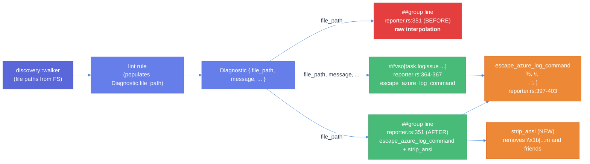
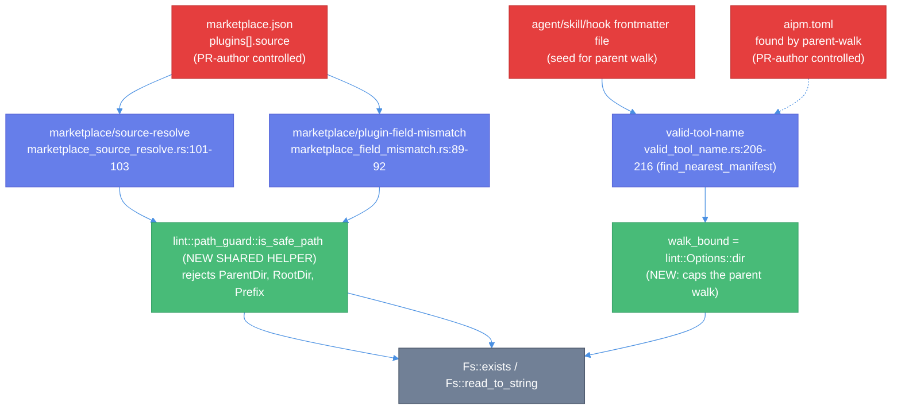
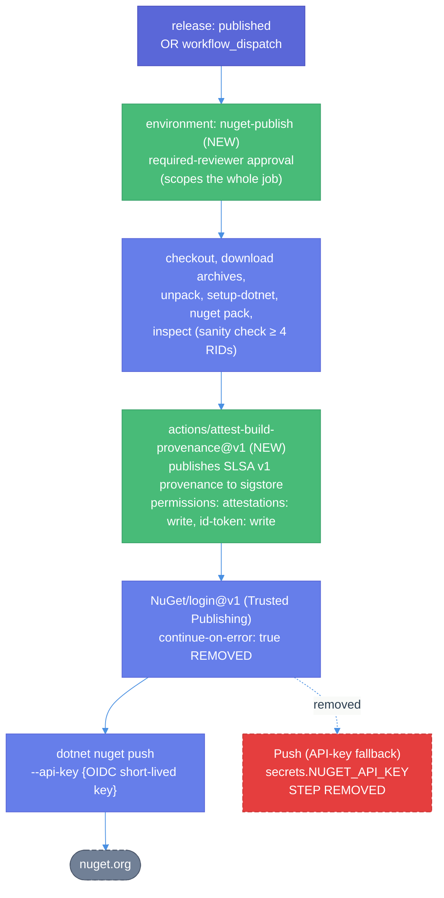

# Security review findings (issue #793) — Technical Design Document

| Document Metadata      | Details                                                                        |
| ---------------------- | ------------------------------------------------------------------------------ |
| Author(s)              | Sean Larkin                                                                    |
| Status                 | Draft (WIP)                                                                    |
| Team / Owner           | aipm core / Sean Larkin                                                        |
| Created / Last Updated | 2026-05-05 / 2026-05-05                                                        |
| Tracking issue         | [#793](https://github.com/TheLarkInn/aipm/issues/793)                          |
| Backing research       | [`research/tickets/2026-05-05-0793-security-review-findings.md`](../research/tickets/2026-05-05-0793-security-review-findings.md) |
| Repository at design   | HEAD `2defa916bba5e1a654ded2b64d5ab0bd32f746cd` on `main`                      |

## 1. Executive Summary

Issue [#793](https://github.com/TheLarkInn/aipm/issues/793) is a security review filed during customer rollout of `aipm lint`. Three findings are confirmed at HEAD and all reproduce identically to the cited audit commit. This RFC specifies a single combined fix:

1. **HIGH** — `crates/libaipm/src/lint/reporter.rs:351` writes `##[group]aipm lint: {file_path}` without escaping. A PR-author-controlled file path containing `\r`/`\n` injects arbitrary Azure DevOps logging commands. The fix routes the path through the existing `escape_azure_log_command` helper plus a new ANSI-stripping pass.
2. **MEDIUM** — Three lint rules (`marketplace_source_resolve`, `marketplace_field_mismatch`, `valid_tool_name`) join PR-controlled values into filesystem paths without `..`/absolute-path containment checks. The fix promotes `lint::rules::import_resolver::is_path_safe` to a shared lint-layer helper and applies it at every flagged sink, plus caps `valid_tool_name`'s parent-walk at `lint::Options::dir`.
3. **MEDIUM** — `.github/workflows/release-nuget.yml` retains a `NUGET_API_KEY` fallback alongside OIDC trusted publishing, allows unguarded `workflow_dispatch`, and produces no independent attestation. The fix removes the fallback (and the OIDC step's `continue-on-error`), binds `workflow_dispatch` to a protected environment with required reviewers, and adds `actions/attest-build-provenance` to publish SLSA v1 build provenance.

Single spec, single PR, single release train. Treated as a regular bug fix — no separate advisory.

## 2. Context and Motivation

### 2.1 Current State

**Reporter (Finding 1).** `aipm lint --reporter ci-azure` writes one line type without sanitization:

```
##[group]aipm lint: {Diagnostic.file_path.display()}    <-- raw
```

The same path passes through `escape_azure_log_command` one line later for the `##vso[task.logissue …;sourcepath=…]` body. The header escape-helper exists; it just isn't called at line 351. See [research §Finding 1](../research/tickets/2026-05-05-0793-security-review-findings.md#finding-1--group-line-in---reporter-ci-azure-interpolates-file_path-raw).

**Lint rules (Finding 2).** All three rules implement the `Rule` trait at [`crates/libaipm/src/lint/rule.rs:16-41`](https://github.com/TheLarkInn/aipm/blob/2defa916bba5e1a654ded2b64d5ab0bd32f746cd/crates/libaipm/src/lint/rule.rs#L16-L41) and consume PR-controlled JSON/TOML content via `Fs::read_to_string`. Each builds a destination path with `Path::join` and calls `fs.exists` or `fs.read_to_string` on the result, with no containment guard. The `is_path_safe` helper exists but is currently scoped to `lint::rules::import_resolver` and isn't reused. See [research §Finding 2](../research/tickets/2026-05-05-0793-security-review-findings.md#finding-2--lint-rules-construct-paths-from-pr-controlled-inputs-without-containment).

**Publish workflow (Finding 3).** OIDC trusted publishing is correctly wired (`NuGet/login@v1` mints an ephemeral key); however the OIDC step has `continue-on-error: true`, and a sibling step uses `secrets.NUGET_API_KEY` whenever the OIDC outcome is anything other than `success`. `workflow_dispatch` accepts a tag input from any actor with workflow-write permission, with no environment reviewer gate. No build-provenance attestation is produced. See [research §Finding 3](../research/tickets/2026-05-05-0793-security-review-findings.md#finding-3--release-nugetyml-retains-long-lived-secret-fallback-no-signing-no-environment-gate).

### 2.2 The Problem

| Finding | User Impact | Business Impact | Technical Debt |
|---|---|---|---|
| 1 | Any PR author who can land a file with `\n` in its name (legal on Linux/macOS) injects ADO logging commands into the build log of every consumer using `--reporter ci-azure`. Available commands include `task.setvariable`, `task.uploadfile`, `task.prependpath`, `artifact.upload`. | Customer rollout would document this as an accepted risk; a fix removes the carve-out. | Two helpers and one call site disagree about which strings need escaping — a class of bug, not a one-off. |
| 2 | A `source: "../../../etc/passwd"` in `marketplace.json` directs lint to read outside the checkout. On reused 1ES Hosted Pool agents, prior jobs' artefacts may be present in the agent home dir. | Lint output is the only side channel today; the impact is information disclosure, not RCE. | The pattern of "join PR-controlled string with literal directory and call `fs.exists`" is replicated three times without a shared guard. |
| 3 | A leaked `NUGET_API_KEY` bypasses the trusted-publishing gate; an unattended `workflow_dispatch` publishes whatever tag the caller supplies. The `.nupkg` carries no producer signature for downstream verification. | Consumers cannot independently verify the integrity of the published package. | OIDC and the long-lived secret coexist by design; they should not. |

The PRD-equivalent for this work is the issue body itself plus the [research backing](../research/tickets/2026-05-05-0793-security-review-findings.md).

## 3. Goals and Non-Goals

### 3.1 Functional Goals

- [ ] **G1.** `##[group]` line in `CiAzure::report` cannot inject a second logging command. Specifically: a `Diagnostic.file_path` containing `\n`, `\r`, `]`, `;`, `%`, or ANSI CSI sequences produces exactly one line of output starting with `##[group]aipm lint:` and contains no second logging command on any subsequent byte until the corresponding `##[endgroup]`.
- [ ] **G2.** `--reporter ci-github` output is verified to already be safe; a regression unit test exercises a `\n`-containing file path.
- [ ] **G3.** A new shared lint-layer helper module gates path joins from PR-controlled inputs in `marketplace_source_resolve`, `marketplace_field_mismatch`, and `valid_tool_name`. A path containing `..`, an absolute root, or a Windows prefix is rejected before any `fs.exists` / `fs.read_to_string` call.
- [ ] **G4.** `valid_tool_name`'s parent-walk for `aipm.toml` does not ascend above `lint::Options::dir`.
- [ ] **G5.** Containment violations reuse each rule's existing diagnostic id; no new rule-id surface.
- [ ] **G6.** `release-nuget.yml` removes the `NUGET_API_KEY` fallback step, removes `continue-on-error: true` on the OIDC step, binds the `publish` job to a protected GitHub `environment:` with required reviewers, and emits SLSA v1 build provenance via `actions/attest-build-provenance@v1`.
- [ ] **G7.** New BDD feature file `tests/features/lint/path-containment.feature` covers 4–6 scenarios spanning Findings 1 and 2.
- [ ] **G8.** All four CI gates pass with zero warnings: `cargo build --workspace`, `cargo test --workspace`, `cargo clippy --workspace -- -D warnings`, `cargo fmt --check` (per [`CLAUDE.md`](../CLAUDE.md)).
- [ ] **G9.** Branch coverage stays ≥ 89% per `cargo +nightly llvm-cov` (per [`CLAUDE.md`](../CLAUDE.md)).
- [ ] **G10.** The NuGet trusted-publisher subject-claim binding is verified out-of-band by the author and the values are recorded in this spec before merge.

### 3.2 Non-Goals (Out of Scope)

- [ ] **N1.** We will NOT extend the audit beyond the three rules cited in #793 (plus a sanity check that `broken_paths.rs:64-67` still applies). A workspace-wide audit of every lint rule that joins PR-controlled paths is a follow-up.
- [ ] **N2.** We will NOT add ESRP signing in this RFC. Build-provenance attestation via sigstore is the chosen single mechanism. ESRP can be added later.
- [ ] **N3.** We will NOT change `format_azure_logissue_body`'s "compose then escape once" semantics. Legitimate `;` in `help_url` continues to encode to `%3B`; ADO renders the escaped form readably.
- [ ] **N4.** We will NOT introduce a new `Fs::canonicalize` trait method. The chosen containment helper operates on the raw path string before any join, not on a canonicalized form.
- [ ] **N5.** We will NOT introduce new diagnostic rule IDs (e.g. `marketplace/source-traversal`). Rejected paths reuse the rule's existing id with an updated message.
- [ ] **N6.** We will NOT modify `release.yml`, `release-plz.yml`, or `update-latest-release.yml`. Only `release-nuget.yml` is in scope.
- [ ] **N7.** We will NOT file a CVE or GHSA. Issue #793 is already public; the exploit requires PR-author write access.
- [ ] **N8.** We will NOT add a staging NuGet feed or `--dry-run` mode in this RFC.

## 4. Proposed Solution (High-Level Design)

### 4.1 System Architecture Diagrams

#### Finding 1 — Reporter data flow (current vs. proposed)



The change in scope is the single-arrow rewrite: `GroupBefore` → `GroupAfter`. ANSI stripping is a new helper used only at the header sink. Body composition (`format_azure_logissue_body`) is unchanged.

#### Finding 2 — Lint rule path-construction with new shared helper



The new `lint::path_guard` module is a tiny relocation of the existing `is_path_safe` from `lint::rules::import_resolver`. Three rules become its first three reusers; the existing `Oversized`/`import_resolver` callers move to the new path.

#### Finding 3 — Publish workflow (current vs. proposed)



Net workflow surface change: one step removed, one step added, one `continue-on-error` removed, one `environment:` added. Permissions block adds `attestations: write`.

### 4.2 Architectural Pattern

- **Finding 1** — *Output sanitization at the sink.* Every line type written by `CiAzure::report` must pass its untrusted fields through an escape helper appropriate to the line's syntax. The fix completes this pattern at the only line that bypasses it.
- **Finding 2** — *Input validation at the trust boundary.* PR-controlled strings are validated *as strings* before participating in any `Path::join`. Validation is centralized in one helper and reused.
- **Finding 3** — *Defence in depth for publishing.* Authentication (OIDC) + authorization (environment reviewer) + integrity (SLSA provenance). No long-lived shared secret.

### 4.3 Key Components

| Component | Responsibility | Location | Change |
|---|---|---|---|
| `escape_azure_log_command` | Sanitize `%`, `\r`, `\n`, `;`, `]` for ADO log commands | `crates/libaipm/src/lint/reporter.rs:397-403` | Unchanged |
| `strip_ansi` (new) | Remove ANSI CSI sequences before `escape_azure_log_command` | `crates/libaipm/src/lint/reporter.rs` (new private fn) | New |
| `CiAzure::report` | Emit ADO log commands | `crates/libaipm/src/lint/reporter.rs:339-380` | One call site updated (`:351`) |
| `lint::path_guard` (new module) | Shared path-containment helper | `crates/libaipm/src/lint/path_guard.rs` (new) | New file |
| `lint::rules::import_resolver` | Existing user of `is_path_safe` | `crates/libaipm/src/lint/rules/import_resolver.rs` | Update import to `lint::path_guard` |
| `marketplace_source_resolve` | `marketplace.json source` resolution | `crates/libaipm/src/lint/rules/marketplace_source_resolve.rs:101-103` | Add guard call |
| `marketplace_field_mismatch` | `marketplace.json` ↔ `plugin.json` reconciliation | `crates/libaipm/src/lint/rules/marketplace_field_mismatch.rs:89-92` | Add guard call |
| `valid_tool_name::find_nearest_manifest` | Parent-walk for `aipm.toml` | `crates/libaipm/src/lint/rules/valid_tool_name.rs:206-216` | Take a stop-dir parameter; cap walk at `Options::dir` |
| `release-nuget.yml` | NuGet publish workflow | `.github/workflows/release-nuget.yml` | Remove fallback step, remove `continue-on-error`, add `environment:`, add `actions/attest-build-provenance` |
| `tests/features/lint/path-containment.feature` (new) | BDD coverage | `tests/features/lint/path-containment.feature` | New file |

## 5. Detailed Design

### 5.1 API Interfaces

#### 5.1.1 New module `lint::path_guard`

A new file at `crates/libaipm/src/lint/path_guard.rs`. The module is `pub(crate)` to the `libaipm` crate and re-exported via `crate::lint`.

```rust
//! Shared path-containment guard for lint rules that join paths from
//! PR-author-controlled file content. Validates path strings *before*
//! any Path::join, rejecting parent-dir traversal, absolute roots, and
//! Windows prefixes.
//!
//! Existing user: lint::rules::import_resolver (legacy is_path_safe
//! moved here in #793). New users: marketplace_source_resolve,
//! marketplace_field_mismatch.

use std::path::{Component, Path};

/// Returns `true` if every component of `path` is `CurDir` or `Normal`.
/// Returns `false` when any component is `ParentDir`, `RootDir`, or
/// `Prefix(_)` — i.e. when the path could escape its base directory
/// after a `Path::join`.
pub(crate) fn is_safe_path(path: &str) -> bool {
    Path::new(path)
        .components()
        .all(|c| !matches!(c, Component::ParentDir | Component::RootDir | Component::Prefix(..)))
}
```

Public surface inside `libaipm`: a single `pub(crate) fn`. No structs, no traits, no errors. The signature is identical to the existing `is_path_safe` at [`lint/rules/import_resolver.rs:66-71`](https://github.com/TheLarkInn/aipm/blob/2defa916bba5e1a654ded2b64d5ab0bd32f746cd/crates/libaipm/src/lint/rules/import_resolver.rs#L66-L71); the only change is location and visibility.

`crates/libaipm/src/lint/mod.rs` adds `pub(crate) mod path_guard;`. `lint::rules::import_resolver`'s local copy is removed; its two call sites at `:120` and `:129` switch to `crate::lint::path_guard::is_safe_path`.

#### 5.1.2 New helper `lint::reporter::strip_ansi`

A new private function in `reporter.rs`:

```rust
/// Replaces ANSI CSI sequences (`\x1b[...m` and friends) with the empty
/// string so they cannot reach `##[group]` headers in the ci-azure
/// reporter, where ADO renders log lines verbatim.
fn strip_ansi(s: &str) -> String { /* … */ }
```

Implementation strategy: replace any byte sequence matching `\x1b[<bytes>` followed by `0x40..=0x7E` (the ANSI CSI final-byte range). A small hand-rolled scanner is preferred over pulling in a new dependency, since the input is already small (a single file path). The function is only called at the `##[group]` sink at `:351`; the body composition path remains unchanged.

#### 5.1.3 Updated rule signatures

Two rules change their internal helper signatures to take a stop-dir; the public `Rule::check_file` signature is unchanged.

**`valid_tool_name::find_nearest_manifest`** at [`valid_tool_name.rs:206-216`](https://github.com/TheLarkInn/aipm/blob/2defa916bba5e1a654ded2b64d5ab0bd32f746cd/crates/libaipm/src/lint/rules/valid_tool_name.rs#L206-L216) gains a `stop_dir: &Path` parameter:

```rust
fn find_nearest_manifest(
    file_path: &Path,
    stop_dir: &Path,        // NEW: lint::Options::dir
    fs: &dyn Fs,
) -> Option<PathBuf> {
    let mut current = file_path.parent();
    while let Some(dir) = current {
        let candidate = dir.join("aipm.toml");
        if fs.exists(&candidate) {
            return Some(candidate);
        }
        if dir == stop_dir { return None; }    // NEW: cap the ascent
        current = dir.parent();
    }
    None
}
```

The caller in `nearest_declared_engines` at [`valid_tool_name.rs:188-200`](https://github.com/TheLarkInn/aipm/blob/2defa916bba5e1a654ded2b64d5ab0bd32f746cd/crates/libaipm/src/lint/rules/valid_tool_name.rs#L188-L200) gets the stop-dir from the rule's `check_file`. Since `Rule::check_file(&self, file_path: &Path, fs: &dyn Fs)` has no access to `lint::Options`, we extend the dispatcher.

**Two implementation sub-options for surfacing `Options::dir` to the rule:**

- **Sub-option A (selected):** Add a `stop_dir: &Path` field to a small per-invocation context, wired through `apply_rule_diagnostics` at [`lint/mod.rs:64-84`](https://github.com/TheLarkInn/aipm/blob/2defa916bba5e1a654ded2b64d5ab0bd32f746cd/crates/libaipm/src/lint/mod.rs#L64-L84). Only `valid_tool_name` reads it; other rules ignore it.
- **Sub-option B:** Extend the `Rule` trait with a new `check_file_in(...)` method that takes `&Options`. Wider blast radius — every rule's signature changes.

Sub-option A is preferred. It introduces one trait extension localised to `valid_tool_name` and avoids touching every rule. Concretely, the `Rule` trait gains an *optional* `check_file_in(&self, file_path, lint_dir, fs)` method with a default impl that delegates to `check_file`; only `ValidToolName` overrides it.

#### 5.1.4 Workflow YAML changes (`.github/workflows/release-nuget.yml`)

| Change | Lines today | After |
|---|---|---|
| Job-level `permissions:` | `:36-38` (`contents: read`, `id-token: write`) | Add `attestations: write` |
| Job-level `environment:` | absent | Add `environment: nuget-publish` (new protected env) |
| OIDC step `continue-on-error: true` | `:165` | Remove |
| New `actions/attest-build-provenance` step | n/a | New step before the OIDC push, runs against `out/*.nupkg` |
| API-key fallback step | `:178-185` | Remove entire step |

The protected environment `nuget-publish` is configured in repo settings (Settings → Environments) with a required-reviewer rule. Configuration is described in the rollout section.

#### 5.1.5 No change to public CLI

`aipm lint --reporter ci-azure` keeps the same flag surface ([`crates/aipm/src/main.rs:175-177`](https://github.com/TheLarkInn/aipm/blob/2defa916bba5e1a654ded2b64d5ab0bd32f746cd/crates/aipm/src/main.rs#L175-L177)). No new flags. No new diagnostic IDs.

### 5.2 Data Model / Schema

This RFC introduces no new persistent data, no schema changes, and no new `aipm.toml` fields. The only "schema-ish" change is the GitHub repo's environment configuration:

**Environment: `nuget-publish`** (configured in GitHub repo settings, not in the YAML)

| Setting | Value |
|---|---|
| Required reviewers | At minimum: `@TheLarkInn` (single approver acceptable for a one-maintainer project; expand if/when team grows) |
| Wait timer | 0 minutes |
| Deployment branches | `main` only (release tags are reachable from `main`) |
| Environment secrets | none — `secrets.NUGET_API_KEY` is removed from this workflow's surface |

`secrets.NUGET_API_KEY` itself is left in repo-level secrets (do not delete; it may be referenced by other workflows or rotation tooling). It is simply no longer referenced by `release-nuget.yml`.

### 5.3 Algorithms and State Management

#### 5.3.1 Reporter escape pipeline (Finding 1)

For every diagnostic the `CiAzure` reporter writes, the `file_path` value flows through:

```
file_path: PathBuf
  └── .display() → &str-like
      ├── group line (NEW):  strip_ansi → escape_azure_log_command → writeln!
      └── ##vso line:         escape_azure_log_command → writeln!
```

`strip_ansi` runs *before* `escape_azure_log_command` so the percent-encoded form of any escape's bytes (e.g. `%1B`) is never misread as a control sequence by ADO. The composition is associative for the supported alphabet — `escape_azure_log_command(strip_ansi(s))` == `strip_ansi(escape_azure_log_command(s))` only if `s` contains no ANSI sequence that includes `%`/`\r`/`\n`/`;`/`]` in its parameter bytes; the strict "strip ANSI first" ordering avoids ambiguity.

#### 5.3.2 Path-guard placement (Finding 2)

Each of the three rules gains exactly one guard call:

**`marketplace_source_resolve.rs:101-103` — before:**
```rust
let resolved = ai_dir.join(source.trim_start_matches("./"));
if !fs.exists(&resolved) { /* emit */ }
```

**After:**
```rust
let trimmed = source.trim_start_matches("./");
if !crate::lint::path_guard::is_safe_path(trimmed) {
    // Reuse existing diagnostic id with an updated message that
    // notes the path was rejected for traversal.
    out.push(diag_for_unresolvable(plugin_name, source, idx, mp_path));
    continue;
}
let resolved = ai_dir.join(trimmed);
if !fs.exists(&resolved) { /* emit (existing path) */ }
```

The diagnostic id stays `marketplace/source-resolve` per Q7. The message clarifies traversal rejection while remaining a member of the same rule family for CI rule allow/denylists.

**`marketplace_field_mismatch.rs:89-92`** — same shape: guard `source` before constructing `pj_path`.

**`valid_tool_name.rs` — `find_nearest_manifest`** is purely structural (path-guard not applicable; it builds paths from `Path::parent()` rather than from string content). The fix here is the `stop_dir` cap described in §5.1.3.

#### 5.3.3 Publish workflow state machine (Finding 3)

```
 Trigger (release:published OR workflow_dispatch)
   │
   ▼
 Environment gate (`nuget-publish`) ──► waits for human approval
   │
   ▼
 Build & pack ──► sanity check ──► attest-build-provenance
   │                                   │
   │                                   ▼ (publishes provenance to sigstore;
   │                                      attaches to GitHub release)
   ▼
 NuGet/login@v1 (OIDC) ──fail──► JOB FAILS (no fallback; no continue-on-error)
   │
   ▼
 dotnet nuget push --api-key {OIDC short-lived key}
   │
   ▼
 success → workflow ends
```

Behaviours that disappear: silent fallback to `secrets.NUGET_API_KEY`; unattended `workflow_dispatch` publish; tagless OIDC step success-handling. Behaviours that appear: human-approval pause before any publish action; sigstore attestation that downstream consumers can verify with `gh attestation verify`.

#### 5.3.4 ci-github regression check (G2)

A new test in `crates/libaipm/src/lint/reporter.rs`'s `tests` module calls `CiGitHub.report` against an `Outcome` containing one `Diagnostic` with `file_path` = `PathBuf::from(".ai/p/inject\nbar/SKILL.md")`. Asserts that the output contains exactly one `::warning` or `::error` line and that `\n` is encoded as `%0A` (per `escape_github_prop` at [`reporter.rs:383-389`](https://github.com/TheLarkInn/aipm/blob/2defa916bba5e1a654ded2b64d5ab0bd32f746cd/crates/libaipm/src/lint/reporter.rs#L383-L389)). No production-code change is expected.

## 6. Alternatives Considered

| Option | Pros | Cons | Reason for Rejection |
|---|---|---|---|
| **F1-A**: minimal patch — apply `escape_azure_log_command` to the `##[group]` line, defer ANSI | Smallest diff; fastest review | Leaves ANSI escape pass-through that the issue text explicitly flags as worth handling | The author chose to handle ANSI in the same change to avoid a second round-trip |
| **F1-B**: stricter header-specific helper that replaces all `< 0x20` bytes with `U+FFFD` | Maximally defensive; one helper per sink shape | New helper adds API surface; diverges from the existing helpers' percent-encoding style | Reuse + targeted ANSI strip is sufficient for the threat model and stays consistent with existing helpers |
| **F2-A**: reuse `path_security::ValidatedPath::new` | Existing tested API; rejects encoded `%2e%2e` and null bytes | `ValidatedPath` was scoped for plugin-source acquisition (`acquirer.rs`/`spec.rs`); semantic overload | The chosen helper is a closer fit to the lint-layer need |
| **F2-B**: add `Fs::canonicalize` + prefix check | Catches symlink escapes too | New trait method; new mock impls everywhere; touches the FS trait used by every rule | Symlink escape is not in the threat model the issue cites; `is_safe_path` covers the cited inputs |
| **F2-C**: inline checks per rule | Smallest diff | Pattern repeated 3+ times; future regressions likely | Promoting `is_safe_path` to a shared lint helper avoids drift |
| **F3-A**: feature-flag the `NUGET_API_KEY` fallback via `workflow_dispatch` boolean input | Preserves recovery path | Long-lived secret remains reachable; OIDC-vs-secret split stays in the YAML | Removing the fallback eliminates the bypass entirely; recovery uses environment-gated dispatch |
| **F3-B**: ESRP signing only | Microsoft-internal trust | Requires onboarding; signing infra outside this repo | Sigstore attestation is GitHub-native and free; ESRP can be added later if required |
| **F3-C**: ESRP + sigstore | Strongest posture | ESRP onboarding is a separate workstream | Out of scope for this RFC (N2) |
| **Three independent specs/PRs** | Per-finding focus | Splits the security review narrative; three review cycles | One spec, one PR is the chosen packaging (Q1) |

## 7. Cross-Cutting Concerns

### 7.1 Security and Privacy

The RFC's primary axis. Concrete posture changes:

- **Authentication:** Unchanged for the lint binary. For `release-nuget.yml`, OIDC trusted publishing becomes the *only* authentication path; no shared long-lived secret remains in the workflow's reach.
- **Authorization:** New environment-reviewer gate on `release-nuget.yml`'s `publish` job. Any path that runs the publish — release-triggered or manual dispatch — pauses until a human approves.
- **Data Protection:** Lint diagnostics carry no PII; no change. The published `.nupkg` content is unchanged; what changes is the addition of an external sigstore attestation that downstream consumers can verify.
- **Threat Model coverage:**
  - *PR author with workspace write access lands a malicious filename* — addressed by F1.
  - *PR author lands `marketplace.json` / `aipm.toml` content with traversal payload* — addressed by F2.
  - *Leaked `NUGET_API_KEY`* — addressed by F3a (key removed from workflow's surface).
  - *Compromised actor with workflow-write permission triggers `workflow_dispatch`* — addressed by F3b (environment reviewer gate).
  - *Tampered build artefact reaches nuget.org* — addressed by F3c (sigstore attestation).
- **What this RFC does NOT cover:**
  - Symlink-escape (out of scope per N4).
  - The full corpus of lint rules beyond the three flagged (out of scope per N1).
  - ESRP-specific Microsoft trust chain (out of scope per N2).

### 7.2 Observability Strategy

- **Metrics:** None added. This RFC does not change runtime metrics.
- **Tracing:** Not applicable.
- **Diagnostics emitted by lint rules:**
  - `marketplace/source-resolve` and `marketplace/plugin-field-mismatch` continue to emit at their existing rule ids; the message string changes when the rejection is for traversal.
  - `valid-tool-name` continues to emit at its existing rule id; severity selection logic at [`valid_tool_name.rs:106-117`](https://github.com/TheLarkInn/aipm/blob/2defa916bba5e1a654ded2b64d5ab0bd32f746cd/crates/libaipm/src/lint/rules/valid_tool_name.rs#L106-L117) is unaffected.
- **Workflow-level observability:**
  - `actions/attest-build-provenance` writes to GitHub's public attestations log (visible at `https://github.com/TheLarkInn/aipm/attestations`).
  - Environment approval requests appear in the run UI and create a notification for required reviewers.
  - Removing `continue-on-error: true` makes OIDC failures highly visible (the workflow goes red).
- **Alerting:** Existing GitHub Actions failure notifications cover the workflow. No additional PagerDuty / paging integration is added.

### 7.3 Scalability and Capacity Planning

Not applicable. This RFC modifies in-memory string handling in a CLI binary, a small number of file-system probes per lint run, and CI workflow YAML. No service traffic, no database, no storage growth. The reporter changes add at most a single linear scan over `Diagnostic.file_path` per emitted diagnostic — negligible relative to the cost of running each lint rule.

## 8. Migration, Rollout, and Testing

### 8.1 Deployment Strategy

Single combined PR (per Q1). All three findings ship on the same release train (per Q2). No feature flags, no shadow mode, no phased rollout — the changes are bug fixes against well-defined sinks.

Rollout sequence inside the single PR:

1. **Pre-merge — author tasks** (must complete before "Ready for review"):
   - [ ] Verify NuGet trusted-publisher subject-claim binding in NuGet.org publisher settings (G10). Record actual values in this spec under §10.
   - [ ] Configure GitHub `nuget-publish` environment with required-reviewer rule. **Deployment branches and tags policy:** "Selected branches and tags" — must allow tag pattern `aipm-v*` (release-triggered publishes run on `refs/tags/aipm-v*`, NOT `refs/heads/main`; a `main`-only restriction would block every automatic publish). Optionally also allow branch `main` for `workflow_dispatch` runs originating from the default branch.
   - [ ] Confirm `secrets.NUGET_USERNAME` is still populated (used by `NuGet/login@v1`).
2. **PR contents:**
   - [ ] All Rust source changes (Findings 1 + 2)
   - [ ] BDD feature file `tests/features/lint/path-containment.feature`
   - [ ] Workflow YAML changes (Finding 3)
   - [ ] Spec file (this document) updated with confirmed TP-binding values
   - [ ] Research document updated `last_updated` and a `last_updated_note` referencing this spec
3. **CI gates** (per [`CLAUDE.md`](../CLAUDE.md)):
   - [ ] `cargo build --workspace` — clean
   - [ ] `cargo test --workspace` — all tests pass. Note: the new `tests/features/lint/path-containment.feature` is documentation-form Gherkin (matching the convention of `tests/features/lint/valid-tool-name.feature` and `tests/features/security/path-traversal.feature`) and is NOT wired into the cucumber runner at `crates/libaipm/tests/bdd.rs` (which today filters to `tests/features/manifest/*` only). The behaviours it specifies are exercised by the per-rule Rust unit tests added in §8.3.
   - [ ] `cargo clippy --workspace -- -D warnings` — clean
   - [ ] `cargo fmt --check` — clean
   - [ ] `cargo +nightly llvm-cov` branch coverage ≥ 89%
4. **Post-merge:**
   - [ ] Release-plz opens the next release PR per its normal cadence; merge that PR cuts the tag.
   - [ ] First post-merge `release-nuget.yml` run will pause for environment approval. Approve it; verify (i) the OIDC publish succeeds without invoking the (now-deleted) fallback, (ii) the build-provenance attestation appears at `https://github.com/TheLarkInn/aipm/attestations`, (iii) no `secrets.NUGET_API_KEY` reference remains in the run logs.
   - [ ] Reply to issue #793 with the merged PR URL and a one-line summary per finding.

### 8.2 Data Migration Plan

None. No persistent data is rewritten or backfilled.

### 8.3 Test Plan

#### Unit tests (Rust)

- **Finding 1 / Reporter (`crates/libaipm/src/lint/reporter.rs`):**
  - [ ] `ci_azure_group_line_escapes_newline_in_file_path` — `Diagnostic.file_path` containing `\n` produces a single `##[group]` line; the `\n` is encoded.
  - [ ] `ci_azure_group_line_escapes_carriage_return_in_file_path` — same for `\r`.
  - [ ] `ci_azure_group_line_strips_ansi_csi_in_file_path` — `\x1b[31m` and friends are removed.
  - [ ] `ci_azure_group_line_escapes_combined_ansi_and_newline` — combined input.
  - [ ] `strip_ansi_removes_csi_sequences` — direct unit test of the new helper.
  - [ ] `strip_ansi_passthrough_for_plain_text` — non-ANSI input is unchanged.
  - [ ] `ci_github_group_handles_newline_in_file_path` (G2 regression test) — verifies `escape_github_prop` already encodes `\n` in `CiGitHub.report` output.
- **Finding 2 / `lint::path_guard`:**
  - [ ] Direct migration of the four existing `is_path_safe` tests at [`lint/rules/import_resolver.rs:215-230`](https://github.com/TheLarkInn/aipm/blob/2defa916bba5e1a654ded2b64d5ab0bd32f746cd/crates/libaipm/src/lint/rules/import_resolver.rs#L215-L230) to the new module.
  - [ ] Add `is_safe_path_rejects_windows_prefix` if not already covered.
- **Finding 2 / `marketplace_source_resolve`:**
  - [ ] `traversal_in_source_emits_existing_diagnostic_no_fs_call` — `source: "../../etc/passwd"` rejected before any `fs.exists` invocation.
  - [ ] `absolute_path_in_source_rejected` — `source: "/etc/passwd"`.
  - [ ] `windows_prefix_in_source_rejected` (`#[cfg(windows)]` not required; `Component::Prefix` parses cross-platform on `&Path` from a `&str` via `\\?\C:\…`).
- **Finding 2 / `marketplace_field_mismatch`:**
  - [ ] Same three traversal cases.
- **Finding 2 / `valid_tool_name::find_nearest_manifest`:**
  - [ ] `parent_walk_stops_at_options_dir` — manifest placed *above* the lint root is not found.
  - [ ] `parent_walk_succeeds_inside_options_dir` — manifest at lint root is still found.
  - [ ] `parent_walk_succeeds_at_options_dir_boundary` — manifest *at* the lint root (not above it) is found.

#### Integration tests (Rust)

- **`crates/libaipm/src/lint/mod.rs` `tests` module:**
  - [ ] `lint_marketplace_source_resolve_rejects_traversal_path` — full pipeline against a tempdir with a `marketplace.json` containing `source: "../../foo"`.
  - [ ] `lint_marketplace_field_mismatch_rejects_traversal_path` — analogous.
  - [ ] `lint_valid_tool_name_does_not_walk_above_lint_root` — places `aipm.toml` in the parent of `Options::dir` and verifies the rule's behaviour matches "no manifest found" (warning, not error).

#### BDD (cucumber-rs)

New file `tests/features/lint/path-containment.feature` (per Q14). Scenarios:

```gherkin
@p0 @security
Feature: Lint rules contain PR-author-controlled paths

  Background:
    Given a workspace at "{tmp}"

  Scenario: Marketplace source with parent-dir traversal is rejected
    When I run "aipm lint" against a marketplace.json containing:
      """
      { "plugins": [ { "name": "p", "source": "../../etc/passwd" } ] }
      """
    Then a diagnostic with rule "marketplace/source-resolve" is emitted
    And the linter performs no read or stat outside the workspace

  Scenario: Marketplace source with absolute path is rejected
    When I run "aipm lint" against a marketplace.json containing:
      """
      { "plugins": [ { "name": "p", "source": "/etc/passwd" } ] }
      """
    Then a diagnostic with rule "marketplace/source-resolve" is emitted

  Scenario: Plugin-field mismatch lookup with traversal source is rejected
    When I run "aipm lint" against a marketplace.json containing:
      """
      { "plugins": [ { "name": "p", "source": "../../tmp" } ] }
      """
    Then a diagnostic with rule "marketplace/plugin-field-mismatch" is not emitted
    And the linter performs no read of "/tmp/.claude-plugin/plugin.json"

  Scenario: valid-tool-name does not walk above the lint root
    Given an aipm.toml exists in the parent of the lint root with [package].engines = ["claude"]
    And a frontmatter file in the lint root declares "tools = NotebookEdit"
    When I run "aipm lint" against the lint root
    Then the rule treats the workspace as having no declared engines
    And a "valid-tool-name" warning (not error) is emitted

  Scenario: ci-azure reporter does not allow logging-command injection via file path
    Given a diagnostic for a file path containing a literal newline
    When I render with --reporter ci-azure
    Then the output contains exactly one "##[group]" line and one "##vso[task.logissue" line
    And no second logging command appears on any subsequent byte until "##[endgroup]"
```

**Wiring decision (revised in implementation):** the new feature file is committed as **documentation-form Gherkin only**, matching the convention used by the existing `tests/features/lint/valid-tool-name.feature` and `tests/features/security/path-traversal.feature` — neither of which is wired into the cucumber runner at `crates/libaipm/tests/bdd.rs:984` (the runner today filters to `tests/features/manifest/*` only). No new step definitions are added.

The behaviours specified by these Gherkin scenarios are exercised by the Rust unit tests listed earlier in §8.3 (per-rule `tests` modules in `marketplace_source_resolve.rs`, `marketplace_field_mismatch.rs`, `valid_tool_name.rs`, and `reporter.rs`). Wiring lint/security feature files into the BDD harness would broaden the scope of #793 beyond its remit; a follow-up issue can pick that up if desired.

#### Workflow validation

- [ ] **Static check:** `gh actions-syntax-check` (or `actionlint`) on the modified `release-nuget.yml` — the change must parse and the YAML must be schema-valid.
- [ ] **Dry test of OIDC failure path:** intentionally break OIDC (e.g. by temporarily setting `secrets.NUGET_USERNAME` empty) on a feature branch; verify the workflow now fails (rather than falling back). Revert.
- [ ] **First production run after merge:** verify environment approval prompt appears; verify `actions/attest-build-provenance` step succeeds; verify the produced attestation is verifiable with `gh attestation verify out/aipm.<version>.nupkg --owner TheLarkInn`.

#### Snapshot tests

- [ ] Update `crates/libaipm/src/lint/snapshots/libaipm__lint__reporter__tests__ci_azure_sample_outcome_snapshot.snap` if the change to `:351` alters output for the existing `sample_outcome` fixture. Expected: no change (the fixture's file paths contain no special characters), but verify with `cargo test` and accept any drift via `cargo insta review` per the workspace convention.

## 9. Open Questions / Unresolved Issues

This section is intentionally short — most open questions surfaced during the research walkthrough were resolved before drafting (see [research §Open Questions](../research/tickets/2026-05-05-0793-security-review-findings.md#open-questions) for the full list and the AskUserQuestion answers that resolved them).

Remaining items, all to be resolved before the spec moves from Draft to Approved:

- [ ] **OQ1 (G10):** NuGet trusted-publisher subject-claim binding — verify in NuGet.org publisher settings and record the actual values below in §10. Specifically: confirm `repository_owner = TheLarkInn`, `repository = aipm`, and the `ref` constraint matches the release-tag pattern `refs/tags/aipm-v*`.
- [ ] **OQ2:** Confirm GitHub-side environment configuration. `nuget-publish` environment must exist with required-reviewer rule and a `main`-only deployment-branch restriction before the PR merges (otherwise the first post-merge run would auto-publish).
- [ ] **OQ3:** Confirm whether `actions/attest-build-provenance@v1` is on the repo's allowed-actions list (Settings → Actions → General). If a repo-level allowlist is enforced, add it.
- [ ] **OQ4:** Decide whether to also remove `secrets.NUGET_API_KEY` from repo-level secrets after this lands. Recommendation: leave for at least one release cycle in case rollback is needed; remove in a follow-up.

## 10. Appendix — Verified facts to record before merge

> *Author fills in before approval; left as placeholders here.*

- **NuGet.org Trusted Publisher binding for `aipm`:**
  - Repository owner: `…`
  - Repository: `…`
  - Ref pattern: `…`
  - Environment binding: `…`
- **GitHub environment `nuget-publish` configuration:**
  - Required reviewers: `…`
  - Deployment branches: `…`
  - Wait timer: `…`
- **`actions/attest-build-provenance` version pinned in workflow:** `…`

## 11. Related research and prior art

Primary backing research:
- [`research/tickets/2026-05-05-0793-security-review-findings.md`](../research/tickets/2026-05-05-0793-security-review-findings.md) — the full code map for all three findings at HEAD `2defa91`.

Reporter / ci-azure prior art:
- [`research/docs/2026-04-20-azure-devops-lint-reporter-parity.md`](../research/docs/2026-04-20-azure-devops-lint-reporter-parity.md) — original ci-azure reporter design; documents the existing escape-helper table this RFC reuses.
- [`research/docs/2026-03-31-110-aipm-lint-architecture-research.md`](../research/docs/2026-03-31-110-aipm-lint-architecture-research.md) — broader lint architecture context.

Path containment prior art:
- [`research/docs/2026-04-12-dry-rust-architecture-audit.md`](../research/docs/2026-04-12-dry-rust-architecture-audit.md) — calls out `ValidatedPath` as "correct and used"; informs the Q6 alternative this RFC rejected (F2-A).
- [`research/docs/2026-04-06-feature-status-audit.md`](../research/docs/2026-04-06-feature-status-audit.md) — confirms `path_security.rs` is implemented and tested.

NuGet publishing prior art:
- [`research/docs/2026-04-22-github-actions-nuget-publish.md`](../research/docs/2026-04-22-github-actions-nuget-publish.md) — closest match to the current `release-nuget.yml` design.
- [`research/docs/2026-04-22-nuget-publishing-pipeline.md`](../research/docs/2026-04-22-nuget-publishing-pipeline.md), [`research/docs/2026-04-22-nuget-native-multi-rid-packaging.md`](../research/docs/2026-04-22-nuget-native-multi-rid-packaging.md), [`research/docs/2026-04-22-ado-pipeline-nuget-consume.md`](../research/docs/2026-04-22-ado-pipeline-nuget-consume.md) — pipeline + packaging context.

Engine / `valid-tool-name` prior art (for the parent-walk in F2):
- [`research/tickets/2026-05-01-510-aipm-toml-engines.md`](../research/tickets/2026-05-01-510-aipm-toml-engines.md) — original ticket covering `agent/valid-tool-name` and `aipm.toml` engines.
- [`research/docs/2026-05-05-aipm-toml-engine-schema.md`](../research/docs/2026-05-05-aipm-toml-engine-schema.md), [`research/docs/2026-05-05-engine-catalog.md`](../research/docs/2026-05-05-engine-catalog.md) — engine schema and catalog used by `valid_tool_name`.
