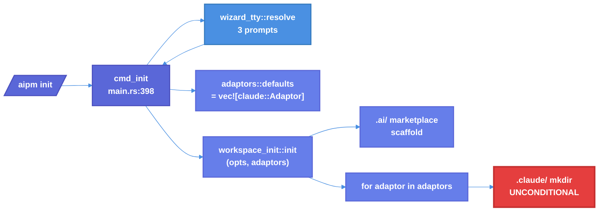
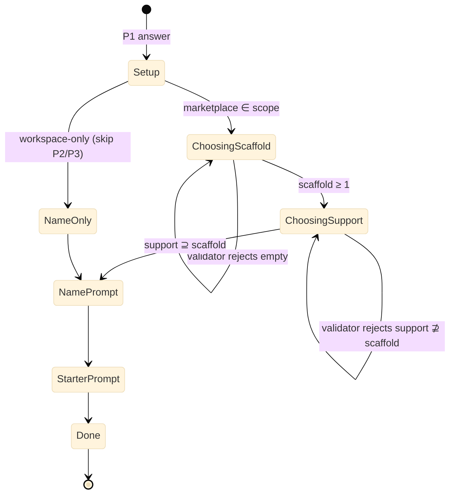

# Engine-Aware `aipm init` Wizard — Technical Design Document / RFC

| Document Metadata      | Details                                                                        |
| ---------------------- | ------------------------------------------------------------------------------ |
| Author(s)              | Sean Larkin                                                                    |
| Status                 | **Implemented** — shipped in PR [#792](https://github.com/TheLarkInn/aipm/pull/792); docs in [#794](https://github.com/TheLarkInn/aipm/pull/794) |
| Team / Owner           | aipm core (TheLarkInn/aipm)                                                    |
| Created / Last Updated | 2026-05-05 / 2026-05-05                                                        |
| Research Source        | [`research/tickets/2026-05-05-0724-init-engine-aware-wizard.md`](../research/tickets/2026-05-05-0724-init-engine-aware-wizard.md) |
| Component Research     | [`research/docs/2026-05-05-init-cli-entry-point.md`](../research/docs/2026-05-05-init-cli-entry-point.md), [`research/docs/2026-05-05-wizard-prompt-flow.md`](../research/docs/2026-05-05-wizard-prompt-flow.md), [`research/docs/2026-05-05-engine-catalog.md`](../research/docs/2026-05-05-engine-catalog.md), [`research/docs/2026-05-05-init-scaffolding-trace.md`](../research/docs/2026-05-05-init-scaffolding-trace.md), [`research/docs/2026-05-05-aipm-toml-engine-schema.md`](../research/docs/2026-05-05-aipm-toml-engine-schema.md) |
| Related Issues         | [#724](https://github.com/TheLarkInn/aipm/issues/724) (this spec), [#510](https://github.com/TheLarkInn/aipm/issues/510) (`engines` field), [#697](https://github.com/TheLarkInn/aipm/issues/697) (`valid-tool-name` lint) |
| Related Specs          | [`specs/2026-03-19-init-tool-adaptor-refactor.md`](2026-03-19-init-tool-adaptor-refactor.md), [`specs/2026-03-22-interactive-init-wizard.md`](2026-03-22-interactive-init-wizard.md), [`specs/2026-04-14-aipm-make-plugin-command.md`](2026-04-14-aipm-make-plugin-command.md), [`specs/2026-05-04-engine-api-schema-source-of-truth.md`](2026-05-04-engine-api-schema-source-of-truth.md) |

## 1. Executive Summary

`aipm init` today unconditionally writes a `.claude/` directory into every project, regardless of whether the team uses Claude Code at all. The wizard never asks about engine; the entire engine-selection surface is one hardcoded line:
`pub fn defaults() -> Vec<Box<dyn ToolAdaptor>> { vec![Box::new(claude::Adaptor)] }`
([`workspace_init/adaptors/mod.rs:13-15`](../crates/libaipm/src/workspace_init/adaptors/mod.rs#L13-L15)). For a Copilot-only team this is — to quote [#724](https://github.com/TheLarkInn/aipm/issues/724) — "confusing."

This RFC proposes an **engine-aware two-tier wizard**: prompt 1 asks which engine(s) to *scaffold for now* (MultiSelect, must pick ≥1); prompt 2 asks which engines the project *supports* (defaults to all, written to `[workspace].engines` only when narrower). A real `copilot::Adaptor` ships in this PR so Copilot CLI is a first-class option (creates `.github/copilot-instructions.md`). The canonical engine identifier `copilot-cli` is renamed to `copilot` across `libaipm-engine-spec`, bumping `META_SCHEMA_VERSION`. `Workspace` gains an `engines: Option<EngineSet>` field with `effective_engines` walking up from package → workspace. `schemas/aipm.toml.schema.json` learns the `engines` property. Existing `.claude/`-asserting tests are pinned with explicit `--engine claude`; new BDD scenarios cover Copilot-only, multi-engine, and zero-scaffold-but-pick-required UX. Orphan `.claude/` directories on existing repos are explicitly out of scope.

## 2. Context and Motivation

### 2.1 Current State

[`research/docs/2026-05-05-init-cli-entry-point.md`](../research/docs/2026-05-05-init-cli-entry-point.md) and [`research/docs/2026-05-05-init-scaffolding-trace.md`](../research/docs/2026-05-05-init-scaffolding-trace.md) document the present flow. Summary:

- **Wizard prompts** ([`crates/aipm/src/wizard.rs:23-73`](../crates/aipm/src/wizard.rs#L23-L73)) — three questions: setup mode (Marketplace / Workspace / Both), marketplace name, starter-plugin yes/no. **No engine prompt.**
- **CLI surface** ([`crates/aipm/src/main.rs:35-64`](../crates/aipm/src/main.rs#L35-L64)) — six flags: `--yes`, `--workspace`, `--marketplace`, `--no-starter`, `--manifest`, `--name`. **No `--engine`.**
- **Library handoff** ([`crates/libaipm/src/workspace_init/mod.rs:51-65`](../crates/libaipm/src/workspace_init/mod.rs#L51-L65)) — `Options { dir, workspace, marketplace, no_starter, manifest, marketplace_name }`. **No engine field.**
- **Adaptor selection** ([`workspace_init/adaptors/mod.rs:13-15`](../crates/libaipm/src/workspace_init/adaptors/mod.rs#L13-L15)) — `defaults()` returns exactly `vec![Box::new(claude::Adaptor)]`. Doc comment: *"Currently only includes Claude Code. Future adaptors (Copilot CLI, OpenCode, etc.) are added here."*
- **Unconditional `.claude/` mkdir** ([`workspace_init/adaptors/claude.rs:26-29`](../crates/libaipm/src/workspace_init/adaptors/claude.rs#L26-L29)):

  ```rust
  let settings_dir = dir.join(".claude");
  let settings_path = settings_dir.join("settings.json");
  fs.create_dir_all(&settings_dir)?;
  ```

  `create_dir_all` runs **before** the change-detection logic; the directory is created even when no `.claude/settings.json` content change is needed.



### 2.2 The Problem

- **User Impact:** Issue [#724](https://github.com/TheLarkInn/aipm/issues/724): *"It feels bad to have a `.claude` folder generated for `aipm init` for a team that never uses `claude`. Just confusing."* A Copilot-only team gets a Claude artifact they didn't ask for and can't easily opt out of.
- **Schema Mismatch:** `Package.engines: Option<EngineSet>` already exists ([`manifest/types.rs:65-83`](../crates/libaipm/src/manifest/types.rs#L65-L83)) and parses correctly, but no `aipm init` writer sets it. The single emission site — the synthetic starter plugin at [`workspace_init/mod.rs:282`](../crates/libaipm/src/workspace_init/mod.rs#L282) — hardcodes `engines = ["claude"]`. The schema affordance has been built but never wired.
- **Adaptor Vacuum:** [`specs/2026-03-19-init-tool-adaptor-refactor.md`](2026-03-19-init-tool-adaptor-refactor.md) deleted the previous Copilot scaffolding and left the `ToolAdaptor` trait expecting future re-implementation. Open Question 3 from that spec — *"Should the CLI auto-detect adaptors or accept a `--tool` flag?"* — is the explicit precursor to #724.
- **Naming Inconsistency:** `Engine::name()` returns `"copilot-cli"`. The `aipm make plugin` flag accepts `"copilot"`. Existing BDD fixtures use both ([`tests/features/registry/engine-validation.feature:13`](../tests/features/registry/engine-validation.feature#L13) uses the legacy `"copilot"`). Without resolution, every new feature touching engines must pick a side and document the asymmetry.
- **Schema-of-Truth Gap:** `schemas/aipm.toml.schema.json` does not declare the `engines` property. IDE autocomplete (per [`research/docs/2026-04-19-aipm-toml-editor-experience.md`](../research/docs/2026-04-19-aipm-toml-editor-experience.md)) cannot help users type a field that's load-bearing for #697 lint behavior.

## 3. Goals and Non-Goals

### 3.1 Functional Goals

- [ ] **G1.** `aipm init` interactively prompts for the **scaffold set** of engines (MultiSelect, must pick ≥1). Selection drives which `ToolAdaptor`s run.
- [ ] **G2.** `aipm init` interactively prompts for the **support set** of engines (MultiSelect, defaults to all known, may be narrowed). Result is written to `[workspace].engines` only when narrower than `Engine::ALL`; otherwise the field is omitted.
- [ ] **G3.** A real `crates/libaipm/src/workspace_init/adaptors/copilot.rs` ships, registered in `defaults()` alongside Claude. Its `apply()` creates `.github/copilot-instructions.md` (templated, marketplace-aware).
- [ ] **G4.** New `--engine <list>` flag on `aipm init` accepts comma-separated engine identifiers (e.g. `--engine claude,copilot`). Drives the scaffold set.
- [ ] **G5.** In `--yes` mode, omitted `--engine` defaults the **scaffold set** to `["copilot"]` only (rationale: §6 Alt-3) and the **support set** to all known engines (manifest field omitted).
- [ ] **G6.** Canonical engine identifier `copilot-cli` is renamed to `copilot` across `crates/libaipm-engine-spec/`. `Engine::CopilotCli` → `Engine::Copilot`. `EngineSet::COPILOT_CLI` → `EngineSet::COPILOT`. `META_SCHEMA_VERSION` is bumped.
- [ ] **G7.** `Workspace` struct gains `engines: Option<EngineSet>` field. New `manifest::effective_engines(pkg, ws)` helper walks up from package → workspace at lookup time.
- [ ] **G8.** `schemas/aipm.toml.schema.json` learns the `engines` property on both `[package]` and `[workspace]`.
- [ ] **G9.** All five existing tests asserting `.claude/settings.json` always exists are updated to pass explicit `--engine claude`. New BDD scenarios cover: Copilot-only, claude+copilot, default-Copilot in `--yes`, narrowed support set.
- [ ] **G10.** Wizard validation rejects support set narrower than the scaffold set (you cannot scaffold an engine your manifest claims it doesn't support).

### 3.2 Non-Goals (Out of Scope)

- [ ] **NG1.** Migrating orphan `.claude/` directories on existing repos. Re-running `aipm init` in a populated tree is governed by the existing pre-checks (`WorkspaceAlreadyInitialized`, `MarketplaceAlreadyExists`); no auto-detection or back-fill.
- [ ] **NG2.** Engines other than `claude` and `copilot`. Future engines (`gemini`, `codex`, OpenCode) are out of scope; the Mechanism (`defaults()` extension + adaptor module) accommodates them.
- [ ] **NG3.** Full feature parity for `copilot::Adaptor`. The MVP creates `.github/copilot-instructions.md` only. No marketplace registration, no `enabledPlugins`, no settings-merge equivalent (Claude has these because Claude has a JSON settings file; Copilot CLI uses markdown).
- [ ] **NG4.** A `--no-engine` / marketplace-only-init flag. The wizard requires ≥1 engine for the scaffold set; the marketplace-only path is removed.
- [ ] **NG5.** Workspace inheritance for `aipm make plugin`. The new `effective_engines` helper exists library-side but `aipm make plugin --engine` is not modified to inherit from workspace in this spec; tracked separately.
- [ ] **NG6.** A standalone `aipm migrate engines` command. Engine migration in legacy manifests is deferred.
- [ ] **NG7.** Modifying the meaning of `engines = []`. The existing semantics (`engine_set_serde` returns `Some(EngineSet::empty())` ≡ "all engines") are preserved. The wizard does not write `engines = []`; it omits the field for "all".

## 4. Proposed Solution (High-Level Design)

### 4.1 System Architecture Diagram

```mermaid
%%{init: {'theme':'base', 'themeVariables': { 'primaryColor':'#f8f9fa','primaryTextColor':'#2c3e50','primaryBorderColor':'#4a5568','lineColor':'#4a90e2','secondaryColor':'#ffffff','tertiaryColor':'#e9ecef','background':'#f5f7fa','mainBkg':'#f8f9fa','nodeBorder':'#4a5568','clusterBkg':'#ffffff','clusterBorder':'#cbd5e0','edgeLabelBackground':'#ffffff'}}}%%

flowchart TB
    classDef cmd fill:#5a67d8,stroke:#4c51bf,stroke-width:2px,color:#fff,font-weight:600
    classDef wiz fill:#4a90e2,stroke:#357abd,stroke-width:2px,color:#fff,font-weight:600
    classDef lib fill:#667eea,stroke:#5a67d8,stroke-width:2px,color:#fff,font-weight:600
    classDef ad fill:#48bb78,stroke:#38a169,stroke-width:2px,color:#fff,font-weight:600
    classDef sch fill:#ed8936,stroke:#dd6b20,stroke-width:2px,color:#fff,font-weight:600

    User[/"`aipm init [--engine X,Y]`"/]:::cmd
    CmdInit["cmd_init<br>(main.rs)"]:::cmd

    subgraph Wizard["Two-Tier Wizard"]
        direction TB
        P1["Prompt 1<br>'Which engine(s) to SCAFFOLD?'<br>MultiSelect, ≥1 required"]:::wiz
        P2["Prompt 2<br>'Which engines does this SUPPORT?'<br>MultiSelect, defaults to all"]:::wiz
        Validate["Validator:<br>support_set ⊇ scaffold_set"]:::wiz
        P1 --> P2 --> Validate
    end

    subgraph Library["libaipm::workspace_init"]
        direction TB
        Options["Options {<br>  ..., engines_scaffold,<br>  engines_support<br>}"]:::lib
        Init["init(opts, &adaptors, fs)"]:::lib
        FilterAdaptors["adaptors filtered by<br>engines_scaffold"]:::lib
        WriteWs["[workspace].engines =<br>narrower-than-all ?<br>Some : None"]:::lib
        Init --> FilterAdaptors --> AdaptorLoop
        Init --> WriteWs
    end

    subgraph Adaptors["ToolAdaptor implementations"]
        AdaptorLoop["for adaptor in filtered"]:::ad
        Claude["claude::Adaptor<br>.claude/settings.json"]:::ad
        Copilot["copilot::Adaptor (NEW)<br>.github/copilot-instructions.md"]:::ad
        AdaptorLoop --> Claude
        AdaptorLoop --> Copilot
    end

    subgraph Schema["libaipm-engine-spec (renamed)"]
        EngineEnum["Engine { Claude, Copilot }<br>EngineSet { CLAUDE, COPILOT }"]:::sch
        DataFile["data/engine-api-schema.json<br>'name': 'copilot' (was 'copilot-cli')<br>META_SCHEMA_VERSION ↑"]:::sch
        JsonSchema["schemas/aipm.toml.schema.json<br>+ engines property"]:::sch
    end

    User --> CmdInit --> Wizard --> Options --> Init
    EngineEnum -.→ Wizard
    EngineEnum -.→ Library
    EngineEnum -.→ Adaptors
    DataFile -.→ EngineEnum
    JsonSchema -.→ User
```

### 4.2 Architectural Pattern

The fix reuses three existing patterns intact and adds one new affordance:

- **Two-layer wizard** (definition + execution) — unchanged. New prompts added to [`crates/aipm/src/wizard.rs`](../crates/aipm/src/wizard.rs); render via [`crates/libaipm/src/wizard.rs::execute_prompts`](../crates/libaipm/src/wizard.rs). Pattern documented in [`specs/2026-03-22-interactive-init-wizard.md`](2026-03-22-interactive-init-wizard.md).
- **`ToolAdaptor` trait** — unchanged. New `copilot::Adaptor` implements the trait alongside existing `claude::Adaptor`. Pattern from [`specs/2026-03-19-init-tool-adaptor-refactor.md`](2026-03-19-init-tool-adaptor-refactor.md).
- **Generated engine catalog from `libaipm-engine-spec`** — extended with the rename. Pattern from [`specs/2026-05-04-engine-api-schema-source-of-truth.md`](2026-05-04-engine-api-schema-source-of-truth.md).
- **NEW: Two-tier engine semantics** (scaffold ≠ support). The scaffold set drives which adaptors run; the support set drives the manifest's compatibility claim. Decoupling prevents the wizard from forcing a project that supports both engines to claim narrower compatibility merely because it scaffolded one.

### 4.3 Key Components

| Component                         | Responsibility                                                          | Location                                                                       | Status         |
| --------------------------------- | ----------------------------------------------------------------------- | ------------------------------------------------------------------------------ | -------------- |
| `Init` clap struct                | Adds `--engine <list>` flag                                             | `crates/aipm/src/main.rs:35-64`                                                | Modified       |
| `workspace_prompt_steps`          | Adds 2 engine prompts (scaffold + support)                              | `crates/aipm/src/wizard.rs:23-73`                                              | Modified       |
| `resolve_workspace_answers`       | Maps Vec<PromptAnswer> → 6-tuple (now incl. engine sets)                | `crates/aipm/src/wizard.rs:78-131`                                             | Modified       |
| `resolve_defaults`                | Headless defaults; emits `engines_scaffold = [Copilot]` when no flag    | `crates/aipm/src/wizard.rs:140-150`                                            | Modified       |
| `wizard_tty::resolve`             | Returns 6-tuple, prints scaffold/support summary                        | `crates/aipm/src/wizard_tty.rs:37-51`                                          | Modified       |
| `workspace_init::Options`         | Adds `engines_scaffold: EngineSet`, `engines_support: Option<EngineSet>` | `crates/libaipm/src/workspace_init/mod.rs:51-65`                              | Modified       |
| `workspace_init::init`            | Filters adaptor list by scaffold set; writes workspace engines field    | `crates/libaipm/src/workspace_init/mod.rs:96-120`                              | Modified       |
| `adaptors::defaults`              | Returns `[Claude, Copilot]`                                             | `crates/libaipm/src/workspace_init/adaptors/mod.rs:13-15`                      | Modified       |
| `claude::Adaptor`                 | Unchanged behavior; `.claude/` mkdir gated by scaffold-set filter       | `crates/libaipm/src/workspace_init/adaptors/claude.rs`                         | Unchanged      |
| `copilot::Adaptor`                | New — creates `.github/copilot-instructions.md`                         | `crates/libaipm/src/workspace_init/adaptors/copilot.rs`                        | NEW            |
| `Workspace.engines`               | New `Option<EngineSet>` field                                           | `crates/libaipm/src/manifest/types.rs:107-117`                                 | Modified       |
| `manifest::effective_engines`     | Walks pkg → ws inheritance                                              | `crates/libaipm/src/manifest/mod.rs` (new)                                     | NEW            |
| `manifest::builder::build_workspace_manifest` | Accepts `engines: Option<&[&str]>`                          | `crates/libaipm/src/manifest/builder.rs:105-145`                               | Modified       |
| `engine-api-schema.json`          | Rename `"copilot-cli"` → `"copilot"`; bump `meta_schema_version`        | `crates/libaipm-engine-spec/data/engine-api-schema.json`                       | Modified       |
| `Engine` enum + `EngineSet`       | Generated as `Engine::Copilot`, `EngineSet::COPILOT`                    | `crates/libaipm-engine-spec/build.rs:138-211`                                  | Auto-regenerated |
| `META_SCHEMA_VERSION`             | Bump (forces reverse-binary-analysis re-emit)                           | `crates/libaipm-engine-spec/src/types.rs`                                      | Modified       |
| `aipm.toml.schema.json`           | Add `engines` enum array on `package` and `workspace`                   | `schemas/aipm.toml.schema.json`                                                | Modified       |

## 5. Detailed Design

### 5.1 CLI Surface

Modify `Init` ([`main.rs:35-64`](../crates/aipm/src/main.rs#L35-L64)):

```rust
#[derive(Args, Debug, Clone, Default)]
pub struct InitFlags {
    /// Skip prompts, use defaults
    #[arg(long, short = 'y', default_value_t = false)]
    pub yes: bool,
    /// Generate workspace aipm.toml
    #[arg(long, default_value_t = false)]
    pub workspace: bool,
    /// Generate .ai/ marketplace + tool settings
    #[arg(long, default_value_t = false)]
    pub marketplace: bool,
    /// Skip starter plugin
    #[arg(long, default_value_t = false)]
    pub no_starter: bool,
    /// Generate aipm.toml plugin manifests
    #[arg(long, default_value_t = false)]
    pub manifest: bool,
    /// Custom marketplace name
    #[arg(long, value_name = "NAME")]
    pub name: Option<String>,
    /// Engines to scaffold for, comma-separated
    /// (e.g. --engine claude,copilot). Required in --yes mode if no default.
    /// Drives WHICH adaptors run; does NOT narrow [workspace].engines.
    #[arg(long, value_name = "LIST", value_delimiter = ',')]
    pub engine: Vec<String>,
}
```

Notes:
- `value_delimiter = ','` lets users write `--engine claude,copilot`.
- clap's `Vec<String>` semantics also accept repeated `--engine claude --engine copilot` (clap merges).
- The flag is plural in shape but singular in name (`--engine`) to match existing `aipm make plugin --engine` precedent ([`main.rs:270-272`](../crates/aipm/src/main.rs#L270-L272)).
- `--engine ''` (empty string) is rejected with `Error::EmptyEngineList`. There is no `--no-engine` flag (NG4).

### 5.2 Wizard Prompt Flow

Replace the current 3-prompt sequence with a 5-prompt sequence (3 existing + 2 new). New prompts insert **after** the existing setup-mode question and **before** marketplace-name (because the engine choice is workspace-shaped, not marketplace-shaped):

| # | Prompt                                                  | Type        | When shown                                          | Default                                         | Validator                                          |
|---|---------------------------------------------------------|-------------|-----------------------------------------------------|-------------------------------------------------|----------------------------------------------------|
| 1 | "What would you like to set up?"                       | Select      | unchanged (no `--workspace`/`--marketplace` set)    | unchanged: "Marketplace only (recommended)"     | unchanged                                          |
| 2 | **"Which engine(s) should we scaffold for this project?"** | MultiSelect | `--engine` not provided AND scaffold scope > 0      | `[Claude]` if `.claude/` exists in dir; else `[Claude, Copilot]` | min selected = 1                                   |
| 3 | **"Which engines does your project support?"**         | MultiSelect | Always when prompt 2 was asked                      | scaffold-set ∪ all known engines = ALL          | superset of scaffold-set                           |
| 4 | "Marketplace name:"                                     | Text        | unchanged                                           | unchanged                                       | unchanged                                          |
| 5 | "Include starter plugin?"                              | Confirm     | unchanged                                           | unchanged                                       | none                                               |

Prompt 2 is skipped when:
- `--engine` is provided on the CLI (CLI wins), OR
- `--workspace` (alone) is selected — workspace-only init has no `[package]` section to scaffold and no adaptors run.

Prompt 3 is skipped when prompt 2 is skipped (no scaffold set means no support set to validate against; manifest field is omitted).

#### 5.2.1 Prompt 2 details

```
? Which engine(s) should we scaffold for this project?
  Use Space to toggle, Enter to confirm. Must select at least one.
  > [x] Claude Code
    [x] Copilot CLI
  Help: Files will be created under each selected engine's root
        (.claude/, .github/copilot-instructions.md). Manifest support
        is set in the next prompt.
```

- Backed by `ENGINE_OPTIONS_INIT: &[EngineLabel]` in `crates/aipm/src/wizard.rs`. Distinct from the existing `ENGINE_OPTIONS = &["Claude Code", "Copilot CLI", "Both"]` ([`wizard.rs:297`](../crates/aipm/src/wizard.rs#L297)) used by `aipm make plugin`. The new constant is a `&[(&str, &str)]` of `(label, engine_name)` pairs derived from `Engine::ALL`:

  ```rust
  pub const ENGINE_OPTIONS_INIT: &[(&str, Engine)] = &[
      ("Claude Code", Engine::Claude),
      ("Copilot CLI", Engine::Copilot),
  ];
  ```

- Initial-check logic: pre-check engines whose marker file already exists in `dir`:
  - Claude: `dir.join(".claude").exists() || dir.join(".claude/settings.json").exists()`
  - Copilot: `dir.join(".github/copilot-instructions.md").exists()`

- Validation: implemented inside `inquire`'s `with_validator`:

  ```rust
  if selected.is_empty() {
      Err(Validation::Invalid("Select at least one engine. Press Esc to cancel.".into()))
  } else {
      Ok(Validation::Valid)
  }
  ```

#### 5.2.2 Prompt 3 details

```
? Which engines does your project support?
  Use Space to toggle, Enter to confirm.
  > [x] Claude Code
    [x] Copilot CLI
  Help: Defaults to all engines (the manifest will omit the engines
        field). Narrow this only if your plugin is engine-specific.
        Must include all scaffolded engines.
```

- Pre-checked: all of `Engine::ALL` (defaulting to "supports all").
- Validation: `selected.is_superset(scaffold_set)`. If user unchecks an engine that is in the scaffold set, the validator rejects with: *"Cannot drop {engine} from support — it's in the scaffold set."*
- Result interpretation:
  - If `selected == Engine::ALL` → manifest **omits** the `engines` field.
  - Otherwise → manifest writes `engines = [<sorted names>]` to `[workspace]` (and to `[package]` of the starter plugin if `--manifest` is set).

#### 5.2.3 Non-interactive defaults

`resolve_defaults` ([`wizard.rs:140-150`](../crates/aipm/src/wizard.rs#L140-L150)) updated to return engine sets:

```rust
pub fn resolve_defaults(
    workspace: bool,
    marketplace: bool,
    no_starter: bool,
    name: Option<&str>,
    engine_flag: &[String],
) -> WizardAnswers {
    let (w, m) = if !workspace && !marketplace { (false, true) } else { (workspace, marketplace) };

    let scaffold = if !engine_flag.is_empty() {
        parse_engine_list(engine_flag)?  // errors on unknown name
    } else if m {
        EngineSet::COPILOT  // G5: --yes default
    } else {
        EngineSet::empty()  // workspace-only init: no scaffold
    };

    let support = None;  // headless never narrows; manifest omits the field

    let marketplace_name = name.filter(|s| !s.is_empty())
        .unwrap_or("local-repo-plugins").to_string();

    WizardAnswers { workspace: w, marketplace: m, no_starter,
                    marketplace_name, engines_scaffold: scaffold,
                    engines_support: support }
}
```

Rationale for Copilot as `--yes` default (G5): Copilot CLI's marker file (`.github/copilot-instructions.md`) is less invasive than `.claude/` (one file vs a directory of settings) and has wider OSS adoption surface. Selected per Round 4 of the spec wizard. Users who specifically want Claude scaffolded headlessly run `--engine claude`.

#### 5.2.4 Render

After answers are collected, `wizard_tty::resolve` prints a confirmation block before handoff to the library:

```
✓ Setup mode: Marketplace only
✓ Scaffold engines: Claude Code, Copilot CLI
✓ Support engines: all (engines field omitted)
✓ Marketplace name: local-repo-plugins
✓ Include starter plugin: yes
```

### 5.3 Library: `Options` and `init`

Modify `Options` ([`mod.rs:51-65`](../crates/libaipm/src/workspace_init/mod.rs#L51-L65)):

```rust
pub struct Options<'a> {
    pub dir: &'a Path,
    pub workspace: bool,
    pub marketplace: bool,
    pub no_starter: bool,
    pub manifest: bool,
    pub marketplace_name: &'a str,
    /// Engines to scaffold for. Filters the adaptor list passed to `init`.
    /// Empty set = no engine adaptors run.
    pub engines_scaffold: EngineSet,
    /// Engines the project claims to support. `None` = all engines (field
    /// omitted). `Some(set)` writes `engines = [...]` to `[workspace]`.
    pub engines_support: Option<EngineSet>,
}
```

Modify `init` ([`mod.rs:96-120`](../crates/libaipm/src/workspace_init/mod.rs#L96-L120)):

```rust
pub fn init(opts: &Options, adaptors: &[Box<dyn ToolAdaptor>], fs: &dyn FileSystem)
    -> Result<InitResult, Error>
{
    let mut actions = Vec::new();
    if opts.workspace {
        init_workspace(opts.dir, opts.engines_support, fs)?;  // engines threaded
        actions.push(InitAction::WorkspaceCreated);
    }
    if opts.marketplace {
        scaffold_marketplace(opts.dir, opts.no_starter, opts.manifest,
                              opts.marketplace_name, opts.engines_support, fs)?;
        actions.push(InitAction::MarketplaceCreated);
        for adaptor in adaptors {
            // NEW: filter by scaffold set
            if !opts.engines_scaffold.contains(adaptor.engine().as_set()) {
                continue;
            }
            if adaptor.apply(opts.dir, opts.no_starter, opts.marketplace_name, fs)? {
                actions.push(InitAction::ToolConfigured(adaptor.name().to_string()));
            }
        }
    }
    Ok(InitResult { actions })
}
```

The `ToolAdaptor` trait gains one method:

```rust
pub trait ToolAdaptor {
    fn name(&self) -> &'static str;
    fn engine(&self) -> Engine;  // NEW
    fn apply(&self, dir: &Path, no_starter: bool,
             marketplace_name: &str, fs: &dyn FileSystem) -> Result<bool, Error>;
}
```

Existing implementations:

```rust
impl ToolAdaptor for claude::Adaptor {
    fn engine(&self) -> Engine { Engine::Claude }
    // ... existing apply
}
impl ToolAdaptor for copilot::Adaptor {
    fn engine(&self) -> Engine { Engine::Copilot }
    // ... new apply, see §5.5
}
```

### 5.4 New `copilot::Adaptor`

New file: `crates/libaipm/src/workspace_init/adaptors/copilot.rs`. Per G3 / NG3, MVP scaffolding is a single file: `.github/copilot-instructions.md`.

```rust
pub struct Adaptor;

impl ToolAdaptor for Adaptor {
    fn name(&self) -> &'static str { "copilot" }
    fn engine(&self) -> Engine { Engine::Copilot }

    fn apply(
        &self, dir: &Path, no_starter: bool, marketplace_name: &str,
        fs: &dyn FileSystem,
    ) -> Result<bool, Error> {
        let github_dir = dir.join(libaipm_engine_spec::paths::GITHUB_DOT);
        let instructions_path = github_dir.join("copilot-instructions.md");

        // Pattern: skip if exists; otherwise create + write template.
        if fs.exists(&instructions_path) {
            return Ok(false);  // user-managed, leave alone
        }

        fs.create_dir_all(&github_dir)?;
        let body = generate_copilot_instructions_template(no_starter, marketplace_name);
        fs.write_file(&instructions_path, body.as_bytes())?;
        Ok(true)
    }
}

fn generate_copilot_instructions_template(no_starter: bool, marketplace_name: &str) -> String {
    let starter_block = if no_starter {
        String::new()
    } else {
        format!("\n## Default plugin\n\nThis project bundles the `starter-aipm-plugin@{marketplace_name}` plugin.\n")
    };
    format!(
        "# Copilot Instructions\n\n\
         This project uses [aipm](https://github.com/TheLarkInn/aipm) to manage AI plugins.\n\
         The local marketplace lives at `.ai/` and is registered as `{marketplace_name}`.\n\
         {starter_block}\n\
         <!-- aipm marketplace pointer; do not edit between markers -->\n\
         <!-- AIPM_MARKETPLACE: {marketplace_name} -->\n",
    )
}
```

Notes:
- **No merge logic in MVP** (NG3). If the file exists, the adaptor returns `Ok(false)` and skips. A merge-into-existing-file path is a follow-up.
- **No marketplace settings file** — Copilot CLI's discovery model (per [`research/docs/2026-03-28-copilot-cli-source-code-analysis.md`](../research/docs/2026-03-28-copilot-cli-source-code-analysis.md)) uses convention-based discovery, not a JSON settings file. This MVP relies on that.
- The literal `".github"` is read from `libaipm_engine_spec::paths::GITHUB_DOT` ([`build.rs:363`](../crates/libaipm-engine-spec/build.rs#L363)) for symmetry with the rest of libaipm. The Claude adaptor's `".claude"` literal is also migrated to use `paths::CLAUDE_DOT` (small drive-by cleanup; documented in §8.2).

### 5.5 Manifest schema changes

#### 5.5.1 `Workspace.engines`

Modify [`crates/libaipm/src/manifest/types.rs:107-117`](../crates/libaipm/src/manifest/types.rs#L107-L117):

```rust
#[derive(Debug, Clone, Deserialize)]
#[serde(deny_unknown_fields)]
pub struct Workspace {
    pub members: Option<Vec<String>>,
    pub plugins_dir: Option<String>,
    pub dependencies: Option<BTreeMap<String, DependencySpec>>,
    /// Workspace-level engine compatibility, inherited by member packages
    /// that omit their own `[package].engines`. Same three-state semantics
    /// as `Package.engines` (omitted/None = all, `[]` = all, list = bitset).
    #[serde(default, deserialize_with = "engine_set_serde::deserialize")]
    pub engines: Option<EngineSet>,
}
```

Validation: none (matches `Package.engines` — deserialize-time check is the only filter).

#### 5.5.2 `effective_engines` helper

New function in `crates/libaipm/src/manifest/mod.rs`:

```rust
/// Resolve the effective engines for a (package, workspace) pair, walking
/// from package to workspace. Returns `None` only if both layers omit the
/// field (semantic: 'all engines'). `Some(EngineSet::empty())` is also
/// treated as 'all engines' by callers; this helper does not normalize it.
pub fn effective_engines(
    package: Option<&Package>,
    workspace: Option<&Workspace>,
) -> Option<EngineSet> {
    package.and_then(|p| p.engines)
        .or_else(|| workspace.and_then(|w| w.engines))
}
```

Callers updated to prefer `effective_engines` over reading `Package.engines` directly:
- `crates/libaipm/src/lint/rules/valid_tool_name.rs` ([`nearest_declared_engines`](../crates/libaipm/src/lint/rules/valid_tool_name.rs)) — already walks up file paths; updated to call `effective_engines` once per nearest manifest.
- `crates/libaipm/src/engine.rs::validate_via_manifest` ([line 113-148](../crates/libaipm/src/engine.rs#L113-L148)) — switches from the `MinimalManifest` shadow deserializer to the canonical `Manifest` + `effective_engines` (incidental cleanup; reduces duplication noted in [`research/docs/2026-05-05-aipm-toml-engine-schema.md`](../research/docs/2026-05-05-aipm-toml-engine-schema.md)).
- `crates/libaipm/src/installed.rs::Plugin.applies_to` ([line 48-54](../crates/libaipm/src/installed.rs#L48-L54)) — registry-side `Vec<String>` is left unchanged (different ownership; not part of this spec's scope).

#### 5.5.3 Manifest builder updates

Modify `build_workspace_manifest` ([`builder.rs:105-145`](../crates/libaipm/src/manifest/builder.rs#L105-L145)):

```rust
pub struct WorkspaceManifestOpts<'a> {
    pub members: &'a [&'a str],
    pub plugins_dir: Option<&'a str>,
    pub engines: Option<&'a [&'a str]>,  // NEW
}

pub fn build_workspace_manifest(opts: WorkspaceManifestOpts) -> String {
    // ... existing toml_edit code ...
    if let Some(engines) = opts.engines {
        if !engines.is_empty() {
            let mut arr = Array::new();
            for e in engines { arr.push(*e); }
            ws.insert("engines", value(arr));
        }
    }
    // ... existing trailing code ...
}
```

Plugin-side (`build_plugin_manifest`) — already accepts `engines` ([`builder.rs:11-24, 72-80`](../crates/libaipm/src/manifest/builder.rs#L11-L24)). No changes.

`generate_workspace_manifest` ([`workspace_init/mod.rs:144-168`](../crates/libaipm/src/workspace_init/mod.rs#L144-L168)) updated to thread the `engines_support` value through to the builder when narrower than `Engine::ALL`:

```rust
fn generate_workspace_manifest(
    engines_support: Option<EngineSet>,  // NEW
) -> Result<String, Error> {
    let engines_strs: Option<Vec<&str>> = engines_support
        .filter(|s| *s != EngineSet::ALL && !s.is_empty())
        .map(|s| s.iter_names().map(|(name, _)| name).collect());

    let opts = WorkspaceManifestOpts {
        members: &[".ai/*"],
        plugins_dir: Some(".ai"),
        engines: engines_strs.as_deref().map(|v| v.iter().copied().collect::<Vec<_>>()).as_deref(),
    };
    Ok(crate::manifest::builder::build_workspace_manifest(opts))
}
```

(`EngineSet::ALL` and `EngineSet::is_empty` are pulled from the generated bitflags in `libaipm-engine-spec`; the omit-on-all-or-empty rule encodes G2.)

`generate_starter_manifest` ([`workspace_init/mod.rs:276-299`](../crates/libaipm/src/workspace_init/mod.rs#L276-L299)) updated similarly: replace the hardcoded `let starter_engines: &[&str] = &["claude"];` with engines threaded from `Options.engines_support` (or omit if all/empty).

### 5.6 Engine rename: `copilot-cli` → `copilot`

Per G6 / Round 2 + Round 4 wizard answers, the canonical engine identifier changes across `crates/libaipm-engine-spec/`.

#### 5.6.1 Data file

[`crates/libaipm-engine-spec/data/engine-api-schema.json`](../crates/libaipm-engine-spec/data/engine-api-schema.json) — rename `"copilot-cli"` → `"copilot"` in the engine entry's `name` field. The `npm` field (`@github/copilot`) is unchanged.

#### 5.6.2 Generated types

`crates/libaipm-engine-spec/build.rs:138-211` already derives variant identifiers via `to_pascal_case`. After the data-file rename:
- `Engine::CopilotCli` becomes `Engine::Copilot`
- `EngineSet::COPILOT_CLI` becomes `EngineSet::COPILOT`
- `Engine::name()` for the variant returns `"copilot"`
- `Engine::from_name("copilot")` returns `Some(Engine::Copilot)`
- `Engine::from_name("copilot-cli")` returns `None` (no alias preserved; this is a clean rename per Round 2 pick)

#### 5.6.3 META_SCHEMA_VERSION bump

[`crates/libaipm-engine-spec/src/types.rs`](../crates/libaipm-engine-spec/src/types.rs) — increment `META_SCHEMA_VERSION` (per CLAUDE.md guidance: *"Bumping the version forces the next reverse-binary-analysis run to emit a data file with the new shape."*). The `data/engine-api-schema.json`'s `meta_schema_version` field must be updated to match (build-time-enforced).

#### 5.6.4 Consumer updates

The 25+ libaipm import sites of `libaipm_engine_spec` (catalog in [`research/docs/2026-05-05-engine-catalog.md`](../research/docs/2026-05-05-engine-catalog.md) §5) compile against the renamed identifiers. Symbol-level migration:

| Old                             | New                          | Files                                                              |
|---------------------------------|------------------------------|--------------------------------------------------------------------|
| `Engine::CopilotCli`            | `Engine::Copilot`            | `engine.rs`, `discovery/`, `lint/rules/`, `make/engine_features.rs`, `migrate/` |
| `EngineSet::COPILOT_CLI`        | `EngineSet::COPILOT`         | `manifest/mod.rs:574-577`, lint rule modules, install validation    |
| String literal `"copilot-cli"`  | `"copilot"`                  | All hand-written occurrences                                        |

Test fixtures with the legacy form (e.g. [`tests/features/registry/engine-validation.feature:13`](../tests/features/registry/engine-validation.feature#L13) already uses `"copilot"` — no change; mixed-sources at line 32 uses `"claude"` only — no change). Inline TOML test fixtures in [`crates/libaipm/src/manifest/mod.rs:564-625`](../crates/libaipm/src/manifest/mod.rs#L564-L625) — `"copilot-cli"` → `"copilot"`.

#### 5.6.5 Reverse-binary-analysis workflow

[`.github/workflows/reverse-binary-analysis.md`](../.github/workflows/reverse-binary-analysis.md) — the agent regenerates `engine-api-schema.json` weekly. After the rename + meta-schema bump, the next regen run will write the file with `"copilot"` as the engine name (the agent reads `META_SCHEMA_VERSION` and emits the matching shape). No edits to the workflow logic itself; the meta-schema bump is the trigger.

A regression test (`crates/libaipm-engine-spec/tests/canonical_name.rs`) asserts that no occurrences of the literal `"copilot-cli"` remain in the data file or in generated `Engine` variant names (excluding npm-package strings).

### 5.7 JSON Schema updates (G8)

Modify [`schemas/aipm.toml.schema.json`](../schemas/aipm.toml.schema.json):

```json
{
  "$defs": {
    "package": {
      "type": "object",
      "properties": {
        "engines": {
          "type": "array",
          "items": {
            "type": "string",
            "enum": ["claude", "copilot"]
          },
          "uniqueItems": true,
          "description": "Engine compatibility list. Omit (or empty array) means 'all engines'. Non-empty list narrows to the named engines."
        }
      }
    },
    "workspace": {
      "type": "object",
      "properties": {
        "engines": {
          "$ref": "#/$defs/package/properties/engines"
        }
      }
    }
  }
}
```

The enum values are derived from `Engine::ALL` in `libaipm-engine-spec`; an integration test (`schemas/tests/engine_enum_in_sync.rs`) validates that the JSON schema's enum matches `Engine::ALL.iter().map(Engine::name).collect()` at compile time. New schema-test fixtures `schemas/tests/valid-with-engines.toml` and `schemas/tests/invalid-unknown-engine.toml` exercise the new property.

### 5.8 State Management & Inheritance Semantics

`effective_engines(pkg, ws)` is a pure function. There is no caching. Callers that need the value repeatedly (e.g., the lint rule) compute it once at manifest load time and pass it through.

State machine for the wizard's six prompt outputs:



## 6. Alternatives Considered

| Option                                                       | Pros                                                       | Cons                                                                                          | Reason for Rejection                                                                                                |
|--------------------------------------------------------------|------------------------------------------------------------|-----------------------------------------------------------------------------------------------|---------------------------------------------------------------------------------------------------------------------|
| **Alt-1: Single-tier (scaffold = support)**                  | Simpler — one prompt, one concept                         | Forces a project that scaffolds Copilot today to claim narrow Copilot-only support tomorrow. Round 5 explicitly rejected. | The user explicitly framed the ask as *"have to pick an engine to scaffold with even though they support both"*. Two-tier is required to honor that framing. |
| **Alt-2: Hide Copilot from prompt (Round 2 original pick)**  | Smallest scope; defers Copilot adaptor entirely            | Doesn't actually fix #724 today — single-engine wizard still scaffolds `.claude/` for everyone | Round 4 reversed this with *"We need to have copilot as a supported engine now today"*.                              |
| **Alt-3: Default `--yes` mode to Claude (current behavior)** | Zero behavior change for headless                          | Continues the asymmetry that #724 complains about                                              | Round 6 picked `--yes → Copilot` explicitly.                                                                         |
| **Alt-4: Defer engine rename to #510**                       | Smaller PR; engine-spec is unchanged                       | Wizard would emit `"copilot-cli"` while `aipm make plugin --engine copilot` accepts `"copilot"` — asymmetry persists | Round 2 explicitly picked rename in scope.                                                                          |
| **Alt-5: Allow zero engines (marketplace-only init)**        | Backwards-compatible with the current marketplace-only feel | Doesn't match the user's "must pick to scaffold" model from Round 5                          | Round 6 explicitly removed `--no-engine` from scope.                                                                 |
| **Alt-6: Auto-detect engines from filesystem markers**       | Magical & friendly                                         | Surprising; wrong on greenfield projects; complicates `--yes` semantics                       | Round 1's "require `--engine` in `--yes`" was reversed in Round 6, but auto-detect was never picked. Pre-checked markers in *interactive* mode (§5.2.1) are the compromise. |

## 7. Cross-Cutting Concerns

### 7.1 Security and Privacy

- **No new attack surface.** The wizard collects MultiSelect answers and writes them to local files. No network I/O, no privilege escalation.
- **Path safety.** `.github/copilot-instructions.md` is written via the same `FileSystem` trait the Claude adaptor uses; existing tests cover symlink/permission edge cases. The literal `".github"` is taken from `libaipm_engine_spec::paths::GITHUB_DOT`, not user input.
- **Manifest tampering.** The wizard's output passes through `manifest::parse_and_validate` (already wired) before disk write. The new `engines` field is validated by the existing `engine_set_serde::deserialize` pipeline.

### 7.2 Observability Strategy

- **Stderr summary.** `wizard_tty::resolve` prints a confirmation block (§5.2.4) before handoff so non-interactive output can be tee'd to logs.
- **Action telemetry.** `InitResult.actions` (existing — [`mod.rs:78-94`](../crates/libaipm/src/workspace_init/mod.rs#L78-L94)) gains a new variant `EngineConfigured(Engine)` for each adaptor that returned `Ok(true)`. The CLI prints these as part of the existing `Created /path/...` lines in `cmd_init` ([`main.rs:425-443`](../crates/aipm/src/main.rs#L425-L443)).
- **No metrics/tracing.** `aipm` is a CLI; spans/metrics are out of scope.

### 7.3 Scalability and Capacity Planning

- **N/A.** This is a one-shot, file-system-bound operation. Adding one prompt + one adaptor + one file write does not change the operation's complexity class. The wizard's time-to-first-prompt is bounded by `inquire`'s render config setup (~10ms).
- **Engine catalog growth.** `Engine::ALL` is a `&'static [Engine]` of length 2 today; the MultiSelect UI handles growth linearly. Adding gemini/codex (NG2) requires only a data-file edit and a new adaptor module.

## 8. Migration, Rollout, and Testing

### 8.1 Deployment Strategy

This is a single-PR change with a coordinated set of edits across crates. Deployment is the standard `aipm` release flow. No phased rollout; the change ships in the next minor release after merge.

- [ ] Phase 1 (single PR):
  - Engine rename (`copilot-cli` → `copilot`) + `META_SCHEMA_VERSION` bump
  - `Workspace.engines` field + `effective_engines` helper
  - JSON schema extension
  - `copilot::Adaptor` MVP
  - Wizard prompts + CLI flag + `Options` plumbing
  - Test migrations
- [ ] Post-merge: the next scheduled `reverse-binary-analysis` run regenerates `engine-api-schema.json` with `"copilot"` (auto-driven by the `META_SCHEMA_VERSION` bump). No manual intervention.

### 8.2 Data Migration Plan

- **Orphan `.claude/` dirs (NG1):** out of scope. Existing repos retain their `.claude/` directory; re-running `aipm init` on a populated tree is rejected by the existing `MarketplaceAlreadyExists` pre-check ([`workspace_init/mod.rs:182-184`](../crates/libaipm/src/workspace_init/mod.rs#L182-L184)).
- **Existing `aipm.toml` files:** legacy manifests with no `engines` field continue to mean "all engines" — semantics unchanged. Manifests with `engines = ["copilot-cli"]` (legacy form) will fail to deserialize after the rename (`Engine::from_name("copilot-cli")` returns `None`; the deserializer rejects all-unknown lists per [`types.rs:339-353`](../crates/libaipm/src/manifest/types.rs#L339-L353)). A short release-note migration entry is sufficient.
- **Drive-by:** the Claude adaptor's hardcoded `".claude"` literal at [`adaptors/claude.rs:26`](../crates/libaipm/src/workspace_init/adaptors/claude.rs#L26) is migrated to `libaipm_engine_spec::paths::CLAUDE_DOT` for symmetry with the new Copilot adaptor. Pure refactor; behavior identical.

### 8.3 Test Plan

Per G9 (Round 6 picked "Add `--engine claude` to existing tests; add new scenarios"):

#### 8.3.1 Unit Tests

- **Wizard layer** (`crates/aipm/src/wizard.rs::tests`):
  - New snapshots for all engine-prompt visibility combinations: `--engine` set vs unset, `--workspace` vs `--marketplace` vs both.
  - `resolve_workspace_answers` cases for each MultiSelect output (Claude only, Copilot only, both, support-narrowed).
  - `resolve_defaults` cases: with/without `--engine` flag; verify `engines_scaffold = COPILOT` when `--engine` omitted in marketplace mode.
  - Validator tests: empty scaffold rejected; support-not-superset-of-scaffold rejected.
- **Library layer**:
  - `effective_engines` truth table (pkg None / Some, ws None / Some) — 4 cases.
  - `init` adaptor-filter behavior: with `engines_scaffold = CLAUDE` only Claude adaptor runs; with `engines_scaffold = empty` no adaptors run.
  - `copilot::Adaptor::apply` cases: file absent (creates), file exists (skips), `no_starter` true (omits starter block in template).

#### 8.3.2 Integration Tests

- Update existing tests in [`crates/aipm/tests/init_e2e.rs`](../crates/aipm/tests/init_e2e.rs):
  - `init_default_creates_marketplace_only` (line 22) — add `--engine claude` to the invocation; assertion at line 38 unchanged.
  - `init_claude_settings_generated` (line 135) — add `--engine claude`.
  - `init_settings_json_marketplace_name_and_enabled_plugins` (line 205) — add `--engine claude`.
  - `scaffold_script_enables_in_settings_json` (line 298), `scaffold_script_multiple_plugins_no_duplicates` (line 342) — add `--engine claude`.
- New tests in `crates/aipm/tests/init_engine_e2e.rs`:
  - `init_with_engine_copilot_creates_only_github`: asserts `.github/copilot-instructions.md` exists, `.claude/` does not.
  - `init_with_engine_both_creates_both`: asserts both files exist.
  - `init_yes_default_scaffolds_copilot`: `aipm init --yes` (no flags) → `.github/copilot-instructions.md` exists, `.claude/` does not.
  - `init_engine_unknown_errors`: `aipm init --yes --engine gemini` → exit code 1 with error message.
  - `init_engine_empty_string_errors`: `aipm init --yes --engine ''` → exit code 1.
  - `init_with_narrow_support_writes_engines_field`: when wizard yields support narrower than ALL, asserts `engines = ["claude"]` is written to workspace `aipm.toml`.

#### 8.3.3 BDD Tests

Update [`tests/features/manifest/workspace-init.feature`](../tests/features/manifest/workspace-init.feature):

- Lines 81-85, 173-186 — add `--engine claude` to the `aipm init` commands; assertions unchanged.
- New rule **"Engine selection"** with scenarios:

```gherkin
Rule: Engine-aware init scaffolds only chosen engines

  Scenario: Copilot-only init does not create .claude/
    Given an empty directory "my-project"
    When the user runs "aipm init --engine copilot" in "my-project"
    Then a file ".github/copilot-instructions.md" exists in "my-project"
    And there is no directory ".claude" in "my-project"

  Scenario: Multi-engine init creates both engine roots
    Given an empty directory "my-project"
    When the user runs "aipm init --engine claude,copilot" in "my-project"
    Then a file ".claude/settings.json" exists in "my-project"
    And a file ".github/copilot-instructions.md" exists in "my-project"

  Scenario: --yes defaults to Copilot only
    Given an empty directory "my-project"
    When the user runs "aipm init --yes" in "my-project"
    Then a file ".github/copilot-instructions.md" exists in "my-project"
    And there is no directory ".claude" in "my-project"

  Scenario: Narrowed support set writes workspace engines field
    Given an empty directory "my-project"
    When the user runs "aipm init --workspace --engine claude" in "my-project"
      # interactive support prompt picks only Claude
    Then the workspace aipm.toml in "my-project" contains 'engines = ["claude"]'

  Scenario: Default (all engines supported) omits the engines field
    Given an empty directory "my-project"
    When the user runs "aipm init --engine claude --yes" in "my-project"
    Then the workspace aipm.toml in "my-project" does not contain 'engines ='
```

Step glue in [`crates/libaipm/tests/bdd.rs`](../crates/libaipm/tests/bdd.rs) — extend the existing fixtures (lines 594-650) with `then_workspace_toml_contains` and `then_workspace_toml_does_not_contain`.

#### 8.3.4 Snapshot Tests

- Add snapshot for `generate_copilot_instructions_template` output, locking the templated body. Compare-on-CI like the existing scaffold-script snapshot.
- Update snapshot at [`crates/aipm/src/snapshots/aipm__wizard__tests__workspace_prompts_no_flags_snapshot.snap`](../crates/aipm/src/snapshots/) and the 7 sibling snapshot files — they capture the new prompt sequence.

#### 8.3.5 Schema Tests

- New fixture `schemas/tests/valid-with-engines.toml`:
  ```toml
  [package]
  name = "x"
  version = "0.1.0"
  engines = ["claude"]
  ```
- New fixture `schemas/tests/valid-workspace-with-engines.toml`:
  ```toml
  [workspace]
  members = [".ai/*"]
  engines = ["claude", "copilot"]
  ```
- New fixture `schemas/tests/invalid-unknown-engine.toml`:
  ```toml
  [package]
  name = "x"
  version = "0.1.0"
  engines = ["gemini"]   # not in enum
  ```
- Drift test `schemas/tests/engine_enum_in_sync.rs` — fails compile if `Engine::ALL` and the JSON schema enum diverge.

#### 8.3.6 Coverage

The `--ignore-filename-regex` pattern in `CLAUDE.md` already excludes `wizard_tty.rs`. The new `copilot.rs` adaptor is **not** added to the ignore list — its pure logic must hit ≥89% branch coverage like the rest of `libaipm`.

## 9. Open Questions / Unresolved Issues

The Round 1–6 wizarding resolved the seven open questions from [`research/tickets/2026-05-05-0724-init-engine-aware-wizard.md`](../research/tickets/2026-05-05-0724-init-engine-aware-wizard.md) and surfaced these residuals:

- [ ] **Q1.** `aipm make plugin --engine` flag interaction with `[workspace].engines` inheritance. Today `aipm make plugin` writes `[package].engines` in the new plugin's manifest; with the new `effective_engines` helper, should `make plugin` *prefer* workspace engines when the user doesn't pass `--engine`? Tracked separately (NG5).
- [ ] **Q2.** `reverse-binary-analysis.md` workflow regen behavior under the rename. The workflow is supposed to write `"copilot"` after the meta-schema bump, but the agent's heuristics around npm-package → engine-name mapping aren't documented in the workflow's prompt. Need a follow-up to verify the next scheduled regen produces the expected output. Verification step: after this spec lands, manually inspect the next regen PR.
- [ ] **Q3.** Should `engines_support` accept `Engine::ALL` *but written explicitly* (i.e., `engines = ["claude", "copilot"]`) for users who want the manifest to be self-documenting? Current spec answer: no — omit the field. Could be a future `--explicit-engines` flag. Not blocking.
- [ ] **Q4.** Migration UX for users with legacy manifests containing `engines = ["copilot-cli"]`. After the rename, these will fail to deserialize. Options: (a) release-note only (current plan); (b) one-shot `aipm migrate engines` command (rejected NG6); (c) deserializer accepts `"copilot-cli"` as a deprecated alias and emits a stderr warning. Open for feedback before merge.
- [ ] **Q5.** Whether the JSON schema should expose `engines` as an enum (closed set) or just an array of strings. Closed enum gives IDE autocomplete; open string accommodates future engines without schema PRs. Current spec picks closed enum (G8); revisit if reverse-binary-analysis introduces a third engine before the next schema PR.
- [ ] **Q6.** Behavior when the user types `aipm init` interactively *inside* a workspace that already has `[workspace].engines = ["claude"]`. Should the support-set prompt pre-check only Claude (matching the existing manifest)? Currently the wizard pre-checks all of `Engine::ALL` regardless of any pre-existing manifest. Likely worth a small refinement post-merge.
- [ ] **Q7.** `engines = []` semantics. Existing tests treat `[]` and omitted as identical ("all engines"). The wizard never writes `[]`; it always omits. But user-typed `[]` continues to parse. Should the JSON schema reject `[]` (force omit) for clarity? Decision: leave `[]` valid for backward compatibility with existing manifests. Documented in the schema's description string.
