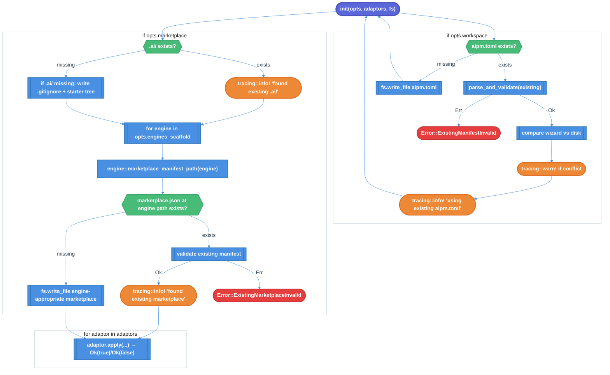

# Idempotent `aipm init` — Engine-Aware Marketplace Scaffolding & Existing-Artifact Reuse

| Document Metadata      | Details                                                                            |
| ---------------------- | ---------------------------------------------------------------------------------- |
| Author(s)              | Sean Larkin                                                                        |
| Status                 | Draft (WIP)                                                                        |
| Team / Owner           | aipm core                                                                          |
| Created / Last Updated | 2026-05-08 / 2026-05-08                                                            |
| Issue                  | [#850](https://github.com/TheLarkInn/aipm/issues/850)                              |
| Research               | [`research/tickets/2026-05-08-0850-init-wizard-existing-artifacts.md`](../research/tickets/2026-05-08-0850-init-wizard-existing-artifacts.md) |

## 1. Executive Summary

Today, `aipm init` aborts with a hard error when any of `aipm.toml`, `.ai/`, or `.ai/.claude-plugin/marketplace.json` already exist at the project root. Issue #850 asks for the command to be **idempotent**: detect pre-existing artifacts, surface their presence as info-level `tracing` events, and continue scaffolding the parts that are still missing. This RFC turns the two existing hard-fail guards into log-and-continue paths, deletes the now-unreachable `Error::WorkspaceAlreadyInitialized` and `Error::MarketplaceAlreadyExists` variants, parses any pre-existing `aipm.toml` to warn on engine/workspace conflicts with wizard answers, and refactors `scaffold_marketplace` to write the **engine-appropriate** marketplace manifest path (e.g. `.claude-plugin/marketplace.json` for Claude, `.github/plugin/marketplace.json` for Copilot) via `engine::marketplace_manifest_path` instead of the current Claude-hardcoded path. Two unit tests flip from "rejects existing" to "is idempotent"; the existing BDD `tests/features/manifest/workspace-init.feature` gains scenarios for the three pre-existence cases. No behaviour change for the green-field path.

## 2. Context and Motivation

### 2.1 Current State

`aipm init` follows a clean three-layer flow (CLI → wizard → library):

```text
clap::Commands::Init { … }
  └─► cmd_init(flags, manifest, name, dir)            crates/aipm/src/main.rs:405-466
        ├─► wizard_tty::resolve(...)                  crates/aipm/src/wizard_tty.rs:40-81  (no FS effects)
        ├─► libaipm::workspace_init::init(&opts, …)   crates/libaipm/src/workspace_init/mod.rs:115-151
        │     ├─► [opts.workspace]   init_workspace        line 122  → mod.rs:157-177
        │     ├─► [opts.marketplace] scaffold_marketplace  line 127  → mod.rs:241-342
        │     └─► [for each adaptor] adaptor.apply         line 138  → adaptors/{claude,copilot}.rs
        └─► writeln!(stdout, "{msg}") for each InitAction  main.rs:445-464
```

Two existence guards live inside `libaipm::workspace_init`:

| Guard                              | Location                                       | Error                                        |
| ---------------------------------- | ---------------------------------------------- | -------------------------------------------- |
| `aipm.toml` at project root        | `workspace_init/mod.rs:162-165`                | `Error::WorkspaceAlreadyInitialized(PathBuf)` |
| `.ai/` directory at project root   | `workspace_init/mod.rs:249-252`                | `Error::MarketplaceAlreadyExists(PathBuf)`    |

A third artifact named in the issue — `.ai/.claude-plugin/marketplace.json` — has **no dedicated guard**. The `.ai/` parent guard fires first, so the marketplace.json write at `mod.rs:269-282` is unreachable when `.ai/` exists. When `.ai/` does **not** exist, that write is unconditional (no `fs.exists` check, no merge with prior plugin entries).

The marketplace manifest path is **hardcoded to Claude** at `mod.rs:280` (`.ai/.claude-plugin/marketplace.json`). The engine spec already exposes `engine::marketplace_manifest_path(Engine) -> &'static str` (`crates/libaipm/src/engine.rs:32-37`) that returns `.claude-plugin/marketplace.json` for Claude and `.github/plugin/marketplace.json` for Copilot — but `scaffold_marketplace` does not use it.

The CLI wraps the library `Error` via `CliError::WorkspaceInit(#[from] libaipm::workspace_init::Error)` (`crates/aipm/src/error.rs:14-16`) with `#[error(transparent)]`, so the user sees the raw `thiserror` `Display` strings:

- `already initialized: aipm.toml already exists in <dir>`
- `.ai/ marketplace already exists in <dir>`

### 2.2 The Problem

- **User Impact:** Users running `aipm init` in a directory that already has `.ai/` (e.g. an existing Copilot-only workspace they're now extending to Claude, or a workspace where someone hand-wrote a `.ai/` tree) get a hard error. They must delete or move the directory before init will run. The same applies if `aipm.toml` already exists from a prior partial init or hand-authored manifest.
- **Engine-routing Gap:** The hardcoded Claude path in `scaffold_marketplace` means a Copilot-first user gets a `.claude-plugin/marketplace.json` they didn't ask for. The `engine.rs` lookup that would route this correctly is unused by init.
- **Inconsistency vs. existing precedent:** Tool adaptors already implement non-fatal "skip-if-present" behavior — `Copilot::apply` returns `Ok(false)` when `.github/copilot-instructions.md` exists (`adaptors/copilot.rs:40-42`); `Claude::apply` merges into an existing `.claude/settings.json` (`adaptors/claude.rs:39-46`). Top-level `init_workspace` and `scaffold_marketplace` are the only layers that still hard-fail.

## 3. Goals and Non-Goals

### 3.1 Functional Goals

- [ ] G1: `aipm init` succeeds when `aipm.toml` already exists. Emits `tracing::info!(path = %manifest_path.display(), "using existing aipm.toml file")` and continues.
- [ ] G2: `aipm init` succeeds when `.ai/` already exists. Emits `tracing::info!(path = %ai_dir.display(), "found existing .ai/ marketplace")` and continues.
- [ ] G3: `aipm init` succeeds when the engine-appropriate marketplace manifest is missing inside an existing `.ai/`. Auto-creates it via the same engine-aware writer used in the green-field path.
- [ ] G4: `aipm init` emits `tracing::info!(path = %marketplace_path.display(), "found existing marketplace manifest")` when the engine-appropriate marketplace.json is already present and well-formed. Leaves it untouched.
- [ ] G5: When a pre-existing `aipm.toml` parses successfully, `init` compares the wizard's intended `engines` and `[workspace]` values against the on-disk manifest. Conflicts emit `tracing::warn!` with both values; init continues. Wizard answers do **not** overwrite the on-disk manifest when it pre-exists.
- [ ] G6: When a pre-existing `aipm.toml` is malformed (TOML parse error or schema validation failure), `init` surfaces a new `Error::ExistingManifestInvalid { path, source }` variant. This is the *only* hard-fail introduced by this RFC.
- [ ] G7: When a pre-existing engine-appropriate `marketplace.json` is malformed (JSON parse error or schema validation failure), `init` surfaces a new `Error::ExistingMarketplaceInvalid { path, source }` variant.
- [ ] G8: `scaffold_marketplace` writes the marketplace manifest at the path returned by `engine::marketplace_manifest_path(engine)` for **each** engine in `opts.engines_scaffold`, scoped under `.ai/`. The current Claude hardcode at `mod.rs:280` is removed.
- [ ] G9: Tool adaptors continue to run after the marketplace step (Claude → `.claude/settings.json`, Copilot → `.github/copilot-instructions.md`), unchanged from today's `Ok(false)` skip-when-exists semantics.
- [ ] G10: A new `InitAction` variant `MarketplaceFoundExisting` (or extension of the existing enum) is recorded so `cmd_init` can `writeln!(stdout, …)` a user-facing line such as `Using existing .ai/ marketplace at <path>`.
- [ ] G11: `crates/libaipm-engine-spec/build.rs:539` is corrected so `marketplace_manifest_path_for("claude")` returns `.claude-plugin/marketplace.json` (today returns `.claude-plugin/marketplace.toml`). `crates/libaipm-engine-spec/data/engine-api-schema.json` is regenerated and `schemas/engine-api.schema.json` is re-exported via `cargo run -p libaipm-engine-spec --bin export-schema` (per `CLAUDE.md` § "Schema export"). The existing `marketplace_manifest_path_returns_correct_path` test at `crates/libaipm/src/engine.rs:383-385` is updated to assert `.json`.
- [ ] G12: When neither `init_workspace` nor `scaffold_marketplace` produced a `*Created` action (i.e. both pre-existed), `init()` emits one tail `tracing::warn!` per run summarising the no-op outcome.

### 3.2 Non-Goals (Out of Scope)

- [ ] **Merging plugin entries** into an existing marketplace.json. If the user has a populated marketplace, we leave it alone. (Issue does not request a merge; deferring avoids designing a merge algorithm here.)
- [ ] **Validating the *content* of an existing `.ai/` tree** beyond the marketplace manifest itself. We do not check that the starter plugin tree is intact, that hooks are wired correctly, or that adaptor settings reference the right marketplace name.
- [ ] **Prompting the user** when conflicts are detected. The spec uses `tracing::warn!` only; no interactive `inquire::Confirm` round-trip. (Avoids needing TTY-vs-non-TTY branching for warnings.)
- [ ] **Migrating an existing `.ai/`** that uses an incorrect engine layout (e.g. a Claude-style tree under a Copilot-only project). That's an `aipm migrate` concern, not `aipm init`.
- [ ] **`aipm pack init`** behaviour — that flow uses a different `Error::AlreadyInitialized` in `crates/libaipm/src/init.rs` and is unaffected.
- [ ] **Adding a `--force` flag** to overwrite existing artifacts. Not in the issue; can be added later.

> **Note (added 2026-05-08 per Q9.4):** Fixing the schema/JSON drift on Claude's marketplace path **is in scope** for this RFC. See § 5.3 and Goal G11 below.

## 4. Proposed Solution (High-Level Design)

### 4.1 System Architecture Diagram

The CLI/wizard layer is unchanged. All behaviour changes are in `libaipm::workspace_init`. The new flow inside `init()` becomes:



### 4.2 Architectural Pattern

**Idempotent reconciliation** — for each artifact init is responsible for, check current state, take the minimum action needed, log the path of every artifact whether created or pre-existing. This mirrors the existing `ToolAdaptor::apply` contract (`Result<bool, Error>` where `Ok(false)` is "skip, no action recorded") and extends it inwards from the adaptor edge into the core `init_workspace` and `scaffold_marketplace` functions. Engine-aware marketplace paths are looked up via the existing `libaipm-engine-spec` const tables — no new tables, no new traits.

### 4.3 Key Components

| Component                                        | Responsibility                                                                       | Technology         | Justification                                                                  |
| ------------------------------------------------ | ------------------------------------------------------------------------------------ | ------------------ | ------------------------------------------------------------------------------ |
| `workspace_init::init`                           | Top-level orchestrator (unchanged signature)                                         | Rust               | Called from `cmd_init`; ABI must stay identical for the CLI binary.            |
| `workspace_init::init_workspace` (rewrite)       | Idempotent `aipm.toml` handling: detect, parse, warn-on-conflict                     | Rust + `tracing`   | Single function owns the manifest comparison; conflict warnings are advisory only. |
| `workspace_init::scaffold_marketplace` (rewrite) | Idempotent `.ai/` creation, **engine-aware** marketplace.json write per-engine       | Rust + `tracing`   | Replaces hardcoded Claude path with `engine::marketplace_manifest_path` lookup. |
| `workspace_init::Error` (variants change)        | Drop `WorkspaceAlreadyInitialized`, `MarketplaceAlreadyExists`; add two new variants | `thiserror`        | Old variants become unreachable; new ones cover the only remaining hard-fail (malformed existing files). |
| `workspace_init::InitAction` (extend)            | New `WorkspaceFoundExisting`, `MarketplaceFoundExisting` variants                    | Rust enum          | Lets `cmd_init` print user-visible "using existing X" lines via the existing `writeln!(stdout, …)` channel. |
| `engine::marketplace_manifest_path` (existing)   | Per-engine relative path to marketplace manifest                                     | `libaipm-engine-spec` const table | Already exists; this RFC's only consumer change is to **call** it. |

## 5. Detailed Design

### 5.1 API Interfaces

This RFC does not change any public CLI contract. `aipm init` accepts the same flags. The library `libaipm::workspace_init::init` keeps its existing signature:

```rust
pub fn init(
    opts: &Options<'_>,
    adaptors: &[Box<dyn ToolAdaptor>],
    fs: &dyn Fs,
) -> Result<InitResult, Error>
```

`Options` is unchanged. `InitResult` gains two enum variants and `Error` gains two while losing two:

```rust
// crates/libaipm/src/workspace_init/mod.rs
pub enum InitAction {
    WorkspaceCreated,
    WorkspaceFoundExisting,            // NEW — emitted instead of WorkspaceCreated when aipm.toml pre-exists
    MarketplaceCreated,
    MarketplaceFoundExisting,          // NEW — emitted when .ai/ pre-exists; emitted in addition to per-engine actions
    MarketplaceManifestWritten {       // NEW — engine-aware write event (one per engine in scaffold set when missing)
        engine: libaipm_engine_spec::Engine,
        path: PathBuf,
    },
    MarketplaceManifestFoundExisting { // NEW — engine-aware found event
        engine: libaipm_engine_spec::Engine,
        path: PathBuf,
    },
    ToolConfigured(String),            // unchanged
}
```

```rust
// crates/libaipm/src/workspace_init/error.rs
pub enum Error {
    // REMOVED: WorkspaceAlreadyInitialized(PathBuf)
    // REMOVED: MarketplaceAlreadyExists(PathBuf)

    /// I/O error.
    #[error("I/O error: {0}")]
    Io(#[from] std::io::Error),

    /// JSON parse error in an existing settings file.
    #[error("JSON parse error in {}: {source}", path.display())]
    JsonParse { path: PathBuf, source: serde_json::Error },

    /// NEW: An existing aipm.toml could not be parsed or validated.
    #[error("existing manifest at {} is invalid: {source}", path.display())]
    ExistingManifestInvalid {
        path: PathBuf,
        source: crate::manifest::error::Error,
    },

    /// NEW: An existing engine-appropriate marketplace manifest could not be parsed.
    #[error("existing marketplace manifest at {} is invalid: {source}", path.display())]
    ExistingMarketplaceInvalid {
        path: PathBuf,
        source: crate::marketplace::Error,
    },
}
```

The `CliError::WorkspaceInit` mapping in `crates/aipm/src/error.rs:14-16` is unchanged (`#[from]` works with the new shape).

### 5.2 Algorithms and State Management

#### 5.2.1 `init_workspace` — idempotent `aipm.toml`

**Pseudocode (replaces `mod.rs:157-177`):**

```rust
fn init_workspace(
    dir: &Path,
    engines_support: Option<libaipm_engine_spec::EngineSet>,
    fs: &dyn Fs,
) -> Result<InitWorkspaceOutcome, Error> {
    let manifest_path = dir.join("aipm.toml");

    if fs.exists(&manifest_path) {
        let content = fs.read_to_string(&manifest_path)?;
        let parsed = crate::manifest::parse_and_validate(&content, None)
            .map_err(|source| Error::ExistingManifestInvalid {
                path: manifest_path.clone(),
                source,
            })?;

        compare_and_warn(&parsed, engines_support, &manifest_path);
        tracing::info!(path = %manifest_path.display(), "using existing aipm.toml file");
        return Ok(InitWorkspaceOutcome::FoundExisting);
    }

    let content = generate_workspace_manifest(engines_support);
    crate::manifest::parse_and_validate(&content, None)
        .map_err(|e| std::io::Error::new(std::io::ErrorKind::InvalidData, e.to_string()))?;
    fs.create_dir_all(dir)?;
    fs.write_file(&manifest_path, content.as_bytes())?;
    tracing::info!(path = %manifest_path.display(), "created aipm.toml");
    Ok(InitWorkspaceOutcome::Created)
}
```

Where `compare_and_warn` is a new pure-function helper that emits one or more `tracing::warn!` events for each mismatch:

| Wizard intent (from `Options`)     | On-disk value (from parsed manifest)        | Action                                                     |
| ---------------------------------- | ------------------------------------------- | ---------------------------------------------------------- |
| `engines_support: Some(set)`       | `[workspace.engines]` differs               | `tracing::warn!(wizard = ?wizard_engines, on_disk = ?disk_engines, "engines field differs from wizard answer; on-disk value preserved")` |
| `engines_support: None` (omit)     | `[workspace.engines]` is set                | No warning. User said "no preference"; on-disk is authoritative. |
| `engines_support: Some(set)`       | `[workspace.engines]` is unset              | `tracing::warn!(wizard = ?wizard_engines, "wizard selected engines but on-disk manifest does not declare them; on-disk preserved")` |
| `Options.workspace == true`        | `[workspace]` table absent                  | `tracing::warn!(path = %manifest_path.display(), "wizard requested workspace but on-disk manifest is package-only")` |

The on-disk file is never modified when it pre-exists. The warning is informational; init continues to the marketplace phase.

#### 5.2.2 `scaffold_marketplace` — idempotent `.ai/` + engine-aware marketplace.json

**Pseudocode (replaces `mod.rs:241-342`):**

```rust
fn scaffold_marketplace(
    dir: &Path,
    no_starter: bool,
    manifest: bool,
    marketplace_name: &str,
    engines_scaffold: libaipm_engine_spec::EngineSet,
    engines_support: Option<libaipm_engine_spec::EngineSet>,
    fs: &dyn Fs,
    actions: &mut Vec<InitAction>,
) -> Result<(), Error> {
    let ai_dir = dir.join(".ai");
    let ai_existed = fs.exists(&ai_dir);

    if ai_existed {
        tracing::info!(path = %ai_dir.display(), "found existing .ai/ marketplace");
        actions.push(InitAction::MarketplaceFoundExisting);
    } else {
        fs.create_dir_all(&ai_dir)?;
        let gitignore = if no_starter { GITIGNORE_NO_STARTER } else { GITIGNORE_WITH_STARTER };
        fs.write_file(&ai_dir.join(".gitignore"), gitignore.as_bytes())?;
        actions.push(InitAction::MarketplaceCreated);
    }

    // Engine-aware marketplace.json scaffold — one per engine in the scaffold set.
    for engine in libaipm_engine_spec::Engine::ALL.iter().copied()
        .filter(|e| engines_scaffold.contains(e.as_set()))
    {
        let rel = libaipm::engine::marketplace_manifest_path(engine);
        if rel.is_empty() { continue; }                          // engine has no marketplace path
        let manifest_path = ai_dir.join(rel);
        let parent = manifest_path.parent().unwrap_or(&ai_dir);

        if fs.exists(&manifest_path) {
            // Validate existing manifest — surface a typed error if malformed.
            let content = fs.read_to_string(&manifest_path)?;
            let _parsed = crate::marketplace::parse(&content)
                .map_err(|source| Error::ExistingMarketplaceInvalid {
                    path: manifest_path.clone(),
                    source,
                })?;
            tracing::info!(
                engine = engine.name(),
                path = %manifest_path.display(),
                "found existing marketplace manifest",
            );
            actions.push(InitAction::MarketplaceManifestFoundExisting {
                engine, path: manifest_path,
            });
        } else {
            fs.create_dir_all(parent)?;
            let initial_plugins = if no_starter { vec![] } else { vec![STARTER_ENTRY] };
            fs.write_file(
                &manifest_path,
                crate::generate::marketplace::create(marketplace_name, &initial_plugins).as_bytes(),
            )?;
            tracing::info!(
                engine = engine.name(),
                path = %manifest_path.display(),
                "created marketplace manifest",
            );
            actions.push(InitAction::MarketplaceManifestWritten {
                engine, path: manifest_path,
            });
        }
    }

    // Starter plugin tree is only written when (a) starter is enabled AND (b) .ai/ did not pre-exist.
    if !no_starter && !ai_existed {
        write_starter_plugin_tree(&ai_dir, manifest, engines_support, fs)?;
    }

    Ok(())
}
```

**Key design points for §5.2.2:**

1. **Per-engine fan-out.** When the user picks `--engine claude,copilot`, init writes both `.ai/.claude-plugin/marketplace.json` and `.ai/.github/plugin/marketplace.json`. (Today only one is written, regardless of selection.)
2. **Starter plugin only on green-field.** When `.ai/` pre-exists, we do not touch the starter plugin tree. Adding plugins to an existing marketplace is an explicit `aipm install` / `aipm pack init` concern.
3. **`engines_scaffold` is the source of truth for which marketplace files to write.** This mirrors how adaptors are filtered at `mod.rs:141-143`.
4. **`engines_scaffold == EngineSet::ALL` (default)** → writes marketplace.json for *every* engine that has a non-empty `marketplace_manifest_path`. Explicitly desired by the issue's "engine-appropriate subfolder" framing and aligns with the existing `--engine` semantics that already accept multi-engine values.

#### 5.2.3 Public output via `cmd_init`

The CLI binary at `crates/aipm/src/main.rs:445-464` extends its match to handle the new `InitAction` variants. Each line goes through the existing `writeln!(stdout, …)` channel so the no-`println!` lint stays green:

```rust
let msg = match action {
    InitAction::WorkspaceCreated         => format!("Initialized workspace in {}", dir.display()),
    InitAction::WorkspaceFoundExisting   => format!("Using existing aipm.toml in {}", dir.display()),
    InitAction::MarketplaceCreated       => format!("Created .ai/ marketplace '{}' (no starter)", &answers.marketplace_name),
    InitAction::MarketplaceFoundExisting => format!("Using existing .ai/ marketplace in {}", dir.display()),
    InitAction::MarketplaceManifestWritten { engine, path }       =>
        format!("Wrote {} marketplace manifest at {}", engine.display_name(), path.display()),
    InitAction::MarketplaceManifestFoundExisting { engine, path } =>
        format!("Found existing {} marketplace manifest at {}", engine.display_name(), path.display()),
    InitAction::ToolConfigured(name) => format!("Configured {name} settings"),
};
let _ = writeln!(stdout, "{msg}");
```

(The "no starter" / "with starter" branch on `MarketplaceCreated` is kept; the existing test snapshots that depend on it are untouched.)

### 5.3 Data Model / Schema

The on-the-wire shape of `aipm.toml`, `.ai/.claude-plugin/marketplace.json`, and `.ai/.github/plugin/marketplace.json` is unchanged.

**Schema fix (per Q9.4):** `crates/libaipm-engine-spec/build.rs:537-543` currently maps `"claude"` to `.claude-plugin/marketplace.toml`. This is corrected to `.claude-plugin/marketplace.json` to match the actual on-disk format Claude consumes. Workflow:

1. Edit `marketplace_manifest_path_for` in `build.rs:537-543` to return `.json` for `"claude"`.
2. Regenerate `crates/libaipm-engine-spec/data/engine-api-schema.json` by allowing the next `reverse-binary-analysis` run, OR hand-edit it now if the only change is this single field. (Verify in PR — the file is data-driven and may have multiple references.)
3. Run `cargo run -p libaipm-engine-spec --bin export-schema` to refresh `schemas/engine-api.schema.json`.
4. Update the assertion at `crates/libaipm/src/engine.rs:384` from `.toml` to `.json`.
5. The `tests/schema_export_drift.rs` integration test (per CLAUDE.md) must remain green.
6. **`META_SCHEMA_VERSION` bump:** likely **not** required — this is a value correction within an existing field, not a structural shape change. If `build.rs`'s validator at compile-time refuses to load a value-corrected `data/engine-api-schema.json`, then the bump is needed; otherwise skip.

No `aipm.toml` schema bump is required — the manifest format is unchanged.

## 6. Alternatives Considered

| Option                                                                          | Pros                                                                                       | Cons                                                                                                                       | Reason for Rejection                                                                                                                                              |
| ------------------------------------------------------------------------------- | ------------------------------------------------------------------------------------------ | -------------------------------------------------------------------------------------------------------------------------- | ----------------------------------------------------------------------------------------------------------------------------------------------------------------- |
| Pure log-and-skip (do nothing else when `.ai/` exists)                          | Simplest implementation. Smallest diff.                                                    | A user with an empty `.ai/` (e.g. just-created by another tool) would be left without *any* marketplace.json, and adaptors would still run pointing at a non-existent file. | Auto-repair (Q3 answer) handles this case correctly; pure skip leaves the workspace in a broken state.                                                            |
| Merge wizard answers into existing `aipm.toml` / marketplace.json               | Most "magical" — the user's wizard answers always take effect.                             | Requires a TOML/JSON merge algorithm with no clear ownership rules; can silently overwrite hand-authored values; needs new error variants for merge conflicts.            | Issue does not request a merge; warn-on-conflict is sufficient and reversible.                                                                                    |
| Add `--force` flag that overwrites everything                                   | Preserves the option to do destructive scaffolding when the user genuinely wants it.       | Doubles the test matrix; users will reach for `--force` reflexively when init fails for legitimate idempotency reasons.    | Not in the issue; we can add it later if a real use case appears. Default idempotency removes the most common reason to need `--force`.                            |
| Keep `Error::WorkspaceAlreadyInitialized` and `MarketplaceAlreadyExists` for an `init_strict()` variant | Backwards-compatible for any library consumer that wants the old behavior.        | No such consumer exists in the repo today; keeps two error variants that exist purely as reachability for a hypothetical future caller.                                  | YAGNI per CLAUDE.md ("Don't design for hypothetical future requirements"). User explicitly chose "Delete variants" for this exact reason.                          |
| Mark old error variants `#[deprecated]` instead of deleting                     | Soft transition path.                                                                      | Triggers `dead_code` warnings throughout the workspace; would require `#[allow(dead_code)]` which CLAUDE.md `allow_attributes` lint forbids.                              | Deletion is the cleaner path under this repo's lint policy.                                                                                                       |
| Engine-aware marketplace path **only** when `--engine` was explicit, hardcode Claude otherwise | Minimal disruption to existing snapshots.                                          | Behavior diverges based on flag combination; users get different output for default vs. explicit `--engine claude`.        | Cleaner to always use the lookup; the default `EngineSet::ALL` covers all engines uniformly.                                                                      |

## 7. Cross-Cutting Concerns

### 7.1 Security and Privacy

- **Path-traversal**: The new code reads from `dir.join(".ai")` and `dir.join("aipm.toml")` and from `engine::marketplace_manifest_path` (a `&'static str` const-table value). `Engine::ALL` is exhaustively enumerated by the engine spec, so the relative path cannot be attacker-controlled. No new untrusted-path surface is introduced.
- **TOCTOU**: Between the `fs.exists` check and the subsequent `read_to_string` / `write_file`, an attacker with write access to the project root could swap a file. This race exists today in the same code paths and is not new. Mitigation is the project's existing `crates/libaipm/src/path_security.rs` boundary helper, which is not invoked here because `dir` is already the user's CWD (a trust boundary).
- **No credential or PII handling.** This change touches only manifest scaffolding.

### 7.2 Observability Strategy

- **Tracing events introduced** (all `tracing::info!`):
  - `using existing aipm.toml file` — fields: `path`
  - `created aipm.toml` — fields: `path` (replaces today's silent write)
  - `found existing .ai/ marketplace` — fields: `path`
  - `found existing marketplace manifest` — fields: `engine`, `path`
  - `created marketplace manifest` — fields: `engine`, `path`
- **Warn events introduced** (all `tracing::warn!`):
  - `engines field differs from wizard answer; on-disk value preserved` — fields: `wizard`, `on_disk`
  - `wizard selected engines but on-disk manifest does not declare them; on-disk preserved` — fields: `wizard`
  - `wizard requested workspace but on-disk manifest is package-only` — fields: `path`
- **No metrics** added — the workspace does not currently emit Prometheus/OTel metrics.
- **File-layer logging** (rolling daily file at `<temp_dir>/aipm-YYYY-MM-DD.log`, set up at `crates/libaipm/src/logging.rs:67-86`) captures all of the above at `DEBUG` retention for 7 days, giving us a forensic trail without any new infra.

### 7.3 Scalability and Capacity Planning

Not applicable. This is a CLI scaffolding command run interactively; it executes on a single user's machine and creates O(engines) files (currently O(1)–O(2)).

## 8. Migration, Rollout, and Testing

### 8.1 Deployment Strategy

This change ships in the next `aipm` CLI release. There is no service to deploy and no flag to gate the behavior — `aipm init` is interactive and per-user, so a "shadow mode" rollout is unnecessary. The breaking-change surface is:

- **CLI exit-code change**: `aipm init` over an existing `.ai/` or `aipm.toml` previously exited non-zero; it now exits zero. This is the intended change. Anyone scripting around the failure (e.g. `aipm init || echo 'already initialized'`) will see different behavior.
- **Library API change**: `Error::WorkspaceAlreadyInitialized` and `Error::MarketplaceAlreadyExists` are removed. The crate is `libaipm`; per `crates/libaipm/CHANGELOG.md`, breaking changes there warrant a minor-version bump (workspace is pre-1.0).
- **Stdout output change**: New "Using existing X" lines appear. Tests that assert exact stdout must be updated (covered in §8.3).

A `crates/libaipm/CHANGELOG.md` entry is required noting the variant removal and the new variants. A `crates/aipm/CHANGELOG.md` entry is required noting the behavior change.

### 8.2 Data Migration Plan

None. No persisted state migrates. Users with existing `.ai/` trees see no on-disk changes after running `aipm init` — the first run with the new behavior leaves their tree untouched. A second run after they delete and re-run init will see green-field behavior identical to today.

### 8.3 Test Plan

#### Unit tests (`crates/libaipm/src/workspace_init/mod.rs`)

| Existing test                              | Action                                                                                                                                      |
| ------------------------------------------ | ------------------------------------------------------------------------------------------------------------------------------------------- |
| `init_workspace_rejects_existing` (line 583) | **Rename** to `init_workspace_is_idempotent_when_aipm_toml_exists`. Assert `Ok(_)` and that the existing file is bytewise unchanged.        |
| `init_marketplace_rejects_existing` (line 607) | **Rename** to `init_marketplace_is_idempotent_when_ai_exists`. Assert `Ok(_)` and that the existing `.ai/` is bytewise unchanged.            |
| `init_both_creates_everything` (line 630)  | Unchanged.                                                                                                                                  |

| New test                                                | Coverage                                                                                                                                            |
| ------------------------------------------------------- | --------------------------------------------------------------------------------------------------------------------------------------------------- |
| `init_idempotent_writes_missing_engine_marketplace`     | `.ai/` exists with no `.claude-plugin/`; init with `--engine claude` writes only `.ai/.claude-plugin/marketplace.json`; existing files untouched.    |
| `init_idempotent_per_engine_fan_out`                    | `--engine claude,copilot` over an existing `.ai/`: writes both engine paths; emits both `MarketplaceManifestWritten` actions.                       |
| `init_idempotent_skips_existing_engine_marketplace`     | Both engine paths pre-exist with valid content; init writes nothing; emits both `MarketplaceManifestFoundExisting` actions.                          |
| `init_existing_aipm_toml_warns_on_engine_conflict`      | Existing `aipm.toml` declares `engines = ["claude"]`; wizard chose `["copilot"]`. Init returns `Ok(_)`; on-disk file unchanged; assert via `tracing-test` that a `WARN` event was emitted with both values. |
| `init_existing_aipm_toml_invalid_returns_typed_error`   | Existing `aipm.toml` is malformed TOML; init returns `Err(Error::ExistingManifestInvalid { path, .. })`.                                            |
| `init_existing_marketplace_invalid_returns_typed_error` | Valid `.ai/`, malformed `.ai/.claude-plugin/marketplace.json`; init returns `Err(Error::ExistingMarketplaceInvalid { path, .. })`.                  |

#### Logging-assertion infrastructure

`tracing` events are not captured by default in `cargo test`. We will add `tracing-test = "0.2"` (or equivalent — see Open Question 9.1) as a `[dev-dependencies]` entry in `crates/libaipm/Cargo.toml`. The crate's `#[traced_test]` attribute wraps tests with a subscriber and exposes `logs_contain(&str)` for assertions. No production-code change required; no new lint suppressions needed.

#### Integration / E2E tests (`crates/aipm/tests/init_e2e.rs`)

Add three new scenarios (each runs the real `aipm init` binary via `assert_cmd`):

1. `init_succeeds_with_existing_ai_directory` — pre-create `.ai/`, run `aipm init -y --marketplace`, assert exit 0 and stdout contains `Using existing .ai/ marketplace`.
2. `init_succeeds_with_existing_aipm_toml` — pre-create `aipm.toml`, run `aipm init -y --workspace`, assert exit 0 and stdout contains `Using existing aipm.toml`.
3. `init_per_engine_marketplace_paths` — `--engine claude,copilot --marketplace -y`, assert both `.ai/.claude-plugin/marketplace.json` and `.ai/.github/plugin/marketplace.json` exist after the run.

Update `init_engine_e2e.rs` if any scenario asserts the old hardcoded path on a single engine.

#### BDD (`tests/features/manifest/workspace-init.feature`)

Add a new scenario block:

```gherkin
  Scenario: aipm init is idempotent when .ai already exists
    Given a workspace with a populated ".ai/" tree
    When I run "aipm init -y --marketplace"
    Then the command exits successfully
    And stdout contains "Using existing .ai/ marketplace"
    And the ".ai/" tree is unchanged

  Scenario: aipm init is idempotent when aipm.toml already exists
    Given a workspace with an existing root "aipm.toml"
    When I run "aipm init -y --workspace"
    Then the command exits successfully
    And stdout contains "Using existing aipm.toml"
    And the existing "aipm.toml" is unchanged

  Scenario: aipm init writes engine-appropriate marketplace per engine
    Given a clean workspace
    When I run "aipm init -y --marketplace --engine claude,copilot"
    Then the command exits successfully
    And the file ".ai/.claude-plugin/marketplace.json" exists
    And the file ".ai/.github/plugin/marketplace.json" exists

  Scenario: aipm init reports an existing engine marketplace
    Given a workspace with ".ai/.claude-plugin/marketplace.json" already populated
    When I run "aipm init -y --marketplace --engine claude"
    Then the command exits successfully
    And stdout contains "Found existing Claude marketplace manifest"
    And the file ".ai/.claude-plugin/marketplace.json" is unchanged

  Scenario: aipm init surfaces a typed error for malformed existing aipm.toml
    Given a workspace with a malformed root "aipm.toml"
    When I run "aipm init -y --workspace"
    Then the command exits with non-zero status
    And stderr contains "existing manifest at"
    And stderr contains "is invalid"
```

Step definitions go into `crates/libaipm/tests/bdd.rs` near the existing init helpers (line ~459).

#### Snapshot tests

The wizard's `insta` snapshots in `crates/aipm/src/snapshots/` capture prompt-list and resolved-answer outputs only — none of them depend on the existence-check behaviour. **No snapshot updates expected.** If `cargo insta review` reports drift, that drift is unintended and must be investigated.

#### Coverage gate

The 89% branch-coverage gate (`CLAUDE.md` "Coverage Commands") must hold after the change. The new `Error::ExistingManifestInvalid` and `Error::ExistingMarketplaceInvalid` arms each need at least one negative-path test (covered in the unit-test list above).

## 9. Open Questions / Unresolved Issues

### 9.1–9.5 Resolved (2026-05-08, author)

- [x] **9.1 Logging-assertion crate.** Use `tracing-test` with `#[traced_test]`. Add `tracing-test = "0.2"` under `[dev-dependencies]` in `crates/libaipm/Cargo.toml`. Tests that need event assertions use `#[traced_test]` plus `logs_contain(&str)`. Parallel-test-runner caveat is accepted; if it bites, fall back to a hand-rolled `#[cfg(test)]` `Layer`.
- [x] **9.2 Per-engine marketplace name.** Same `marketplace_name` from wizard answer used across all engine marketplace.json files. No per-engine suffix, no extra prompt.
- [x] **9.3 Empty `marketplace_manifest_path`.** Skip-with-warn: when `engine::marketplace_manifest_path(engine)` returns `""`, emit `tracing::warn!(engine = engine.name(), "engine has no marketplace manifest path; skipping")` and `continue` the loop. No file written, no error returned. Drift is visible in logs without coupling #850 to the weekly schema regeneration.
- [x] **9.4 Schema/JSON drift on Claude path.** **Fix the schema as part of #850.** Update `crates/libaipm-engine-spec/build.rs:539` so `marketplace_manifest_path_for("claude")` returns `.claude-plugin/marketplace.json` (not `.toml`). Regenerate `crates/libaipm-engine-spec/data/engine-api-schema.json` and `schemas/engine-api.schema.json` per the workflow in `CLAUDE.md` § "Schema export (libaipm-engine-spec)". After this fix, `scaffold_marketplace` can call `engine::marketplace_manifest_path` uniformly across all engines without a Claude special case. Bump `META_SCHEMA_VERSION` only if reverse-binary-analysis would not naturally re-emit the corrected `.json` value (this is a content fix, not a structural change, so a version bump is likely **not** needed — verify in the implementing PR).
- [x] **9.5 Both-exist UX.** Exit 0 with two `Using existing X` stdout lines (already in §5.2). **Additionally** emit `tracing::warn!(workspace = ?ws_outcome, marketplace = ?mp_outcome, "aipm init found nothing to do; both root manifest and .ai/ marketplace already exist")` at the tail of `init()` when neither phase produced a `*Created` action. Single warn per run.

### 9.6–9.7 Implementation-time verifications (not blocking)

- [ ] **9.6 `aipm.toml` parse-and-validate failure error wrapping.** `crate::manifest::parse_and_validate` returns `crate::manifest::error::Error`. Verify the type is `'static + Send + Sync` for `thiserror`'s `#[source]` wrapping. If not, add a `String`-based fallback.
- [ ] **9.7 BDD step naming collision.** Verify in `crates/libaipm/tests/bdd.rs` that the proposed phrases (`a workspace with a populated ".ai/" tree`, `a workspace with an existing root "aipm.toml"`, `a workspace with ".ai/.claude-plugin/marketplace.json" already populated`, `a workspace with a malformed root "aipm.toml"`) do not collide with existing step bindings. If they do, rename in the implementation PR.
